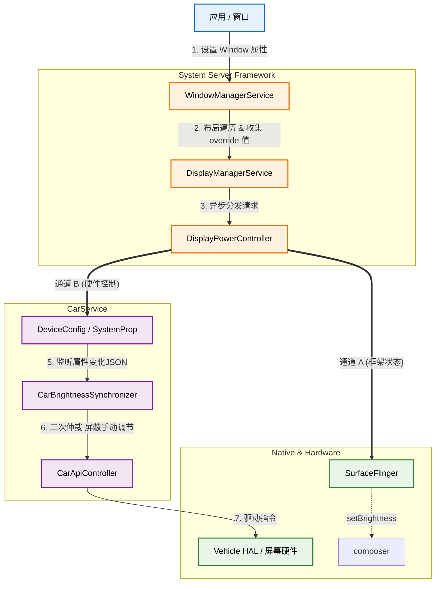

+++
date = '2025-09-29T10:22:54+08:00'
draft = true
title = 'SplitScreenController flow'
+++

# Android Window Brightness Override 技术实现细节深度解析

本文将深入剖析 Android 系统中 **Window Brightness Override**（窗口亮度覆盖）机制的实现原理。基于提供的系统源码文件（`RootWindowContainer.java`、`DisplayPowerController.java` 等），我们将详细还原从应用层发起请求到底层硬件执行的全链路流程，特别是针对包含 **Voyah Porting** 定制逻辑的实现进行重点分析。

## 架构



## 1. 机制概述

Window Brightness Override 允许当前前台窗口（Window）通过设置 `WindowManager.LayoutParams.screenBrightness` 来临时接管屏幕亮度控制权（例如视频播放器或二维码展示页面）。

在该定制实现中，整个流程表现为**“WMS 决策、DPC 仲裁、双通道下发”**的特征。

---

## 2. 核心调用流程详解

### 第一阶段：WMS 层的布局与决策

一切始于应用层调用 `Window.setAttributes()`，这会触发 `WindowManagerService` 的 `relayoutWindow`。真正的亮度决策逻辑发生在 WMS 的布局（Layout）阶段。

1. **触发布局**：WMS 主循环调用 `RootWindowContainer.performSurfacePlacementNoTrace()` 开始遍历窗口层级。
2. **数据收集**：
在 `performSurfacePlacementNoTrace` 中，代码会清理上一轮的缓存 `mDisplayBrightnessOverrides.clear()`，然后调用 `applySurfaceChangesTransaction()`。
在此过程中，系统遍历所有窗口，调用 `handleNotObscuredLocked` 方法。该方法会检查窗口是否可见、是否被遮挡，并提取 `w.mAttrs.screenBrightness`。如果该值在有效范围内（0.0-1.0），则将其存入 `mDisplayBrightnessOverrides` 稀疏数组中。
3. **异步发送**：
为了避免持有 WMS 全局锁时调用外部服务导致死锁，`RootWindowContainer` 并没有直接调用 DMS，而是通过内部的 `MyHandler` 发送消息：
```java
mHandler.obtainMessage(SET_SCREEN_BRIGHTNESS_OVERRIDE, mDisplayBrightnessOverrides.clone()).sendToTarget();

```


4. **跨服务调用**：
`MyHandler` 处理该消息，最终调用 `mWmService.mDisplayManagerInternal.setScreenBrightnessOverrideFromWindowManager(brightnessOverrides)`。

### 第二阶段：DMS 到 DPC 的异步分发

DisplayManagerService (DMS) 接收到覆盖请求后，会将其转发给对应的 `DisplayPowerController` (DPC)。

1. **DPC 接收消息**：DPC 的 `setBrightnessOverrideRequest` 方法被调用，它同样不直接处理，而是发送 `MSG_SET_WINDOW_MANAGER_BRIGHTNESS_OVERRIDE` 到 DPC 的 Handler 线程。
2. **策略更新**：
在 DPC 的 Handler 中，调用 `mDisplayBrightnessController.updateWindowManagerBrightnessOverride` 更新内部策略。如果覆盖值发生变化，则触发核心方法 `updatePowerState()`。

### 第三阶段：DPC 策略仲裁 (updatePowerState)

`updatePowerStateInternal()` 是 DPC 的心脏。在这里，系统决定最终使用哪个亮度值。

1. **PMS 请求 vs WMS 覆盖**：
通常 `PowerManagerService` 会发送一个 `DisplayPowerRequest`。但在 Window Override 场景下，PMS 发送的 `screenBrightnessOverride` 通常为 `NaN`（无效）。
2. **策略合并**：
DPC 内部逻辑会发现 PMS 的请求无效，转而使用从 WMS 接收并缓存的 `mWindowManagerBrightnessOverride`（例如 0.8）。
3. **计算最终值**：
经过自动亮度策略（此时被禁用）、HBM（高亮模式）限制、热缓解限制等计算后，得出最终的 `animateValue`（目标亮度）。

### 第四阶段：执行与双通道下发 (定制逻辑)

在标准的 AOSP 实现中，这里会启动一个 `RampAnimator` 进行平滑的亮度渐变。但在提供的代码中，我们观察到了显著的 **Voyah Porting** 定制修改。

代码调用了 `animateScreenBrightness`，但内部逻辑被修改为直接调用 `directSetScreenBrightness`。

```java
// DisplayPowerController.java 伪代码分析
private boolean directSetScreenBrightness(float targetBrightness, float sdrTarget, float rate) {
    // 1. 拦截检查 (如熄屏状态下不设置)
    if (shouldInterceptBrightnessSet(targetBrightness)) { return false; }

    // 2. 通道 A：直接下发硬件配置 (Real Hardware)
    boolean ret = BrightnessUtils.setBrightnessToConfig(mDisplayId, targetBrightness, reason);

    // 3. 通道 B：同步框架状态 (Framework State)
    if (mPowerState != null) {
        mPowerState.setScreenBrightness(targetBrightness);
        mPowerState.setSdrScreenBrightness(sdrTarget);
    }
    return true;
}

```

这一步实现了**“双通道下发”**：

* **通道 A (Hardware - 实)**：调用 `BrightnessUtils.setBrightnessToConfig`。这通常通过 Binder 调用底层的 CarService 或专用 HAL 接口，**直接驱动屏幕背光变化**。这种方式绕过了传统的 `LightsService`。
* **通道 B (Framework - 虚)**：调用 `mPowerState.setScreenBrightness`。这非常重要，它会触发 `PhotonicModulator` 线程，最终调用 `SurfaceControl.setDisplayBrightness`。虽然此时它不再负责驱动背光，但它**通知了 SurfaceFlinger 当前的亮度值**。这对于 HDR 色调映射、屏幕截图亮度和系统状态同步至关重要。

---

## 3. 完整实现时序图

以下是基于上述代码分析生成的精确时序图：

```plantuml
@startuml
!theme plain
autonumber

box "Application Process" #WhiteSmoke
    participant "Activity/Window" as App
end box

box "System Server: WindowManager" #MistyRose
    participant "WindowSurfacePlacer" as Placer
    participant "RootWindowContainer" as Root
    participant "RootWindowContainer\nMyHandler" as RootHandler
end box

box "System Server: PowerManager" #Lavender
    participant "PowerManagerService" as PMS
    participant "PowerGroup" as PG
end box

box "System Server: DisplayManager" #LightCyan
    participant "DisplayManagerInternal" as DMI
    participant "DisplayManagerService" as DMS
    participant "DisplayPowerController\n(DPC)" as DPC
    participant "DisplayControllerHandler" as DPCHandler
    participant "DisplayBrightness\nController" as DBC
    participant "DisplayPowerState" as DPS
end box

box "CarService" #MistyRose
    participant "BrightnessUtils" as Utils
    participant "DeviceConfig" as Config
    participant "CarBrightness\nSynchronizer" as CarSync
    participant "CarApiController" as CarCtrl
    participant "CarPropertyService" as CarProp
    ' participant "ICarPropertyEventListener" as Listener
end box

box "System Server: PhotonicModulator Thread" #Lavender
    participant "PhotonicModulator" as PM
    participant "DisplayBlanker" as Blanker
    participant "LocalDisplayDevice" as LDD
    participant "BacklightAdapter" as Backlight
end box

box "SurfaceFlinger (Native)" #WhiteSmoke
    participant "SurfaceControlProxy" as SC
end box

== 1. 应用层: 发起亮度覆盖 ==
App -> App: setAttributes(lp)\n[screenBrightness = 0.8]
App -> Placer: requestTraversal()
note right: Binder调用触发布局

== 2. WMS层: 布局与数据收集 ==
Placer -> Root: performSurfacePlacement()
activate Root
    Root -> Root: performSurfacePlacementNoTrace()
    
    group 收集 Override 数据
        Root -> Root: applySurfaceChangesTransaction()
        note right
            遍历所有 DisplayContent
            调用 handleNotObscuredLocked
            填充 mDisplayBrightnessOverrides
        end note
    end group

    Root -> RootHandler: sendMessage(SET_SCREEN_BRIGHTNESS_OVERRIDE)
    activate RootHandler
        note right
            异步发送，避免死锁
        end note
        
        RootHandler -> DMI: **setScreenBrightnessOverrideFromWindowManager(overrides)**
    deactivate RootHandler
deactivate Root

== 3. DMS -> DPC: 异步分发 ==
activate DMI
    DMI -> DMS: setScreenBrightnessOverrideFromWindowManager()
    activate DMS
        DMS -> DPC: setBrightnessOverrideRequest(request)
        activate DPC
            DPC -> DPCHandler: sendMessage(MSG_SET_WINDOW_MANAGER_BRIGHTNESS_OVERRIDE)
        deactivate DPC
    deactivate DMS
deactivate DMI

== 4. DPC层: 策略更新与执行 ==
activate DPCHandler
    DPCHandler -> DBC: **updateWindowManagerBrightnessOverride(request)**
    activate DBC
        note right:
        DBC --> DPCHandler: return true (Changed)
    deactivate DBC

    alt Value Changed (亮度变化)
        DPCHandler -> DPC: **updatePowerState()**
        activate DPC
            DPC -> DPC: updatePowerStateInternal()
            note right: 策略合并: Override(0.8) > PMS(NaN) => Target=0.8
            
            DPC -> DPC: animateScreenBrightness(target=0.8, ...)
            
            note right of DPC
                <color:red><b>定制逻辑 (Voyah Porting):</b></color>
                原生 RampAnimator 被移除
                改为直接调用 directSetScreenBrightness
            end note

            DPC -> DPC: **directSetScreenBrightness(0.8, ...)**
            activate DPC
                
                group A. 底层硬件下发 (Real Hardware)
                    DPC -> Utils: **setBrightnessToConfig(displayId, 0.8, reason)**
                    activate Utils
                        Utils -> Config: setProperty(NAMESPACE, KEY, json)
                        note right: 写入 DeviceConfig
                    deactivate Utils
                    
                    note over CarSync: 监听到 DeviceConfig 变化
                    Config -> CarSync: **onDisplayBrightnessRequested(properties)**
                    activate CarSync
                        CarSync -> CarSync: 解析 JSON (id, value, reason)
                        CarSync -> CarSync: **setBrightnessLocked**
                        
                        note right of CarSync
                            <b>仲裁逻辑:</b>
                            if (current == OVERRIDE && new == MANUAL)
                                return; // 忽略手动调节
                        end note
                        
                        CarSync -> CarCtrl: **setBrightness(type, val, reason)**
                        activate CarCtrl
                            CarCtrl -> CarCtrl: 构建 JSON {type, value, reason}
                            CarCtrl -> CarCtrl: setProperty(ID_BACKLIGHT_SET, json)
                            
                            CarCtrl -> CarProp: **setProperty(propertyValue, listener)**
                            activate CarProp
                                note right: 最终调用 VHAL
                            deactivate CarProp
                        deactivate CarCtrl
                    deactivate CarSync
                end group

                group B. 框架状态同步 (Framework State)
                    DPC -> DPS: **setScreenBrightness(0.8)**
                    activate DPS
                        note right
                            更新 PowerState 以触发 PhotonicModulator
                        end note
                        DPS -> PM: setState(state, 0.8, ...)
                        note right: 异步唤醒 PM 线程
                        PM --// DPS: notify
                    deactivate DPS
                end group
                
            deactivate DPC
        deactivate DPC
    end
deactivate DPCHandler

== 5. 异步: 标准显示链路更新 (Metadata) ==
note over PM: PhotonicModulator Thread
activate PM
    PM -> PM: run()
    PM -> Blanker: requestDisplayState(..., 0.8, ...)
    activate Blanker
        Blanker -> LDD: requestDisplayStateLocked(...)
        activate LDD
            note right: 构建 Runnable
        return workRunnable
        
        Blanker -> Blanker: workRunnable.run()
        activate Blanker
            Blanker -> LDD: setDisplayBrightness(0.8)
            activate LDD
                LDD -> Backlight: setBacklight(..., 0.8)
                activate Backlight
                    Backlight -> SC: **setDisplayBrightness(0.8)**
                    note right
                        通知 SurfaceFlinger 亮度值
                        (用于 HDR/截图/状态同步，非背光驱动)
                    end note
                deactivate Backlight
            deactivate LDD
        deactivate Blanker
    deactivate Blanker
deactivate PM
@enduml

```



## 4. 总结

该实现方案展示了典型的 Android 系统深度定制：

1. **解耦与异步**：WMS 通过 `MyHandler` 异步通知亮度变化，避免了繁重的锁竞争。
2. **绕过与直通**：DPC 劫持了标准的动画流程，通过 `BrightnessUtils` 实现了对硬件的直接、同步控制。
3. **状态一致性**：尽管硬件控制被接管，代码依然保留了对 `DisplayPowerState` 的更新，确保了 Android 上层框架（SurfaceFlinger）的数据一致性。