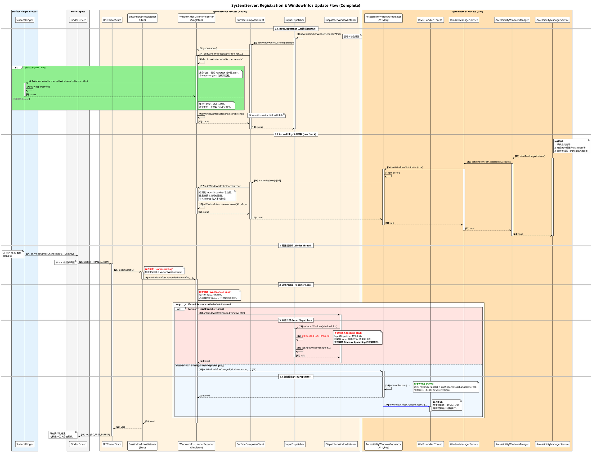

# Android Subsystem Wiki: WindowInfos Update Flow

## 1. 概述 (Overview)

**WindowInfos Update Flow** 是 Android 图形与输入系统协同工作的核心机制。它负责将 SurfaceFlinger (SF) 合成过程中产生的最新窗口属性（WindowInfo，如几何位置、Z-Order、透明度、触摸区域、焦点及其变换矩阵）实时同步给 SystemServer 进程。

主要消费者包括：

* **InputDispatcher (Native)**: 负责根据窗口信息计算触摸事件的目标窗口（Hit Testing）。
* **AccessibilityWindowsPopulator (Java)**: 负责为无障碍服务（A11y）构建屏幕内容的窗口节点树。

该机制的高效性直接决定了触摸响应的延迟和窗口焦点的准确性。由于涉及高频跨进程通信（IPC）和大数据量传输，它是系统稳定性问题（如 `DeadSystemException`、Binder 缓冲区耗尽）的高发区。

## 2. 核心架构与组件 (Architecture)

数据流向遵循 **Producer-Consumer** 模型，并通过 **WindowInfosListenerReporter** 实现多路复用。

### 2.1 发送端 (Producer: SurfaceFlinger)

* **触发源**: 每一帧合成（Vsync）后，若检测到图层属性变化 (`mVisibleRegionsDirty` 或 `mInputInfoChanged`)，触发更新。
* **异步发送**: 通过 `BackgroundExecutor` 线程发送，避免阻塞主渲染线程。
* **通信接口**: `IWindowInfosListener.onWindowInfosChanged` (AIDL)，定义为 `oneway`（非阻塞），允许极高的发送频率。

### 2.2 中转与分发 (Transport & Dispatch: SystemServer)

* **WindowInfosListenerReporter (Native)**:
* **角色**: SystemServer 进程内的单例 Binder Stub (`BnWindowInfosListener`)。
* **职责**: 它是 SystemServer 与 SurfaceFlinger 之间**唯一**的 Binder 通道。负责接收跨进程数据，并**同步**分发给进程内注册的所有监听器。

### 2.3 接收端 (Consumers)

1. **InputDispatcher (Native)**:
* **行为**: **同步阻塞**。在回调中必须获取全局锁 `mLock` 以更新窗口状态。这是性能瓶颈所在。

2. **AccessibilityWindowsPopulator (Java)**:
* **行为**: **异步非阻塞**。通过 JNI 接收回调后，立即通过 `Handler.post` 将繁重逻辑转移至 WMS 线程，不占用 Binder 线程。

## 3. 详细时序流程 (Sequence Diagram)

下图展示了从 InputDispatcher 注册监听，到 SurfaceFlinger 分发数据，再到不同消费者处理数据的完整时序。

