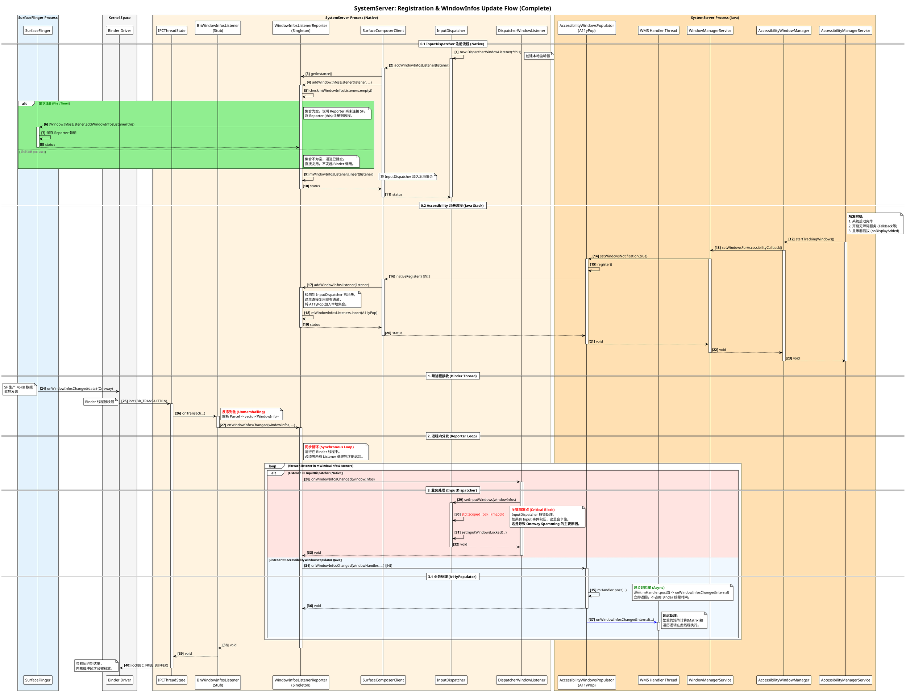
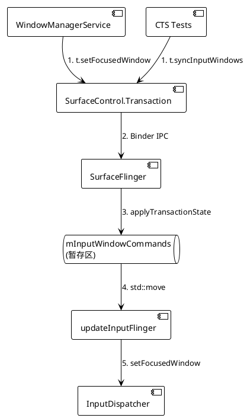

+++
date = '2025-09-29T10:22:54+08:00'
draft = false
title = 'WindowInfos Update Flow'
+++

## 1. 概述 (Overview)

**WindowInfos Update Flow** 是 Android 图形与输入系统协同工作的核心机制。它负责将 SurfaceFlinger (SF) 合成过程中产生的最新窗口属性（WindowInfo，如几何位置、Z-Order、透明度、触摸区域、焦点及其变换矩阵）实时同步给 SystemServer 进程。

主要消费者包括：

* **InputDispatcher (Native)**: 负责根据窗口信息计算触摸事件的目标窗口（Hit Testing）。
* **AccessibilityWindowsPopulator (Java)**: 负责为无障碍服务（A11y）构建屏幕内容的窗口节点树。

该机制的高效性直接决定了触摸响应的延迟和窗口焦点的准确性。由于涉及高频跨进程通信（IPC）和大数据量传输，它是系统稳定性问题（如 `DeadSystemException`、Binder 缓冲区耗尽）的高发区。

## 2. 核心架构与组件 (Architecture)

数据流向遵循 **Producer-Consumer** 模型，并通过 **WindowInfosListenerReporter** 实现多路复用。

### 2.1 发送端 (Producer: SurfaceFlinger)

* **触发源**: 每一帧合成（Vsync）后，若检测到图层属性变化 (`mVisibleRegionsDirty` 或 `mInputInfoChanged`)，触发更新。
* **异步发送**: 通过 `BackgroundExecutor` 线程发送，避免阻塞主渲染线程。
* **通信接口**: `IWindowInfosListener.onWindowInfosChanged` (AIDL)，定义为 `oneway`（非阻塞），允许极高的发送频率。

### 2.2 中转与分发 (Transport & Dispatch: SystemServer)

* **WindowInfosListenerReporter (Native)**:
* **角色**: SystemServer 进程内的单例 Binder Stub (`BnWindowInfosListener`)。
* **职责**: 它是 SystemServer 与 SurfaceFlinger 之间**唯一**的 Binder 通道。负责接收跨进程数据，并**同步**分发给进程内注册的所有监听器。

### 2.3 接收端 (Consumers)

1. **InputDispatcher (Native)**:
* **行为**: **同步阻塞**。在回调中必须获取全局锁 `mLock` 以更新窗口状态。这是性能瓶颈所在。

2. **AccessibilityWindowsPopulator (Java)**:
* **行为**: **异步非阻塞**。通过 JNI 接收回调后，立即通过 `Handler.post` 将繁重逻辑转移至 WMS 线程，不占用 Binder 线程。


## 3. 详细时序流程 (Sequence Diagram)

下图展示了从 InputDispatcher 注册监听，到 SurfaceFlinger 分发数据，再到不同消费者处理数据的完整时序。



## 4. SurfaceFlinger::updateInputFlinger 工作原理与调用时序

**1. 概述**

`SurfaceFlinger::updateInputFlinger()` 是 Android 图形系统（SurfaceFlinger）向输入系统（InputFlinger/SystemServer）同步窗口信息的核心枢纽。

它的主要职责是：在图形合成（Composition）流程中，将当前的图层（Layer）状态“翻译”成输入系统能理解的 `WindowInfo`（包含窗口位置、触摸区域、标志位等），并发送给 InputDispatcher，以确保触摸事件能准确分发给用户看到的那个窗口。

**2. 核心工作原理**

`updateInputFlinger` 的执行逻辑设计得非常谨慎，以避免不必要的计算和跨进程通信（IPC）。

其内部工作流程如下：

* **Step 1: 检查更新条件 (Check Dirty Flags)**
  * 函数首先检查两个关键的脏标记（Dirty Flags）：
  * `mVisibleRegionsDirty`: 表示图层的几何属性（位置、大小、矩阵）、Z-Order 或可见性发生了变化。这通常意味着窗口的“可触摸区域”变了。
  * `mInputInfoChanged`: 表示图层的纯输入属性（如 `InputConfig`、Token、Title 等）发生了变化。
  * **只有**当这两者之一为 `true` 时，才会触发窗口信息的重新构建。

* **Step 2: 构建窗口信息 (Build Window Infos)**
  * 如果需要更新 (`updateWindowInfo = true`)，调用 `buildWindowInfos(windowInfos, displayInfos)`。
  * buildWindowInfos 的核心任务是将 SurfaceFlinger 的图层树（Layer Hierarchy）扁平化为 InputDispatcher 能理解的窗口列表。
    它的工作流程大致如下：
    * 遍历 (Traversal): 它会遍历当前所有 Display 的图层。通常是按照 Z-Order (从上到下 或 从下到上) 进行遍历。InputDispatcher 需要的是从前向后（Front-to-Back）的列表以便进行点击测试（Hit Test），或者 SF 提供列表后由 InputDispatcher 排序。
    * 数据转换 (Translation): 对于每一个可见的 Layer，它会调用类似 Layer::writeToWindowInfo 的方法，提取以下关键信息
      * Token: 窗口的唯一标识（Binder 句柄）。
      * Name: 窗口名字（如 "com.cockpit.camera/..."）。
      * Flags: InputWindowHandle::InputConfig，例如是否可触摸、是否是 Spy Window、是否遮挡下方等。
      * TouchableRegion: 经过裁剪（Crop）和父图层变换后的最终触摸区域。
      * Transform: 将图层坐标系映射到屏幕坐标系的矩阵。
      * Alpha/Visibility: 只有可见且 Alpha 大于阈值的图层才会生成有效的 WindowInfo。
      * 聚合 (Aggregation): 将所有生成的 WindowInfo 对象放入 std::vector<WindowInfo> 中，同时收集对应的 DisplayInfo（屏幕尺寸、旋转方向等）。
      * 总结: 这是一个“翻译”过程，把图形系统的图层属性翻译成输入系统的窗口属性。

* **Step 3: 检查命令队列 (Check Commands)**
  * 除了窗口信息更新，该函数还处理来自 WindowManagerService (WMS) 的输入命令，例如“设置焦点窗口”（Focus Request）。这些命令存储在 `mInputWindowCommands` 中。当 WMS 决定改变当前焦点窗口时（例如用户启动了新 App，或者点击了某个窗口），WMS 不会直接调用 InputDispatcher，而是通过 SurfaceComposerClient::Transaction 发送一个 requestFocus 命令给 SurfaceFlinger。
  流程如下:
    * WMS 调用 t.setFocusedWindow(token, ...)。
    * 该命令随 Transaction 发送到 SurfaceFlinger。
    * SurfaceFlinger 在应用 Transaction 时，将这个请求解析并放入 mInputWindowCommands.focusRequests 队列中。
    * 在 updateInputFlinger 执行时，SF 将这个请求转发给 InputDispatcher。
    * 总结: 这是一个“旁路”机制。大部分帧里这个 list 是空的；只有在发生窗口焦点切换（Focus Switch）的那一帧，这个循环才会执行。
  * **快速返回**: 如果既不需要更新窗口信息，也没有输入命令要处理，函数直接返回，不消耗任何资源。


* **Step 4: 异步发送 (Async Dispatch)**
  * 为了不阻塞 SurfaceFlinger 的主渲染线程（Main Thread），所有与 InputFlinger 的交互（IPC）都被封装在一个 Lambda 表达式中，并投递给 `BackgroundExecutor` 线程执行。
  * **数据移动**: 使用 `std::move` 将构建好的 `windowInfos` 大数据块移动到 Lambda 捕获列表中，避免内存拷贝。


* **Step 5: 跨进程通信 (IPC)**
  * 在后台线程中，调用 `mWindowInfosListenerInvoker->windowInfosChanged(...)`。
  * 这会触发 Binder 驱动，将数据发送给 SystemServer 进程中的 `WindowInfosListenerReporter`，最终到达 `InputDispatcher`。

* **Step 6: 处理焦点请求 (Handle Focus)**
  * 如果在同一帧中有焦点切换请求 (`inputWindowCommands.focusRequests`)，也会在后台线程中同步调用 `inputFlinger->setFocusedWindow`。

**3. 调用时序与上下文 (Call Stack & Context)**

`updateInputFlinger` 并非孤立执行，它是 SurfaceFlinger 主合成循环（Main Loop）中不可或缺的一环。

* **触发源**: VSYNC 信号 -> `MessageQueue::Handler::handleMessage`。
* **入口**: `SurfaceFlinger::commit`。这是每帧合成的核心函数。

**完整调用链分析：**

1. **VSYNC 到达**: 硬件或软件 VSYNC 信号触发，调用 `MessageQueue::handleMessage`。
2. **开始提交 (Commit)**: `handleMessage` 调用 `compositor.commit`，即 `SurfaceFlinger::commit`。
3. **事务处理 (Transaction Handling)**:
   * `commitTransactions()`: 处理来自应用和 SystemServer 的 Binder 事务（如窗口移动、大小改变）。这是导致 `mVisibleRegionsDirty` 变脏的主要原因。
4. **几何更新 (Geometry Update)**:
   * `updateLayerGeometry()`: 根据新的事务状态，重新计算所有图层的可见区域和变换矩阵。
5. **输入更新 (Input Update)**:
   * **`updateInputFlinger()` 被调用**。
   * **位置关键**: 它被特意安排在 `commitTransactions` 和 `updateLayerGeometry` **之后**。
   * **原因**: 必须先处理完所有的窗口变换和层级调整，确认了最终每一层都在哪、谁遮挡了谁，才能生成准确的 InputWindowInfo。
6. **通知追踪 (Tracing)**:
   * 如果有需要，通知 `LayerTracing` 记录当前帧状态。

**4. 总结图示**

```
VSYNC Signal
  ↓
MessageQueue::handleMessage()
  ↓
SurfaceFlinger::commit()
  ↓
  ├── commitTransactions()      <-- 应用改变窗口属性 (Set Dirty Flags)
  ↓
  ├── updateLayerGeometry()     <-- 计算最终图层位置
  ↓
  ├── updateInputFlinger()      <-- [本文角主角]
  │     ↓
  │     若 (Dirty): 构建 WindowInfo
  │     ↓
  │     BackgroundExecutor (异步线程)
  │     ↓
  │     Binder Call -> SystemServer (InputDispatcher)
  ↓
  └── (后续流程) composite() -> 提交给 HWC/GPU

```

## 5. 附录

### InputWindowCommands的简介
`InputWindowCommands` 的直接来源是 **SurfaceComposerClient::Transaction**（即跨进程的 Binder 事务）。

归根结底，它是 **WindowManagerService (WMS)**（以及其他系统组件）用来“遥控” InputDispatcher 的一种手段，但必须经过 SurfaceFlinger 中转。

以下是详细的来源分析：

#### 1. 数据的源头：WindowManagerService (WMS)

WMS 是窗口管理的权威，它决定了哪个窗口应该获得焦点，或者何时需要同步输入状态。

* **场景 A：设置焦点 (Focus Requests)**
当用户点击某个窗口，或者 App 启动时，WMS 计算出新的焦点窗口。
WMS 会调用 `SurfaceControl.Transaction` 的 API：
```java
// Java 层 (WindowManagerService)
transaction.setFocusedWindow(windowToken, displayId, ...);

```

* **场景 B：同步输入 (Sync Input Windows)**
通常用于测试（CTS）或特殊的同步绘制场景（BLASTSync）。客户端希望确保 InputDispatcher 已经收到了最新的窗口信息。
```java
// Java 层
transaction.syncInputWindows();

```

#### 2. 传输通道：Binder Transaction

这些命令被序列化到 `Transaction` 对象中，通过 Binder 发送给 SurfaceFlinger。
`mInputWindowCommands` 是 `SurfaceFlinger` 类的一个成员变量，它充当了一个**暂存区**。

#### 3. 收集过程：SurfaceFlinger::applyTransactionState

当 SurfaceFlinger 接收并应用这些 Transaction 时，会将命令提取出来并合并到 `mInputWindowCommands` 中。

**流程如下：**

1. **接收事务**: `SurfaceFlinger::setTransactionState` 收到 Binder 调用。
2. **应用事务**: 在主线程调用 `applyTransactionState` 处理所有挂起的 Transaction。
3. **提取命令**: 遍历 Transaction 中的 `InputWindowCommands`。
   * 如果是 `focusRequests`，则 `push_back` 到 `mInputWindowCommands.focusRequests` 列表。
   * 如果是 `syncInputWindows`，则设置 `mInputWindowCommands.syncInputWindows = true`。

#### 4. 消费过程：updateInputFlinger

* 在每一帧合成时，`updateInputFlinger` 会读取这个暂存区。
* **关键动作**: `inputWindowCommands = std::move(mInputWindowCommands)`。
它使用 `std::move` 将所有积累的命令“偷”走传给后台线程，然后立刻 `clear()` 清空暂存区，为下一帧做准备。

#### 总结图示



**总结：**
`InputWindowCommands` 是 WMS 等客户端通过 **Transaction** 捎带给 SurfaceFlinger 的指令包，暂存在 SurfaceFlinger 中，并在下一帧合成时转发给 InputDispatcher。