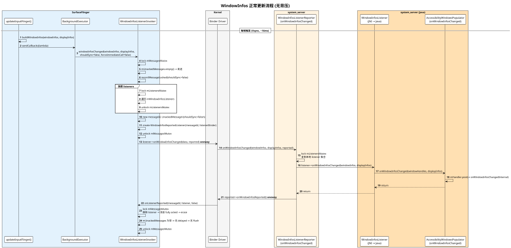
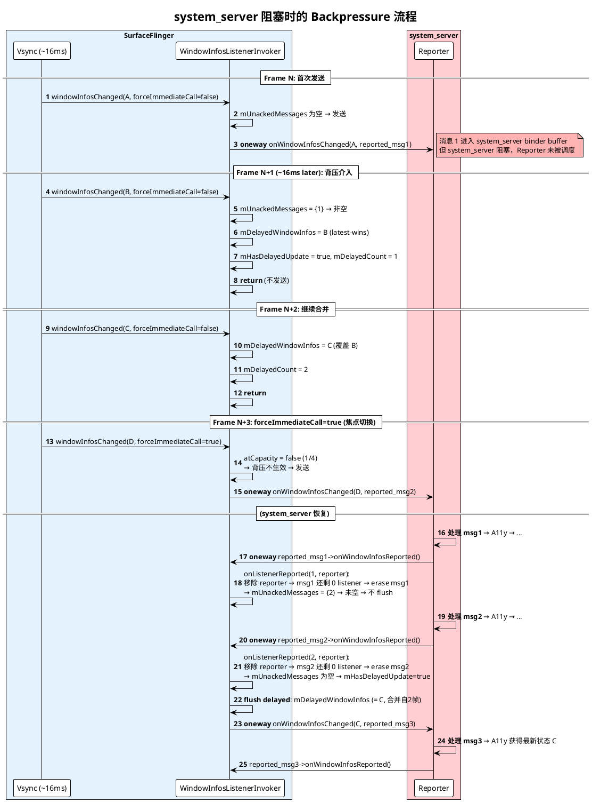
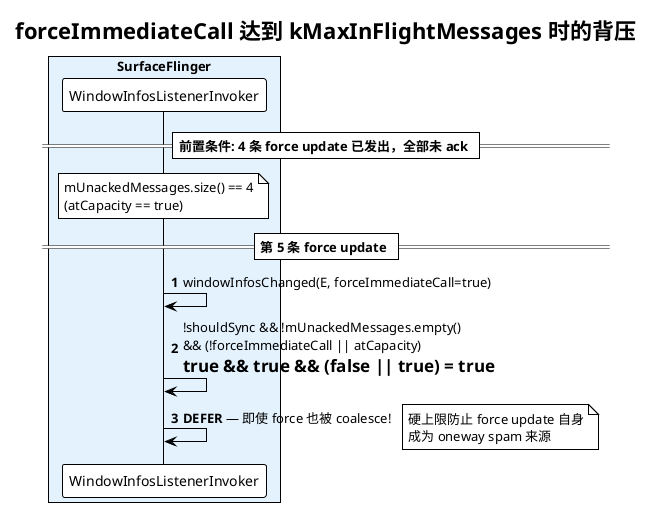
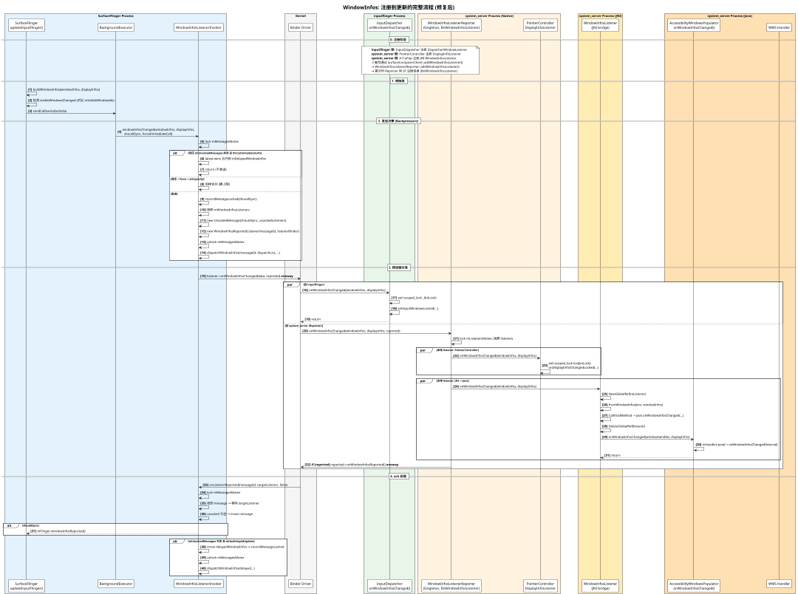

+++
date = '2026-06-08T10:22:54+08:00'
draft = false
title = 'Android 13 WindowInfos Update Flow — 架构、Bug 分析与 Backpressure 修复'
+++

## 1. 概述

WindowInfos Update Flow 是 Android 图形与输入系统协同工作的核心机制。SurfaceFlinger (SF) 每帧合成后将最新窗口属性（`WindowInfo`：几何位置、Z-Order、触摸区域、输入标志、变换矩阵）通过 oneway Binder 实时同步给消费者进程。

**主要消费者**：

- **InputDispatcher** (inputflinger 进程)：根据窗口信息计算触摸事件的目标窗口（Hit Testing）。
- **PointerController** (system_server 进程)：处理鼠标/触控笔指针的显示与坐标映射。
- **AccessibilityWindowsPopulator** (system_server 进程)：为无障碍服务（A11y）构建屏幕窗口节点树。

该机制的高频跨进程特性（每 16ms 一次）使其成为 Binder 缓冲区耗尽的高发区。本文档描述了 8295/AOSP13 中该流程的原始实现、一个导致 system_server 冻屏的 bug 的完整根因分析，以及基于 backpressure 的修复方案。

## 2. 核心架构

### 2.1 注册链：三个调用者，两条 Binder 通道

所有消费者都调用 `SurfaceComposerClient::addWindowInfosListener()`，该函数路由到本进程的 `WindowInfosListenerReporter` 单例。Reporter 只在第一个本地 listener 注册时向 SF 建立 Binder 通道。

```
                     SurfaceFlinger
                          │
            ┌─────────────┼─────────────┐
            │ oneway binder              │ oneway binder
            ▼                            ▼
  system_server 的              inputflinger 的
  Reporter (单例)               Reporter (单例)
  ┌──────────────┐              ┌──────────────┐
  │ PointerCtrl  │              │ InputDispatch│
  │ (local cb)   │              │ (local cb)   │
  │ A11yPop(JNI) │              └──────────────┘
  │ (local cb)   │
  └──────────────┘
```

从 SF 的 `WindowInfosListenerInvoker::mWindowInfosListeners` 视角，只看到 **2 个** binder 级 listener：两个 `IWindowInfosListener` 的 proxy（system_server 的 Reporter 和 inputflinger 的 Reporter）。

### 2.2 关键类和调用关系

| 层级 | 类/方法 | 进程 | 角色 |
|------|---------|------|------|
| 发送 | `SurfaceFlinger::updateInputFlinger()` | SF | 每帧入口 |
| 发送 | `SurfaceFlinger::buildWindowInfos()` | SF | 图层→WindowInfo 转换 |
| 发送 | `WindowInfosListenerInvoker::windowInfosChanged()` | SF | 遍历 listener 发送 |
| 协议 | `IWindowInfosListener.onWindowInfosChanged()` | AIDL | **oneway** |
| 接收 | `WindowInfosListenerReporter::onWindowInfosChanged()` | sys/inputflinger | Binder stub |
| 消费 | `InputDispatcher::onWindowInfosChanged()` | inputflinger | 同步持锁处理 |
| 消费 | `PointerController::DisplayInfoListener::onWindowInfosChanged()` | system_server | 同步持锁处理 |
| 消费 | JNI `WindowInfosListener::onWindowInfosChanged()` | system_server | 弱引用解包→Java |
| 消费 | `AccessibilityWindowsPopulator.onWindowInfosChanged()` | system_server | `mHandler.post()` 异步 |
| ack | `IWindowInfosReportedListener.onWindowInfosReported()` | AIDL | **oneway**，仅 sync 时非空 |
| ack | `WindowInfosListenerInvoker::onListenerReported()` | SF | 新增：处理 ack |

## 3. Bug 分析

### 3.1 现象

在 CPU 压力场景（6 个 `yes` 进程占满 CPU0-5）下，system_server 出现约 1.78 秒的冻屏，Perfetto trace 记录如下：

```
slice: onWindowInfosChanged
  process: system_server [1475]
  thread:  binder:1475_1D [3807]
  duration: 1,777,357 μs (≈1.78s)
  nested slice: "Contending for pthread mutex, mutex owner: 1612" → 1,776,669 μs (99.96%)
```

同时 `logcat` 中密集出现：

```
oneway spamming  →  每份 log 出现 11-40 次
binder_alloc_buf failed to map pages in userspace, no vma
setTransactionState timed out!
```

### 3.2 时序

```
时刻 T0: SF updateInputFlinger() 发送 oneway onWindowInfosChanged
        → system_server Binder 线程收到 → JNI → 路径上访问 ART 全局引用锁
        → 该锁被 android.bg (tid 1612) 持有
        → android.bg 正在 UsageStatsService.H.handleMessage() 内
        → android.bg 优先级 130，低于 yes 的 120 → 几乎得不到 CPU

T0+16ms: SF 下一帧 → 再发一条 oneway onWindowInfosChanged
T0+32ms: 又一条
...
T0+1.78s: 共 ~111 条 oneway 消息堆积在 system_server 的 async binder buffer
         → binder buffer 耗尽 → binder_alloc_buf failed → 冻屏
T0+1.78s: android.bg 终于得到 CPU → 释放锁
         → binder 线程获取锁 → 处理堆积的 111 条消息 (无意义，仅最新状态有用)
```

### 3.3 根因

**SF 侧无 sender-side backpressure。** 核心链路有三重因素共同导致：

1. **`oneway` 语义**：`IWindowInfosListener.onWindowInfosChanged()` 定义为 `oneway`。调用方 `transact()` 即时返回，不等待远端处理。SF 可以 16ms/次无限制发送，不感知远端是否拥堵。

2. **`BackgroundExecutor` 异步投递**：`SurfaceFlinger::updateInputFlinger()` 将发送逻辑打包为 lambda 投递给 `BackgroundExecutor`。每帧一个 lambda，阻塞发生时 lambda 持续堆积排队。

   ```cpp
   // SurfaceFlinger.cpp:3265-3283 (修复前)
   BackgroundExecutor::getInstance().sendCallbacks({[...]() {
       mWindowInfosListenerInvoker->windowInfosChanged(
           windowInfos, displayInfos,
           inputWindowCommands.syncInputWindows);  // shouldSync
   }});
   ```

3. **`WindowInfosListenerInvoker::windowInfosChanged()` 无条件全量发送**：修复前实现简单遍历所有 listener，无条件调用 oneway Binder：

   ```cpp
   // WindowInfosListenerInvoker.cpp (修复前)
   void WindowInfosListenerInvoker::windowInfosChanged(...) {
       mCallbacksPending = windowInfosListeners.size();
       for (const auto& listener : windowInfosListeners) {
           listener->onWindowInfosChanged(windowInfos, displayInfos,
               shouldSync ? mWindowInfosReportedListener : nullptr);
       }
   }
   ```

   `mCallbacksPending` 仅用于 sync 事务的计数（当所有 listener ack 后触发 `mFlinger.windowInfosReported()`），**不是发送侧限流条件**。

### 3.4 关键代码路径上的锁

| 锁 | 位置 | 持有时间 | 风险 |
|----|------|---------|------|
| ART `jni_globals_lock_` | `NewGlobalRef(mListener)` → `AddGlobalRef()` | μs 级 | 被 `android.bg` 在 JNI 路径上持有后因 CPU 饥饿无法释放 |
| ART `jni_weak_globals_lock_` | weak global ref 解引用 | μs 级 | 同上 |
| `BinderProxy.sProxyMap` | `javaObjectForIBinder()` | μs 级 | Java synchronized，每次窗口 token 转换都需获取 |
| WMS `mGlobalLock` | `getWindowsTransformMatrix()` | ms 级 | A11yPop 持此锁做矩阵运算 |
| InputDispatcher `mLock` | `setInputWindows()` | ms 级 | 同步持锁更新窗口状态 |

这些锁本身持有时间极短（μs 级），但在 CPU 饥饿下，锁持有者（`android.bg`）得不到调度，导致锁等待被放大到秒级。

## 4. 修复：Sender-side Backpressure

### 4.1 核心思想

复用旧协议中已有但仅用于 sync 的 `IWindowInfosReportedListener.onWindowInfosReported()` 回调，不改 AIDL 接口。

- **普通更新**：最多 1 个 in-flight 消息，后续帧合并为一份 latest-wins 延迟更新
- **强制更新**（可见窗口变化 / 焦点切换）：允许穿透，但受 `kMaxInFlightMessages` 硬上限限制
- **Sync 更新**：永远立即发送（调用方阻塞等待，不可 defer）

### 4.2 新增状态

```cpp
// WindowInfosListenerInvoker.h
std::mutex mMessagesMutex;           // 保护 flow-control 状态
uint64_t mNextMessageId = 1;

struct UnackedMessage {
    bool shouldSync;
    std::vector<wp<IBinder>> unackedListeners;   // 尚欠 ack 的 listener
    std::vector<sp<IWindowInfosReportedListener>> reportedListeners; // strong ref
};
std::unordered_map<uint64_t, UnackedMessage> mUnackedMessages;

bool mHasDelayedUpdate = false;
std::vector<WindowInfo> mDelayedWindowInfos;     // 合并后的最新更新
std::vector<DisplayInfo> mDelayedDisplayInfos;
uint32_t mDelayedCount = 0;

static constexpr size_t kMaxInFlightMessages = 4; // 硬上限
```

### 4.3 `WindowInfosReportedListener`：Binder 对象编码标识

旧 AIDL 中 `onWindowInfosReported()` 无参数。通过在 Binder 对象自身携带 `(messageId, targetListener)` 来支持多 in-flight 消息追踪，不改 AIDL：

```cpp
struct WindowInfosListenerInvoker::WindowInfosReportedListener
      : gui::BnWindowInfosReportedListener {
    WindowInfosListenerInvoker& mInvoker;
    const uint64_t mMessageId;
    const wp<IBinder> mTargetListener;   // 哪个 listener 发的 ack

    binder::Status onWindowInfosReported() override {
        mInvoker.onListenerReported(mMessageId, mTargetListener, false);
        return binder::Status::ok();
    }
};
```

### 4.4 发送路径

```cpp
void WindowInfosListenerInvoker::windowInfosChanged(...) {
    std::scoped_lock lock(mMessagesMutex);

    // 背压决策
    const bool atCapacity = mUnackedMessages.size() >= kMaxInFlightMessages;
    const bool deferUpdate = !shouldSync && !mUnackedMessages.empty() &&
            (!forceImmediateCall || atCapacity);

    if (deferUpdate) {
        // latest-wins: 只保留最新一份
        mDelayedWindowInfos = windowInfos;
        mDelayedDisplayInfos = displayInfos;
        mHasDelayedUpdate = true;
        mDelayedCount++;
        return;  // 不发送
    }

    // force 更新淘汰旧的 delayed 数据 (携带更新状态)
    if (mHasDelayedUpdate) {
        mHasDelayedUpdate = false;
        mDelayedCount = 0;
    }

    // 注册消息 + 快照 listener + 分配 messageId
    dispatchList = recordMessageLocked(shouldSync, &messageId);
    dispatchWindowInfos(messageId, dispatchList, windowInfos, displayInfos);
}
```

### 4.5 ack 路径

```
Reporter 处理完所有本地 listener
  → if (windowInfosReportedListener) onWindowInfosReported()  // oneway 回 SF
  → WindowInfosReportedListener::onWindowInfosReported()
  → WindowInfosListenerInvoker::onListenerReported(messageId, target, false)
      {
          scoped_lock(mMessagesMutex);
          找到消息 → 移除 target → 若 unacked 为空 → erase 消息
          若 shouldSync → syncCompletions++
          若 mUnackedMessages 为空 且 mHasDelayedUpdate → 准备 flush
      }
      mFlinger.windowInfosReported() × syncCompletions
      若 flush → dispatchWindowInfos(delayed)
```

### 4.6 `SurfaceFlinger.cpp` 调用点变化

```cpp
// 修复前
mWindowInfosListenerInvoker->windowInfosChanged(
    windowInfos, displayInfos, syncInputWindows);

// 修复后
const bool forceImmediateCall = visibleWindowsChanged ||
        inputWindowCommands.syncInputWindows ||
        !inputWindowCommands.focusRequests.empty();
mWindowInfosListenerInvoker->windowInfosChanged(
    windowInfos, displayInfos, syncInputWindows, forceImmediateCall);
```

新增 `visibleWindowsChanged` 检测：通过对比相邻帧的可见窗口 ID set（`mVisibleWindowIds`），识别窗口出现/消失（稀疏事件，不会被 backpressure spam）。

## 5. 时序图

### 5.1 正常流程 (无背压)


```plantuml
@startuml
!theme plain
autonumber
scale 1080 width
title WindowInfos 正常更新流程 (无背压)

box "SurfaceFlinger" #E3F2FD
    participant "updateInputFlinger()" as UIF
    participant "BackgroundExecutor" as BE
    participant "WindowInfosListenerInvoker" as Invoker
end box

box "Kernel" #F5F5F5
    participant "Binder Driver" as Binder
end box

box "system_server" #FFF3E0
    participant "WindowInfosListenerReporter\n(onWindowInfosChanged)" as Reporter
end box

box "system_server (Java)" #FFE0B2
    participant "WindowInfosListener\n(JNI → Java)" as JNI
    participant "AccessibilityWindowsPopulator\n(onWindowInfosChanged)" as A11y
end box

== 每帧触发 (Vsync, ~16ms) ==
UIF -> UIF: buildWindowInfos(windowInfos, displayInfos)
UIF -> BE: sendCallbacks(lambda)
BE -> Invoker: windowInfosChanged(windowInfos, displayInfos,\n  shouldSync=false, forceImmediateCall=false)

Invoker -> Invoker: lock mMessagesMutex
Invoker -> Invoker: mUnackedMessages.empty() → 发送
Invoker -> Invoker: recordMessageLocked(shouldSync=false)

group 快照 listeners
    Invoker -> Invoker: lock mListenersMutex
    Invoker -> Invoker: 遍历 mWindowInfosListeners
    Invoker -> Invoker: unlock mListenersMutex
end

Invoker -> Invoker: new messageId, UnackedMessage\{shouldSync=false\}
Invoker -> Invoker: create WindowInfosReportedListener(messageId, listenerBinder)
Invoker -> Invoker: unlock mMessagesMutex

Invoker -> Binder: listener->onWindowInfosChanged(data, reported) **oneway**
Binder -> Reporter: onWindowInfosChanged(windowInfos, displayInfos, reported)

Reporter -> Reporter: lock mListenersMutex\n复制本地 listener 集合
Reporter -> JNI: listener->onWindowInfosChanged(windowInfos, displayInfos)
JNI -> A11y: onWindowInfosChanged(windowHandles, displayInfos)
A11y -> A11y: mHandler.post(→ onWindowInfosChangedInternal)
JNI <-- A11y: return
Reporter <-- JNI: return

Reporter -> Binder: reported->onWindowInfosReported() **oneway**

Binder -> Invoker: onListenerReported(messageId, listener, false)
Invoker -> Invoker: lock mMessagesMutex\n移除 listener → 消息 fully acked → erase
Invoker -> Invoker: mUnackedMessages 为空 → 无 delayed → 无 flush
Invoker -> Invoker: unlock mMessagesMutex

@enduml
```

### 5.2 system_server 阻塞时的背压流程


```plantuml
@startuml
!theme plain
autonumber

title system_server 阻塞时的 Backpressure 流程

box "SurfaceFlinger" #E3F2FD
    participant "Vsync (~16ms)" as VSYNC
    participant "WindowInfosListenerInvoker" as Invoker
end box

box "system_server" #FFCDD2
    participant "Reporter" as Reporter
end box

== Frame N: 首次发送 ==
VSYNC -> Invoker: windowInfosChanged(A, forceImmediateCall=false)
Invoker -> Invoker: mUnackedMessages 为空 → 发送
Invoker -> Reporter: **oneway** onWindowInfosChanged(A, reported_msg1)
note right #FFB3B3: 消息 1 进入 system_server binder buffer\n但 system_server 阻塞，Reporter 未被调度

== Frame N+1 (~16ms later): 背压介入 ==
VSYNC -> Invoker: windowInfosChanged(B, forceImmediateCall=false)
Invoker -> Invoker: mUnackedMessages = {1} → 非空
Invoker -> Invoker: mDelayedWindowInfos = B (latest-wins)
Invoker -> Invoker: mHasDelayedUpdate = true, mDelayedCount = 1
Invoker -> Invoker: **return** (不发送)

== Frame N+2: 继续合并 ==
VSYNC -> Invoker: windowInfosChanged(C, forceImmediateCall=false)
Invoker -> Invoker: mDelayedWindowInfos = C (覆盖 B)
Invoker -> Invoker: mDelayedCount = 2
Invoker -> Invoker: **return**

== Frame N+3: forceImmediateCall=true (焦点切换) ==
VSYNC -> Invoker: windowInfosChanged(D, forceImmediateCall=true)
Invoker -> Invoker: atCapacity = false (1/4)\n→ 背压不生效 → 发送
Invoker -> Reporter: **oneway** onWindowInfosChanged(D, reported_msg2)

== (system_server 恢复) ==
Reporter -> Reporter: **处理 msg1** → A11y → ...
Reporter -> Invoker: **oneway** reported_msg1->onWindowInfosReported()
Invoker -> Invoker: onListenerReported(1, reporter):\n移除 reporter → msg1 还剩 0 listener → erase msg1\n→ mUnackedMessages = {2} → 未空 → 不 flush

Reporter -> Reporter: **处理 msg2** → A11y → ...
Reporter -> Invoker: **oneway** reported_msg2->onWindowInfosReported()
Invoker -> Invoker: onListenerReported(2, reporter):\n移除 reporter → msg2 还剩 0 listener → erase msg2\n→ mUnackedMessages 为空 → mHasDelayedUpdate=true

Invoker -> Invoker: **flush delayed**: mDelayedWindowInfos (= C, 合并自2帧)
Invoker -> Reporter: **oneway** onWindowInfosChanged(C, reported_msg3)

Reporter -> Reporter: **处理 msg3** → A11y 获得最新状态 C
Reporter -> Invoker: reported_msg3->onWindowInfosReported()

@enduml
```

### 5.3 force 更新达到硬上限


```plantuml
@startuml
!theme plain
autonumber

title forceImmediateCall 达到 kMaxInFlightMessages 时的背压

box "SurfaceFlinger" #E3F2FD
    participant "WindowInfosListenerInvoker" as Invoker
end box

== 前置条件: 4 条 force update 已发出，全部未 ack ==
note over Invoker: mUnackedMessages.size() == 4\n(atCapacity == true)

== 第 5 条 force update ==
Invoker -> Invoker: windowInfosChanged(E, forceImmediateCall=true)
Invoker -> Invoker: !shouldSync && !mUnackedMessages.empty()\n&& (!forceImmediateCall || atCapacity)\n= true && true && (false || true) = true
Invoker -> Invoker: **DEFER** — 即使 force 也被 coalesce!
note right: 硬上限防止 force update 自身\n成为 oneway spam 来源

@enduml
```

## 6. 完整注册与更新流程 (PlantUML 长图)


```plantuml
@startuml
!theme plain
autonumber "<b>[0]"
scale 1080 width
title WindowInfos: 注册到更新的完整流程 (修复后)

box "SurfaceFlinger Process" #E3F2FD
    participant "SurfaceFlinger\nupdateInputFlinger()" as SF
    participant "BackgroundExecutor" as BE
    participant "WindowInfosListenerInvoker" as Invoker
end box

box "Kernel" #F5F5F5
    participant "Binder Driver" as Binder
end box

box "inputflinger Process" #E8F5E9
    participant "InputDispatcher\nonWindowInfosChanged()" as InputDisp
end box

box "system_server Process (Native)" #FFF3E0
    participant "WindowInfosListenerReporter\n(Singleton, BnWindowInfosListener)" as Reporter
    participant "PointerController\nDisplayInfoListener" as PointerCtrl
end box

box "system_server Process (JNI)" #FFECB3
    participant "WindowInfosListener\n(JNI bridge)" as JNI
end box

box "system_server Process (Java)" #FFE0B2
    participant "AccessibilityWindowsPopulator\nonWindowInfosChanged()" as A11yPop
    participant "WMS Handler" as WMS_H
end box

== 0. 注册阶段 ==

note over InputDisp, Reporter
  **inputflinger 侧**: InputDispatcher 注册 DispatcherWindowListener
  **system_server 侧**: PointerController 注册 DisplayInfoListener
  **system_server 侧**: A11yPop 注册 JNI WindowInfosListener
  三者均通过 SurfaceComposerClient::addWindowInfosListener()
  → WindowInfosListenerReporter::addWindowInfosListener()
  → 首次时 Reporter 向 SF 注册自身 (BnWindowInfosListener)
end note

== 1. 帧触发 ==

SF -> SF: buildWindowInfos(windowInfos, displayInfos)
SF -> SF: 检测 visibleWindowsChanged (对比 mVisibleWindowIds)
SF -> BE: sendCallbacks(lambda)

== 2. 发送决策 (Backpressure) ==

BE -> Invoker: windowInfosChanged(windowInfos, displayInfos,\n  shouldSync, forceImmediateCall)

Invoker -> Invoker: lock mMessagesMutex
alt 背压 (mUnackedMessages 非空 且 !forceImmediateCall)
    Invoker -> Invoker: latest-wins 合并到 mDelayedWindowInfos
    Invoker -> Invoker: return (不发送)
else 背压 + force + atCapacity
    Invoker -> Invoker: 同样合并 (硬上限)
else 发送
    Invoker -> Invoker: recordMessageLocked(shouldSync)
    Invoker -> Invoker: 快照 mWindowInfosListeners
    Invoker -> Invoker: new UnackedMessage{shouldSync, unackedListeners}
    Invoker -> Invoker: new WindowInfosReportedListener(messageId, listenerBinder)
    Invoker -> Invoker: unlock mMessagesMutex
    Invoker -> Invoker: dispatchWindowInfos(messageId, dispatchList, ...)
end

== 3. 跨进程分发 ==

Invoker -> Binder: listener->onWindowInfosChanged(data, reported) **oneway**

par 到 inputflinger
    Binder -> InputDisp: onWindowInfosChanged(windowInfos, displayInfos)
    InputDisp -> InputDisp: std::scoped_lock _l(mLock)
    InputDisp -> InputDisp: setInputWindowsLocked(...)
    InputDisp --> Binder: return
else 到 system_server (Reporter)
    Binder -> Reporter: onWindowInfosChanged(windowInfos, displayInfos, reported)
    Reporter -> Reporter: lock mListenersMutex, 快照 listeners

    par 本地 listener: PointerController
        Reporter -> PointerCtrl: onWindowInfosChanged(windowInfos, displayInfos)
        PointerCtrl -> PointerCtrl: std::scoped_lock lock(mLock)\nonDisplayInfosChangedLocked(...)
    end

    par 本地 listener: JNI → Java
        Reporter -> JNI: onWindowInfosChanged(windowInfos, displayInfos)
        JNI -> JNI: NewGlobalRef(mListener)
        JNI -> JNI: fromWindowInfos(env, windowInfos)
        JNI -> JNI: CallVoidMethod → Java onWindowInfosChanged(...)
        JNI -> JNI: DeleteGlobalRef(listener)
        JNI -> A11yPop: onWindowInfosChanged(windowHandles, displayInfos)
        A11yPop -> A11yPop: mHandler.post(→ onWindowInfosChangedInternal)
        A11yPop --> JNI: return
    end

    Reporter -> Binder: **if (reported)** reported->onWindowInfosReported() **oneway**

end

== 4. ack 处理 ==

Binder -> Invoker: onListenerReported(messageId, targetListener, false)
Invoker -> Invoker: lock mMessagesMutex
Invoker -> Invoker: 找到 message → 移除 targetListener
Invoker -> Invoker: unacked 为空 → erase message
alt shouldSync
    Invoker --> SF: mFlinger.windowInfosReported()
end
alt mUnackedMessages 为空 且 mHasDelayedUpdate
    Invoker -> Invoker: move delayedWindowInfos → recordMessageLocked
    Invoker -> Invoker: unlock mMessagesMutex
    Invoker -> Invoker: dispatchWindowInfos(delayed...)
end

@enduml
```

## 7. 修复效果

| 指标 | 修复前 | 修复后 |
|------|--------|--------|
| "oneway spamming" | 11-40 次/份日志 | **0** |
| `binder_alloc_buf failed` | 密集出现 | 与 WindowInfo 路径无关的其他 binder 错误 |
| SF transact failed | N/A | **0** |
| listener died | N/A | **0** |
| Recorded ≈ fully acked | 无追踪 | **完全匹配** (消息生命周期健康) |
| 背压 coalesce 率 | 无 | 50-57% (正常负载下拦截一半以上) |

## 8. 附录

### 8.1 `SurfaceFlinger::updateInputFlinger()` 调用上下文

```
VSYNC Signal
  ↓
MessageQueue::handleMessage()
  ↓
SurfaceFlinger::commit()
  ├── commitTransactions()        ← 应用窗口属性变更
  ├── updateLayerGeometry()       ← 计算可见区域
  ├── updateInputFlinger()        ← [本文主角] 窗口信息同步
  │     ├── buildWindowInfos()
  │     ├── 检测 visibleWindowsChanged
  │     └── BackgroundExecutor::sendCallbacks(lambda)
  │           └── WindowInfosListenerInvoker::windowInfosChanged()
  │                 ├── [背压决策] defer / send
  │                 ├── recordMessageLocked()
  │                 └── dispatchWindowInfos()
  │                       └── listener->onWindowInfosChanged() oneway Binder
  └── composite()                ← GPU/HWC 合成上屏
```

### 8.2 线程模型

| 线程 | 进程 | 职责 |
|------|------|------|
| SF Main Thread | surfaceflinger | `updateInputFlinger()` 入口 |
| BackgroundExecutor | surfaceflinger | 执行 lambda (发送 Binder) |
| Binder threads | surfaceflinger | 接收 `onWindowInfosReported()` ack |
| Binder threads | system_server | 接收 `onWindowInfosChanged()` → Reporter 分发 |
| WMS Handler | system_server | `onWindowInfosChangedInternal()` 异步处理 |
| Binder threads | inputflinger | 接收 `onWindowInfosChanged()` → InputDispatcher |
