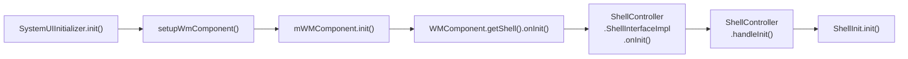
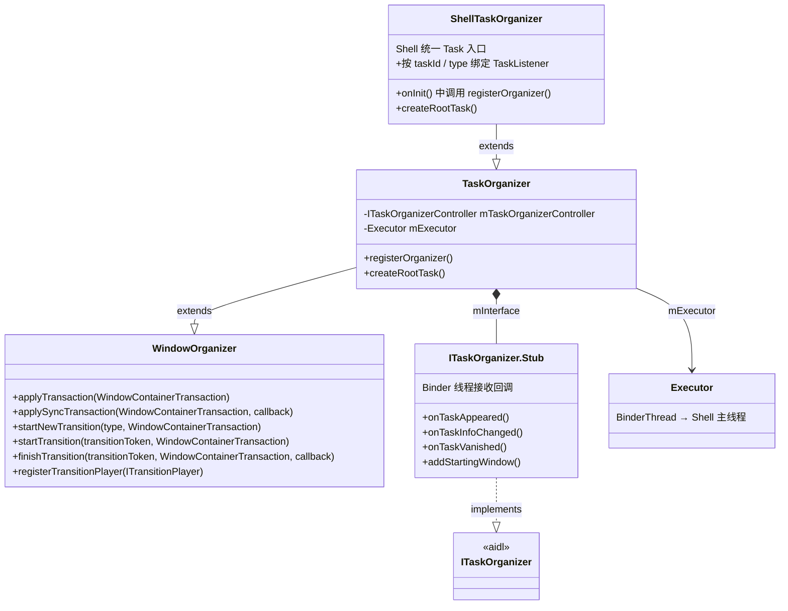
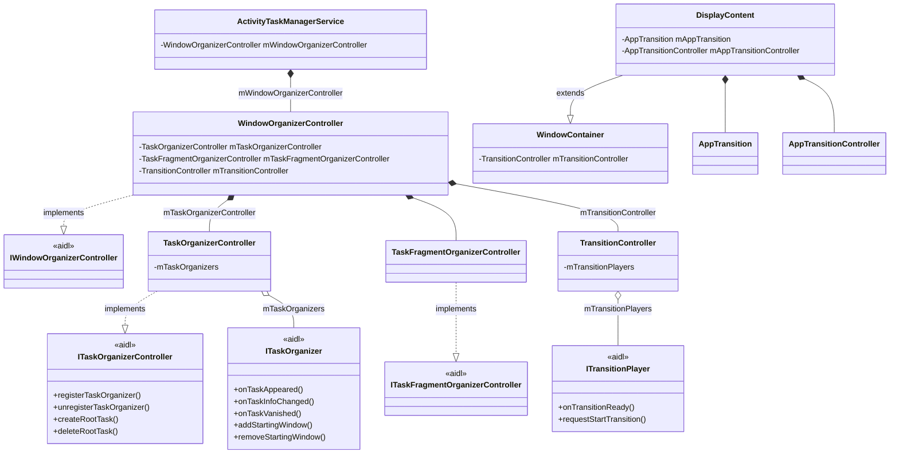
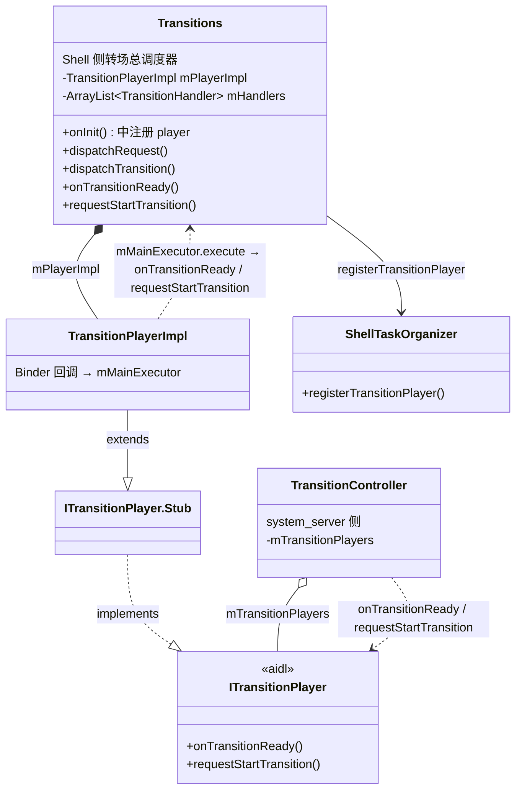
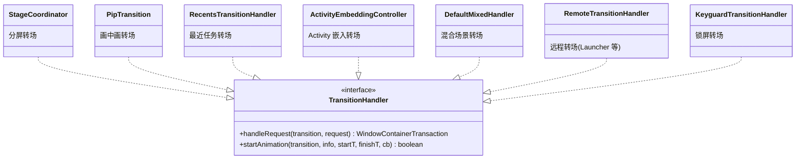
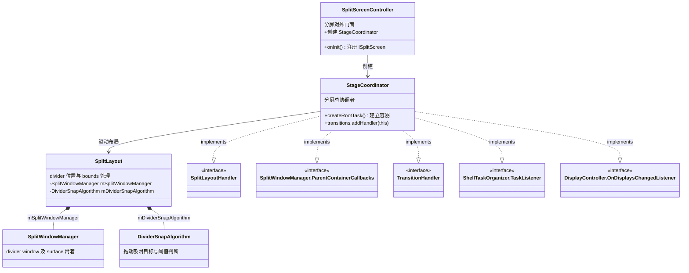
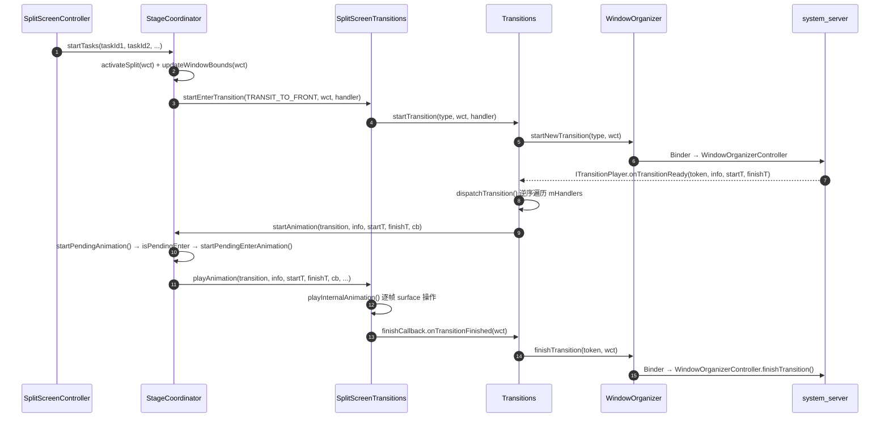
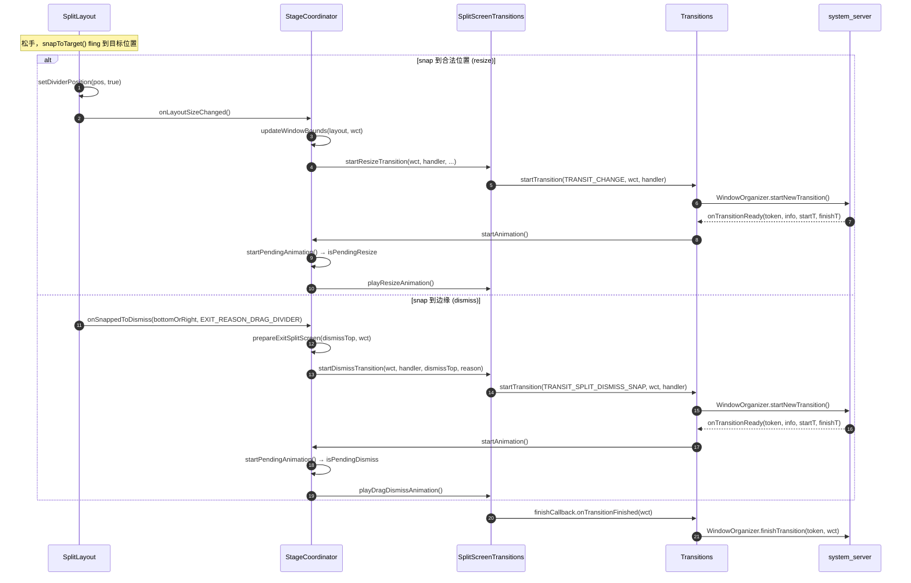

+++
date = '2026-03-29T00:00:00+08:00'
draft = true
title = 'WMShell 介绍：SystemUI 与 WindowManager 之间的壳层'
+++

`WMShell` 不是一个单独的类，而是 Android 在 `SystemUI` 进程里承载的一组窗口管理能力。它位于 `SystemUI` 与 `system_server` 之间：一边接收配置变化、锁屏状态、用户切换、命令队列等 SysUI 事件；另一边通过 `WindowOrganizer`、`TaskOrganizer`、`Transitions` 等接口去控制 `system_server` 中的 Task、DisplayArea 和窗口转场。

这篇文章只做总览，重点解释 WMShell 在系统里的位置、启动方式、任务组织模型、转场模型，以及为什么分屏是理解它的最好入口。

## WMShell 在哪里启动

WMShell 的启动链路在当前源码里比较清晰：



这里有两个关键点。

第一，`WMComponent` 是 Shell 的 Dagger 子图。它会把 `Pip`、`SplitScreen`、`OneHanded`、`Bubbles`、`RecentTasks`、`DesktopMode`、`ShellTransitions` 等能力显式导出给 SystemUI 使用。

第二，SystemUI 侧真正启动的服务类是 `com.android.systemui.wmshell.WMShell`。它实现了 `CoreStartable`，在 `start()` 里把 SysUI 的外部事件转给 Shell，例如：

- 配置变化
- Keyguard 可见性
- 用户切换
- `CommandQueue` 回调
- PiP、SplitScreen、One-handed、DesktopMode、RecentTasks 的额外绑定

因此，WMShell 的"运行位置"和"控制对象"是分开的：

- 大多数 Shell 代码运行在 `SystemUI` 进程
- 被控制的窗口容器和转场状态在 `system_server`
- 两者之间靠 `WindowOrganizer` 家族 Binder 接口配合 `SurfaceControl` 完成协作

## Shell 内部是如何初始化的

Shell 并不是在一个巨大的构造函数里一次性拉起的，而是通过 `ShellInit.addInitCallback()` 让各模块在构造阶段登记自己的 `onInit()`。

等到 `WMComponent.init()` 触发 `getShell().onInit()` 之后，`ShellController` 会在 Shell 主线程里执行 `handleInit()`，再统一调用 `mShellInit.init()`，按注册顺序逐个执行这些初始化回调。

这种做法有两个直接好处：

- 初始化顺序与 Dagger 依赖顺序一致，不容易出现先用后注册的问题
- 模块可以把"真正有副作用的注册动作"放到 `onInit()`，例如注册 organizer、注册 transition player、注册 dump 命令、导出 Binder 接口

在当前源码里几个典型例子是：

- `ShellTaskOrganizer` 在 `onInit()` 里调用 `registerOrganizer()`
- `Transitions` 在 `onInit()` 里调用 `shareTransactionQueue()` 和 `registerTransitionPlayer()`
- `SplitScreenController` 在 `onInit()` 里注册 `ISplitScreen` 外部接口，并创建 `StageCoordinator`

## ShellTaskOrganizer：WMShell 的任务总入口

如果只选一个类作为 WMShell 的任务入口，那就是 `ShellTaskOrganizer`。

它继承自 `android.window.TaskOrganizer`，源码注释写得很直接：

> Unified task organizer for all components in the shell.

也就是说，它不是某一个窗口模式专用的 organizer，而是 Shell 内多个能力共享的统一 task organizer。

### TaskOrganizer 客户端类链路

下面这张图展示了 Shell 侧 `ShellTaskOrganizer` 到 framework 层 `TaskOrganizer`、`WindowOrganizer` 的继承关系，以及 `TaskOrganizer` 内部持有的 Binder stub 和 Executor：



`TaskOrganizer` 内部持有一个 `ITaskOrganizer.Stub`（即 `mInterface`）。当 `system_server` 通过 Binder 回调 `onTaskAppeared()`、`onTaskInfoChanged()`、`onTaskVanished()`、`addStartingWindow()` 时，这些回调不会直接在 Binder 线程里执行业务逻辑，而是先切到 `TaskOrganizer` 构造时传入的 `Executor`。这对 Shell 很重要，因为大多数 UI、动画和状态机逻辑都要求在 Shell 主线程或指定 executor 上串行运行。

### 任务是怎么注册到 system_server 的

客户端这边，`TaskOrganizer.registerOrganizer()` 会调用：

```java
ITaskOrganizerController.registerTaskOrganizer(mInterface)
```

服务端这边，`TaskOrganizerController.registerTaskOrganizer()` 会做几件事：

1. 记录当前 organizer
2. 扫描系统里已有的 task
3. 把需要交给 organizer 管理的 task 封装成 `TaskAppearedInfo` 返回
4. 后续在 task 生命周期变化时，通过 `ITaskOrganizer` 回调

### ShellTaskOrganizer 又在 Shell 内部做了什么

`ShellTaskOrganizer` 在 `TaskOrganizer` 之上又加了一层分发能力：

- 按 `taskId` 绑定 `TaskListener`
- 按类型绑定 `TaskListener`
- 缓存已经出现的 `TaskAppearedInfo`
- 维护当前 task 和 leash 的映射
- 把任务回调继续路由给全屏、分屏、PiP、Freeform 等模块

所以它更像一个"任务事件总线"，而不是一个只服务某个 feature 的小类。

### 为什么很多模块都依赖 createRootTask

`ShellTaskOrganizer.createRootTask()` 的实现也很关键。它会先生成一个 launch cookie，再调用 `TaskOrganizer.createRootTask()` 去 `system_server` 里创建持久 root task。

这意味着 Shell 不只是被动监听已有 task，还可以主动要求 WM Core 创建自己需要的容器。分屏、TaskView 等功能都依赖这套能力来准备自己的 task 层级。

## system_server 侧：WindowOrganizerController 是收口点

客户端的 `WindowOrganizer`、`TaskOrganizer` 和 transition 相关 API，最终都落在 `ActivityTaskManagerService` 暴露的 `IWindowOrganizerController` 上。

下面这张图展示了 `system_server` 侧从 `ActivityTaskManagerService` 到各个子 controller 的持有关系，以及 AIDL 接口与 controller 之间的实现关系：



从当前源码看，`ActivityTaskManagerService` 持有 `mWindowOrganizerController`。当前项目树虽然通过 `VoyahServicePolicyManager.makeNewWindowOrganizerController(this)` 包了一层初始化，但最终暴露出来的仍然是同一套 `WindowOrganizerController` 结构。

`WindowOrganizerController` 自身实现了 `IWindowOrganizerController.Stub`，因此 Shell 侧常见的这些 API：

- `applyTransaction()`
- `applySyncTransaction()`
- `startNewTransition()`
- `startTransition()`
- `finishTransition()`
- `registerTransitionPlayer()`

本质上都是在操纵 `WindowOrganizerController` 以及它下面的具体 controller。

## Transitions：把动画播放权从 WM Core 接回 Shell

如果说 `ShellTaskOrganizer` 解决的是"谁来管理 task"，那么 `Transitions` 解决的就是"谁来处理窗口变化动画"。

### Transitions 转场播放链路

下面这张图展示了 Shell 侧 `Transitions` 如何通过 `TransitionPlayerImpl` 注册到 `system_server`，以及 `TransitionController` 如何通过 `ITransitionPlayer` 回调 Shell：



`Transitions.onInit()` 做了两件非常关键的事情：

1. `mOrganizer.shareTransactionQueue()` —— 让 Shell 与 WM Core 共享 transaction queue，避免两边各自提交事务导致状态不同步
2. `mOrganizer.registerTransitionPlayer(mPlayerImpl)` —— 把 `ITransitionPlayer` 注册给 `system_server`

之后，`TransitionController` 在完成 transition 的收集和准备后，就会通过这个 player 回调 Shell 侧的 `requestStartTransition()` 和 `onTransitionReady()`。而 `TransitionPlayerImpl` 收到 Binder 回调后，会再切回 Shell 主 executor 执行真正的逻辑。

### TransitionHandler 责任链

`Transitions` 的角色更像一个"转场总调度器"。它自己维护了一组 `TransitionHandler`，但并不要求所有动画都写在自己内部。



核心分发逻辑可以分成两步：

1. **`dispatchRequest()`** —— 让每个 handler 通过 `handleRequest()` 判断"这次 transition 是不是归我管"
2. **`dispatchTransition()`** —— 让已经注册的 handler 通过 `startAnimation()` 去真正播放动画

这两次分发都会逆序遍历 `mHandlers`，所以后加入的 handler 优先级更高，而默认的 `DefaultTransitionHandler` 则留在最低优先级兜底。

从扩展性上看，这个设计非常适合 WMShell。因为每个 feature 都可以带着自己的动画处理器接入，而不用把所有逻辑堆在一个大类里。

## 为什么分屏是理解 WMShell 的最好入口

分屏正好把 WMShell 的几个核心思想同时串起来了：task 组织、root task 创建、布局与 divider 管理、transition 认领与播放、对外 Binder 接口导出。

### SplitScreen 分屏类关系

下面这张图展示了分屏涉及的核心类及其关系：



### SplitScreenController 是对外门面

`SplitScreenController` 是分屏功能的主入口。它在 `onInit()` 里做了几件事：

- 注册 dump 回调
- 注册 `splitscreen` shell command
- 通过 `ShellController.addExternalInterface()` 导出 `ISplitScreen`
- 创建 `StageCoordinator`
- 与拖拽分屏、window decor、desktop mode 等模块建立联动

因此它更像一个 facade，负责把分屏功能整体挂到 Shell 运行时里。

### StageCoordinator 才是分屏真正的核心

`StageCoordinator` 的类声明本身就很能说明问题。它同时实现了：

- `SplitLayout.SplitLayoutHandler`
- `DisplayController.OnDisplaysChangedListener`
- `Transitions.TransitionHandler`
- `ShellTaskOrganizer.TaskListener`
- `StageTaskListener.StageListenerCallbacks`
- `SplitMultiDisplayProvider`

这说明它不是单一职责的小类，而是分屏 feature 的总协调者。它同时负责：

- 作为 `TaskListener` 接收 root task / stage task 的组织回调
- 作为 `TransitionHandler` 认领并播放 split 相关转场
- 作为 `SplitLayoutHandler` 驱动 divider 与 bounds 变化
- 作为 display listener 处理旋转、IME、Insets 等环境变化

### StageCoordinator 是怎么建立 split 容器的

在构造阶段，`StageCoordinator` 首先会调用：

```java
taskOrganizer.createRootTask(displayId, WINDOWING_MODE_FULLSCREEN, this)
```

为 split 创建一个顶层 root task。

随后又会创建 `MainStage` 和 `SideStage` 对应的 `StageTaskListener`。这些 stage listener 内部还会继续创建 `WINDOWING_MODE_MULTI_WINDOW` 的 root task。最终形成的是一套分层容器，而不是简单地把两个 app 直接摆到屏幕上。

### StageCoordinator 为什么还能处理转场

`StageCoordinator` 在构造里会调用：

```java
transitions.addHandler(this)
```

把自己加入 `Transitions` 的 handler 链。

于是，split 相关 transition 会先进入它的 `handleRequest()`。如果当前处于 split active 状态，它甚至会在 display rotation 这类场景下继续返回非空 `WindowContainerTransaction`，确保分屏状态仍被纳入 transition 管理。

等 transition 真正开始播放时，又会进入它的 `startAnimation()`。这里会根据 `TransitionInfo` 去处理：

- split enter / exit
- divider freeze / unfreeze
- stage 可见性更新
- 与 PiP、desktop mode 等混合场景的协同

所以从分屏这个例子可以看得很清楚：WMShell 并不是"task 管理在一边，动画在另一边"，而是把 task 组织、布局和转场统一放进同一个 feature coordinator 里。

### SplitLayout、SplitWindowManager、DividerSnapAlgorithm 分别在做什么

这几个类更偏 UI 和交互层：

- `SplitLayout` 负责维护 divider 位置、两个 stage 的 bounds，以及对旋转、IME、Insets 的响应
- `SplitWindowManager` 负责 divider window 本身及其 parent surface 附着
- `DividerSnapAlgorithm` 负责 divider 拖动后的吸附目标和阈值判断

从依赖方向看，`StageCoordinator` 依赖 `SplitLayout`，`SplitLayout` 再聚合 `SplitWindowManager` 和 `DividerSnapAlgorithm`，这与源码结构一致。

### 分屏的三个阶段

分屏的完整生命周期可以分成三个阶段：进入分屏、拖动 divider、松手定稿。它们走的代码路径完全不同。

#### 阶段一：进入分屏

进入分屏有两条路径。

**Shell 主动发起**：用户从 Recents 或 intent 触发分屏时，`SplitScreenController` 调用 `StageCoordinator.startTasks()`。`startTasks()` 内部构造一个 `WindowContainerTransaction`，通过 `activateSplit()` 激活 split 状态、`updateWindowBounds()` 设置初始 bounds、`wct.startTask()` 把两个 task 塞进对应 stage，最后调用 `SplitScreenTransitions.startEnterTransition()` 发起 transition：

```java
// StageCoordinator.startWithTask()
activateSplit(wct, false, SPLIT_INDEX_UNDEFINED);
mSplitLayout.setDivideRatio(snapPosition);
updateWindowBounds(mSplitLayout, wct);
wct.reorder(mRootTaskInfo.token, true);
wct.startTask(mainTaskId, mainOptions);
mSplitTransitions.startEnterTransition(
        TRANSIT_TO_FRONT, wct, remoteTransition, this,
        TRANSIT_SPLIT_SCREEN_PAIR_OPEN, false, snapPosition);
```

`SplitScreenTransitions.startEnterTransition()` 做两件事：先通过 `mTransitions.startTransition()` 把 WCT 提交给 `system_server`（内部调用 `WindowOrganizer.startNewTransition()`），再用 `setEnterTransition()` 记录一个 `EnterSession`，等 `onTransitionReady` 回来时用于匹配。

**WM Core 被动触发**：如果 split 已经在后台运行，某个 stage 中的 task 被系统唤起（例如通知点击），`system_server` 会通过 `ITransitionPlayer.requestStartTransition()` 回调 Shell。`Transitions.requestStartTransition()` 收到后逆序遍历 `mHandlers`，调用每个 handler 的 `handleRequest()`。`StageCoordinator.handleRequest()` 检测到 trigger task 属于某个 stage 且 split 不可见，就走 `prepareEnterSplitScreen()` + `setEnterTransition()`，返回一个非空 WCT 认领这次 transition。

两条路径最终汇合到同一个动画流程：`system_server` 准备好 transition 后，通过 `ITransitionPlayer.onTransitionReady()` 把 `TransitionInfo`、`startTransaction`、`finishTransaction` 发给 Shell。`Transitions.onTransitionReady()` 收到后调用 `dispatchTransition()`，逆序遍历 `mHandlers` 调用 `startAnimation()`。`StageCoordinator.startAnimation()` 检查 `mSplitTransitions.isPendingEnter(transition)` 为 true，进入 `startPendingEnterAnimation()` 设置各 stage 的 surface 可见性和初始状态，再交给 `SplitScreenTransitions.playAnimation()` 执行实际的动画帧。



#### 阶段二：拖动 divider

用户拖动分隔条时不走 transition，Shell 直接操作 `SurfaceControl.Transaction`。

触摸事件由 `SplitWindowManager` 接收，传给 `SplitLayout`。`SplitLayout.updateDividerBounds()` 根据触摸位置重算两个 stage 的 bounds，然后回调 `SplitLayoutHandler.onLayoutSizeChanging()`：

```java
// SplitLayout.updateDividerBounds()
void updateDividerBounds(int position, boolean shouldUseParallaxEffect) {
    updateBounds(position);
    mSplitLayoutHandler.onLayoutSizeChanging(this,
            mSurfaceEffectPolicy.mRetreatingSideParallax.x,
            mSurfaceEffectPolicy.mRetreatingSideParallax.y, shouldUseParallaxEffect);
}
```

`StageCoordinator.onLayoutSizeChanging()` 是实际干活的地方。它从 `TransactionPool` 获取一个 `SurfaceControl.Transaction`，调用 `updateSurfaceBounds()` 更新 root task 和各 stage 的 surface 位置与裁剪，再对每个 `StageTaskListener` 调用 `onResizing()` 处理子 task 的 parallax 缩放效果，最后 `t.apply()` 提交到 `SurfaceFlinger`：

```java
// StageCoordinator.onLayoutSizeChanging()
final SurfaceControl.Transaction t = mTransactionPool.acquire();
t.setFrameTimelineVsync(Choreographer.getInstance().getVsyncId());
updateSurfaceBounds(layout, t, shouldUseParallaxEffect);
mMainStage.onResizing(mTempRect1, mTempRect2, displayBounds, t, offsetX, offsetY, ...);
mSideStage.onResizing(mTempRect2, mTempRect1, displayBounds, t, offsetX, offsetY, ...);
t.apply();
mTransactionPool.release(t);
```

整个拖动过程是 Shell 内部的纯 surface 操作，不涉及 `system_server` 的任何 transition 流程。

#### 阶段三：松手定稿

松手后 `SplitLayout.snapToTarget()` 根据 `DividerSnapAlgorithm` 计算出的吸附目标决定走 resize 还是 dismiss。

**正常 resize**：divider 停在一个合法的 snap 位置。`snapToTarget()` 用 `flingDividerPosition()` 把 divider 弹到目标位置，完成后调 `setDividerPosition(snapTarget.position, true)`，触发 `StageCoordinator.onLayoutSizeChanged()`。`onLayoutSizeChanged()` 构造一个包含新 bounds 的 `WindowContainerTransaction`，交给 `SplitScreenTransitions.startResizeTransition()`：

```java
// StageCoordinator.onLayoutSizeChanged()
final WindowContainerTransaction wct = new WindowContainerTransaction();
boolean sizeChanged = updateWindowBounds(layout, wct);
if (!sizeChanged) { /* 仅 surface 更新，无需 transition */ return; }
mSplitLayout.setDividerInteractive(false, false, "onSplitResizeStart");
mSplitTransitions.startResizeTransition(wct, this, consumedCb, finishCb, ...);
```

`startResizeTransition()` 内部调用 `mTransitions.startTransition(TRANSIT_CHANGE, wct, handler)` 向 `system_server` 发起一次 `TRANSIT_CHANGE` 类型的 transition。`system_server` 准备好后通过 `onTransitionReady` 回调 Shell，`StageCoordinator.startPendingAnimation()` 检测到 `isPendingResize`，直接调 `SplitScreenTransitions.playResizeAnimation()` 执行 resize 动画。

**Dismiss**：divider 被拖到屏幕边缘。`snapToTarget()` 的 fling 回调触发 `StageCoordinator.onSnappedToDismiss()`。它根据拖动方向确定哪个 stage 保留在顶部，调用 `prepareExitSplitScreen()` 把退出分屏的 WCT 准备好，再交给 `SplitScreenTransitions.startDismissTransition()`：

```java
// StageCoordinator.onSnappedToDismiss()
toTopStage.resetBounds(wct);
prepareExitSplitScreen(dismissTop, wct, EXIT_REASON_DRAG_DIVIDER);
mSplitTransitions.startDismissTransition(wct, this, dismissTop, EXIT_REASON_DRAG_DIVIDER);
```

`startDismissTransition()` 根据退出原因选择 transition 类型（`TRANSIT_SPLIT_DISMISS_SNAP` 或 `TRANSIT_SPLIT_DISMISS`），调用 `mTransitions.startTransition()` 提交。`system_server` 回调 `onTransitionReady` 后，`startPendingAnimation()` 检测到 `isPendingDismiss` 且原因是 `EXIT_REASON_DRAG_DIVIDER`，调用 `SplitScreenTransitions.playDragDismissAnimation()` 播放拖拽退出动画。



除了拖动 divider 触发的 dismiss，还有两种常见的退出路径：

- **stage 中最后一个 task 关闭**：`system_server` 通过 `requestStartTransition` 回调 Shell，`StageCoordinator.handleRequest()` 检测到 `isClosingType(type) && stage.getChildCount() == 1`，调用 `prepareExitSplitScreen()` + `setDismissTransition()`
- **全屏请求**：某个 task 切到 fullscreen，`handleRequest()` 检测到 `inFullscreen && isSplitScreenVisible()`，同样走 `prepareExitSplitScreen()` + `setDismissTransition()`

## 如何理解 WMShell 的价值

把这些类放在一起看，WMShell 的价值主要体现在四点。

### 把复杂交互从 system_server 拆出来

`system_server` 更适合维护全局窗口状态的一致性，而 Shell 更适合承载高频演进、交互密集、动画密集的功能，例如：

- 分屏
- PiP
- 最近任务转场
- Drag and Drop
- Desktop Mode
- One-handed
- Starting Surface
- Back 动画

### 用 organizer 模式取代大量硬编码

通过 `TaskOrganizer`、`DisplayAreaOrganizer`、`TaskFragmentOrganizer`，Shell 不必把每种窗口模式都硬编码进 WM Core。WM Core 负责暴露容器和维护一致性，策略层交给 organizer。

### 用 TransitionHandler 责任链保持可扩展性

`Transitions` 不要求所有动画都堆在一个类里，而是让每个 feature 自己认领、自己播放、自己清理。新增一个窗口模式，通常意味着新增一个 handler，而不是重写整个动画系统。

### 用 ShellController 统一对内对外接口

无论是：

- 进程内的 SysUI 调用
- 通过 `ISplitScreen`、`IShellTransitions`、`IPip` 暴露给外部的 Binder 接口

最终都要通过 `ShellController` 统一创建和管理。这让 WMShell 既能作为 SystemUI 的内部组件，又能对 Launcher 或其他进程导出特定能力。

## 调试 WMShell 时先看什么

如果你在排查 WMShell 相关问题，通常可以按下面顺序看：

1. `com.android.systemui.wmshell.WMShell` 有没有把 SysUI 事件正确转给 Shell
2. `ShellInit` 的初始化回调有没有按顺序执行
3. `ShellTaskOrganizer.registerOrganizer()` 有没有成功
4. `Transitions.registerTransitionPlayer()` 有没有成功
5. 具体 feature 有没有把自己挂进 `Transitions`，例如分屏的 `StageCoordinator`
6. dump 和 protolog 是否能看到当前内部状态

常用命令包括：

```shell
adb shell dumpsys activity service SystemUIService WMShell
adb shell dumpsys activity service SystemUIService WMShell help
adb shell dumpsys activity service SystemUIService WMShell protolog status
adb shell dumpsys activity service SystemUIService WMShell protolog enable WM_SHELL_TRANSITIONS WM_SHELL_DRAG_AND_DROP WM_SHELL_SPLIT_SCREEN
adb shell dumpsys activity service SystemUIService WMShell protolog start
adb shell dumpsys activity service SystemUIService WMShell splitscreen moveToSideStage <taskId> <SideStagePosition>
adb shell dumpsys activity service SystemUIService WMShell splitscreen setSideStagePosition <SideStagePosition>
adb shell dumpsys activity service SystemUIService WMShell splitscreen switchSplitPosition
adb shell dumpsys activity service SystemUIService WMShell splitscreen exitSplitScreen <taskId>
```

这里有几个点值得单独说明：

- `adb shell dumpsys activity service SystemUIService WMShell` 是打印整个 WMShell 状态，不只是分屏区域；因为 `SplitScreenController.onInit()` 只是把自己的 dump 回调注册进 `ShellCommandHandler`
- `help`、`protolog`、`splitscreen` 都是 `ShellCommandHandler` 里的 command class。`SplitScreenController.onInit()` 注册了 `splitscreen`，`ProtoLogController.onInit()` 注册了 `protolog`
- `protolog enable` 在当前实现里就是打开对应 group 的 logcat 日志；如果设备仍走 legacy proto 路径，再配合 `protolog start/stop`
- 从接口注释看，框架侧的标准形式仍然是 `adb shell wm shell protolog ...`；但在 SystemUI 进程里通过 `dumpsys activity service SystemUIService WMShell ...` 走 passthrough 也是通的

如果只想继续深入分屏，可以再看同目录下的 `splitscreen-wmshell.md`。

## 阅读源码的推荐入口

如果你准备顺着这篇文章继续读源码，建议从下面这些文件开始：

- `frameworks/base/packages/SystemUI/src/com/android/systemui/wmshell/WMShell.java`
- `frameworks/base/packages/SystemUI/src/com/android/systemui/SystemUIInitializer.java`
- `frameworks/base/libs/WindowManager/Shell/src/com/android/wm/shell/dagger/WMComponent.java`
- `frameworks/base/libs/WindowManager/Shell/src/com/android/wm/shell/sysui/ShellController.java`
- `frameworks/base/libs/WindowManager/Shell/src/com/android/wm/shell/sysui/ShellInit.java`
- `frameworks/base/libs/WindowManager/Shell/src/com/android/wm/shell/ShellTaskOrganizer.java`
- `frameworks/base/libs/WindowManager/Shell/src/com/android/wm/shell/transition/Transitions.java`
- `frameworks/base/libs/WindowManager/Shell/src/com/android/wm/shell/splitscreen/SplitScreenController.java`
- `frameworks/base/libs/WindowManager/Shell/src/com/android/wm/shell/splitscreen/StageCoordinator.java`
- `frameworks/base/core/java/android/window/WindowOrganizer.java`
- `frameworks/base/core/java/android/window/TaskOrganizer.java`
- `frameworks/base/core/java/android/window/ITaskOrganizer.aidl`
- `frameworks/base/services/core/java/com/android/server/wm/WindowOrganizerController.java`
- `frameworks/base/services/core/java/com/android/server/wm/TaskOrganizerController.java`
- `frameworks/base/services/core/java/com/android/server/wm/TransitionController.java`

## 小结

可以把 WMShell 理解成 Android 新窗口能力的"壳层编排器"：

- 它在 `SystemUI` 进程里启动和运行
- 它通过 `WindowOrganizer`、`TaskOrganizer`、`TransitionPlayer` 与 `system_server` 协作
- 它用 `ShellTaskOrganizer` 统一管理 task 入口
- 它用 `Transitions` 统一管理转场入口
- 它用 `StageCoordinator` 这类 feature coordinator 把任务、布局和动画落到具体功能里

理解了这几层以后，再去看 PiP、Recents、Desktop Mode、Back 动画、Starting Surface 等模块，基本都会落回同一套设计思路里。
