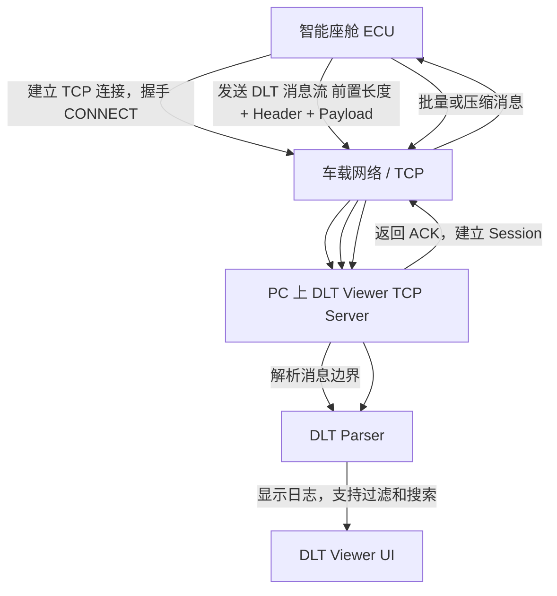

```mermaid
flowchart TB
    %% 定义参与方
    ECU["智能座舱 ECU"] 
    TCP_NETWORK["车载网络 / TCP"] 
    DLT_SERVER["PC 上 DLT Viewer TCP Server"] 
    DLT_PARSER["DLT Parser"]
    DLT_UI["DLT Viewer UI"]

    %% 数据流
    ECU -->|建立 TCP 连接，握手 CONNECT| TCP_NETWORK
    TCP_NETWORK --> DLT_SERVER
    DLT_SERVER -->|返回 ACK，建立 Session| TCP_NETWORK
    TCP_NETWORK --> ECU

    ECU -->|发送 DLT 消息流 前置长度 + Header + Payload| TCP_NETWORK
    TCP_NETWORK --> DLT_SERVER
    DLT_SERVER -->|解析消息边界| DLT_PARSER
    DLT_PARSER -->|显示日志，支持过滤和搜索| DLT_UI

    %% 可选优化
    ECU -->|批量或压缩消息| TCP_NETWORK
    TCP_NETWORK --> DLT_SERVER
    DLT_SERVER --> DLT_PARSER

```
