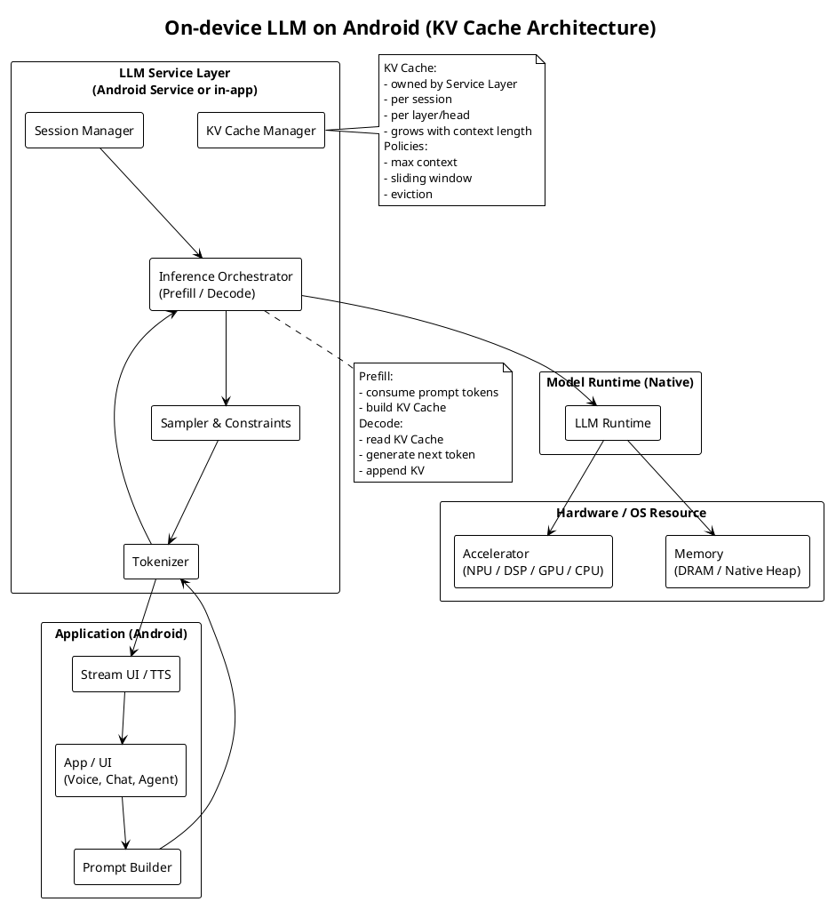

+++
date = '2025-08-27T17:17:50+08:00'
draft = true
title = ' '
+++

```plantuml
@startuml
!theme plain
skinparam componentStyle rectangle
skinparam shadowing false
skinparam packageStyle rectangle
skinparam nodesep 60
skinparam ranksep 60
top to bottom direction

title On-device LLM on Android (KV Cache Architecture)

package "Application (Android)" {
  [App / UI\n(Voice, Chat, Agent)]
  [Prompt Builder]
  [Stream UI / TTS]

  [App / UI\n(Voice, Chat, Agent)] --> [Prompt Builder]
  [Stream UI / TTS] --> [App / UI\n(Voice, Chat, Agent)]
}

package "LLM Service Layer\n(Android Service or in-app)" {
  [Session Manager]
  [Tokenizer]
  [Inference Orchestrator\n(Prefill / Decode)]
  [Sampler & Constraints]
  [KV Cache Manager]

  [Prompt Builder] --> [Tokenizer]
  [Tokenizer] --> [Inference Orchestrator\n(Prefill / Decode)]
  [Session Manager] --> [Inference Orchestrator\n(Prefill / Decode)]
  [Inference Orchestrator\n(Prefill / Decode)] --> [Sampler & Constraints]
}

package "Model Runtime (Native)" {
  [LLM Runtime]
}

package "Hardware / OS Resource" {
  [Memory\n(DRAM / Native Heap)]
  [Accelerator\n(NPU / DSP / GPU / CPU)]
}

' Layer-to-layer flow
[Inference Orchestrator\n(Prefill / Decode)] --> [LLM Runtime]
[LLM Runtime] --> [Memory\n(DRAM / Native Heap)]
[LLM Runtime] --> [Accelerator\n(NPU / DSP / GPU / CPU)]
[Sampler & Constraints] --> [Tokenizer]
[Tokenizer] --> [Stream UI / TTS]

note right of [KV Cache Manager]
KV Cache:
- owned by Service Layer
- per session
- per layer/head
- grows with context length
Policies:
- max context
- sliding window
- eviction
end note

note bottom of [Inference Orchestrator\n(Prefill / Decode)]
Prefill:
- consume prompt tokens
- build KV Cache
Decode:
- read KV Cache
- generate next token
- append KV
end note

@enduml


```