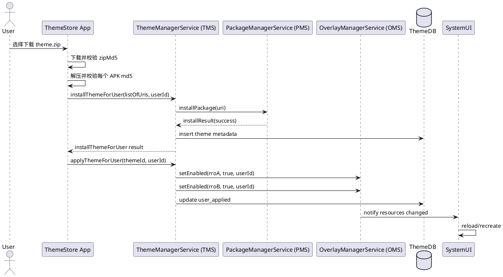

+++
date = '2025-08-03T17:17:50+08:00'
draft = false
title = 'OEM 多品牌多用户动态主题引擎 — 软件架构设计文档'
+++

# 

**版本**：1.0
**日期**：2025-08-08
**作者**：Assistant (基于您提供的需求与设计稿)

> 目标：基于您给定的 14 项核心需求，提供一份可执行的软件架构设计，包含架构决策、模块划分、接口定义、数据模型、部署/安全/性能要点、替代方案比较与风险缓解措施。本文档假定目标设备为量产 Android 设备（不可获取 platform 私钥），支持多品牌、多用户、主题商店、云同步、个性化微调。

---

# 目录

1. 概述
2. 需求映射（与优先级）
3. 总体架构（两套可选部署：A. framework TMS；B. App-integrated TMS）
4. 组件设计与职责
5. 主题包规范与安装流程（manifest、校验、签名）
6. 个性化定制实现（推荐方案）
7. AIDL / API 设计（system\_server 方案）与 App API（App-integrated 方案）
8. 数据模型（ThemeDB）与同步策略
9. 安全与权限方案
10. 性能优化要点与进程/刷新策略
11. 测试计划与上线验证要点
12. 替代方案对比与决策理由（含“动态生成 RRO APK”结论）
13. 风险清单与缓解措施
14. 迭代路线图（短中长期建议）
    附录：PlantUML 示例（安装/应用序列）与示例 AIDL、表结构

---

# 1. 概述

本架构旨在实现一个企业级、可扩展的主题引擎，满足 OEM 的多品牌预置需求、运行时主题切换、个性化微调、云端同步与多用户隔离。设计原则：**安全优先 → 稳定性 → 可维护性 → 兼顾迭代速度**。在关键点（TMS 放置、个性化如何实现）提供两条可选路径并给出推荐。

---

# 2. 需求映射（优先级）

将原始 14 项需求按优先级分为必需/强烈期望/可选：

* **必需（M）**：多品牌预设（1），动态主题切换（2），全局深度美化（3），多用户隔离（4），安全与权限控制（8），兼容性检测与恢复默认（12/14）。
* **强烈期望（H）**：版本管理（5），性能优化（7），主题预览（11），主题包规范（6）。
* **可选/增强（L）**：个性化定制（9），跨设备同步（10），多语言（13）。

架构设计将优先保证 M/H 级需求实现，并对 L 级给出实用可落地方案。

---

# 3. 总体架构（两种部署选型）

## 概览

主要参与方：**主题商店 App (StoreApp)**、**ThemeManagerService (TMS)**、**OverlayManagerService (OMS)**、**PackageManagerService (PMS)**、**AssetManager**、**ThemeDB** 与 **OEM 云服务**（Server / AccountServer）。

### 方案 A（推荐用于安全优先 / 多客户端复用）

* **TMS 作为框架级系统服务**，驻留在 `system_server`，通过 AIDL 对授权客户端（主题商店、运营工具）提供能力。
* 优点：安全、可复用、生命周期与系统一致。
* 缺点：迭代需 OTA，开发门槛高。

### 方案 B（推荐用于单一官方商店、快速迭代）

* **TMS 集成到主题商店 App**（system app / shared-signature），直接调用 OMS/PMS，管理 ThemeDB。
* 优点：迭代快、实现简单。
* 缺点：安全依赖 App 权限、难以对第三方开放 API。

**选择策略**：如果 OEM 需要多个授权客户端或极高安全性，选方案 A；若仅官方商店并追求快速迭代，选方案 B。文档后文以方案 A 为主展开（需 AIDL、ThemeDB 层）并在适当位置指出方案 B 的变体实现方式。

---

# 4. 组件设计与职责

## 4.1 ThemeManagerService (TMS) —（若方案 A）

**职责**

* 主题包生命周期管理（install / uninstall / upgrade / rollback）
* 主题元数据管理（ThemeDB 读写）
* 兼容性检查（minSdkVersion / targetPlatform / RRO 依赖）
* 签名与来源校验（结合 PMS）
* AIDL 接口暴露：installThemeForUser, applyThemeForUser, getThemeListForUser, applyCustomization, rollbackTheme...
* 生成/应用“定制策略”（但不在设备端编译新的、未签名 APK）

**实现要点**

* TMS 执行敏感操作在系统权限上下文（system\_uid）并进行审计日志。
* 不在设备端进行 platform 签名操作；若需服务器签名则协调云端流程。

## 4.2 Theme Store App (StoreApp)

**职责**

* UI / 商城 / 下载逻辑
* 解压 .zip、MD5 校验、通过 FileProvider 提供 APK Uri
* 发起 installThemeForUser 的 AIDL 调用（方案 A）或直接调用 PMS/OMS（方案 B）
* 主题预览（使用 Context.createPackageContext 加载 RRO 资源）

## 4.3 OverlayManagerService (OMS)

* 负责启用/停用 overlay（RRO）
* TMS/StoreApp 请求时做 enable/disable，并发出资源变更通知

## 4.4 PackageManagerService (PMS)

* 负责 APK 安装流程（签名校验、包管理）
* TMS 调用 PMS 安装时，PMS 返回安装结果

## 4.5 AssetManager / ResourcesImpl

* 读取已安装 RRO 中实际资源
* 推荐：为“可定制参数”提供运行时参数 hook（若 OEM 接受对 Framework 修改）

## 4.6 ThemeDB（持久层）

* 存储主题元数据、已安装主题、用户当前主题、版本/时间戳、兼容性状态、定制参数元数据
* 访问方式：**方案 A**：仅 TMS 直接访问 DB，外部通过 AIDL；**方案 B**：StoreApp 可直接管理但应使用 ContentProvider 或 API 层避免并发。

---

# 5. 主题包规范与安装流程

## 5.1 主题包（主题.zip）结构（建议）

```
theme.zip
├─ manifest.json           // themeId, name, versionName, zipMd5, rroApks[]
├─ rros/
│   ├─ framework-res.apk
│   ├─ systemui.apk
│   └─ ... 
└─ previews/
    ├─ preview_lock.png
    └─ preview_home.png
```

`manifest.json` 中每个 rroApk 应包含 `file`, `targetPackage`, `md5`, `versionCode`, `minSdkVersion`, `isCustomizable`。

## 5.2 签名与校验

* **必须**：每个 RRO APK 要求云端签名（platform 或 OEM 签名与目标 overlay 签名相兼容），设备侧仅做签名验证，不重签。
* 下载逻辑：

  1. StoreApp 下载 zip 并比对 `zipMd5`；
  2. 解压后逐个对比每个 APK 的 md5 与 manifest 中记录；
  3. 通过 FileProvider 提交 APK Uri 给 TMS（AIDL）或直接用 PMS 安装（B 方案）。
* 若 APK 签名不匹配 → 标记为“不兼容”并拒绝安装。

## 5.3 安装/回滚流程（概要）

* 在 TMS 中实现事务化安装：逐个安装 RRO APK，若任一失败则回滚已安装的 RRO（卸载）。
* 安装成功后写入 ThemeDB，并调用 OMS 启用（或等待用户 apply）。
* 回滚：调用 OMS 停用并卸载无效 APK，恢复上一个版本的 metadata。

（参见附录 PlantUML 安装/应用序列示例）

---

# 6. 个性化定制实现（推荐方案）

**设计目标**：支持用户调色/字体等“微调”，在量产设备上无需设备端 platform 私钥、不会重新签名 APK，且能实时/准即时生效。

## 推荐混合方案（强烈推荐）

* **主要思路**：组合 **预编译 Overlay 套件（覆盖常见选项） + 参数化运行时替换（Framework hook 或受控运行时映射）**。

  * 预编译多套 Overlay：覆盖常见的颜色/字体/图标形状组合（快速切换、零签名）。
  * 个性化（任意颜色值）采用“参数表 + 轻量替换机制”：

    * **方案 6.A（若可修改 Framework）**：在 ResourcesImpl/AssetManager 增加参数映射层（theme\_params.json），系统资源读取时优先查映射（支持即时生效，最优用户体验）。
    * **方案 6.B（不改 Framework）**：预置一个“可写资源宿主”RRO模板（已签名）在系统分区中，里面使用占位资源引用；StoreApp 只更新该模板 RRO 外部的资产（例如放在 `/data/system/theme_assets/` 并由 SystemUI/Launcher 等进程读取）。该方案需要受控的 App 支持（SystemUI/Launcher 加载外部 assets）。
  * 动态生成完整 APK 并在设备端签名 **不可行**（量产设备无 platform 私钥）。

## 具体实现（方案 6.A 假设可改 Framework）

* 新增 `ThemeParamManager`（SystemService 或 TMS 子组件）：

  * 存放 `/data/system/theme_params.json`（userId 隔离）
  * 提供 `getParam(resourceId)` 接口给 ResourcesImpl
  * 当用户修改参数时写入 JSON 并发出 `ThemeParamChanged` 广播；ResourcesImpl 在下一次资源加载查询新值并生效（可配合进程级刷新）
* 优点：即时生效、无 APK 安装、灵活
* 缺点：需要 ROM 修改，维护成本增加

---

# 7. AIDL / API 设计（方案 A：TMS 在 framework）

下面是核心 AIDL 接口草案（简化版，实际需更多错误码与安全校验）：

**文件**: `IThemeManagerService.aidl`

```aidl
package com.oem.themes;

import android.net.Uri;
import com.oem.themes.ThemeInfo;
import com.oem.themes.CustomizationRequest;

interface IThemeManagerService {
    boolean installThemeForUser(in List<Uri> apkUris, int userId);
    List<ThemeInfo> getThemeListForUser(int userId);
    ThemeInfo getThemeInfoForUser(String themeId, int userId);
    boolean applyThemeForUser(String themeId, int userId);
    ThemeInfo getAppliedThemeForUser(int userId);
    boolean rollbackTheme(String themeId, int userId);
    boolean deleteThemeForUser(String themeId, int userId);
    boolean applyCustomization(in CustomizationRequest request, int userId);
    boolean clearCustomization(int userId);
    boolean restoreDefaultTheme(int userId);
}
```

**CustomizationRequest** 包含：map\<String,String> 参数（colorPrimary 等）、baseThemeId、timestamp、requestId。

**鉴权**：只有具有 `MANAGE_THEME` 权限或 platform-signed 的客户端方可调用敏感方法。所有调用均记录审计。

---

# 8. 数据模型（ThemeDB）与同步策略

## 8.1 ThemeDB 表结构（简化）

* `themes`:

  * `themeId` TEXT PRIMARY KEY
  * `name` TEXT
  * `author` TEXT
  * `version` TEXT
  * `zipMd5` TEXT
  * `installed` BOOLEAN
  * `installed_at` TIMESTAMP
  * `compatible` BOOLEAN
  * `isCustomizable` BOOLEAN
* `rro_entries`:

  * `id` INTEGER PK
  * `themeId` TEXT FK
  * `apkFile` TEXT
  * `targetPackage` TEXT
  * `md5` TEXT
* `user_applied`:

  * `userId` INTEGER
  * `themeId` TEXT
  * `customParams` JSON
  * `applied_at` TIMESTAMP
* `audit_log`:

  * `id`, `action`, `caller`, `userId`, `timestamp`, `details`

## 8.2 云同步策略

* 云端保存 `themeId`、`appliedTheme`、`customParams`、`lastModifiedTs`。
* 同步策略：

  * 使用 **Last-Write-Wins**（按 timestamp）作为默认，若冲突则提示用户选择或采用 device-preferred 策略。
  * 远程下发仅传 `themeId + diff(customParams)`；若设备缺少 theme package，则提示下载或自动下载（需用户授权或商店策略）。

---

# 9. 安全与权限方案

## 要点

* **签名校验**：PMS 必须校验 RRO APK 签名，且 RRO 的签名必须与 target 包策略相兼容（通常与系统/框架签名匹配或在白名单内）。
* **最小权限**：AIDL 接口加权限注解，只有经过授权的包（platform-signed 或持有 MANAGE\_THEME）才可调用。
* **来源白名单**：仅允许来自 OEM 云端或被白名单的域名下载的 theme.zip（在商店端做校验）。
* **审计与回滚**：重要操作写审计 log；异常安装需自动回滚并上报。
* **SELinux**：为 theme assets、临时目录设置合适的 SELinux 文件上下文，避免越权访问。
* **Network**：下载使用 HTTPS，校验证书并校验 hash。

---

# 10. 性能优化要点与刷新策略

## 性能优化

* **异步安装/IO**：安装、校验、DB 写入均在后台线程，不阻塞 UI。
* **并发限制**：限制同时安装主题包数量（例如单线程队列）以避免 IO 瓶颈。
* **缓存**：TMS 可缓存 ThemeDB 的热数据，定期持久化。
* **预热**：安装主题包后，不立即启用全部 overlay，可延迟到用户 apply 时启用，减少开机时间开销。

## 精准刷新策略

* **资源分级刷新**：

  * **SystemUI/Launcher/Settings**：必需重启进程或调用 `Activity.recreate()`。
  * **普通应用**：仅当使用了 framework 资源时才触发（使用 `notifyChange` 列表过滤）。
* **避免全局重启**：通过 OMS/AMS 的通知机制，仅重启受影响的进程，减少卡顿。

---

# 11. 测试计划与上线验证要点

## 测试维度

* **功能测试**：安装、卸载、启用、回滚、预览、定制、跨设备同步。
* **兼容性测试**：不同 Android 版本，目标包的 minSdk/targetSdk 检查。
* **性能测试**：安装时间、启用 overlay 的延迟、内存/CPU 影响、开机时间影响。
* **安全测试**：签名绕过、篡改主题包、权限滥用（模拟非授权 App 调用）。
* **多用户测试**：不同用户的隔离性、并发切换边界条件。
* **回归测试**：系统升级（OTA）后，主题状态保持/兼容检测。

## 上线验证

* 小批量灰度（10% 设备），记录异常上报。
* 开启详细审计日志与故障自动回滚开关，确保用户能回退到出厂主题。

---

# 12. 替代方案对比与决策理由

## 动态生成 RRO APK（设备端构建 + 签名）——**不可行（量产环境）**

* **理由**：设备无 platform 私钥；本地签名无法通过签名校验；伪造签名或绕过检查会破坏安全模型。除非将签名流程放在受控的服务器端并将签名后的 APK 下发设备（延迟高、复杂）。

## 可行备选

* **预编译 Overlay 组合（主方式）**：高稳定性、快速切换、零签名问题。缺点：组合数量爆炸需平衡。
* **参数化运行时替换（需 Framework 改动）**：最佳用户体验（即时生效），但需要 ROM 改动与维护。
* **模板 RRO + 外部 assets（部分方案）**：能在不签名的前提下让 SystemUI/Launcher 加载外部资源，但需要 App 与系统组件配合。

**决策建议**（基于需求）：采用 **预编译 Overlay + 参数化运行时替换（若可改 Framework 则启用）** 的混合方案。TMS 放置：若安全/多客户端需求高 → 放在 framework；若仅官方商店且追求迭代 → 集成在 store app。

---

# 13. 风险清单与缓解措施

| 风险                 | 严重度 | 缓解                                    |
| ------------------ | --: | ------------------------------------- |
| 动态本地签名 RRO 不可行     |   高 | 改用云端签名或模板/参数化方案                       |
| 未授权安装恶意 RRO        |   高 | 严格签名+来源校验+安装白名单                       |
| ThemeDB 并发冲突       |   中 | 通过 Service 封装访问或 ContentProvider + 事务 |
| 主题切换导致 SystemUI 崩溃 |   高 | 上线自动回滚；在启用 overlay 前做兼容性 dry-run      |
| 多设备同步冲突            |   中 | 使用 timestamp/version；冲突提示用户           |
| 性能（切换卡顿）           |   中 | 精准刷新、只重启受影响进程；预编译 Overlay             |

---

# 14. 迭代路线图（建议）

* **Sprint 0（原型）**：实现 StoreApp 下载流程、manifest 校验、用现有预编译 Overlay 实现 install/apply（方案 B 最快）— 验证端到端流程。
* **Sprint 1（TMS 基本版）**：设计并实现 TMS（框架版）最小可用接口：install/apply/getList/rollback。搭建 ThemeDB、审计日志。
* **Sprint 2（个性化）**：实现预编译 Overlay 的组合映射；引入参数化机制原型（若可改 Framework）。
* **Sprint 3（安全/云）**：上线签名验证、来源白名单、云端签名流水线（仅 server 端签名生产）。
* **Sprint 4（优化/量产）**：性能调优、回归测试、灰度发布、监控与上报。

---

# 附录

## PlantUML：安装与应用序列（TMS 在 framework）



## 示例 ThemeDB 建表（SQL）

```sql
CREATE TABLE themes (
  themeId TEXT PRIMARY KEY,
  name TEXT,
  author TEXT,
  version TEXT,
  zipMd5 TEXT,
  installed INTEGER,
  installed_at INTEGER,
  compatible INTEGER,
  isCustomizable INTEGER
);

CREATE TABLE rro_entries (
  id INTEGER PRIMARY KEY AUTOINCREMENT,
  themeId TEXT,
  apkFile TEXT,
  targetPackage TEXT,
  md5 TEXT
);

CREATE TABLE user_applied (
  userId INTEGER,
  themeId TEXT,
  customParams TEXT,
  applied_at INTEGER,
  PRIMARY KEY (userId)
);

CREATE TABLE audit_log (
  id INTEGER PRIMARY KEY AUTOINCREMENT,
  action TEXT,
  caller TEXT,
  userId INTEGER,
  timestamp INTEGER,
  details TEXT
);
```

---

# 总结（行动项）

1. **选择 TMS 放置位置**（framework vs App）— 按你们对安全/迭代的权衡给出决策。若需我可基于你们组织偏好给出直接建议。
2. **放弃设备端动态签名 RRO 的实现**，改用“预编译 Overlay + 参数化运行时替换”的混合实现。
3. **下一步交付**：我可以（任选其一）：

   * 生成完整的 `IThemeManagerService.aidl` 及 Java 框架层骨架代码；或
   * 生成主题商店（StoreApp）侧的安装/预览/同步详细实现样例；或
   * 给出 Framework hook (ResourcesImpl) 的详细设计与伪代码，用于实现参数化运行时替换。

你想优先让我做哪一项？我会直接做出对应交付。
