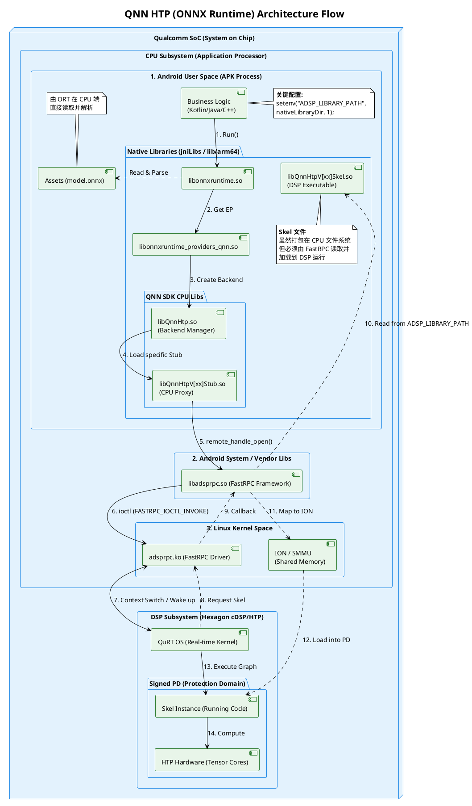

+++
date = '2025-08-27T17:17:50+08:00'
draft = false
title = 'QNN HTP (ONNX Runtime) 架构与调用流程详解'
+++

## 1. 概述

本架构图展示了从 Android 应用层（CPU）到高通 Hexagon DSP（NPU）层的完整调用链路。核心机制是利用 **FastRPC** 跨越处理器边界，将存储在 CPU 文件系统中的 NPU 驱动代码（Skel）动态加载到 DSP 中运行，从而实现模型的高性能推理。

## 2. 核心组件分层

### 2.1 Android User Space (应用层)

这是应用程序运行的进程空间，包含了业务代码和所有的第三方依赖库。

* **Business Logic**: 你的业务代码（Kotlin/Java/C++）。
* **关键配置**: 必须在初始化时设置环境变量 `setenv("ADSP_LIBRARY_PATH", nativeLibraryDir, 1)`，否则 FastRPC 将无法找到 Skel 文件。

* **ONNX Runtime (ORT)**: 微软提供的统一推理引擎 (`libonnxruntime.so`)。
* **QNN Execution Provider (EP)**: ORT 与 QNN 之间的适配层 (`libonnxruntime_providers_qnn.so`)。
* **QNN CPU Libraries**:
* `libQnnHtp.so`: **Backend Manager**，负责管理 HTP 后端的生命周期。
* `libQnnHtpV[xx]Stub.so`: **CPU Proxy (桩)**，负责在 CPU 端打包数据和指令，并通过 RPC 发送给 DSP。

* **Skel File (关键)**:
* `libQnnHtpV[xx]Skel.so`: **DSP Executable (骨架)**。这是真正运行在 NPU 上的“服务端”代码。
* **注意**: 尽管它物理上存储在 APK 的 `lib/arm64` 目录下（CPU 文件系统），但它**不**在 CPU 上执行，而是被传输到 DSP 内存中运行。

### 2.2 Android System & Kernel (系统与内核层)

负责 CPU 与 DSP 之间的通信桥梁。

* **libadsprpc.so (FastRPC Framework)**: Android 系统提供的用户空间库，用于发起 RPC 调用。
* **adsprpc.ko (FastRPC Driver)**: Linux 内核驱动，负责处理内存映射、中断和跨核通信。
* **ION / SMMU**: 共享内存管理器。允许 CPU 和 DSP 访问同一块物理内存（零拷贝），显著提高大数据传输效率。

### 2.3 DSP Subsystem (硬件层)

高通 Hexagon 处理器的运行环境。

* **QuRT OS**: 高通的实时微内核 (Real-time Kernel)，管理 DSP 资源。
* **Signed PD (Protection Domain)**: 受保护的进程域。为了安全，未签名的代码无法在此运行。
* **Skel Instance**: 加载进内存并正在运行的 `Skel.so` 实例。
* **HTP Hardware**: 实际执行张量计算的硬件核心。

---

## 3. 详细调用流程 (Step-by-Step)

流程分为五个主要阶段，对应图中的编号 **1-14**。

### 第一阶段：应用发起 (App Invocation)

1. **Run()**: 业务代码调用 ONNX Runtime 的推理接口。
2. **Get EP**: ORT 识别到配置了 QNN，将任务分发给 QNN EP。
3. **Create Backend**: EP 调用 `libQnnHtp.so` 初始化 HTP 后端。
4. **Load Stub**: 后端管理器根据当前芯片型号，加载对应的桩文件（如 `libQnnHtpV81Stub.so`）。

### 第二阶段：RPC 桥接 (RPC Bridging)

5. **remote_handle_open()**: Stub 库调用系统的 `libadsprpc.so`，请求连接 DSP。
6. **ioctl (INVOKE)**: 用户空间库通过 `ioctl` 系统调用进入内核驱动 `adsprpc.ko`。

### 第三阶段：DSP 唤醒 (Wake up)

7. **Context Switch**: 内核驱动发送硬件中断，唤醒沉睡中的 DSP 子系统 (QuRT OS)。

### 第四阶段：Skel 加载回环 (The Side-load Loop) —— **最关键步骤**

这是最容易出错的环节。DSP 自身没有文件系统，它需要“反向”请求 CPU 提供代码文件。
8.  **Request Skel**: QuRT 发现需要运行 V81 版本的代码，向内核驱动请求 `libQnnHtpV81Skel.so`。
9.  **Callback**: 驱动无法直接读文件，于是**回调** (Callback) 到用户空间的 `libadsprpc.so`。
10. **Read file (Red Arrow)**: `libadsprpc.so` 根据之前设置的 `ADSP_LIBRARY_PATH` 环境变量，在 APK 的安装目录下找到并读取 Skel 文件。
11. **Map to ION**: 将读取的文件内容写入 ION 共享内存。
12. **Load into PD**: DSP 从共享内存中读取代码，通过签名验证后，加载到保护域 (PD) 中成为可执行实例。

### 第五阶段：硬件执行 (Execution)

13. **Execute Graph**: QuRT 调度 `Skel Instance` 开始工作。
14. **Compute**: Skel 驱动底层的 HTP 硬件进行矩阵运算，并将结果原路返回。

---

## 4. 开发与调试重点

* **Skel 文件必须打包**: 务必确保 `libQnnHtpV[xx]Skel.so` 被正确打包进 APK 的 `jniLibs` 或 `assets` 中。如果 DSP 请求文件时（步骤 8-10）在路径中找不到文件，初始化将直接失败。
* **环境变量设置**: 图中 Note 提到的 `setenv("ADSP_LIBRARY_PATH", ...)` 是必不可少的。因为系统的 FastRPC 库默认不知道你的 App 安装在哪个随机生成的路径下，必须显式告知。
* **版本匹配**: Stub（CPU侧）和 Skel（DSP侧）必须属于同一个 QNN SDK 版本，否则在握手阶段会因协议不一致而崩溃。