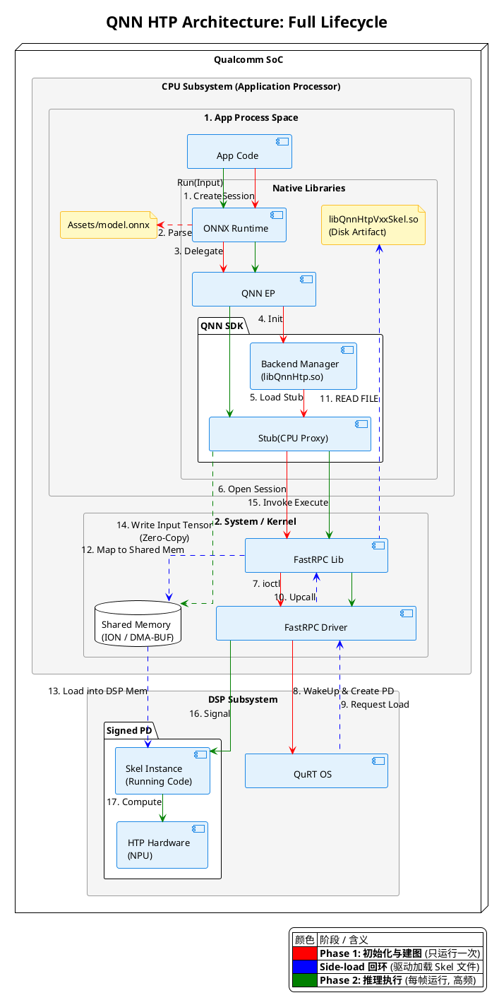

+++
date = '2025-08-27T17:17:50+08:00'
draft = false
title = 'QNN HTP (ONNX Runtime) 架构原理与全链路调用详解'
+++

## 1. 架构全景图

本架构图展示了从 Android 应用层（CPU）到高通 Hexagon DSP（NPU）层的完整调用链路。

核心设计理念在于 **控制与数据分离**：
* **控制流**：利用 **FastRPC** 跨越处理器边界，将存储在 CPU 文件系统中的 NPU 驱动代码（Skel）动态“侧载” (Side-load) 到 DSP 中运行。
* **数据流**：利用 **ION/DMA-BUF** 共享内存实现零拷贝传输，确保证推理性能。

---

## 2. 核心全生命周期解说

整个运行过程分为三个严格的时序阶段，对应架构图中的三种颜色。

### 第一阶段：初始化与建图 (Phase 1: Initialization)

> **图例颜色：红色 ──>**
> *此阶段通常在应用启动时执行一次，负责建立上下文。*

1. **模型解析 (CPU)**：**关键点！** ORT 在 CPU 侧直接读取并解析 `model.onnx` 文件。模型结构被解析为内存对象，ORT 识别出支持 NPU 加速的节点，将其委托给 `QNN EP`。
2. **任务委托**：调用链经过 `QNN EP` -> `Backend Manager` -> `Stub`。
3. **握手与唤醒**：`Stub` (CPU 代理) 通过 `FastRPC` 向底层驱动发起 `open` 请求。底层驱动唤醒沉睡的 DSP 子系统，并在其上创建一个受保护的进程域 (Signed PD)。

### 第二阶段：Skel 加载回环 (The Side-load Loop)

> **图例颜色：蓝色 ..>**
> *这是 QNN 架构最核心的“反向加载”机制。*

1. **反向请求 (Upcall)**：DSP 启动后，发现需要加载 HTP 硬件驱动逻辑，于是向 CPU 发起一个“请求读取文件”的反向 RPC 调用。
2. **文件定位**：CPU 端的 `FastRPC Lib` 收到请求，根据环境变量（`ADSP_LIBRARY_PATH`）在 APK 的 Native 库路径下搜索并定位 `libQnnHtpVxxSkel.so`。
3. **共享内存传输**：FastRPC **不**通过慢速的 RPC 协议拷贝文件内容，而是将文件直接映射到 **共享内存 (ION/DMA-BUF)** 中。
4. **DSP 加载**：DSP 直接从共享内存读取 Skel 镜像并完成加载。至此，`Skel Instance` (服务端) 就位。

### 第三阶段：推理执行 (Phase 2: Execution)

> **图例颜色：绿色 ──>**
> *此阶段为高频运行（如每秒 30 帧），追求极致的低延迟。*

1. **零拷贝输入**：当应用调用 `Run()` 时，大的输入数据（如图片张量）被直接写入 **共享内存 (Mem)**。
2. **轻量级指令**：`QnnStub` 仅通过 RPC 发送一条轻量级的 `Execute` 指令（包含数据在共享内存中的句柄/地址）。
3. **硬件计算**：DSP 端的 `SkelRun` 收到指令，指挥 `HTP Hardware` (Tensor Cores) 全速运转。
4. **结果返回**：计算结果同样写入共享内存，CPU 直接读取，全程无数据拷贝。

---

## 3. 核心组件与物理隔离

理解 QNN HTP 架构，必须明确以下组件的物理存储与运行位置的隔离性：

### 3.1 Android User Space (应用层)

* **模型文件 (`model.onnx`)**:
* **存储**: `Assets` 或 App 私有文件目录 (`/data/user/0/.../files`)。
* **解析**: 仅在 **CPU** 端由 ORT 解析，**不**传输给 DSP。

* **Skel 库 (`libQnnHtpVxxSkel.so`)**:
* **存储**: 系统 Native 库目录 (`/data/app/~~xxx/lib/arm64`)。
* **运行**: 虽然存放在 CPU 磁盘上，但必须通过 FastRPC 加载到 **DSP 内存** 中运行。

* **Stub 库 (`libQnnHtpVxxStub.so`)**:
* **运行**: 在 **CPU** 端运行，负责参数编组 (Marshalling)，是 FastRPC 的客户端。

### 3.2 Android System & Kernel

* **libadsprpc.so**: 提供了 `apps_std_fopen_with_env` 等关键函数，用于响应 DSP 的文件读取请求。
* **ION / DMA-BUF**: 现代 Android 的共享内存机制，是 CPU 与 DSP 高性能通信的基石。

### 3.3 DSP Subsystem

* **Signed PD**: 受签名的保护域，类似于 Linux 的用户空间进程。如果 Skel 版本不匹配或签名校验失败，加载将在此处终止。

---

## 4. 开发与调试避坑指南

1. **环境变量至关重要**:
* 必须在初始化 ORT/QNN 之前设置：`setenv("ADSP_LIBRARY_PATH", nativeLibraryDir, 1)`。
* **原因**: FastRPC 是系统库，它不知道你 APK 的安装路径。如果不设置，它无法在“Side-load 回环”阶段找到 `Skel.so`，导致初始化失败。

2. **Skel 文件必须打包**:
* 务必确保 `libQnnHtpV[xx]Skel.so` 被正确打包进 APK 的 `jniLibs` 中。它是 DSP 侧的“驱动”，没有它 NPU 无法工作。

3. **版本强一致性 (Strict ABI)**:
* **Stub (CPU)** 和 **Skel (DSP)** 必须属于同一个 QNN SDK 版本。
* **后果**: 如果 Stub 发送 V2 协议的数据包，而 DSP 加载了 V1 版本的 Skel，会导致内存解析错误、签名不匹配 (Signature Mismatch) 或直接 Crash。

