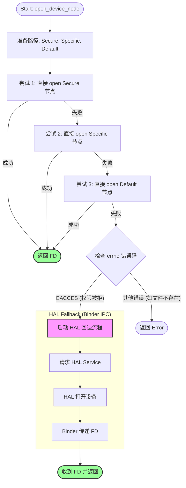

## libadsprpc.so

基于反汇编代码和我们之前的深度讨论，以下是 `open_device_node` 函数的详细工作流程总结。

这个函数是 FastRPC 库 (`libadsprpc.so`) 建立 CPU 与 DSP 通信链路的**第一步**，其核心设计理念是**“效率优先，兼容兜底”**。

---

### 1. 函数概览

* **输入**: `domain_id` (如 ADSP, CDSP, SDSP 的 ID)。
* **输出**: `fd` (File Descriptor，文件描述符)。如果成功，返回 `>0` 的整数；失败返回负数错误码。
* **目的**: 打开内核设备节点（Character Device Node），建立通往 DSP 的物理通道。

---

### 2. 详细工作流程 (Step-by-Step)

#### **阶段一：路径准备 (Path Preparation)**

函数首先根据传入的 `domain_id`，准备三个候选的设备节点路径。这是一种“广撒网”的策略，以适应不同设备或 Android 版本的命名差异。

1. **安全节点 (High Priority)**: `__ptr`
* 例如：`/dev/adsprpc-smd-secure`
* 用于需要签名认证的安全计算场景。

2. **特定域节点 (Medium Priority)**: `__ptr_00`
* 例如：`/dev/adsprpc-smd-cdsp` (针对 CDSP) 或 `/dev/adsprpc-smd-adsp`。

3. **默认通用节点 (Low Priority)**: `__ptr_01`
* 通常是：`/dev/adsprpc-smd`
* 这是最古老且最通用的节点。

#### **阶段二：直接尝试 (The Direct Open Loop)**

代码尝试通过 Linux 标准系统调用 `open()` 直接打开上述路径。这是**“乐观策略”**，假设当前进程有权限访问。

* **尝试 1**: `open(安全节点)`
* 成功 -> **直接返回 FD** (流程结束)。
* 失败 -> 检查原因。如果只是“文件不存在”或“权限不足”，记录日志并继续。

* **尝试 2**: `open(特定域节点)`
* 成功 -> **直接返回 FD** (流程结束)。
* 失败 -> 记录日志并继续。

* **尝试 3**: `open(默认节点)`
* 成功 -> **直接返回 FD** (流程结束)。
* 失败 -> 进入阶段三。

#### **阶段三：错误诊断与分流 (Diagnosis & Fork)**

当三次 `open` 都失败时，函数检查最后一次失败的 `errno` (错误码)，决定下一步怎么走：

* **情况 A：文件不存在 (`ENOENT`)**
* 这意味着内核驱动可能没加载，或者设备节点没创建。
* **结果**: 彻底失败，返回错误。

* **情况 B：权限被拒绝 (`EACCES`, errno 13)**
* 这通常是 **SELinux** 拦截了非系统 App 对 `/dev/` 的直接访问。
* **决策**: 激活 **HAL 回退机制** (进入阶段四)。

#### **阶段四：HAL 救兵 (The HAL Fallback)**

这是针对普通第三方 App 的兼容性路径。

1. **初始化客户端**: 创建 C++ 对象 `android::DspClient`。
2. **呼叫系统服务**: 调用 `open_hal_session`。
* 这会触发 Binder IPC，向高权限的 HAL 服务发送请求。

3. **代理打开**: HAL 服务在它的进程里（有权限）打开设备节点。
4. **传递句柄**: HAL 通过 Binder 将打开的 FD 传递回当前进程。
5. **返回**: 函数最终返回这个由 HAL 帮忙打开的 FD。

---

### 3. 流程图解 (Visual Summary)

### 4. 核心总结

1. **先斩后奏**：总是优先尝试直接 `open`，因为系统调用（Syscall）比跨进程通信（Binder IPC）快得多。
2. **智能回退**：只有在明确遇到“权限拒绝”时才动用 HAL，避免了无谓的性能损耗。
3. **多路兼容**：通过尝试三个不同的设备路径，兼容了不同年代和不同配置的高通芯片平台。

这就是为什么无论是在 Root 过的设备 shell 中运行，还是在受限的 APK 中运行，FastRPC 都能正常工作的底层原因。