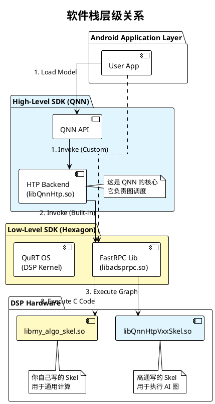

+++
date = '2025-08-27T17:17:50+08:00'
title = 'Qualcomm Hexagon DSP 开发指南：AI 推理与通用计算'
categories = ['Qualcomm', 'DSP', 'AI', 'Embedded']
tags = ['Hexagon SDK', 'QNN', 'FastRPC', 'ONNX']
+++

## 1. 概述

在 Qualcomm Hexagon DSP 的开发生态中，资源的使用方式并非单一路径。根据应用场景、开发难度及工具链的不同，开发模式被明确划分为两条主要赛道：

* **赛道一：AI 推理 (AI Inference)** —— 核心逻辑为 **"模型即代码"**。利用现成的推理引擎运行神经网络。
* **赛道二：通用计算 (General Compute)** —— 核心逻辑为 **"手写算子"**。利用底层 SDK 开发任意 C/C++ 算法。

本文档将详细解析这两条赛道的技术细节、架构区别及选型策略。

---

## 2. 赛道一：AI 推理 (AI Inference)

这是目前移动端最主流的 DSP 用法，旨在利用 DSP/NPU 加速深度学习模型。

### 2.1 核心特征

* **关键词**：`TFLite`, `ONNX Runtime`, `SNPE`, `QNN`, `NNAPI`
* **输入物**：训练好的神经网络模型文件（如 `.onnx`, `.tflite`, `.qnn`）。
* **开发模式**：配置式开发。开发者通常不需要编写 DSP 侧代码，只需在应用层配置“代理”（Delegate）或“后端”（Backend）。

### 2.2 技术原理

在这条赛道中，**IDL（接口定义语言）是隐形的**。

* 高通或第三方框架（如 Google）已经预置了通用的 DSP 骨架库（例如 `libQnnDsp.so` 或 `libhexagon_nn_skel.so`）。
* 这些预置库充当“万能翻译官”，它们能读取神经网络层（如 `Conv2d`, `Softmax`）的定义，并将其转换为 DSP 指令执行。

### 2.3 适用场景

本质上，此模式仅适用于**可以用张量运算描述的任务**：

* **计算机视觉 (CV)**：物体检测 (YOLO)、图像分类 (ResNet)、语义分割、人脸关键点。
* **音频 AI**：关键词唤醒 (KWS)、AI 降噪 (RNN/LSTM)。
* **自然语言处理 (NLP)**：意图识别、Transformer 类模型。

### 2.4 优缺点分析

* **优点**：
* 开发门槛低，无需掌握汇编或嵌入式编程。
* 模型迭代快，直接替换模型文件即可。

* **缺点**：
* **灵活性受限**：无法处理非神经网络逻辑（如复杂的 `if-else` 逻辑、传统图像算法）。

---

## 3. 赛道二：通用计算 (General Compute)

这是传统的嵌入式开发用法，用于处理非神经网络的计算密集型任务，或者为 AI 赛道提供自定义算子支持。

### 3.1 核心特征

* **关键词**：`Hexagon SDK`, `FastRPC`, `IDL`, `QAIC`, `HVX/HMX`
* **输入物**：C/C++ 源代码 + `.idl` 接口定义文件。
* **开发模式**：全栈式开发。需同时编写 CPU 侧的调用代码和 DSP 侧的实现代码。

### 3.2 工作流程 (FastRPC 机制)

1. **定义接口**：编写 `.idl` 文件，定义 CPU 与 DSP 的函数签名。
2. **生成胶水代码**：使用 `QAIC` 编译器生成 `Stub` (CPU 侧桩代码) 和 `Skel` (DSP 侧骨架代码)。
3. **实现算法**：在 DSP 侧用 C/C++ 实现业务逻辑。
4. **性能优化**：为榨干 DSP 性能，通常需使用 **Hexagon Intrinsics** 编写 HVX 向量化代码。

### 3.3 适用场景

适用于**逻辑复杂、依赖数学公式或特定标准**的任务：

* **传统 ISP**：Bayer 转 RGB、自动白平衡 (AWB)、畸变校正。
* **传统 CV**：特征点匹配 (ORB, SIFT)、RANSAC 算法。
* **编解码**：H.264 解析、MP3/AAC 解码。
* **传感器融合**：卡尔曼滤波 (Kalman Filter)、IMU 数据处理。

### 3.4 优缺点分析

* **优点**：
* **极高的自由度**：可实现任何 C/C++ 逻辑。
* **极致性能**：可手动控制内存和向量指令。

* **缺点**：
* 门槛极高，需精通内存管理 (ION/DMA-BUF)、多线程同步及打包签名流程。

---

## 4. 赛道对比与交集

### 4.1 维度对比表

| 特性 | **赛道 1: AI 框架 (TFLite/ONNX)** | **赛道 2: 通用 DSP 开发 (FastRPC)** |
| --- | --- | --- |
| **核心驱动力** | 神经网络模型文件 | C/C++ 源码 |
| **中间工具** | 模型转换器 (Converter) | QAIC 编译器 |
| **运行实体** | 通用引擎 (`libQnnHtp.so`) | 自定义库 (`lib_skel.so`) |
| **IDL 需求** | **不需要** (框架内置) | **必须** (开发者定义) |
| **主要难点** | 量化精度、算子支持度 | 内存管理、并行编程、HVX 优化 |

### 4.2 关键交集：自定义算子 (Custom Operator)

**赛道 2 是赛道 1 的底层基石。**

当 AI 模型中包含一个框架不支持的特殊层（例如某种新型 Attention）时，开发流程如下：

1. 使用 **赛道 2 (Hexagon SDK)** 编写该算子的底层 DSP 实现，并编译为 Op Package (`.so`)。
2. 在 **赛道 1 (QNN SDK)** 中注册该 Op Package。
3. 推理引擎在运行模型时，会自动调度该自定义库来执行特定节点。

---

## 5. SDK 架构深度解析：Hexagon SDK vs. QNN SDK

理解这两个 SDK 的关系是选型的关键。

### 5.1 核心定位

* **Hexagon SDK**: 面向 **底层嵌入式开发者**。提供裸机级别的访问能力（寄存器、HVX、FastRPC）。
* **QNN SDK**: 面向 **AI 应用开发者**。它是基于 Hexagon SDK 构建的高级抽象层，屏蔽了底层的 FastRPC 和硬件细节。

### 5.2 架构依赖关系

QNN SDK 的 HTP Backend 本质上是一个由高通官方使用 Hexagon SDK 开发的复杂 FastRPC 应用。

---

## 6. 附录：AI 模型部署模式详解

在 QNN 或其他推理框架中，模型的加载方式主要分为两种：

### 6.1 解释执行模式 (Interpreted Mode)

* **别名**：Standard Mode, File Mode。
* **原理**：Runtime 像“厨师看菜谱”一样，运行时读取 `.onnx` 文件，解析节点结构，动态在内存中构建计算图。
* **优点**：灵活性高，支持模型热更新（只需下发新文件）。
* **缺点**：初始化耗时较长（需解析和构图）。
* **适用**：快速迭代、需动态下发模型的 App。

### 6.2 模型库模式 (Model Library Mode)

* **别名**：Native Mode, Compiled Mode (`.so`)。
* **原理**：使用工具链像“背下菜谱”一样，将模型结构和权重编译为二进制 `.so` 库。App 运行时直接加载库，跳过解析步骤。
* **优点**：**极致冷启动速度**，零解析开销；模型结构安全性高（难以逆向）。
* **缺点**：集成复杂（模型更新需重新编译发版 APK）；灵活性低。
* **适用**：系统级应用、相机冷启动、核心算法保密场景。