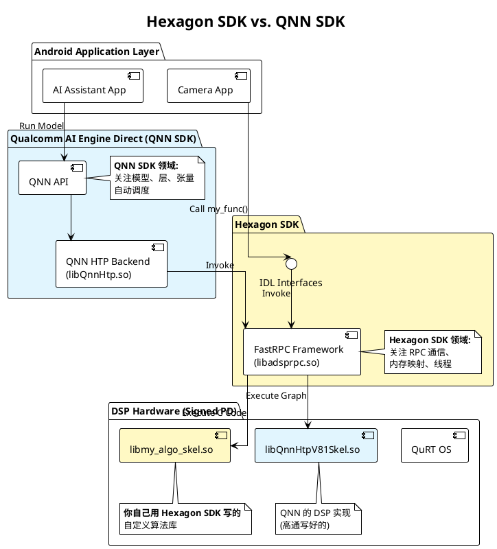

## Hexagon DSP 的生态

在 Qualcomm Hexagon DSP 的生态中，可以把资源的使用方式明确划分为**两条主要赛道**。它们针对的场景不同，开发难度不同，工具链也完全不同。

### 1. 第一条赛道：AI 推理 (AI Inference)
**关键词**：TFLite, ONNX, SNPE, QNN, NNAPI
**核心逻辑**：**“模型即代码” (Model is the code)**

这是目前最主流的用法，主要用于深度学习。

* **主要工作**：
    * 训练模型（在 PC 上用 PyTorch/TensorFlow）。
    * 量化模型（把 float32 转成 int8，为了 DSP 效率）。
    * **配置**：你不需要写 DSP 代码，只需要在 App 里配置“代理”（Delegate）或“后端”（Backend）。
* **IDL 哪里去了？**
    * 高通（或 Google）已经提前写好了通用的 `.idl` 和 `skel.so`。
    * 比如 `libQnnDsp.so` 或 `libhexagon_nn_skel.so`。这些库就像一个“万能翻译官”，它能读懂你的神经网络层（Conv2d, Softmax 等），并指挥 DSP 去执行。
* **优点**：开发快，不用懂 DSP 汇编，只要模型能跑通就行。
* **缺点**：只能做神经网络相关的任务。如果你想做个特殊的“图像去雾算法”或者“音频变声”，这套框架帮不了你。

### 2. 第二条赛道：通用计算 (General Compute / Heterogeneous Computing)
**关键词**：Hexagon SDK, FastRPC, IDL, QAIC, C/C++, HVX/HMX
**核心逻辑**：**“手写算子” (Custom Implementation)**

这是传统的嵌入式开发用法。

* **主要工作**：
    * **定义接口**：必须写 `.idl` 文件，告诉 CPU 和 DSP 怎么传参数。
    * **生成胶水代码**：使用 `QAIC` 编译 IDL，生成 Stub 和 Skel。
    * **实现算法**：在 DSP 侧写 C/C++ 代码（Skel 实现）。如果是为了高性能，你甚至需要用 **Hexagon Intrinsics** 手写向量化指令（利用 HVX 硬件加速）。
* **IDL 的作用**：
    * 因为你的函数是自定义的（例如 `my_special_image_filter()`），高通没法预知，所以必须由你通过 IDL 定义，并由 QAIC 生成专用的桥梁。
* **优点**：
    * **极高的自由度**：可以做任何计算任务（图像处理、CV 算法、音频编解码、加密解密、传感器数据融合）。
    * **极致性能**：你可以手写汇编级优化，榨干 DSP 的每一个时钟周期。
* **缺点**：门槛极高，需要懂内存管理、多线程同步、向量化编程，还要处理复杂的签名和打包流程。

---

### 对比总结表

| 特性 | **途径 1: AI 框架 (TFLite/ONNX)** | **途径 2: 普通 DSP 开发 (FastRPC)** |
| :--- | :--- | :--- |
| **输入物** | 神经网络模型文件 (`.tflite`, `.onnx`, `.dlc`) | C/C++ 源代码 + `.idl` 接口定义 |
| **中间工具** | 模型转换器 (Converter / Quantizer) | **QAIC 编译器** |
| **运行库** | 通用推理引擎 (`libQnnDsp.so`, `libSnpeDsp.so`) | 你编译生成的专用库 (`lib_skel.so`) |
| **是否需要 IDL** | **不需要** (框架内部封装好了) | **必须需要** |
| **主要难点** | 模型量化精度损失、算子支持度 | 内存管理、并行编程、HVX 向量化优化 |
| **典型场景** | 物体检测、人脸识别、语音识别 | 图像预处理(缩放/旋转)、ISP 算法、音频降噪 |

### 它们有交集吗？

**有，而且很重要。**

这就是所谓的 **"Custom Operator" (自定义算子)**。
假设你在跑一个 TFLite 模型，里面有一个很新的数学运算层（比如某种特殊的 Attention 机制），TFLite 的 DSP 代理不支持它。
这时候，你需要：
1.  走 **途径 2**：写 `.idl`，用 C++ 实现这个特殊的算子，编译成一个 DSP 库。
2.  走 **途径 1**：告诉 TFLite，“遇到这个特殊的层，请调用我刚才写的那个库”。

所以，**途径 2 其实是途径 1 的底层基石**。

#### 神经网络相关的任务简介

当我们说“基于 TFLite/ONNX 等框架**只能做神经网络相关的任务**”时，意思是这套工具链的本质是**“解释器”（Interpreter）**。

它不懂你的 C++ 业务逻辑，它只懂**“张量运算”（Matrix Math）**。它的唯一工作就是加载一个你训练好的模型文件，把输入数据喂进去，算出输出结果。

具体来说，这些任务通常指的是**可以用深度学习模型（Deep Learning Models）解决的问题**。

以下是这类任务的具体分类和典型例子：

##### 1. 计算机视觉 (Computer Vision - CV)
这是 DSP 上最常见的神经网络任务。输入是图片/视频帧，输出是识别结果。
* **物体检测 (Object Detection)**: 识别画面里哪里有人、车、红绿灯。（典型模型：YOLO, SSD, EfficientDet）。
* **图像分类 (Image Classification)**: 判断这张图是“猫”还是“狗”。（典型模型：MobileNet, ResNet）。
* **语义分割 (Semantic Segmentation)**: 把背景虚化（比如视频会议换背景），或者自动驾驶中识别哪里是路面。（典型模型：DeepLab, UNet）。
* **人脸关键点 (Face Landmark)**: 识别眼睛、鼻子嘴巴的位置，用于美颜、贴纸特效。
* **超分辨率 (Super Resolution)**: 把 720p 的模糊视频通过 AI 猜想变成 1080p 清晰视频。

##### 2. 音频与语音处理 (Audio & Speech)
输入是麦克风的音频流，输出是文字或增强后的音频。
* **关键词唤醒 (Keyword Spotting)**: 手机待机时监听“Hey Siri”或“小爱同学”。这是一个极小的神经网络，常驻 DSP。
* **语音降噪 (AI Noise Suppression)**: 区分人声和背景噪音（如风扇声），只保留人声。（传统降噪是用滤波算法，现在流行用 RNN/LSTM 神经网络做）。
* **声纹识别 (Speaker Verification)**: 确认说话的人是不是机主。

##### 3. 自然语言处理 (Natural Language - NLP)
虽然大模型（LLM）通常跑在 NPU 上，但 DSP 也可以处理轻量级的 NLP 任务。
* **意图识别**: 比如输入“定明天的闹钟”，模型判断这是一个“设置闹钟”的指令。
* **智能键盘预测**: 预测你下一个要打的字。

---

##### 关键区别：它“不能”做什么？

为了更清楚边界在哪里，我们来看看哪些任务**不属于**“神经网络相关任务”，因此**不能**用 TFLite/ONNX 途径，而必须用 **FastRPC + C++ (IDL)** 的方式去开发：

1.  **传统的 ISP 图像处理**:
    * 比如：**Bayer 格式转 RGB**、**白平衡算法 (AWB)**、**镜头畸变校正**。
    * 这些主要靠几何计算和查表，不是靠神经网络的“权重”算出来的。
    * *虽然现在也有 AI-ISP，但传统流程依然是 C++ 算法的主场。*

2.  **特征点匹配 (传统 CV)**:
    * 比如：**ORB, SIFT, RANSAC** 算法。
    * 这些算法包含大量的 `if-else` 逻辑判断、循环和排序。神经网络框架（TFLite）处理大量的逻辑分支效率极低，它擅长的是乘法和加法。

3.  **编解码 (Codec)**:
    * 比如：解析 H.264 视频流，或者解码 MP3/AAC 音频。
    * 这是严格标准的数学流程，不能用神经网络去“猜”。

4.  **传感器融合 (Sensor Fusion)**:
    * 比如：把加速度计、陀螺仪和 GPS 的数据结合起来计算车辆位置（**卡尔曼滤波**）。
    * 这是一套纯数学公式，完全不需要神经网络。

##### 总结

* 如果你有一个 **`.tflite`** 或 **`.onnx`** 文件，里面装满了卷积层（Conv）、激活层（Relu），那就是**途径 1**。
* 如果你有一堆 **C++ 代码**，里面充满了 `for` 循环、`if` 判断、数学公式（FFT、矩阵求逆），那就是**途径 2**。

**TFLite/SNPE 就像是一个“播放器”**，它只能播放“神经网络”这一种格式的“影片”。如果你想在这个播放器里运行一个 Excel 表格（复杂的逻辑控制），它是做不到的。

## Hexagon SDK 和 Qualcomm AI Engine Direct SDK (QNN)的对比
### 1. 核心定位区别

| 特性 | **Hexagon SDK** | **Qualcomm AI Engine Direct SDK (QNN)** |
| --- | --- | --- |
| **全称** | Qualcomm Hexagon SDK | Qualcomm AI Engine Direct (QNN) |
| **主要目标** | **通用 DSP 编程**。开发运行在 Hexagon DSP 上的任意 C/C++ 算法。 | **AI 模型推理**。在 SoC 各个核心上加速神经网络模型的运行。 |
| **抽象层级** | **底层 (Low-level)**。直接操作 DSP 寄存器、HVX 向量指令、线程调度 (QuRT)。 | **高层 (High-level)**。抽象了硬件细节，提供统一的构图 API (AddNode, Execute)。 |
| **支持硬件** | 仅限 **Hexagon DSP** (cDSP, aDSP, sDSP)。 | **全平台 (AI Engine)**：CPU, GPU (Adreno), DSP/HTP (Hexagon)。 |
| **输入** | C/C++ 源代码、汇编代码。 | 训练好的 AI 模型 (ONNX, TFLite, PyTorch 等)。 |
| **核心机制** | FastRPC (CPU 与 DSP 通信)。 | Backend (后端) 机制，自动调度到底层硬件。 |
| **典型产物** | `libskel.so` (DSP 库), `libstub.so` (CPU 库)。 | `model.cpp/.bin`, `model.so`, `context.bin`。 |

---

### 2. 详细功能解析

#### **Hexagon SDK (底层开发者工具)**

它是给嵌入式开发者用的，让你能完全控制 DSP。

* **用途**：
* **非 AI 算法加速**：图像处理（ISP 后处理）、音频编解码、传感器融合算法。
* **FastRPC 开发**：你需要自己定义 `.idl`，自己写 `stub` 和 `skel`，自己管理内存映射。
* **自定义 AI 算子**：当 QNN 不支持某个算子时，你需要用 Hexagon SDK 手写这个算子的底层实现（Op Package）。

* **你需要懂**：Hexagon 汇编、HVX/HMX 向量化指令、QuRT 操作系统、缓存管理。

#### **QNN SDK (AI 应用开发者工具)**

它是给 AI 算法工程师和 App 开发者用的，让你能快速部署模型。

* **用途**：
* **模型转换**：把 PyTorch/ONNX 模型转成 QNN 格式。
* **统一推理**：用一套 API，你可以选择是在 CPU 上跑，还是 GPU 上跑，还是 HTP (DSP) 上跑，只需改个参数。
* **图优化**：自动进行算子融合、量化、内存复用。

* **你需要懂**：神经网络结构、量化（Int8/FP16）、模型转换工具链。

---

### 3. 它们的关系：上下游依赖

这是最关键的理解点：**QNN SDK 的 HTP Backend 本质上是基于 Hexagon SDK 开发出来的一个超级复杂的“应用”。**

* 高通内部团队使用 **Hexagon SDK** 开发了 QNN 的 HTP 后端驱动（即 `libQnnHtpVxxSkel.so`）。
* 作为外部开发者，你直接使用 QNN SDK 提供的接口，实际上是间接调用了底层的 Hexagon 能力。

### 4. 架构图解

为了更直观地展示区别，我们来看它们在软件栈中的位置：

### 5. 什么时候用哪个？

* **场景 A：我要在手机上跑 YOLOv8 或 ResNet 模型。**
* 👉 **用 QNN SDK**。这是标准用法，无需写底层 C 代码。

* **场景 B：我有一个传统的 CV 算法（如高斯模糊、边缘检测），想搬到 DSP 上省电。**
* 👉 **用 Hexagon SDK**。你需要定义 IDL，写 C/C++ 代码，编译成 Skel。

* **场景 C：我在用 QNN 跑模型，但模型里有一个特殊的层（例如 `MySpecialLayer`），QNN 转换器报错说不支持。**
* 👉 **两个都用**。
* 你需要用 **Hexagon SDK** 编写这个算子的 DSP 实现（Op Package）。
* 然后将其注册给 **QNN SDK**，让 QNN 在推理时调用你的代码。

### 总结

* **Hexagon SDK** 是给 **DSP 程序员** 用的，它是通用的、底层的。
* **QNN SDK** 是给 **AI 工程师** 用的，它是专用的、高层的。