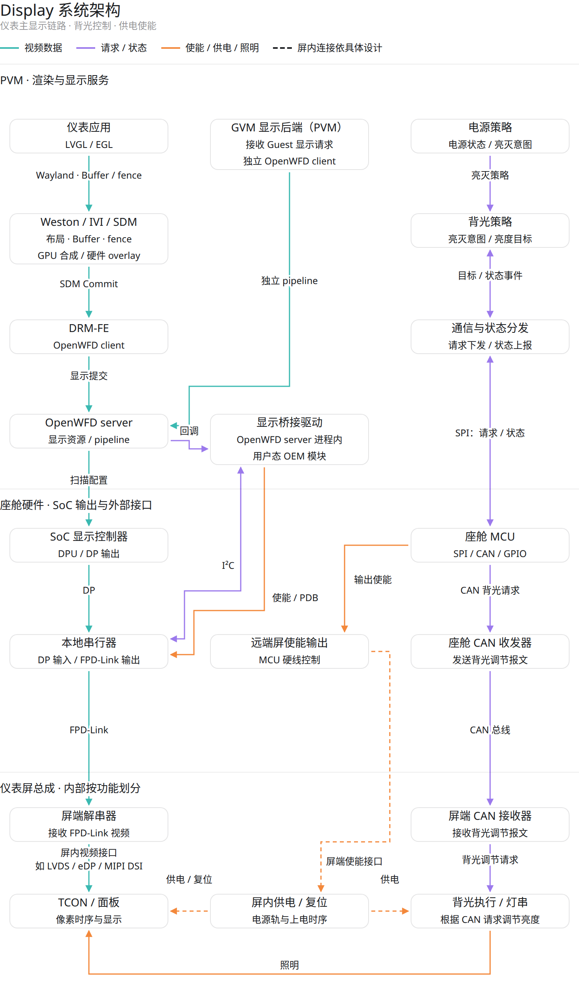
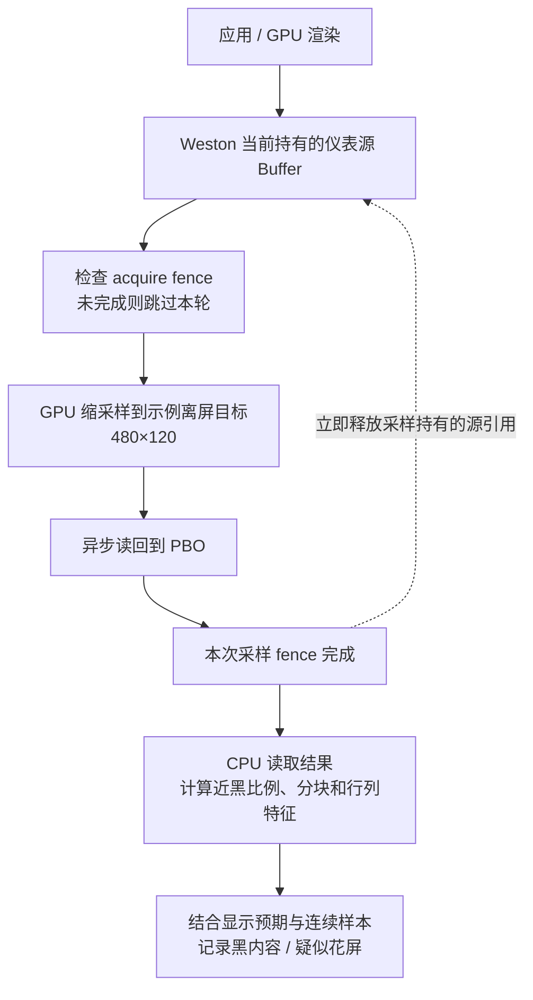
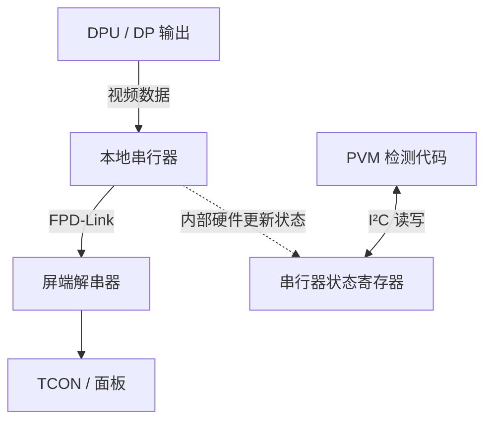

+++
date = '2026-09-11T00:00:00+08:00'
draft = false
title = '仪表黑屏、花屏诊断：故障分析与检测方案'
description = '沿应用渲染、布局合成、显示输出、视频传输和面板链路分析故障，并说明各检测方法的原理、可行性与限制。'
tags = ["PVM", "Weston", "OpenWFD", "Display", "Gunyah"]
+++

## 1. 背景与问题

量产运行中可能出现偶发的仪表黑屏、花屏：画面短暂消失，或者出现色块、条纹、错行，数秒内又恢复。此类问题难以稳定复现，事后仅查看进程是否存活、显示是否 connected，往往无法判断故障发生在哪里。

本文以 PVM 显示实现为基础，讨论如何用代码捕获持续约 1 秒的异常，并记录首次异常观测时间、确认与恢复时间、相关内容或硬件状态，从而缩小故障范围。检测需区分正常显示、合法黑场、休眠和场景切换，并尽量减少对显示任务的干扰。

## 2. 显示链路与故障分析

系统架构包含视频数据、显示设备控制、背光控制和屏端供电四条路径。图中按功能划分组件，实线表示明确的传递关系，虚线表示需要结合屏端实现确定的连接。

[打开交互版架构图](../../static/diagrams/display-system-architecture.html)

*图 1：显示系统架构。交互版支持点击组件查看职责及检测边界。*

1. **视频渲染与显示。** 仪表应用通过 LVGL / EGL 生成像素 Buffer，经 Wayland Surface 提交内容与状态。Weston 的 IVI 控制器负责位置、层级与显隐；SDM 选择 GPU 合成或硬件 overlay：前者生成合成 Buffer，后者交由显示硬件直接处理应用 Buffer。提交经 DRM-FE / OpenWFD 到达 DPU，再由 DP、串行器和 FPD-Link 将视频送到屏端解串器与面板。Guest 显示后端可通过独立 OpenWFD pipeline 绕过 Weston，这部分内容不在 Weston 源采样范围内。
2. **显示设备控制。** 用户态显示桥接驱动运行在 OpenWFD 服务进程内，通过 I²C 配置串行器、读取状态，通过 GPIO 控制本地串行器的供电使能与 PDB（掉电控制）。应分别记录本地串行器状态与屏端面板状态，不能把前者当作面板上电或复位完成的依据。
3. **背光控制。** 电源策略 → 背光策略 → 通信服务 → SPI → 座舱 MCU → CAN → 屏端接收与背光执行。背光目标为零表示请求熄灭背光，并不等于切断屏总成电源；状态报文也需区分命令回显、驱动状态和实际测量值。
4. **屏端供电与复位。** MCU 提供硬线使能；从使能信号到屏内供电、面板复位的连接和时序，需要按屏端电路确认。诊断需要分别记录使能命令、屏端电源状态和面板复位状态；GPIO 输出有效不能代替屏端电压或复位反馈。

| 故障位置 | 可能原因 | 对检测的启示 |
|---|---|---|
| ① 应用渲染与 Buffer | 渲染出黑图、像素内容损坏，或读写同步错误导致读取未完成的画面 | 需要观察像素，并保证采样本身遵守同步规则 |
| ② 布局与合成 | Surface 被隐藏、透明或遮挡，选层或 GPU 合成结果错误 | 源图可能正常，需要核对布局及合成阶段 |
| ③ 显示输出 | 提交停滞、DPU 取数、格式或混合配置错误 | 需要执行反馈；源 Buffer 不能覆盖合成后和扫描阶段 |
| ④ 视频传输 | 视频不同步、链路失锁、线缆异常 | 可利用芯片内部诊断结果 |
| ⑤ 面板与背光 | 屏端处理、供电或背光异常 | 需要屏端反馈；上游正常不能排除这一类故障 |

## 3. 各故障位置如何检测

### 3.1 应用渲染与 Buffer：采样源像素

**原理。** 应用渲染结果首先进入 Buffer。如果异常已经存在于这份像素中，采样后就可以计算近黑比例、条纹和色彩分布等特征。采样必须发生在应用写入完成之后，否则检测代码可能把尚未画完的内容误判为花屏。

*图 2：acquire fence 保证源内容可读；本次采样 fence 保证离屏采样已经完成。两者均不能证明该帧已在实体屏上正确显示。*

**接入方式。** 在 Weston GL renderer 中通过 IVI ID 找到仪表 Surface，读取其有效源纹理；复用 `gl_renderer_surface_copy_content()` 的单 Surface 绘制逻辑，改为固定资源的异步采样。普通 SDM overlay 可能已有导入纹理，即使没有 GPU 重画也能采样，因此不能只在 `gl_renderer_repaint_output()` 中插桩。

以 480×120 为采样目标的设计示例，建议每 200 ms 采样一次，使用一个离屏目标和三个 PBO。提交前持有必要的源 Buffer / release 引用，在采样 fence 完成回调中立即释放；保存和恢复 GL 状态，不强制 repaint，不改变 plane 分配。secure、`direct_display` 占位纹理、导入失败或队列已满时，记录采样不可用。已提交但未完成的 GPU 任务不能提前复用其资源。缺少 PBO / native fence 支持时禁用探针，不退回同步截图。

#### 显示预期

显示预期来自**电源/STR 控制通知和场景策略的显示意图**，通过现有状态通知接入。场景策略应给出是否允许黑场、当前布局/主题及切换结束期限；实际 IVI 可见性、透明度和输出映射只用于对照，不能决定是否免检。

| 预期状态 | 进入条件 | 检测行为 |
|---|---|---|
| `SHOW`：应显示 | 控制状态要求开屏、非 STR，场景要求显示，且切换宽限已结束 | 检查黑内容、花屏候选及布局异常；Surface 被误隐藏也要报告 |
| `BLANK_ALLOWED`：允许黑场 | 有效的关屏/STR 指令，或明确允许黑场且未超期的切换状态 | 不把黑内容判成故障；按是否需要采样管理健康检查 |
| `UNKNOWN`：预期未知 | 来源未接入、来源失联、状态冲突或有效期已过 | 报告预期不可用，仍记录可取得的黑内容和图像特征，不沿用旧的免检状态 |

状态携带更新序号、更新时间和有效期；稳定状态通过来源心跳续期，切换宽限只由新的状态转换开启，普通心跳不能延长黑场期限。关屏/STR 期间按电源状态机停采，唤醒后重新确认预期。切换超期且开屏意图仍有效时，结束免检并报告显示未就绪；若意图本身已失效，则进入 `UNKNOWN`。预期、布局或主题版本变化时重置内容确认计数，已有事件标记上下文改变，不伪记为画面恢复。

#### 黑内容与花屏判据

RGB 使用读回的 8-bit 数值，统一计算亮度特征 `Y = (77×R + 150×G + 29×B + 128) >> 8`。黑内容先检查全图：`Y < 8` 的像素比例超过 `99.8%`，连续 3 个有效样本且跨度至少 400 ms。只有在 `SHOW` 下才升级为源黑内容异常。校准必须覆盖深色主题及文字、图标最少的正常场景：480×120 图像中，非黑像素少于约 115 个就可能触发此阈值。

花屏首版只针对**粗条纹和大块单色覆盖**。将 480×120 图像划分为 20×10 块，每块 24×12 像素，计算：

- `Ex / Ey`：该块像素与右侧/下侧相邻像素的亮度绝对差均值。包含跨块邻接，仅排除整幅图像边缘没有邻居的像素对。
- `μ`：块内 RGB 三通道均值；`V`：三通道像素方差的平均值。
- `D`：`μ` 到该块正常 RGB 均值范围的最大通道距离；落在范围内时距离为零。

同一布局和主题使用固定基线：由正常静态、动画样本记录各块的 RGB 均值范围、`max(Ex,Ey)` 最大值。运行时不自动学习异常帧，也不只与前一帧比较，避免持续损坏在第二帧起被当成正常。

| 类型 | 初始候选条件（亮度和 RGB 均按 0～255 计算） |
|---|---|
| 粗条纹 | 块内 `max(Ex,Ey)` 超过正常最大值至少 8，且不小于 `3×max(min(Ex,Ey),1)`；至少 3 个异常块上下或左右相连 |
| 大块单色覆盖 | `D > 24` 且 `V < 16`，至少 2 个符合条件的块上下或左右相连 |

同类候选在连续 3 个有效样本中出现，首尾跨度至少 400 ms，且相邻样本的候选区域有重叠，才记录 `CORRUPTION_SUSPECT`；保存触发块、特征值和基线版本。用未参与基线生成的正常场景验证误报，再用可复现的条纹、色块故障调整阈值。基线缺失或主题不匹配时报告规则不可用，不能给出“花屏检查正常”。这些规则不识别所有错图；自然图案、单个强边缘仍可能形成候选。

**可行性与边界。** 当前源纹理路径提供了接入位置，但原 Buffer 可能尚未被提交到显示后端，或者随后被遮挡、错误合成。CRC 变化、FPS 正常或图像持续不变，都不能单独判断内容是否正确。普通黑场与黑屏故障也必须结合显示预期区分。

截图接口需要独立验证取帧可靠性和输出覆盖。返回全黑图片或超时，可能来自抓取失败；未经有效性检查的结果不能作为黑屏样本。

### 3.2 布局与合成：检查实际状态是否符合预期

**原理。** IVI 控制器改变 Surface / Layer 的可见性、矩形、透明度、层级和输出归属，Weston 根据这些状态组织场景，SDM 再选择合成方式。像素正常的 Surface，如果被隐藏或移出目标 Layer，也可能无法显示。

每轮 timer 都检查 IVI 布局属性、对应 View 和输出映射，并与已知正常布局约束比较；检查不依赖源 Buffer 可读或像素采样成功。例如在仪表应显示时，发现目标 Surface 不存在、不可见、透明度为零或离开目标输出，就记录对应的结构异常，不能因源采样被跳过而漏报。读取入口可复用 `ivi_layout_get_api()`；源内容与布局状态通过同轮采样关联。

**可行性与边界。** 元数据检查开销较小，但必须有预期规则；休眠和切场景期间的合法变化不能直接报错。属性也不能完整表达所有像素遮挡关系。GPU 合成结果、DPU 混合或取数错误可能在所有属性正常时发生，需要后续阶段的反馈。

### 3.3 显示输出：跟踪执行反馈，区分状态与像素

**原理。** SDM 提交显示任务后，后端的返回值、完成事件或 fence 反映任务执行进度，已有驱动错误反映部分硬件异常。将一次提交的序号、时间与对应反馈关联，可以识别提交失败，或在持续需要更新时缺少完成反馈的情况。

可从 `sdm_display.cpp` 的提交与 retire fence 处理处接入，结合已有驱动错误留证。无需强制静态页面持续提交；也不能把没有新提交直接认定为卡死。

若要判断合成后或扫描路径中的像素是否正确，需要在合适位置取得最终输出并与预期比较。回读覆盖哪些 plane、发生在缩放或混合前后，都必须先确认。最终 DPU / writeback 回读需要确认可用接口和覆盖范围，不计入首版覆盖。

**边界。** 完成反馈只能证明相应阶段报告了完成。即使帧已被提交和处理，其中的像素仍可能错误，面板或背光也可能异常。

### 3.4 视频传输：读取芯片生成的诊断状态

**原理。** 本地串行器接收 DP 视频并通过 FPD-Link 发送给屏端解串器。内部链路状态机、视频处理单元和线路诊断电路检测信号状态，将结果更新到寄存器；PVM 通过 I²C 读取这些结果。I²C 是寄存器访问通道，不承担源画面采样。串行器的视频传输与诊断能力可参考公开芯片资料，例如 [TI：DP 串行器功能说明](https://www.ti.com/product/DS90UB983-Q1)。

*图 3：硬件产生诊断状态，软件读取并解释状态。芯片响应 I²C 请求不代表视频正常，链路正常也不代表像素正确。*

串行器快速探针优先覆盖链路、视频同步和端口锁定状态，其余诊断保留在已有检查路径中：

| 信息 | 读取内容 | 首版处理 |
|---|---|---|
| 链路状态 | 目标端口链路状态机报告的活动或异常状态 | 使用经芯片资料和驱动验证的判据 |
| 视频同步 | 目标视频处理通道的同步状态 | 记录失同步及恢复 |
| 端口锁定 | 目标端口锁定相关的状态寄存器 | 保存原值；明确位定义后才用于自动判断 |
| 线缆诊断 | 线路诊断 ADC 结果，按驱动阈值区分开路或短路 | 保留现有诊断，不加入快速探针 |
| 视频时序尺寸 | 视频输入的水平、垂直时序参数 | 保留现有检查，不增加复杂的高频访问 |

**为什么读状态也要写寄存器、加锁？** 部分状态通过间接访问窗口读取：先选择寄存器页、目标位置或端口，再读取数据寄存器。选择状态由整个芯片共享。如果探针选好视频状态页后，另一线程切到线缆诊断页，探针就可能读取错误位置并误判。

因此要在原驱动使用的协作文件锁内完成“保存选择状态 → 选页/选端口 → 读取 → 恢复”。探针独立 `open()` 同一锁文件，每轮只尝试一次 `flock(LOCK_EX | LOCK_NB)`；锁忙就跳过并记录缺口，其他失败记录采样错误。可以持有一个独立打开的长期 fd，不要求每轮重新打开。共享或 `dup()` 原 fd 不具备所需的锁竞争语义。[Linux：flock](https://man7.org/linux/man-pages/man2/flock.2.html)

新探针不直接调用会循环等待的旧锁函数，也不复用带多轮重试的完整状态检查。建议在 OpenWFD 服务进程内的显示驱动中增加 `SCHED_OTHER` 普通线程，每 200 ms 观察一次，仅在电源 ON、非初始化和恢复阶段工作。每次读写检查返回值，不修改视频配置、不复位链路；暂不增加语义和读清行为未确认的 CRC / FIFO 检查。

**可行性与边界。** 当已有 Hotplug / 诊断周期长于异常持续时间时，可能漏过整个故障；独立快速采样可以增加捕获机会。线缆诊断、逻辑连接属性和缓存状态来自不同观察点，应分别记录。

链路或视频同步异常可提供传输故障证据，但面板可能保留末帧，并不一定黑屏。全黑或错误像素也可以保持正常时序和链路。协作锁无法约束绕过锁的访问者；非阻塞加锁也不保证 I²C 操作及时返回，必须记录实际耗时和采样缺口。

### 3.5 面板与背光：需要哪些反馈、用于什么判定

屏端需要返回以下六类信息。PVM 将反馈与 `SHOW`、预期亮度及正常时序对照；具体字段由屏端 MCU 或可访问的器件寄存器提供，未提供的项记为不可用。

| 项目 | 需要屏端反馈什么 | 可以据此判断什么 |
|---|---|---|
| **1. 面板供电** | 屏端电源芯片的电源正常标志（PGOOD）、欠压/过压/保护故障；若有 ADC，返回面板逻辑电源和 AVDD、VGH、VGL 等实际使用电源轨的实测电压 | 应显示且上电宽限结束后，PGOOD 失效、电压越界或保护触发，记录面板供电异常，为黑屏或花屏提供电气故障证据。开电源指令和目标电压不能代替此反馈 |
| **2. 背光执行与故障** | 背光驱动的工作/调光模式、实际接收的使能及调光输入、各灯串开路/短路标志、升压故障和过温关断；若有电流采样，返回各通道实测电流 | 按所用调光模式，预期亮度非零而点亮输入无效，检查背光控制路径；输入有效但保护关断，或实测平均电流低于该亮度的正常下限，记录背光驱动/灯串异常。部分通道故障可解释局部变暗，是否形成某块黑区取决于背光结构 |
| **3. 面板工作状态** | 面板时序控制器（TCON）的实际复位、休眠、显示使能和初始化完成状态；面板复位次数、最近复位原因 | 应显示且启动宽限结束后仍处于复位/休眠、显示关闭或初始化未完成，记录面板未进入显示状态；复位次数增加可解释短暂消失后恢复。屏端 MCU 存活或“开屏命令已收到”不能代替 TCON 状态 |
| **4. 屏端视频接收** | 解串器的接收锁定、视频有效/时钟检测、实际接收/输出的宽高与帧率，以及视频通道校验错误计数增量；标明每项对应的链路和检测位置 | 接收失锁、视频无效或时序偏离配置，定位到屏端接收/转发阶段；未纠正的视频数据错误可作为传输引起花屏的证据。仅有控制通道 CRC 错误不能推导出像素损坏 |
| **5. 面板刷新活动** | TCON 的输入帧计数、扫描计数或扫描时钟监测，以及失步、FIFO 欠载等故障位；明确计数来自接收端还是扫描端 | 在要求持续视频输入/扫描的模式下，计数停止或故障位出现，可区分“解串器收到视频，但 TCON 未持续处理/扫描”。自刷新等模式应使用对应规则；计数增长不证明内容变化，也不证明液晶像素正常 |
| **6. 接收像素校验（扩展项）** | 若硬件支持，返回屏端指定位置的逐帧或指定区域像素 CRC、帧标识与校验配置；同时取得上游对应位置的参考 CRC | 对齐同一帧、区域、像素格式、处理结果及 CRC 算法后，不一致可证明两检测点之间的数据不一致。链路错误计数不能替代像素 CRC，480×120 缩采样结果也不能直接与全分辨率 CRC 比较；缺少对应参考值时，不据此判断花屏；CRC 一致也不能排除源内容本就错误 |

背光字段必须区分**命令值、硬件状态和实测值**。例如 TI LP886x 的 `PWM_INPUT_STATUS` 是测得的输入占空比，而 `LED_CURRENT_STATUS` 是状态机的电流 DAC 值，并非 LED 实测电流。电流测量需覆盖调光周期；实测电流正常也只能说明导通，不能证明面板透光和实际画面正确。[TI：背光诊断字段说明](https://www.ti.com.cn/cn/lit/pdf/snva966)

**接入与留证。** 优先接入 1～3 项，补上源图和串行器状态看不到的供电、背光及面板工作状态；4～5 项按器件实际诊断能力接入，6 项需要两端校验支持。复用屏端已有诊断上报或已配置的远端 I²C 访问，避免新增重复轮询。每组反馈携带硬件采集序号/时间、有效标志和故障锁存记录；通信回复时间不能代替硬件采集时间。计数取增量并识别复位/回绕，锁存故障区分历史记录和本轮新增。要捕获约 1 秒故障，状态更新周期需明显短于 1 秒（初值 200 ms），或由屏端锁存事件。读清、写清故障位由原诊断逻辑统一采集并留存，探针读取快照；查询失败按采样不可用处理。

### 3.6 首版如何收敛与验收

首版选择**源内容采样 + 基本布局检查 + 串行器快速状态采样**。输出执行反馈可用于后续定位补充；最终输出回读和屏端诊断须先验证接口，不计入首版覆盖。

| 修改位置 | 最小改动 |
|---|---|
| Weston `gl-renderer-internal.h`、`gl-renderer.c` | 增加采样状态、200 ms timer、异步完成回调和统计；采样时关联基本布局状态 |
| OpenWFD 进程内的显示驱动初始化入口 | 增加唯一的普通优先级探针线程 |
| 桥接驱动分发模块及接口声明 | 增加可选 probe 接口，复用现有库缓存 |
| 串行器驱动 | 实现最小状态读取、单次尝试加锁和跨线程状态保护 |

上表覆盖像素与硬件两处探针；显示意图发布需接入现有状态通知，健康监督还需修改独立监控的读取入口。建议使用默认关闭的诊断开关；关闭时不创建采样资源。探针只观察，保持原有显示和恢复策略。

有效采样连续到达时，200 ms 周期和 3 样本确认对任意起始相位的异常，预计需要约 **400～600 ms，再加采样完成时间**。首次异常先留证，持续异常再确认；缺失或无效样本打断连续确认，不能把缺口拼成连续故障，也不能按正常处理。日志记录单调时间、源提交序号或寄存器原值、异常开始/确认/恢复以及采样耗时，不连续存图。

480×120 RGBA、每秒 5 次读回约为 **1.152 MB/s**；一个目标纹理和三个 PBO 约 **0.92 MB**，另有驱动、元数据和被持有的源 Buffer 开销。这些只是规模估算，异步 GPU 提交和 I²C 调用仍可能阻塞，需计入实际采样耗时。

#### 采样失效与健康状态

内容判定和采样健康分别维护。acquire fence 未完成而无法提交、I²C 锁忙或读写失败，均记为无效轮次并重置连续确认；已提交的异步采样先记为等待，超过单轮期限（初值 400 ms）仍未完成才记失败。有效样本间隔超过上限（初值 400 ms）也重置计数。已经发现的异常保留首条证据并标注后续观测缺失，不能因采样失败自动宣布恢复；恢复由连续 3 个有效正常样本、跨度至少 400 ms 确认。

两个探针各自发布小型健康快照，至少包含：`enabled`、`sampling_required`、`last_loop`、`last_valid` 和最近一次不可用原因。`last_loop` 在检测循环进入时更新；`last_valid` 只在本次像素读回完成或寄存器访问成功、结果有效时更新，**有效异常样本也要更新**。不能用“任务已提交”或独立心跳线程代替采样进展。

拟在现有独立显示监控进程中增加 `SCHED_OTHER` 普通线程，每 200 ms 读取两份快照，不复用包含 I²C 或恢复等待的旧轮询执行路径，保持原有恢复轮询周期。快照使用运行时存储并原子更新，不写持久化日志；监督端也必须知道探针是否被配置启用，才能发现未发布快照的初始化失败。

| 监督端观察 | 判定与动作 |
|---|---|
| 已启用，宽限结束后仍无快照，或 `last_loop` 超过 1 秒未更新 | `PROBE_STALLED`：检测执行无进展，单独报告健康异常 |
| 循环仍更新、要求采样，但 `last_valid` 超过 1 秒未更新 | `SAMPLE_UNAVAILABLE`：根据原因记录 fence 等待、锁忙、I/O 错误或源不可读，不等价于黑屏 |
| 有效结果持续更新 | 采样健康；内容是否异常由像素或寄存器规则另行判断 |
| 合法停采或功能关闭 | 暂停有效样本超时；已启用且进程运行时仍检查循环进展 |

1 秒为健康超时初值：首次启用给予一次有上限的启动宽限；唤醒后重新要求有效采样，场景切换不豁免循环健康检查。宽限由监督端依据控制状态计算，不能由探针自行续期。预期为 `UNKNOWN` 时，除有有效停采指令外仍要求尝试采样。循环连续三次推进后解除 `PROBE_STALLED`；要求采样时，连续三个有效样本后解除 `SAMPLE_UNAVAILABLE`，内容告警仍按自己的恢复条件处理。

Weston 事件循环卡住时，其内部 timer 无法自报超时，必须由上述独立进程观察。超时也不表示 GPU 任务或 I²C 调用已经取消，不能提前释放在用 Buffer，或另起并发访问绕过尚未结束的操作。超过单轮采样期限的迟到结果只用于完成清理，不补计 `last_valid` 或连续确认；下一轮重新采样。

#### 首版覆盖矩阵

| 故障或现象 | 首版能力 | 条件与盲区 |
|---|---|---|
| 目标源图近乎全黑 | 可按黑内容规则检测 | 需要有效采样和 `SHOW`；不等同最终物理输出全黑 |
| 源图局部黑、半屏黑、局部元素缺失 | 不作可靠判定 | 全图近黑阈值不覆盖；需要另加对应区域的应亮规则 |
| 源图粗条纹、大块单色覆盖 | 可报疑似花屏 | 仅限已校准的特征；细线、小区域及其他错图可能漏检 |
| Surface 隐藏、透明或输出映射错误 | 可按预期布局检测 | 依赖有效显示意图和布局约束，不覆盖所有遮挡关系 |
| GPU 合成后或 DPU 取数、混合错误 | 首版不直接检测像素 | 源图可能正常；最终输出回读不在首版内 |
| 目标 Surface 之外的图层、独立 OpenWFD 客户端内容 | 源探针不覆盖 | 告警图形是否覆盖取决于实际内容归属，不能按客户端名称推断 |
| 链路异常、视频失同步 | 可记录相应状态异常 | 不代表面板一定黑屏，也不覆盖所有 DP 时序或内容错误 |
| 面板、背光等无反馈故障 | 不覆盖 | 需要屏端反馈接口 |
| 探针停止更新或持续无有效样本 | 可报告健康异常 | 依赖独立监督进程正常运行；不能将其当成已确认黑屏 |

验收只围绕三个问题展开：

1. **采得是否可信：** 接好实体仪表，建立静态、动画、深色主题、切场景与休眠唤醒基线，确认源采样、显示预期和寄存器解释正确。
2. **能检出哪些故障：** 在受控条件下分别验证约 1 秒源黑帧、指定条纹/色块、局部黑、布局异常和链路异常，按覆盖矩阵统计检出时延、漏报及正常场景误报。
3. **检测是否干扰显示：** 对比开关前后的提交耗时、掉帧、GPU 负载和 Buffer 回收时间；验证预期过期、误隐藏、锁忙、GPU 等待及 Weston 停止响应时，监督端能报告对应状态。
