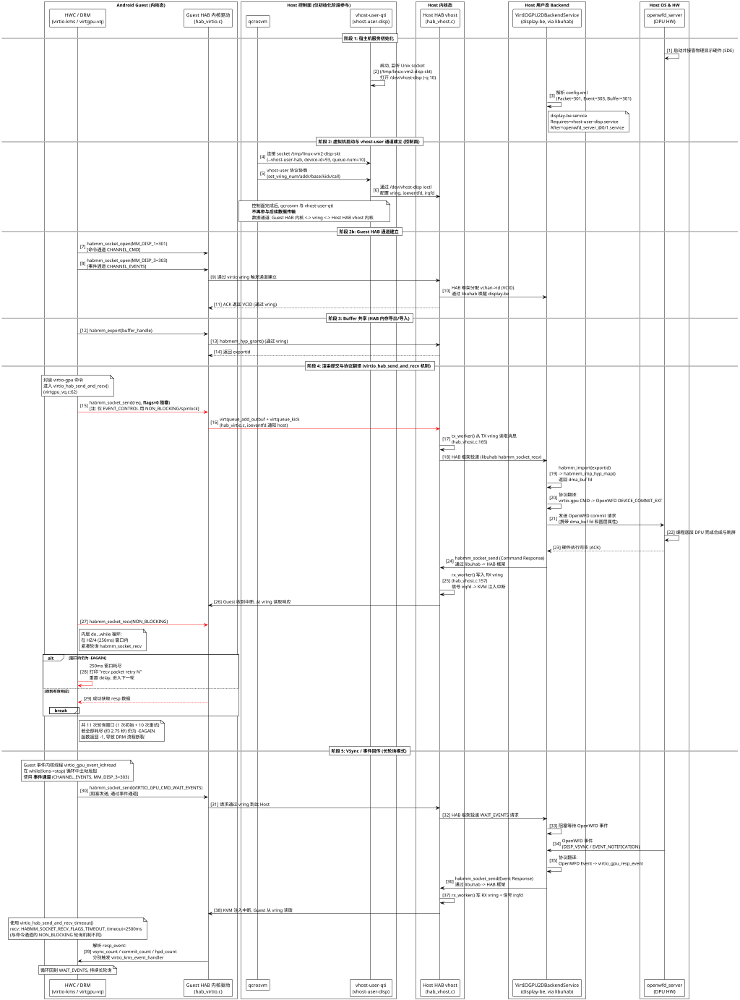

+++
date = '2026-03-29T20:00:00+08:00'
draft = false
title = 'Android Guest 显示数据通道深度解析 (virtio-HAB)'
tags = ["Android", "Display", "Virtualization", "Gunyah", "Qualcomm", "HAB", "DRM"]
+++

## 1. 概述

本文档详细描述了 Qualcomm SA8797 (Gen5) 智能座舱平台中，Android Guest VM 的 **显示（Display）数据通道** 完整时序。

在该平台中，Android Guest 的 HWC/DRM 子系统通过 **HAB (Hypervisor ABstraction)** 框架与 Linux Host 上的 **display-be (VirtIOGPU2DBackendService)** 通信，后者将 virtio-gpu 协议翻译为 **OpenWFD** 协议，最终由 **openwfd_server** 驱动物理 DPU 硬件完成显示输出。

HAB 的底层传输使用 **virtio virtqueue**，通过 vhost 机制在 Guest 内核与 Host 内核之间高效传递消息。

### 源码基线

| 组件 | 源码路径 |
|------|---------|
| Guest DRM 驱动 (virtgpu_vq.c, virtio_kms.c) | `vendor/qcom/opensource/display-drivers/msm/hyp/virtio/` |
| Guest HAB virtio 传输 (hab_virtio.c) | `kernel_platform/soc-repo/drivers/soc/qcom/hab/` |
| Host HAB vhost 驱动 (hab_vhost.c) | `vendor/qcom/opensource/mmhab-drv/hypervisor/virtio/` |
| Host HAB 框架 (hab.c, hab_mimex.c 等) | `vendor/qcom/opensource/mmhab-drv/` |
| Host display-be 配置 | `prebuilt_HY11/sa8797/display-be/usr/bin/config.xml` |
| OpenWFD wire_format | `prebuilt_HY11/sa8797-fts/openwfd-client/usr/include/WF/wire_format.h` |
| systemd 服务定义 | `vhost-user-disp.service`, `display-be.service`, `qcrosvm_sa8797.service` |

## 2. 参与组件

### Android Guest (内核态)

| 组件 | 说明 |
|------|------|
| **HWC / DRM (virtio-kms / virtgpu-vq)** | Guest 内核的 DRM 驱动。负责 scanout 属性查询、DPU 上电、帧提交等。所有显示命令通过 `virtio_hab_send_and_recv()` 发送 |
| **Guest HAB 内核驱动 (hab_virtio.c)** | HAB 框架的 virtio 传输层。将 HAB 消息封装为 virtio vring 描述符，通过 `virtqueue_add_outbuf` + `virtqueue_kick` 发送 |

### Host 控制面 (仅初始化阶段参与)

| 组件 | 说明 |
|------|------|
| **qcrosvm** | Gunyah VMM。启动时通过 `--vhost-user-hab` 参数连接到 vhost-user-qti 的 Unix socket，完成 vhost-user 协议协商后**不再参与数据传输** |
| **vhost-user-qti (vhost-user-disp)** | 用户态桥接进程。监听 `/tmp/linux-vm2-disp-skt`，将 qcrosvm 的 vhost-user 协议请求通过 ioctl 转发到内核 `/dev/vhost-disp`。配置完 vring/ioeventfd/irqfd 后**退出数据路径** |

### Host 内核态

| 组件 | 说明 |
|------|------|
| **Host HAB vhost (hab_vhost.c)** | 数据通道的核心中转。`tx_worker()` 从 TX vring 读取 Guest 发来的 HAB 消息并投递到 HAB 框架；`rx_worker()` 将 Host 回复写入 RX vring 并通过 irqfd 触发 KVM 向 Guest 注入中断 |

### Host 用户态 Backend

| 组件 | 说明 |
|------|------|
| **VirtIOGPU2DBackendService (display-be)** | 协议翻译器。通过 **libuhab** 从 HAB 框架接收 virtio-gpu 命令，翻译为 OpenWFD 协议 (如 `DEVICE_COMMIT_EXT`)，发送给 openwfd_server |

### Host OS & HW

| 组件 | 说明 |
|------|------|
| **openwfd_server** | 物理显示控制服务。接管 SDE (Smart Display Engine) 硬件，执行 DPU 合成、DP 输出、面板控制。通过 `bridgechip_server` 驱动 DP bridge 和面板 |

## 3. 时序图



## 4. 关键机制详解

### 4.1 控制面与数据面分离

这是理解此架构最重要的一点。

**控制面 (Setup Phase)** 包含 qcrosvm 和 vhost-user-qti，仅在 VM 启动时参与：

```
qcrosvm --vhost-user-hab "/tmp/linux-vm2-disp-skt",label=3C,device-id=93,queue-num=10
```

qcrosvm 通过 vhost-user 协议将 virtio 设备的 vring 配置（内存布局、ioeventfd、irqfd）传递给 vhost-user-qti。后者通过 `/dev/vhost-disp` ioctl 将配置注入 Host 内核的 vhost HAB 驱动。

**数据面 (Data Plane)** 完全在内核态完成：

```
Guest HAB 内核 (hab_virtio.c)
    |
    | virtio vring (共享内存 + ioeventfd/irqfd)
    |
Host HAB vhost 内核 (hab_vhost.c)
    |
    | HAB 框架内部投递
    |
/dev/hab -> libuhab -> display-be (用户态)
```

控制面完成后，qcrosvm 和 vhost-user-qti **不再参与任何数据传输**。ioeventfd 由 Host 内核 vhost worker 直接监听，irqfd 由 KVM 直接响应注入中断到 Guest，无需经过 VMM 用户态。

### 4.2 HAB 通道与 MMID 映射

Guest DRM 驱动在 `virtio_kms_probe()` 中打开两条 HAB 通道：

```c
// virtio_kms.c:3458-3459
kms->mmid_cmd   = MM_DISP_1;   // 301 - 命令通道
kms->mmid_event = MM_DISP_3;   // 303 - 事件通道
```

HAB virtio 传输层将 MMID 映射到 virtio device ID：

```c
// hab_virtio.c:47
{ MM_DISP_1, HAB_VIRTIO_DEVICE_ID_DISPLAY, NULL },  // device-id=93
```

display-be 的 `config.xml` 中对应配置：

```xml
<HABChannel>
    <Packet><ID> 301 </ID></Packet>    <!-- 命令通道, 对应 MM_DISP_1 -->
    <Event><ID> 303 </ID></Event>      <!-- 事件通道, 对应 MM_DISP_3 -->
    <Buffer><ID> 301 </ID></Buffer>    <!-- 缓冲区共享, 复用命令通道 -->
</HABChannel>
```

### 4.3 命令通道: virtio_hab_send_and_recv()

这是显示命令路径的核心函数 (`virtgpu_vq.c:62`)。所有 DRM 命令（scanout 属性查询、DPU 上电、帧提交等）都通过此函数同步收发。

#### 发送阶段

```c
// virtgpu_vq.c:83-84
rc = habmm_socket_send(hab_socket, req, req_size,
    (lock_flag == SPIN_LOCK_CHANNEL ?
        HABMM_SOCKET_SEND_FLAGS_NON_BLOCKING : 0x00));
```

- **绝大多数调用** (约 30 个调用点中的 29 个) 使用 `NO_SPIN_LOCK_CHANNEL`，即 **flags=0 (阻塞发送)**
- **唯一例外**: `VIRTIO_GPU_CMD_EVENT_CONTROL` (VSync 使能/禁止) 使用 `SPIN_LOCK_CHANNEL`，因为上层 `drm_vblank_enable` 持有 spinlock，不能再获取 mutex

#### 接收阶段 (NON_BLOCKING 轮询 + 重试)

```c
// virtgpu_vq.c:98-134
retry_times = 0;
retry_recv_packet:
    delay = jiffies + (HZ / 4);          // 250ms 窗口
    do {
        rc = habmm_socket_recv(hab_socket, resp, &size,
            HAB_NO_TIMEOUT_VAL,
            HABMM_SOCKET_RECV_FLAGS_NON_BLOCKING);
    } while (time_before(jiffies, delay) && (-EAGAIN == rc) && (size == 0));

    if (rc) {
        if ((rc == -EAGAIN) && (retry_times < MAX_SEND_RECV_PACKET_RETRY)) {
            retry_times++;
            VIRTGPU_VQ_WARN("recv packet retry %d", retry_times);
            goto retry_recv_packet;      // 重新开始 250ms 窗口
        }
        rc = -1;                          // 全部重试耗尽
        goto end;
    }
```

**超时计算**: 1 次初始轮询 + 10 次重试 = **11 个 250ms 窗口 = 约 2.75 秒**。

日志中的典型表现：

```
08:00:48.563 [drm:virtgpu-vq:virtio_hab_send_and_recv:129] recv packet retry 1
...
08:00:50.795 [drm:virtgpu-vq:virtio_hab_send_and_recv:129] recv packet retry 10
08:00:51.043 [drm:virtgpu-vq:virtio_gpu_cmd_get_scanout_hw_attributes:2316]
    send_and_recv failed for SCANOUT_HW_ATTRIBUTE -1
```

### 4.4 事件通道: 长轮询模式

事件通道与命令通道的机制**完全不同**。

Guest 内核线程 `virtio_gpu_event_kthread` (`virtgpu_vq.c:2446`) 在循环中主动发送 `VIRTIO_GPU_CMD_WAIT_EVENTS`，使用的是 `virtio_hab_send_and_recv_timeout()` (`virtgpu_vq.c:150`)：

```c
// virtgpu_vq.c:174-193
rc = habmm_socket_recv(hab_socket, resp, &size,
    2500,                                 // 2500ms 超时
    HABMM_SOCKET_RECV_FLAGS_TIMEOUT);     // 超时阻塞模式
if (rc && max_retries) {
    max_retries--;
    goto retry;                           // 重试时重新发送请求
} else if (rc && !max_retries) {
    rc = habmm_socket_recv(..., (uint32_t)-1, 0);  // 最终: 无限等待
}
```

| 对比项 | 命令通道 | 事件通道 |
|--------|---------|---------|
| 函数 | `virtio_hab_send_and_recv()` | `virtio_hab_send_and_recv_timeout()` |
| HAB MMID | MM_DISP_1 (301) | MM_DISP_3 (303) |
| 发送模式 | 阻塞 (flags=0) | 阻塞 (flags=0) |
| 接收模式 | NON_BLOCKING 紧凑轮询 | TIMEOUT 阻塞 (2500ms) |
| 超时策略 | 250ms 窗口 x 11 = ~2.75s | 2500ms x 10 + 最终无限等待 |
| 调用模式 | 同步请求/响应 | 长轮询 (loop { send + block_recv }) |

收到事件后，Guest 内核线程解析 `virtio_gpu_resp_event` 结构，分别处理三类事件：

```c
// virtgpu_vq.c:2487-2497
if (vsync_count)  virtio_kms_event_handler(kms, i, num, VIRTIO_VSYNC);
if (commit_count) virtio_kms_event_handler(kms, i, num, VIRTIO_COMMIT_COMPLETE);
if (hpd_count)    virtio_kms_event_handler(kms, i, num, VIRTIO_HPD);
```

### 4.5 协议翻译: virtio-gpu -> OpenWFD

display-be (VirtIOGPU2DBackendService) 负责将 Guest 的 virtio-gpu 命令翻译为 OpenWFD 有线协议。关键映射包括：

| virtio-gpu 命令 | OpenWFD 命令 | 说明 |
|----------------|-------------|------|
| 帧提交 (commit) | `DEVICE_COMMIT_EXT` | 携带 dma_buf fd 和图层属性 |
| 事件等待 | 由 `DISP_VSYNC` / `EVENT_NOTIFICATION` 响应 | VSync、热插拔等 |
| scanout 属性查询 | 对应 OpenWFD device/port 查询 | 分辨率、刷新率等 |
| DPU power | 对应 OpenWFD device power 控制 | 上电/下电 |

这些命令名均在 `wire_format.h` 中定义。

### 4.6 Host HAB vhost 内核驱动

`hab_vhost.c` 是数据通道的关键枢纽，每个 HAB physical channel (pchan) 有一对 virtqueue：

```c
// hab_vhost.c:57-61
enum {
    VHOST_HAB_PCHAN_TX_VQ = 0,  // 从 GVM 接收数据
    VHOST_HAB_PCHAN_RX_VQ,      // 向 GVM 发送数据
    VHOST_HAB_PCHAN_VQ_MAX,
};
```

- **TX 路径** (`tx_worker`, `:165`): 调用 `vhost_get_vq_desc` 从 TX vring 获取 Guest 发来的 HAB 消息，通过 `iov_iter` 读取 payload，投递到 HAB 框架
- **RX 路径** (`rx_worker`, `:157`): 将 HAB 框架的回复消息写入 RX vring，调用 `vhost_signal` 触发 irqfd，KVM 直接向 Guest 注入中断

queue-num=10 意味着 5 个 physical channel，每个有 TX+RX 一对 virtqueue。

## 5. systemd 服务依赖

```
openwfd_server_@0.service  openwfd_server_@1.service
           |                       |
           +----------+------------+
                      |
            vhost-user-disp.service
            (vhost-user-qti, 监听 socket)
                      |
             display-be.service
             (VirtIOGPU2DBackendService)
                      |
              qcrosvm.service
              (启动 Android GVM)
```

关键依赖关系 (从 systemd unit 文件提取)：

- `display-be.service`: `Requires=vhost-user-disp.service`, `After=openwfd_server_@0/1.service vhost-user-disp.service`
- `qcrosvm_sa8797.service`: `Requires=vhost-user-disp.service`, `After=display-be.service`

## 6. 故障模式: recv 重试耗尽导致黑屏

当 Host 侧 display-be 或 openwfd_server 未能及时响应时，Guest 侧 `virtio_hab_send_and_recv()` 的重试机制会耗尽，导致级联失败：

```
virtio_hab_send_and_recv() 返回 -1
    -> virtio_gpu_cmd_get_scanout_hw_attributes() 失败
    -> virtio_kms_scanout_init() 失败
    -> _virtio_kms_hw_init() 失败
    -> virtio_kms_probe() 失败
    -> DRM 设备未创建 (无 "Initialized msm_drm")
    -> SDM HAL DRMMaster instance 0 获取失败
    -> CoreInterface 创建失败
    -> HWC 注册 binder 但内部指针为 null
    -> SurfaceFlinger registerCallback 触发 SIGSEGV
    -> 无限 crash 循环 (~5秒/次)
```

详细分析参见 [SurfaceFlinger Crash 黑屏分析报告](../SurfaceFlinger_Crash分析报告.md)。
