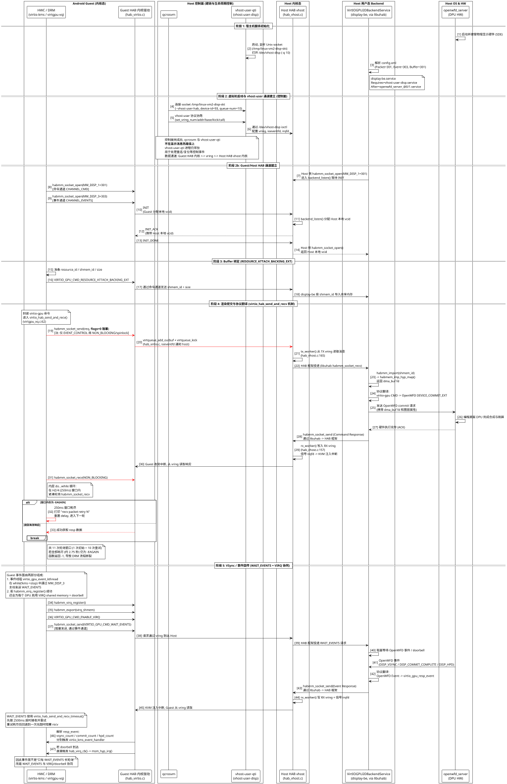
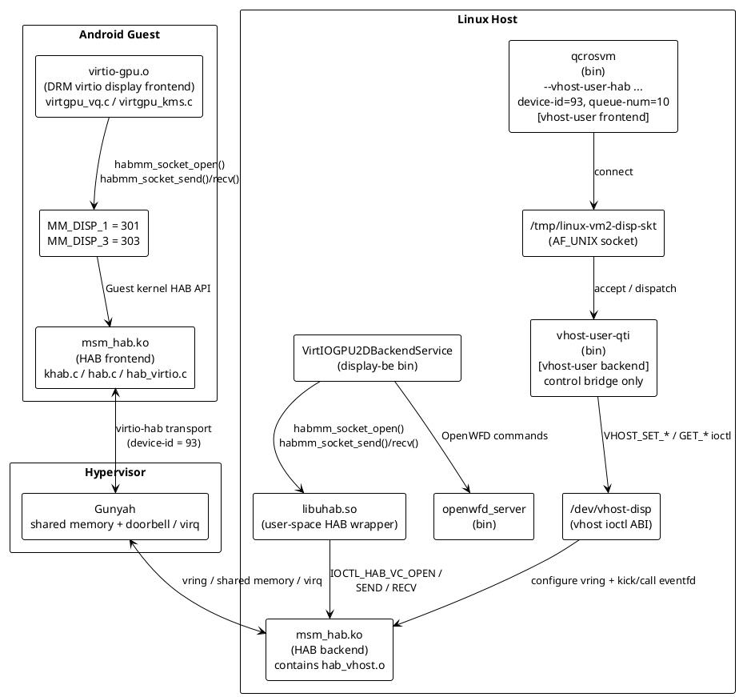
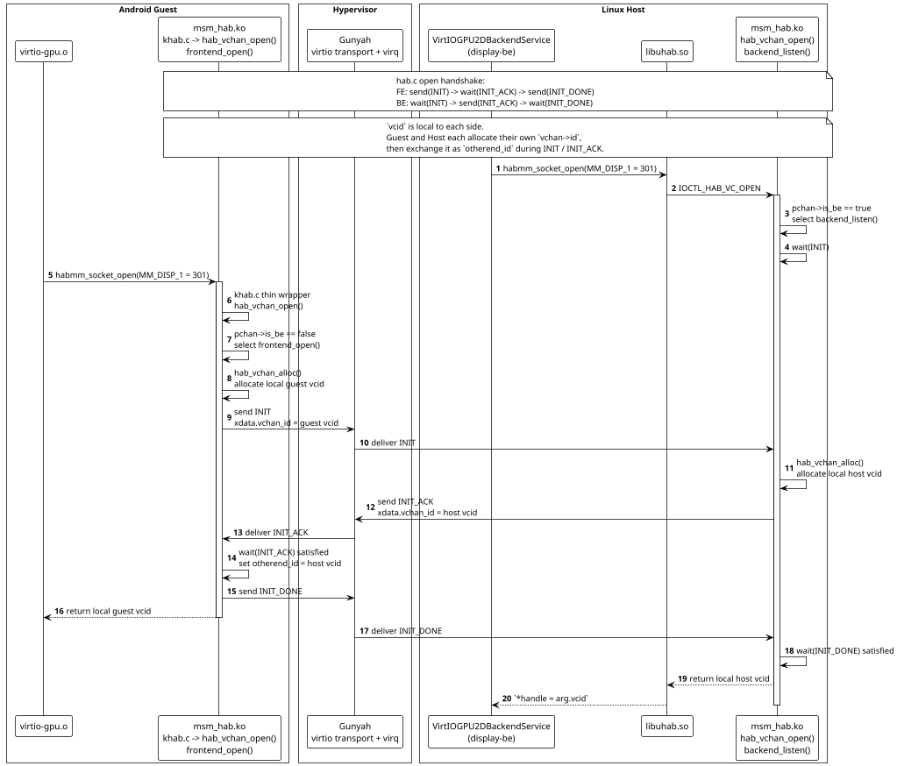

+++
date = '2026-03-29T20:00:00+08:00'
draft = true
title = 'Android Guest 显示数据通道深度解析 (virtio-HAB)'
tags = ["Android", "Display", "Virtualization", "Gunyah", "Qualcomm", "HAB", "DRM"]
+++

## 1. 概述

本文档详细描述了 Qualcomm SA8797 (Gen5) 智能座舱平台中，Android Guest VM 的 **显示（Display）数据通道** 完整时序。

在该平台中，Android Guest 的 HWC/DRM 子系统通过 **HAB (Hypervisor ABstraction)** 框架与 Linux Host 上的 **display-be (VirtIOGPU2DBackendService)** 通信，后者将 virtio-gpu 协议翻译为 **OpenWFD** 协议，最终由 **openwfd_server** 驱动物理 DPU 硬件完成显示输出。

HAB 的底层传输使用 **virtio virtqueue**，通过 vhost 机制在 Guest 内核与 Host 内核之间高效传递消息。

### 源码基线

| 组件 | 源码路径 |
|------|---------|
| Guest DRM 驱动 (virtgpu_vq.c, virtio_kms.c) | `vendor/vendor/qcom/opensource/display-drivers/msm/hyp/virtio/` |
| Guest HAB virtio 传输 (hab_virtio.c) | `kernel_platform/soc-repo/drivers/soc/qcom/hab/` |
| Host vhost-user 构建入口 | `layers/meta-qti-automotive/recipes-virt/vhost-user-q/vhost-user-q_git.bb` |
| Host HAB vhost 驱动 (hab_vhost.c) | `kernel_platform/soc-repo/drivers/soc/qcom/hab/` |
| Host HAB 框架 (hab.c, khab.c, hab_mimex.c 等) | `kernel_platform/soc-repo/drivers/soc/qcom/hab/` |
| Host display-be 配置 | `prebuilt_HY11/sa8797/display-be/usr/bin/config.xml` |
| OpenWFD wire_format | `prebuilt_HY11/sa8797/openwfd-client/usr/include/WF/wire_format.h` |
| systemd 服务定义 | `vhost-user-disp.service`, `display-be.service`, `openwfd_server_@.service` |

## 2. 参与组件

### Android Guest (内核态)

| 组件 | 说明 |
|------|------|
| **HWC / DRM (virtio-kms / virtgpu-vq)** | Guest 内核的 DRM 驱动。负责 scanout 属性查询、DPU 上电、帧提交等。所有显示命令通过 `virtio_hab_send_and_recv()` 发送 |
| **Guest HAB 内核驱动 (hab_virtio.c)** | HAB 框架的 virtio 传输层。将 HAB 消息封装为 virtio vring 描述符，通过 `virtqueue_add_outbuf` + `virtqueue_kick` 发送 |

### Host 控制面 (建链与生命周期控制)

| 组件 | 说明 |
|------|------|
| **qcrosvm** | Gunyah VMM。通过 `--vhost-user-hab` 作为 vhost-user frontend 连接 Unix socket，完成 vring / 内存 / eventfd 协商；稳态显示数据不经过 qcrosvm 用户态 |
| **vhost-user-qti (vhost-user-disp)** | vhost-user backend 桥接服务。常驻监听 `/tmp/linux-vm2-disp-skt`，接收 qcrosvm 的控制消息，并转换为 `/dev/vhost-disp` 的 `VHOST_*` ioctl。它保活以处理重连/复位/停机，但**不转发显示 payload** |

### Host 内核态

| 组件 | 说明 |
|------|------|
| **Host HAB vhost (hab_vhost.c)** | 数据通道的核心中转。`tx_worker()` 从 TX vring 读取 Guest 发来的 HAB 消息并投递到 HAB 框架；`rx_worker()` 将 Host 回复写入 RX vring 并通过 irqfd 触发 KVM 向 Guest 注入中断 |

### Host 用户态 Backend

| 组件 | 说明 |
|------|------|
| **VirtIOGPU2DBackendService (display-be)** | 协议翻译器。通过 **libuhab** 从 HAB 框架接收 virtio-gpu 命令，翻译为 OpenWFD 协议 (如 `DEVICE_COMMIT_EXT`)，发送给 openwfd_server |

### Host OS & HW

| 组件 | 说明 |
|------|------|
| **openwfd_server** | 物理显示控制服务。接管 SDE (Smart Display Engine) 硬件，执行 DPU 合成、DP 输出、面板控制。通过 `bridgechip_server` 驱动 DP bridge 和面板 |

## 3. 时序图



## 4. 关键机制详解

### 4.1 控制面与数据面分离

这是理解此架构最重要的一点。

**控制面 (Control Plane)** 包含 qcrosvm 和 vhost-user-qti，主要在 VM 启动建链、设备 reset 和停机阶段参与：

```
qcrosvm --vhost-user-hab "/tmp/linux-vm2-disp-skt",label=3C,device-id=93,queue-num=10
```

qcrosvm 通过 vhost-user 协议将 virtio 设备的 vring 配置（内存布局、ioeventfd、irqfd）传递给 vhost-user-qti。后者通过 `/dev/vhost-disp` ioctl 将配置注入 Host 内核的 vhost HAB 驱动。`vhost-user-qti` 是一个**常驻控制服务**，不是一次性的初始化脚本。

**数据面 (Data Plane)** 完全在内核态完成：

```
Guest HAB 内核 (hab_virtio.c)
    |
    | virtio vring (共享内存 + ioeventfd/irqfd)
    |
Host HAB vhost 内核 (hab_vhost.c)
    |
    | HAB 框架内部投递
    |
/dev/hab -> libuhab -> display-be (用户态)
```

控制面完成后，qcrosvm 和 vhost-user-qti **不在显示数据热路径上**。ioeventfd 由 Host 内核 vhost worker 直接监听，irqfd 由 KVM 直接响应并注入中断到 Guest，无需经过 VMM 用户态；但 `vhost-user-qti` 进程仍保活，用于处理控制面生命周期消息。

### 4.2 vhost-user 与 HAB 的分层关系

从抽象上看，vhost-user 是一种将 virtio **frontend** 与 **backend** 解耦的控制协议：

- frontend 位于 VMM (`qcrosvm`)，负责向 Guest 暴露 virtio 设备并管理 Guest 侧内存描述
- backend 位于另一个进程或内核对象，负责接收 vring、共享内存和 eventfd 配置，之后执行真正的数据收发

在很多标准 virtio 场景里，vhost-user backend 本身就是稳态数据面的执行者；而在本文的显示链路里，`vhost-user-qti` 的角色更窄，它只是一个**用户态控制桥**。真正承接 steady-state 显示消息的是 Host 内核中的 `hab_vhost.c`。

下图同时展示了 **vhost-user** 与 **HAB** 两个层次上的 frontend/backend 角色定义：

- `qcrosvm` 是 **vhost-user frontend**
- `vhost-user-qti` 是 **vhost-user backend**，但它只是控制桥，不是 display-be
- Android Guest 内核里的 `msm_hab.ko` 是 **HAB frontend**
- Linux Host 内核里的 `msm_hab.ko`/`hab_vhost.o` 是 **HAB backend**

图中的软件构件均采用源码树里的真实目标名或真实模块名：Guest DRM 为 `virtio-gpu.o`，Guest/Host HAB 为 `msm_hab.ko`，Host 用户态对应 `qcrosvm`、`vhost-user-qti`、`libuhab.so`、`VirtIOGPU2DBackendService` 和 `openwfd_server`。



从架构分层看，这张图表达的是：

- `qcrosvm <-> vhost-user-qti` 这一层只负责 **vhost-user 控制面**
- `Guest msm_hab.ko <-> Host msm_hab.ko` 才是 **HAB frontend/backend**
- `display-be` 通过 `libuhab.so` 调用 Host HAB backend；它不是 vhost-user backend
- `vhost-user-qti` 会一直保活，但 steady-state 下显示 payload 并不穿过 `/tmp/linux-vm2-disp-skt`

对于 `habmm_socket_open()` 这条调用链，FE/BE 角色是在 HAB 层确定的，而不是在 vhost-user 层确定的。Guest kernel 的 `habmm_socket_open()` 只是 `khab.c` 里的薄封装，直接进入 `hab_vchan_open()`；后者再根据本端 `pchan->is_be` 选择走 `frontend_open()` 或 `backend_listen()`。以 display-be 的 Packet channel `MM_DISP_1=301` 为例，Guest 侧对应 FE，Host 侧对应 BE，握手时序如下：



在该时序中，`vcid` 表示各侧本地生成的虚拟通道句柄，并不是跨 Guest/Host 共享的全局统一句柄。

- Guest FE 在 `frontend_open()` 中先执行 `hab_vchan_alloc()`，生成本地 Guest `vchan->id`，再将其放入 `INIT.xdata.vchan_id`
- Host BE 在收到 `INIT` 后执行自己的 `hab_vchan_alloc()`，生成本地 Host `vchan->id`，并写入 `INIT_ACK.xdata.vchan_id`
- Guest 收到 `INIT_ACK` 后，将 `recv_request->xdata.vchan_id` 保存到本地 `vchan->otherend_id`
- Host 在收到 `INIT_DONE` 后从 `backend_listen()` 返回；随后 `hab_vchan_open()` 将本地 `vchan->id` 写回 `*vcid`
- Host 用户态 `libuhab.so` 再将 `arg.vcid` 赋给 `*handle`

因此，在本节后续描述中：

- **frontend** 若未额外说明，指的是 Android Guest 内核中的 `msm_hab.ko/frontend_open()`
- **backend** 若未额外说明，指的是 Linux Host 内核中的 `msm_hab.ko/backend_listen()`
- `qcrosvm` 对应的是 vhost-user frontend 角色，不参与这段 HAB open 握手的 FE 角色判定
- `vhost-user-qti` 对应的是 vhost-user backend 角色，也不是 `habmm_socket_open()` 阻塞等待的直接对端

在本设计中，vhost-user 的工作流可以分为 5 步：

1. `vhost-user-disp.service` 启动 `/usr/bin/vhost-user-qti -s /tmp/linux-vm2-disp-skt -d /dev/vhost-disp -q 10`，创建 Unix socket，打开 `/dev/vhost-disp`，完成 `listen()` 后通过 `sd_notify("READY=1")` 告知 systemd 服务已就绪。
2. `qcrosvm` 作为 vhost-user frontend 连接该 socket，并发送 `SET_OWNER`、`SET_MEM_TABLE`、`SET_VRING_NUM`、`SET_VRING_ADDR`、`SET_VRING_BASE`、`SET_VRING_KICK`、`SET_VRING_CALL` 等控制消息。
3. `vhost-user-qti` 在用户态接收这些消息。对于 `SET_MEM_TABLE`，它会 `mmap()` qcrosvm 传入的共享内存 fd；对于 `SET_VRING_ADDR`，它会把 frontend 视角的 ring 地址转换为自身地址空间中的有效地址。
4. 完成地址转换后，`vhost-user-qti` 把配置翻译成 `/dev/vhost-disp` 的 `VHOST_SET_MEM_TABLE`、`VHOST_SET_VRING_ADDR`、`VHOST_SET_VRING_KICK`、`VHOST_SET_VRING_CALL` 等 ioctl，交给 Host 内核中的 `hab_vhost.c`。
5. 一旦内核 backend 获得 vring 地址和 kick/call eventfd，后续 Guest `virtqueue_kick` 会直接唤醒 Host 内核 worker；Host 回包也直接通过 irqfd / KVM 注入 Guest 中断。此后 `vhost-user-qti` 只在 reset、停机、重连等生命周期事件里继续处理控制消息。

这就是为什么 `/tmp/linux-vm2-disp-skt` 只承载**设备建链和生命周期控制消息**，而不承载每一帧显示命令 payload。稳态显示数据的热路径仍然是：

```text
Guest HAB 内核 -> virtio vring -> Host HAB vhost 内核 -> HAB 框架 -> display-be
```

### 4.3 HAB 通道与 MMID 映射

Guest DRM 驱动在 `virtio_kms_probe()` 中打开两条 HAB 通道：

```c
// virtio_kms.c:3458-3459
kms->mmid_cmd   = MM_DISP_1;   // 301 - 命令通道
kms->mmid_event = MM_DISP_3;   // 303 - 事件通道
```

HAB virtio 传输层将 MMID 映射到 virtio device ID：

```c
// hab_virtio.c:47
{ MM_DISP_1, HAB_VIRTIO_DEVICE_ID_DISPLAY, NULL },  // device-id=93
```

display-be 的 `config.xml` 中对应配置：

```xml
<HABChannel>
    <Packet><ID> 301 </ID></Packet>    <!-- 命令通道, 对应 MM_DISP_1 -->
    <Event><ID> 303 </ID></Event>      <!-- 事件通道, 对应 MM_DISP_3 -->
    <Buffer><ID> 301 </ID></Buffer>    <!-- 缓冲区共享, 复用命令通道 -->
</HABChannel>
```

### 4.4 命令通道: virtio_hab_send_and_recv()

这是显示命令路径的核心函数 (`virtgpu_vq.c:62`)。所有 DRM 命令（scanout 属性查询、DPU 上电、帧提交等）都通过此函数同步收发。

#### 发送阶段

```c
// virtgpu_vq.c:83-84
rc = habmm_socket_send(hab_socket, req, req_size,
    (lock_flag == SPIN_LOCK_CHANNEL ?
        HABMM_SOCKET_SEND_FLAGS_NON_BLOCKING : 0x00));
```

- **绝大多数调用** (约 30 个调用点中的 29 个) 使用 `NO_SPIN_LOCK_CHANNEL`，即 **flags=0 (阻塞发送)**
- **唯一例外**: `VIRTIO_GPU_CMD_EVENT_CONTROL` (VSync 使能/禁止) 使用 `SPIN_LOCK_CHANNEL`，因为上层 `drm_vblank_enable` 持有 spinlock，不能再获取 mutex

#### 接收阶段 (NON_BLOCKING 轮询 + 重试)

```c
// virtgpu_vq.c:98-134
retry_times = 0;
retry_recv_packet:
    delay = jiffies + (HZ / 4);          // 250ms 窗口
    do {
        rc = habmm_socket_recv(hab_socket, resp, &size,
            HAB_NO_TIMEOUT_VAL,
            HABMM_SOCKET_RECV_FLAGS_NON_BLOCKING);
    } while (time_before(jiffies, delay) && (-EAGAIN == rc) && (size == 0));

    if (rc) {
        if ((rc == -EAGAIN) && (retry_times < MAX_SEND_RECV_PACKET_RETRY)) {
            retry_times++;
            VIRTGPU_VQ_WARN("recv packet retry %d", retry_times);
            goto retry_recv_packet;      // 重新开始 250ms 窗口
        }
        rc = -1;                          // 全部重试耗尽
        goto end;
    }
```

**超时计算**: 1 次初始轮询 + 10 次重试 = **11 个 250ms 窗口 = 约 2.75 秒**。

日志中的典型表现：

```
08:00:48.563 [drm:virtgpu-vq:virtio_hab_send_and_recv:129] recv packet retry 1
...
08:00:50.795 [drm:virtgpu-vq:virtio_hab_send_and_recv:129] recv packet retry 10
08:00:51.043 [drm:virtgpu-vq:virtio_gpu_cmd_get_scanout_hw_attributes:2316]
    send_and_recv failed for SCANOUT_HW_ATTRIBUTE -1
```

### 4.5 事件通道: WAIT_EVENTS 与 VIRQ 协同

事件面并不是单一的“长轮询线程”。Guest 一侧同时存在 `WAIT_EVENTS` 请求/响应路径和 `VIRQ` / doorbell 快速唤醒路径，二者在 `virtio_kms` 初始化后协同工作。

其中，`virtio_gpu_event_kthread` (`virtgpu_vq.c:2446`) 会循环发送 `VIRTIO_GPU_CMD_WAIT_EVENTS`，使用 `virtio_hab_send_and_recv_timeout()` (`virtgpu_vq.c:150`) 在事件通道上等待 Host 返回：

```c
// virtgpu_vq.c:174-193
rc = habmm_socket_recv(hab_socket, resp, &size,
    2500,                                 // 2500ms 超时
    HABMM_SOCKET_RECV_FLAGS_TIMEOUT);     // 超时阻塞模式
if (rc && max_retries) {
    max_retries--;
    goto retry;
} else if (rc && !max_retries) {
    rc = habmm_socket_recv(..., (uint32_t)-1, 0);  // 最终退化为无限等待
}
```

因此，这条路径并不是固定周期的纯 2500ms 长轮询，而是“有限次 timeout recv + 最终阻塞 recv”的组合。

与此同时，Guest 还会注册 `habmm_virq_register()`，为每个 DPU 导出一块 VIRQ shared memory，并通过 `VIRTIO_GPU_CMD_ENABLE_VIRQ` 打开 doorbell 事件面：

```c
// virtio_kms.c
habmm_virq_register(...);
habmm_export(virq_shmem, ...);
virtio_gpu_cmd_enable_virq(vvq, dpu_idx);
```

当 Host 侧触发 doorbell 时，Guest 回调 `hab_virq_cb()`，随后直接进入 `msm_hyp_irq()` 这条低时延中断路径。

| 路径 | 代表接口 | MMID / 载体 | 作用 |
|------|---------|-------------|------|
| 命令通道 | `virtio_hab_send_and_recv()` | `MM_DISP_1` (301) | 同步执行 scanout、power、commit 等请求 |
| WAIT_EVENTS | `virtio_hab_send_and_recv_timeout()` + `VIRTIO_GPU_CMD_WAIT_EVENTS` | `MM_DISP_3` (303) | 2500ms 超时收包并重试，耗尽后回退为无超时阻塞接收 |
| VIRQ / doorbell | `habmm_virq_register()` + `VIRTIO_GPU_CMD_ENABLE_VIRQ` | shared memory + virq | doorbell 到达后直接触发 `hab_virq_cb() -> msm_hyp_irq()` |

`WAIT_EVENTS` 返回后，Guest 内核线程会解析 `virtio_gpu_resp_event` 结构，分别处理三类事件：

```c
// virtgpu_vq.c:2487-2497
if (vsync_count)  virtio_kms_event_handler(kms, i, num, VIRTIO_VSYNC);
if (commit_count) virtio_kms_event_handler(kms, i, num, VIRTIO_COMMIT_COMPLETE);
if (hpd_count)    virtio_kms_event_handler(kms, i, num, VIRTIO_HPD);
```

### 4.6 协议翻译: virtio-gpu -> OpenWFD

display-be (VirtIOGPU2DBackendService) 负责把 Guest 发来的 virtio-gpu 扩展命令翻译为 OpenWFD 有线协议，但两边并不是简单的逐项同名映射，而是按功能域完成转换。可概括为：

| Guest 侧动作 | Host / OpenWFD 侧协议 | 说明 |
|-------------|----------------------|------|
| `VIRTIO_GPU_CMD_RESOURCE_ATTACH_BACKING_EXT` | 基于 `shmem_id` 导入共享内存并建立 backend buffer 对象 | 传递的是 `resource_id + shmem_id + size`，而不是直接把普通帧 buffer 走 `habmm_export()` |
| 帧提交 (commit / flush) | `DEVICE_COMMIT_EXT` | 携带图层、输出口和 buffer 属性，驱动 DPU 完成一次显示提交 |
| 事件注册 / 等待 | `EVENT_REGISTRATION` / `EVENT_NOTIFICATION` / `WAIT_FOR_VSYNC` | 对应 VSync、commit complete、HPD 等事件面 |
| VIRQ 开关 | `ENABLE_VIRQ` / `DISABLE_VIRQ` | 为各 DPU 建立或关闭 shared memory + doorbell 路径 |
| scanout / pipeline / hw attribute 查询 | OpenWFD device / port / pipeline / hw attribute 查询 | 获取分辨率、刷新率、connector 状态等 |
| DPU power | OpenWFD device power 控制 | 控制显示硬件上电、下电和输出状态 |

OpenWFD 侧命令和事件枚举定义在 `wire_format.h` 中；对应的 virtio-gpu 扩展命令名则可以从 Guest 驱动和 `display-be` 二进制字符串中交叉验证。

#### 图像数据热路径: SurfaceFlinger / HWC -> DPU pipe

前文的 `virtio_hab_send_and_recv()` 主要展示了 **命令面**。但 Android Guest 的像素数据并不是被塞进这些命令包里逐帧传输的。命令包里真正承载的是 `resource_id`、`scanout_id`、`shmem_id`、矩形、旋转、色彩空间等 **元数据**；实际图像内容始终驻留在 Guest 分配并通过 HAB 导出的共享 buffer 中。

可把这条热路径拆成 5 个阶段：

1. **Guest 内完成渲染和组合决策**

   App、RenderThread、GPU 或硬件视频单元先把图像内容写入 gralloc / dma-buf buffer。随后 `SurfaceFlinger` 与 HWC2 进行组合策略协商：

   - 若某些 layer 走 **device composition**，HWC 会把这些 layer 的 buffer 直接交给 Guest DRM/KMS。
   - 若某些 layer 走 **client composition**，`SurfaceFlinger` 会先把它们画进一个 client target buffer，再把该 client target 作为最终 scanout 输入交给 HWC / DRM。

   因此，进入 Guest DRM/KMS 的已经不是原始窗口树，而是一个或多个已经渲染完成、带有 buffer handle 的显示输入。

2. **Guest DRM/KMS 只通过命令面传递 buffer 身份，不传递像素字节**

   Guest `virtio-gpu` 前端在建立显示对象时，会发送 `VIRTIO_GPU_CMD_RESOURCE_ATTACH_BACKING_EXT`。该命令的 payload 只有 `resource_id + shmem_id + size`，见 `virtio_gpu_cmd_resource_attach_backing()`：

   ```c
   // virtgpu_vq.c:621+
   cmd_p->hdr.type = cpu_to_le32(VIRTIO_GPU_CMD_RESOURCE_ATTACH_BACKING_EXT);
   cmd_p->resource_id = cpu_to_le32(resource_id);
   cmd_p->shmem_id = cpu_to_le64(shmem_id);
   cmd_p->size = cpu_to_le32(size);
   ```

   与之对应，`virtio_gpu_cmd_set_scanout_properties()` 只发送 scanout、目标矩形、旋转和色彩空间等显示属性，并不发送 frame payload。也就是说，命令面做的是“告诉 Host 应该使用哪块共享 buffer，以及如何显示它”，而不是“把整帧图像通过命令通道搬过去”。

3. **真正的图像数据通过 HAB 导出的共享 buffer 传递**

   `shmem_id` 的来源可以从 OpenWFD 用户态封装代码中看得很清楚。`user_os_utils_shmem_export()` 调用 `habmm_export()` 导出 buffer，并把返回的 `export_id` 写回 `mem->shmem_id`：

   ```c
   // user_hab_utils.c:636+
   rc = habmm_export(handle,
       mem->buffer,
       (uint32_t)mem->size,
       &export_id,
       export_flags);
   mem->shmem_id = export_id;
   ```

   随后，`wfdCreateWFDEGLImagesPreAlloc_User()` 会把每个 buffer 对应的 `shmem_id` 填入请求：

   ```c
   // wire_user.c:3036+
   mem.buffer = buffers[i];
   user_os_utils_shmem_export(handle, &mem, 0x00);
   create_egl_images_pre_alloc->req.shmem_ids[i] = mem.shmem_id;
   ```

   这说明 `shmem_id` 本质上是“跨 VM 共享图像 buffer 的身份标识”。像素数据本身驻留在该共享 buffer 中，而不是被拷入 `RESOURCE_ATTACH_BACKING_EXT` 命令体。

4. **Host 按 `shmem_id` 导入 buffer，并把它变成 OpenWFD source**

   Host 一侧接到 `shmem_id` 后，会通过 `habmm_import()` 把对应共享 buffer 导入本端地址空间或 fd 语义：

   ```c
   // user_hab_utils.c:700+
   rc = habmm_import(handle,
       &mem->buffer,
       (uint32_t)mem->size,
       (uint32_t)mem->shmem_id,
       (uint32_t)import_flags);
   ```

   在 WFD KMS 路径中，framebuffer 首先被整理成 `dma_buf` 数组，然后创建为 `WFD_EGLImage`：

   ```c
   // wfd_kms.c:1110+
   dma_bufs[i] = fb->base.obj[i]->import_attach->dmabuf;
   ...
   wfdCreateWFDEGLImagesPreAlloc_User(..., (void **)&dma_bufs, ...);
   ```

   当 plane 进入 `atomic_update` 时，Host 侧再基于该 image 创建 `WFD source`，并把 source 绑定到具体 pipeline：

   ```c
   // wfd_kms.c:1938+
   wfdBindPipelineToPort_User(priv->wfd_device, priv->wfd_port, priv->wfd_pipeline);
   ...
   fb_priv->wfd_source = wfdCreateSourceFromImage_User(
       priv->wfd_device,
       priv->wfd_pipeline,
       fb_priv->wfd_image,
       attrib_list);
   ...
   wfdBindSourceToPipeline_User(
       priv->wfd_device,
       priv->wfd_pipeline,
       fb_priv->wfd_source,
       WFD_TRANSITION_AT_VSYNC,
       NULL);
   ```

   这一步是“Guest buffer -> Host OpenWFD source/pipeline 对象”的关键转换点。到了这里，buffer 已经不再只是 virtio 资源或 HAB 共享内存句柄，而是一个被 Host 显示栈接纳的显示输入源。

5. **`DEVICE_COMMIT_EXT` 触发 DPU 编程，source 最终落到某条 pipe 上**

   完成 source / pipeline / port 绑定后，Host 通过 `DEVICE_COMMIT_EXT` 发起一次真正的显示提交：

   ```c
   // wire_user.c:1022+
   req.payload.wfd_req.num_of_cmds = 1;
   wfd_req_cmd->type = DEVICE_COMMIT_EXT;
   ```

   `openwfd_server` 收到 commit 后，才会把这些已经准备好的 source、矩形、z-order、输出口属性编程到 DPU。此时图像才真正进入硬件 pipe，并最终由物理输出口送到面板。

整个热路径可以压缩成下面这条链：

```text
Android App / GPU / Video Decoder
    -> gralloc / dma-buf
    -> SurfaceFlinger + HWC2 选择 client/device composition
    -> Guest DRM/KMS framebuffer / scanout target
    -> export shared buffer -> shmem_id
    -> VIRTIO_GPU_CMD_RESOURCE_ATTACH_BACKING_EXT(resource_id, shmem_id, size)
    -> Guest HAB -> virtio vring -> Host HAB vhost
    -> display-be / libuhab import(shmem_id)
    -> OpenWFD image / source / pipeline / port
    -> DEVICE_COMMIT_EXT
    -> openwfd_server
    -> DPU pipe
    -> panel / DP output
```

有两个容易混淆但必须区分的点：

- `vm2-ogles-skt` / `/dev/vhost-ogles` 更偏向 **Guest 图形渲染/GPU 虚拟化** 路径；它解决的是“Guest 如何获得 GPU / GLES 能力并产出渲染后的 buffer”。
- `vm2-disp-skt` / `/dev/vhost-disp` 更偏向 **Guest 最终显示结果上屏** 路径；它解决的是“哪块最终 buffer 被绑定到哪个 scanout / pipeline，并提交给 DPU”。

因此，Android Guest 的图像确实会在 Host 上落到 DPU `pipe`，但 `surfacedump` 只能看到 **Host 侧已经绑定到 OpenWFD pipeline 的 source**。它看不到 Guest `SurfaceFlinger` 在 Guest 内部尚未导出、尚未绑定到 Host pipeline 的那些原始 layer；若 Guest 已经在本侧先完成 client composition，那么 Host 侧看到的也只会是那个合成后的最终 buffer，而不是 Guest 内部每一个应用 layer。

### 4.7 Host HAB vhost 内核驱动

`hab_vhost.c` 是数据通道的关键枢纽，每个 HAB physical channel (pchan) 有一对 virtqueue：

```c
// hab_vhost.c:57-61
enum {
    VHOST_HAB_PCHAN_TX_VQ = 0,  // 从 GVM 接收数据
    VHOST_HAB_PCHAN_RX_VQ,      // 向 GVM 发送数据
    VHOST_HAB_PCHAN_VQ_MAX,
};
```

- **TX 路径** (`tx_worker`, `:165`): 调用 `vhost_get_vq_desc` 从 TX vring 获取 Guest 发来的 HAB 消息，通过 `iov_iter` 读取 payload，投递到 HAB 框架
- **RX 路径** (`rx_worker`, `:157`): 将 HAB 框架的回复消息写入 RX vring，调用 `vhost_signal` 触发 irqfd，KVM 直接向 Guest 注入中断

queue-num=10 意味着 5 个 physical channel，每个有 TX+RX 一对 virtqueue。

## 5. vhost-user-disp.service 与 systemd 依赖

```
openwfd_server_@0.service  openwfd_server_@1.service
           |                       |
           +----------+------------+
                      |
            vhost-user-disp.service
            (vhost-user-qti, 监听 socket)
                      |
             display-be.service
             (VirtIOGPU2DBackendService)
                      |
          qcrosvm_sa8797.service
              (启动 Android GVM)
```

`vhost-user-disp.service` 的关键配置可概括为：

```ini
[Service]
ExecStart = /usr/bin/vhost-user-qti -s /tmp/linux-vm2-disp-skt -d /dev/vhost-disp -q 10
Type=notify
```

- `-s /tmp/linux-vm2-disp-skt`: 创建供 `qcrosvm --vhost-user-hab` 连接的 Unix domain socket
- `-d /dev/vhost-disp`: 指向 Host 内核 display vhost 设备，所有 `VHOST_SET_*` / `VHOST_GET_*` ioctl 都打到这里
- `-q 10`: 暴露 10 条 virtqueue；结合 `hab_vhost.c` 中 TX/RX 成对的设计，对应 5 个 physical channel
- `Type=notify`: 只有当 `vhost-user-qti` 完成 `bind()` / `listen()` 并显式通知 `READY=1` 后，systemd 才认为服务 ready，从而避免 `qcrosvm` 提前连接 socket 失败

从 systemd 角色分工看，`vhost-user-disp.service` 的作用有三层：

- **建链前置条件**: 在 Guest 启动前准备好 vhost-user socket 和 `/dev/vhost-disp` 控制桥，保证 qcrosvm 能顺利完成 virtio display 设备初始化
- **协议适配层**: 把通用的 vhost-user frontend 协议转换成 Qualcomm 私有的 display vhost 内核 ioctl ABI
- **生命周期守护进程**: 在 VM reset、停机或重新连接时继续保活，处理 `GET_VRING_BASE`、`RESET_OWNER` 等控制事件；但它不是 steady-state 帧数据的转发进程

关键依赖关系 (从 systemd unit 文件提取)：

- `display-be.service`: `Requires=vhost-user-disp.service`, `After=openwfd_server_@0/1.service vhost-user-disp.service`
- `qcrosvm_sa8797.service`: `Requires=vhost-user-disp.service`, `After=display-be.service`

## 6. 故障模式: recv 重试耗尽导致黑屏

当 Host 侧 display-be 或 openwfd_server 未能及时响应时，Guest 侧 `virtio_hab_send_and_recv()` 的重试机制会耗尽，导致级联失败：

```
virtio_hab_send_and_recv() 返回 -1
    -> virtio_gpu_cmd_get_scanout_hw_attributes() 失败
    -> virtio_kms_scanout_init() 失败
    -> _virtio_kms_hw_init() 失败
    -> virtio_kms_probe() 失败
    -> DRM 设备未创建 (无 "Initialized msm_drm")
    -> SDM HAL DRMMaster instance 0 获取失败
    -> CoreInterface 创建失败
    -> HWC 注册 binder 但内部指针为 null
    -> SurfaceFlinger registerCallback 触发 SIGSEGV
    -> 无限 crash 循环 (~5秒/次)
```
