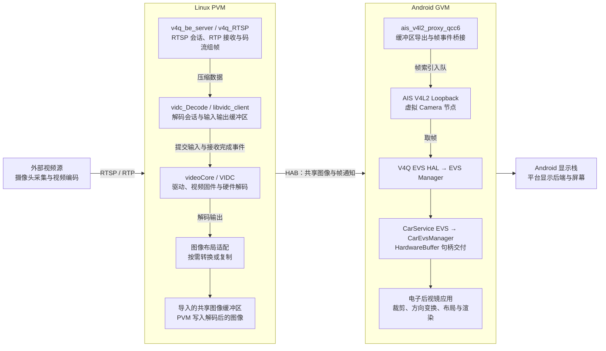
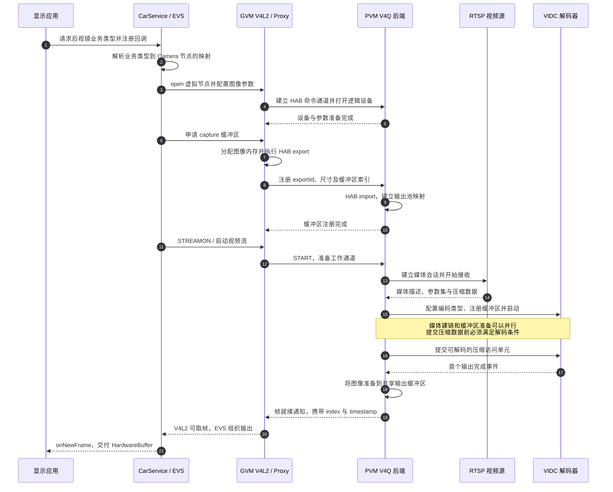
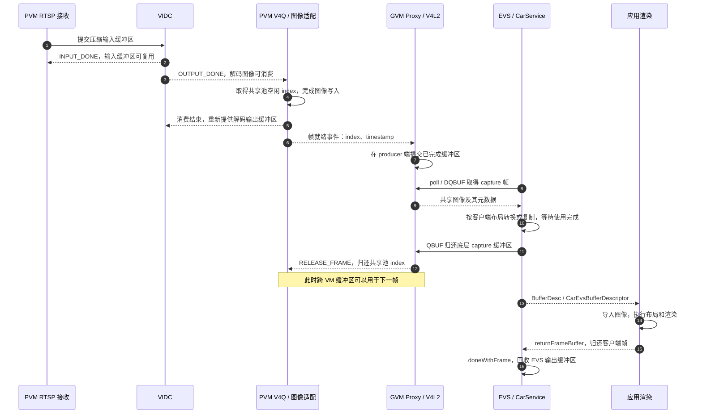
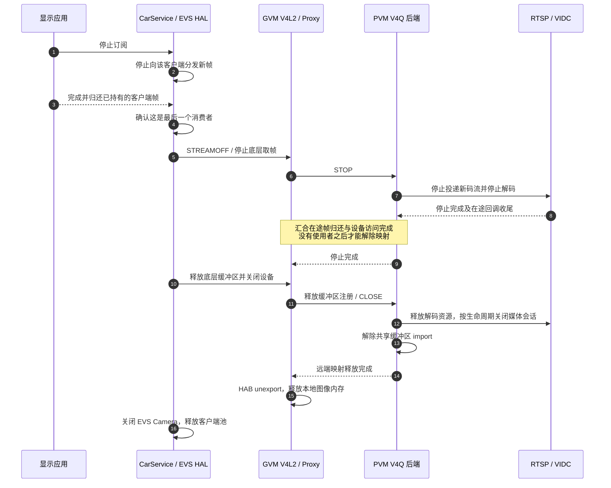

+++
date = '2026-09-07T00:00:00+08:00'
draft = false
title = '电子后视镜架构与时序：RTSP、VIDC 和跨虚拟机图像交付'
description = '介绍 Linux PVM 接收并硬解网络视频、通过 HAB 共享图像、由 Android GVM 的 V4L2 与 EVS 交付显示的架构，以及首帧、稳态和停止释放时序。'
categories = ['Gunyah', 'Camera', '视频架构']
tags = ['电子后视镜', 'RTSP', 'VIDC', 'PVM', 'GVM', 'HAB', 'EVS', 'V4L2', 'DMA-BUF']
+++

电子后视镜的画面进入 Android 时，可以已经是解码后的图像，而不是仍需播放器处理的压缩视频。本方案将网络视频接收和硬件解码放在 Linux PVM，将应用访问、画面布局及显示放在 Android GVM，中间通过 HAB 共享图像缓冲区。

核心数据路径是：**网络压缩码流 → PVM 硬件解码 → 跨 VM 共享图像 → GVM V4L2/EVS → 应用显示**。

## 1. 范围与术语

本文介绍一种基于 RTSP 网络视频源的电子后视镜实现，包括左、右两路电子外后视镜和一路后向流媒体后视镜。它不是所有电子后视镜产品的统一拓扑；直接连接本地摄像头的方案可以使用不同的采集前端。

外部视频源之前的摄像头、采集与编码设备视为一个整体，不指定它们属于哪个控制器，也不假定摄像头通过何种物理接口接入。

| 术语 | 本文中的含义 |
| --- | --- |
| PVM | Linux 特权虚拟机，承载视频接收、解码客户端及平台视频后端 |
| GVM | Android 客户虚拟机，承载虚拟摄像头接口、EVS 和显示应用 |
| V4Q | 将不同视频源统一为逻辑 Camera 设备的中间件及其虚拟化前后端 |
| VIDC | Qualcomm 视频编解码子系统；本文主要使用其硬件解码能力 |
| HAB | Hypervisor Abstraction，提供跨 VM 通道及内存共享相关接口 |
| EVS | Android Automotive Extended View System，提供视频流访问和帧交付接口 |
| Buffer | 承载压缩数据或图像的缓冲区，具体类型由所在层决定 |

下文中的节点号、通道号和分辨率是实现映射示例，不是 Gunyah、RTSP 或 Android 标准规定的固定值。时序图表达组件间的逻辑依赖，不要求所有准备操作在同一线程内严格串行执行。

## 2. 总体架构

图中有三条需要分开的边界：

- **解码边界**：压缩视频在 PVM 内经过 VIDC，交给 GVM 的已经是图像。
- **虚拟化边界**：HAB 共享图像内存，工作消息携带索引、时间戳等元数据，而非逐帧搬运完整像素载荷。
- **显示边界**：EVS 向应用交付帧，不等于已经完成屏幕扫描输出；应用渲染和显示合成仍有自己的缓冲区与同步过程。

Gunyah 提供虚拟机隔离基础，HAB 及其平台传输实现承担跨 VM 通信和共享映射。视频解码、颜色转换、画面布局并不由 Hypervisor 完成。

## 3. 组件职责与调用边界

### 3.1 PVM：把网络码流变成可共享图像

| 组件 | 职责 | 主要交付对象 |
| --- | --- | --- |
| RTSP/RTP 接收模块 | 建立媒体会话、接收数据包、按编码格式重组数据，并提供时间戳与参数集 | 压缩帧或访问单元 |
| `v4q_RTSP` | 将网络视频适配为逻辑 Camera 设备，组织接收队列与解码工作 | 可供解码的压缩数据 |
| `vidc_Decode` | 封装解码器配置、输入提交、输出回调和生命周期 | 解码完成的图像缓冲区 |
| `libvidc_client` / `videoCore` | 将客户端请求送到视频服务、驱动与固件，管理硬件会话 | 输入/输出完成事件 |
| 格式与布局适配模块 | 按目标布局完成转换、对齐或复制，可使用 C2D 等硬件辅助 | 跨 VM 目标图像 |
| V4Q HAB 后端 | 导入共享缓冲区，发布帧就绪事件，接收缓冲区归还 | 图像索引与元数据 |

`v4q_be_server` 是承载这些 Camera 逻辑设备的后端进程。`videoCore` 是它调用的视频服务，二者不是同一个进程或同一层抽象。

### 3.2 GVM：把共享图像变成应用可消费的 Camera stream

| 组件 | 职责 |
| --- | --- |
| `ais_v4l2_proxy_qcc6` | 打开 HAB 通道、分配并导出共享缓冲区，将帧事件桥接到 V4L2 |
| AIS V4L2 Loopback | 建立生产者和消费者之间的队列，向 HAL 暴露 `/dev/videoX` |
| V4Q EVS HAL | 打开 V4L2 设备、取帧、按 EVS 客户端要求适配格式及管理帧缓冲区 |
| EVS Manager | 管理 EVS Camera 访问和流交付，连接硬件 HAL 与上层消费者 |
| CarService EVS | 维护业务类型与设备映射、订阅状态，并通过 JNI 和 Binder 分发帧句柄 |
| `CarEvsManager` | 向应用提供访问入口、流回调及帧归还接口 |
| 应用与显示栈 | 使用图像进行布局和渲染，再提交到显示系统 |

本文采用经过 CarService 的应用接入方式；EVS 的接口体系还可以支持不同的客户端接入形式。EVS 的通用定位可参考 [Android EVS 概述](https://source.android.com/docs/automotive/camera/evs)，具体 AIDL 接口与扩展类型以所集成的软件版本为准。

### 3.3 与 GVM MediaCodec 路径的区别

| 入口 | 解码客户端所在位置 | 上层看到的内容 |
| --- | --- | --- |
| 本文的后视镜 RTSP 路径 | PVM：`v4q_RTSP → vidc_Decode → libvidc_client` | GVM EVS 接收已经解码的图像 |
| Android 普通媒体解码路径 | GVM：MediaCodec/Codec2，经虚拟视频前端和 `hyp_video_be` 访问 PVM 视频服务 | Android 媒体客户端接收解码结果 |

两类客户端可以使用同一个平台视频编解码子系统，但会话入口和资源管理层不同。后视镜应用不需要为了显示 EVS 图像，再创建一个 MediaCodec 解码器。

## 4. 从 RTSP 到 VIDC 的处理原理

### 4.1 RTSP 控制与媒体传输

RTSP 负责会话控制，媒体数据通常通过 RTP 传输。部署可以选择 UDP 媒体传输，或使用 RTSP TCP 连接上的 interleaved 传输；应用层“使用 RTSP”并不意味着所有视频都通过同一种传输方式。

典型准备过程包括：

1. 通过 `DESCRIBE` 获取 SDP 媒体描述。
2. 通过 `SETUP` 协商传输方式及媒体通道。
3. 通过 `PLAY` 开始接收视频数据。
4. 重组 RTP 载荷，取得编码参数集及可送入解码器的访问单元。

H.264 通常需要 SPS/PPS，H.265 通常需要 VPS/SPS/PPS。这些信息可能来自 SDP，也可能来自带内码流。解码器应根据实际媒体轨道确定编码类型，不能只根据节点名称或配置注释判断。

### 4.2 异步硬件解码

解码不是“提交一次输入就立即同步返回一张图像”。其核心是两组可循环使用的硬件缓冲区和异步完成事件：

- **输入侧**：取得空闲输入缓冲区，填入压缩数据，提交给 VIDC；收到 `VIDC_EVT_RESP_INPUT_DONE` 后，该输入缓冲区可以再次填充。
- **输出侧**：向 VIDC 提供可写输出缓冲区；收到 `VIDC_EVT_RESP_OUTPUT_DONE` 后，客户端可以消费解码图像，消费完成后再将缓冲区交回解码器。

输入完成不等于对应画面已经可以显示。一个压缩访问单元与一个输出事件之间可能存在解码流水线和重排序，必须分别管理输入归还与输出消费。

首帧还依赖参数集和可随机访问图像，例如 IDR。网络已连接、解码器已启动和首帧已到达，是三个不同的完成条件。

### 4.3 输出图像适配

VIDC 的原生输出布局、跨 VM 帧布局和 EVS 客户端布局不必完全相同。适配层需要处理实际格式、stride、平面对齐和裁剪范围；需要转换时可以使用 C2D，布局兼容时则可以减少额外处理。

因此，本文不把所有实现都描述为“解码器直接写入应用缓冲区”，也不假设从解码到屏幕全程没有图像复制。

## 5. 配置与三路映射

每一路后视镜首先是一个独立的逻辑 Camera，由以下配置串联起来：

**媒体 URL → PVM 逻辑节点 → HAB 通道 → GVM V4L2 节点 → EVS 业务类型**。

以下示例使用统一地址前缀 `rtsp://<video-source>:<port>`：

| 功能 | URL 路径 | PVM 节点名 | GVM 节点 | EVS 业务类型 |
| --- | --- | --- | --- | --- |
| 后向流媒体后视镜 | `/cms/Rear` | `rear_rtsp_cam` | `/dev/video62` | `STREAMING_MIRROR` |
| 左电子后视镜 | `/avm/LeftRear` | `lrsid_rtsp_cam` | `/dev/video63` | `LEFT_REARVIEW` |
| 右电子后视镜 | `/avm/RightRear` | `rrsid_rtsp_cam` | `/dev/video64` | `RIGHT_REARVIEW` |

PVM 节点示例前缀为 `/dev/v4q/hyp_camera/`。EVS 业务类型由系统集成定义，并不是通过 RTSP URL 自动推导出来的。

### 5.1 HAB 的三类通道

| 功能 | 命令通道 MMID | PVM → GVM 工作通道 | GVM → PVM 工作通道 |
| --- | --- | --- | --- |
| 后向 | 94 | 95 | 96 |
| 左侧 | 97 | 98 | 99 |
| 右侧 | 100 | 101 | 102 |

- 命令通道负责打开、缓冲区注册、启动、停止、关闭及参数交互。
- PVM → GVM 工作通道发送帧就绪事件。
- GVM → PVM 工作通道发送帧归还事件。

前端配置的 `workSendMmid` 必须对应后端的 `workRecvMmid`，反方向亦然。MMID 是 HAB 通道配置的一部分，不等于 V4L2 节点号、Buffer index 或完整的运行时通道句柄。

### 5.2 图像格式契约

示例中 GVM proxy 三路均配置为 `1920×1280 NV12`，但这只是该接口边界的图像契约。

| 层次 | 需要明确的信息 |
| --- | --- |
| RTSP 媒体轨道 | H.264/H.265、实际图像尺寸、帧率、参数集、时间基准 |
| VIDC 输出 | 输出格式、平面布局、stride、对齐高度、可见区域 |
| 跨 VM 共享池 | 分配尺寸、有效区域、格式、缓冲区数量、索引范围 |
| EVS 客户端 | `BufferDesc` 中的格式、stride、usage、bufferId 和时间戳 |
| 应用纹理与显示 | 图像导入方式、采样格式、颜色空间、裁剪及方向变换 |

NV12 使用 Y 平面和 UV 交错色度平面；NV21 的色度顺序不同，不能只凭两者都是 4:2:0 就视为同一布局。不同配置文件里的 `format` 数值也可能属于不同枚举，必须按各自解析器解释。

## 6. 首次开流与首帧时序

服务进程启动只是准备阶段：PVM 初始化逻辑设备并等待连接，GVM proxy 建立虚拟设备访问路径，EVS 服务准备好枚举与打开 Camera。真正开流由客户端订阅触发。

首帧建立的关键依赖是：**设备可访问、共享池已建立、解码器可工作、收到可解码输入、输出帧可以交付**。其中，HAB 的 `pfOpen` 是跨 VM 通道打开操作，不是打开 RTSP URL。

## 7. 稳态传帧与归还时序

建立共享池之后，每一帧主要流转的是缓冲区所有权。图中的 EVS 输出使用独立客户端缓冲区，表示一种常见适配方式；若实现复用了底层缓冲区，归还时机必须相应延后。INPUT_DONE 与 OUTPUT_DONE 是独立事件，图中的排列不构成二者固定先后的接口保证。

### 7.1 V4L2 的两个方向

AIS Loopback 内部区分 proxy 生产者与 HAL 消费者，不能把两侧的 `QBUF` 当成同一个动作：

| 调用侧 | 操作 | 在本链路中的含义 |
| --- | --- | --- |
| Proxy 生产者 | OUTPUT 侧 `QBUF` | 提交已经填好的图像，唤醒 capture 消费者 |
| EVS HAL 消费者 | CAPTURE 侧 `DQBUF` | 取得可消费图像 |
| EVS HAL 消费者 | CAPTURE 侧 `QBUF` | 归还已用完的底层缓冲区 |
| Proxy 生产者 | 获取可回收索引并发送归还事件 | 允许 PVM 重新使用相应共享图像 |

标准 V4L2 的队列、流启停及 DMA-BUF 导入概念可参考 [Linux V4L2 Streaming I/O 文档](https://docs.kernel.org/userspace-api/media/v4l/dmabuf.html)。AIS Loopback 还包含私有缓冲区注册和事件机制，不应直接将其所有细节等同于标准 `V4L2_MEMORY_DMABUF` 导入示例。

### 7.2 CarService 并非只参与控制

在本文的接入方式中，CarService 也参与逐帧句柄分发：

1. Native EVS 回调取得 `BufferDesc` 和 native handle。
2. `EvsServiceContext::onNewFrame` 根据 handle 构建 `AHardwareBuffer`，再包装为 Java `HardwareBuffer`。
3. Java 状态机将其组织为 `CarEvsBufferDescriptor`，通过 `onNewFrame` 回调交给应用。
4. 应用消费结束后调用 `returnFrameBuffer`，服务端继续完成帧归还。

这里传递的是可引用图像内存的句柄和元数据，不是把整张图像编码成 Binder 字节数组。[Android HardwareBuffer 文档](https://developer.android.com/reference/android/hardware/HardwareBuffer)介绍了它的 Parcelable、图像属性和跨进程使用接口。

## 8. 缓冲区所有权与内存开销

### 8.1 五种逻辑角色

| 缓冲区角色 | 内容 | 可复用的条件 |
| --- | --- | --- |
| 网络接收/组帧队列 | RTP 重组后的压缩数据 | 数据已被后续提交路径消费 |
| VIDC 输入池 | 提交给硬件的压缩数据 | 收到 INPUT_DONE |
| VIDC 输出池 | 硬件解码图像 | 下游完成读取、适配或复制 |
| 跨 VM 共享输出池 | 供 GVM 读取的图像 | 收到 GVM 归还事件，且相关设备访问已完成 |
| EVS 客户端输出池 | 应用持有的图像 | 客户端及其他持有者完成消费并归还 |

这是逻辑角色划分，不要求每一层都必须分配一份独立像素内存。合并缓冲区池可以减少转换或复制，但会延长底层缓冲区被下游持有的时间。

共享图像的所有权遵循如下循环：

**PVM 可写 → PVM 正在填充 → GVM 持有 → GVM 归还 → PVM 再次可写**。

在 GVM 持有期间，PVM 不应覆盖同一个 index。若 GPU、C2D 或其他异步硬件仍在读取该图像，不能仅凭 CPU 已提交绘制命令就将其视为消费完成；需要遵守相应完成事件或同步栅栏的约定。

### 8.2 三种标识不能混用

- DMA-BUF fd 或 native handle 表示某个进程可访问的图像资源。
- HAB `exportId` 表示建立跨 VM 映射时使用的导出标识。
- 帧 `index` 或 EVS `bufferId` 表示某个缓冲区池中的条目。

它们属于不同命名空间。GVM 和 PVM 的 fd 数值不要求相同；跨 VM index 与 EVS 客户端 bufferId 也不要求一一同值。

### 8.3 内存与带宽示例

以线性、紧密排列的 `1920×1280 NV12` 为例：

- 单帧有效像素为 `1920 × 1280 × 1.5 = 3,686,400` 字节，约 `3.516 MiB`。
- 若每路共享池有 6 个缓冲区，每路约 `21.09 MiB`，三路约 `63.28 MiB`。
- 若三路均为 30 fps，仅这些有效像素的单遍处理量约为 `316.4 MiB/s`。

这些数字不包括 stride/高度对齐、解码参考帧、其他缓冲区池和显示输出，也不是压缩码流的网络带宽。一次转换可能同时产生源读取和目标写入，因此实际内存带宽不能只按一遍像素数据估算。

## 9. 停止、关闭与资源释放时序

停止订阅和销毁底层设备不是同一个动作。如果还有其他客户端订阅同一路画面，应先由访问管理层决定是否继续保留底层流。下面描述最后一个消费者退出后的完整释放过程。

实际实现可以保留设备对象、解码器或网络连接以降低下一次首帧开销，因此 `STOP` 不一定等于 `CLOSE`，`CLOSE` 也不应等同于重启整个服务。

无论采用哪种保留策略，都应满足三个生命周期约束：

1. 不再生产新帧之后，才能汇合并结束在途消费。
2. 远端解除 import 之前，本地 export 所对应的内存必须保持有效。
3. 所有图像引用和设备访问完成之后，才能释放底层内存。

## 10. 多路并发、时延与显示

### 10.1 三路独立，平台资源共享

每一路维护自己的 RTSP 会话、解码状态、缓冲区池、HAB 通道和 EVS 映射。三路可以独立订阅和交付，不要求组成一张四合一图像。

独立逻辑设备并不意味着独占硬件：视频解码能力、图像转换硬件、DDR 带宽及显示资源可以由平台统一调度。容量规划需要同时考虑编码格式、分辨率、帧率、会话数量和内存访问量，而不只是线程数量。

### 10.2 首帧时延与稳态时延

首帧时延通常包含网络建链、参数集获取、等待可随机访问图像、解码器和缓冲区准备，以及首次显示提交。

稳态时延则可以拆为：

**采集与编码 + 网络传输/组帧 + 解码排队 + 硬件解码 + 图像适配 + EVS 交付 + 渲染与屏幕刷新**。

HAB 共享缓冲区减少的是跨 VM 图像复制成本，并不会自动消除其他排队环节。缓冲区数量增加可以容纳更多在途工作，但不代表应当持续积压更多待显示帧。

不同来源的时间戳可能分别对应传感器采集、RTP 媒体时间、PVM 单调时钟和 Android 显示时间。计算端到端时延前，需要明确时间戳语义及跨时钟域映射，不能直接相减两个来源不明的数值。

### 10.3 从 HardwareBuffer 到屏幕

应用获得 `HardwareBuffer` 后，通常将其导入图形接口，例如形成 EGLImage/纹理，完成裁剪、镜像、缩放和布局，再绘制到自己的 Surface。最终由 SurfaceFlinger、HWC 和平台显示链路完成合成与输出。

这里的左右视角布局和镜像方向属于图像呈现策略；VIDC 负责将压缩数据解码成图像，并不负责决定哪个画面显示到哪块屏幕。

## 11. 实现阅读索引

可以按下面的顺序阅读相关配置和实现，先建立映射，再追踪缓冲区生命周期：

| 入口 | 阅读重点 |
| --- | --- |
| `rear_rtsp_cam.xml`、`lrsid_rtsp_cam.xml`、`rrsid_rtsp_cam.xml` | 媒体地址、传输方式、目标尺寸和缓冲区参数 |
| `v4q_be_server.xml` | PVM 逻辑节点与 HAB 通道映射 |
| `v4q_v4l2_proxy.xml` | GVM 节点、图像格式与发送/接收通道 |
| CarService Camera 映射资源 | EVS 业务类型到 Camera ID 的绑定 |
| `v4q_RTSP.cpp` | 媒体轨道识别、压缩帧队列和解码调度 |
| `vidc_Decode.cpp` | 输入提交、INPUT_DONE/OUTPUT_DONE、启动和停止 |
| `cHabConnect.cpp` 及 Camera 前后端 | 通道建立、导出/导入、帧通知与归还 |
| `v4l2loopback.c` | OUTPUT/CAPTURE 队列、事件桥接和 DMA-BUF 注册 |
| `StreamHandler.cpp`、`EvsServiceContext.cpp` | EVS 帧回调与 native handle 到 HardwareBuffer 的包装 |
| `StateMachine.java`、`CarEvsManager.java` | 多客户端分发、应用回调和帧归还 |

其中部分模块可能以预编译产物集成，文件名和符号用于定位职责；具体内部池复用、调用先后和加速方式，应以相应版本的实现为准。

## 12. 与其他图像通路的关系

电子后视镜与本地 Camera 虚拟化可以复用 V4Q、HAB、V4L2 和 EVS 的后半段，但输入前端不同：

- 网络后视镜的前半段是 RTSP/RTP 接收与视频解码。
- 本地 Camera 的前半段可以是传感器、ISP/IFE 和 QCarCam 采集，不必先编码再解码。
- 显示虚拟化负责最终画面提交与输出，是 Camera 帧交付之后的另一条通路。

相关文档：

- [虚拟化 Camera 架构设计]()
- [HAB 通信机制]()
- [PVM 图形栈与显示通路]()

理解这套架构的关键，是始终区分**压缩码流、解码图像、共享缓冲区、帧句柄和最终显示输出**，并为每一个缓冲区明确生产者、消费者和归还条件。
