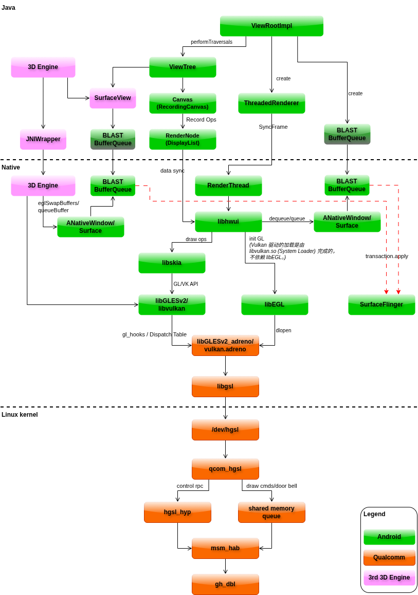
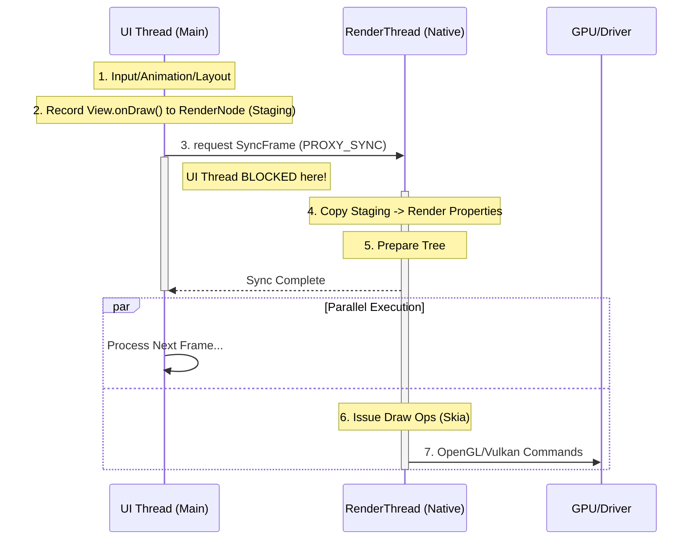
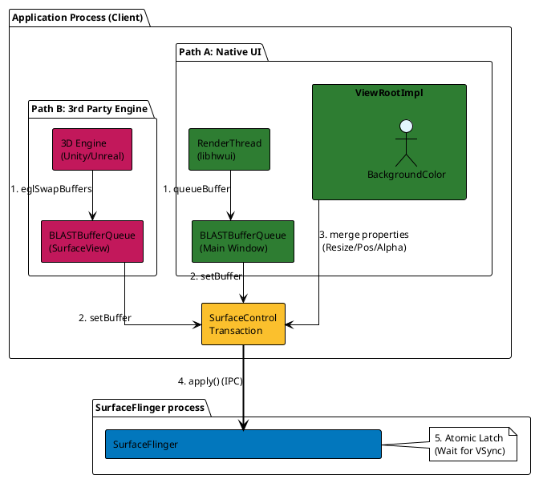

+++
date = '2026-01-13T10:00:00+08:00'
draft = false
title = 'Android 图形渲染架构详解 (Gunyah Hypervisor)'
tags = ["Android", "Graphics", "Virtualization", "Gunyah", "Qualcomm"]
+++

## 1. 概述

本文档详细描述了在基于 **Qualcomm SA8295/SA8255 (Gen5)** 智能座舱平台中，Android Guest VM 的图形渲染软件架构。

在该平台中，Android 运行在 **Gunyah Hypervisor** 之上作为客户机（Guest VM）。图形系统采用**前后端分离的虚拟化架构 (Split-Rendering Architecture)**。Android 侧（Guest）负责生成渲染指令，通过 **HGSL (Hypervisor Graphics Service Layer)** 驱动栈穿透虚拟机边界，最终由 Host 端的物理驱动操控 Adreno GPU 硬件执行渲染。

本文档涵盖了从应用层 View 系统、Native 渲染管线、到内核虚拟化驱动的全链路技术细节。

## 2. 整体架构图

下图展示了从应用层 `ViewRootImpl` 到底层内核驱动 `gh_dbl` 的完整调用链路。架构清晰地展示了 **BLASTBufferQueue** 的引入、**OpenGL ES / Vulkan** 的双链路支持，以及内核态的**快慢通道分离**设计。

## 3. 应用层：从 UI 到渲染线程 (Application UI Layer)

在 Android 16+ 架构中，应用层不仅负责 UI 逻辑，还直接参与图形缓冲区的管理。

### **ViewRootImpl & BLASTBufferQueue**

* **ViewRootImpl**：它是 View 树的管理者。在现代架构中，它直接持有并管理 **`BLASTBufferQueue`** 实例。
* **BLASTBufferQueue (BBQ)**：
  * 这是 Android 图形架构的重大变革。BufferQueue 的生产者逻辑现在运行在**应用进程内部**。
  * 它负责将应用绘制的内容与窗口属性（位置、大小）打包成原子化的 **Transaction** 提交给 SurfaceFlinger，从而彻底解决了画面与窗口不同步（Tearing/Desync）的问题。
  * **本地 Surface**：应用使用的 `ANativeWindow` (Surface) 直接连接到进程内的 BBQ，因此申请缓冲区 (`dequeueBuffer`) 是极快的**进程内操作**，不再频繁依赖 IPC 请求 SurfaceFlinger。

### **录制与同步 (Record & Sync)**

* **View / Canvas (RecordingCanvas)**：
  * 当 `onDraw()` 被调用时，Canvas 实际上是一个**指令录制器**。开发者调用的 `drawRect` 等 API 并没有产生像素，而是生成了 **RenderNode** 中的绘图指令（DisplayList Ops）。

* **ThreadedRenderer**：
  * 负责将 UI 线程录制好的 RenderNode 数据，通过 **SyncFrame** 机制同步给 Native 层的渲染线程 (`RenderThread`)。

## 4. 用户空间组件 (Native User Space)

用户空间组件构成了 Android 的渲染管线，负责将高层绘图指令转换为 GPU 可识别的微码。

### **渲染管线核心**

#### **RenderThread (渲染线程)**

* **职责**：`libhwui` 库拥有的核心线程。它从主线程接收同步后的数据，并驱动后续的渲染流程。它是 GPU 工作负载的**发起者**。

#### **libhwui.so (Hardware UI Library)**

* **职责**：Android 的 2D 硬件加速核心库，扮演“管理者”角色。
* **功能**：
  * **环境管理**：根据系统属性（`debug.hwui.renderer`），实例化 `EglManager` (OpenGL) 或 `VulkanManager` (Vulkan)。
  * **缓冲区管理**：通过 `ANativeWindow` 接口操作本地的 `BLASTBufferQueue` 进行 `dequeue/queue`。
  * **任务分发**：将具体的绘制任务转交给 Skia 引擎。

#### **libskia.so (Skia Graphics Engine)**

* **职责**：Google 开发的跨平台图形引擎，扮演“执行者”角色。
* **功能**：
  * **光栅化**：将矢量图形（路径、文字）转换为像素数据。
  * **后端适配 (Ganesh/Graphite)**：Skia 包含多种 GPU 后端。在 Android 16 中，**Graphite** 后端能够高效地生成 Vulkan Command Buffer，减少 CPU 开销。
  * **Shader 生成**：动态生成 GLSL 或 SPIR-V 代码供驱动编译。

### **系统接口层 (System Stubs)**

* **libGLESv2.so (OpenGL ES Stub)**：提供标准 GL 符号，通过内部的 `gl_hooks` 分发表跳转到厂商驱动。
* **libvulkan.so (Vulkan System Loader)**：
  * Vulkan API 的统一入口。
  * **注意**：Vulkan 驱动的加载**不依赖 libEGL**。Loader 会直接扫描并加载厂商的 ICD (`vulkan.adreno.so`)。

* **libEGL.so (EGL Loader)**：负责 OpenGL 环境初始化，通过 `dlopen` 加载厂商 GL 驱动。

### **厂商驱动层 (Vendor Implementation)**

* **libGLESv2_adreno.so / vulkan.adreno.so**
  * **职责**：Qualcomm 提供的 OpenGL ES 和 Vulkan 用户态驱动。
  * **功能**：将 API 调用编译为 Adreno GPU 专用的硬件指令，并打包到 **IB (Indirect Buffer)** 中。
  * **汇聚点**：无论上层使用 GL 还是 VK，底层均统一调用 `libgsl`。

* **libgsl.so (Graphics Service Layer Library)**
  * **职责**：内核交互网关。
  * **功能**：封装所有对 `/dev/hgsl` 的 `ioctl` 调用。它是 Guest OS 与 Hypervisor 通信的最后一道用户态防线。

## 5. 内核空间组件 (Linux Kernel - Guest)

内核空间驱动负责资源管理，并通过虚拟化通道将请求转发给 Host。

### **核心驱动**

#### **qcom_hgsl.ko (HGSL Driver Core)**

* **职责**：HGSL 驱动核心。
* **功能**：管理 GPU 上下文（Context）、内存分配（SMMU Mapping）、时间戳同步。它是“快慢通道”分流的决策者。

### **通道分流设计 (The Split Architecture)**

为了平衡控制灵活性与绘图性能，HGSL 设计了两条截然不同的通信路径：

1. **慢速控制通道 (Control RPC)**
   * **组件**：`hgsl_hyp.c`
   * **场景**：低频、高延迟操作（如 `Device Open`, `Context Create`, `Power Control`）。
   * **机制**：使用 **RPC** 协议，将请求序列化后通过 HAB 发送，线程会阻塞等待 Host 返回。

2. **快速数据通道 (Data Path / Doorbell)**
   * **组件**：**Shared Memory Queue (Ring Buffer)**
   * **场景**：高频、低延迟的绘图指令提交 (`ISSUE_IB`)。
   * **机制**：
   * **零拷贝**：用户态生成的 GPU 命令流直接写入与 Host 共享的 DMA-BUF 内存。
   * **门铃机制**：写入完成后，仅发送一个轻量级的信号（Doorbell）通知 Host。Host 直接从共享内存取指执行，无 RPC 开销。

### **虚拟化传输层**

#### **msm_hab.ko (Hypervisor Abstraction Bridge)**

* **职责**：虚拟化通信的抽象层，提供类似 Socket 的管道通信能力，屏蔽底层 Hypervisor 差异。

#### **gh_dbl.ko (Gunyah Doorbell)**

* **职责**：**Gunyah Hypervisor** 特有的门铃驱动。
* **功能**：利用 Hypercalls 触发跨虚拟机中断，是 Guest 通知 Host 的物理手段。

## 6. 关键工作流 (Workflows)

### 6.1 初始化流程 (Driver Loading)

1. **GL 路径**：`libhwui` -> `libEGL` -> `dlopen("libGLESv2_adreno.so")`。
2. **VK 路径**：`libhwui` -> `libvulkan` -> `dlopen("vulkan.adreno.so")`。
3. **内核握手**：驱动 -> `libgsl` -> `ioctl` -> `qcom_hgsl` -> **RPC 通道** -> Host。

### 6.2 每一帧的渲染流程 (Frame Rendering)

1. **录制 (UI Thread)**：View 调用 `canvas.draw()`，指令被录制到 RenderNode。
2. **同步 (Sync)**：`ThreadedRenderer` 将 RenderNode 数据同步给 `RenderThread`。
3. **回放 (RenderThread)**：`libhwui` 驱动 `libskia` 生成 GPU 指令。
4. **编译与打包**：Adreno 驱动将指令编译并写入 **IB**。
5. **提交**：通过 `libgsl` -> `qcom_hgsl`。
6. **传输**：元数据写入 **Shared Memory**，触发 **Doorbell**。
7. **执行**：Host 端 GPU 响应并渲染像素到 Buffer。
8. **上屏**：`libhwui` 将 Buffer 交给 `BLASTBufferQueue`，打包为 Transaction 发送给 SurfaceFlinger。

## 附录

### SyncFrame 机制

SyncFrame 机制是 Android 硬件加速渲染管线中，连接 **主线程 (UI Thread)** 和 **渲染线程 (RenderThread)** 的关键同步点。

简单来说，它是**交接棒**的时刻：UI 线程把自己计算好的最新画面数据（绘制指令、属性变化），安全、原子地拷贝给渲染线程，然后 UI 线程就可以去处理下一帧逻辑，而渲染线程拿着这份数据去驱动 GPU 绘图。

以下是深度的技术解析：

#### 1. 为什么需要 SyncFrame？

Android 5.0 (Lollipop) 引入了 `RenderThread`，实现了渲染的双缓冲模型（Double Buffering regarding threads）：

* **UI Thread**: 处理输入、执行动画 (`ValueAnimator`)、布局 (`onLayout`)、记录绘图指令 (`onDraw`)。操作的是 Java 层的 `View` 对象。
* **RenderThread**: 处理 GPU 资源、执行 OpenGL/Vulkan 调用。操作的是 Native 层的 `RenderNode` (C++) 对象。

**问题**：如果 RenderThread 正在读取一个 View 的透明度（Alpha）准备绘图，而 UI 线程同时正在修改这个 Alpha 值，就会发生**竞争条件 (Race Condition)**，导致画面撕裂或崩溃。

**解决**：引入 **SyncFrame**。UI 线程修改的数据不会立即生效于渲染，而是先存放在一个“暂存区”（Staging）。只有在 SyncFrame 阶段，这些数据才会被同步到 RenderThread 真正使用的“渲染树”中。

#### 2. SyncFrame 的工作流程

这个过程通常发生在 VSync 信号到来，Choreographer 驱动 UI 线程完成 `performTraversals` 之后。

调用链：

`ViewRootImpl.performDraw()` -> `ThreadedRenderer.draw()` -> `updateRootDisplayList()` -> **`nSyncAndDrawFrame()` (JNI)**

##### 阶段一：UI 线程准备 (Staging)

在 Java 层，当你调用 `setAlpha(0.5f)` 或 `onDraw(Canvas)` 时：

* **属性**：View 的属性变化（x, y, alpha, scale...）被标记为 Dirty，并保存在 Native 对应的 `RenderNode` 的 **Staging Properties** 中。
* **指令**：`onDraw` 生成的 `DisplayList` (SkPicture) 也被挂载到 `RenderNode` 的 Staging 区域。
* **注意**：此时 RenderThread 可能正在画上一帧，互不干扰。

##### 阶段二：SyncFrame (The Blocking Phase)

这是最关键的一步。UI 线程调用 JNI 进入 Native 层，向 RenderThread 发起同步请求。

1. **UI 线程阻塞**：UI 线程必须停下来等待，不能继续跑 Java 代码。
2. **RenderThread 唤醒**：RenderThread 醒来处理同步任务。
3. **数据拷贝 (Push Staging to Render)**：
   * RenderThread 遍历 RenderNode 树。
   * 将 **Staging Properties**（UI 线程改的）拷贝到 **Render Properties**（GPU 要用的）。
   * 交换 **DisplayList** 指针。

4. **UI 线程解除阻塞**：一旦拷贝完成，RenderThread 通知 UI 线程：“我拿到了，你可以走了”。
5. **分道扬镳**：
   * **UI 线程**：立刻返回 Java 层，处理下一帧的输入或动画。
   * **RenderThread**：开始执行 `DrawFrame`，驱动 Skia/OpenGL/Vulkan 去渲染刚刚拿到的数据。

### 3. 图解数据流向

#### 4. 性能影响 (Performance Implications)

在 Systrace 或 Perfetto 中，会看到一个名为 `syncFrame` 或 `syncAndDrawFrame` 的 slice。

* **耗时过长意味着什么？**
    如果 `syncFrame` 耗时很长（超过 1-2ms），通常意味着：
    1. **RenderNode 树太复杂**：View 太多，遍历树和拷贝属性花了太多时间。
    2. **DisplayList 重建过多**：太多的 View 在这一帧调用了 `invalidate()`，导致 DisplayList 结构变化大。
    3. **上传位图 (Bitmap Upload)**：这是最常见的卡顿原因。如果新加载了一张大图，Bitmap 的像素数据会在 Sync 阶段（或者紧接着的 Draw 阶段）上传到 GPU 显存。这非常耗时。

* **为什么 UI 线程必须等？**
为了保证**原子性 (Atomicity)**。如果不等，UI 线程可能在 RenderThread 读到一半时又改了数据，导致一帧画面里上半部分是透明度 1.0，下半部分是 0.5。

#### 5. 结合架构图

在架构图中：

* **位置**：SyncFrame 发生在 **`ThreadedRenderer`** 和 **`libhwui (RenderThread)`** 之间的那条连线上。
* **View/Canvas 作用**：`View` 和 `Canvas` 在 UI 线程产出数据（Staging），SyncFrame 负责把这些数据搬运到 `libhwui` 真正控制的渲染树上。
* **BLASTBufferQueue**：SyncFrame 只是同步内部树结构。真正向 BBQ 提交 Buffer (`queueBuffer`) 是在 RenderThread 随后的绘制阶段完成的。

#### 总结

**SyncFrame** 是 Android 渲染机制中的**数据提交点**。它是一个短暂的阻塞操作，用于将 UI 线程的最新修改安全地“提交”给渲染线程。它是保证 Android 界面流畅且无撕裂的核心机制。

这是一份为您准备的 **"BLAST/Transaction 机制"** 章节内容。它基于我们之前的深度讨论和代码分析，采用了专业的 Wiki 风格，可以直接插入到文档的第 4 节之后作为补充，或者作为单独的第 5 章节。

### BLAST/Transaction 机制详解

在 Android 10 引入并于后续版本（Android 12+）完全标准化的 **BLAST (Buffer Layer as Transaction)** 机制，彻底改变了应用层与 SurfaceFlinger 的交互方式。本章节详细阐述该机制如何解决画面同步问题，以及其在双路径（原生 UI 与第三方引擎）渲染中的统一作用。

#### 背景与演进：解决同步难题

在旧版 Android 渲染架构中，**窗口属性的变化**（如大小调整、位置移动）与**缓冲区的内容更新**（Buffer Queue）是两条异步的路径：

* **WMS/SF** 负责调整 Layer 大小。
* **App** 负责绘制 Buffer 内容。

这导致了经典的 **"Visual Tearing" (视觉撕裂)** 或 **"Black Screen"** 问题：当窗口大小改变时，SurfaceFlinger 可能先缩放了 Layer，但 App 新尺寸的 Buffer 还没画好，导致屏幕上出现拉伸或黑边。

**BLAST** 的核心理念是**原子性 (Atomicity)**：将“缓冲区内容”视为一种特殊的“图层属性”，与其他属性（位置、大小、透明度、Z-Order）打包在同一个 **Transaction** 中提交。只有当所有条件都满足时，SurfaceFlinger 才会同时应用这些变更。

#### 核心组件

* **BLASTBufferQueue (BBQ)**
  * **定义**：运行在**应用进程**（App Process）内的适配器，连接了 `ANativeWindow` (Surface) 和 `SurfaceControl.Transaction`。
  * **职责**：它拦截了原本直接发往 SurfaceFlinger 的 `queueBuffer` 调用。当渲染线程提交一个 Buffer 时，BBQ 不会立即发送到 SF，而是将其持有，并封装进一个 Transaction。

* **SurfaceControl.Transaction**
  * **定义**：一个原子操作包，可以包含对多个 Layer 的多个属性修改。
  * **作用**：它是 BLAST 机制的数据载体。所有的绘图结果（Buffer）最终都必须转化为 Transaction 才能上屏。

* **ViewRootImpl (VRI)**
  * **职责**：作为 UI 的管理者，它负责协调窗口的 Resize 操作与内容的 Draw 操作，通过 `applyTransactionOnDraw` 确保两者同步。

#### 工作流程 (The BLAST Workflow)

下图描述了从绘制完成到最终上屏的原子化流程：

1. **绘制 (Draw)**：
   * **原生 UI**：`libhwui` (RenderThread) 完成渲染，调用 `ANativeWindow::queueBuffer`。
   * **第三方引擎**：调用 `eglSwapBuffers`，底层驱动完成命令提交后，同样触发 `ANativeWindow::queueBuffer`。

2. **拦截与打包 (Intercept & Package)**：
   * 进程内的 `BLASTBufferQueue` 拦截该 `queueBuffer` 调用。
   * BBQ 获取一个新的 Buffer，创建一个 `SurfaceControl.Transaction`，并将该 Buffer 绑定到 Transaction 中 (`setBuffer`)。

3. **合并 (Merge)**：
   * **UI 场景**：`ViewRootImpl` 可能会将当前的窗口属性变化（如 `resize`）合并到同一个 Transaction 中（`mergeWithNextTransaction`）。
   * **同步场景**：如果存在跨进程同步（如 SurfaceView 嵌入），父窗口会收集子窗口的 Transaction 进行合并。

4. **提交 (Apply)**：
   * 最终的 Transaction 被发送给 SurfaceFlinger (`Transaction.apply()`)。
   * SurfaceFlinger 在下一个 VSync 到来时，**原子地**应用新的 Buffer 和新的窗口属性。

#### 在架构中的体现

结合前文的架构图，BLAST 机制统一了系统的输出路径：

* **路径 A：原生 UI (Android View System)**
  * `ViewRootImpl` 创建并持有主画面的 `BLASTBufferQueue`。
  * `libhwui` 生产的 Buffer 通过此 BBQ 转化为 Transaction 提交。

* **路径 B：第三方引擎 (SurfaceView/Game)**
  * `SurfaceView` 在 Java 层创建独立的 `BLASTBufferQueue`。
  * C++ 层的 3D Engine 获取该 BBQ 对应的 `ANativeWindow`。
  * 引擎的渲染结果（SwapBuffers）同样经由该 BBQ 转化为 Transaction 提交。

**总结**：在 Gunyah 虚拟化平台上的 Android Guest VM 中，无论渲染源是 Skia 还是 Unity/Unreal，最终都通过 **BLASTBufferQueue** 殊途同归，以 **Transaction** 的形式将数据交付给 SurfaceFlinger 合成。

