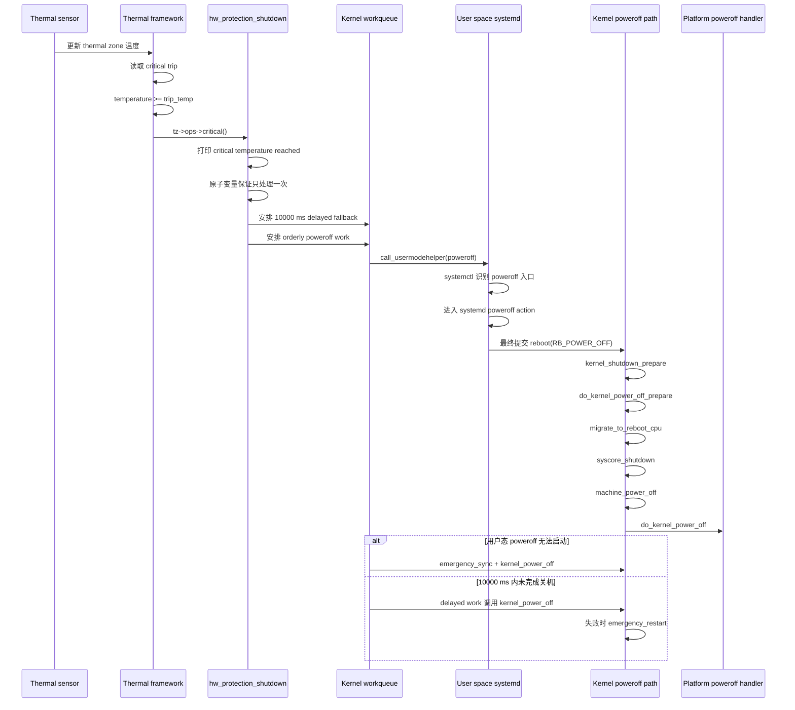

+++
title = 'Gunyah PVM 高温关机实现机制'
description = '基于内核源码与实机证据说明 thermal critical trip 到系统关机的调用链'
date = '2026-08-20T12:00:00+08:00'
draft = false
+++

# Gunyah PVM 高温关机实现机制

## 1. 结论

当前 PVM 中，高温关机由 Linux thermal framework 触发，调用链是：

```text
thermal zone 温度更新
    -> critical trip 被越过
    -> thermal_zone_device_critical()
    -> hw_protection_shutdown()
    -> 用户态 poweroff 命令
    -> systemd 关机
    -> reboot(RB_POWER_OFF)
    -> kernel_power_off()
```

内核同时安排一个 10 秒后的强制关机 work，作为用户态关机没有完成时的兜底路径。当前实机没有人为升温触发关机；下面的判断来自内核源码、设备树、构建出的 rootfs，以及当前 PVM 的只读运行时信息。

## 2. 证据范围

### 2.1 当前 PVM

本次通过 ADB shell 读取到：

| 项目 | 实机值 |
| --- | --- |
| shell 身份 | `uid=0(root)` |
| PID 1 | `systemd` |
| 内核 | `6.6.110-rt61-debug`，`PREEMPT_RT` |
| 启动配置 | `osconfig=PVM+GVM` |
| systemd | `systemd 255 (255.21^)` |
| thermal zone 数量 | 138 |
| 含 `critical` trip 的 thermal zone 数量 | 109 |
| 实际 `critical` 温度 | 109 个均为 `115000` m°C，即 115°C |
| `CONFIG_THERMAL_EMERGENCY_POWEROFF_DELAY_MS` | `10000` |

运行时 thermal zone 的判断来自每个 zone 的 `type`、`trip_point_*_type` 和 `trip_point_*_temp` 属性，而不是只根据设备树文本推断。

### 2.2 用户态关机入口

当前 rootfs 中观察到：

```text
sbin -> usr/sbin
sbin/poweroff -> usr/bin/systemctl
usr/bin/systemctl: AArch64 ELF executable
```

因此，内核默认的电源命令最终落到 systemd 的 `systemctl`。systemd 源码中，`systemctl` 通过进程名识别 `poweroff` 入口，并将动作设置为 `ACTION_POWEROFF`；动作表将该动作关联到 `poweroff.target`，并且源码包含通过 `reboot(RB_POWER_OFF)` 完成最终内核请求的路径。

相关 systemd 源码位置：

```text
src/systemctl/systemctl.c
src/systemctl/systemctl-start-unit.c
src/systemctl/systemctl-util.c
```

## 3. critical trip 的配置与触发

设备树中，thermal zone 的 critical trip 采用如下结构：

```dts
&thermal_zones {
    ddr-0-0 {
        trips {
            trip-point2 {
                temperature = <115000>;
                hysteresis = <3000>;
                type = "critical";
            };
        };
    };
};
```

源码位置：

```text
vendor/qcom/opensource/base-devicetree/arch/arm64/boot/dts/qcom/sa8x97p-non-safe.dtsi
```

其中：

- `temperature = <115000>` 表示 115000 m°C，即 115°C。
- `hysteresis = <3000>` 表示 3000 m°C，即 3°C。
- `type = "critical"` 指定该 trip 进入严重温度处理路径。

设备树中的 `critical` trip 经 thermal framework 注册后，运行时可以从 thermal zone 的 sysfs 属性读取。当前实机读到的 109 个 critical trip 均为 115000 m°C，这与设备树配置一致。

在 `drivers/thermal/thermal_core.c` 中，处理顺序如下：

1. `handle_thermal_trip()` 读取 trip 的温度和类型。
2. 对 `THERMAL_TRIP_CRITICAL`，进入 `handle_critical_trips()`。
3. 当 `tz->temperature >= trip_temp` 时，调用 `tz->ops->critical()`。
4. 如果 thermal zone 没有自定义 `critical` 回调，注册逻辑会把它补为 `thermal_zone_device_critical()`。

关键源码位置：

```text
drivers/thermal/thermal_core.c:329
drivers/thermal/thermal_core.c:344
drivers/thermal/thermal_core.c:1313
```

核心判断等价于：

```c
if (tz->temperature < trip_temp)
    return;

if (trip_type == THERMAL_TRIP_CRITICAL)
    tz->ops->critical(tz);
```

## 4. thermal framework 到保护关机

`thermal_zone_device_critical()` 做两件事：打印紧急日志，并调用 `hw_protection_shutdown()`。

```c
int poweroff_delay_ms = CONFIG_THERMAL_EMERGENCY_POWEROFF_DELAY_MS;

dev_emerg(&tz->device, "%s: critical temperature reached, "
          "shutting down\n", tz->type);

hw_protection_shutdown("Temperature too high", poweroff_delay_ms);
```

源码位置：

```text
drivers/thermal/thermal_core.c:314
```

当前内核配置为：

```text
CONFIG_THERMAL_EMERGENCY_POWEROFF_DELAY_MS=10000
```

所以当前 PVM 的 thermal critical 路径会把 10000 ms 传给 `hw_protection_shutdown()`。

## 5. `hw_protection_shutdown()` 的两条路径

源码位置：

```text
kernel/reboot.c:971
```

函数首先使用静态原子变量保证保护关机只启动一次：

```c
static atomic_t allow_proceed = ATOMIC_INIT(1);

if (!atomic_dec_and_test(&allow_proceed))
    return;
```

随后安排两个动作：

```c
hw_failure_emergency_poweroff(ms_until_forced);
orderly_poweroff(true);
```

### 5.1 首选路径：用户态有序关机

`orderly_poweroff(true)` 不在当前调用上下文中直接执行命令，而是把 `poweroff_work` 放入 kernel workqueue。workqueue 执行 `__orderly_poweroff()` 后调用 `run_cmd()`。

`run_cmd()` 使用：

```c
call_usermodehelper(argv[0], argv, envp, UMH_WAIT_EXEC);
```

这表示：

- 发起动作的是内核。
- 实际执行 `poweroff` 的是由内核创建的用户态进程。
- 当前 rootfs 中该命令通过符号链接落到 systemd 的 `systemctl`。
- `UMH_WAIT_EXEC` 等待用户态程序完成 exec 阶段，不等同于等待整个关机流程结束。

systemd 源码中，`poweroff` 入口会设置 `ACTION_POWEROFF`，动作表指向 `poweroff.target`；源码同时提供通过 `reboot(RB_POWER_OFF)` 向内核提交关机请求的路径。当前没有触发实机关机，因此本文不把 systemd 的具体运行时分支归结为单一路径。

### 5.2 用户态入口失败：立即进入内核关机

`__orderly_poweroff(true)` 如果 `run_cmd()` 返回错误，会执行：

```c
emergency_sync();
kernel_power_off();
```

这里的 `true` 很关键：它表示用户态命令无法启动时，不能只返回错误，而是直接强制进入内核关机路径。

### 5.3 延时兜底：10 秒后强制关机

`hw_failure_emergency_poweroff()` 在延时大于 0 时调度 delayed work：

```c
schedule_delayed_work(&hw_failure_emergency_poweroff_work,
                      msecs_to_jiffies(poweroff_delay_ms));
```

当前实机配置为 10000 ms。延时 work 到期后：

```c
pr_emerg("Hardware protection timed-out. Trying forced poweroff\n");
kernel_power_off();
```

如果 `kernel_power_off()` 返回，代码还会执行最后的：

```c
emergency_restart();
```

这条路径的设计目标是：即使用户态关机没有真正完成，也不让已经达到 critical 温度的系统继续运行。

## 6. 时序图



## 7. 内核最终关机阶段

`kernel_power_off()` 的源码顺序为：

```c
kernel_shutdown_prepare(SYSTEM_POWER_OFF);
do_kernel_power_off_prepare();
migrate_to_reboot_cpu();
syscore_shutdown();
pr_emerg("Power down\n");
kmsg_dump(KMSG_DUMP_SHUTDOWN);
machine_power_off();
```

源码位置：

```text
kernel/reboot.c:679
```

AArch64 的 `machine_power_off()` 会先关闭本地中断、停止其他 CPU，再调用 `do_kernel_power_off()`：

```c
local_irq_disable();
smp_send_stop();
do_kernel_power_off();
```

源码位置：

```text
arch/arm64/kernel/process.c:110
```

`do_kernel_power_off()` 会执行 power-off handler 链，并兼容旧的 `pm_power_off` 回调：

```c
if (pm_power_off)
    sys_off = register_sys_off_handler(...);

atomic_notifier_call_chain(&power_off_handler_list, 0, NULL);
```

源码位置：

```text
kernel/reboot.c:640
```

### 关于本机最终硬件断电动作的边界

当前实机的 `proc/kallsyms` 可以看到 `do_kernel_power_off`、`machine_power_off` 和 `msm_ps_hold_poweroff` 等符号；启动日志也能确认 `pinctrl-msm` 和平台 pinctrl 模块已加载。但是，符号存在不等于某个 handler 在本次运行中已经注册成功，因此本文不把某个具体 PMIC、PS_HOLD 或固件动作作为已证实结论。

已证实的结论只到：`machine_power_off()` 调用 `do_kernel_power_off()`，由已注册的 power-off handler 完成平台相关的最终动作。若要进一步确认 handler，需要在不触发关机的前提下增加内核调试信息，或在可恢复的测试平台上对该路径做一次受控验证。

## 8. 与 Gunyah 的关系

本文描述的是当前 PVM 内 Linux thermal framework 的高温关机路径：

```text
PVM thermal framework
    -> PVM 用户态 systemd
    -> PVM Linux kernel poweroff
    -> PVM 当前平台注册的 power-off handler
```

设备启动参数同时包含 PVM 与 GVM 配置，但本文没有对 GVM 的停止动作做未经验证的外推。GVM 是否随 PVM 关机、由哪个服务或 hypervisor 事件处理，属于另一条需要单独采集日志和源码调用链的路径。

## 9. 复核方法

以下检查不会主动触发关机，可用于确认运行时配置：

```bash
# 查看当前身份和 PID 1
adb shell 'id; cat proc/1/comm'

# 查看内核版本与启动参数
adb shell 'uname -a; cat proc/cmdline'

# 查看 poweroff 命令的符号链接
adb shell 'ls -ld sbin sbin/poweroff usr/sbin/poweroff usr/bin/systemctl'

# 查看 thermal zone 的类型、trip 类型和 trip 温度
adb shell 'for z in sys/class/thermal/thermal_zone*; do ...; done'

# 查看 emergency poweroff delay
adb shell 'zcat proc/config.gz | grep THERMAL_EMERGENCY_POWEROFF_DELAY_MS'
```

命令示例中的 `proc`、`sys` 和 `sbin` 是设备根文件系统下的相对表示，用于避免把某台开发机的绝对目录写入文档。

## 10. 证据边界

- 当前没有通过人为升温触发 `critical` 关机，避免对正在运行的 PVM 造成不可逆影响。
- 因此，本文没有声称实机已经完整走过 delayed fallback 或 `emergency_restart`。
- thermal trip、内核配置、用户态入口、systemd 动作和内核 poweroff 调用链均有源码或当前实机输出支撑。
- 最终硬件电源控制 handler 的具体实现未在本文中做未经运行时确认的归因。
