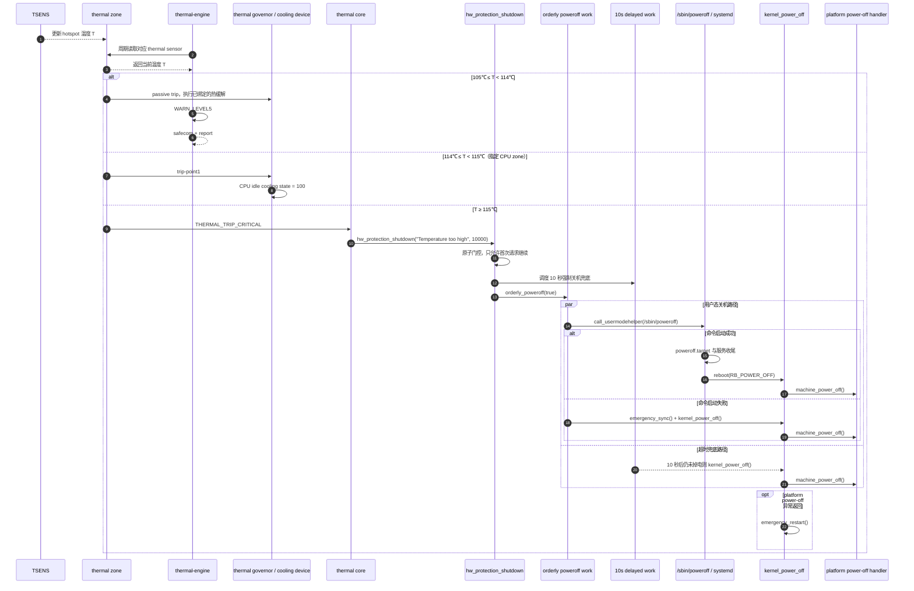

+++
title = 'SA8797 Gunyah PVM 高温自动关机原理与实现'
description = 'SA8797 PVM 从 TSENS 温度采集、thermal trip 分级处理到 Linux 保护性关机的实现'
date = '2026-08-20T12:00:00+08:00'
lastmod = '2026-09-23T12:00:00+08:00'
draft = false
categories = ['Qualcomm', 'Gunyah', '热管理']
tags = ['SA8797', 'PVM', 'Linux thermal', 'thermal-engine', '高温关机']
aliases = ['/gunyah/sa8797-pvm-high-temperature-auto-shutdown/']
+++

SA8797 的高温保护由 PVM 中的 Linux thermal framework 和 `thermal-engine` 共同完成。`thermal-engine` 负责分级上报及部分性能限制，Linux thermal core 负责 passive cooling 和不依赖用户态的 critical 关机。

## 1. 热保护层次

当前配置采用分级热保护：105℃执行热缓解，115℃执行保护关机。

| 温度阶段 | 主要执行者 | 动作 | 是否关机 |
|---|---|---|---|
| 105℃ | Linux thermal governor、`thermal-engine` | 进入 passive 热缓解；FUSA 规则发送 `safecom` 和 `report`，GPU SS 算法开始限性能 | 否 |
| 114℃ | 部分 CPU hotspot 的 cooling map | 将对应 CPU idle cooling device 提升到配置状态 | 否 |
| 115℃ | Linux thermal core | 触发 `critical` trip，进入硬件保护关机 | 是 |
| 关机启动后 10 秒仍未掉电 | Linux reboot core | 跳过用户态收尾，执行强制 `kernel_power_off()` | 是 |
| 强制 power-off 异常返回 | Linux reboot core | 最后才调用 `emergency_restart()` | 异常兜底重启 |

应用层的温度告警、PowerMgr 水冷请求、`polaris-monitor` 和 `temp-monitor` 用于提前降温或监控。115℃ critical trip 是 PVM 内核的最终保护，不依赖这些进程存活。

## 2. 组件关系

SA8797 的物理温度传感器由 PVM 管理。设备树把 TSENS 通道注册为 Linux thermal zone，并为每个 zone 配置 trip point。温度更新后，Linux thermal core 根据 trip 类型选择不同路径：

```text
TSENS
  -> thermal zone
     -> passive trip  -> thermal governor -> cooling device
     -> critical trip -> hw_protection_shutdown()
                            -> orderly_poweroff(true)
                            -> 10 秒 delayed forced poweroff
```

`thermal-engine` 与内核 thermal framework 并行工作：它读取同一批温度传感器，执行 FUSA 上报或用户态热缓解算法；真正不依赖用户态存活的 `critical` 关机由内核 thermal core 完成。

两条路径读取相同的物理温度，但执行策略相互独立。用户态 `thermal-engine` 停止运行不会关闭内核 critical trip。

## 3. trip point 配置

### 3.1 基础 passive trip

基础配置位于：

```text
linux/apps/apps_proc/vendor/qcom/opensource/base-devicetree/
  arch/arm64/boot/dts/qcom/sa8x97p.dtsi
```

以 `cpu-2-0-1` 为例，基础 DTS 首先定义 105℃ passive trip：

```dts
cpu-2-0-1 {
    thermal-sensors = <&tsens3 1>;

    trips {
        trip-point0 {
            temperature = <105000>;
            hysteresis = <10000>;
            type = "passive";
        };
    };
};
```

thermal 子系统的温度单位是毫摄氏度，因此 `105000` 表示 105℃。`hysteresis = <10000>` 表示温度下穿 95℃后才产生该 trip 的下降事件，避免在 105℃附近频繁抖动。

### 3.2 114℃强热缓解与 115℃ critical

非安全域增量配置位于：

```text
linux/apps/apps_proc/vendor/qcom/opensource/base-devicetree/
  arch/arm64/boot/dts/qcom/sa8x97p-non-safe.dtsi
```

对应节点增加了 115℃ critical trip，并把 114℃ trip 绑定到 CPU idle cooling device：

```dts
cpu-2-0-1 {
    trips {
        trip-point2 {
            temperature = <115000>;
            hysteresis = <3000>;
            type = "critical";
        };

        cpu12_alert1: trip-point1 {
            temperature = <114000>;
            hysteresis = <3000>;
        };
    };

    cooling-maps {
        map0 {
            trip = <&cpu12_alert1>;
            cooling-device = <&CPU12_idle 100 100>;
        };
    };
};
```

这形成了紧邻 critical 阈值的最后一级热缓解：先在 114℃强制对应 CPU 进入配置的 idle cooling state；如果温度仍升到 115℃，立即进入保护关机。

`cpu-2-1-1` 使用同样的结构，对应 `CPU13_idle`。`gpuss-1-1` 等关键 zone 也配置了 115℃ critical trip，但具体 cooling map 取决于各 zone 的设备树定义。

## 4. thermal-engine 的105℃策略

`thermal-engine` 的内置 FUSA monitor 规则按 55、65、75、85、95、105℃逐级上报。105℃一级的动作是：

```c
.t[5] = {
    .lvl_trig = 105000,
    .lvl_clr = 95000,
    .actions[0] = { .device = "safecom", ... },
    .actions[1] = { .device = "report", ... },
}
```

源码位置：

```text
linux/apps/apps_proc/vendor/qcom/proprietary/thermal-engine/
  thermal_monitor-data.c
```

这组规则负责安全通信和事件上报，没有绑定 `shutdown` 动作。

GPU 的 SS 算法也使用 105℃，但其用途是限制 GPU：

```c
.sensor = "gpuss-1-1",
.device = "gpu1",
.sampling_period_ms = 100,
.set_point = 105000,
.set_point_clr = 101000,
```

源码位置：

```text
linux/apps/apps_proc/vendor/qcom/proprietary/thermal-engine/ss-data.c
```

当前 105℃ FUSA 规则只绑定 `safecom + report`。通用 `shutdown_action()` 未绑定到该规则；它在 Linux 构建中的实现为 `reboot(RB_POWER_OFF)`。

## 5. critical trip 的内核处理

Linux thermal core 每次更新 thermal zone 温度后遍历 trip point。对于 critical trip，判定逻辑等价于：

```c
if (trip_temp <= 0 || tz->temperature < trip_temp)
    return;

if (trip_type == THERMAL_TRIP_CRITICAL)
    tz->ops->critical(tz);
```

温度满足 `temperature >= trip_temp` 时触发 critical trip。

未提供平台专用 critical callback 时，thermal core 使用默认实现 `thermal_zone_device_critical()`：

```c
dev_emerg(&tz->device,
          "%s: critical temperature reached, shutting down\n",
          tz->type);

hw_protection_shutdown(
    "Temperature too high",
    CONFIG_THERMAL_EMERGENCY_POWEROFF_DELAY_MS);
```

源码位置：

```text
linux/apps/apps_proc/kernel/kernel_platform/kernel/
  drivers/thermal/thermal_core.c
```

该路径在内核态执行，不要求 `thermal-engine`、PowerMgr 或其他业务进程正常运行。

## 6. hw_protection_shutdown 的实现

当前内核配置为：

```text
CONFIG_THERMAL_EMERGENCY_POWEROFF_DELAY_MS=10000
```

`hw_protection_shutdown()` 同时启动两条路径：

1. 立即调用 `orderly_poweroff(true)`，由 workqueue 拉起 `/sbin/poweroff`，让 systemd 和用户态服务执行正常关机收尾。
2. 调度 10 秒 delayed work。如果系统届时仍未掉电，直接调用 `kernel_power_off()`。

核心实现位于：

```text
linux/apps/apps_proc/kernel/kernel_platform/kernel/kernel/reboot.c
```

### 6.1 单次触发

函数使用静态原子变量保证整机只接受第一次保护关机请求，多个 thermal zone 同时越过 critical 不会重复启动多套关机流程：

```c
static atomic_t allow_proceed = ATOMIC_INIT(1);

if (!atomic_dec_and_test(&allow_proceed))
    return;
```

### 6.2 用户态有序关机

`orderly_poweroff(true)` 将 `poweroff_work` 放入 kernel workqueue。workqueue 执行 `__orderly_poweroff()`，再由 `run_cmd()` 启动 `/sbin/poweroff`：

```c
static char poweroff_cmd[] = "/sbin/poweroff";

call_usermodehelper(argv[0], argv, envp, UMH_WAIT_EXEC);
```

当前 PVM rootfs 的命令关系为：

```text
/sbin -> /usr/sbin
/usr/sbin/poweroff -> /usr/bin/systemctl
```

systemd 根据 `poweroff` 调用名选择 `ACTION_POWEROFF`，启动 `poweroff.target`，完成服务停止和文件系统卸载，然后通过 `reboot(RB_POWER_OFF)` 向内核提交关机请求。

`UMH_WAIT_EXEC` 只等待用户态程序完成 `exec`，不等待整个关机过程结束。10秒 delayed work 从 `hw_protection_shutdown()` 调用时开始计时。

### 6.3 用户态命令启动失败

`orderly_poweroff(true)` 中的 `true` 表示：如果 `/sbin/poweroff` 连启动都失败，则不等待 10 秒，先执行 `emergency_sync()`，随后立即进入 `kernel_power_off()`。

### 6.4 10秒强制关机

`hw_failure_emergency_poweroff()` 使用 delayed work 实现超时兜底：

```c
schedule_delayed_work(&hw_failure_emergency_poweroff_work,
                      msecs_to_jiffies(poweroff_delay_ms));
```

10秒后系统仍在运行时，delayed work 直接调用 `kernel_power_off()`。如果 `kernel_power_off()` 异常返回，则执行 `emergency_restart()`。该重启只用于 power-off 失败兜底。

## 7. 执行时序

以下以 `cpu-2-0-1` 为例。其他配置了 critical trip 的 thermal zone 走相同的关机主路径。



正常情况下，用户态关机先完成，机器掉电后 delayed work 自然不会再获得执行机会。只有用户态关机卡住或执行失败时，10 秒兜底才决定最终结果。

## 8. 内核最终掉电路径

`kernel_power_off()` 依次完成：

```text
kernel_shutdown_prepare(SYSTEM_POWER_OFF)
  -> do_kernel_power_off_prepare()
  -> migrate_to_reboot_cpu()
  -> syscore_shutdown()
  -> kmsg_dump(KMSG_DUMP_SHUTDOWN)
  -> machine_power_off()
  -> do_kernel_power_off()
  -> platform power-off handler
```

AArch64 的 `machine_power_off()` 关闭本地中断、停止其他 CPU，然后调用 `do_kernel_power_off()`：

```c
local_irq_disable();
smp_send_stop();
do_kernel_power_off();
```

`do_kernel_power_off()` 执行已注册的 power-off handler 链，并兼容旧的 `pm_power_off` 回调：

```c
if (pm_power_off)
    sys_off = register_sys_off_handler(...);

atomic_notifier_call_chain(&power_off_handler_list, 0, NULL);
```

最终物理掉电由运行时注册的 platform power-off handler 完成。

相关源码：

```text
linux/apps/apps_proc/kernel/kernel_platform/kernel/kernel/reboot.c
linux/apps/apps_proc/kernel/kernel_platform/kernel/arch/arm64/kernel/process.c
```

## 9. Gunyah 虚拟化边界

高温判定和保护关机位于 PVM：

```text
PVM TSENS
  -> PVM Linux thermal framework
  -> PVM systemd
  -> PVM Linux power-off
  -> platform power-off handler
```

GVM 中的温度监控、告警和业务状态不能取消 PVM 已触发的 critical 关机。PVM 最终 platform power-off 会结束整个平台运行；GVM 的服务停止和数据收尾能否完成，取决于用户态有序关机阶段和虚拟机管理集成。

## 10. 关键日志

critical 路径正常会依次出现下面的内核日志：

```text
<zone type>: critical temperature reached, shutting down
HARDWARE PROTECTION shutdown (Temperature too high)
Power down
```

若 10 秒兜底被触发，还会出现：

```text
Hardware protection timed-out. Trying forced poweroff
```

只有强制 power-off 异常返回，才会继续打印：

```text
Hardware protection shutdown failed. Trying emergency restart
```

可使用 BusyBox 兼容命令实时观察：

```bash
journalctl -k -f -n 0 -o short-iso-precise --no-pager |
grep -E 'critical temperature reached|HARDWARE PROTECTION|forced poweroff|Power down|emergency restart'
```

## 11. 运行时配置确认

不触发升温即可从 sysfs 确认生效配置：

```bash
for z in /sys/class/thermal/thermal_zone*; do
    type=$(cat "$z/type" 2>/dev/null)
    case "$type" in
        cpu-2-0-1|cpu-2-1-1|gpuss-1-1)
            echo "=== $z $type ==="
            grep -H . "$z"/trip_point_*_temp \
                "$z"/trip_point_*_type \
                "$z"/trip_point_*_hyst 2>/dev/null
            ;;
    esac
done

zcat /proc/config.gz |
grep 'CONFIG_THERMAL_EMERGENCY_POWEROFF_DELAY_MS'
```

预期能看到代表性 hotspot 的 105℃ passive、部分 CPU zone 的 114℃ passive、115℃ critical，以及 10000 ms 强制关机延时。

## 12. 源码索引

| 内容 | 路径 |
|---|---|
| 基础 thermal zone 与 105℃ passive trip | `linux/apps/apps_proc/vendor/qcom/opensource/base-devicetree/arch/arm64/boot/dts/qcom/sa8x97p.dtsi` |
| 114℃ cooling map 与 115℃ critical trip | `linux/apps/apps_proc/vendor/qcom/opensource/base-devicetree/arch/arm64/boot/dts/qcom/sa8x97p-non-safe.dtsi` |
| thermal trip 分派与默认 critical callback | `linux/apps/apps_proc/kernel/kernel_platform/kernel/drivers/thermal/thermal_core.c` |
| orderly poweroff、10 秒兜底和最终重启兜底 | `linux/apps/apps_proc/kernel/kernel_platform/kernel/kernel/reboot.c` |
| AArch64 `machine_power_off()` | `linux/apps/apps_proc/kernel/kernel_platform/kernel/arch/arm64/kernel/process.c` |
| 10 秒配置 | `linux/apps/apps_proc/kernel/kernel_platform/kernel/arch/arm64/configs/qcom_defconfig` |
| FUSA 逐级温度上报 | `linux/apps/apps_proc/vendor/qcom/proprietary/thermal-engine/thermal_monitor-data.c` |
| GPU 105℃ SS 热缓解 | `linux/apps/apps_proc/vendor/qcom/proprietary/thermal-engine/ss-data.c` |
| thermal-engine 通用 shutdown action | `linux/apps/apps_proc/vendor/qcom/proprietary/thermal-engine/devices/devices_actions.c` |
| systemd poweroff 入口 | `src/systemctl/systemctl.c`、`src/systemctl/systemctl-start-unit.c`、`src/systemctl/systemctl-util.c` |
