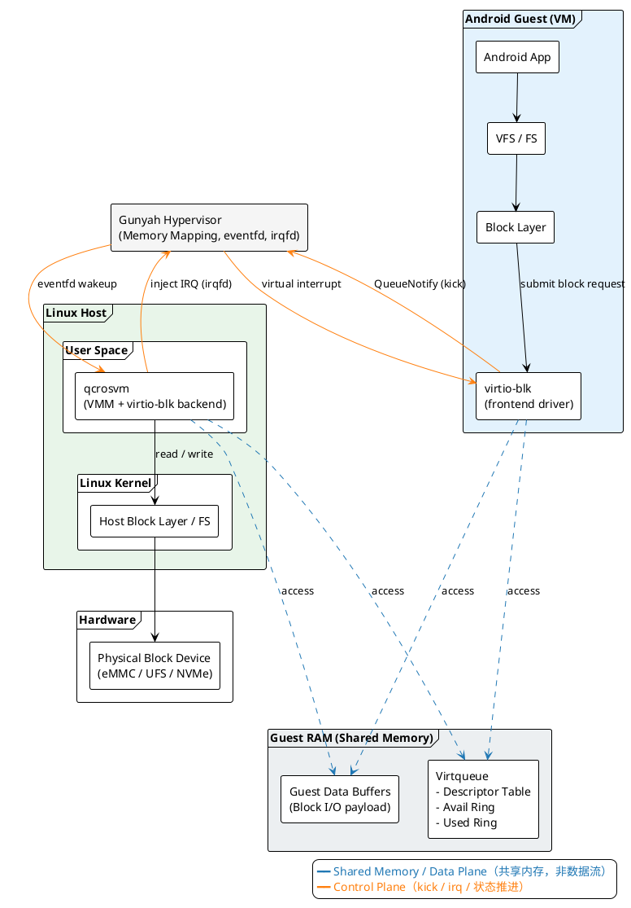

+++
date = '2025-08-04T09:49:58+08:00'
draft = false
title = '高通 Gunyah Virtio-blk实现机制'
+++

#### 1. 概述

本图展示了在 Android 虚拟化场景下，Guest OS（Android 虚拟机）如何通过 **Virtio-blk** 协议高效地访问 Host 侧的物理存储设备。该架构采用 **Userspace Backend** 模式，即虚拟磁盘的后端处理逻辑集成在 VMM（此处为 `qcrosvm`）的用户态进程中。

#### 2. 核心组件与角色

* **Guest (Android VM):**
* **Virtio-blk Frontend:** 运行在 Android 内核中的驱动程序。它不进行实际的数据拷贝，而是负责将上层文件系统（App/VFS）的读写请求封装成 Virtio 格式的描述符。
* **Block Layer:** 生成标准的块 I/O 请求。

* **Shared Memory (数据平面):**
* 这是 Guest 的部分 RAM，被 Hypervisor 映射给 Host 侧的 `qcrosvm` 访问。
* **Virtqueue (VQ):** 核心数据结构，包含描述符表（Descriptors）、可用环（Avail Ring）和已用环（Used Ring）。
* **Data Buffers:** 实际存放读写数据的内存区域。
* **机制:** 前后端通过共享内存直接读写数据，实现了 **Zero-Copy（零拷贝）** 的高效数据传输。

* **Host (Linux & qcrosvm):**
* **qcrosvm (VMM + Backend):** 这是宿主机上的虚拟机管理进程。它内部集成了 virtio-blk 的后端逻辑，负责从共享内存中取出请求，并将其转化为宿主机的文件读写操作。
* **Host Block Layer:** Linux 内核的通用块设备层，负责最终驱动物理硬件。

* **Hypervisor (Gunyah):**
* 负责特权级切换、内存映射管理、以及中断和通知（Kick）的路由（通过 `eventfd` 和 `irqfd`）。

#### 3. I/O 处理流程详解

整个 I/O 周期可以分为 **请求提交**、**通知与处理**、**中断完成** 三个阶段：

**阶段一：请求提交 (Guest -> Shared Memory)**

1. Android App 发起读写请求，经过 VFS 和 Block Layer，到达 `virtio-blk` 前端驱动。
2. 前端驱动将请求的数据缓冲区地址和长度写入 **Shared Memory** 中的 **Virtqueue (Descriptor Table)**。
3. 前端更新 **Avail Ring**，表示有新的请求待处理。

**阶段二：通知与处理 (Kick -> Backend Processing)**

1. **Kick (Notify):** 前端驱动执行 MMIO 写操作（`QueueNotify`）。
2. **Trap & Signal:** Gunyah Hypervisor 捕获该 MMIO 操作，识别为通知事件，通过 **eventfd** 唤醒处于用户态的 `qcrosvm` 进程。
3. **Process:** `qcrosvm` 被唤醒后：
* 直接访问共享内存中的 Virtqueue，读取请求详情。
* 根据描述符找到 Data Buffer。
* 向 Host Linux Kernel 发起实际的读写系统调用（`read/write` 或 `io_uring`）。
* 硬件完成 I/O 后，数据被写入/读出物理磁盘。

**阶段三：完成与中断 (Backend -> Guest)**

1. **Reply:** `qcrosvm` 将处理结果写回 **Used Ring**。
2. **Inject IRQ:** `qcrosvm` 通过写 **irqfd** 通知 Hypervisor。
3. **Virtual Interrupt:** Gunyah Hypervisor 将虚拟中断注入给 Android Guest。
4. Guest 收到中断，前端驱动处理 Used Ring 中的结果，完成 I/O 流程，向上层应用返回数据。

#### 4. 架构特点总结

* **简单高效:** 相比 vhost-user，这种将后端集成在 VMM 内部的模式配置更简单，调试更容易，适合大多数标准场景。
* **内存安全:** Guest 与 Host 之间的数据交换完全通过受控的共享内存进行，无额外数据搬运。
* **轻量级通知:** 利用 `eventfd` 和 `irqfd` 避免了繁重的上下文切换开销。

