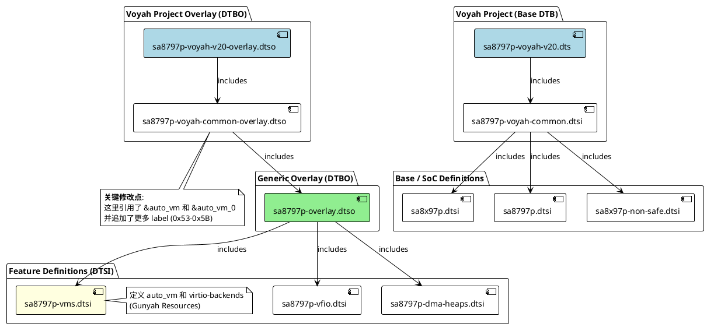

+++
date = '2025-08-04T09:49:58+08:00'
draft = false
title = '高通 Gunyah 虚拟化平台设备树 (Device Tree) 全解：从源码到 Boot Image'
+++


在基于 Gunyah Hypervisor 的高通汽车平台（如 SA8797P）中，设备树（Device Tree）扮演着双重角色：它不仅描述了 Linux Host 的物理硬件，还充当了 Hypervisor 的“资源授权合约”，定义了虚拟机（VM）可以访问哪些内存和虚拟设备。

本文将深入解析其文件结构、编译配置、构建流程以及打包机制。

## 1. 源码结构与文件路径

在 Yocto 项目中，设备树源码通常独立于内核源码管理，位于 `vendor/qcom/opensource/base-devicetree` 目录下。

### 关键文件类型与路径

所有核心文件位于 `arch/arm64/boot/dts/qcom/` 目录下：

1.  **SoC 基础定义 (`.dtsi`)**:

      * **`sa8797p.dtsi`**: 定义了芯片级的硬件，如 CPU、中断控制器 (GIC)、总线、时钟等。
      * **`sa8x97p.dtsi`**: 系列通用的定义。

2.  **虚拟机资源定义 ("The Contract")**:

      * **`sa8797p-vms.dtsi`**: **这是配置虚拟设备的核心文件**。
      * 它定义了 `auto_vm` (Android Guest) 的资源，包括：
          * **`reserved-memory`**: 为 Virtio 环形缓冲区（Ring Buffers）预留的物理内存（带有 `gunyah-label`）。
          * **`virtio-backends`**: 定义 Host 内核可见的后端逻辑设备（带有 `qcom,label`）。
          * **`gh-secure-vm-loader`**: 将上述资源绑定到特定的 VMID。

3.  **项目级覆盖 (Overlay) (`.dtso`)**:

      * **`sa8797p-overlay.dtso`**: 通用的 Overlay入口。
      * **`sa8797p-voyah-common-overlay.dtso`**: **特定项目（Voyah）的扩展配置**。
      * *最佳实践*：当需要添加新设备（如 `virtio-fs`）时，推荐修改此文件，以利用其覆盖机制，避免破坏基础平台定义。

4.  **板级顶层定义 (`.dts`)**:

      * **`sa8797p-voyah-v20.dts`**: 针对具体硬件板卡的顶层描述文件。

## 2. 编译配置 (Bitbake Recipe)

Yocto 构建系统通过 Recipe 来管理编译过程。

  * **Recipe 文件**: `layers/meta-qti-auto-kernel/recipes-kernel/linux/kernel-basedevicetree.bb` (及其 `.bbappend`)。
  * **工作原理**:
    1.  Recipe 将源码目录变量 `${S}` 指向 `vendor/qcom/opensource/base-devicetree`。
    2.  它定义了依赖关系 `DEPENDS += "virtual/kernel"`，确保内核环境已准备好。
    3.  在 `do_compile` 阶段，它执行 `make` 命令。

## 3. 编译过程详解

编译过程并非由单一工具完成，而是通过一个 Wrapper Makefile 调用 Linux 内核构建系统，最后由脚本合并。

### 第一阶段：Wrapper Makefile 调用

Bitbake 执行 `vendor/qcom/opensource/base-devicetree/Makefile`。
该 Makefile  设置了关键环境变量：

  * `KDIR`: 指向 Linux 内核源码树。
  * `TECHPACK_INCLUDE`: 包含路径，确保能找到 `oot-dt-bindings` 头文件。

然后它执行：

```makefile
$(MAKE) -C $(KDIR) ... dtbs
```

这意味着它切换到内核目录，利用内核的 Kbuild 系统来编译外部的 device tree。

### 第二阶段：DTC 编译 (生成 .dtb 和 .dtbo)

内核的 Kbuild 系统调用设备树编译器 (`dtc`)：

1.  **预处理**: 处理 `#include` 指令。
2.  **编译**:
      * 将 `.dts` (如 `sa8797p-voyah-v20.dts`) 编译为 **基础 Blob (`.dtb`)**。
      * 将 `.dtso` (如 `sa8797p-voyah-common-overlay.dtso`) 编译为 **Overlay Blob (`.dtbo`)**。

### 第三阶段：合并 (Merge)

编译完成后，会调用 `merge_dtbs.sh` 脚本 。
该脚本使用 `fdtoverlay` 工具，将匹配的 `.dtbo` (Overlay) 动态应用到基础 `.dtb` 上：

```bash
fdtoverlay -i base.dtb -o final_merged.dtb -v overlay1.dtbo overlay2.dtbo ...
```

**结果**：生成一个包含所有硬件定义**以及**所有 VM 资源配置（您添加的 Virtio-FS 节点）的最终 DTB 文件。


## 4. 虚拟机配置机制 (Gunyah Contract)

这是 Gunyah 架构最独特的部分。Host 的设备树不仅仅描述硬件，还描述了 VM 的权限。

### 关键配置项

在 `.dtsi` 或 `.dtso` 中，必须成对配置以下两项，才能让 `qcrosvm` 正常工作：

1.  **物理资源 (Memory)**:

    ```dts
    auto_vm_fs_ring: auto_vm_fs_ring@B002BE000 {
        no-map;                      /* 禁止 Host OS 挪作他用 */
        reg = <0xB 0x002BE000 ...>;  /* 固定的物理地址 */
        gunyah-label = <0x5C>;       /* 资源 ID */
    };
    ```

2.  **逻辑设备 (Backend)**:

    ```dts
    auto_vm_be59: auto_vm_be59@5C {
        qcom,vm = <&auto_vm>;
        qcom,label = <0x5C>;         /* 设备 ID */
    };
    ```

### 运行时交互

  * **Gunyah Hypervisor (EL2)**: 启动时读取最终 DTB，记录下 `Label 0x5C` 对应物理地址 `0xB002BE000`。
  * **qcrosvm (EL1 User)**: 启动时参数 `--vhost-user-fs ...,label=5C`。它发起 `ioctl` 请求操作 `0x5C`。
  * **验证**: Hypervisor 检查 DTB 记录，确认 `0x5C` 存在且合法，允许 `qcrosvm` 建立连接。

## 5. 打包过程 (Packaging)

生成的 DTB 最终必须被打包进启动镜像才能生效。

1.  **工具**: `mkbootimg` (Android 标准工具)。
2.  **输入**:
      * `kernel` (`Image.gz`): Linux Host 内核。
      * `ramdisk` (`initrd.img`): 根文件系统。
      * **`dtb`**: **上一步生成的最终合并 DTB**。
3.  **输出**: `sa8797-boot.img`。
4.  **命令示例** (由 `qimage-boot.bbclass` 处理):
    ```bash
    mkbootimg --kernel Image.gz --dtb final_merged.dtb --ramdisk initrd.img --output boot.img ...
    ```

## 总结

1.  **修改**: 您在 `sa8797p-voyah-common-overlay.dtso` 中添加了 `virtio-fs` 的 `label` 和 `ring-buffer`。
2.  **编译**: Bitbake 调用 Wrapper Makefile，进而调用 Kernel DTC，生成 `.dtb` 和 `.dtbo`。
3.  **合并**: `merge_dtbs.sh` 将 Overlay 合并入 Base DTB。
4.  **打包**: 合并后的 DTB 被 `mkbootimg` 打包进 `boot.img`。
5.  **生效**: 设备启动，Bootloader 加载 `boot.img`，Gunyah 读取 DTB 中的新配置，从而允许您的 `qcrosvm` 使用新的 label 启动 `virtio-fs`。
   
