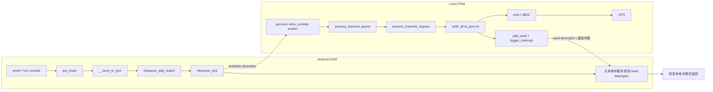
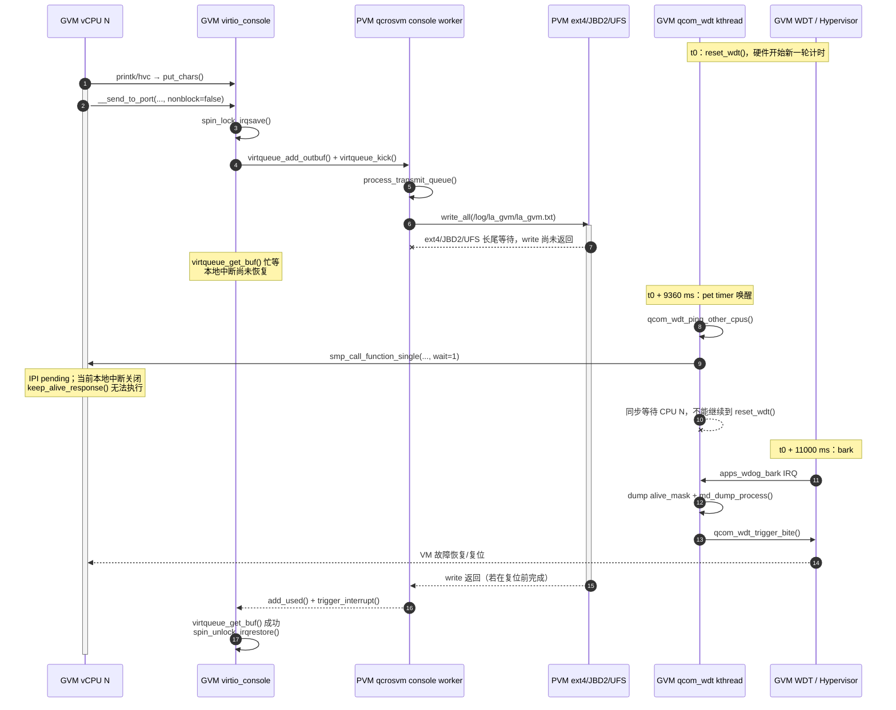

+++
title = 'GVM Watchdog 原理：la_gvm 串口文件阻塞如何演变为 Watchdog Bite'
date = '2026-09-20T13:00:00+08:00'
draft = false
+++

## 一、结论先行

SA8797 的 GVM watchdog 不只检查 watchdog 内核线程是否还能调度，还会逐个检查所有在线 vCPU 能否执行一次 IPI 回调。当前实现使用同步调用：只要一个 vCPU 迟迟不响应，watchdog 线程就停在该 vCPU 上，无法执行本轮硬件喂狗。

`la_gvm.txt` 是 GVM virtio-console 在 PVM 侧的文件后端。GVM 的 hvc console 发送不是“把字符交给队列就返回”，而是把描述符放入 virtqueue 后，关闭本地中断并忙等 PVM 返回 used descriptor。PVM 的 qcrosvm 又是在 `/log/la_gvm/la_gvm.txt` 的 `write_all()` 返回之后才归还这个描述符。因此，PVM 文件写入的长尾延迟会跨过虚拟机边界，直接延长 GVM vCPU 的关中断等待时间。

当下面三个条件同时成立时，普通的日志写入延迟就可能升级成 GVM watchdog：

1. PVM 的 qcrosvm console 线程写 `la_gvm.txt` 时长时间阻塞，例如等在 ext4/JBD2 元数据路径；
2. 某个 GVM vCPU 正在 hvc console 的同步发送路径中，等待 PVM 归还 virtqueue 描述符；
3. watchdog 在剩余喂狗窗口内向这个 vCPU 发出同步 IPI，而该 vCPU 因本地中断关闭而不能执行心跳回调。

这条链路关注的是**最坏延迟和时序重叠**。平均 CPU 使用率低、GVM 与 PVM 的 CPU 已隔离、UFS 平均吞吐量正常，都不能排除它。

## 二、跨虚拟机的数据通路

系统服务把 label 41 的 GVM console 配置为文件后端：

```text
--console=/log/la_gvm/la_gvm.txt,label=41
```

完整路径如下：



这里存在一条关键的反压链：

```text
PVM 文件 write 不返回
  → qcrosvm 不执行 transmit_queue.add_used()
  → GVM virtqueue_get_buf() 取不到 used descriptor
  → __send_to_port() 不返回
  → 发日志的 GVM vCPU 不能恢复本地中断
```

它不是两边 CPU 调度意义上的共享，而是一个**跨 VM 的同步完成依赖**。CPU affinity 只能隔离计算资源，无法消除 virtqueue 描述符、PVM 文件系统和物理 UFS 所形成的依赖。

## 三、GVM watchdog 如何工作

### 3.1 pet、bark 与 bite

Qualcomm Apps Watchdog 有三个关键动作：

| 动作 | 含义 | 当前平台时间 |
|---|---|---:|
| pet | 软件重置 watchdog 计数器 | 周期 9360 ms |
| bark | 计数器未及时重置，先进入诊断中断 | 距上次 pet 11000 ms |
| bite | 触发复位/VM 故障处理 | 驱动初始化为 bark 后 3000 ms；bark handler 还会主动触发 bite |

设备树中的配置是：

```dts
qcom,bark-time = <11000>;
qcom,pet-time = <9360>;
qcom,ipi-ping;
```

理想情况下，pet timer 唤醒到 bark 之间只有：

```text
11000 ms - 9360 ms = 1640 ms
```

这 1640 ms 还要扣除 watchdog 线程的唤醒延迟、前面 vCPU 的检查时间以及其他软件开销。因此，一个 vCPU 实际得到的响应窗口通常小于 1640 ms。

### 3.2 watchdog 检查的是每个 vCPU 是否能接收 IPI

`qcom_wdt_ping_other_cpus()` 清空 `alive_mask`，然后顺序遍历在线 CPU。每次调用的最后一个参数是 `1`，表示等待远端 CPU 把回调执行完才返回：

```c
for_each_cpu(cpu, cpu_online_mask) {
    if (!wdog_dd->cpu_idle_pc_state[cpu]) {
        wdog_dd->ping_start[cpu] = sched_clock();
        smp_call_function_single(cpu,
                                 qcom_wdt_keep_alive_response,
                                 wdog_dd, 1);  /* wait = 1 */
    }
}
```

远端 CPU 执行的回调很短，只设置存活位并记录结束时间：

```c
static void qcom_wdt_keep_alive_response(void *info)
{
    struct msm_watchdog_data *wdog_dd = info;
    int cpu = smp_processor_id();

    cpumask_set_cpu(cpu, &wdog_dd->alive_mask);
    wdog_dd->ping_end[cpu] = sched_clock();
    smp_mb();
}
```

真正危险的不是回调耗时，而是目标 CPU 能否接收并执行 IPI。watchdog 内核线程虽然使用接近最高优先级的 `SCHED_FIFO`，但它无法代替远端 CPU 执行回调，也无法让一个关闭本地中断的远端 CPU处理 IPI。

watchdog 线程只有在所有同步 IPI 都返回后，才会走到真正的喂狗操作：

```c
if (wdog_dd->do_ipi_ping)
    qcom_wdt_ping_other_cpus(wdog_dd);

/* ... */

if (wdog_dd->enabled) {
    delay_time = msecs_to_jiffies(wdog_dd->pet_time);
    wdog_dd->ops->reset_wdt(wdog_dd);
    wdog_dd->last_pet = sched_clock();
}
```

所以，`ping_start[cpu] != 0` 且 `ping_end[cpu] == 0` 的含义是：watchdog 已经开始等待这个 CPU，但回调没有完成。由于检查是串行的，排在它后面的 CPU 可能尚未被检查；它们的 `ping_start == 0` 不能直接解释为那些 CPU 也失去响应。

### 3.3 bark 后为什么会走向复位

如果同步 IPI 一直不返回，watchdog 线程无法执行 `reset_wdt()`。硬件计数到 bark 后，`qcom_wdt_bark_handler()` 会打印最后一次 pet 和 CPU alive mask、触发 minidump，然后调用 `qcom_wdt_trigger_bite()`：

```c
md_dump_process();
qcom_wdt_trigger_bite();
```

在 Gunyah 虚拟化环境里，bite 首先是 GVM 的 watchdog 故障。最终表现为仅重启 GVM，还是由 Hypervisor/Resource Manager/VMM 策略升级为更大范围的复位，取决于该软件版本的虚拟 watchdog 和故障恢复配置。watchdog 触发原因与最终复位范围是两个不同层次的问题。

## 四、为什么 `la_gvm.txt` 写入会卡住 GVM vCPU

### 4.1 GVM 发送端是同步忙等

GVM 的 hvc console 调用 `put_chars()`，后者把 `nonblock` 明确传为 `false`：

```c
ret = __send_to_port(port, sg, 1, count, data, false);
```

`__send_to_port()` 的关键部分如下：

```c
spin_lock_irqsave(&port->outvq_lock, flags);

virtqueue_add_outbuf(out_vq, sg, nents, data, GFP_ATOMIC);
virtqueue_kick(out_vq);

while (!virtqueue_get_buf(out_vq, &len) &&
       !virtqueue_is_broken(out_vq))
    cpu_relax();

spin_unlock_irqrestore(&port->outvq_lock, flags);
```

这段代码同时具备三个危险属性：

- 使用 `spin_lock_irqsave()`，等待期间本地中断保持关闭；
- 没有超时条件，只等待 used descriptor 或队列被标记为 broken；
- 使用 `cpu_relax()` 忙等，不会主动睡眠让出这条 console 调用。

因此，只要 PVM 后端不确认描述符，GVM 当前 vCPU 就可能长时间停留在这个关中断区间。watchdog 的 IPI 正好发往该 vCPU 时，IPI 不能被处理。

### 4.2 PVM 只有在文件写完后才确认描述符

PVM 的 qcrosvm console worker 从 transmit queue 取出描述符后，先调用 `process_transmit_request()`。只有该调用返回，才执行 `add_used()` 和虚拟中断：

```rust
let len = match process_transmit_request(reader, output) {
    Ok(written) => written,
    Err(e) => {
        error!("console: process_transmit_request failed: {}", e);
        0
    }
};

transmit_queue.add_used(mem, desc_index, len);
transmit_queue.trigger_interrupt(mem, interrupt);
```

文件输出路径又是同步的：

```rust
fn write_output(output: &mut dyn io::Write, data: &[u8]) -> io::Result<()> {
    output.write_all(data)?;
    output.flush()
}
```

对于 `SerialType::File`，`output` 是以 append/create 方式打开的普通 `File`。这条路径没有调用 `fsync()`、`fdatasync()` 或 Rust 的 `sync_all()`/`sync_data()`；这里的 `flush()` 也不能等同于一次持久化同步。即使没有 `fsync()`，普通 `write()` 仍然可能在页分配、脏页节流、inode 时间更新、日志事务和块设备等待中阻塞。

### 4.3 很小的日志也可能等在 ext4/JBD2

一次 console 写入可能只有十几个字节，但 ext4 仍可能更新 inode 的时间和元数据。典型内核路径是：

```text
vfs_write
  → ext4_file_write_iter
    → ext4_buffered_write_iter
      → file_modified
        → generic_update_time
          → __mark_inode_dirty
            → ext4_dirty_inode
              → ext4_reserve_inode_write
                → __ext4_journal_get_write_access
                  → jbd2_journal_get_write_access
                    → do_get_write_access
```

`do_get_write_access()` 可能需要等待 journal buffer 从旧事务的提交或 checkpoint 状态中释放。此时，“写 16 B 卡了数秒”不表示 UFS 正在连续写这 16 B；等待时间可能消耗在前序日志事务、缓冲区状态、回写节流或底层 I/O 完成上。

`/log` 与 OTA 的 `la_super_b`、map/AI 分区即使是不同分区，仍共享同一个 UFS 控制器、请求队列、链路、电源状态和完成中断。OTA 连续写 super，加上 map/AI 的读写与同步请求，会增大请求竞争和尾延迟。它可以提高问题出现概率，但“UFS 有负载”本身不是充分条件；必须形成足够长的 console 后端等待，并与 watchdog IPI 的时间窗口重叠。

## 五、贴近代码的完整时序

下面的时序直接对应当前源码中的函数顺序。`t0` 是上一次成功 pet 的时刻。



时间关系可以写成：

```text
Tremain = Tbark - Tping_cpu
```

其中 `Tbark` 从上一次成功 pet 开始计算，而不是从本次 ping 开始计算。如果从 `Tping_cpu` 到 PVM 归还 used descriptor 的剩余阻塞时间大于 `Tremain`，本轮就会 bark。对当前 9360/11000 ms 配置，`Tremain` 的理论上限约为 1640 ms，实际还会更小。

## 六、如何证明是同一条跨 VM 阻塞链

单看一侧堆栈只能证明“发生过阻塞”，不能证明两侧是同一次等待。建议同时采集以下事件：

| 位置 | 采集点 | 需要看到的证据 |
|---|---|---|
| GVM | `__send_to_port()` entry/return、CPU 号、持续时间 | 某个 vCPU 的 console 调用出现长尾 |
| GVM | `qcom_wdt_ping_other_cpus()`、`qcom_wdt_keep_alive_response()` | 同一 vCPU 有 `ping_start`，没有 `ping_end` |
| PVM | qcrosvm console TID 的 `sys_enter_write/sys_exit_write` | 写入 fd 对应 `/log/la_gvm/la_gvm.txt`，持续时间与 GVM console 等待相等 |
| PVM | `sched_switch`、`wchan`、内核栈 | qcrosvm 线程是运行、自旋还是 D 状态；具体等在 ext4/JBD2 的哪一层 |
| PVM/UFS | JBD2、writeback、block/UFS 请求与完成事件 | 哪个 journal/bio/request 解除等待，尾延迟来自哪里 |

跨 VM 的时钟不一定同源，不能只比较绝对时间戳。更可靠的方法是比较事件顺序、持续时间和一对一对应关系。例如，GVM 的 `__send_to_port()` 持续时间与 PVM 对同一 console fd 的 `write()` 持续时间只相差几十到几百微秒，且每次长尾顺序一致，就能证明 guest 等待由 host 文件写入控制。

观测到 qcrosvm 线程长期停在下面的固定栈，则说明阻塞点已经进入 ext4/JBD2 元数据路径：

```text
do_get_write_access
jbd2_journal_get_write_access
__ext4_journal_get_write_access
ext4_reserve_inode_write
ext4_dirty_inode
__mark_inode_dirty
generic_update_time
file_modified
ext4_buffered_write_iter
ext4_file_write_iter
vfs_write
ksys_write
```

还要区分“已完成的 write 耗时”和“采样窗口内至少阻塞了多久”。如果没有捕获 `sys_exit_write`，只能说该 write **至少**阻塞到采样结束，不能把这个下界当成完整耗时。

## 七、常见误解

### 7.1 GVM 与 PVM CPU 隔离，为什么还会互相影响

CPU 隔离只说明两边不会争用同一个物理 CPU 调度时间。GVM console 的完成条件仍由 PVM qcrosvm 设置，PVM 文件写入又依赖共享 UFS。同步 virtqueue 把 PVM I/O 延迟转换成了 GVM 的关中断时间，这个依赖不经过 CPU 调度竞争。

### 7.2 故障时 CPU 压力不大，为什么会 watchdog

watchdog 需要的是所有目标 CPU 在有限窗口内响应 IPI。一个 CPU 即使利用率很低，只要恰好在关中断区间停留太久，也会错过 IPI。全局平均 CPU 利用率无法描述这种局部的最长不可响应时间。

### 7.3 没有 `fsync()`，为什么 write 还会阻塞

buffered write 不等于永不阻塞。内核仍可能在内存回收、脏页限流、inode 元数据、JBD2 transaction、buffer lock 和块设备拥塞上等待。这里的代码也明确是先等待 `write_all()` 返回，再归还 virtqueue 描述符。

### 7.4 连续写 20 GiB 没复现，是否能排除 I/O 原因

不能。顺序大块写主要制造吞吐压力，而这个问题依赖小块 console 写的**尾延迟**、JBD2 元数据状态和 watchdog ping 的相位重叠。没有 map/AI 并发 I/O、没有足够 console 输出、没有命中 journal 等待，或者阻塞没有覆盖剩余喂狗窗口，都可能不复现。

反过来，看到 UFS 很忙也不能直接下结论。必须捕获 qcrosvm write、GVM `__send_to_port()` 和 watchdog IPI 三段证据，才能闭合因果链。

## 八、修复方向

根本目标是：**PVM 持久化日志的延迟不能决定 GVM console 描述符何时完成。**

### 8.1 在 PVM console 后端解耦文件 I/O

qcrosvm 从 guest descriptor 复制数据到 host 自有的有界内存队列后，就可以归还 used descriptor；独立线程再把内存队列写入 `la_gvm.txt`。这样，GVM 等待的是一次内存复制，而不是 ext4/JBD2/UFS。

实现时必须明确：

- 归还 descriptor 前，数据必须已复制到 host 自有内存，不能继续引用 guest buffer；
- 队列必须有上限，并定义满队列时丢新、丢旧、限速或降级到内存日志的策略；
- 文件写线程阻塞不能反向占住 virtio queue worker；
- 记录丢包计数和最长排队时间，便于判断日志完整性。

### 8.2 缩短 GVM console 的不可中断等待

上游代码注释已经指出另一种设计：先把 hvc 数据复制到独立缓冲区，再放松同步自旋要求。仅给 busy loop 加超时并不安全；如果 host 仍持有 descriptor 指向的 guest buffer，guest 超时后释放内存会产生生命周期问题。修改必须同时处理 descriptor 取消、队列 reset 或数据所有权转移。

### 8.3 存储和 watchdog 参数只能降低概率

以下措施可以降低发生概率，但不能消除同步耦合：

- 为 `/log` 与 OTA/map/AI I/O 设置优先级、带宽或队列深度策略；
- 降低 console 日志量，合并小写，减少 inode 时间和 journal 更新；
- 对日志文件采用预分配、合理的挂载和轮转策略；
- 增大 bark 时间或提前 pet。

单纯增大 watchdog 超时会扩大容忍窗口，也会推迟真实死锁的发现。它应作为缓解措施，并配合异步 console 后端一起评估。

## 九、代码索引

以下路径均相对于本地代码根目录 `/home/ethen/workspace/voyah/projects/8397/code`：

| 模块 | 文件与关键位置 |
|---|---|
| GVM watchdog 参数 | `vendor/kernel_platform/qcom/opensource/devicetree/qcom/sa8797p-v2-gunyah-vm-voyah-common.dtsi:11-22` |
| GVM watchdog IPI/pet | `vendor/kernel_platform/soc-repo/drivers/soc/qcom/qcom_wdt_core.c:505-603` |
| GVM watchdog bark/bite | `vendor/kernel_platform/soc-repo/drivers/soc/qcom/qcom_wdt_core.c:667-716` |
| GVM virtio-console 同步发送 | `vendor/kernel_platform/common/drivers/char/virtio_console.c:595-647`、`:1106-1124` |
| PVM qcrosvm transmit queue | `linux/apps/apps_proc/external/crosvm/devices/src/virtio/console.rs:113-166`、`:231-236` |
| PVM 文件后端创建 | `linux/apps/apps_proc/external/crosvm/devices/src/serial_device.rs:168-178` |
| `la_gvm.txt` 启动配置 | `linux/apps/apps_proc/vendor/qcom/opensource/crosvm-gunyah/qcrosvm_sa8797.service:89` |
| PVM vconsole 参数组装 | `linux/apps/apps_proc/vendor/qcom/opensource/crosvm-gunyah/src/main.rs:1280-1400` |

这套机制可以概括为：PVM 的一次文件系统长尾，通过“写完成后才归还 virtqueue descriptor”的策略，变成 GVM 的长时间关中断；GVM watchdog 又把任一 vCPU 的 IPI 响应作为本轮 pet 的前置条件，最终把局部 console 阻塞放大为整个 GVM 的 watchdog bark/bite。
