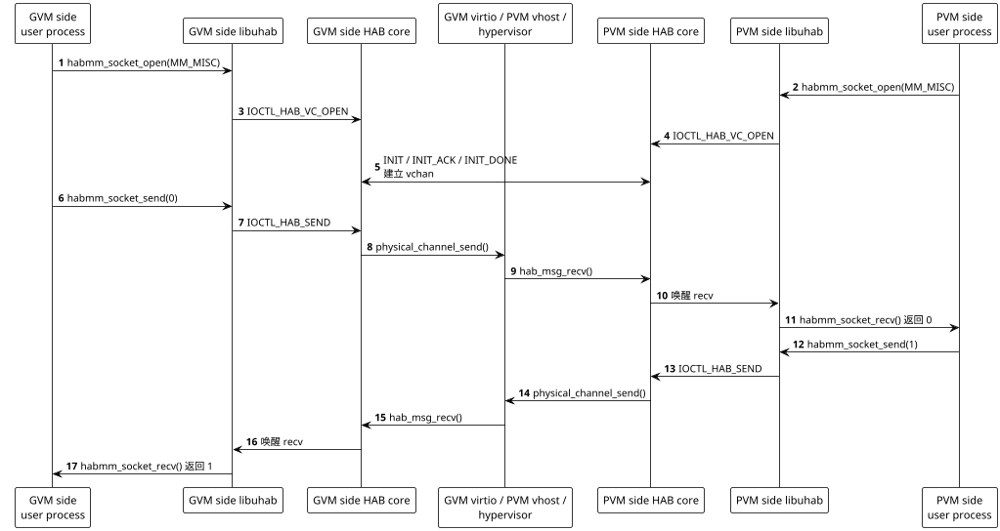
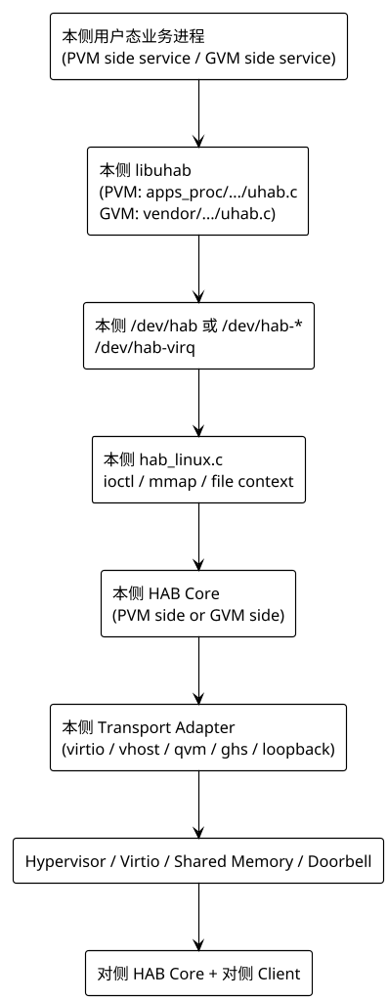
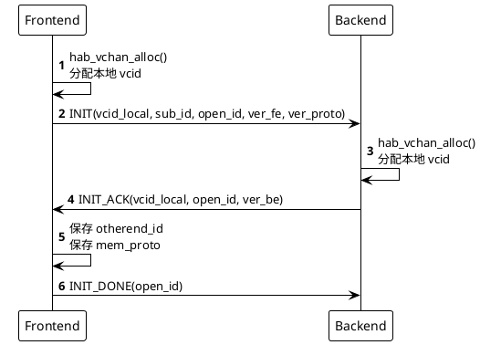
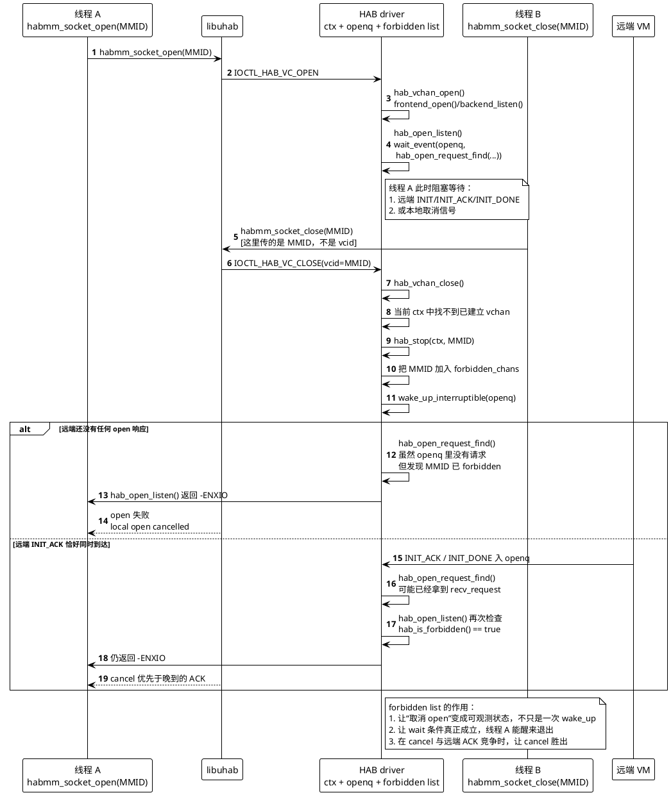

+++
date = '2026-04-05T16:30:00+08:00'
draft = false
title = 'HAB 通信机制与原理'
tags = ["Android", "Linux", "Virtualization", "Gunyah", "Qualcomm", "HAB", "IPC"]
+++

## 1. 概述

在 Qualcomm 虚拟化平台里，**HAB (Hypervisor Abstraction)** 可以理解为一套面向跨 VM 通信的通用框架。它不是单纯的“发消息接口”，而是同时提供了三类能力：

1. **面向请求/响应的小消息通道**，接口形式接近 socket。
2. **面向大块数据的共享内存机制**，通过 `export/import` 完成零拷贝或近零拷贝数据面。
3. **面向低时延事件的虚拟中断/doorbell 机制**，即 `VIRQ`。

对上层客户端来说，HAB 的 API 主要体现为：

- `habmm_socket_open/close`
- `habmm_socket_send/recv`
- `habmm_export/import`
- `habmm_virq_register`
- `habmm_send_virq`
- `habmm_virq_unregister`

对底层传输来说，HAB 并不强绑定某一种 hypervisor transport。当前 SA8797 这套系统的运行形态是 `GVM side (Android Guest)` 对接 `PVM side (Linux Host)`，常见 transport 是 **virtio + vhost**；但从 HAB 核心代码结构看，它本身是把“协议层”和“传输层”拆开的。

如果只保留一句最短定义，那么可以把 HAB 理解成：

**让 `PVM side` 和 `GVM side` 像使用一条“跨 VM socket”那样通信；如果消息不够，还可以继续用同一套框架共享大块 buffer，或者触发 doorbell/virq。**

在本文里，`GVM side` 专指 Android Guest 代码基线 `/home/ethen/workspace/voyah/projects/8397/code/vendor`，`PVM side` 专指 Linux Host 代码基线 `/home/ethen/workspace/voyah/projects/8397/code/linux/apps/apps_proc`。两侧都各自带有 HAB 用户态库和 HAB 内核驱动，所以后文凡是引用具体实现，都会显式标出来自哪一侧。

本文基于当前机器可见源码整理，重点解释 HAB 的**分层、对象模型、建链机制、消息机制、共享内存机制以及 VIRQ 原理**。显示链路只是 HAB 的一个具体业务实例，不是本文主体。

### 1.1 先看一个最小例子

如果一上来就看 display、audio、camera 这些真实业务，读者很容易把 HAB 和上层业务协议混在一起。实际上，HAB 最基础的用法非常简单，可以先把它看成：

- `GVM side` 和 `PVM side` 各有一个进程
- 两边都对同一个 `MMID` 调用 `habmm_socket_open()`
- 一边 `send()`，另一边 `recv()`
- 对端处理完后再 `send()` 回来

下面这个例子基本就是 `mm-hab/testapp/habtest.c` 里 `do_ping()` / `do_pong()` 的最小化版本，只是把日志和循环去掉了。

### 1.2 最小通信例子: GVM side 发 0, PVM side 回 1

先假设：

- `GVM side` 上有一个用户态进程 `guest_ping`
- `PVM side` 上有一个用户态进程 `host_pong`
- 两边约定都使用 `MM_MISC`
- 这里只演示 **小消息收发**，不涉及 `export/import` 和 `virq`

GVM side 用户态代码可以近似理解为：

```c
int32_t h;
int32_t tx = 0;
int32_t rx = -1;
uint32_t size;

habmm_socket_open(&h, MM_MISC, (uint32_t)-1, 0);

habmm_socket_send(h, &tx, sizeof(tx), 0);

size = sizeof(rx);
habmm_socket_recv(h, &rx, &size, (uint32_t)-1, 0);
/* 期望收到 1 */
```

PVM side 用户态代码可以近似理解为：

```c
int32_t h;
int32_t rx = -1;
int32_t tx;
uint32_t size;

habmm_socket_open(&h, MM_MISC, (uint32_t)-1, 0);

size = sizeof(rx);
habmm_socket_recv(h, &rx, &size, (uint32_t)-1, 0);
/* 收到 GVM side 发来的 0 */

tx = rx + 1;
habmm_socket_send(h, &tx, sizeof(tx), 0);
/* 回给 GVM side 1 */
```

这件事看起来很像本地 socket，区别只在于这条“socket”跨过了 hypervisor 和 VM 边界。

### 1.3 这个例子在 HAB 内部到底发生了什么

上面这 4 个 API 背后，实际发生的是下面这条链路：



把这张图压缩成一句话，就是：

**HAB 帮两边建立一条按 `MMID` 路由的虚拟通道，然后把 `send/recv` 这类本来只能在单机里用的语义，扩展成了跨 VM 的语义。**

### 1.4 从这个最小例子反推，HAB 到底是做什么的

如果只看这个 `GVM side 发 0，PVM side 回 1` 的例子，那么 HAB 做的事情其实非常明确：

1. **建链**
   `GVM side` 和 `PVM side` 不是直接拿到一个文件描述符就能通信，HAB 先在两边把同一个 `MMID` 配对成一条 `vchan`。
2. **送消息**
   `habmm_socket_send()` 发出的 4 字节整数，会被 HAB 封装成带 header 的报文，穿过 virtio/vhost/hypervisor，送到对端。
3. **收消息**
   对端 `habmm_socket_recv()` 不是在读本地队列，而是在等对端 VM 真正发来的消息。
4. **隐藏底层 transport**
   对上层进程来说，它只看到 `open/send/recv/close`；看不到下面到底是 virtqueue、vhost worker、shared memory 还是别的 transport。

所以，最简单地说：

- **只用 `socket_open + send/recv` 时，HAB 就是“跨 VM socket”**
- **再加上 `export/import` 时，HAB 就是“跨 VM socket + 共享内存”**
- **再加上 `virq` 时，HAB 就是“跨 VM socket + 共享内存 + doorbell”**

### 1.5 为什么这个例子比 display 更能解释 HAB

display 链路里你会看到：

- `MM_DISP_1` / `MM_DISP_3`
- `virtio-gpu` 命令
- `OpenWFD`
- `RESOURCE_ATTACH_BACKING_EXT`
- `ENABLE_VIRQ`

这些都是真实业务，但它们会让读者误以为 HAB 是“显示协议的一部分”。

实际上，display 只是把上面的最小例子升级成了更复杂的版本：

- 把 `MM_MISC` 换成 `MM_DISP_*`
- 把 4 字节整数换成 display 命令结构体
- 把纯消息收发升级成“消息 + 共享内存 + VIRQ”

也就是说，**先理解 `MM_MISC` 的 ping/pong，再去看 display，就会清楚很多: display 不是 HAB，本质上只是“跑在 HAB 之上的一种业务协议”。**

## 2. 源码基线

这篇文档涉及两套彼此独立的 HAB 代码基线：

- `GVM side`：Android Guest 代码树 `/home/ethen/workspace/voyah/projects/8397/code/vendor`
- `PVM side`：Linux Host 代码树 `/home/ethen/workspace/voyah/projects/8397/code/linux/apps/apps_proc`

后文如果只谈 `MMID / pchan / vchan / session_id / export_id` 这些概念，表示它们是两侧 HAB 共同使用的抽象；一旦落到具体文件路径，就会显式标注 `PVM side` 或 `GVM side`。

### 2.1 GVM side 代码基线

| 组件 | 路径 |
|------|------|
| 用户态库 | `vendor/vendor/qcom/proprietary/mm-hab/uhab/uhab.c` |
| 用户态公共头 | `vendor/vendor/qcom/proprietary/mm-hab/uhab/habmm.h` |
| 内核导出头 | `vendor/kernel_platform/soc-repo/include/linux/habmm.h` |
| ioctl UAPI 头 | `vendor/kernel_platform/soc-repo/include/uapi/linux/hab_ioctl.h` |
| HAB 核心头文件 | `vendor/kernel_platform/soc-repo/drivers/soc/qcom/hab/hab.h` |
| 建链与收发核心 | `vendor/kernel_platform/soc-repo/drivers/soc/qcom/hab/hab.c` |
| open 握手队列 | `vendor/kernel_platform/soc-repo/drivers/soc/qcom/hab/hab_open.c` |
| 消息接收分发 | `vendor/kernel_platform/soc-repo/drivers/soc/qcom/hab/hab_msg.c` |
| vchan 管理 | `vendor/kernel_platform/soc-repo/drivers/soc/qcom/hab/hab_vchan.c` |
| 共享内存核心 | `vendor/kernel_platform/soc-repo/drivers/soc/qcom/hab/hab_mimex.c` |
| Linux 内存映射实现 | `vendor/kernel_platform/soc-repo/drivers/soc/qcom/hab/hab_mem_linux.c` |
| Linux 字符设备与 ioctl | `vendor/kernel_platform/soc-repo/drivers/soc/qcom/hab/hab_linux.c` |
| 内核态导出 API | `vendor/kernel_platform/soc-repo/drivers/soc/qcom/hab/khab.c` |
| transport 适配源码 | `vendor/kernel_platform/soc-repo/drivers/soc/qcom/hab/hab_virtio.c` / `vendor/kernel_platform/soc-repo/drivers/soc/qcom/hab/hab_vhost.c` |

### 2.2 PVM side 代码基线

| 组件 | 路径 |
|------|------|
| 用户态库 | `linux/apps/apps_proc/vendor/qcom/proprietary/mm-hab/uhab/uhab.c` |
| 用户态公共头 | `linux/apps/apps_proc/vendor/qcom/proprietary/mm-hab/uhab/habmm.h` |
| 内核导出头 | `linux/apps/apps_proc/vendor/qcom/opensource/mmhab-drv/include/linux/habmm.h` |
| ioctl UAPI 头 | `linux/apps/apps_proc/vendor/qcom/opensource/mmhab-drv/include/uapi/linux/hab_ioctl.h` |
| HAB 核心头文件 | `linux/apps/apps_proc/vendor/qcom/opensource/mmhab-drv/hab.h` |
| 建链与收发核心 | `linux/apps/apps_proc/vendor/qcom/opensource/mmhab-drv/hab.c` |
| open 握手队列 | `linux/apps/apps_proc/vendor/qcom/opensource/mmhab-drv/hab_open.c` |
| 消息接收分发 | `linux/apps/apps_proc/vendor/qcom/opensource/mmhab-drv/hab_msg.c` |
| vchan 管理 | `linux/apps/apps_proc/vendor/qcom/opensource/mmhab-drv/hab_vchan.c` |
| 共享内存核心 | `linux/apps/apps_proc/vendor/qcom/opensource/mmhab-drv/hab_mimex.c` |
| Linux 内存映射实现 | `linux/apps/apps_proc/vendor/qcom/opensource/mmhab-drv/os/linux/hab_mem_linux.c` |
| Linux 字符设备与 ioctl | `linux/apps/apps_proc/vendor/qcom/opensource/mmhab-drv/hab_linux.c` |
| 内核态导出 API | `linux/apps/apps_proc/vendor/qcom/opensource/mmhab-drv/os/linux/khab.c` |
| transport 适配源码 | `linux/apps/apps_proc/vendor/qcom/opensource/mmhab-drv/hypervisor/virtio/hab_virtio.c` / `linux/apps/apps_proc/vendor/qcom/opensource/mmhab-drv/hypervisor/virtio/hab_vhost.c` |

这里表里的 `transport 适配源码` 只是说明对应代码树里存在这些实现，不直接等价于运行时角色。运行时到底由谁承担 `virtio`、由谁承担 `vhost`，要结合 `PVM side` / `GVM side` 的部署关系来看，第 12 节会单独展开。

## 3. HAB 到底解决什么问题

如果只有小消息，virtio-serial、rpmsg 之类机制也能做；如果只有大块 buffer，共享内存 grant/import 也能单独做。HAB 的价值在于把这几件事揉成一套统一抽象：

- **统一连接模型**：上层以 `socket_open -> send/recv -> close` 的方式使用跨 VM 通道。
- **统一对象模型**：消息通道、共享内存、virq 都挂在同一套 `context / pchan / vchan` 体系上。
- **统一多媒体域路由**：通过 `MMID` 把 display、audio、camera、misc、gfx 等业务隔离开。
- **统一传输后端**：核心协议层不直接依赖 virtio，可以替换成其他 hypervisor transport。

所以，HAB 更准确的定位不是“某个驱动”，而是**跨 VM IPC + shared memory + event 的统一框架**。

## 4. HAB 的核心抽象

### 4.1 MMID

`MMID` 是 HAB 的第一层路由键。它既表达“哪个业务域”，也允许同一业务域下再细分子通道。

- `MMID` 的 **major** 部分决定落到哪个 `hab_device`
- `MMID` 的 **minor** 部分在 open 握手里作为 `sub_id` 参与匹配

在两侧代码基线的 `hab.h` 里都可以看到：

- `HAB_MMID_GET_MAJOR(mmid)`
- `HAB_MMID_GET_MINOR(mmid)`

这意味着 HAB 不是“一个全局大总线”，而是先按业务域切分，再在域内做逻辑建链。

### 4.2 hab_device

`struct hab_device` 表示“一类 MMID 对应的一组通道集合”。它保存：

- `id`：该业务域对应的 major MMID
- `pchannels`：该业务域下所有 physical channel
- `openq_list`：open 握手消息队列

可以把它理解成**某个业务域的通道注册中心**。

### 4.3 physical_channel

`struct physical_channel` 是 HAB 的**实际传输载体抽象**。它代表一条能把数据送到对端 VM 的底层链路，内部维护：

- `vchan_idr`：这条 pchan 上的所有虚拟通道
- `expid_idr`：这条 pchan 上导出的共享内存对象
- `vmid_local / vmid_remote`
- `mem_proto`
- 传输层私有对象 `hyp_data`

它是 HAB 里最容易被误解的对象。**pchan 不是上层业务 socket，而是底层链路**。

### 4.4 virtual_channel

`struct virtual_channel` 才是上层最接近 socket 的对象。每次 `habmm_socket_open()` 成功，都会得到一个新的 `vchan`。

它至少包含这些关键字段：

- `id`：本地 VCID
- `otherend_id`：对端 VCID
- `session_id`：本次 open 的 session/open id
- `rx_list`：接收队列
- `rx_queue`：等待队列
- `otherend_closed` / `closed`

这里要强调两点：

1. **本地 VCID 和对端 VCID 是分别分配的，不是 `PVM side` 分配一个全局 VCID 给两端共用。**
2. **真正定位一条已建立连接时，HAB 用的是 `vcid + session_id` 组合，而不是只看 VCID。**

第二点非常关键，因为 VCID 的低位编号是可以重用的，`session_id` 用来避免旧连接和新连接串线。

### 4.5 uhab_context

`struct uhab_context` 是**一个 HAB 客户端上下文**。

- 对用户态来说，它通常对应一次 `/dev/hab*` 打开的 file context
- 对内核态来说，它对应一个内核客户端上下文

它维护：

- 当前 context 打开的所有 vchan
- 本地 export 仓库 `exp_whse`
- 本地 import 仓库 `imp_whse`
- open pending 队列

所以 HAB 的资源不是全局无主的，而是**挂在 context 上按进程/客户端管理**。

### 4.6 export_id 与 VIRQ

除了消息通道，HAB 还有两个重要对象：

- `export_id`
  表示一块已导出共享内存的引用 ID。它本身不是 buffer，只是让对端能“按 ID 去取那块 buffer”的票据。
- `VIRQ`
  表示基于 doorbell 的虚拟中断资源，适合低时延事件通知，不用于承载 bulk payload。

## 5. 从用户态到 Hypervisor 的分层

无论从 `PVM side` 还是 `GVM side` 的单侧视角去看，HAB 都大致分成下面几层：



这张图是单侧视角，把“本侧”替换成 `GVM side` 或 `PVM side` 都成立，只是代码路径不同。图里最重要的是两层边界：

1. **用户态库和内核 HAB** 之间通过 `ioctl`/`mmap` 通信。
2. **HAB Core 和底层 transport** 之间通过 `hab_driver_ops` 解耦。

这就是为什么同一套 `habmm_socket_*` 语义，可以跑在不同 transport 之上。

## 6. 用户态接口与设备节点

### 6.1 libuhab 的角色

无论 `PVM side` 还是 `GVM side`，用户态通常都不会直接手写 `ioctl`，而是通过各自代码基线里的 `libuhab` 调用：

- `PVM side`：`linux/apps/apps_proc/vendor/qcom/proprietary/mm-hab/uhab/uhab.c`
- `GVM side`：`vendor/vendor/qcom/proprietary/mm-hab/uhab/uhab.c`

它们对上层暴露的 API 主要是：

- `habmm_socket_open`
- `habmm_socket_send`
- `habmm_socket_recv`
- `habmm_export`
- `habmm_import`

两边的 `uhab.c` 最终都会把参数打包成 `struct hab_open / hab_send / hab_recv / hab_export / hab_import`，然后走：

- `IOCTL_HAB_VC_OPEN`
- `IOCTL_HAB_SEND`
- `IOCTL_HAB_RECV`
- `IOCTL_HAB_VC_EXPORT`
- `IOCTL_HAB_VC_IMPORT`

### 6.2 /dev/hab 与 /dev/hab-*

`/dev/hab` 这一层用户态打开逻辑，并不只存在于 `PVM side`。`PVM side` 的 `linux/apps/apps_proc/.../uhab.c` 和 `GVM side` 的 `vendor/vendor/.../uhab.c` 都有同一套 open-device-node 状态机：

- 优先尝试 `/dev/hab-<mmid-group>`
- 如果因为 `EACCES` 或 `ENOENT` 失败，则回退到 `/dev/hab`

这样做的目的很直接：

- 有条件时，按 MMID group 把权限和访问面收窄
- 没有 split node 时，仍可用 super node `/dev/hab`

此外，两边的 `uhab.c` 都还会额外打开一个：

- `/dev/hab-virq`

用于 VIRQ 相关能力。

### 6.3 内核态客户端

两套代码基线里都提供了 `khab.c` 形式的内核态入口：

- `GVM side`：`vendor/kernel_platform/soc-repo/drivers/soc/qcom/hab/khab.c`
- `PVM side`：`linux/apps/apps_proc/vendor/qcom/opensource/mmhab-drv/os/linux/khab.c`

内核态客户端不经过 `ioctl`，而是直接调用这些入口导出的符号：

- `habmm_socket_open`
- `habmm_socket_send`
- `habmm_socket_recv`
- `habmm_export`
- `habmm_import`
- `habmm_virq_register`

这只是入口不同，最终仍落到同一套 HAB Core。

## 7. VCID、session_id 与路由原理

### 7.1 VCID 的本质

两侧实现的 `hab_vchan_alloc()` 里，都能看到同一类 VCID 构造方式：

```c
vchan->id = ((id << HAB_VCID_ID_SHIFT) & HAB_VCID_ID_MASK) |
        ((pchan->habdev->id << HAB_VCID_MMID_SHIFT) & HAB_VCID_MMID_MASK) |
        ((pchan->dom_id << HAB_VCID_DOMID_SHIFT) & HAB_VCID_DOMID_MASK);
```

也就是说，VCID 至少编码了：

- 低 12 bit：本地 vchan 序号
- 高位：major MMID
- 中间一段：来自 pchan 的 domain 信息

但这里不要误读成“VCID 是一个两端统一的全局连接 ID”。它只是**本端编码出来的本地句柄**。

### 7.2 为什么还要 session_id

HAB 在接收消息时，不只看 `VCID`，还要看 `session_id`：

- `hab_vchan_get()` 用 `header.id + header.session_id` 匹配本地 vchan
- open 握手阶段的 `open_id` 最终会写入 `vchan->session_id`

这意味着 HAB 从设计上就考虑了：

- VCID 低位编号可重用
- 同一个 pchan 上旧连接和新连接不能串消息

因此，**“VCID 定位 vchan，session_id 防止串线”** 是理解 HAB 路由机制的关键。

## 8. 建链原理

### 8.1 FE / BE 角色

两侧实现的 `hab_vchan_open()` 都会先找到对应 MMID 的 `hab_device` 和 `pchan`，然后根据 `pchan->is_be` 决定走哪条路径：

- frontend: `frontend_open()`
- backend: `backend_listen()`

这和很多人直觉不同。**HAB 的 FE/BE 判定不是靠谁先调用 open，而是看本端这条 pchan 在配置里是什么角色。**

### 8.2 open flag 模型

公共头 `habmm.h` 里定义了三种 open 语义：

| flag | 含义 |
|------|------|
| `HABMM_SOCKET_OPEN_FLAGS_SINGLE_BE_SINGLE_FE` | 默认的一对一点对点模型 |
| `HABMM_SOCKET_OPEN_FLAGS_SINGLE_BE_SINGLE_DOMU` | 一个 BE 对应一个 DomU |
| `HABMM_SOCKET_OPEN_FLAGS_SINGLE_BE_MULTI_DOMUS` | 一个 BE 对多个 DomU |

后两种模型会用到 `sendto/recvfrom`，本质上是让 backend 能区分消息来自哪个 remote FE。

### 8.3 open 三次握手

HAB 的 open 握手非常明确：



这里有四个关键点：

1. **两端各自分配自己的本地 vcid。**
2. `open_id` 是本次连接的会话标识，后续成为 `session_id`。
3. `sub_id` 来自 `MMID` 的 minor，用于在同一 major 域内继续分流。
4. 握手阶段顺便交换版本信息和 `ver_proto`，从而决定使用哪一代共享内存协议。

### 8.4 `wait_event()` / `wake_up()` 在 open 里的作用

理解 HAB 的 open 阻塞流程，必须先理解 Linux wait queue 这套机制。

在不同代码基线的 HAB 实现里，`open` 等待的基本思路是一致的：

- 线程先进入 `hab_open_listen()`
- 如果本地还没等到匹配的 `INIT / INIT_ACK / INIT_DONE`
- 就在 `hab_device.openq` 这条 wait queue 上睡眠

它的语义可以近似理解为：

```c
wait_event(openq, 条件成立);
```

这里最容易误解的一点是：

- `wait_event()` 不是“睡到有人给我发结果”
- `wake_up()` 也不是“把结果直接塞给等待线程”

更准确地说：

1. `wait_event()` 会反复检查条件。
2. 条件不成立时，当前线程睡眠。
3. 其他路径调用 `wake_up(openq)` 后，睡眠线程会被唤醒。
4. 线程醒来后会**重新检查条件**。
5. 只有条件真的成立，`wait_event()` 才返回。

所以，`wake_up()` 本身只是一个“重新检查条件”的通知，不携带“为什么醒”的语义。

这点对理解后面的 `forbidden list` 很关键：如果只有 `wake_up()`，却没有一个持久状态告诉等待线程“这次是本地取消，不是远端真的连上了”，线程很可能醒来后又睡回去，或者误把晚到的远端 ACK 当成成功建链。

### 8.5 为什么 PVM side 实现里存在 forbidden list

这一节专门讨论 `PVM side` Linux Host 代码基线里的 `linux/apps/apps_proc/vendor/qcom/opensource/mmhab-drv/` 实现。这里不把它和 `GVM side` 的 `vendor/kernel_platform/soc-repo/drivers/soc/qcom/hab/` 做“新旧实现”的比较，因为它们本来就是两套独立代码。保留这一节的原因很简单：在 `PVM side` 这套实现里，`forbidden list` 正是本地取消 pending open 的关键状态。

`PVM side` 这套用户态库里，`habmm_socket_close()` 有一个特殊约定：

- 如果传入的是正常 `vcid`，那就是普通 close
- 如果传入的其实是 `MMID`，那它的含义不是关掉已建立的 vchan，而是：
  **取消当前进程里这个 MMID 上所有后续 pending open**

这时候驱动需要解决一个很具体的问题：

- 线程 A 正卡在 `habmm_socket_open(MMID)` 里等待远端握手
- 线程 B 在同一进程里调用 `habmm_socket_close(MMID)`
- 驱动必须让线程 A 立刻、确定地退出等待
- 同时还不能把“远端晚到的 ACK”误当成建链成功

这套 PVM 实现的答案就是：

- 在 `ctx->forbidden_chans` 里记一条 `MMID`
- 然后 `wake_up_interruptible(&dev->openq)`

也就是说，**forbidden list 不是权限黑名单，而是 open-cancel 的持久状态标记**。

### 8.6 时序图: 线程 A 阻塞 open，线程 B 调 `close(MMID)`



### 8.7 open 队列是怎么匹配的

收到 `INIT / INIT_ACK / INIT_DONE / INIT_CANCEL` 后，`hab_msg_recv()` 不会把它们当普通业务消息，而是塞进 `hab_device.openq_list`。

`hab_open_listen()` 再按以下条件匹配：

- payload type
- `sub_id`
- `open_id`
- `pchan`

因此，HAB 的 open 握手不是“谁先来就接谁”，而是**带条件匹配的建链状态机**。

### 8.8 失败与取消

如果 FE 在等待 `INIT_ACK` 或 `INIT_DONE` 时失败，代码会主动发：

- `INIT_CANCEL`

BE 收到后也会回收本地状态。这是 HAB 避免半开连接泄漏的关键机制。

## 9. 普通消息收发原理

### 9.1 发送路径

以常规 `habmm_socket_send()` 为例，路径可以概括为：

```text
user client
  -> libuhab / ioctl
  -> hab_vchan_send()
  -> 组装 hab_header(type/msg, size, otherend_id, session_id)
  -> physical_channel_send()
  -> transport
  -> remote hab_msg_recv()
```

`hab_vchan_send()` 做的事主要有三件：

1. 检查 vchan 是否存在、是否已被对端关闭。
2. 根据 flags 决定 payload type。
3. 填好 header 后，把消息交给 `physical_channel_send()`。

其中最常见的 payload type 是：

- `HAB_PAYLOAD_TYPE_MSG`

但如果上层打开了 profiling 或 schedule test，对应的 payload type 会变成 `PROFILE` 或 `SCHE_*`。

### 9.2 接收路径

接收路径分两段：

1. **transport 把消息送进 HAB Core**
   例如 virtio/vhost 路径里，最终都会调用 `hab_msg_recv()`
2. **HAB Core 把消息挂到目标 vchan 的 rx 队列**
   然后 `hab_vchan_recv()` / `hab_msg_dequeue()` 再把它交给上层

普通消息最终进入：

- `vchan->rx_list`

然后通过：

- `wake_up(&vchan->rx_queue)`

唤醒等待中的接收者。

### 9.3 recv 的阻塞语义

`hab_msg_dequeue()` 对 `recv` 语义做了统一处理：

| flag | 语义 |
|------|------|
| `HABMM_SOCKET_RECV_FLAGS_NON_BLOCKING` | 立即返回，没有消息则 `-EAGAIN` |
| `HABMM_SOCKET_RECV_FLAGS_TIMEOUT` | 只有在阻塞模式下才让 timeout 生效 |
| `HABMM_SOCKET_RECV_FLAGS_UNINTERRUPTIBLE` | 仅保留给内核客户端 |

如果没有 `TIMEOUT` flag，阻塞 `recv` 会按“无限等待”处理。

### 9.4 HAB header 的作用

每个 HAB 报文都有一个 `hab_header`，至少包含：

- `id_type`
- `payload_size`
- `session_id`
- `signature`
- `sequence`

其中：

- `id_type` 里编码了 payload type 和目标 VCID
- `session_id` 用于会话匹配
- `sequence` 用于链路级调试和顺序校验

所以 HAB 不是“把 payload 裸发过去”，而是有一层明确的协议头。

### 9.5 payload type 分发

`hab_msg_recv()` 会根据 `payload_type` 做不同分发：

| payload type | 作用 |
|--------------|------|
| `MSG` | 普通业务消息 |
| `INIT / INIT_ACK / INIT_DONE / INIT_CANCEL` | open 握手 |
| `EXPORT / EXPORT_ACK` | 第一代共享内存握手 |
| `IMPORT / IMPORT_ACK / IMPORT_ACK_FAIL / UNIMPORT` | 增强型共享内存握手 |
| `CLOSE` | 对端关闭通知 |
| `PROFILE / SCHE_*` | profiling / 调度测量 |

这也是为什么 HAB 不只是“消息队列”，而是带控制协议的通道框架。

## 10. 共享内存机制原理

### 10.1 为什么需要 export/import

跨 VM 大 buffer 如果完全靠 `send/recv` 复制，成本非常高。HAB 的设计是：

- **小控制消息走 vchan**
- **大数据走共享内存**

也就是说，消息面负责“告诉对端该拿哪块 buffer”，数据面负责“真正共享那块 buffer”。

### 10.2 export 并不等于把 buffer 发过去

`habmm_export()` 的本质不是把内存内容直接发到对端，而是：

1. 在本端 pin/grant 这块内存
2. 为它分配一个 `export_id`
3. 把这块内存的页描述信息保存在 HAB 内部

随后，上层协议需要把 `export_id` 传给对端。对端拿到 `export_id` 后，再调用 `habmm_import()`。

所以一定要分清：

- `export_id` 是**票据**
- 共享内存本体仍在 exporter 侧管理

### 10.3 export 路径

`hab_mem_export()` 大致做两件事：

1. 调用 `habmem_hyp_grant()` / `habmem_hyp_grant_user()`，把用户或内核 buffer 转成 HAB 可共享对象
2. 调用 `habmem_export_vchan()`，把这份 export 描述挂到 vchan/context 上

Linux 实现里还会把页信息压缩成 PFN region 描述，以减少 metadata 大小。

### 10.4 当前代码里的两代内存协议

HAB 在握手里会交换 `ver_proto`。当前工作区可见代码里：

- `HAB_VER_PROT = 1`

其注释写得很明确：

- **enhanced memory sharing protocol with sync import and async unimport**

这意味着 HAB 至少有两代共享内存协议：

#### 旧协议 `mem_proto == 0`

- exporter 在 export 阶段就发送 `EXPORT`
- importer 收到后回 `EXPORT_ACK`
- export descriptor 在 export 时主动下发

#### 新协议 `mem_proto == 1`

- exporter 只在本地完成 export，不主动把描述发出去
- importer 在 `habmm_import()` 时发送 `IMPORT(exp_id, page_cnt)`
- exporter 查本地 `expid_idr`，找到后回 `IMPORT_ACK`
- importer 收到 `IMPORT_ACK` 后再做本地 map
- unimport 采用异步通知

当前工作区可见代码显然更偏向这套新协议。

### 10.5 import 路径

`hab_mem_import()` 在 `mem_proto == 1` 时，流程可以概括为：

```text
importer habmm_import(export_id, size)
  -> 发送 IMPORT(exp_id, page_cnt)
  -> 等待 IMPORT_ACK
  -> 从 imp_whse 取到 export_desc
  -> habmem_imp_hyp_map()
  -> 得到 kva / dma_buf / fd 形式的本地映射
```

`IMPORT_ACK_FAIL` 则表示：

- exporter 侧不存在对应 `export_id`
- 或 page count / vcid 不匹配
- 或 importer/import ack 处理失败

### 10.6 unimport 路径

`hab_mem_unimport()` 会做两件事：

1. 释放 importer 本地映射
2. 发送 `UNIMPORT` 给 exporter，告诉对端“这块共享内存我已经不用了”

对于 `mem_proto == 1`，这是共享内存生命周期闭环的一部分。

### 10.7 Linux 下的 dma-buf 语义

在 Linux 实现里，HAB 的 import/export 并不局限于裸虚拟地址：

- 可以围绕 `dma-buf fd`
- 可以围绕 `dma-buf` 内核对象
- 可以围绕用户态地址

这也是为什么显示、视频、音频这类大量依赖 `dma-buf` 的业务，能够自然地建立在 HAB 上。

## 11. VIRQ / doorbell 原理

HAB 还有一条独立于普通消息收发的低时延事件路径：

- `habmm_virq_register`
- `habmm_send_virq`
- `habmm_virq_unregister`

它的目标不是替代消息面，而是补上一条**更适合事件通知的快速通道**。

### 11.1 VIRQ 的典型用途

它适合做：

- VSync/commit complete
- doorbell 唤醒
- 低时延状态变更通知

不适合做：

- bulk payload 传输
- 大对象同步

### 11.2 VIRQ 和消息面的关系

VIRQ 与消息面通常是配合关系：

- **消息面**：传递命令和结构化响应
- **共享内存**：承载大 buffer
- **VIRQ**：告诉对端“快来看共享状态”或“有事件来了”

这也是为什么一些显示链路里，会同时看到：

- `habmm_export(...)`
- `VIRTIO_GPU_CMD_ENABLE_VIRQ`
- `habmm_virq_register(...)`

因为 doorbell 本身只负责唤醒，不负责携带完整事件 payload。

## 12. HAB 与 virtio/vhost 的关系

### 12.1 HAB 不是 virtio 的别名

在当前项目的运行形态里，`GVM side` 是 Android guest，`PVM side` 是 Linux host。运行时最常见的一条 transport 链路是：

- `GVM side`：`hab_virtio.c`
- `PVM side`：`hab_vhost.c`

这里说的是**运行时分工**，不是说某个代码库里只存在这一种 transport 源文件。两套代码基线里都各自带有自己的 transport adapter 源码。

但这不代表 HAB 等于 virtio。

更准确地说：

- **HAB 是协议层和对象模型**
- **virtio/vhost 是当前平台上一种 transport 实现**

### 12.2 transport 抽象是怎么做的

`hab_driver_ops` 里把 transport 依赖抽象成了一组函数指针：

- `physical_channel_send`
- `physical_channel_read`
- `physical_channel_rx_dispatch`
- `habhyp_commdev_alloc/dealloc`
- `habhyp_virq_*`

不同 transport 只要实现这组回调，HAB Core 就能复用。

当前工作区里至少可以看到这些实现：

- `GVM side` 代码基线：`hab_virtio.c`、`hab_vhost.c`、`qvm_comm.c`、`ghs_comm.c`
- `PVM side` 代码基线：`hypervisor/virtio/hab_virtio.c`、`hypervisor/virtio/hab_vhost.c`
- 另外还有 `hab_comm.c` 里的 loopback stub

这已经足以说明 HAB Core 并不绑死在某一个 hypervisor 通道上。

### 12.3 当前 virtio/vhost 路径的大致形态

在当前平台上，典型链路是：

```text
GVM side HAB Core
  -> GVM side hab_virtio.c
  -> virtqueue
  -> PVM side hab_vhost.c
  -> PVM side hab_msg_recv()
  -> PVM side HAB Core
```

反向返回路径则是从 `PVM side` 走回 `GVM side`。运行时讨论这条链路时，要把“代码树里存在某个源文件”和“当前这一跳由哪一侧承担”区分开。

`PVM side` 的 `hab_vhost.c` 里，每个 pchan 对应一对 virtqueue：

- TX VQ: 从 `GVM side` 收数据
- RX VQ: 向 `GVM side` 发数据

也就是说，virtio/vhost 只是把 HAB 的 pchan 托管到了 vring 上而已。

## 13. 常见误区

### 13.1 误区一：VCID 是 PVM side 分配的全局连接号

不是。HAB open 时：

- FE 分配自己的本地 VCID
- BE 分配自己的本地 VCID
- 双方通过 `INIT/INIT_ACK` 交换

### 13.2 误区二：`export_id` 就是共享内存本体

不是。`export_id` 只是票据。真正的页描述、grant 状态、dma-buf 引用都保存在 HAB 内部数据结构里。

### 13.3 误区三：HAB 只负责发消息

不是。HAB 至少同时覆盖：

- 消息通道
- 共享内存
- doorbell / virq

### 13.4 误区四：virtio/vhost 就是 HAB 本身

不是。virtio/vhost 只是当前平台上的 transport 方案。HAB Core 的 API、open 状态机、消息类型、共享内存协议都是更上层的东西。

## 14. 总结

如果只保留一句话来概括 HAB，那么最准确的说法是：

**HAB 是一套面向跨 VM 场景的统一通信框架，它用 `MMID + pchan + vchan` 组织消息通道，用 `export/import` 组织共享内存，用 `virq` 组织低时延事件，并通过可替换的 transport 适配到底层 hypervisor 通道。**

理解 HAB，最重要的不是记住某个单一 API，而是记住下面这四层关系：

1. **业务先按 MMID 分域**
2. **每个域下先有 pchan，再在 pchan 上建 vchan**
3. **小消息走 send/recv，大数据走 export/import**
4. **事件加速走 virq，而不是把所有事情都塞进消息轮询**

只要这四点不丢，后续再看 display、audio、camera、video 等具体业务链路时，就不会把“业务协议”误当成“底层通信框架”。
