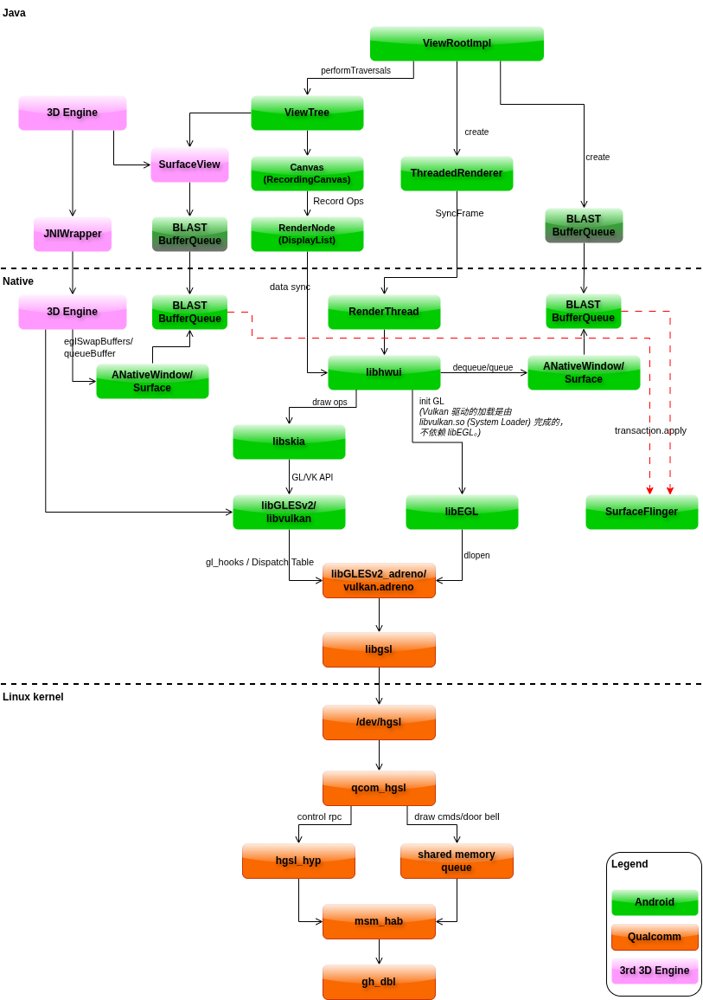

+++
date = '2026-07-15T10:00:00+08:00'
draft = true
title = 'Qualcomm PVM KGSL/RGS 架构、GPU Hang 检测与 BPMD 落盘'
tags = ["Qualcomm", "Adreno", "KGSL", "RGS", "GPU", "Gunyah", "HAB", "Debug"]
+++

## 1. 范围与结论

本文基于 SA8797 Gen5 工程源码、PVM 预编译 Adreno 库、Android SurfaceFlinger/HWC 源码与台架运行态、2026-07-13 Launcher 复现日志、Perfetto/Davey 数据，以及 2026-07-17 的 native OpenGL ES 可控复现实验，说明一帧从 Android 应用渲染到显示 scanout 的完整路径，以及 Gunyah 图形虚拟化中的提交、完成、hang 检测和 state dump 路径。

这里有两个名称容易混淆：

- Android Guest 使用 Qualcomm UMD、Guest `libgsl.so` 和内核 `graphics-hgsl` 驱动（`/dev/hgsl`），不是直接访问物理 GPU。
- PVM 中 `kgsl@N.service` 启动的 `/usr/bin/kgsl -p N` 是用户态进程；它加载 `libGSLKernel.so`，其中实现 RGS（Remote Graphics Service）、GMU/HFI、故障恢复和 snapshot。它不是 Android 非虚拟化场景中的 `msm_kgsl.ko`。

本次核验后的核心结论是：

1. HAB 是 Guest 与 PVM 之间的控制、资源和回退 RPC 路径；context 完成 DBCQ 注册后，正常 IB 提交可以由 Guest HGSL 直接写 DBCQ 并通知 GMU，**不会每帧都经过 `gsl_hab_server`、PVM `libgsl` 和 RGS 用户态**。
2. DBCQ 与 IPCQ 不是同一条队列。DBCQ 是 Guest HGSL 到 GMU 的 per-context 提交快路径；当前 Guest IPCQ 协议证据只显示 `GSL_IPCQ_SNAPSHOT_DUMP`，不能把 IPCQ 写成普通 IB 的高频提交队列。
3. `GMU_GPU_SW_HANG(603)` 的协议语义是 Long IB timeout。本次实例打印的有效 long 参数是 512ms，但 603 本身不编码 512ms，也不能证明 shader 连续执行了恰好 512ms。
4. 启动日志中的 short 32ms 属于当前 RGS 二进制的 HB/long-job 检测配置。它不是 `rgs_device_set_preemption_check_short_timeout()`；后者是另一套 context-switch/preemption 检查，对应 602。
5. 本次 `kgsl-1571.log` 只有两次真实 HFI fault，均为 `error: 603`。日志中的 `rgs_hwl_determine_feature_support()[ 609]` 里 `[609]` 是源码行号，不是 error 609。
6. 两次 fault 都归属 Launcher 的 PVM GPU context 17，但这只证明 Launcher 的提交未在 long-job 窗口内 retire。现有日志不能单独证明根因是动态背景模糊、过度绘制、非法 Vulkan 指令或硬件损坏。
7. 第一次 fault 到 BPMD 创建约 2.036s、到 snapshot 完成约 2.054s；第二次分别约 2.338s 和 2.357s。这些是 fault 上报后的 dump/recovery 时间，不是 hang 判定阈值。
8. 2026-07-17 的对照实验中，全屏 fragment 模式虽然单次 `glFinish()` 墙钟约 0.9s，却连续运行 60s 而没有观察到 603；改成单个 64-invocation workgroup、每个 invocation 内有循环依赖的 `serial-compute` 后，可重复触发 `error:603`。这证明“API 调用耗时长或 GPU 总负载高”与“某个 context 提交长期不 retire”不是同一件事。
9. `serial-compute` 在每个 lane 3,098,383 次循环时测得 579.232ms，增加约 2% 到 3,160,351 次时测得 908.800ms 并触发 603。按前一样本线性外推，正常工作约 590.817ms，908.800ms 中多出的约 317.983ms 与 PVM 打印的 324～325ms SW recovery 接近。因此 908.800ms 不能解释为 shader 连续执行了 908.800ms。
10. 两次可控复现分别命中不同的 context/PID，但都报告 `fault ts: 0x4920`、`error:603` 并在约 325ms 内 SW recovery；同期 GPU 温度约 49～52°C。实验闭环证明了 long-job 检测与恢复路径可以由特定命令形态稳定触发，但不证明 Launcher 与压测程序具有相同的 shader 级根因。
11. Android 应用的 GPU 通常只把本窗口的一帧写入 `GraphicBuffer`，并不直接“把像素发送到屏幕”。buffer 及完成 fence 经 BLAST 交给 SurfaceFlinger；HWC 决定由显示硬件直接合成，还是由 SurfaceFlinger 的 RenderEngine 再使用一次 GPU；最终由 MDP/DPU 在显示时序下读取 buffer 并扫描输出。**GPU 工作完成、SurfaceFlinger latch、HWC present 和像素真正 scanout 是四个不同的完成点。**

## 2. 证据基线

| 组件或数据 | 路径 | 用途 |
|---|---|---|
| Guest HGSL 驱动 | `vendor/vendor/qcom/opensource/graphics-hgsl/hgsl.c` | `/dev/hgsl` ioctl、DBCQ 提交、HAB 回退、timestamp wait |
| Guest HGSL 同步 | `vendor/vendor/qcom/opensource/graphics-hgsl/{hgsl.h,hgsl_sync.c,hgsl_gmugos.c}` | shadow timestamp、retire IRQ、dma-fence、Guest snapshot |
| HAB virtio 映射 | `vendor/kernel_platform/soc-repo/drivers/soc/qcom/hab/hab_virtio.c` | `MM_GFX -> device-id 94` |
| HAB vhost backend | `vendor/kernel_platform/soc-repo/drivers/soc/qcom/hab/hab_vhost.c` | `MM_GFX` 对应 `ogles` vhost 设备 |
| PVM vhost-user GPU 服务 | `linux/apps/apps_proc/vendor/qcom/opensource/vhost-user/vhost-user-gpu.service` | socket、`/dev/vhost-ogles`、queue 数量 |
| PVM KGSL/RGS 服务 | `linux/apps/apps_proc/prebuilt_HY11/sa8797/adreno/usr/lib/systemd/system/kgsl@.service` | `/usr/bin/kgsl -p %i`、依赖和环境 |
| PVM RGS 实现 | `linux/apps/apps_proc/prebuilt_HY11/sa8797/adreno/usr/lib/libGSLKernel.so` | 当前闭源实现的符号、字符串和反汇编 |
| HFI 协议 | `vendor/vendor/qcom/opensource/graphics-kernel/adreno_hfi.h` | ISSUE_CMD、TS_RETIRE、601/602/603/609 定义 |
| 可控复现程序 | `qssi/vendor/voyah/system/polaris/native/tests/gpu_stress/` | fragment 对照、serial-compute、wall/GPU timer、completion marker |
| 2026-07-17 实验记录 | 工具终端输出与 PVM `journalctl`（PID 13279、13924） | timer 有效性、603 owner、未 retire 计数与 324～325ms recovery |
| 应用 buffer 生产端 | `qssi/frameworks/native/libs/gui/{Surface.cpp,BLASTBufferQueue.cpp}` | dequeue/queue、GraphicBuffer、producer fence、BLAST Transaction |
| SurfaceFlinger layer | `qssi/frameworks/native/services/surfaceflinger/Layer.cpp` | buffer/fence 接收、ready 检查和 latch |
| CompositionEngine | `qssi/frameworks/native/services/surfaceflinger/CompositionEngine/src/{Output.cpp,OutputLayer.cpp,Display.cpp}` | CLIENT/DEVICE 合成、RenderEngine、client target、present/release fence |
| HWC 接口实现 | `qssi/frameworks/native/services/surfaceflinger/DisplayHardware/{HWComposer.cpp,HWC2.cpp}` | validate、setClientTarget、presentDisplay、release fence |
| 2026-07-17 显示运行态 | Android `dumpsys SurfaceFlinger`、composer3 service、进程 fd 与 DRM sysfs | QTI composer、`/dev/dri/card0/card1`、MDP/DRM 和 DP 物理显示 |
| 复现 RGS 日志 | `reproduced_again/tmp-kgsl/kgsl-1571.log` | 实际配置、fault context、snapshot 和 recovery |
| 本地时区 syslog | `reproduced_again/20-06和20-08日志/linux_log/syslog/` | 把 RGS 原始 UTC 时间对齐到 CST |
| FenceMonitor | `qssi/frameworks/native/libs/gui/{Surface.cpp,FenceMonitor.cpp}` | GPU completion/HWC release thread、序号和 wait slice 语义 |

开源 `graphics-kernel` 可以解释同代 HFI 协议和处理方式，但 PVM 实际运行的是闭源 `libGSLKernel.so`。除非有 PVM 二进制反汇编或现场日志支持，不能把 Android `msm_kgsl` 的 2000ms dispatcher timeout、恢复步骤或默认值直接套到 RGS。

## 3. 正确的分层架构

下图把控制/回退、DBCQ 稳态提交、timestamp retire 和 fault snapshot 分成四条路径。若图未显示，可直接打开 [KGSL/RGS 架构图](/ethenslab/diagrams/kgsl-rgs-architecture.html)。

<iframe src="/ethenslab/diagrams/kgsl-rgs-architecture.html"
        style="width:100%;height:1380px;border:1px solid #30363d;border-radius:12px"
        loading="lazy" title="Qualcomm PVM KGSL/RGS architecture"></iframe>

### 3.1 从 Android 图形栈看 GSL

下图复用 [Android 图形渲染架构详解](./graphics.md#2-整体架构图) 中的总览图，用来补足应用、RenderThread、OpenGL ES/Vulkan、Qualcomm UMD 与 Guest GSL/HGSL 之间的关系。



这张图中的 GSL 原理可以概括为：

1. `libhwui`/Skia 经 OpenGL ES 或 Vulkan loader 调用 Qualcomm UMD；UMD 负责 shader 编译、状态组织，并把绘制或计算命令编码为 Adreno IB。
2. Guest `libgsl.so` 是 UMD 下方的统一设备抽象和内核 ABI 封装层。GL 与 Vulkan 最终都通过它完成 device/context、GPU 内存、IB 提交、timestamp 和同步操作；它本身不执行 shader，也不直接调度 GPU。
3. `libgsl.so` 把操作转换为 `/dev/hgsl` ioctl。Guest `graphics-hgsl` 内核驱动依据操作类型和 context 能力选择传输路径：控制、资源管理及回退提交经 `hgsl_hyp -> HAB -> PVM RGS`；稳态 `ISSUE_IB` 优先写入 per-context DBCQ，并通过 doorbell 通知 GMU。
4. PVM RGS 是物理 GPU 的资源与调度服务端，负责 context/memory 映射、HFI、hang detection 和 recovery；GMU/CP/GPU 执行完成后，通过 timestamp retire、IRQ 和 dma-fence 把完成状态返回 Guest。

因此，GSL 不是一个单独的“渲染器”，而是一组贯穿 UMD、Guest HGSL 和 PVM RGS 的 Qualcomm 图形服务接口。需要特别区分三个对象：

| 名称 | 所在位置 | 主要职责 |
|---|---|---|
| Guest `libgsl.so` | Android 用户态 | 向 UMD 提供统一 GSL API，封装 `/dev/hgsl` ioctl |
| Guest HGSL（`/dev/hgsl`） | Android Guest 内核 | 管理 Guest context/memory/timestamp，选择 HAB 控制路径或 DBCQ 提交快路径 |
| PVM `/usr/bin/kgsl` + `libGSLKernel.so`（RGS） | Linux PVM 用户态 | 管理物理 GPU、GMU/HFI、hang 检测、snapshot 和恢复 |

总览图把高频通道抽象成“Shared Memory + Doorbell”。对本文所分析的 SA8797 构建，更精确的说法是：IB 正文位于 GPU 可寻址内存，Guest HGSL 把包含 context、timestamp、IB GPU 地址和长度的 HFI `ISSUE_CMD` 写入 DBCQ，再更新 write index 并 ring doorbell。它不是把每帧 IB payload 都作为 HAB RPC 发送，也不是把像素数据跨 VM 拷贝到 PVM。

### 3.2 Android Guest 前端

Android 应用和 SurfaceFlinger 都可能向 GPU 提交工作，但它们是两个不同的生产者场景：

```text
应用窗口：App -> HWUI/Skia，或 native engine
  -> Android EGL/Vulkan loader
  -> Qualcomm UMD
  -> Guest libgsl.so -> /dev/hgsl

系统最终需要 CLIENT 合成时：SurfaceFlinger -> RenderEngine
  -> Android EGL/Vulkan backend -> Qualcomm UMD
  -> Guest libgsl.so
  -> /dev/hgsl
  -> Guest graphics-hgsl kernel driver
```

第一条路径生成某个应用窗口的 buffer；第二条路径只在 SurfaceFlinger/HWC 选择 CLIENT composition 时生成整组 CLIENT layers 的中间合成结果。两者可能使用同一物理 GPU，却通常属于不同进程、context、提交和 fence，不能把应用的 draw 与 SurfaceFlinger 的合成 draw 当成同一条 IB。

现场 Android 日志加载的是 `/vendor/lib64/hw/vulkan.adreno.so`，且 `ro.hwui.use_vulkan=true`。该 UMD 依赖 `libgsl.so`，Guest `libgsl` 再通过 `/dev/hgsl` ioctl 创建 context、管理内存、提交 IB 和等待 timestamp。因此架构必须包含 `/dev/hgsl`，不能把用户态 UMD 直接画到 HAB 上；应用和 SurfaceFlinger 也都不会直接调用 Guest HAB。

### 3.3 HAB 控制与回退路径

设备打开、context 创建、内存 export/import、DBCQ query/register，以及 DBCQ 不可用时的 `issueib` 回退会走 HGSL/HAB：

```text
Guest HGSL hgsl_hyp
  -> Guest HAB / MM_GFX
  -> Gunyah virtio-HAB device 94
  -> Host HAB / /dev/vhost-ogles
  -> gsl_hab_server
  -> PVM libgsl.so / libkiumd.so
  -> /usr/bin/kgsl + libGSLKernel.so (RGS)
```

`vhost-user-qti` 的职责是建立 vring、内存表和 kick/call eventfd。完成建链后，稳态 HAB payload 由 virtqueue 与 Host backend 传输，不需要每条消息回到 `vhost-user-qti` 用户态解析。

对应服务参数为：

```ini
ExecStart=/usr/bin/vhost-user-qti \
  -s /tmp/linux-vm2-ogles-skt \
  -d /dev/vhost-ogles \
  -q 2
```

### 3.4 DBCQ 提交快路径

Guest context 注册 DBCQ 后，`hgsl_ioctl_issueib()` 优先调用 `hgsl_db_issueib()`；只有快路径不可用时才调用 `hgsl_hyp_issueib()`。正常快路径是：

```text
Guest UMD / libgsl
  -> /dev/hgsl issueib ioctl
  -> Guest HGSL 构造 HFI ISSUE_CMD
     {context id, timestamp, IB GPU address, IB size}
  -> 写入该 context 的 DBCQ
  -> memory barrier + 更新 write index
  -> GMUGOS/TCSR/local GMU doorbell
  -> GMU 调度 context
  -> Adreno CP/SQE 取出并解析 IB
  -> shader/graphics execution units 执行工作负载
```

代码证据位于 `hgsl.c`：

- `hgsl_ioctl_issueib()`：约 3329～3380 行，优先 DBCQ，随后 HAB fallback；
- `hgsl_db_issueib()`：约 3201～3280 行，整理 IB descriptor；
- DBCQ HFI command：约 1381～1410 行；
- 写 DBCQ 和 ring doorbell：约 583～647 行。

因此，不能把所有 GVM 渲染提交写成线性的 `HAB -> gsl_hab_server -> RGS -> GMU`。这条线只适用于控制/资源操作和回退提交。

### 3.5 DBCQ 与 IPCQ

| 通道 | 两端 | 已证实用途 |
|---|---|---|
| DBCQ | Guest HGSL ↔ GMU | per-context HFI 命令提交快路径 |
| Guest IPCQ | PVM RGS → Guest HGSL | 当前协议枚举和现场只证实 `GSL_IPCQ_SNAPSHOT_DUMP` 请求；dump buffer 经 HAB RPC 返回 |
| PVM local IPC/socket | PVM `libgsl/libkiumd` ↔ 本机 `kgsl/RGS` | 本机 API/控制通信；不能仅凭二进制字符串断言其普通提交协议就是 Guest IPCQ |

这些通道的端点、生命周期和协议不同，不能写成“DBCQ/IPCQ 是同一个跨 VM 提交队列”。现场 `kgsl-1571.log` 也只在 snapshot 阶段出现 `rgs_hyp_ipcq_send_msg`。

### 3.6 GMU、CP/SQE 与执行单元的职责

- GMU firmware 接收 HFI，负责调度、优先级、preemption、context queue、功耗及 fault 上报。
- CP/SQE 从 GPU 地址取 IB，解析命令流并把绘制/计算工作派发给图形和 shader 执行单元。
- shader core、texture、raster、ROP 等执行单元实际执行 shader 和图形工作。

因此“GMU 执行 IB”或“CP 执行 shader”都不准确。`rgs_hfi_bw_perf_vote()` 的方向也应写成 Host/RGS 向 GMU firmware 发送 bandwidth/performance vote；HFI 编号 `H2F_MSG_GX_BW_PERF_VOTE` 已明确它是 Host-to-Firmware 消息，它不是 hang timer 起点。

### 3.7 一帧从 Android View 到屏幕的完整路径

前几节解释了“GPU 命令怎样到达 Adreno 并完成”。这还不是完整的显示链路，因为 **GPU 是把结果写入内存的执行器，显示控制器才是在固定显示时序下读取内存并输出像素的设备**。以硬件加速的普通 Android 窗口为例，一帧大致经历：

```text
显示 VSync / Choreographer
  -> App UI Thread：处理输入、动画、measure/layout/draw
  -> 记录 RenderNode / display list
  -> RenderThread + HWUI/Skia
     （游戏或 native 程序也可直接使用 EGL/OpenGL ES/Vulkan）
  -> Surface.dequeueBuffer()：取得一个可写 GraphicBuffer
  -> App 的 GPU context 把窗口内容渲染到该 buffer
  -> Surface.queueBuffer(buffer, producer completion fence)
  -> BLAST 把 buffer、fence 和窗口状态放进 SurfaceControl Transaction
  -> SurfaceFlinger latch 已就绪的各个 layer buffer
  -> HWC validate：为每个 layer 选择合成方式
       ├─ DEVICE：显示硬件直接读取该 layer
       └─ CLIENT：SurfaceFlinger RenderEngine 再用 GPU 合成到 client target
  -> HWC presentDisplay()
  -> vendor composer 编程 DRM/MDP/DPU 显示路径
  -> 显示控制器按 VSync/行时序 scanout
  -> DP/DSI 等物理接口 -> 显示器或面板
```

这条链路有三个很容易混在一起的“画”：

1. **应用绘制**：把一个窗口的内容画进应用自己的 buffer；这个 buffer 通常不是完整屏幕。
2. **系统合成**：把状态栏、Launcher、导航、视频、弹窗等多个 layer 按 Z 序、裁剪、变换和透明度组合起来。它可能由 GPU 完成，也可能由显示硬件完成，还可能混合完成。
3. **扫描输出**：显示控制器反复按刷新率读取最终选定的 buffer，并逐行送往物理接口。GPU 不负责产生 DP/DSI 电气时序。

因此，“App 的 GPU 已经画完”只说明第一个阶段的 producer fence 可以 signal；它不等于 SurfaceFlinger 已经采用该 buffer，更不等于显示控制器已经开始扫描这帧。

### 3.8 `Surface`、`GraphicBuffer`、BufferQueue 与 BLAST

理解上屏链路需要先区分四个对象：

| 对象 | 作用 |
|---|---|
| `Surface` / `ANativeWindow` | 应用看到的 buffer 生产端接口。EGL window surface、Vulkan swapchain 和 HWUI 最终都通过这类接口取得并提交 buffer。 |
| `GraphicBuffer` | gralloc 分配的图形内存对象及其 handle、尺寸、格式和 usage。它不是 Java `Bitmap`；GPU、显示控制器或 CPU 能否访问、采用何种布局，由分配属性和平台实现决定。 |
| BufferQueue | 维护多个 buffer slot 及其 FREE/DEQUEUED/QUEUED/ACQUIRED 等所有权状态，使 producer 和 consumer 可以流水并行。它不是 GPU 命令队列。 |
| BLASTBufferQueue | 把新 buffer 与 `SurfaceControl.Transaction` 中的位置、裁剪、变换等 layer 状态协同交给 SurfaceFlinger，避免 buffer 与几何状态分属不同事务。 |

应用侧一次典型交换过程是：

1. `Surface::dequeueBuffer()` 从队列取得可复用 slot、`GraphicBuffer` 和一个 fence。这个 fence 表示上一次 consumer 何时不再读取该 buffer；producer 必须在它满足后才能覆盖内存。
2. HWUI/Skia 或 native engine 把 draw/dispatch 提交给应用的 GPU context，render target 指向该 `GraphicBuffer`。
3. `eglSwapBuffers()`、Vulkan present 或框架内部路径最终调用 `Surface::queueBuffer()`。提交时带上 producer completion fence，表示 GPU 何时完成对该 buffer 的写入。CPU 不必先用 `glFinish()` 把整帧同步等待完。
4. `BLASTBufferQueue::acquireNextBufferLocked()` 取得 `BufferItem` 后，通过 Transaction 的 `setBuffer()` 同时传递 buffer handle、fence、frame number，并附带 dataspace、HDR metadata、surface damage 等信息。

这里跨 Binder/Transaction 传递的是 **共享图形分配的 handle、同步 fence 和元数据**，不是每帧把几百万个像素序列化后复制给 SurfaceFlinger。同理，前文的 HAB/DBCQ 负责 GPU 资源与命令路径，也不能简单描述成“把屏幕像素通过 HAB 传到 PVM”。

### 3.9 SurfaceFlinger 怎样接收并组织一帧

SurfaceFlinger 是 Android 的系统合成器。一个可见窗口通常对应一个或多个 layer；每个 layer 包含 buffer，以及位置、裁剪、旋转/缩放、alpha、色彩空间、圆角、阴影等状态。SurfaceFlinger 的职责不是重新执行应用的 `onDraw()`，而是在合成周期中选择各 layer 当前可用的 buffer，并构造本次显示的 layer stack。

`Layer::setBuffer()` 保存 Transaction 中的 buffer data 和 acquire fence。随后 latch 路径检查 fence 是否已经 signal；如果新 buffer 尚未就绪，SurfaceFlinger 会依据 latch 策略延后采用它，屏幕上可能继续保留该 layer 的旧 buffer。也就是说：

```text
App 已 queue 新 buffer
  != 新 buffer 的 GPU 写入已经完成
  != SurfaceFlinger 已 latch 新 buffer
  != 新 buffer 已经上屏
```

SurfaceFlinger 在每个目标显示的 composition cycle 中还会计算可见区域、遮挡、damage 和 layer 顺序，然后把这些 layer 交给 Hardware Composer 做能力验证。多显示系统会针对每个 display 分别形成输出状态；同一个应用 layer 是否出现在多个显示、采用什么 crop/transform，也属于合成策略，而不是应用 GPU 命令本身决定的。

### 3.10 HWC、CLIENT/DEVICE composition 与“第二次 GPU 渲染”

HWC（Hardware Composer）首先是一套 Android HAL 接口及其 vendor composer service，不等同于某一块硬件。SurfaceFlinger 向它描述 layer stack，vendor 实现再结合硬件 plane 数量、格式、缩放、旋转、色彩、带宽和保护内容等限制，通过 validate 阶段返回合成方案。

最重要的两类 composition type 是：

| 类型 | 谁完成最终像素组合 | 传给显示路径的内容 |
|---|---|---|
| `DEVICE` | MDP/DPU 的 overlay/blend/scale 等显示硬件能力 | 原始 layer buffer、各自 acquire fence 和几何/色彩状态 |
| `CLIENT` | SurfaceFlinger 的 RenderEngine 使用 GPU 先合成 | 一张由 RenderEngine 生成的 client target，以及它的 completion fence |

同一帧可以是混合方案：适合 overlay 的视频或不透明 layer 走 DEVICE，其他 layer 由 RenderEngine 合成为 client target，再由显示硬件把 client target 与 DEVICE layers 一起输出。`CompositionEngine::Display::applyCompositionStrategy()` 记录本帧是否同时使用 client/device composition；`Output::composeSurfaces()` 调用 RenderEngine 生成 client target；`OutputLayer` 再把 layer buffer 和 acquire fence 交给 HWC。

两个常见误解需要特别纠正：

- `DEVICE composition` 不代表整帧没有使用 GPU。应用自己的窗口 buffer 很可能早已由 GPU 渲染，只是最终 layer 合成没有再使用 SurfaceFlinger 的 GPU context。
- `CLIENT composition` 中存在至少两个逻辑上不同的 GPU 阶段：应用 GPU context 生成窗口 buffer，SurfaceFlinger/RenderEngine 的 GPU context 再采样这些 buffer 并生成 client target。前者发生 603 与后者发生 603，对可见范围和日志 owner 的影响不同。

### 3.11 `presentDisplay()`、MDP/DPU 与真正的 scanout

validate 完成后，SurfaceFlinger/HWC 会设置本帧 layer buffer；若存在 CLIENT layers，还会设置 client target 及其 acquire fence。`HWComposer::presentAndGetReleaseFences()` 最终进入 HWC2/composer3 的 `presentDisplay()`，并取回 present fence 和各 layer 的 release fence。

MDP/DPU 是 Qualcomm 显示处理/控制硬件的统称。它可包含多个读取 plane、缩放器、色彩处理、blend stage、时序控制器和输出接口。present 的核心结果不是让 GPU“再画一次”，而是让显示路径在满足依赖 fence 后，按某个显示刷新边界采用新的 plane/buffer 配置。

扫描输出（scanout）可以近似理解为：

```text
当前 front buffer/plane 配置
  -> 到达合适的 VSync/刷新边界
  -> 显示控制器切换到待显示的 buffer 配置
  -> 按行读取像素并编码到 DP/DSI 等链路
  -> 接收端显示这一帧
```

VSync 是显示刷新节拍，不是 GPU completion signal。即使应用在本周期截止时间之后很短时间才完成，SurfaceFlinger 也可能错过本次 latch/present，只能在下一个刷新周期显示；反过来，GPU 可以早已空闲，而显示控制器仍按固定刷新率持续扫描同一张 buffer。

“已经上屏”本身也要说明口径：可以指 present 已被 composer 接受、显示控制器已在某个刷新边界切换、首行像素已输出，或整帧最后一行已扫描完成。HAL fence 提供的是约定的同步点，不能仅凭一个 fence 名称就推导面板上每个像素的精确发光时刻。

### 3.12 当前 SA8797 台架已证实的显示侧拓扑

2026-07-17 在当前台架上核对到：

- Android 侧运行 `/system/bin/surfaceflinger`，vendor composer 为 `/vendor/bin/hw/vendor.qti.hardware.display.composer-service`，注册 `android.hardware.graphics.composer3.IComposer/default`；
- composer 进程加载 `libsdmcore.so`、`libsdmclient.so`、`libsdedrm.so` 和 `libdrm.so`，并打开 `/dev/dri/card0`、`/dev/dri/card1`；
- DRM sysfs 将两个 card 分别关联到 `ae00000.qcom,mdss_mdp` 和 `8c00000.qcom,mdss_mdp`，并能看到 DP connector/CRTC；
- `dumpsys SurfaceFlinger --display-id` 列出三个物理 HWC display，display name 分别为 `DP0S078151`、`DP3S078152`、`DP3S178153`；composition dump 中对应分辨率为 5120×1600、1920×480 和 1280×640，刷新率均为 60Hz。
- 同一份 dump 同时列出 `VRI[LauncherVCOS]...(BLAST Consumer)`、Launcher 的 `SurfaceView...(BLAST Consumer)` 和各物理显示的 `FramebufferSurface` 分配，直观说明“应用 layer buffer”与“SurfaceFlinger client target”是不同对象；只看到 `FramebufferSurface` 已分配，并不能证明每一帧都采用 CLIENT composition。
- 应用侧属性为 `ro.hwui.use_vulkan=true`，而本次 SurfaceFlinger dump 报告 `vulkan_renderengine=false`。这进一步说明应用 HWUI backend 与 SurfaceFlinger RenderEngine backend 不能互相代替推断。

所以 Android Guest 内已经能确认的显示链路是：

```text
SurfaceFlinger
  -> QTI composer3 / SDM
  -> Android 可见的 DRM card + Qualcomm MDP display path
  -> DP physical displays
```

这是运行态证据，不应再退化成泛泛的“SurfaceFlinger 直接把 GPU buffer 发到屏幕”。但当前证据只跟到了 Android 侧 `/dev/dri`、MDP/DRM 和 connector；虽然 Gunyah 构建中的 `msm_hab` 参与相关虚拟化基础设施，尚未用 ioctl trace、Host/PVM display backend 日志或资源映射证明 `/dev/dri` 之后每一步由哪个 VM、哪个进程或哪块物理控制器拥有。因此本文不把未核实的后半段画成确定的跨 VM 像素复制链路。

### 3.13 603 怎样传导成用户看到的卡顿

如果 603 发生在应用的 GPU context，最直接的后果是该应用新 buffer 的 producer completion fence 延迟。SurfaceFlinger/HWC 在 fence signal 前不能安全读取它：依据 latch 策略，SurfaceFlinger 可能暂缓采用新 buffer，也可能把未满足的 acquire fence 继续交给下游等待；无论哪种方式，新帧都可能错过 present，而旧 buffer 继续留在屏幕上。其他 layer 仍可能更新，所以用户可能看到“某个窗口冻住”而不是整屏完全静止。

如果 hang 发生在 SurfaceFlinger RenderEngine 的 GPU context，client target 不能按期完成，所有依赖该 client target 的 CLIENT layers 都可能一起错过 present，影响范围通常更大。若问题发生在 composer/MDP/display fence 路径，则还可能表现为 HWC release 长时间不返回、buffer 无法复用或整个 display 更新异常。

因此，PVM 日志中的 `pid/context/error:603` 只定位了 GPU fault owner；要判断屏幕上哪一层、哪一帧受到影响，还必须把它与应用 queueBuffer fence、SurfaceFlinger layer/frame timeline、HWC composition type、present/release fence 和 display VSync 对齐。Launcher 的 603 与 Davey/FenceMonitor 时间相关，正是这条传导链的证据，但它仍不能代替 fault IB 到具体 layer/pass 的映射。

## 4. 提交完成、timestamp 与 fence

### 4.1 timestamp retire

HGSL timestamp 是每个 context 内的提交序号，不是全局帧号。提交完成路径使共享 `shadow_ts.eop` 前移，GMUGOS/TCSR retire IRQ 再促使 Guest HGSL 检查 retired timestamp 并唤醒 waiter。PVM/RGS 还会处理 HFI `F2H_MSG_TS_RETIRE` 做调度和记账，但它不是 Guest fence 唯一的完成通知路径。

```text
GPU 完成提交
  -> context shadow_ts.eop 前移
  -> retire notification / IRQ
  -> Guest HGSL 检查 timestamp
  -> 唤醒 wait_timestamp
  -> 如该 timestamp 绑定 dma_fence，再 signal timeline/fence
```

以下几个编号属于不同命名空间，不能互相直接替换：

- Vulkan `VkFence`：应用/UMD API 对象；
- Linux `dma_fence` / `sync_file` fd：内核同步对象；
- HGSL context timestamp：context 内提交序号；
- Perfetto 的 `GPU completion fence 4549`：进程内 `FenceMonitor` 的本地递增序号。

`Surface::queueBuffer()` 会把 GPU completion fence 排入静态 `FenceMonitor("GPU completion")`。调用线程短暂打印 `Trace GPU completion fence 4549`；`FenceMonitor` 构造时创建并 detach 的专用线程再按 FIFO 打印 `waiting for GPU completion 4549` 并调用 `waitForever()`。因此长 slice 是监控线程的 fence wait，不是 RenderThread 连续执行或亲自等待了 2.15s；`4549` 也不是 fence fd、HGSL timestamp 或 RGS fault timestamp。

### 4.2 Android 显示链中的 acquire、release 与 present fence

Android 通常用 Linux `dma_fence` 表示异步硬件工作，用 `sync_file` fd 把一个或多个底层 fence 传给另一个进程。fence 不携带像素，也不负责执行工作；它表达的是“在读取或改写某块共享 buffer 前，必须先等哪些工作完成”。同一个 buffer 在生产者和消费者之间往返时，fence 的角色也会随所有权方向改变。

| 交接点 | 常见称呼 | signal 后保证什么 |
|---|---|---|
| consumer/HWC → producer 的 `dequeueBuffer` | release/reuse fence；源码 trace 名为 `HWC release` | 上一次 consumer 已不再使用该 slot，producer 可以开始覆盖它 |
| producer → SurfaceFlinger 的 `queueBuffer` | producer completion fence；对 SF/HWC 是 acquire fence | 应用 GPU 已完成对新 buffer 的写入，consumer 可以安全读取 |
| RenderEngine → HWC 的 client target | client-target acquire fence | SurfaceFlinger 的 GPU 已完成 CLIENT 合成，显示硬件可以读取 client target |
| HWC → SurfaceFlinger/BufferQueue | per-layer release fence | 显示路径对该 layer buffer 的本次读取已结束，buffer 可沿队列返回 producer |
| HWC → SurfaceFlinger | present fence | 本次 present 到达 composer HAL 定义的显示完成同步点；精确语义依 HAL/驱动实现，不能直接等同于应用 GPU 完成或面板最后一行发光 |

把一张应用 buffer 的主要同步关系画成一条所有权链是：

```text
producer 等旧 release fence
  -> GPU 写 buffer
  -> queueBuffer + producer completion/acquire fence
  -> SurfaceFlinger/HWC 等 fence 后读取
  -> present/scanout
  -> HWC 产生 layer release fence
  -> buffer slot 以后再次 dequeue 给 producer
```

这里的 release 并不是释放 C++ 对象或立刻 free 显存，而是“当前 consumer 对这次 buffer 使用已经结束”。同一个 `sync_file` 还可能由多个依赖 fence merge 而成，fd 数字可以被进程重复使用，所以不能用相同或相近的 fd/trace 序号证明两个事件属于同一 GPU timestamp。

由此可把端到端时间拆成：

```text
应用 CPU 记录/提交
  -> 应用 GPU completion
  -> SurfaceFlinger latch deadline
  -> RenderEngine completion（仅 CLIENT composition）
  -> HWC present
  -> display scanout
  -> layer release / buffer reuse
```

前一阶段变慢会向后传播，但后一阶段等待变长不自动证明前一阶段仍在执行。例如 `waiting for HWC release` 表示 producer 还不能复用某个 buffer；它可能在等待显示消费完成、合成依赖或恢复链收敛，不能只凭这个 slice 断言应用 shader 仍在 GPU 上运行。

### 4.3 `gsl_rpc_plat_hgsl_wait_timestamp ret(110)`

```text
hgsl wait ts failed: ret(110), ts(1), ctxt(80)
```

其准确含义是：Guest 用户态等待 context 80 的 timestamp 1，在调用者给定的等待期限内没有观察到 retire，返回 `ETIMEDOUT(110)`。

函数名和 tag 中虽然包含 `RPC`，但不能据此认定这次 wait 正在跨 HAB。`hgsl_ioctl_wait_timestamp()` 在 DBCQ + shadow timestamp 可用时会在 Guest 内核本地 wait queue 上等待；只有 remote channel 或缺少 shadow/DBQ 时才回退到 `hgsl_hyp_wait_timestamp()`。

这条日志与 RGS hang 的边界是：

- 它是 Guest wait API 超时，不是 RGS hang detector；
- 它本身不会触发 603、BPMD 或 GPU reset；
- GPU hang、丢失 retire 通知、异常/旧 context 或上层重复短超时轮询都可能产生它；
- 只有时间、Guest PID/context/timestamp 与 PVM fault owner 能对齐时，才能把它作为同一故障的伴随证据。

本次复现中 PVM 20:06/20:08 的 603 owner 是 Launcher `pid 6291 / context 17`；20:09 Android 日志中高频 `ret(110)` 是 `pid 3183 / context 25 / ts 1`。没有额外 context 映射证据时，不能把后者直接写成 Launcher context 17 的同一条 fence。

## 5. PVM KGSL/RGS

### 5.1 进程与库边界

`kgsl@.service` 启动：

```ini
[Unit]
Requires=mm-vfio-device-probe.service compute-resmgr.service
After=mm-vfio-device-probe.service compute-resmgr.service

[Service]
Environment=GSL_LOG=12
Environment=KGSL_ENABLE_SECURE=1
ExecStart=/usr/bin/kgsl -p %i
Type=notify
```

`/usr/bin/kgsl` 通过 `dlopen()` 加载 `libGSLKernel.so` 并解析 `kgsl_init/ kgsl_deinit`。可把职责概括为：

- `/usr/bin/kgsl`：进程外壳、参数、信号、systemd notify 和控制命令入口；
- `libGSLKernel.so`：RGS device/context/memory、HFI、hang detection、snapshot 和 reset；
- `gsl_hab_server`：HAB RPC backend，把 Guest 控制请求转换成 PVM `libgsl` 调用。

RGS 通过 VFIO/SMMU/IRQ 和 compute resource manager 管理物理 GPU 资源，再通过 HFI 与 GMU firmware 交互。

### 5.2 32ms、512ms 与 603

本次启动日志为：

```text
sw hang detection enabled,
timeout short 32ms,
long 512ms,
long job detect enabled 1
```

对当前 `libGSLKernel.so` 的反汇编显示，`RGS_HANG_TIMEOUT_MS` 被读入 HB/long-job 配置。未设置或取 0 时 base 为 32ms；当前版本用 base 和 multiplier 生成打印的 long 值：

```c
base_ms = env_or_default("RGS_HANG_TIMEOUT_MS");
if (base_ms == 0)
    base_ms = 32;

multiplier = base_ms > 512 ? 1 : 512 / base_ms;
effective_long_ms = base_ms * multiplier;
```

这是**当前闭源构建**的实现，不是 HFI 协议保证。比如 base=100 时整数除法会得到 500ms；修改配置后必须看启动日志或运行时回读值，不能假设 long 恒为 512ms。

HFI 协议定义：

```c
/* Fault due to Long IB timeout */
#define GMU_GPU_SW_HANG 603
```

这里的 IB 是 **Indirect Buffer（间接命令缓冲区）**：UMD 放在 GPU 可访问内存中的一串 Adreno 命令包，里面可以引用 shader、纹理、render target、另一个 IB 等资源。它不是像素缓冲区，也不是 shader 源码；“Long IB”描述的是这批 GPU 命令长时间没有到达可退休的完成点，不是说 IB 文件特别大。

所以本次能证明的是：RGS 在有效 long 参数为 512ms 的实例上收到 Long IB timeout 类型的 603。日志没有 timer arm 时间，因此不能独立测量“从哪一纳秒开始计时”，也不能证明 GPU ALU 在整个 512ms 内持续繁忙。后文 2026-07-17 的可控实验进一步说明：`glFinish()` 墙钟、shader 计算时间、long-job 检测窗口和 reset/recovery 时间是四个不同的量。

### 5.3 preemption timeout 是独立机制

short 32ms 不能解释成 `rgs_device_set_preemption_check_short_timeout()`。反汇编显示两者使用不同字段和 HFI value：

- HB/long-job base：默认 32ms，由 `RGS_HANG_TIMEOUT_MS` 和 HB 控制项影响；
- preemption check short timeout：当前构建默认 6ms，setter 接受 2～9999ms，并以独立 HFI value 下发；
- `GMU_GPU_PREEMPT_TIMEOUT(602)`：preemption 在规定时间内未完成；
- `GMU_GPU_SW_HANG(603)`：Long IB timeout。

本次现场没有 602，不能用 32ms preemption path 解释这两次 dump。

### 5.4 当前构建的运行时控制名

二进制中的实际命令字符串是：

```text
gpu_set_HB_timer_enable
gpu_set_HB_timer_timeout
gpu_set_HB_fault_on_timeout
gpu_enable_long_job_reset
gpu_long_job_timeout
gpu_set_preemption_check_short_timeout
gpu_set_preemption_check_short_state
```

`gpu_enable_long_job_detect` 和 `gpu_set_long_job_timeout` 不存在于当前库。`kgsl -c help` 可核对目标版本的语法；闭源库升级后应重新检查，不能只依赖本文字符串。

### 5.5 609 的正确解释

HFI 协议确实定义：

```c
/* GPU encountered a GPC error */
#define GMU_CP_GPC_ERROR 609
```

但本次日志中：

```text
[rgs_hwl_determine_feature_support()][ 609]
```

方括号中的 `609` 是该函数的源码行号，与其他日志末尾的 `[ 644]`、`[ 705]` 相同。只有 payload 明确出现 `error: 609` 才是 HFI GPC error。本次 `kgsl-1571.log` 的实际 fault 只有第 2675、2835 行两条 `error: 603`。

即使将来真实出现 609，它也只表示 GPU 报告 GPC error event，仍不能自动推导为芯片物理损坏；命令流/状态编程错误、固件/驱动问题和硬件问题都需要结合寄存器、BPMD 和可重复性判断。

### 5.6 HFI error 对照

| error | 名称 | 协议语义 | 本次是否出现 |
|---:|---|---|---|
| 601 | `GMU_GPU_HW_HANG` | GPU hang interrupt | 否 |
| 602 | `GMU_GPU_PREEMPT_TIMEOUT` | preemption 未及时完成 | 否 |
| 603 | `GMU_GPU_SW_HANG` | Long IB timeout | 是，两次 |
| 604 | `GMU_CP_OPCODE_ERROR` | CP bad opcode | 否 |
| 606 | `GMU_CP_ILLEGAL_INST_ERROR` | CP illegal instruction | 否 |
| 609 | `GMU_CP_GPC_ERROR` | GPC error event | 否 |

## 6. 2026-07-13 复现时间线

### 6.1 先统一时区和 boot session

`reproduced_again/tmp-kgsl/kgsl-1571.log` 的 fault 时间 `[12:06:18.534]`、`[12:08:52.499]` 使用 UTC；归档 syslog 的本地墙钟分别是 `20:06:18.534`、`20:08:52.500`（Asia/Shanghai）。本文以下统一使用本地时间。

跨分片分析时必须以：

```text
Booting Linux on physical CPU ...
```

作为 cold-boot 硬边界。一个 log 文件可能同时包含前一个 boot session 的尾部和新 session 的开头，不能按文件名直接串联 context 或 PID。

本文时间和计算可直接回查以下证据：

- `reproduced_again/tmp-kgsl/kgsl-1571.log:103`：short 32ms / long 512ms；
- 同文件 `:2675`、`:2746-2760`：第一次 603、BPMD、snapshot complete、recovery；
- 同文件 `:2835`、`:2906-2920`：第二次对应事件；
- `reproduced_again/20-06和20-08日志/linux_log/syslog/003_20250530_024852.log:242904,247760,247773`：第一次本地墙钟；
- `reproduced_again/20-06和20-08日志/linux_log/syslog/004_20260713_200807.log:73064,78864,78881`：第二次本地墙钟；
- `reproduced_again/20-06和20-08日志/log/android/012_20260713_200700.logcat.log.gz:99694` 与 `015_20260713_200929.logcat.log.gz:21933`：两条完整 Davey 字段；
- `20260713_192509_trace_0.perfetto` 的 `slice[1908791]`、`slice[1910289]`：4549 GPU completion wait 与 4550 HWC release wait。
- `1925-360/new/linux_log/syslog/030_20250530_024852.log:295758,298567`：1925 数据集的 603 与 2053ms recovery。

### 6.2 第一次 Launcher 603

| 本地时间 | 事件 | 证据与含义 |
|---|---|---|
| 20:06:18.534 | `error:603` | context 17、pid 6291、`GVM_ockpit.launcher`、fault ts `0x3b4b` |
| 20:06:18.535～.538 | 打开 API log、mem table、GMU debug log | fault 后开始收集状态 |
| 20:06:18.567 | 发送 Guest snapshot IPCQ 请求并设置 `snapshot reg_type=0xEFF` | Guest dump 与寄存器 snapshot 开始并入本次 capture |
| 20:06:19.074 | `Crash Dumper is Enabled` | crash dumper 子阶段开始，不是整个 dump 起点 |
| 20:06:20.570 | 创建 BPMD | fault 后 2.036s |
| 20:06:20.588 | `Snapshot capture COMPLETED` | fault 后 2.054s |
| 20:06:20.591 | `Hang recovered in 2054 ms` | SW reset/recovery 完成；日志内部打印 2054ms |

关键原始日志：

```text
bad_ctxt_idx: 17, ft_policy: 0x2, fault ts: 0x3b4b,
pid: 6291, name: GVM_ockpit.launcher, error: 603

file '/tmp/gpu0_statedump0_GVM_ockpit.launcher_6291_c17_t15179.bpmd'
created for snapshot

Snapshot capture COMPLETED, flush successful
Reset mode[SW] - Hang recovered in 2054 ms
```

### 6.3 第二次 Launcher 603

| 本地时间 | 事件 | 相对 fault（按 RGS raw clock） |
|---|---|---:|
| 20:08:52.500（raw 12:08:52.499） | context 17 再次 `error:603`，fault ts `0x8683` | 0 |
| 20:08:53.156 | `Crash Dumper is Enabled` | +0.657s |
| 20:08:54.837 | 创建第二个 BPMD | +2.338s |
| 20:08:54.856 | snapshot 完成 | +2.357s |
| 20:08:54.857 | `Hang recovered in 2359 ms` | 约 +2.359s |

syslog 包装时间把首行显示为 `.500`，RGS 原始日志为 `.499`，所以上表相对值统一按原始 RGS 时间计算。两次都命中 Launcher 的 context 17，说明故障对同一进程/context 可重复；它仍不足以确定 context 17 内究竟是哪一条 draw、dispatch、shader 或同步依赖导致不 retire。

### 6.4 512ms、约 2 秒与 GPU 执行时间

必须分开四个时间：

```text
Long IB 配置阈值          512ms（fault 发生前）
fault -> BPMD created     2.036s / 2.338s
fault -> capture complete 2.054s / 2.357s
完整 recovery log         2054ms / 2359ms
```

Davey 字段中第一次 `CommandSubmissionCompleted -> GpuCompleted` 为 2.144134426s，第二次为 2.452431041s。这段包含 hang detection、snapshot/reset 和 fence wait 最终返回，不能当作 GPU 连续渲染时间。

```text
第一次：116563203391 - 114419068965 = 2144134426ns
第二次：270831509582 - 268379078541 = 2452431041ns
```

另一份 `20260713_192509_trace_0.perfetto` 中：

- 专用 `GPU completion` FenceMonitor 线程上的 `waiting for GPU completion 4549` 为 2.150692291s；
- `waiting for HWC release 4550` 为 2.124022030s；
- 对应 RGS 内部打印的 recovery duration 为 2.053s，syslog 墙钟差约 2.054s。

即使假设跨 VM 时间完全对齐且 recovery 区间全部包含在 GPU completion wait 内，用 RGS 内部值相减是 `2.150692 - 2.053 ≈ 97.692ms`，用 syslog 墙钟相减约 96.692ms。这个约 96.7～97.7ms 只是在强假设下对“fault 检测前后、排队和 fence wait 解除/返回等 recovery 之外区间总量”的宽松上界，**不是 GPU 实际运行时间**。timer arm 之前已经执行了多久、期间是否一直 active，现有 trace/log 都没有直接给出。

### 6.5 Perfetto slice 的正确读法

- `DrawFrames 189427` 的 14.342ms 是 RenderThread 上 trace slice 的墙钟跨度，其中 Sleeping 约 12.831ms、Running 约 1.447ms；它既不是 CPU 连续运行时间，也不是 GPU 执行时间。
- `DrawFrames 189534` 的 2.182s 中 99.90% 为 Sleeping，表示线程大部分时间在等待；它不是 CPU 连续运行 2.182s。
- 本例两个 `DrawFrames 189427` 都在同一 RenderThread（tid 5104）、同一 depth，分别对应 `VRI[LauncherVCOS]#1` frame 4201 和 `VRI[]#7` frame 10。重复名称来自同一 vsync id 下的不同 surface，必须用 start time、SQL ID 和 frame track 区分。
- `Trace GPU completion fence` 是调用线程把 fence 排入监控队列的短 trace；`waiting for GPU completion` 是专用 FenceMonitor 线程对 GPU completion fence 的等待。GPU command 已提交不等于 GPU 已执行完成。
- `waiting for HWC release` 是另一个 monitor 对下游 buffer release fence 的等待；本例 4550 属于下一帧 `DrawFrames 189484`，不能与 4549 当作同一个 GPU 任务。
- 本次 20:06/20:08 的 Perfetto 分片在 stall 中间存在 gap，完整的 2.1s/2.45s 数值来自 Davey 字段，不能写成 Perfetto 直接完整覆盖并测得。

## 7. 能证明和不能证明的 Launcher 根因

### 7.1 已证明

- PVM RGS 两次收到 context 17、pid 6291、Launcher 的 `error:603`；
- 该 RGS 实例启动配置是 short 32ms、long 512ms、long-job detect enabled；
- Android Davey 的 `GpuCompleted/FrameCompleted` 与 FenceMonitor 的完成报告都延迟到 PVM recovery 时间窗附近；跨 VM 对齐证明的是强时间相关性，不是共享 fence id；
- snapshot 成功生成，随后以 SW reset 恢复；
- aggregate GPU utilization 不高并不否定单 context/单 engine 无进展。利用率是时间窗口平均值，hang 检测关注的是特定提交是否 retire。

### 7.2 尚未证明

- **动态背景模糊是根因**：模糊会增加 offscreen pass、采样和带宽，可能放大负载，但当前日志没有把 fault IB 反解到 blur pass。
- **1925 trace 已把 4549 归因到 blur**：4549 位于第二个 `DrawFrames 189427`（`VRI[]#7` / CellItem）内，而 LiquidGlass/blur 痕迹位于前一个 LauncherVCOS surface；相邻发生不构成 fault IB 与 blur pass 的映射。
- **Launcher 过度绘制或布局不合理**：frame CPU slice 和全局利用率不能证明 overdraw，需要帧捕获、draw/pass 数量和像素覆盖计数。
- **系统不支持某条 Vulkan 指令**：SPIR-V 通常先由 UMD 编译。HFI 604/606 针对 CP/SQE 命令流或微码层的 bad opcode/illegal instruction，不是 SPIR-V 或 shader ISA 的校验器；本次未出现 604/606 不能排除 shader compiler/ISA 问题。compiler/driver 缺陷仍可能最终表现为 timeout，必须通过 shader/IB/BPMD 解码确认，603 本身没有“unsupported instruction”语义。
- **GPU 持续绘制了 512ms 或 2秒**：603 表示未在 long window 内 retire；fault 后约 2秒主要是 snapshot/recovery，活跃执行区间未知。
- **GPU 硬件损坏**：现场没有真实 609，也没有仅凭 603 可以支持的硬件损坏证据。

### 7.3 要把根因推进到具体 draw/shader，需要补什么

1. 用 Qualcomm 内部 BPMD/IB 解码器解析 `gpu0_statedump*.bpmd`，定位 context 17 的 fault IB、CP opcode、shader/dispatch 和寄存器状态。
2. 在 Launcher debug 构建中给 render pass、blur pass、draw/dispatch 和提交批次加唯一 marker，并记录 context timestamp。
3. 采集每个提交的 GPU timestamp query，而不是用 RenderThread CPU slice 或 fence 总等待时间代替 GPU duration。
4. 量化 draw/dispatch 数、render pass 数、IB dword、primitive 数、目标像素数、overdraw 层数、blur radius/sample 数、shader static/dynamic instruction 数和显存带宽。
5. 做单变量 A/B：禁用 blur、降低分辨率、减少 layer/pass/sample、替换 shader，并比较 603 的复现概率和 fault IB。

只有“marker/timestamp -> fault IB -> shader/pass”三者闭环后，才能把根因写成 Launcher 的某个具体操作。

## 8. 2026-07-17 可控 603 复现实验

这次实验的目的不是模拟 Launcher 的界面、shader 或 Vulkan 命令，而是回答一个更基础的问题：**能否用可控、可逐级增压的 native GPU 程序，在当前 SA8797 GVM/PVM 图形栈上稳定触发同一种 `GMU_GPU_SW_HANG(603)`，并用工具日志与 PVM 日志解释它为什么被判定为 hang。**

实验程序位于：

```text
qssi/vendor/voyah/system/polaris/native/tests/gpu_stress/
```

测试设备报告为 Adreno 753、OpenGL ES 3.2。程序使用离屏 EGL pbuffer，不创建可见窗口；compute 模式固定使用 8×8 pbuffer，pbuffer 尺寸不参与 compute 工作量。

### 8.1 从一次 compute dispatch 到 retire

先用一条简化链路说明 GPU 如何完成工作：

```text
CPU 调用 glDispatchCompute()
  -> Qualcomm OpenGL UMD 准备状态并选择已编译 shader
  -> UMD 把 dispatch 编码进一个或多个 Adreno IB
  -> Guest GSL/HGSL 以 context timestamp N 提交
  -> GMU 调度该 context
  -> CP/SQE 读取并解释 IB 命令包
  -> shader 执行单元运行 compute workgroup
  -> 命令到达 EOP/完成点，retired timestamp 前移到 N 或之后
  -> 等待 N 的 fence/glFinish 被唤醒并返回
```

理解本次实验需要区分以下名词：

| 名词 | 本文中的准确含义 |
|---|---|
| shader | 在 GPU 执行单元上运行的程序。compute shader 处理通用计算；fragment shader 为像素片段计算颜色。shader 不是 IB，IB 只是引用并启动它的命令流。 |
| invocation | 一次 shader 调用，可近似理解为一条 GPU 逻辑线程。fragment 模式通常有大量 invocation；本实验 compute 模式固定 64 个。 |
| workgroup | 一组可协作的 compute invocation。`glDispatchCompute(1,1,1)` 表示提交 1×1×1 个 workgroup，不是只启动一条线程。shader 声明 `local_size_x=64`，所以这个 workgroup 有 64 个 invocation。 |
| lane | SIMD/SIMT 执行批次中的一条逻辑执行通道。本文日志把 64 个 invocation 简称为 64 lanes，但它不表示 64 个独立 CPU 核。 |
| wave | GPU 同时推进的一批 invocation，类似其他厂商所称的 warp/wavefront。实际 wave 宽度和一个 workgroup 被拆成几个 wave 由 GPU 与编译器决定；仅凭 `local_size_x=64` 不能严格证明物理上恰好只有一个 wave。 |
| context | 进程向 GPU 提交命令的隔离与调度对象，包含地址空间、优先级、队列及自己的 timestamp 序列。日志中的 context 74、78 不是 Linux PID。 |
| IB | Indirect Buffer，GPU 可访问内存中的 Adreno 命令包列表。它可以要求绑定 shader、设置寄存器、dispatch、draw 或跳到另一个 IB。它不是图像，也不是 shader 源码。 |
| submission | CPU/驱动把一批命令交给 GPU 队列。API 的一次 draw/dispatch 不保证与底层一个 IB 一一对应，UMD 可以拆分、合并或增加内部命令。 |
| timestamp | context 内用于标识提交顺序的序号。`fault ts: 0x4920` 是十六进制提交时间戳，不是 03:46:31 这种墙钟时间。 |
| retire | 某个 timestamp 对应的全部 GPU 工作完成，完成序号向前推进。它不是“释放内存”；它表示后续 waiter 可以观察到这批命令已完成。 |
| ringbuffer（RB） | GPU/RGS 用来排队和调度命令的逻辑环形队列。它不是屏幕 framebuffer；`rb[4]` 表示第 4 号调度队列状态。 |
| `glFlush()` | 把客户端暂存命令推进驱动/设备，但不等待 GPU 完成。 |
| `glFinish()` | 阻塞 CPU，直到此前 GL 命令完成，或者 reset/error 让等待结束。它的墙钟时间包含排队、调度、执行、preemption、reset 和恢复等待，不等于纯 GPU ALU 时间。 |
| watchdog / hang detector | 监视命令是否在规定窗口内取得可观察的完成进展。它无法仅凭 API 语义区分“合法但极慢”与“永远卡住”，所以超长合法任务也可能被判成 hang。 |

### 8.2 为什么设计 `serial-compute`

程序先提供了两种不同形态的工作负载：

- `fragment`：在 5120×1080 render target 上产生 5,529,600 个 fragment invocation。每个 invocation 做若干轮计算，整体吞吐很高，但工作分散在大量可以并行推进的 invocation 上。
- `serial-compute`：只 dispatch 一个包含 64 个 invocation 的 workgroup。每个 invocation 的第 `i+1` 轮必须使用第 `i` 轮产生的 `state` 和 `acc`，因此同一 invocation 内的循环不能并行展开成互不相关的短任务。

`serial-compute` 是本测试程序定义的模式名，不是 OpenGL ES 标准术语。“serial”只表示**每个 lane 内存在 loop-carried dependency（循环携带依赖）**；64 个 lane 仍可彼此并行，它也不表示整个 GPU 被强制成单线程。

compute shader 从运行时填充的 SSBO 读取输入，并把每个 lane 的结果写回输出 SSBO。当前实现还做了两层可观察性校验：

1. 每次重负载 dispatch 前，CPU 先向输出 SSBO 写入与本次 seed 相关的 sentinel，并单独 `glFinish()`，确保基线已经 retire；
2. shader 完成循环后，每个 lane 写入 `result` 和由 `result + seed + lane` 计算出的 completion marker，CPU 回读并校验全部 64 组结果。

这样可以防止编译器把循环整体删除，也能避免 reset 后把上一次结果、清零值或未执行 dispatch 留下的 sentinel 误报成“本次成功完成”。但应用层仍不能保证 UMD 最终只生成一个 IB；要严格证明 IB 数量，仍需 HGSL/RGS 命令日志或 Qualcomm IB 解码器。

### 8.3 fragment 对照：墙钟超过 512ms，但没有 603

第一轮使用默认 fragment 模式：

```bash
adb shell /data/local/polaris-gpu-stress \
  --width 5120 --height 1080 \
  --iterations 8 --max-iterations 8192 \
  --target-draw-ms 600 \
  --duration-sec 60 \
  --allow-watchdog
```

`--target-draw-ms` 是当前 `--target-wall-ms` 的兼容别名。校准中的代表性结果为：

| iterations | `wall_ms` | 观察 |
|---:|---:|---|
| 8 | 79.904 | 基线 |
| 16 | 154.004 | 近似随循环数增长 |
| 32 | 303.560 | 仍然正常完成 |
| 57 | 536.184 | 已接近/超过 nominal 512ms，但未见 603 |
| 69 | 2283.876 | 校准样本突增 |

随后以 69 iterations 正式运行 60.304s，共完成 67 次 draw：平均 899.899ms、最小 706.124ms、最大 907.872ms，67 次都超过 600ms。PVM 日志只看到 client 建立/关闭和正常 `device_stop`，没有 `error:603`。

这个对照非常重要：**`glFinish()` 超过 512ms 不是触发 603 的充分条件。** OpenGL 的一个 draw 可能被 UMD 编成一个或多个 IB；tiled rendering、wave 调度、内部队列或 preemption 也可能让底层呈现不同的完成/进展粒度。仅从 GL API 无法判断实际拆分，大量 fragment 还可以在不同执行单元上并行完成。实验只证明 fragment 形态没有命中该 long-job 条件，不能反向断言底层究竟拆成了多少 IB。

### 8.4 虚拟化 GPU timer 不可信

为避免把 CPU 墙钟当成 GPU 时间，第一版 `serial-compute` 尝试使用 `GL_EXT_disjoint_timer_query`：

```bash
adb shell /data/local/polaris-gpu-stress \
  --mode serial-compute \
  --iterations 1024 --max-iterations 10000000 \
  --target-gpu-ms 600 \
  --calibrate-only \
  --allow-watchdog
```

驱动宣称支持该扩展，但选取的结果如下：

| iterations | `wall_ms` | `finish_wait_ms` | `gpu_ms` |
|---:|---:|---:|---:|
| 1,024 | 0.792 | 0.729 | 0.000 |
| 2,097,152 | 393.252 | 393.129 | 0.001 |
| 4,194,304 | 908.539 | 908.462 | 0.000 |
| 8,388,608 | 906.820 | 906.688 | 0.000 |
| 10,000,000 | 908.026 | 907.942 | 0.000 |

CPU 几乎全部时间都阻塞在 `glFinish()`，GPU query 却始终只有 0～0.001ms，数量级明显矛盾。因此最后的：

```text
[ERROR] target not reached at max-iterations=10000000 (last gpu 0.000 ms)
```

不是说工作负载太小，而是说自动校准选用的 `gpu_ms` 指标从未达到 600ms。仅暴露扩展名不能证明虚拟化驱动正确透传了 TIME_ELAPSED 计数器。

这一轮中，4,194,304、8,388,608 和 10,000,000 iterations 还重复出现同一个 checksum `0eb53668`。旧版只校验一个汇总值，无法判断这是巧合、旧结果，还是 reset 后丢弃工作留下的值，因此这些样本不能作为“compute 完整执行”的证据。随后程序增加了 TIME_ELAPSED counter bits/数量级检查、seed-specific sentinel 和逐 lane completion marker。当前设备上的后续测试统一改用 `--target-wall-ms --no-gpu-timer`；wall 只能用于逐级加量，不能冒充 GPU hardware timestamp。

### 8.5 wall 校准首次复现 603

加强输出校验后，使用以下命令按 wall time 从低负载递增：

```bash
adb shell /data/local/polaris-gpu-stress \
  --mode serial-compute \
  --iterations 1048576 \
  --max-iterations 4194304 \
  --target-wall-ms 600 \
  --no-gpu-timer \
  --calibrate-only \
  --allow-watchdog
```

两次 1,024-iteration warmup 分别为 1.452ms 和 0.528ms，不参与校准。正式校准结果为：

| step | iterations/lane | aggregate loops（64 lanes） | `wall_ms` | `finish_wait_ms` | 结果 |
|---:|---:|---:|---:|---:|---|
| 1 | 1,048,576 | 67,108,864 | 265.952 | 265.944 | 完成 |
| 2 | 2,097,152 | 134,217,728 | 393.523 | 393.426 | 完成 |
| 3 | 3,037,630 | 194,408,320 | 567.532 | 567.468 | 完成 |
| 4 | 3,098,383 | 198,296,512 | 579.232 | 579.134 | 完成 |
| 5 | 3,160,351 | 202,262,464 | 908.800 | 908.724 | 达到 wall 目标，同时 PVM 报告 603 |

与最后一个样本对应的第一次 PVM 证据为：

```text
bad_ctxt_idx: 74, ft_policy: 0x2, fault ts: 0x4920,
pid: 13279, name: GVM_polaris-gpu-str, error: 603
Reset mode[SW] - Hang recovered in 324 ms
```

`--calibrate-only` 的语义是“校准首次达到目标后退出”，所以看到 `CALIBRATION_ONLY_DONE` 并在几秒内返回是正常行为；默认 `duration_sec=60` 只作用于校准之后的正式压测阶段，本命令不会进入该阶段。

### 8.6 第二次复现与 RGS 队列证据

后续一次同类 `serial-compute` 运行创建了新的进程和 context。03:46:30 建链，03:46:31 触发 fault，进程约在 03:47:31 正常销毁 context。关键时间线为：

| 时间 | 事件 | 含义 |
|---|---|---|
| 03:46:30 | `GVM_polaris-gpu-str` 完成 HAB/RGS handshake | Guest client 已连接 PVM GPU 服务 |
| 03:46:30 | `CompResmgrGetConfig` 查询进程专用配置失败，随后 `GVM_default` 查询成功 | 使用默认 GPU affinity/QoS；不是 hang 根因 |
| 03:46:30 | 创建 context 77、78，context 78 注册到 GMU/DBCQ | fault owner 的 GPU context 已进入可提交状态 |
| 03:46:31 | context 78、PID 13924、`fault ts 0x4920`、`error:603` | 第二次 Long IB timeout |
| 03:46:31 | `Reset mode[SW] - Hang recovered in 325 ms` | 软件复位后恢复，不是整机永久失效 |
| 03:47:31 | context 78/77 销毁，client/device 正常关闭 | 进程在恢复后仍完成生命周期 |

fault 时 RGS 打印了各 ringbuffer 的未完成状态：

| RB | `curNumCmd` | `nextMic` | `retiredMic` | 差值 |
|---:|---:|---:|---:|---:|
| 0 | 1 | 526 | 525 | 1 |
| 3 | 6 | 516,764 | 516,758 | 6 |
| 4 | 15 | 1,019,613 | 1,019,598 | 15 |
| 合计 | 22 |  |  | 22 |

同一份状态还打印：

```text
pendingWorkMask 0x10,
submissionCnt 74948,
tsRetireCnt 74926,
preemptState 1, curRb 4, nextRb 0, preemptPrevRb 4, preemptNextRb 3
```

`74948 - 74926 = 22`，与三个非空 RB 的 `nextMic - retiredMic` 合计 `1 + 6 + 15 = 22` 完全一致。这说明同一时刻的全局提交/退休计数与各队列未完成计数相互吻合，fault 发生时确实还有命令没有 retire。`pendingWorkMask=0x10` 的 bit 4 和 `curRb=4` 也指向 RB4 正在处理待完成工作。`Mic` 的完整命名和计数作用域属于闭源实现细节，本文只使用可由日志直接验证的差值，不把它冒充 OpenGL draw 数或 shader iteration 数。

两次运行分别使用 context 74/PID 13279 和 context 78/PID 13924，却都停在 `fault ts: 0x4920`。timestamp 是每个 context 自己的提交序号，不同 context 可以出现相同数值；重复值提示测试流程在相近的确定性提交位置触发，但没有 IB 解码时不能据此断言两次 fault IB 的每个命令字都完全相同。

### 8.7 为什么一个“仍在计算”的任务会被判为 hang

本实验中 603 的直接原因可以表述为：

> `serial-compute` 把约 2.02 亿次 aggregate loop 集中到一个 compute dispatch 中；该 dispatch 对应的 GPU 命令没有在当前 long-job 观察窗口内到达可 retire 的完成点，GMU/RGS hang-detection 链路因此把所属 context 标记为 `GMU_GPU_SW_HANG(603)`，随后 RGS 执行 SW reset。

这里的 aggregate loop 是“64 个 lane × 每个 lane 的源代码循环次数”，用于描述测试规模；它不是 UMD 生成的 Adreno 指令条数，也不是 IB dword 数。

它与“GPU 芯片完全停止工作”并不等价。每个 lane 内的循环可能仍在执行，但 context timestamp 只有到 dispatch/命令完成点后才会前移。watchdog 看不到 shader 循环变量每一次变化；从它的观察层级看，“合法计算很久但没有完成点”和“命令流真的死锁”都表现为长期不 retire。为保证系统实时性，固件不能无限等待，只能在超出窗口后按 soft hang 处理。

因果链可以写成：

```text
单 workgroup + lane 内长依赖链
  -> 一个 dispatch 长时间没有可见的提交完成点
  -> context timestamp 0x4920 未按期 retire
  -> GMU 报告 Long IB timeout（603）
  -> RGS 记录 bad context / 队列状态
  -> 尝试切换与恢复，执行 SW reset
  -> glFinish 等待解除，进程继续或收到错误
```

这里“单 workgroup”是提高复现概率的手段，不是 603 的协议条件；真正的条件仍是被监控命令长期没有 retire。相反，fragment 对照即使总墙钟更长，也可能因为内部命令形态、调度粒度和进展点不同而不触发 603。

### 8.8 908.800ms 为什么不是纯 GPU 执行时间

最后两级 iterations 只增加：

```text
3,160,351 / 3,098,383 = 1.0200，约 +2%
```

如果沿用前一样本的局部比例，未发生 recovery 时的估算值为：

```text
579.232ms × 3,160,351 / 3,098,383 = 590.817ms
908.800ms - 590.817ms = 317.983ms
```

额外约 317.983ms 与两次 PVM `Hang recovered in 324/325 ms` 非常接近，强烈说明本次 `glFinish()` 墙钟跨过了 fault/reset/recovery 区间。二者有约 6～7ms 差异并不矛盾：线性外推只是近似，CPU/PVM 日志时钟、提交起点和 `glFinish()` 返回点也不完全相同。

同样，step 4 的 579.232ms 虽然大于 nominal 512ms，也不能推出它必然应触发 603。wall time 从 CPU 开始计时，包含提交和调度等待；固件 timer 的 arm 时刻、观察对象、进展条件及检查粒度都不在 GL 日志中。512ms 是本次 RGS 打印的 long 参数，不是 `glFinish()` 的硬切线。

completion marker 能证明 CPU 最终读到了与该 seed/lane 匹配的一组完整结果，但不能单独区分该工作是在 reset 前完成、恢复后重放完成，还是驱动用其他方式收敛。要得到纯 GPU active time，必须修复/替换当前不可信的 timer path，或使用 Qualcomm profiler、RGS timestamp/IB 数据。

### 8.9 可以排除什么，仍不能证明什么

本次可控实验支持以下判断：

- **不是热保护触发。** fault 前后 `temp_monitor`/`polaris-monitor` 的 GPU 温度约 49～52°C，SoC 热点约 50～54°C，状态为 `normal`；温度还在实验期间缓慢下降。
- **不是 resource manager 配置失败。** 进程专用 job 未配置后，系统成功回退到 `GVM_default`，随后 context 创建、DBCQ 注册和提交都成功。
- **主故障不是 602 preemption timeout。** 顶层 HFI error 明确为 603。`context(0x100) read timeout`、`preemptState` 和切换 dummy context 的日志发生在 603 之后，是 fault 处理/切换阶段的伴随现象；若主因是协议定义的 preemption timeout，应看到 `error:602`。
- **不是 GPU1 报错。** fault 来自 `Adreno-RGS0/gpu0`；后续 `gpu1` 的 performance vote 是另一 GPU 实例的活动。
- **没有证明硬件损坏。** 两次都由 SW reset 在约 325ms 内恢复，进程随后可以清理退出；603 是软件/固件 watchdog 分类，不是芯片损坏诊断码。

同时，实验仍有明确边界：

- 它证明 `polaris-gpu-stress` 的特定长 compute 命令形态可以稳定触发与 Launcher 相同的 **error class 603**，不证明 Launcher 也执行了相同 compute shader；
- 它没有证明 OpenGL 一次 dispatch 只生成一个 IB，也没有测出 timer 从哪一时刻开始；
- 它把故障边界缩小到约 3.10M～3.16M iterations/lane 的当前运行状态，但 GPU 频率、并发负载、优先级和固件版本变化都会移动边界；
- `fault ts 0x4920` 的重复性值得继续利用，但只有 BPMD/IB 解码才能把它映射到具体命令包；
- 603 已复现后，不应为了“累计次数”持续无冷却运行；后续实验应转向保存完整 RGS 日志、BPMD、context timestamp 和 marker 对照。

## 9. Fault、Guest state dump 与恢复

以下完整 dump 链来自 2026-07-13 Launcher 的 `kgsl-1571.log`。2026-07-17 可控实验所保留的 `journalctl` 片段只直接证明了 603、队列状态和约 325ms SW recovery，没有出现足以确认 BPMD 已落盘的日志；不能因为 error code 相同，就假设每次复现都完成了同样的归档流程。

Launcher 现场可以直接观察到的流程是：

1. RGS 收到 HFI context-bad `error:603`；
2. 打开 API log、memory table 和 GMU debug log，开始硬件 snapshot；
3. RGS 通过 IPCQ 请求 Guest snapshot；
4. Guest `hgsl_gmugos.c` 处理 `GSL_IPCQ_SNAPSHOT_DUMP`，整理 Guest IB/state；
5. Guest 通过 HAB `RPC_GVM_STATE_DUMP` 把数据交给 PVM；
6. RGS `rgs_snapshot_flush()` 创建 BPMD；
7. snapshot 完成并触发 QLF `gpu0_fault`；QLF callback 异步执行，可能与后续恢复重叠；
8. RGS 执行 SW reset/CP 恢复并打印 recovery duration。

这比笼统写成“Guest 直接生成 `/tmp` BPMD”更准确：Guest 只提供合并进 snapshot 的数据，最终文件由 PVM `libGSLKernel.so` 写出。闭源实现没有公开完整步骤时，也不应把 Android 开源驱动的 guilty-context 隔离/重放顺序当作本次 RGS 已证实行为。

## 10. BPMD 与 QLF 归档

RGS 格式字符串为：

```text
%sgpu%d_statedump%u_%s.bpmd
```

现场文件：

```text
/tmp/gpu0_statedump0_GVM_ockpit.launcher_6291_c17_t15179.bpmd
```

可确定的字段是 GPU index、来源标签、pid、context 17 和十进制 timestamp 15179（`0x3b4b`）。`statedump0` 是 dump 序号，但日志不足以证明它在进程、GPU 还是某次服务生命周期中的精确作用域。

snapshot 本身成功，失败的是后续归档：

```text
rename('/tmp/gpu0_statedump...',
       '/var/log/qlf_dumps/qlf_gpu0/gpu0_statedump...')
FAILED, errno=18 'Invalid cross-device link'
```

`rename()` 不能跨文件系统，因此文件保留在 `/tmp`。修复应使用同一文件系统，或把移动改成 copy + fsync + atomic publish + unlink；不能把 `EXDEV` 解释成 GPU snapshot 失败。

## 11. 配置、检查与复现量化

### 11.1 配置验证

如需实验性修改当前构建的 base timeout，可通过 systemd drop-in 注入：

```ini
[Service]
Environment=RGS_HANG_TIMEOUT_MS=64
```

重启会破坏所有 GPU context，应安排在测试窗口。必须以 RGS 启动日志验证实际 short/long 值；`systemctl show` 只能证明变量传入，不能证明闭源库最终采用了什么值。

`RGS_HANGCHECK_DISABLE` 会关闭软件 hang detection，不建议在量产环境使用，否则可能把可恢复故障扩大为长时间系统卡顿。

### 11.2 fault 检查

```bash
rg "sw hang detection enabled|rgs_cmdstream_hfi_hang_recovery|error:" kgsl-*.log
rg "Snapshot capture COMPLETED|Hang recovered|statedump|Invalid cross-device" kgsl-*.log
```

读取日志时按字段而不是裸数字判断：

- `error: 603` 是实际 HFI error；
- 函数名后的 `[ 603]` 或 `[ 609]` 是源码行号；
- `fault ts` 是 context timestamp；
- `Hang recovered in ... ms` 是 fault 后恢复耗时，不是 Long IB threshold。

### 11.3 可控复现程序的量化变量

2026-07-17 的实验说明，不应只追求“GPU 总利用率高”，而应逐级构造更可能长期不 retire 的提交，并把应用层样本与 PVM fault owner 对齐。应用只能控制 draw/dispatch 形态，不能仅凭 OpenGL API 宣称底层 IB 一定不可抢占或只有一个。

每一级至少记录：

```text
工具版本、完整命令行与 seed
wall / submit_cpu / finish_wait 时间
经有效性验证的 GPU timestamp duration（若可用）
IB 数量与 dword 数
draw / dispatch / primitive 数
render target 尺寸与 overdraw 层数
blur radius、sample 数、pass 数
shader 静态指令与循环次数
显存读写字节和 cache miss
context priority 与依赖 fence
PVM PID / context / fault ts / error code
snapshot、BPMD 与 recovery duration
```

逐级增加一个变量，直到命中当前 effective long condition；同时保留 sentinel/completion marker、timestamp 和 BPMD。仅在 shader 中写固定循环可能被编译器优化，实际测试应使用运行时输入和可观测输出。GPU timer 必须先通过 counter bits、disjoint 和数量级一致性校验；本次 SA8797 GVM 的 0～0.001ms query 已证明不可用，只能用 wall 做保守加量并与 RGS 日志交叉验证，不能把 wall 当成 GPU active time。

本次约 3.10M～3.16M iterations/lane 的边界只适用于当时的驱动、频率、并发负载和 context 配置。603 已经稳定复现后，下一步应优先解析 BPMD/fault IB，而不是继续提高 iterations 或延长运行时间。

## 12. Snapdragon Profiler Trace Metrics 清单与解读

本节解释
`MetricsList_Trace_Android_2026-07-17_18-44-42.csv` 中可选 trace
metrics 的含义、组合方法和证据边界。它首先是一份**采集能力清单**，不是一次
trace 的测量结果：四列表头依次是
`Domain (External) - SA8397 Cockpit`、`Category (Trace)`、`Name`、
`Description`，没有时间戳、样本值、采样周期、原始 counter ID 或计算公式。只有把其中
的 metric 加入采集、运行负载并导出带时间序列的 trace，才能讨论某次运行的
瓶颈。

### 12.1 清单范围、设备差异与去重

该 CSV 的表头目标是 `SA8397 Cockpit`，而本文分析的台架是 SA8797。指标名称和
通用 GPU 管线语义可作为 SA8797 的解读词典，但**不能由这份清单直接证明**
SA8797 暴露相同的硬件 counter、使用相同公式，或 `GPU 1`、`GPU 2` 分别对应
哪一个 KGSL/RGS 实例。实际映射必须用 SA8797 上的 Profiler 设备信息、KGSL
设备节点和单 GPU 可控负载重新验证。

CSV 按 RFC 4180 规则解析后有 223 条数据记录；其中 44 个 description 包含
引号保护的换行，因此不能用 `wc -l` 或逐行 `awk` 当作记录数。清单中的 223
条可归并为 110 种指标语义：

| 类别 | CSV 记录数 | 去除 core/GPU 实例重复后的语义数 |
|---|---:|---:|
| CPU Core Frequency | 12 | 1 |
| CPU Core Load | 12 | 1 |
| CPU Core Utilization | 12 | 1 |
| GPU Compute（GPU 1、GPU 2） | 40 | 20 |
| GPU General（GPU 1、GPU 2） | 6 | 3 |
| GPU Memory Stats（GPU 1、GPU 2） | 14 | 7 |
| GPU Preemption（GPU 1、GPU 2） | 4 | 2 |
| GPU Primitive Processing（GPU 1、GPU 2） | 18 | 9 |
| GPU Shader Processing（GPU 1、GPU 2） | 62 | 31 |
| GPU Stalls（GPU 1、GPU 2） | 16 | 8 |
| Memory | 4 | 4 |
| Perfetto Trace | 23 | 23 |
| **总计** | **223** | **110** |

GPU 1 和 GPU 2 的 80 项名称完全成对，表示 Profiler UI 中两个 GPU counter
域，不等同于本文日志里的 `Adreno-RGS0/gpu0`、`gpu1` 命名。正确的映射方法是：

1. 空闲时同时记录两个域；
2. 在已知 KGSL 设备/context 上运行单一、可控负载；
3. 对照 GPU frequency、utilization、提交时间段和 RGS/KGSL 日志；
4. 只有一个域随负载稳定变化时，才建立本次软硬件版本下的映射。

不要仅凭编号相同建立映射，也不要默认 GPU 1 是应用 3D GPU、GPU 2 是显示或
另一 VM 的 GPU。

### 12.2 先识别指标类型，再解释数值

同样显示为一条曲线的 metric，统计含义可能完全不同：

| 类型 | 典型名称 | 正确读法 |
|---|---|---|
| 状态/容量值 | Frequency、Total Memory、Available Memory | 观察某时刻或采样窗口内的状态；不同采样周期通常仍可直接比较 |
| 速率 | `... / Second`、`... BW (Bytes/sec)` | 采样窗口内增量除以时间；同时受工作量、频率和窗口边界影响 |
| 比例 | `% Utilization`、`% L1 Hit`、`% Texture L2 Miss` | 必须知道分子和分母；高比例在请求量极小时可能没有性能意义 |
| 每工作项平均值 | `ALU / Fragment`、`Textures / Vertex`、`Avg Bytes / Fragment` | 用于比较单个 fragment/vertex 的成本；不能代替总工作量 |
| 计数 | `... Instructions`、`LRZ Pixels Killed` | instruction 的 description 明确是 sample-period 计数；LRZ killed 的聚合公式未给出，跨窗口比较前先确认采样口径 |
| trace 事件开关 | Perfetto Trace 下的 23 项 | 决定是否记录相应事件，不产生连续的硬件计数值 |

本节使用以下 Adreno 缩写：SP 是 shader processor，TP 是 texture
processor/pipe，DVFS 是 dynamic voltage and frequency scaling，LRZ 是 Low
Resolution Z，EFU 是 elementary function unit，LSU 是 load/store unit，RTU
是 ray tracing unit，BVH 是 bounding volume hierarchy。

解读时应遵循以下规则：

- **百分比不能相加。** `% Shaders Busy`、`% Time ALUs Working` 和
  `% Shader ALU Capacity Utilized` 的分母及条件不同，不是三个可相加的时间片。
- **比例必须配合分母。** 90% miss、每秒 10 次请求可能无关紧要；10% miss、
  每秒数十 GB 请求反而可能成为瓶颈。
- **速率必须配合单工作项成本。** 总 BW 上升可能只是分辨率、帧率或 primitive
  数增加；`Avg Bytes / Fragment` 才更接近“每个工作项是否变贵”。
- **DVFS 会改变速率和延迟隐藏能力。** 对比实验至少固定场景、分辨率、帧率
  目标和电源/温度状态，并同步记录 GPU/CPU 频率。
- **采样值代表区间而非瞬时事件。** counter 通常由相邻采样点的硬件累计值
  计算；采样窗口跨过提交开始、结束或 reset 时，峰值会被切分或产生不连续。
- **零值有多种含义。** 它可能表示没有相关工作，也可能是该芯片不支持、counter
  被 multiplex、采集域映射错误或 reset 后样本无效。先用已知负载验证。
- **硬件 counter 通常是 GPU/engine 级聚合。** 它说明某时段 GPU 在做什么，
  不能单独归因到某个进程、context、command buffer 或 shader。
- **没有跨场景通用的“健康阈值”。** 最可靠的用法是同设备、同版本、同 workload
  做基线与 A/B 对照，并把变化与 frame time 或目标任务完成时间关联。

如果一次选择的 counter 超过硬件同时可采集的数量，Profiler 可能分组或
multiplex。此时不同 counter 不一定来自完全相同的硬件窗口；做相关性判断前应
检查采集配置，必要时拆成几组重复运行。

### 12.3 CPU 与系统内存

#### 12.3.1 CPU Core Frequency、Load 与 Utilization

每种 CPU 指标各覆盖 core 0～11：

| 指标 | 含义 | 组合解读 |
|---|---|---|
| `CPU n Frequency` | core n 的工作频率，description 指定单位为 Hz | 与 utilization 同看。高利用率但低频可能是限频、电源策略或温控；高频但低利用率可能只是短 burst 或 governor 保持 |
| `CPU n % Utilization` | 采样窗口内 core n 处于 active 的时间比例 | 100% 只说明该 core 时间被占满，不说明是目标线程，也不说明 IPC 或完成工作量 |
| `CPU n Load` | 清单定义为 frequency × utilization 的派生负载代理 | 适合在同一 core/平台上同时表达“忙度和频率”；CSV 没有给最终缩放和单位，不应跨平台当作绝对算力 |

CPU 分析应结合 Perfetto 的 `CPU Scheduling`。例如单 core 100% 可能是目标线程，
也可能是中断、内核线程或其他进程；只有调度 slice 才能把 CPU 时间归因到线程。
异构 CPU 上还需要先确定 core 0～11 的 cluster/微架构，不能直接比较不同类型
core 的 Load 数值。

#### 12.3.2 Memory

| 指标 | 含义 | 注意事项 |
|---|---|---|
| `Total Memory` | 系统物理内存总量 | 通常近似常量；它不是应用可分配上限 |
| `Free Memory` | 当前未使用、且不含 cache/buffer 的物理内存 | Linux/Android 会主动利用空闲内存做缓存，因此低 Free 本身不代表内存压力 |
| `Available Memory` | 在不依赖 swap 的情况下，估计仍可供新应用使用的内存 | 判断系统余量通常比 Free 更有意义；不要把 Free 与 Available 相加 |
| `Used Memory` | Profiler 报告的已用内存 | CSV 没有给出精确公式；与 Total/Available 做趋势对照，不要擅自假定必然等于 `Total - Free` 或 `Total - Available` |

这四项是系统内存容量指标，不是 GPU 显存带宽，也不能直接说明某个进程泄漏。
进程归因仍需 `dumpsys meminfo`、PSS/RSS、ION/dma-buf 或 KGSL memory table。

### 12.4 GPU General 与 Preemption

| 指标 | 含义 | 如何解读 |
|---|---|---|
| `Clocks / Second` | 每秒统计到的 GPU clock 数 | 是 clock event rate，不是 command submission 或 shader instruction 数；CSV 未说明 clock gating 口径，不能直接把它等同于瞬时 DVFS 频率 |
| `GPU % Bus Busy` | GPU 通往 system memory 的总线处于 busy 状态的近似时间百分比 | 它不是整个 SoC 总线利用率；高值还需配合实际 memory BW、L2 miss 和 system-memory stall 判断 DRAM 压力 |
| `GPU % Utilization` | GPU busy/utilization 百分比；本次 CSV 明确按 maximum clock rate 归一化 | 可用于观察 GPU 总体忙度趋势，但会同时受 active time 和 DVFS 影响；高值不代表 ALU 等每个执行单元都满载，也不证明某个 context 正在前进 |
| `Avg Preemption Delay` | 从发出 preemption request 到 preemption 开始的平均延迟，单位 µs | 是“开始响应的等待”，不是完整切换耗时，也不是被抢占命令的执行时间 |
| `Preemptions / second` | 单位时间发生的 preemption 次数 | 次数高可能来自多 context 竞争或调度策略；必须与 delay、frame time 和 context 日志一起看 |

概念上可以把 `GPU % Utilization` 读作“GPU 有多忙”，但它不是与频率无关的纯
engine-duty-cycle 计数。本次 CSV 的 description 明确警告：导出清单时查询实际
maximum GPU clock 失败，Profiler 使用了默认最大值，所以百分比可能有轻微误差。
它适合做趋势和同配置 A/B，不宜据此宣称精确 busy time。

`Avg Preemption Delay` 也不能直接对应 HFI 602。602 是 RGS/固件报告的
preemption timeout 错误分类；平均 request-to-start 延迟只能提供调度压力背景。
平均值还会掩盖尾延迟，偶发一次超长 preemption 必须靠 per-event 时间线或日志
确认。

### 12.5 GPU Stalls：等待在哪里发生

Stall 指标描述的是某个管线因依赖或 backpressure 无法继续发出工作。它不等同于
GPU 完全空闲，也不自动等同于 hang。

| 指标 | CSV 定义/报告语义 | 典型含义 |
|---|---|---|
| `% Texture Fetch Stall` | shader processor 因无法再发出 texture data request 而停顿的 cycle 比例 | 反映 texture 路径的 backpressure；可能来自 texture pipe 吞吐、cache/内存延迟或在途请求队列占满，**不是 texture cache miss rate** |
| `% Texture L1 Miss` | texture L1 miss 相对 texture L1 request 的比例 | 高值说明一级 texture locality 较差；若 L2 hit 好，未必触达 DRAM |
| `% Texture L2 Miss` | texture 请求进入 L2 后未命中的比例 | 与实际 Texture Memory Read BW、Bus Busy 和 System Memory stall 同时高时，才强烈指向外部内存压力 |
| `L1 Texture Cache Miss Per Pixel` | 平均每个 pixel 对应的 L1 texture miss 数 | 比单纯 miss ratio 更接近每像素 texture locality 成本；仍需配合总 pixel/fragment 数 |
| `% Stalled on System Memory` | GPU L2 因等待 system memory 返回而停顿的 cycle 比例 | 高值表示 L2 下游延迟暴露；它可能来自带宽饱和、访问离散、压缩效率、其他 master 竞争或电源状态 |
| `% Instruction Cache Miss` | shader L1 instruction-cache miss 相对 instruction request 的比例 | 大代码 footprint、频繁 kernel/shader 切换或非局部控制流可能扩大有效指令工作集；这只是待验证原因，要与 shader busy 和 frame time 做 A/B |
| `% Vertex Fetch Stall` | GPU 因无法继续发出 vertex request 而停顿的 cycle 比例 | 指向 vertex/index fetch 路径 backpressure；结合 vertex BW、复用率和 vertices/s 判断 |
| `% BVH Fetch Stall` | RTU 无法继续向 BVH scheduler 发出 fetch 的 cycle 比例 | 只对 ray-tracing/BVH 工作有意义；结合 RTU Busy、BVH latency 和 intersection 指标解释 |

CSV 给出了这些比例的报告语义，但没有公布 raw counter 的精确 normalization、
active/busy cycle 分母、跨 shader core 聚合方式或代际公式；因此表中的“cycle
比例”不能进一步擅自展开成芯片级计算公式。

`% Texture Fetch Stall` 最容易被误读。它回答的是“SP 有多少 cycle 因 texture
请求发不出去”，而 `% Texture L1/L2 Miss` 回答的是“请求中有多少没命中”。
两者可以独立变化：cache 全命中时，texture pipe 也可能因采样/过滤吞吐过高而
backpressure；miss ratio 很高但请求很少时，则可能没有可见 stall。

常见组合如下：

| 观测组合 | 更可能的解释 | 下一步 |
|---|---|---|
| Texture Fetch Stall 高，Texture Pipes Busy 高，L1/L2 miss 不高 | texture sampling/filter throughput 或在途请求容量受限 | 检查每 fragment/vertex texture 数、过滤方式、分辨率和采样次数 |
| Texture Fetch Stall 高，L1 miss 高，L2 miss 低 | L1 locality 差，但大部分由 L2 吸收 | 检查访问模式、纹理布局、mip、workgroup 大小；观察 L2/DRAM BW 是否仍可接受 |
| L2 miss、System Memory stall、Bus Busy、实际 read BW 同时高 | 较强的 DRAM-bound 证据 | 降低工作集/带宽，改善压缩和局部性，并排查其他总线 master |
| L2 miss 高，但 Bus Busy/BW 低 | 请求量可能很小，或更偏随机访问延迟而非带宽饱和 | 补看 request BW、每工作项 bytes 和总工作项数量 |
| Vertex Fetch Stall 高、Vertex BW 高、Reused Vertices 低 | vertex/index 数据量或复用不佳 | 优化 index 顺序、post-transform cache 复用和 vertex 格式 |
| BVH Fetch Stall 与 BVH Fetch Latency、RTU Busy 同时高 | ray-tracing traversal/fetch 路径压力 | 分析 BVH 结构、ray coherence 和 box/triangle intersection 比例 |

Adreno 能通过切换可运行 wave 隐藏 fetch 延迟。因此 stall 还应与
`% Wave Context Occupancy` 同看：occupancy 太低时，常意味着可用于覆盖延迟的
驻留 wave context 较少；但 occupancy 只表示 context 已驻留，不表示其中的 wave
已经 ready。高 occupancy 下所有 wave 仍可能同时等待同一依赖。只有 Texture
Pipes Busy、Bus Busy/actual BW 或 System Memory stall 等下游指标也升高时，
才能提高“共享 texture/memory 路径饱和”的置信度。

### 12.6 Primitive Processing、裁剪与 LRZ

| 指标 | 含义 | 如何解读 |
|---|---|---|
| `Pre-clipped Polygons/Second` | 裁剪前进入 primitive 管线的 polygon 速率 | 表示几何输入规模；跨帧率比较时最好再换算为 polygons/frame |
| `% Prims Clipped` | primitive 越过 guardband、需要 clipping 并生成新 primitive 的比例 | 高值表示 clipping 和 primitive 重建工作增加；它不是“完全被丢弃”的比例，后者应结合 trivially rejected 判断 |
| `% Prims Trivially Rejected` | 在早期测试中可直接拒绝的 primitive 比例 | 高值通常说明送入了大量不可见几何，但早期拒绝也避免了后续 raster/shading 成本 |
| `Average Polygon Area` | 平均 polygon 覆盖的像素面积 | 很小意味着 micro-triangle 压力；在 binning 架构中，一个 primitive 跨多个 bin 可能被多次计入，不能直接当作全局唯一三角形面积 |
| `Average Vertices / Polygon` | 每个 polygon 平均处理的 vertex 数 | 独立 triangle 常接近 3，strip 场景可接近 1；异常升高需检查 primitive 类型、裁剪和数据组织 |
| `Reused Vertices / Second` | post-transform cache 复用的 vertex 速率 | 与 `Vertices Shaded / Second`、输入 polygon 速率一起看；复用率提高通常减少重复 vertex shading |
| `% LRZ Busy` | LRZ busy time 相对 total GPU activity 的比例 | 表示 LRZ 活动强度，不直接表示收益；高 busy 可能是有效早剔，也可能只是深度工作量大 |
| `LRZ Pixels Killed` | Profiler 报告的由 LRZ 早期剔除的 pixel 数 | 与 fragment shaded 数、采样区间长度和分辨率归一化后评价早剔收益 |
| `LRZ Prims Killed` | Profiler 报告的由 LRZ 剔除的 primitive 数 | 高值可表示遮挡较多且早剔有效；也可能提示前端仍提交了大量最终不可见几何 |

`LRZ ... Killed` 高不应简单判断为“坏”：它既暴露 overdraw/遮挡，也证明这些
工作在昂贵的 fragment shading 前被杀掉。应做 A/B：如果前到后排序或裁剪优化后
输入 primitives 和 frame time 下降，同时 LRZ kills 也下降，才说明源头浪费被
消除。相反，关闭有效 LRZ 后 kills 归零而 fragment work 和 frame time 上升，
显然不是优化。

### 12.7 Shader Processing

#### 12.7.1 执行资源、占用率与工作类型

| 指标 | 含义 | 解读重点 |
|---|---|---|
| `% Shaders Busy` | 所有 shader core 同时 busy 的 cycle 比例 | 条件很严格；低值可能只是并行度不足或只占部分 core，不等同于整个 GPU idle |
| `% Shaders Stalled` | 至少有 active wave，但所有 shader core 都无法执行的 cycle 比例 | 高值说明有工作却没有 ready instruction，常与 texture/memory/依赖延迟有关 |
| `% Shader ALU Capacity Utilized` | 在 shader 正在工作的条件下，实际使用的 ALU 容量比例 | 衡量 ALU lane 填充程度；它不是全时间轴上的 GPU utilization |
| `% Wave Context Occupancy` | 每 cycle 的平均 wave-context occupancy 比例 | 它表示驻留度而不是 ready-wave 比例；低值可能削弱延迟隐藏，寄存器/local-memory/workgroup 资源用量过大也可能限制可驻留 wave |
| `% Time ALUs Working` | shader busy 期间 ALU 工作的时间比例 | 只有 ALU Capacity 也高，且 ALU 简化 A/B 改善 frame time 时，才较支持 ALU-throughput bound |
| `% Time EFUs Working` | shader busy 期间 elementary-function unit 工作的时间比例 | sin/cos/pow 等特殊函数密集时升高；结合 EFU/工作项和 EFU instruction rate |
| `% Texture Pipes Busy` | 至少一个 texture pipe busy 的时间比例 | 高值表示 TP 活跃，不等于所有 TP 饱和；与 Textures/Fragment、过滤模式、Texture Fetch Stall 和 cache miss 组合判断 |
| `% Time Compute` | shader 时间中 compute 工作的占比 | 用于看 workload mix，不表示 compute context 独占 GPU |
| `% Time Shading Fragments` | fragment shading 的时间占比 | 分辨率、overdraw、fragment shader 成本变化都会影响 |
| `% Time Shading Vertices` | vertex shading 的时间占比 | 与 vertex 数、复用率和 ALU/Texture per Vertex 同看 |
| `% RTU Busy` | SP 内 RTU busy time 相对 whole SP 的比例 | 非 RT workload 应接近零；高值还需 intersection、BVH latency/stall 判断效率 |

ALU、EFU 和 texture pipe 的活动可以重叠，且前两项以 shader busy 为条件，
不能相加成绝对 GPU utilization。`% Time Compute`、`% Time Shading Fragments`
和 `% Time Shading Vertices` 则共享“total time spent shading everything”分母，
用于描述 shading workload mix；它们也不能与 Shader Busy 或 ALU/EFU 条件比例
放在同一个加法公式中。

#### 12.7.2 单工作项成本与吞吐

| 指标 | 含义 | 正确用途 |
|---|---|---|
| `ALU / Fragment` | 每个 shaded fragment 的 full-precision-equivalent ALU 指令数；清单按 2 个 mediump 折算 1 个 fullp，并包含 interpolation，不含 vertex 指令 | 比较 fragment shader 单像素算术成本；再乘 Fragments/s 才接近总量 |
| `EFU / Fragment` | 每个 fragment 的 EFU 指令数 | 识别特殊函数成本 |
| `Textures / Fragment` | 每个 fragment 平均引用的 texture 数 | 与 Texture Pipes Busy、filter 类型和 fetch stall 联用；不是动态 texture 指令数的同义词 |
| `ALU / Vertex` | 每个 shaded vertex 的 ALU 指令数 | 比较 vertex shader 算术复杂度 |
| `EFU / Vertex` | 每个 vertex 的 EFU 指令数 | 识别 vertex 特殊函数成本 |
| `Textures / Vertex` | 每个 vertex 平均引用的 texture 数 | vertex shader 的 texture 引用应结合 Texture Fetch Stall、TP busy 和 texture cache/BW；不要与 vertex-attribute fetch 路径混同 |
| `Fragments Shaded / Second` | 每秒实际 shading 的 fragment 数 | 与分辨率、FPS 和 overdraw 对照；高于可见 pixel rate 常提示 overdraw/MSAA/多 pass |
| `Vertices Shaded / Second` | 每秒 shading 的 vertex 数 | 配合 polygons/s 和 reused vertices 判断几何与复用成本 |
| `Fragment ALU Instructions / Sec (Full)` | full/高精度 fragment ALU 指令速率，不含 half 和 texture 指令 | 总算术吞吐的一部分 |
| `Fragment ALU Instructions / Sec (Half)` | half/mediump fragment ALU 指令速率，不含 full 和 texture 指令 | 观察 mediump 路径利用；不能直接与 full rate 按 1:1 相加 |
| `Fragment EFU Instructions / Second` | fragment EFU 指令速率 | 与 EFU/Fragment 和 EFU busy 交叉验证 |
| `Fragment Instructions / Second` | fullp-equivalent fragment 指令速率，包含 interpolation 和 EFU，不含 texture | 比单独 ALU rate 更接近 fragment 非 texture 指令总量，但仍不是 shader 全部成本 |
| `Vertex Instructions / Second` | vertex fullp ALU+EFU 指令速率；清单说明不含 mediump 和 fetch | 不要用它替代 vertex texture/memory 成本 |

“每工作项成本”和“每秒速率”能区分两类变化：如果
`ALU / Fragment` 不变而 `Fragment Instructions / Second` 上升，通常是 shaded
fragment 数、FPS 或 active time 增加；如果 fragment 数近似不变但
`ALU / Fragment` 上升，则更像 shader 本身变复杂。

#### 12.7.3 Texture filter、mip 与 ray tracing

| 指标 | 含义 | 解读重点 |
|---|---|---|
| `% Nearest Filtered` | 采用 nearest sampling method 过滤的 texel 比例 | 只代表 filtering mix，不直接代表画质或性能瓶颈 |
| `% Linear Filtered` | 采用 linear sampling method 过滤的 texel 比例 | 与 texture 引用数、格式和 cache/BW 一起解释 |
| `% Anisotropic Filtered` | 采用 anisotropic sampling method 过滤的 texel 比例 | 上升通常增加 sample/filter 工作；是否影响 frame time 需看 Texture Pipes Busy/Stall |
| `% Non-Base Level Textures` | 来自非 base MIP level 的 texel 比例 | 说明 mip 链被使用，不等同于 cache miss；异常低且 minification 明显时可检查 mip 配置 |
| `Average BVH Fetch Latency Cycles` | BVH fetch 的平均延迟，单位 GPU cycles | cycle 数要结合 GPU frequency；与 BVH Fetch Stall、RTU Busy 同看 |
| `RTU Ray Box Intersections Per Instruction` | 每条相关 RTU 指令对应的 ray-box intersection 平均数 | 描述 traversal 工作形态，不存在脱离场景的统一优劣阈值 |
| `RTU Ray Triangle Intersections Per Instruction` | 每条相关 RTU 指令对应的 ray-triangle intersection 平均数 | 与 box 比例、命中率、BVH 结构和总 ray 数一起解释 |

一个实用的 shader 瓶颈判断顺序是：

1. 先确认 frame/GPU work 区间，观察 Shader Busy、Stalled 和工作类型占比；
2. 用 ALU/EFU/Textures per work item 判断“每项成本”；
3. 用 fragments/vertices/instructions per second 判断“总工作量与吞吐”；
4. 再用 ALU capacity、texture busy/stall、cache miss 和 memory BW 定位受限资源；
5. 最后用只改变一个因素的 shader A/B 验证，而不是仅凭一条 counter 命名下结论。

### 12.8 GPU Memory Stats

| 指标 | 含义 | 如何解读 |
|---|---|---|
| `Read Total (Bytes/sec)` | GPU 总读取带宽 | 总量入口；需要按各客户端 read BW 拆分，并与 Bus Busy/System Memory stall 对照 |
| `Write Total (Bytes/sec)` | GPU 总写入带宽 | render target、compute store、resolve/copy 等都可能贡献，不能直接归因某 pass |
| `SP Memory Read (Bytes/Second)` | shader processor 从 memory 读取数据的速率 | CSV 没有进一步拆分访问类型；与 compute/global read 和 shader 工作量一起看 |
| `Texture Memory Read BW (Bytes/Second)` | texture 路径从 memory 读取的数据速率，清单说明包含 platform-compressed texture bytes | 是实际传输侧指标，不等同于 shader 请求的逻辑未压缩字节数 |
| `Vertex Memory Read (Bytes/Second)` | vertex 数据读取带宽 | 与 vertex 数、vertex 格式、reuse 和 Vertex Fetch Stall 联用 |
| `Avg Bytes / Fragment` | 平均每个 fragment 从 main memory 传输的字节数 | 跨分辨率比较比总 BW 更稳健，但仍受 overdraw、cache 和压缩定义影响 |
| `Avg Bytes / Vertex` | 平均每个 vertex 从 main memory 传输的字节数 | 用于识别 vertex layout 或 shader 访问使单 vertex 的外存成本变大 |

CSV 没有说明 `SP Memory Read`、`Texture Memory Read`、`Vertex Memory Read` 与
`Read Total` 是否互斥或可完整加和；不要默认三个分项之和必然等于 Total。

`Read/Write Total` 高只说明流量大；只有同时看到 Bus Busy、L2 miss、
System Memory stall 升高，而且降低带宽后目标时延确实下降，才能较有把握称为
memory-bandwidth bound。反之，BW 高但 stall 低，可能只是硬件在有效利用可用
带宽。

### 12.9 GPU Compute

#### 12.9.1 Cache、请求量与实际传输量

| 指标 | 含义 | 解读重点 |
|---|---|---|
| `% L1 Hit` | L1 texture-cache request 命中的比例 | 高通常表示 image/texture locality 较好；必须配合请求总量，不应泛化成所有 load/store 的 L1 hit；不使用 image object 的 kernel 可能为 0 |
| `% Global Buffer Read L2 Hit` | global buffer read 在 L2 命中的比例 | `1 - hit` 不能直接当字节比例，访问宽度、合并和压缩会改变实际传输 |
| `% Global Buffer Write L2 Hit` | global buffer write 在 L2 命中的比例 | 写路径的 hit/合并语义依实现而异，不要与 read hit 作机械对比 |
| `% Image Read L2 Hit` | global image read 在 L2 命中的比例 | 与 image request BW、compressed/uncompressed actual BW 联用 |
| `Global Buffer Data Read Request BW (Bytes/sec)` | kernel 向 cache 层请求的 global-buffer 逻辑读取速率 | 表示需求侧字节量，不等于系统内存总线流量 |
| `Global Buffer Data Read BW (Bytes/sec)` | L2 miss 后实际从 system memory 获取的 global-buffer 数据速率 | 与 request BW 的差异可反映 cache/合并效果，但必须使用同一窗口和已确认公式 |
| `Global Image Data Read Request BW (Bytes/sec)` | compute kernel 向 L2 发出的 image-buffer 读取请求字节率 | 需求侧指标，不等于 system-memory 实际流量 |
| `Global Image Compressed Data Read BW (Bytes/sec)` | L2 miss 后，GPU 从 system memory 读取的 compressed global-image 数据字节率 | 与 request/uncompressed 值比较可观察数据类型和 cache 路径趋势；不能脱离格式与实现推导通用压缩比 |
| `Global Image Uncompressed Data Read BW (Bytes/sec)` | L2 miss 后，GPU 从 system memory 读取的 uncompressed global-image 数据字节率 | 属于实际 system-memory 路径；与 compressed 项按数据类型分别统计 |
| `Bytes Data Write Requested` | kernel/store 请求写入的逻辑字节量 | 需求侧写入 |
| `Bytes Data Actually Written` | 名称意图表示实际落到下游的写入字节量 | 当前 CSV 的 description 与 Requested 基本重复，定义存在歧义；在用原始 counter 或官方芯片文档核实前，不要据二者计算 write amplification/节省率 |

Compressed 与 Uncompressed Image BW 是两类资源/流量的统计，不是同一批数据在
压缩前后的两个端点；二者相除不能得到通用 compression ratio。

读取路径最有价值的比较是“请求字节”与“L2 miss 后实际系统内存字节”：

```text
request BW 很高、actual BW 较低、L2 hit 高
  -> 工作量大，但 cache 吸收了多数请求

request BW 与 actual BW 都高、L2 hit 低、system-memory stall 高
  -> global-buffer 访问更可能暴露到 DRAM

request BW 低、L2 miss 比例高、actual BW 仍低
  -> miss 比例难看，但未必是主要耗时来源
```

这些量不能简单用 `1 - actual/request` 当作精确 hit rate，因为 cache line
fetch、访问合并、部分写、预取、压缩和统计口径都会改变字节关系。

#### 12.9.2 Load/store 管线与指令组成

| 指标 | 含义 | 如何解读 |
|---|---|---|
| `Avg Load-Store Instructions Per Cycle` | 按 Profiler 公式统计的每 cycle 平均 load-store 指令数 | 吞吐口径；受频率、active cycle 和可并行请求影响 |
| `Load-Store Utilization` | load-store 硬件容量的利用程度 | 高且 stall/时延也高时，可能达到 LSU 或 memory 路径上限 |
| `Global Memory Load Instructions` | 采样窗口内 global load 指令数 | 与工作项数归一化后判断每 kernel 的 global read 强度 |
| `Global Memory Store Instructions` | global store 指令数 | 与 requested/actual write bytes 联用 |
| `Global Memory Atomic Instructions` | global atomic 指令数 | atomics 可能序列化并造成 cache-line 竞争；数量、地址争用和时延要一起看 |
| `Local Memory Load Instructions` | local/shared memory load 指令数 | local 不等于免费；barrier、访问形态和过量 local-memory 占用都可能影响并发与延迟隐藏 |
| `Local Memory Store Instructions` | local/shared memory store 指令数 | 与 workgroup 算法、访问形态和 local-memory 复用一起评价 |
| `Local Memory Atomic Instructions` | local/shared memory atomic 指令数 | 通常不触达系统 DRAM，但同样可能因热点地址竞争而序列化 |
| `% Kernel Load Cycles` | 用于装载 kernel 的 cycle 比例，清单明确不含 kernel 执行 | 大量短 kernel 时 setup/load 开销可能突出；与 dispatch rate、短 kernel 占比和端到端时间对照 |

上述 instruction 指标的 description 表示采样窗口内计数。比较不同采样周期、
dispatch 数或工作项数时，至少换算为 instructions/s、instructions/dispatch 或
instructions/work-item。仅凭 atomic 数量不能判断严重程度：访问同一地址的高度
争用与分散地址的 atomics 性能差异很大。

### 12.10 Perfetto Trace：事件源，不是数值 metric

`Perfetto Trace` 类别的 23 项是 trace category/event source 开关。它们帮助把
硬件 counter 峰值放回系统时间线，但不能像 `% Utilization` 那样读取为一条连续
数值。

| 事件组 | 包含的清单项 | 主要用途 |
|---|---|---|
| CPU 调度与内核延迟 | `CPU Scheduling`、`CPU Frequency`、`CPU Idle`、`IRQ Events`、`Kernel Workqueues` | 线程何时运行/阻塞、DVFS/idle 转换、hard/soft IRQ 和 workqueue 是否造成延迟 |
| Android framework/UI | `Activity Manager`、`Window Manager`、`View`、`Input`、`Dalvik VM`、`WebView`、`Resource Loading` | activity/window 生命周期、UI traversal/input、GC/JIT、WebView 和资源加载与卡顿的时间关系 |
| 图形/GPU | `GPU Activity`、`Graphics`、`Hardware Modules` | KGSL command batch/power state、图形框架和硬件模块事件；用于确定 GPU 工作区间和提交背景 |
| 媒体 | `Audio`、`Camera`、`Video`、`RenderScript` | 媒体管线及旧 RenderScript 工作与 CPU/GPU 竞争 |
| I/O、电源和温控 | `Disk I/O`、`Power`、`Regulator`、`Thermal` | 存储阻塞、power state、稳压器和 thermal throttling 背景 |

这里的 `GPU Activity` 主要提供 Adreno KGSL command batch 和 power-state
时间线，不等同于 shader core 的精确 active time，也不会自动给出每条命令的
执行进度。`IRQ Events` 包含 softirq/IRQ handler 的 entry/exit，可用于识别
GPU completion interrupt、设备中断或网络/存储中断对调度的影响，但仍需事件名
和驱动日志完成归因。

针对不同问题可以使用最小事件组合：

- **应用 jank：** CPU Scheduling/Frequency/Idle + Graphics + GPU Activity +
  View + Window Manager + IRQ；
- **GPU memory/texture 瓶颈：** GPU Activity + CPU Scheduling + Power/Thermal，
  再配一组 GPU stall/cache/BW counter；
- **603/恢复：** GPU Activity + CPU Scheduling + IRQ + Kernel Workqueues +
  Power/Thermal，同时独立保存 PVM RGS、Guest KGSL/HGSL 和应用 marker 日志；
- **I/O 或资源加载卡顿：** Disk I/O + Resource Loading + Activity Manager +
  CPU Scheduling。

事件越多 trace 开销和数据量越大。先用最小集合复现，再按缺失证据增量开启，
比一次打开全部 category 更容易保持时间线清晰。

### 12.11 从现象到指标组合

单个 metric 很少能定位瓶颈。下面给出可证伪的组合判断：

| 现象 | 首选指标组合 | 支持什么判断 | 仍不能证明什么 |
|---|---|---|---|
| frame time 上升且疑似 ALU-bound | Shaders Busy/Stalled、ALU Capacity、Time ALUs、ALU/Fragment、Fragments/s、full/half ALU rate | shader 算术工作变多或 ALU 容量接近上限 | 不能仅凭 Busy 高定位到某个 shader/pass |
| 疑似 texture-bound | Textures/Fragment、Texture Pipes Busy、Texture Fetch Stall、L1/L2 miss、Texture Read BW | 区分 sample/filter 吞吐、cache locality 与下游 memory 压力 | Fetch Stall 高本身不等于 cache miss |
| 疑似 DRAM bandwidth-bound | Read/Write Total、actual BW、Bus Busy、L2 miss、Stalled on System Memory、GPU clocks | 多项同时升高且降 BW 的 A/B 改善时，支持带宽瓶颈 | Bus Busy 高不能单独归因到目标 context |
| geometry/overdraw 过高 | Polygons/s、Average Area、Clipped/Rejected、LRZ kills、Fragments/s、Vertices/s、Reuse | 判断 micro-triangle、不可见几何、vertex 重复和 fragment 膨胀 | LRZ kill 高本身不等于 LRZ 有问题 |
| compute memory-bound | request/actual BW、image L1 hit、buffer/image L2 hit、load/store utilization、global/local/atomic 指令、Wave Occupancy | 区分请求规模、cache 命中、LSU 压力和并行度不足 | 不能仅由 instruction count 推出访问争用地址；buffer-only kernel 的 L1 texture hit 可能无意义 |
| 调度/preemption 异常 | Preemptions/s、Avg Preemption Delay、GPU Activity、CPU Scheduling、RGS context/error 日志 | 判断切换频率和平均响应是否异常，并和 fault 时间对齐 | 平均 delay 不能证明一次 602，也不是 603 timer |
| GPU utilization 高但应用仍卡 | GPU work 区间、各 shader/primitive/memory 指标、CPU scheduling、fence/SurfaceFlinger 时间线 | 区分 GPU 真瓶颈、CPU 提交、同步等待或其他 context 竞争 | 总 utilization 不能证明目标应用占满 GPU |
| GPU utilization 低但命令等待很久 | Shader Stalled、Occupancy、fetch/system-memory stall、GPU clocks/power、context timestamp | 可能是低并行度、依赖等待、限频或单 context 无进展 | utilization 低不能排除 Long IB/hang |

实践中应把问题写成可验证假设。例如：

```text
假设：动态模糊 pass 是 texture/DRAM bound。

基线：
  GPU frame time
  Textures / Fragment
  Texture Fetch Stall
  Texture L1/L2 Miss
  Texture Memory Read BW
  GPU Bus Busy
  Stalled on System Memory

A/B：
  只降低 blur sample 数，保持分辨率、其他 pass、频率/温度条件近似不变。

成立条件：
  每 fragment texture 数下降；
  stall/BW 中至少一组与 GPU frame time 同方向显著下降；
  多次运行结果可重复。
```

只看到“优化版 frame time 下降”还不能说明原假设中的具体受限资源；只看到
counter 下降但目标时延不变，也不能称为性能瓶颈被消除。

### 12.12 与本次 603/Long IB 分析的证据边界

这些 metrics 能补充“fault 前 GPU 的宏观工作形态”，但不能替代 RGS fault
证据：

- `GPU % Utilization`、`Shaders Busy` 很高，不能证明被监控 context timestamp
  正在 retire；其他 context 的工作也可能贡献这些聚合值。
- `Shaders Stalled`、`Texture Fetch Stall` 或 `Stalled on System Memory` 很高，
  只能说明采样窗口内相应执行、texture 或 L2/system-memory 路径存在等待，不能
  证明已经满足 603 的 long-command 判定。
- `Avg Preemption Delay` 是 request-to-start 的平均值，不能把 603 改判为 602。
- Profiler 的 `GPU 1/GPU 2` 名称未经映射，不能据此覆盖日志中
  `Adreno-RGS0/gpu0` 的 fault owner。
- reset/recovery 可能令累计 counter 清零或使一个采样窗口无效；fault 附近的
  单点尖峰必须和 reset 日志、counter discontinuity 及相邻窗口一起审查。
- counter 只能把根因缩小到 ALU、texture、memory、geometry、调度等方向；
  要定位 Launcher 的具体 Vulkan command、IB 或 shader，仍需 BPMD/fault IB
  解码、context timestamp 和提交 marker。

本次 serial-compute/Launcher 对照建议最少记录：

```text
Profiler:
  GPU Utilization / Clocks
  Shaders Busy / Stalled / Wave Occupancy
  Time Compute
  ALU Capacity / ALU instruction rate
  Load-Store Utilization
  Global Buffer request / actual BW
  Global Buffer L2 hit；仅 image workload 加看 L1 texture / Image L2 hit
  System Memory stall / Bus Busy
  Preemptions per second / Avg Preemption Delay

Perfetto:
  GPU Activity
  CPU Scheduling / Frequency / Idle
  IRQ Events / Kernel Workqueues
  Power / Thermal

独立证据:
  应用 seed、dispatch 与 completion marker
  PVM RGS error、PID/context/fault ts
  Guest KGSL/HGSL timestamp/fence
  snapshot/BPMD 与 recovery duration
```

三类时间轴应使用同一时区/clock domain 或显式建立 anchor。分析顺序是先用
PID/context/fault ts 确认 fault owner，再看 Profiler 在 fault 前的资源形态，
最后用 BPMD/IB 证明具体命令；不能倒过来由一条全局 counter 峰值猜测 fault
owner。

### 12.13 推荐采集与报告模板

为了让结果可比较，每次 trace 至少记录：

```text
设备/SoC、GPU 与驱动/固件版本
Profiler 版本、metric 清单来源和 GPU 1/2 映射方法
应用版本、场景、分辨率、FPS 目标、完整命令行/seed
采样周期、所选 counter 组、是否 multiplex
CPU/GPU 频率策略、电源模式、温度和并发负载
分析区间的开始/结束 marker
按单个 GPU frame 或连续 GPU-active 区间统计的 metric avg / p95 / peak，
以及分母或总工作量
frame time、任务完成时间或其他目标指标
重复次数、离群值规则和基线/A-B 差异
fault 时的 PID/context/timestamp/error、snapshot 与 recovery
```

建议按以下层次报告结论：

1. **观察值：** “在 marker A～B 内，Texture Fetch Stall 和 Texture Read BW
   相对基线上升，GPU frame time 同时上升”；
2. **解释：** “该组合支持 texture 路径压力增加”；
3. **验证：** “只减少 sample 数后，上述 counter 与 frame time 可重复下降”；
4. **边界：** “尚未由 counter 定位到具体 shader，需提交 marker/IB 对齐”。

这比写成“Texture Fetch Stall 高，所以纹理 cache miss 导致 GPU hang”准确得多：
后一句同时混淆了 backpressure 与 miss rate、性能瓶颈与 hang、全局 counter 与
fault context 三个层次。

### 12.14 资料来源与版本适用性

指标名称和具体 description 以本次导出的 CSV 为直接来源；GPU raw counter
映射、可同时采集数量和派生公式仍以对应 SoC/Profiler 版本为准。通用解读可交叉
参考：

- [Qualcomm Snapdragon Profiler](https://www.qualcomm.com/developer/software/snapdragon-profiler)：工具能力和硬件 counter 的总体范围；
- [Qualcomm Snapdragon Mobile Platform OpenCL General Programming and Optimization](https://docs.qualcomm.com/bundle/publicresource/80-NB295-11_REV_C_Qualcomm_Snapdragon_Mobile_Platform_Opencl_General_Programming_and_Optimization.pdf)：Adreno SP/TP/cache、wave latency hiding 和基于相对变化使用 counter 的方法；
- [Android GPU performance counters](https://developer.android.com/agi/sys-trace/counters)：采样 counter 的通用读法及“以设备厂商定义为准”的边界；
- [Android Texture Memory Bandwidth](https://developer.android.com/agi/sys-trace/texture-memory-bw)：Adreno texture BW、L1 miss、mip 和 filtering 指标的组合示例；其中示例阈值是游戏分析 heuristic，不是 SA8797 的健康线。

如果 SA8797 实机 UI、CSV description 与上述资料冲突，应优先保存版本信息和原始
导出，并以该设备版本的 Qualcomm 定义为准，不应用其他 Adreno 代际的公式强行
套算。

## 13. 总结

Android 的完整上屏链路不是“App 调 GPU，GPU 把像素送到屏幕”。在硬件加速窗口中，UI Thread/RenderThread 或 native engine 先让应用 GPU context 把窗口画进 `GraphicBuffer`；buffer handle、元数据和 producer completion fence 经 Surface/BLAST 交给 SurfaceFlinger。HWC validate 再选择 DEVICE、CLIENT 或混合合成：DEVICE layers 由 MDP/DPU 直接处理，CLIENT layers 先由 RenderEngine 的另一个 GPU context 合成为 client target。最后 composer present，显示控制器在 VSync 时序下 scanout 到物理接口。GPU completion、SF latch、HWC present、scanout 和 buffer release 是不同同步点。

当前 SA8797 台架的 Android 侧已经核实到 `surfaceflinger -> QTI composer3/SDM -> /dev/dri/card0/card1 -> mdss_mdp -> DP displays`；`/dev/dri` 之后的精确 VM/Host 资源归属仍需 display backend 日志或 ioctl/资源映射证据，本文没有把它臆测成跨 VM 像素复制。

SA8797 的 GVM GPU 命令路径也不是“所有帧都经 HAB 和 PVM 用户态”的单链模型。HAB/RGS 完成设备、context、内存和 DBCQ 建立后，稳态 IB 可以从 Guest HGSL 直接写 context DBCQ、ring GMU doorbell，再由 GMU 调度、CP/SQE 解释、GPU 执行单元运行；完成通过 context timestamp retire 和 fence 链返回 Guest。

2026-07-13 现场能确认的是 Launcher context 17 两次触发 603 Long IB timeout，当前 long 配置为 512ms，随后 PVM 用约 2.1～2.4s 完成 snapshot/reset。现场没有真实 609；`gsl_rpc_plat_hgsl_wait_timestamp ret(110)` 也是独立的 Guest wait 超时，不能不做 context 映射就与 Launcher fault 等同。

2026-07-17 对照实验进一步证明：fragment 模式即使 `glFinish()` 平均约 0.9s 也未触发 603；单 workgroup、lane 内长依赖链的 `serial-compute` 则在约 3.16M iterations/lane 时两次触发 603，并由 SW reset 在 324～325ms 内恢复。温度保持 normal，RGS 未退休计数也相互吻合。最后一个 908.800ms wall 样本包含 recovery，不能解释为 shader 连续执行时间。

因此，当前证据已经闭环验证了 SA8797 上“特定命令长期不 retire -> 603 -> RGS SW recovery”的机制，也把 Launcher 问题定位到了其 GPU 提交/context；但它还没有把 Launcher 根因定位到动态模糊、某个 Vulkan command 或某个 shader。最终根因仍必须依靠 fault IB/BPMD 解码、提交 marker 和可信 GPU timestamp 三类证据闭环。
