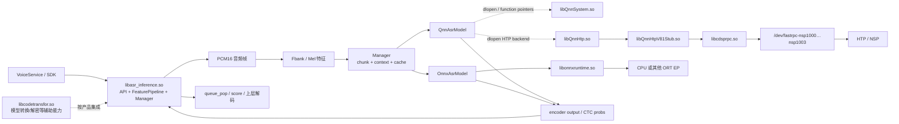
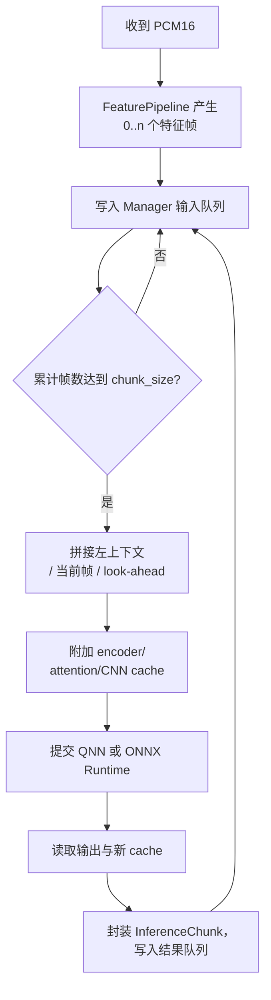
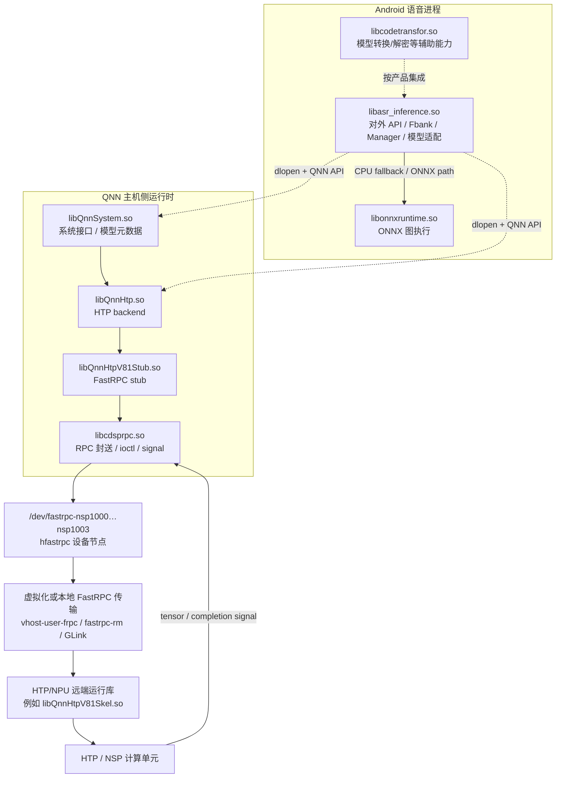
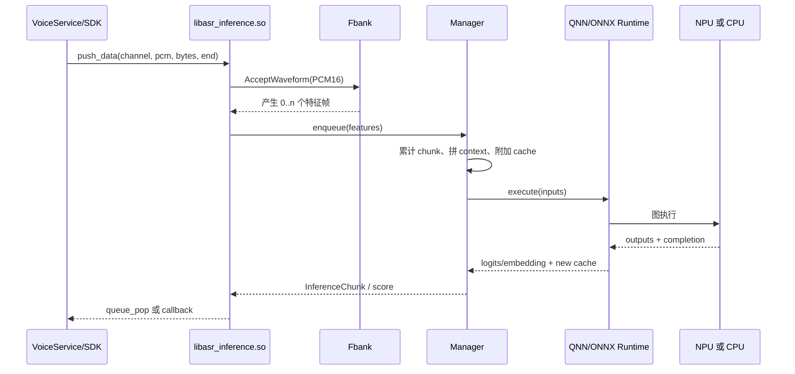

+++
date = '2026-08-19T16:00:00+08:00'
draft = false
title = '语言推理技术原理与运行时框架'
categories = ['AI', '语音', 'ASR', 'QNN', 'ONNX Runtime']
tags = ['语音推理', 'ASR', 'KWS', 'Fbank', 'Mel', 'QNN', 'ONNX Runtime', 'FastRPC', 'HTP', 'NPU']
+++

> 本文从通用架构出发，解释车载语音系统如何把 PCM 音频转换为模型输出，以及应用、算法封装库、推理运行时和 NPU/DSP 之间如何协作。文中的 `libasr_inference.so`、QNN 和 FastRPC 用作典型实现，不依赖某一次故障或某一个产品版本。

## 1. 什么是“语言推理”

本文所说的语言推理，主要指**语音语言链路的在线推理**，即对连续音频进行特征提取、神经网络执行和结果输出。它通常包含以下任务：

| 任务 | 输入 | 典型输出 | 说明 |
| --- | --- | --- | --- |
| ASR（自动语音识别） | PCM 音频 | 字符/词的概率、token、文本 | 将语音转换成文字 |
| KWS（关键词唤醒） | PCM 音频 | 唤醒分数、是否命中 | 低延迟、持续运行 |
| VAD（语音活动检测） | PCM 音频 | speech/non-speech | 判断当前是否有人说话 |
| 说话人/声学分类 | PCM 或声学特征 | embedding、类别分数 | 例如说话人确认、场景识别 |
| NLU/对话模型 | 文本或 token | 意图、槽位、回复 token | 一般位于 ASR 之后，可能使用 CPU、GPU 或 NPU |

训练阶段产生模型参数；推理阶段只执行已经训练好的图。一个完整的“语音推理”系统不只有神经网络，还包括音频缓冲、Fbank/Mel 特征、分块调度、缓存管理、后处理和结果队列。

本文重点是 ASR/KWS 这类**连续流式推理**。它与一次性输入一段文本的 LLM 推理在数据形态上不同，但都遵循“准备输入 → 调度模型 → 读取输出”的基本模式。

## 2. 端到端架构

一次推理可以概括为：

```text
麦克风/音频 HAL
    ↓ PCM 帧
VoiceService / SDK
    ↓ C API
libasr_inference.so
    ├─ FeaturePipeline / Fbank：PCM → 声学特征
    ├─ Manager：分帧、缓存、组 chunk、维护 cache
    └─ QnnAsrModel 或 OnnxAsrModel：调度模型
          ├─ QNN → HTP/NPU
          └─ ONNX Runtime → CPU（或其他 ORT EP）
    ↓ tensor / InferenceChunk / score
上层解码器、唤醒状态机或对话业务
```

下图把“算法封装库”和“运行时 `.so`”分开。实线表示主要数据流，虚线表示动态加载或控制关系。



### 2.1 进程内与进程外边界

- `libasr_inference.so`、`libonnxruntime.so`、`libQnnHtp.so` 等通常运行在 Android 语音进程的用户态地址空间内。
- QNN 的 HTP 后端会通过 `libQnnHtpV81Stub.so` 和 `libcdsprpc.so` 发起远端调用；真正的 HTP 图执行发生在 DSP/NPU 一侧。
- `libQnnHtpV81Stub.so` 是通信桩，不等同于模型本身；它负责把主机侧 QNN 调用转成 FastRPC 请求。
- DSP 侧的 skeleton/远端运行库是部署产物的一部分，常见名称包括 `libQnnHtpV81Skel.so` 或同类 HTP 远端库，具体名称取决于 QNN/SoC 版本。
- ONNX Runtime 路径可以完全在进程内执行，也可以通过 Execution Provider（EP）转到其他加速器；因此“使用 ONNX 模型”不等于“只能使用 CPU”。

## 3. 输入、输出和数据形状

### 3.1 对外输入

典型的 `libasr_inference.so` 接口可分为三类：

1. **初始化参数**：模型目录、配置文件、运行设备、通道数、队列或回调配置。
2. **音频输入**：连续的 PCM 音频块。常见接口形态是 `const int16_t*` 加字节数；字节数除以 2 得到采样点数。实际采样率、声道布局和量化格式以产品接口契约为准。
3. **控制输入**：reset、mute/unmute、reload/clear QNN，以及表示一段输入结束的 flush/end 标志。

接口层传入的是原始音频，QNN/ONNX Runtime 接收到的却通常不是 PCM，而是已经整理好的浮点特征张量和增量推理所需的 cache 张量。

### 3.2 内部张量

一个流式声学模型的输入通常包含：

- 当前 chunk 的 Fbank/Log-Mel 特征：形状可抽象为 `[T, F]` 或 `[B, T, F]`；
- 左侧上下文、右侧 look-ahead（如果模型需要）；
- encoder cache、attention cache、CNN cache 等增量状态；
- 可选的 mask、长度、有效帧数和 profile 参数。

这里的 `B` 不一定代表多个用户。很多流式系统的 `B=1`，而“组 batch”实际是在时间维度上把连续若干帧组成一个 chunk。

### 3.3 对外输出

推理库常见的输出是：

- encoder embedding 或中间特征；
- CTC logits/probability、分类 score、VAD/KWS 分数；
- 携带时间戳、序号、有效长度和状态的 `InferenceChunk`；
- 通过 `queue_pop`、回调或类似接口交给上层的结果。

“浮点 tensor”与“最终文字”是两个不同层次。最终文字通常还需要 CTC beam search、token 解码、词典、标点、语义解析或对话状态机；如果库只暴露 tensor/score 队列，就不能把它直接称为文本识别器。

## 4. PCM 到特征：Fbank / Mel 的工作原理

### 4.1 为什么不能直接把 PCM 喂给大多数声学模型

PCM 是按时间均匀采样的波形，采样点之间高度相关。声学模型更容易在短时频谱上学习共振峰、能量和频带变化，因此通常先把音频变换为短时频域特征。

### 4.2 标准处理链

对采样率为 `Fs` 的 PCM 流，Fbank 通常执行以下步骤：

1. **预加重（可选）**：增强高频成分。
2. **分帧**：使用长度为 `N` 的窗口，每隔 `H` 个采样点产生一帧。相邻帧重叠，以避免语音过渡丢失。
3. **加窗**：常见是 Hann/Hamming 窗，降低 FFT 截断造成的频谱泄漏。
4. **FFT**：得到每帧的功率谱或幅度谱。
5. **Mel 滤波器组**：用一组在 Mel 频率尺度上分布的三角滤波器，汇总相邻频带能量。
6. **取对数**：得到 Log-Mel/Fbank 能量，压缩动态范围，使乘性声学变化更接近加性变化。
7. **归一化（可选）**：做 CMVN、均值方差归一化或模型指定的量化前处理。

可以把一帧的核心计算写成：

```text
power[k] = |FFT(windowed_frame)[k]|²
mel[m]   = Σk filter[m][k] × power[k]
fbank[m] = log(max(mel[m], ε))
```

最终形成时间序列 `X = [x₀, x₁, …, xₜ]`，其中每个 `xₜ` 是一个 Fbank/Mel 向量。帧长、帧移、Mel 滤波器数量、频率范围和归一化方式必须与训练配置一致；“16 kHz、25 ms、10 ms、80 维”只是常见示例，不应作为所有产品的固定值。

### 4.3 Fbank 模块的工程职责

Fbank 不只是数学函数，还要处理：

- PCM 半帧、跨 `push_data` 调用的残留样本；
- 输入结束时的尾帧和 padding；
- 多通道或指定声道选择；
- 环形缓冲区、内存复用和线程安全；
- 特征帧的时间戳与序号。

因此，日志中出现“已经收到音频”并不代表模型已经收到一批完整特征；中间还可能缺少足够样本来形成下一帧或下一 chunk。

## 5. Manager：分帧、缓存、组 chunk 和调度

### 5.1 为什么需要 Manager

模型一般不会对每一个 10 ms 的 Fbank 帧单独发起一次远端调用。这样会产生过多调用开销，也不利于利用矩阵计算单元。Manager 将连续特征组织成模型所需的输入窗口，并协调执行线程与结果队列。

### 5.2 典型工作循环



### 5.3 缓存的含义

流式模型的 cache 是**模型状态**，不是普通的音频缓存。例如：

- `left context`：当前 chunk 左侧仍需看到的历史特征；
- `right context/look-ahead`：为了提升边界判断而延迟使用的未来帧；
- `attention cache`：Transformer 类模型已经计算过的 K/V；
- `CNN cache`：卷积模型前一块的边界特征；
- `encoder cache`：编码器跨 chunk 保存的中间状态。

reset 时必须清空这些状态，否则上一段语音可能污染下一段语音的首个 chunk。

### 5.4 “组 batch”在流式语音中的实际含义

工程文档中的 batch 可能有三种含义：

1. **时间 batch/chunk**：把连续 `T` 帧组成一次模型调用，最常见。
2. **多路 batch**：将多个通道、会话或请求合并成 `B>1` 的一次调用。
3. **硬件执行 batch**：QNN/HTP 内部为了调度而形成的执行批次。

判断一个系统使用哪一种 batch，应该看 tensor 的 `B/T` 维度、队列设计和模型签名，而不能只看日志里的“batch”字样。

## 6. 模型适配层：QnnAsrModel 与 OnnxAsrModel

### 6.1 QNN 路径

`QnnAsrModel` 通常负责把语音模型的输入输出映射到 QNN graph：

1. 加载已转换的 QNN 模型二进制或 graph 配置；
2. 创建 QNN backend、device、context 和 graph；
3. 分配 tensor、signal、profile 和 execution environment；
4. 将 Manager 生成的特征/cache 绑定到输入 tensor；
5. 调用 graph execute，等待完成信号；
6. 读取输出 tensor，并把新 cache 交回 Manager。

QNN 的优势是可以使用 Qualcomm HTP/NPU 的专用算子和量化路径。代价是需要匹配 QNN SDK、SoC HTP 版本、远端运行库和设备权限。

### 6.2 ONNX Runtime 路径

`OnnxAsrModel` 通过 `libonnxruntime.so` 创建 session，加载 ONNX 图并执行：

1. 创建 `OrtEnv`、`OrtSessionOptions` 和 session；
2. 选择 CPU EP 或其他可用的 Execution Provider；
3. 将 Fbank/cache 包装为 OrtValue；
4. 调用 `Run`，取回 logits、embedding 和新状态；
5. 按与 QNN 路径相同的输出协议交给 Manager。

ONNX Runtime 是图执行框架，不是某一种硬件。若没有配置加速 EP，模型会在 CPU 上运行；如果配置了 QNN EP、NNAPI EP 或其他 EP，则部分或全部算子可能转到加速器。

### 6.3 两条路径为什么要共享上层协议

为了支持回退和 A/B 测试，业务层通常不应该感知底层是 QNN 还是 ONNX Runtime。两条路径应尽量保持以下协议一致：

- 输入特征维度、数据类型和 layout；
- chunk 大小、cache 的语义和 reset 行为；
- 输出 tensor 名称、shape、有效帧数和时间戳；
- 错误码、超时和资源释放语义。

否则“切换到 CPU”只会变成重新实现一套业务流程，而不是可靠的运行时回退。

## 7. 组件图：以 `.so` 为基本单元

下面的关系图强调的是动态库职责，而不是源码类名。一个产品可能把多个算法类静态链接进同一个 `.so`，因此 `FeaturePipeline`、`Fbank`、`Manager` 和 `QnnAsrModel` 不一定各自对应一个独立文件。



### 7.1 `.so` 责任表

| `.so` | 所在侧 | 主要职责 | 是否等同于模型 |
| --- | --- | --- | --- |
| `libasr_inference.so` | 语音进程 | 对外 API、音频/特征管线、Manager、QNN/ORT 适配 | 否，通常包含业务编排和模型适配 |
| `libonnxruntime.so` | 语音进程 | ONNX 图加载、算子执行、EP 调度 | 否，是运行时 |
| `libQnnSystem.so` | 主机侧 | QNN 系统接口、模型二进制和运行时元数据 | 否，是 QNN 系统组件 |
| `libQnnHtp.so` | 主机侧 | HTP backend、graph/context/device 管理 | 否，是硬件后端 |
| `libQnnHtpV81Stub.so` | 主机侧 | HTP 远端调用的 stub、参数封送 | 否，是通信桩 |
| `libcdsprpc.so` | 主机侧 | FastRPC 句柄、invoke、设备 ioctl、signal/回调 | 否，是 RPC 传输库 |
| `libQnnHtpV81Skel.so` 等 | DSP 侧 | 远端 skeleton/服务实现 | 否，是远端运行库 |
| `libcodetransfor.so` | 产品辅助模块 | 模型转换、解密或格式适配（取决于集成） | 否 |

QNN 库经常由 `dlopen()` 动态加载，而不是出现在 `libasr_inference.so` 的静态依赖表中。因此，检查 `DT_NEEDED` 只能看到编译时依赖，不能据此断言进程没有使用 QNN。

## 8. 一次 chunk 的完整执行时序



这里有两个容易混淆的时间点：

- `push_data` 返回，只说明音频块被接口接受，不一定说明模型已经执行；
- `queue_pop` 或 callback 返回，才表示某个 chunk 的结果已经完成。中间可能经历特征累积、等待右上下文、线程调度和硬件执行。

## 9. 生命周期与资源边界

一个健壮的推理实例通常经历以下状态：

```text
创建
  → init 配置与线程
  → load 模型 / 创建 runtime session
  → prepare graph / 分配 tensor、signal、cache
  → warmup（可选）
  → running：持续接收 PCM、执行 chunk、产出结果
  → reset：清空音频与模型状态，保留 session
  → reload/mute（可选）
  → stop：停止接收新输入，排空在途任务
  → release：释放 graph、context、session 和底层设备资源
```

释放阶段至少要区分三类资源：

1. **业务资源**：输入/输出队列、回调对象、工作线程；
2. **模型资源**：tensor、cache、profile、graph、context、session；
3. **设备/通信资源**：FastRPC handle、signal、远端 context、HTP backend。

停止流程的通用原则是：先禁止新任务进入，再等待在途任务和回调完成，最后释放运行时和设备资源。不能只释放用户态对象而让仍在执行的远端调用继续引用它们；同样，不能在工作线程仍可能访问 runtime 时提前卸载对应 `.so`。

## 10. 性能、并发和可靠性

### 10.1 延迟组成

流式语音的端到端延迟可以拆成：

```text
端到端延迟
≈ 等待足够音频形成一帧/chunk
 + Manager 排队
 + 特征与 tensor 准备
 + runtime 调度
 + NPU/CPU 执行
 + callback/队列传递
 + 解码与业务处理
```

减小 chunk 会降低等待时间，但增加调用次数和边界开销；增大 chunk 能提升吞吐，却可能增加首字延迟。工程上需要同时观察 p50、p95/p99 延迟和持续吞吐。

### 10.2 背压与丢帧

当音频生产速度大于推理消费速度时，系统必须明确处理策略：

- 阻塞 `push_data`，让上游自然限速；
- 扩大队列，换取短时突发能力；
- 丢弃过期 chunk，只保留最新音频；
- 降级到 CPU 或较小模型；
- 触发 reset/restart。

没有明确背压策略时，队列会把问题隐藏起来，最终表现为“音频还在输入，但结果越来越晚”。

### 10.3 线程数量不等于 NPU 负载

FastRPC 进程中的 listener、notification、signal/callback 和 invoke 线程承担不同职责。线程数只能说明通信基础设施和并发模型，不能直接证明有多少个 graph 在 NPU 上同时执行。判断硬件负载应结合：

- invoke 的输入/输出和 graph 名称；
- 每次调用的开始/完成时间；
- QNN profile 或硬件计数器；
- 设备节点、domain/NSP 映射；
- 队列深度和在途请求数。

## 11. 如何设计可观测性

建议每个 chunk 贯穿记录同一个 `request_id` 或 `frame_seq`，至少包含：

| 阶段 | 建议记录 |
| --- | --- |
| 音频入口 | channel、字节数、采样点数、时间戳、end/flush 标志 |
| 特征阶段 | 产生帧数、首帧/末帧序号、Fbank 维度、处理耗时 |
| Manager | 输入队列深度、chunk 序号、context/cache 版本、等待耗时 |
| Runtime | backend、EP、graph、设备/domain、invoke 开始/结束 |
| 结果阶段 | 输出 shape、有效帧数、queue 入队/出队时间、解码耗时 |
| 生命周期 | init/reset/reload/stop/release 的状态转换和错误码 |

出现延迟或无结果时，应先区分问题在哪一段：

```text
没有 PCM
  → 没有完整特征帧
  → Manager 未达到 chunk 条件
  → 已提交但 runtime 未完成
  → 已完成但结果队列未消费
  → 已有 tensor 但解码/业务未推进
```

这种分段定位比只搜索“模型失败”或“硬件 hang”更可靠。

## 12. 常见误区

### 误区一：Fbank 是模型

Fbank 是确定性的声学特征提取步骤，模型从 Fbank 开始处理。更换 Fbank 参数会改变模型输入分布，即使神经网络文件没有变化，也可能导致识别率下降。

### 误区二：QNN 是一种模型格式

QNN 是 Qualcomm 的神经网络运行时/API 和后端体系。模型可能来自 ONNX、TensorFlow 等格式，经过转换后由 QNN backend 执行。

### 误区三：ONNX Runtime 只能跑 CPU

ONNX Runtime 通过 EP 选择执行后端。没有配置加速 EP 时通常走 CPU；配置了 QNN、NNAPI 等 EP 时可以使用加速器。

### 误区四：`libQnnHtpV81Stub.so` 就是 NPU 驱动

Stub 只是远端调用桩；它还要经过 `libcdsprpc.so`、FastRPC 设备和远端运行库，最终才到达 HTP/NSP。驱动、通信库、后端和模型图是不同层次。

### 误区五：结果 tensor 就是最终文本

ASR 模型输出通常是 logits、概率或 embedding。文本还需要 token 解码、语言模型、标点和业务状态机。

## 13. 小结

语言推理框架可以压缩成五层：

1. **输入层**：采集 PCM，定义采样率、格式、通道和时间戳；
2. **特征层**：Fbank/Mel 把波形转换成模型可用的时频特征；
3. **编排层**：Manager 负责 chunk、context、cache、队列和背压；
4. **运行时层**：QNN 或 ONNX Runtime 把张量交给 HTP/NPU、CPU 或其他 EP；
5. **业务层**：解码、唤醒、意图识别和对话状态机消费模型输出。

理解这五层及其边界，就能回答三个最重要的问题：数据目前在哪里、谁负责调度下一步、结果以什么协议返回。`.so` 文件只是这些边界在部署包中的具体载体；真正需要跟踪的是它们之间的数据、控制和生命周期关系。
