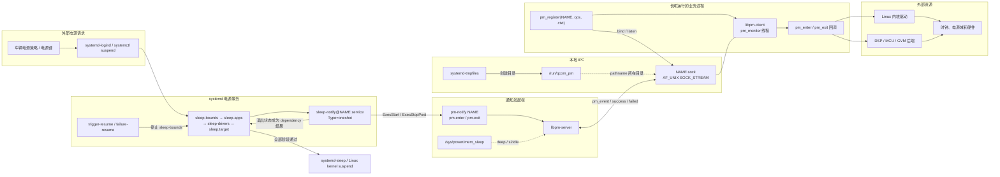
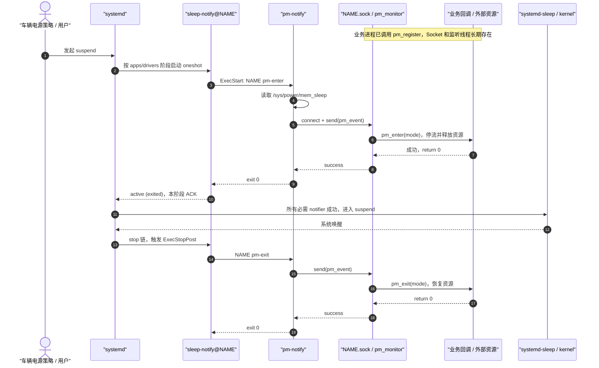
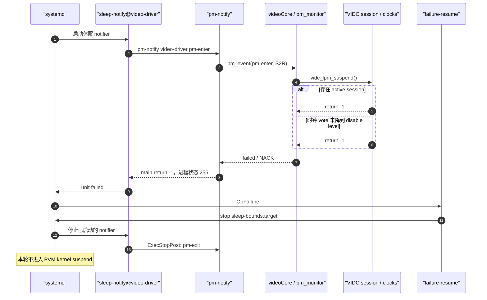

+++
date = '2026-09-04T15:00:00+08:00'
draft = false
title = 'Qualcomm pm-notify 用户态休眠通知机制'
description = '说明 pm-notify、systemd sleep target、Unix Domain Socket 与业务服务回调如何协同完成休眠和恢复'
categories = ['Qualcomm', 'Gunyah', '电源管理']
tags = ['pm-notify', 'systemd', 'Suspend', 'Unix Domain Socket', 'power-utils']
+++

`pm-notify` 是 Qualcomm `power-utils` 提供的用户态电源通知工具。它把 systemd 的休眠/恢复事务转换为发往业务进程的 Unix Domain Socket 请求，并根据业务进程返回的 ACK 或 NACK 决定电源流程能否继续。

## 1. 结论与系统边界

- `pm-notify` 是由 systemd 临时启动的一次性命令，不是常驻 daemon。
- 每个业务进程通过 `pm_register(NAME, ...)` 创建自己的 `/run/qcom_pm/NAME.sock`，不存在集中式 broker 或全局注册服务。
- systemd 通过多个 `sleep-notify@NAME.service` 实例把通知扇出到各业务进程，并用 `sleep-apps.target`、`sleep-drivers.target` 构成阶段屏障。
- 业务回调返回 `0` 时发送 ACK；返回负值时发送 NACK。任一必需 notifier 返回 NACK，systemd 都会终止本轮休眠并启动恢复回滚。
- 这套机制位于 Linux 内核 suspend 之前和恢复之后，用于协调用户态服务、UMD、DSP、MCU 和设备资源；它不等同于 Linux 内核驱动的 `suspend()`/`resume()` 回调。
- 在 Gunyah 系统中，`pm-notify` 本身仍是 PVM 内的本地 AF_UNIX IPC。业务回调可以继续通过 HAB、RPC 或设备节点影响 GVM/DSP/硬件，但这些属于业务组件的下游交互。

一个容易混淆的命名是：

| 构建组件 | 电源管理语义 | 实际 Socket 角色 |
| --- | --- | --- |
| `pm-notify` + `libpm-server` | 通知发起方 | AF_UNIX 客户端，执行 `connect/send/recv` |
| 业务进程 + `libpm-client` | 被通知的 PM client | AF_UNIX 服务端，执行 `bind/listen/accept` |

库名描述的是电源管理角色，不是 Unix Socket 的 client/server 角色。

## 2. 为什么需要 pm-notify

内核写入 `/sys/power/state` 之前，许多用户态资源必须按顺序收敛，例如：

- 应用停止产生新的音视频、显示、Camera 或总线请求；
- 视频编解码服务关闭 session，并释放 VIDC 时钟投票；
- 音频服务关闭 graph、设备和 DSP 资源；
- 显示服务停止合成或提交；
- Camera、CAN、mailbox、GPU 等 UMD 停止业务并确认硬件处于可休眠状态；
- 任一组件仍忙时，能够明确拒绝本轮休眠，而不是让内核带着未收敛资源继续 suspend。

Linux 内核 PM callback 只能覆盖内核对象。`pm-notify` 补充了用户态准备阶段，并把每个组件的“是否就绪”转换为 systemd dependency 的成功或失败。

## 3. 组件架构



图中有两类流：

- 控制流：外部休眠请求、systemd target、`sleep-notify` unit 和业务回调；
- 数据流：`pm_event` 请求、`success`/`failed` 响应，以及业务进程与内核、DSP、MCU 或 GVM 后端的交互。

## 4. 注册与 Socket 生命周期

### 4.1 创建 `/run/qcom_pm`

系统启动早期，`make-pm-dir.service` 调用 `systemd-tmpfiles`，根据 `qcom_pm.conf` 创建：

```text
/run/qcom_pm  0750 root:root
```

该目录位于 `/run`，重启后不会保留。

### 4.2 业务进程注册

业务进程准备好接收电源通知后调用：

```c
pm_register("video-driver", &lpm_ops, context, &handle);
```

`pm_register()` 内部执行：

```text
分配 pm_client handle
  → 生成 /run/qcom_pm/video-driver.sock
  → socket(AF_UNIX, SOCK_STREAM | SOCK_CLOEXEC | SOCK_NONBLOCK)
  → unlink() 同名旧节点
  → bind()
  → listen()
  → chmod(socket, 0666)
  → 创建 pm_monitor 线程
```

因此，`/run/qcom_pm/video-driver.sock` 的创建者是调用 `pm_register("video-driver", ...)` 的 `videoCore` 进程，而不是 `pm-notify` 或 systemd。

### 4.3 监听线程

每个注册者内部有一个 `pm_monitor` 线程。线程使用 `poll()` 等待连接，收到请求后按命令同步调用：

```c
ops->pm_enter(ctxt, mode);
ops->pm_exit(ctxt, mode);
ops->impose(ctxt, level);
ops->impose_v2(ctxt, level, lpm_mode);
```

回调执行结束前，发起侧的 `pm-notify` 会一直等待。

### 4.4 注销与异常退出

正常退出时，业务进程调用 `pm_deregister()`：

```text
设置 stop_thread
  → shutdown() 唤醒 poll
  → pthread_join(pm_monitor)
  → close(listen_fd)
  → unlink(NAME.sock)
  → 释放 handle
```

如果进程异常退出，内核会关闭 fd，但 pathname socket 可能残留。下一次 `pm_register()` 会先删除旧节点再重新绑定。

业务名必须全局唯一。两个活跃进程使用同一个名字注册时，后注册者会删除原 pathname 并重新绑定，可能造成通知路由混乱；设计上禁止重复注册。

## 5. 消息协议

### 5.1 请求格式

协议发送的是本机原生 C 结构体，不是 JSON 或文本协议：

```c
struct pm_event {
    char cmd[50];
    int mode;
    int lpm_mode;
};
```

支持的命令为：

| 命令 | 参数含义 | 典型用途 |
| --- | --- | --- |
| `pm-enter` | `mode` 为当前 suspend 模式 | 进入休眠前停止业务并释放资源 |
| `pm-exit` | `mode` 为当前 suspend 模式 | 唤醒或失败回滚时恢复资源 |
| `impose` | `mode` 字段承载 impose level | 对单个 client 施加电源等级 |
| `impose_v2` | impose level + `lpm_mode` | 传递扩展低功耗等级 |

标准 systemd STR/Deep Sleep 流程使用前两个命令。

### 5.2 suspend 模式

`pm-notify` 在发送 `pm-enter` 或 `pm-exit` 前读取 `/sys/power/mem_sleep`：

| sysfs 当前选择 | 协议枚举 | 日志含义 |
| --- | --- | --- |
| `[deep]` | `PM_MODE_DS = 1` | Deep Sleep |
| `[s2idle]` | `PM_MODE_S2R = 2` | Suspend/STR |

这里的 `PM_MODE_S2R` 是 Qualcomm 用户态协议命名；在当前实现中 `[s2idle]` 也映射到该值。

### 5.3 响应和回调返回值

监听端根据业务回调返回值产生文本响应：

| 业务回调返回值 | Socket 响应 | `pm-notify` C 返回值 | systemd 看到的结果 |
| --- | --- | --- | --- |
| `0` 或正值 | `success` | `0` | 成功 |
| 负值 | `failed` | `-1` | exit status 255 |
| 非预期响应 | — | `-EAGAIN` | exit status 245 |

实现判断条件是 `ret < 0`。业务回调必须返回 `-EBUSY`、`-EIO` 等负错误码；如果误返回正的 `EBUSY`，实现会把它当成成功 ACK。

## 6. systemd 编排

### 6.1 通用模板

`sleep-notify@.service` 是一个模板单元，主要属性是：

```ini
[Unit]
DefaultDependencies=no
After=sleep-bounds.target
Before=sleep.target
OnFailure=failure-resume.service

[Service]
Type=oneshot
RemainAfterExit=yes
```

各业务通过 drop-in 增加具体命令。例如 video-driver：

```ini
[Unit]
After=sleep-apps.target
Requires=sleep-apps.target
Before=sleep-drivers.target
PartOf=sleep-drivers.target

[Service]
ExecStart=pm-notify video-driver pm-enter
ExecStopPost=/bin/sh -c 'pm-notify video-driver pm-exit && ...'

[Install]
RequiredBy=sleep-drivers.target
```

`Type=oneshot + RemainAfterExit=yes` 很关键：

- 启动 unit 时运行 `ExecStart`，发送 `pm-enter`；
- ACK 后 unit 保持 `active (exited)`；
- 内核唤醒或失败回滚时停止 unit，运行 `ExecStopPost`，发送 `pm-exit`。

### 6.2 两阶段屏障

总体顺序为：

```text
sleep-bounds.target
  → 应用类 notifier
  → sleep-apps.target
  → 驱动/UMD 类 notifier
  → sleep-drivers.target
  → sleep.target
  → systemd-suspend.service
  → Linux kernel suspend
```

同一阶段内的 notifier 可以并行；target 只有在其所有必需 oneshot 都成功后才通过。因此它们构成 systemd 层面的 ACK barrier。

先停应用、后停驱动，可以降低“应用仍提交请求，但驱动已经准备休眠”的竞争风险。恢复时依赖关系大体按相反方向拆除。

### 6.3 正常恢复和失败回滚

内核正常唤醒后，`trigger-resume.service` 执行：

```bash
systemctl stop sleep-bounds.target
```

关联的 notifier 随之停止并运行 `ExecStopPost`。

若某个 notifier 启动失败，`OnFailure=failure-resume.service` 触发相同的 `stop sleep-bounds.target` 动作，使此前已经完成 `pm-enter` 的组件也收到 `pm-exit`，恢复到运行态。

`sleep.target` 还配置了 20 秒 job timeout。这个超时属于 systemd 外层保护；`pm-notify` 自身没有 Socket 接收超时。

## 7. 正常休眠与恢复时序



## 8. NACK 与失败回滚时序



`status=255/EXCEPTION` 在这条路径中不是进程 crash，也不代表收到信号；它只是 C `main()` 返回 `-1` 后形成的 8 位进程退出状态。

## 9. 业务场景

### 9.1 已确认使用同一机制的组件

| 业务 | 注册名/Socket | 休眠阶段 | `pm-enter` 典型职责 |
| --- | --- | --- | --- |
| Video Codec UMD | `video-driver` | drivers | 检查无活跃 VIDC session、所有可伸缩时钟已关闭 |
| Audio UMD | `audio-umd` | drivers | 关闭 MCM graph/设备，协调 DSP 进入低功耗 |
| Weston | `pm-client-weston` | apps/display ordering | 停止显示合成和提交 |
| Camera 平台服务 | `qcx_server`、`qcx_be_server` | drivers | 停止 Camera 请求并收敛后端资源 |
| 显示/触摸辅助服务 | `display_*`、`touch_*` | apps 或 drivers | 停止输入、显示监控或硬件组合操作 |
| CAN UMD | `aurix-can-umd` | drivers | 停止或切换 CAN/MCU 通信状态 |
| Sail mailbox | `sail-mailbox` | drivers | 收敛 mailbox 通信 |
| 温度监控 | `temp-monitor` | apps | 暂停业务动作并确认可休眠 |

这张表描述的是用户态服务。它们的回调可能进一步调用内核驱动、DSP、MCU 或虚拟化后端，但 Socket 不是由内核创建的。

并非所有 `sleep-notify@*.service` 都必须使用 `pm-notify`。模板的具体 drop-in 可以运行其他命令；是否采用这套 Socket 协议，应以该实例的 `ExecStart` 和业务源码是否调用 `pm_register()` 为准。

### 9.2 Video 的拒绝条件

`videoCore` 注册：

```c
pm_register("video-driver", &g_drv_ctxt->lpm_ops, lpm, &lpm->lpm_handle);
```

进入低功耗时，`vidc_lpm_suspend()` 依次检查：

1. 是否仍有 ACTIVE VIDC client；
2. 每个 device 缓存的 scalable clock vote 是否已经等于 `disable_level`。

任一条件不满足都会返回负值并产生 NACK。只有两项都满足，才设置 `in_ds_state = TRUE` 并 ACK。

注意日志 `video-driver SUSPENDED` 在源码中位于这两项检查之前，它只是 KPI 标记，不能作为休眠成功的判据。成功应以 `Ready to suspend`、ACK 以及后续真正出现内核 `PM: suspend entry` 为准。

### 9.3 Audio 的处理

Audio MCM 注册：

```c
pm_register("audio-umd", &mcm_lpm_ops, NULL, &mcm_ctx.lpm_handle);
```

其中：

- `mcm_suspend()` 负责根据 DS/S2R 模式关闭或调整 MCM graph 和设备；
- `mcm_resume()` 恢复设备、graph 和外围资源；
- 任一步骤失败均返回错误，由 `pm_monitor` 转为 NACK。

### 9.4 与 logind delay inhibitor 的区别

两者都是休眠协调机制，但处在不同层次：

| 机制 | 参与方式 | 作用 |
| --- | --- | --- |
| logind delay inhibitor | 进程持有 inhibitor fd，监听 `PrepareForSleep` | 给应用一个有限的异步收尾窗口 |
| `pm-notify` | systemd oneshot 同步请求 AF_UNIX callback | 把业务 ACK/NACK 纳入 target dependency，允许明确否决休眠 |
| Linux kernel PM callback | 内核驱动注册 PM ops | 内核真正 suspend/resume 设备 |

例如 `polaris-gpumon` 使用 logind delay inhibitor；Video/Audio UMD 使用 `pm-notify`。不能因为两者出现在同一 STR 时间线上，就认为它们属于同一 IPC 协议。

## 10. 新业务接入方法

### 10.1 注册回调

```c
#include <errno.h>
#include <pm_client_lib.h>

static int demo_suspend(void *ctxt, enum PM_MODE mode)
{
    struct demo_context *ctx = ctxt;

    if (ctx->request_in_flight)
        return -EBUSY;

    if (stop_requests_and_release_resources(ctx, mode) != 0)
        return -EIO;

    return 0;
}

static int demo_resume(void *ctxt, enum PM_MODE mode)
{
    struct demo_context *ctx = ctxt;
    return restore_resources(ctx, mode) == 0 ? 0 : -EIO;
}

static struct pm_ops_s demo_ops = {
    .pm_enter = demo_suspend,
    .pm_exit = demo_resume,
};

pm_client_t handle = NULL;
int rc = pm_register("demo", &demo_ops, &context, &handle);
```

退出前执行：

```c
pm_deregister(handle);
```

接入要求：

- `NAME` 必须唯一，并与 systemd drop-in 中传给 `pm-notify` 的名字完全一致；
- `ops`、回调函数和 `ctxt` 的生命周期必须覆盖整个注册周期；
- 实际可能收到的命令必须有有效函数指针；
- 回调必须线程安全，因为它运行在业务进程的 `pm_monitor` 线程；
- 回调应有明确、有限的执行时间，不能无限等待其他线程或硬件；
- 失败必须返回负值，禁止返回正 errno；
- `pm-enter` 成功完成的动作必须能由 `pm-exit` 在正常唤醒和失败回滚两种场景下恢复。

### 10.2 systemd drop-in

驱动阶段的典型配置为：

```ini
[Unit]
After=sleep-apps.target
Requires=sleep-apps.target
Before=sleep-drivers.target
PartOf=sleep-drivers.target

[Service]
ExecStart=pm-notify demo pm-enter
ExecStopPost=pm-notify demo pm-exit

[Install]
RequiredBy=sleep-drivers.target
```

如果属于应用阶段，应按业务依赖挂入 `sleep-apps.target`，不能简单复制 driver 阶段排序。接入前必须检查完整 dependency graph，避免环依赖。

## 11. 失败语义与实现边界

| 场景 | 当前行为 | 影响/注意事项 |
| --- | --- | --- |
| 收到 `success` | `pm-notify` 返回 0 | notifier barrier 通过 |
| 收到 `failed` | 返回 `-1`，进程状态 255 | unit 失败，触发休眠回滚 |
| 未知或空响应 | 返回 `-EAGAIN`，进程状态 245 | unit 失败 |
| Socket 不存在，`connect()` 为 `ENOENT` | 返回 0 | fail-open；可选 client 不阻塞，但也可能掩盖注册失败或启动竞态 |
| Socket 存在但连接失败 | 返回 `-ENODEV` | unit 失败 |
| 业务回调卡住 | `pm-notify` 一直阻塞 | 工具本身无 I/O timeout，依赖 systemd 外层 20 秒 job timeout |
| 业务进程异常退出 | fd 自动关闭，pathname 可能残留 | 可能出现 `ECONNREFUSED`；下一次注册会 unlink 旧节点 |
| 重复业务名 | 后注册者 unlink 并重新 bind | 可能抢占 pathname；必须从设计上禁止 |

还有以下协议限制：

- 使用 `SOCK_STREAM`，但当前实现假设一次 `send/read` 就得到完整固定结构；
- `pm_event` 没有 magic、协议版本、长度或 endian 协商，只适合同一系统镜像中的本地 ABI；
- send/recv 返回值和短读写没有被完整校验；
- 没有 retry 和请求级 deadline；
- Socket 本身 chmod 为 `0666`，但仍受父目录 `0750 root:root`、SELinux 和进程权限限制；
- 监听端没有通过 `SO_PEERCRED` 检查对端身份；
- `impose` 参数使用 `atoi()`，没有严格的格式和范围校验。

这些限制决定了它适合作为受控车端镜像里的本地电源协调协议，不适合作为跨 VM、跨主机或不可信客户端协议。

## 12. 实机失败案例

一次 SA8797 PVM 批量 STR 日志中，共观察到 116 次休眠请求：

| 结果 | 次数 |
| --- | ---: |
| Video notifier ACK，并真正进入 PVM kernel suspend | 102 |
| Video notifier NACK，进入内核 suspend 前回滚 | 14 |

14 次 NACK 的直接原因：

- 13 次：`vidc_lpm_suspend: clks are on, rejecting LPM request`；
- 1 次：`vidc_lpm_suspend: 1 active clients present, rejecting LPM request`。

失败链路为：

```text
sleep-notify@video-driver.service
  → pm-notify video-driver pm-enter
  → /run/qcom_pm/video-driver.sock
  → videoCore::vidc_lpm_suspend()
  → return -1
  → failed / NACK
  → pm-notify return -1
  → process exit status 255
  → sleep-drivers.target dependency failed
  → failure-resume 回滚
```

这 14 次都不是 `pm-notify` crash，也不是内核 suspend 过程失败，而是 Video UMD 在进入内核 suspend 前主动否决。这里检查的是驱动上下文中缓存的 clock vote，并非直接读取硬件寄存器。现有日志没有输出具体 active session 的所有者，也没有保留具体 clock name/vote，因此只能定位到“活跃 VIDC session”或“缓存的时钟投票未降到 disable level”，不能继续区分是 power collapse 尚未完成、资源被重新投票、SCMI 状态异常还是缓存状态残留。

建议在 Video 拒绝分支增加：

- active session 的 session id、codec、状态、VM/client 和进程信息；
- 每个未关闭时钟的 device id、clock name、`voted_clk_level` 和 `disable_level`；
- 最后一次 session close、power-collapse 和 `pm-enter` 的时间差。

短暂延迟后重试只能作为验证时序竞争的实验手段。对于确有 active client 的情况，盲目重试会延长 STR 时延并掩盖业务未退出，不能替代资源生命周期修复。

## 13. 诊断命令

### 13.1 查看注册的 Socket 和所有者

```bash
ls -la /run/qcom_pm/
ss -xlpn | grep /run/qcom_pm
```

预期看到类似：

```text
/run/qcom_pm/video-driver.sock
/run/qcom_pm/audio-umd.sock
```

### 13.2 查看 systemd 配置和依赖

```bash
systemctl cat sleep-notify@video-driver.service
systemctl list-dependencies sleep-apps.target
systemctl list-dependencies sleep-drivers.target
systemctl show sleep-notify@video-driver.service \
  -p ActiveState -p SubState -p Result -p ExecMainStatus
```

### 13.3 查看一次休眠事务

```bash
journalctl -b -u sleep-notify@video-driver.service
journalctl -b -u failure-resume.service
journalctl -b | grep -E 'PrepareForSleep|pm-notify|Received (ACK|NACK)|sleep-(apps|drivers)|PM: suspend'
```

判定时必须把以下事件串成同一轮时间线：

```text
pm-enter 请求
  → 业务 callback 日志
  → ACK/NACK
  → notifier unit 结果
  → 是否出现 PM: suspend entry
  → 正常 resume 或 failure-resume
  → pm-exit 结果
```

不要仅凭 `Operation 'suspend' finished` 判断成功，因为失败回滚后 systemd 也可能打印操作结束；真正进入 PVM 内核 suspend 应看到配对的 `PM: suspend entry` 和 `PM: suspend exit`。

### 13.4 谨慎手工验证

下面的命令会真正调用业务 suspend/resume 回调：

```bash
pm-notify video-driver pm-enter
pm-notify video-driver pm-exit
```

只能在受控台架、确认没有并发 systemd sleep transaction 时执行，并且 `pm-enter` 后必须执行对应的 `pm-exit`。生产车和道路测试环境不应把它当作只读诊断命令。

## 14. 源码索引

### 14.1 Qualcomm power-utils

```text
vendor/qcom/opensource/safelinux-services/power-utils/
├── public/pm_client_lib.h
├── public/pm_server_lib.h
├── src/pm-notify.c
├── src/pm-server.c
├── src/pm-monitor.c
├── src/pm-common.c
├── src/pm-internal.h
└── conf/
    ├── sleep-notify@.service
    ├── sleep-bounds.target
    ├── sleep-apps.target
    ├── sleep-drivers.target
    ├── trigger-resume.service
    ├── failure-resume.service
    └── tmpfiles-early.d/qcom_pm.conf
```

### 14.2 Video

```text
vendor/qcom/proprietary/video-driver/
├── sleep-notify@video-driver.service.d/video-sleep-notify.conf
└── drivers/codec/vidc/src/
    ├── vidc_api.c       # pm_register("video-driver", ...)
    ├── vidc_pm.c        # vidc_lpm_suspend()/resume()
    └── vidc_util.c      # vidc_drv_is_clks_off()
```

### 14.3 Audio

```text
vendor/qcom/proprietary/audio-service/
├── audio_service/sleep-notify@audio-umd.service.d/audio-umd.conf
└── audio_driver/mcm_lib/src/mcm.c
```

## 15. 相关文档

- [Gunyah VMM Service IPC 与客户端模型](vmm-service-ipc.md)
- [Gunyah VMM Service 运行时架构](vmm-service-runtime.md)
- [PVM 图形栈](pvm-graphics-stack.md)

`pm-notify` 与 VMM Service 都使用本地 IPC，但两者协议、服务端和生命周期完全独立。不要把 `/run/qcom_pm/*.sock` 与 VMM control/event socket 混用。
