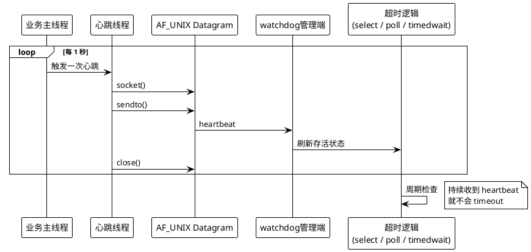
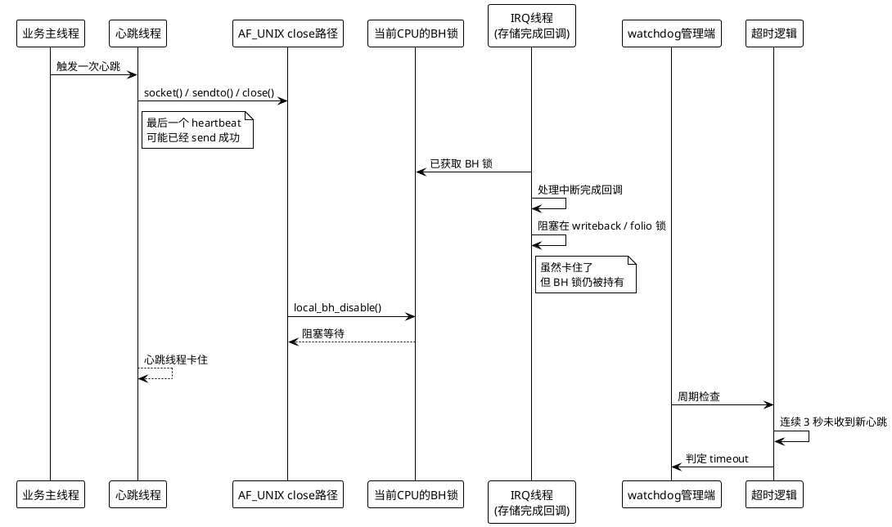

+++
date = '2026-03-29T18:00:00+08:00'
draft = false
title = 'PREEMPT_RT 下 AF_UNIX close() 触发 watchdog timeout 的底层原理'
+++

本文基于一次真实 trace 的分析结果，抽象出一个可以公开讨论的技术问题模型：

- 业务线程本身还活着
- watchdog 管理线程本身也在正常调度
- 但多个模块仍然几乎同时发生 timeout

如果只看应用层，现象很像：

- `select()` 等待超时
- `pthread_cond_timedwait()` 超时
- 心跳超时
- watchdog 误报

但这类问题的真正根因，未必在 `select()`、`pthread timeout` 或 watchdog 逻辑本身，而可能在更底层的 Linux PREEMPT_RT 锁语义变化。

本文要解释的正是这条因果链：

> 一个看起来很普通的 `socket() -> sendto() -> close()` 心跳发送路径，为什么会在 PREEMPT_RT 内核上，被完全不相干的存储 I/O 完成路径拖住，最终表现为多个上层 watchdog 同时超时。

## 1. 先看抽象后的问题模型

假设系统里有两类角色：

- **心跳发送端**
  - 每隔 1 秒向 watchdog 管理端发送一个 Unix domain datagram 心跳
- **watchdog 管理端**
  - 收到心跳后刷新对应实体的存活状态
  - 如果连续 3 秒没有收到新的心跳，就判定 timeout

一个常见但脆弱的实现方式是：

```c
void heartbeat_once(void)
{
    int fd = socket(AF_UNIX, SOCK_DGRAM, 0);
    sendto(fd, &msg, sizeof(msg), 0, ...);
    close(fd);
}
```

如果发送线程每次心跳都新建并关闭一个 AF_UNIX datagram socket，那么每个周期都会走一次完整的：

```text
socket() -> sendto() -> close()
```

表面上看，这只是一次非常轻量的 IPC。

但问题就在这里：

> 在 PREEMPT_RT 内核上，`close()` 这条路径并不一定是“瞬时返回”的。

## 2. 正常情况下，watchdog 为什么能工作

下面是一个抽象后的正常时序。为了避免涉及内部实现，管理端只用通用的“事件循环 + timeout”来表示。



这套机制的关键点是：

1. 业务线程还活着，不代表 watchdog 管理端就一定能看到“活着”
2. 真正维持 watchdog 存活的是“心跳包成功发到管理端”
3. 一旦发送链路中的任何一步阻塞，管理端的超时逻辑就会如实触发

所以很多时候，`select()` 超时、`pthread_cond_timedwait()` 超时、watchdog timeout 都只是**症状**，不是根因。

## 3. 误区：为什么它看起来像是上层 timeout 问题

在日志上，这类问题通常会误导人：

- 管理端仍在正常运行
- timeout 线程也在按周期醒来
- 业务主线程甚至还在继续处理消息

于是很容易得到错误结论：

- “是不是 `select()` 不准了？”
- “是不是 `pthread timeout` 被系统时间干扰了？”
- “是不是 watchdog 判断太激进了？”

这些判断经常不成立。

更准确的理解是：

> timeout 逻辑只是一个“计时裁判”。它发现的是“心跳没有按时到达”，但它并不负责解释“为什么没到达”。

真正的根因往往发生在 timeout 之前的更底层路径上。

## 4. 关键转折：AF_UNIX socket 的 `close()` 为什么也会卡

这次问题的关键，不在 `sendto()`，而在 `close()`。

对 AF_UNIX socket 来说，关闭路径会进入：

```text
close()
-> __fput_sync()
-> sock_close()
-> __sock_release()
-> unix_release()
-> unix_release_sock()
```

问题在于，`unix_release_sock()` 里会调用 `local_bh_disable()`。

如果是在普通非 RT 内核里，很多人对 `local_bh_disable()` 的印象是：

- 禁止 bottom half
- 只是一个很轻的 per-CPU 计数控制
- 不太会真的“睡住”

但在 PREEMPT_RT 内核里，这个理解不再成立。

## 5. PREEMPT_RT 改变了 `local_bh_disable()` 的语义

### 5.1 非 RT 内核里的直觉

在普通内核里，`local_bh_disable()` 更像一种“本 CPU 上先别处理 softirq”的控制手段。

它的工程含义通常是：

- 保护某些 per-CPU 临界区
- 不希望 softirq 在这个临界区里打断当前执行

这时候你一般不会把它想成“一把会睡眠等待的锁”。

### 5.2 PREEMPT_RT 下的真实语义

PREEMPT_RT 的目标是把很多原本不可抢占、不可睡眠的执行路径 RT 化、线程化。

这个过程中，`local_bh_disable()` 在 RT 内核里不再只是一个轻量计数器，它会落到 per-CPU 的 RT 锁路径上，本质上变成：

```text
__local_bh_disable_ip()
-> rt_spin_lock()
```

也就是说：

- 它变成了**会竞争、会等待、会睡眠**的锁
- 同一个 CPU 上，只要别的线程已经持有这把 BH 锁，后来者就可能被阻塞

这一点非常关键。

因为这意味着：

> 一个看似普通的 `close()`，在 PREEMPT_RT 上可能会因为等待 BH 锁而进入长时间阻塞。

## 6. 为什么一个存储 IRQ 线程能拖住用户态心跳线程

这次问题真正反直觉的地方在这里：

- 心跳线程走的是 AF_UNIX `close()`
- 阻塞它的却是存储 I/O 完成路径

这要从 forced-threaded IRQ 的执行方式说起。

### 6.1 PREEMPT_RT 下，很多 IRQ handler 实际在线程里跑

在 PREEMPT_RT 中，很多中断处理路径不是传统 hardirq 语义，而是运行在内核线程上下文中。

这类线程常被称为：

- IRQ thread
- forced-threaded handler

它们在进入实际 handler 前，也可能执行 `local_bh_disable()`。

于是就产生了同一个 CPU 上的共享竞争点：

- 用户线程在 AF_UNIX `close()` 里要拿 BH 锁
- IRQ 线程在处理中断完成回调时也拿着同一把 BH 锁

### 6.2 真正的放大器：IRQ 线程拿着 BH 锁，又卡在更深的锁上

最致命的情况不是“IRQ handler 很忙”，而是：

1. IRQ 线程先拿到了当前 CPU 的 BH 锁
2. 进入存储完成回调
3. 在更深的路径里又卡在另一个锁上
   - 例如 folio writeback 相关锁
   - 页缓存回写完成链路上的 RT 锁
4. 它虽然已经不在真正干活，但**BH 锁还没释放**

这时，同一 CPU 上所有也需要 `local_bh_disable()` 的路径都可能跟着堵住。

于是形成下面这条等待链：

```text
用户线程 close(AF_UNIX)
-> unix_release_sock()
-> local_bh_disable()
-> rt_spin_lock(BH lock)
-> 等待 IRQ 线程释放

IRQ 线程
-> 已持有 BH lock
-> 存储完成回调
-> 阻塞在 folio / writeback 相关锁
-> BH lock 长时间不释放
```

这就是为什么看起来“不相干”的两件事会被强行耦合：

- 一边是心跳 IPC
- 一边是重 I/O 下的存储完成回调

它们的交汇点就是 PREEMPT_RT 下的 per-CPU BH 锁。

## 7. 故障时序：为什么最后表现成 watchdog timeout

把链路串起来，故障时序大致如下：



这里最容易误判的点有两个：

1. **最后一个 heartbeat 可能已经成功送达**
   - 因为 `sendto()` 已经完成
   - 真正卡住的是后面的 `close()`
2. **管理端 timeout 是正确行为**
   - 它确实在超时窗口内没有收到新的 heartbeat
   - 所以它不是“误判”

换句话说：

> watchdog 超时只是对“心跳链路被冻住”这件事的正确反应。

## 8. 为什么多个模块会几乎同时 timeout

如果系统里有多个模块都采用类似的心跳发送模式：

```text
每次都 socket() -> sendto() -> close()
```

并且这些线程恰好运行在同一个被拖住的 CPU 上，那么它们会同时竞争同一把 BH 锁。

于是会看到一种很典型的现象：

- 表面上是多个模块分别 timeout
- 实际上是多个心跳线程同时卡在同一类内核栈上

这就是所谓的“上层分散报错，底层单点堵塞”。

从现象上看像是：

- 模块 A 超时
- 模块 B 超时
- 模块 C 超时

但从根因上看，其实只有一个：

> 当前 CPU 上的 BH 锁被 RT IRQ 路径长期占住了。

## 9. 为什么 `select()` / `pthread timeout` 可以作为例子，但不能当根因

你可以把管理端理解成下面两种通用模型中的任意一种。

### 9.1 `select()` / `poll()` 超时模型

```c
for (;;) {
    struct timeval tv = {
        .tv_sec = 3,
        .tv_usec = 0,
    };

    int n = select(fd + 1, &rfds, NULL, NULL, &tv);
    if (n == 0) {
        // timeout
    }
}
```

### 9.2 `pthread_cond_timedwait()` 超时模型

```c
pthread_mutex_lock(&lock);
while (!heartbeat_arrived) {
    int ret = pthread_cond_timedwait(&cond, &lock, &abs_deadline);
    if (ret == ETIMEDOUT) {
        // timeout
    }
}
pthread_mutex_unlock(&lock);
```

这两种模型都只是“等事件，等不到就超时”。

如果发送端线程已经在内核里卡住，等不到事件当然就会 timeout。

所以分析这类问题时，`select()` 和 `pthread timeout` 更适合作为**现象描述**或**对照例子**，而不是 root cause 本身。

## 10. 这类问题的本质，可以浓缩成一句话

这类问题的本质不是：

- “应用层逻辑写错了”
- “watchdog 超时时间太短”
- “超时函数不可靠”

而是：

> PREEMPT_RT 将原本看起来很轻的 `local_bh_disable()` 变成了会竞争的 per-CPU 锁；当 IRQ 线程持锁并在存储完成路径中再次阻塞时，用户态 AF_UNIX `close()` 会被连带卡死，最终冻结心跳发送链路。

## 11. 工程上应该怎么规避

### 11.1 第一优先级：不要每次 heartbeat 都 `close()` socket

如果心跳路径是高频、关键路径，最直接的规避方式是：

- 初始化时创建 socket
- 后续反复复用
- 进程退出时再统一关闭

也就是把：

```text
每次都 socket() -> sendto() -> close()
```

改成：

```text
初始化时 socket()
每次只 sendto()
退出时 close()
```

这样可以显著降低落入 `unix_release_sock() -> local_bh_disable()` 的频率。

### 11.2 第二优先级：让 heartbeat 路径远离重 I/O 干扰

如果系统处于 OTA、刷盘、压缩落盘、大量 writeback 等重 I/O 窗口，要特别警惕：

- 存储完成 IRQ 线程
- 回写完成路径
- 页缓存 / folio 锁竞争

这类路径会放大 PREEMPT_RT 的锁竞争问题。

### 11.3 第三优先级：把 timeout 当成“受害者”，不要只盯着 timeout 本身

排查时建议反过来看：

1. timeout 之前最后一次 heartbeat 是什么时候
2. 发送线程最后一次成功运行到哪里
3. 是否卡在 `close()`、`futex()`、`epoll_wait()` 之外的内核路径
4. 是否存在同 CPU 的 IRQ thread 长时间占住 RT 锁

很多时候，真正的根因并不在用户态超时函数，而在内核锁链。

## 12. 一个实用的排查清单

如果你在 PREEMPT_RT 系统里遇到“多个 watchdog 同时 timeout”，可以优先检查：

1. 发送线程是否采用了“每次新建并关闭 socket”的实现
2. 内核栈是否出现：
   - `close`
   - `unix_release_sock`
   - `__local_bh_disable_ip`
   - `rt_spin_lock`
3. 同 CPU 上是否存在 IRQ thread 长时间运行或阻塞
4. IRQ thread 是否在更深层又卡在：
   - writeback
   - folio
   - 页锁
   - block completion
5. timeout 管理端本身是否其实调度正常

如果这些特征同时出现，那么问题大概率不是“watchdog 设计错了”，而是 PREEMPT_RT 下的 BH 锁竞争。

## 13. 总结

这次问题能够抽象成一个非常通用的经验：

```text
高频心跳
-> 每次都 close(AF_UNIX socket)
-> PREEMPT_RT 下 close() 需要争用 per-CPU BH 锁
-> BH 锁被存储 IRQ 线程持有并因 writeback 锁进一步阻塞
-> 心跳线程卡住
-> watchdog 管理端收不到新心跳
-> select/pthread timeout/watchdog timeout 连锁触发
```

所以真正该记住的不是某个内部进程名，而是下面这个底层原理：

> 在 PREEMPT_RT 系统里，原本“不起眼”的 `local_bh_disable()` 可能成为跨子系统的共享阻塞点；一旦把高频心跳路径建立在 `AF_UNIX close()` 之上，就可能在重 I/O 窗口里被完全无关的 IRQ/writeback 路径拖垮。

