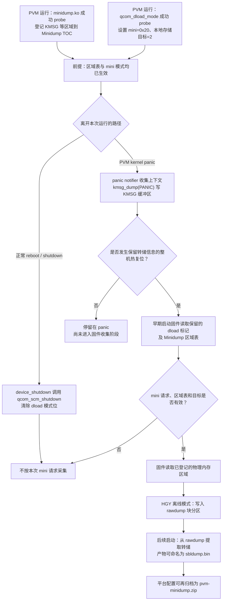

+++
title = 'SA8797 PVM panic 后的 Minidump 与 rawdump 流程'
date = '2026-09-28'
draft = false
description = '从 PVM 内核登记转储区域、panic 与复位，到启动固件写 rawdump 和下次启动提取的源码链'
categories = ['Qualcomm', 'Gunyah', '虚拟化']
tags = ['SA8797', 'PVM', 'kernel panic', 'Minidump', 'rawdump', 'boot firmware']
+++

本文说明 SA8797/HGY 平台上，**PVM kernel panic 后经整机复位，由启动固件收集 Minidump 并写入 rawdump** 的流程。这里有三个不同的动作：PVM 内核事先登记要保存的内存区域；panic 时补全日志等内容并由某条复位路径触发热复位；启动固件在下次启动早期收集并写入存储。**panic 本身不直接写 rawdump，也不保证一定发生复位。**

本文依据当前 PVM 源码、HGY minidump 指南和 Qualcomm 的公开机制说明。启动固件的具体 XBL/SBL 实现未包含在当前源码包中；实际设备是否加载了相同模块、使用哪种区域表后端，以及复位是否保留相关内存，均需按运行镜像核对。

## 1. 完整流程



图中的“是否发生热复位”和“固件是否采集”都是条件判断，不代表任意一次 PVM panic 必然产生 rawdump。固件读取区域表并写存储的通用机制见 [Qualcomm Minidump 说明](https://www.qualcomm.com/developer/blog/2024/01/minidump-new-tool-selecting-regions-ram-post-crash-analysis)；HGY 产品指南给出离线模式下的 rawdump 落点，但未公开固件内部函数。

## 2. PVM 如何预置 Minidump

### 2.1 登记需要保存的区域

当前 PVM 的外置 `minidump.ko` 驱动可匹配设备树 `qcom,minidump` 或 `qcom,minidump-rm`。前者读取 SMEM 中的全局 Minidump TOC，后者经 Gunyah Resource Manager 获取信息；实际采用哪条路径取决于部署设备树及 probe 结果。模块成功初始化后，`minidump_log.c` 注册 `KMSG` 区域和 `kmsg_dumper`，供 panic 时填充内核日志。

```text
minidump.ko probe
  → 读取 SMEM TOC 或 Gunyah RM 信息
  → 登记 HLOS/PVM 的区域地址、长度和名称
  → 注册 KMSG 缓冲区及 panic notifier
```

SMEM 后端使用名为 `SBL_MINIDUMP_SMEM_ID` 的共享内存 ID。这个名称说明区域表沿用了 SBL 命名接口，**不能单凭常量名推断具体由哪个 SBL/XBL 函数写 UFS**。HGY 指南描述 PVM 当前主要输出 ASCII 形式的 `md_KMSG.BIN`；当前模块源码还尝试登记其他区域，因此最终内容应以设备上实际加载的模块版本和产物为准。

源码入口：

- `linux/apps/apps_proc/vendor/qcom/opensource/safelinux-dbg-modules/minidump/msm_minidump.c:1180-1324`：SMEM/RM 后端、TOC 初始化和驱动匹配；
- `linux/apps/apps_proc/vendor/qcom/opensource/safelinux-dbg-modules/minidump/minidump_log.c:1607-1680`：KMSG 缓冲区、dumper 和 panic notifier；
- `linux/apps/apps_proc/vendor/qcom/opensource/safelinux-dbg-modules/minidump/minidump_private.h:11-16,49-63`：共享内存 ID 命名及 Bootloader 转储区域的注释。

### 2.2 设置收集模式与目标

`qcom_dload_mode.c` 在 probe 时通过 SCM 将 download mode 写为 `QCOM_DOWNLOAD_MINIDUMP = 0x20`，并把下载目标设为驱动枚举中的 `QCOM_DOWNLOAD_DEST_EMMC = 2`。这里的 `EMMC` 是驱动接口名称；HGY 指南给出的离线采集设备是 UFS 上的 `rawdump` 分区，不应由枚举名反推实际物理介质。若 SCM 拒绝写入，probe 会报错；若目标寄存器映射失败，驱动会记录 `emmc_dload unavailable`。因此模式和目标都要按实机分别核对。

`qcom_scm.c` 的 probe 注释明确说明：启用 download mode 后，热启动会使 boot stages 进入下载模式，除非正常关机或重启先将其关闭。

源码入口：

- `linux/apps/apps_proc/vendor/qcom/opensource/safelinux-cfg-modules/safelinux-modules/drivers/qcom_dload_mode.c:16-48,233-280`；
- `linux/apps/apps_proc/kernel/kernel_platform/kernel/drivers/firmware/qcom_scm.c:1924-1933`。

## 3. Panic 后为什么仍需要复位

PVM `panic()` 先调用 panic notifier，再调用 `kmsg_dump(KMSG_DUMP_PANIC)`。Minidump dumper 从 printk 缓冲区取日志，写入已登记的 `KMSG` 缓冲区。此时的关键结果是**内存中的区域表与内容可供固件读取**，并非 Linux 已经向 rawdump 块设备完成写入。

Panic 之后是否复位要单独判断：当前 `panic.c` 只有在 `panic_timeout != 0` 时才直接调用 `emergency_restart()`；其他 watchdog、Hypervisor 或平台复位路径也可能触发整机复位。仅看到 `Kernel panic - not syncing`，不能推断启动固件一定运行过。源码位置：`linux/apps/apps_proc/kernel/kernel_platform/kernel/kernel/panic.c:354-427`。

正常重启与紧急复位的区别在于 download mode 是否被清除：

| 路径 | PVM 内核动作 | 留给启动固件的 mini 请求 |
|---|---|---|
| 正常 `kernel_restart()` / orderly shutdown | `device_shutdown()` 调用已注册的 `qcom_scm_shutdown()`，将 dload 位域清为 `NODUMP` | 通常被清除 |
| `emergency_restart()` / 未执行 shutdown 的异常复位 | 直接进入机器级紧急复位，不调用上述设备 shutdown | 若寄存器在热复位后保留，仍可被固件看见 |

对应源码为 `kernel/reboot.c:74-88,266-277` 和 `drivers/firmware/qcom_scm.c:484-501,1966-1993`。这证明了 Linux 侧“正常路径清标记、紧急路径跳过清标记”的机制；HGY 固件是否还结合硬件 reset reason 判断，当前没有固件源码可确认。冷断电也不能按热复位的保留内存流程推断。

## 4. 启动固件如何形成 rawdump

Qualcomm 的公开说明描述通用流程：设备在故障后复位，启动固件遍历 Minidump TOC，读取其中登记的物理区域，生成转储内容，再复制到可用的存储介质。HGY 指南给出的本平台离线验证结果是从 `/dev/disk/by-partlabel/rawdump` 读取转储。

当前源码可见到接口两端，但看不到中间的专有实现：

1. PVM 驱动提供区域表，`minidump_private.h` 对 subsystem TOC 的注释也说明 bootloader 会转储启用的区域；
2. PVM 通过 SCM 设置 mini 模式和本地存储目标；
3. `pull_minidump.py` 从 `rawdump` 块设备读取，并检查 `Raw_Dmp!` 签名及 valid 标志。

`Raw_Dmp!` 头部定义中包含 `reset_trigger` 字段，但该提取脚本没有给出其枚举含义，也不能据此还原固件判断异常复位的条件。`pull_minidump.py` 把提取文件命名为 `sbldump.bin`。这是**提取工具选择的输出名**，并不能证明实际写入函数属于 SBL。当前代码清单里的启动器源码是 `abl/tianocore/edk2`；其中的 `UpdateRamDumpMemInfo()` 只更新显示转储内存的设备树地址，`LinuxLoader` 读取复位原因用于启动模式选择，均不是 rawdump 写入实现。[Qualcomm 对其他平台的说明](https://www.qualcomm.com/developer/software/ubuntu-on-qualcomm-iot-platforms/support)把崩溃后收集阶段称作 XBL，因此 XBL 是合理的候选阶段，**不能据此指定 SA8797/HGY 的 XBL/SBL 子模块或函数**。

## 5. 下次启动后的提取与 GVM 在线转储

当前 Yocto 配方将专有 `log-collector` 描述为“把存储分区里的 mini ramdump 拷贝到目标目录”；其实现源码不在当前 checkout。另一个可见工具 `pull_minidump.py` 会读取 `Raw_Dmp!` 原始头、取出有效 dump，并命名为 `sbldump.bin`。Voyah `vlogmanager` 配置以 `/var/log/qlf_dumps/trace/minidump/sbldump.bin` 为 PVM 输入，可继续归档为 `pvm-minidump.zip`。**这些提取和归档发生在后续启动的用户态，不是启动固件写盘动作本身。**

| 流程 | 触发与执行者 | 产物 |
|---|---|---|
| PVM 离线 Minidump | 整机异常热复位后，启动固件按 mini 请求收集 | `rawdump` 块设备中的原始转储；后续可提取为 `sbldump.bin` |
| GVM 在线 Minidump | GVM 退出而 PVM 仍运行，PVM 的 `vmm-ramdump` 从 Gunyah debugfs 归档 | `/rawdump/gvm_dumps/*.tar.gz` |

GVM 在线路径详见 [VMM Ramdump 服务](vmm-ramdump-service.md)。表中一个是块设备路径，一个是挂载后的文件系统目录；名字相近，执行时机和执行者不同。是否使用同一物理分区，要结合实机分区和挂载配置核实。

## 6. 尚未闭合的条件与实机核对点

- **复位触发**：本地 Yocto 生成的内核配置曾显示 `CONFIG_PANIC_TIMEOUT=0`；如果实机也如此，`panic()` 不会因该参数自行调用 `emergency_restart()`。需要结合实际 `/proc/sys/kernel/panic`、watchdog、Hypervisor 日志和复位原因确认整机为何重启。
- **模块与模式**：核对实机 `minidump.ko` 是否成功 probe、是否出现 KMSG 区域，以及 `/sys/kernel/dload/dload_mode`、`/sys/kernel/dload/emmc_dload` 和 probe 日志；不能把源码中存在驱动等同于运行态已启用。
- **固件边界**：当前源码包没有 SA8797/HGY 的 XBL Ramdump 写入实现；精确的固件镜像、函数、reset reason 条件和写盘时序，需要对应版本的固件资料或早期启动日志。
- **rawdump 格式与挂载**：`pull_minidump.py` 将分区视为 `Raw_Dmp!` 原始镜像，而 Voyah `log-mount.sh` 会把同名分区当 ext4 挂载，必要时格式化。需要先核实实际部署版本以及 `log-collector` 与挂载服务的启动顺序，才能判断转储如何保存；当前源码不足以断定实机一定保留或一定丢失。

## 7. 主要依据

- PVM 内核：`linux/apps/apps_proc/kernel/kernel_platform/kernel/kernel/panic.c`、`kernel/reboot.c`、`drivers/firmware/qcom_scm.c`；
- PVM Minidump 与模式驱动：`linux/apps/apps_proc/vendor/qcom/opensource/safelinux-dbg-modules/minidump/`、`linux/apps/apps_proc/vendor/qcom/opensource/safelinux-cfg-modules/safelinux-modules/drivers/qcom_dload_mode.c`；
- 提取与归档：`linux/apps/apps_proc/vendor/qcom/opensource/tools/minidump/pull_minidump.py`、`linux/apps/apps_proc/layers/meta-qti-automotive-prop/recipes-tools/qualcomm-logging-framework/log-collector_git.bb`、`linux/apps/apps_proc/voyah-cluster/vlogmanager/config/8397-linux/vlogmanager.pbtxt`；
- 平台参考：`HGY minidump User Guide`（Qualcomm SA8397P/SA8797P 开发资料，PVM 与离线验证章节）；[Qualcomm Minidump 机制介绍](https://www.qualcomm.com/developer/blog/2024/01/minidump-new-tool-selecting-regions-ram-post-crash-analysis)。

