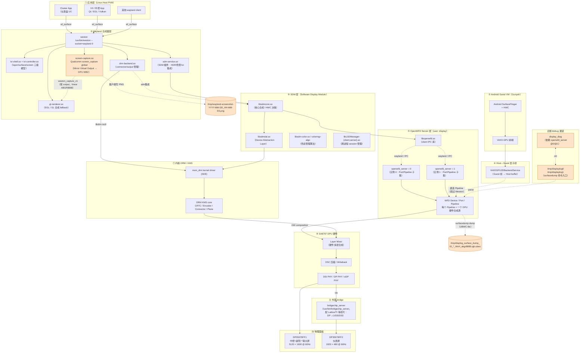

+++
date = '2026-04-22T11:00:00+08:00'
draft = true
title = 'Qualcomm 智能座舱 Display 架构调研与设计（WIP）'
tags = ["Qualcomm", "Display", "Weston", "Wayland", "IVI", "DRM", "UBWC", "Gunyah"]
+++

> **状态**：调研进行中（WIP）。本文先行记录「把车机屏幕实时推送到 PolarisGUI」这个需求引出的一次 Linux Host 显示栈调查，后续将逐步补齐 DPU / HWC / Layer Mixer / UBWC / 多屏拼接等模块，最终沉淀成一份完整的 Qualcomm 智能座舱 Display 架构设计文档。

## 1. 背景与动机

PolarisGUI 是 polaris-monitor 的 PC 端可视化前端。在调试座舱异常（如花屏、丢帧、UI 卡顿）时，研发同学希望能 **每秒把车机屏幕内容传回 PC 上的 PolarisGUI**，在远端实时观察画面。

承载 polaris-monitor 的是 Linux Host（SA8797 平台），运行在 Gunyah Hypervisor 之上作为 Host VM 的一部分；Android 作为另一 Guest VM 承担部分 UI 工作。把「屏幕」从车里传出来之前，需要先搞清两件事：

1. **Linux Host 端真正的显示后端是什么？** —— 决定我们用什么 API 抓帧。
2. **车机上有几块物理屏、怎么合成？** —— 决定抓到的是哪一块屏、尺寸多大、该不该裁切。

这次调研给出的答案，成为本文档的起点。

## 2. 整体 Display 架构（Linux Host / SA8797）

在进入细节之前，先给出 Linux Host 侧完整的显示栈。这块平台并不是"App → Weston → DRM → DPU"的普通 Linux 图形栈——真正持有 DPU 的是 Qualcomm 的 **OpenWFD Server**，Weston 只是它的一个客户端。

### 2.1 架构图



### 2.2 各层作用

| 层 | 进程 / 库 | 作用 |
|---|---|---|
| ① App | cluster / IVI / 普通 wayland client | 绘制 UI，提交 `wl_surface` |
| ② Guest | Android SurfaceFlinger + VirtIO-GPU | Android 侧 UI 渲染，通过 VirtIO-GPU 把帧交到 Host |
| ③ Weston | `/usr/bin/weston` + 一堆 `.so` | Wayland 合成器，管理 wl_output / wl_surface 生命周期、IVI 规则、合成策略 |
| ④ Host↔Guest 桥 | `VirtIOGPU2DBackendService` | 把 Android Guest 的帧接过来作为 Host 侧可用 buffer（直供 OpenWFD 或经由 Weston） |
| ⑤ OpenWFD Server | `openwfd_server -i {0,1}` | **真正持有 DPU 的服务**。以 `display:display` 用户身份运行，接收多个"源"提交的 buffer，管理 Port / Pipeline，协调 DPU 硬件合成。两个实例覆盖不同的 Port 子集（物理/虚拟显示分组）|
| ⑥ SDM | `libsdm*` | Qualcomm Software Display Module 核心库：HWC 决策（哪些层走 DPU 硬件、哪些走 GPU 合成）、色管、pipeline 配置 |
| ⑦ Kernel | `msm_drm`（SDE driver） | DRM/KMS 内核驱动，DPU 的 CRTC/Encoder/Connector/Plane 抽象 |
| ⑧ DPU | SA8797 Display Processing Unit | 硬件 Layer Mixer（N 路硬件层合成）、DSC 压缩、Writeback 通道 |
| ⑨ Ext bridge | `bridgechip_server` | 如果物理接口需要 DP→LVDS/DSI 转换（常见于仪表屏），外部 bridge IC 由此服务配置 |
| ⑩ 物理屏 | DP0 / DP3 | 两块 DisplayPort 实际面板 |

### 2.3 关键认知

1. **Weston 并不独占 DPU**。它通过 `drm-backend.so` 看到 DRM connector，但最终合成指令下发需经 SDM/OpenWFD 协调——这解释了为什么 adb shell 里看不到 `/dev/dri` 节点：真正的 DPU 所有权在 OpenWFD 进程的 namespace 里。
2. **OpenWFD Pipeline = DPU 硬件合成层的抽象**。一个 Pipeline 对应 DPU Layer Mixer 的一路输入，它的 buffer 可能来自 Weston 的某个 wl_surface（HW 合成路径）、Weston GL 合成后的 fallback 输出、Android Guest 帧、camera 视频流等。
3. **Android Guest 帧绕过 Weston**。VirtIO-GPU → `VirtIOGPU2DBackendService` 后**直接挂到 OpenWFD Pipeline**，不经过 Weston 合成器。因此 `weston_capture_v1` 不可能抓到 Android 内容——这一点对截屏方案选型是关键约束，见 §5.6。
4. **`surfacedump` 抓的是 Pipeline 层 buffer，不是 wl_surface**。见 §3.4 的详细说明。
5. **两条截屏通道在不同层**：
    * `weston-screenshooter` → `weston_capture_v1` 协议 → 在 Weston 合成器层（③）取帧；**`--debug` 门控**（§5.5），看不到 Android（§5.6）
    * `surfacedump` → display_diag → OpenWFD Pipeline → 在 OpenWFD 层（⑤）取帧；看得到所有 Pipeline（含 Android）

## 3. 调查过程（Linux Host 侧）

所有命令都在开发机通过 `adb -s e66b06ea shell` 登录车机 root 终端后执行，内核为 `Linux sa8797 6.6.110-rt61-debug … PREEMPT_RT aarch64`。

### 3.1 显示后端探测

```bash
# DRM / framebuffer 节点
ls /dev/dri/        # → No such file or directory
ls /dev/fb*         # → No such file or directory
```

在 adb shell（已是 root）里看不到 `/dev/dri/card*` 或 `/dev/fb0`。初判是这个 shell 所处的 mount namespace 把 DRM 设备节点隐藏了；真正持有 DRM fd 的是 Host 里的显示服务进程。

```bash
# Wayland 运行时
ls -l /run/user/0/wayland-0
# srwxrwxrwx 1 root root 0 Apr 22 10:15 /run/user/0/wayland-0
find /run -maxdepth 4 -name 'wayland-*'
# /run/user/0/wayland-0
# /run/user/0/wayland-0.lock
```

`/run/user/0/wayland-0` 确认这是 **Wayland 合成器**，socket 由 root 持有、权限 0666（实际仍受 compositor 的 SO_PEERCRED 校验限制）。

```bash
ps -ef | grep -iE 'weston|compositor'
# root 4722 /usr/bin/weston --idle-time=0 --socket=wayland-0 \
#            --modules=systemd-notify.so,compositor-pm-ds-snservice.so \
#            --log=/tmp/weston.log --debug
```

Compositor = **Weston**，带有 Qualcomm 电源管理的专用 module `compositor-pm-ds-snservice.so`。

### 3.2 Weston 配置与加载模块

```bash
cat /etc/xdg/weston/weston.ini   # 或 find /etc -name weston.ini
```

```ini
[core]
require-input=false
shell=ivi-shell.so
modules=ivi-controller.so
idle-time=99999999
repaint-window=15

[shell]
locking=true
```

核心信息：

* `shell=ivi-shell.so` + `modules=ivi-controller.so` —— 使用 **IVI Shell** 而非桌面 shell（desktop-shell）。IVI Shell 是汽车/工业场景专用 shell，Layer/Surface 的位置、可见性、z-order 全部由外部控制器通过 `ivi-controller` 协议编排，而不是用户通过窗口管理器拖拽。
* `require-input=false` —— 不强依赖输入设备，适配仪表盘等纯输出屏。

从 `/tmp/weston.log` 提取关键信息：

```
[10:15:05.867] Output repaint window is 15 ms maximum.
[10:15:05.883] Registered plugin API 'weston_drm_output_api_v1' of size 40
[10:15:05.914] DRM: head 'DP0S078FF1' found, connector 16780217 is connected
[10:15:05.915] DRM: head 'DP3S078FF2' found, connector 16780218 is connected
[10:15:05.943] Loading module '/usr/lib/libweston-13/screen-capture.so'
               dmabuf support: modifiers
               screen capture uses y-flip: yes
[10:15:05.986] Output 'DP0S078FF1' attempts EOTF mode: SDR
…            mode 5120x1600@60.0, current
…            mode 1920x480@60.0, current
```

总结出来的物理拓扑：

| Connector       | 作用                         | 分辨率          |
|-----------------|------------------------------|-----------------|
| `DP0S078FF1`    | 中控 + 副驾 一联大屏         | **5120 × 1600 @ 60Hz** |
| `DP3S078FF2`    | **仪表屏（Cluster）**        | **1920 × 480 @ 60Hz**  |

两块屏通过 DisplayPort 挂到 DPU，由同一个 Weston 进程负责合成。额外加载的 `libweston-13/screen-capture.so` 是 Qualcomm 魔改的截屏模块，支持 dmabuf + modifiers，自动处理 y-flip。

### 3.3 Screenshot 实测

```bash
export XDG_RUNTIME_DIR=/run/user/0
export WAYLAND_DISPLAY=wayland-0
cd /tmp
time weston-screenshooter
# real 0m0.76s   user 0m0.65s   sys 0m0.02s

file /tmp/wayland-screenshot-2026-04-22_11-41-34.png
# PNG image data, 7040 x 1600, 8-bit/color RGBA, non-interlaced
ls -lh /tmp/wayland-screenshot-2026-04-22_11-41-34.png
# 45K
```

**输出文件位置**：`weston-screenshooter` 把 PNG 写到**当前工作目录**下，文件名固定格式 `wayland-screenshot-%Y-%m-%d_%H-%M-%S.png`（见上游 `clients/screenshot.c` 的 `strftime` 调用）。没有 CLI 参数可以自定义路径；程序直接 `fopen(filename, "wb")`，cwd 不可写就会失败。所以在脚本/服务里调用时务必先 `cd` 到目标目录（常见的是 `/tmp` 或一个专属 cache 目录）。

关键观察：

* **尺寸 7040 × 1600** 刚好是 `5120 + 1920 = 7040`，`max(1600, 480) = 1600` —— 两块屏**并排塞进一个 bounding-box canvas** 返回给客户端（合成方式见 §5.3，客户端拼接）。
* **耗时 ~760ms**，其中大头是 PNG 编码（user 态 650ms）；I/O 忽略。
* **必须以 root 身份运行**，把 `XDG_RUNTIME_DIR` 指向 `/run/user/0`；以 `display` 用户执行失败（`failed to create display: Permission denied`），推断 Weston 对 peer 做了 uid 校验。

### 3.4 与 surfacedump 的对比

Qualcomm 这边有一条基于 **`display_diag` + OpenWFD** 的 debug 通道。它由 `/usr/bin/display_diag` 服务（`Requires=openwfd_server_@0.service openwfd_server_@1.service`）消费命令文件 `/tmp/displaylog{0,1}` —— 一个文件对应一个 `openwfd_server` 实例。

触发一次 dump：

```bash
echo 'surfacedump=0xff 5' | runuser -u display -- tee /tmp/displaylog0 > /dev/null
```

* 触发方式必须用 `runuser -u display -- tee`，而不能直接 `> /tmp/displaylog0`：因为重定向由当前 shell 的 root 身份做，文件 owner 变成 root；display_diag 对该文件做 owner/uid 校验，需要真正以 `display` 用户身份写入文件。
* 参数 `0xff` 是 dump 类别的 bitmask（pipeline buffer / fence / port state / blend config 等全开），`5` 是次数或持续秒数。

得到的产物形如：

```
/tmp/displog_surface_dump_14_[01:22:30.058]_1920x480_abgr8888.rgb.ubwc
                            └── Pipeline ID / Layer ID
```

#### surfacedump 抓的是什么？—— **OpenWFD Pipeline 层 buffer，不是 wl_surface**

这是容易被误解的点。它抓的 **不是** Weston 管辖的 `wl_surface`（也就是 App 提交到合成器的那一层），而是 **OpenWFD 内部 Pipeline 正在持有的 buffer**：

* 每个 **WFD Pipeline** 对应 SA8797 DPU **Layer Mixer 的一路输入**（硬件合成通道）
* 这路输入的 buffer 来源视 SDM/HWC 决策而定：
  * 某个 wl_surface 被判定走 **硬件合成**（直接挂 DPU plane）→ Pipeline buffer = 该 wl_surface 的原始 buffer
  * 多个 wl_surface 走 **GPU fallback** → Weston 用 `gl-renderer.so` 先合成到一张中间 buffer，再交给 Pipeline
  * Android Guest 的帧经 VirtIO-GPU 直接挂到某个 Pipeline
  * camera / video 流也可挂 Pipeline
* 文件名里的 **`14`** 是 Pipeline/Layer ID（不是 pid），每次 `surfacedump=0xff N` 会遍历所有启用的 Pipeline，给每个都存一份 buffer

示例文件尺寸 `1920 × 480` 之所以恰好等于仪表屏物理尺寸，是因为仪表那块屏（DP3）**只有一个全屏 Pipeline**（Cluster App 覆盖全屏，没有其他覆盖层），所以 "Pipeline buffer" 就等于 "Cluster App 的 wl_surface buffer"。在中控大屏（DP0）上做 surfacedump 会看到**多个不同 ID 的 Pipeline dump 文件**，每个对应一块硬件合成层，尺寸可能各不相同。

色彩格式 `abgr8888`，后缀 `.ubwc` 表示当前仍是 **UBWC (Universal Bandwidth Compression)** 压缩态。UBWC 是 Qualcomm 私有的 tile-based 带宽压缩格式：

* 在 DPU / GPU / Camera 管线里数据恒以 UBWC 压缩态流转，节省内存带宽
* 文件里保存的是**原始压缩 payload + meta plane**，线性代码不能直接 `read()` 当 RGBA 使用
* 解压需 Qualcomm 的 `libubwc` 或 `ubwc-tool`，输出线性 ABGR8888 后才能给 PNG/JPEG 编码器

## 4. 结论：两条截屏流水线的本质差异

两者都叫"截屏"，但在架构图里处在**完全不同的层**，抓的语义、产物也完全不同：

```
 App (Cluster / IVI / ...)
    │ eglSwapBuffers / wl_surface.attach
    ▼
 wl_surface  ◄─── weston_capture_v1 抓（按 output；§5）
    │
    ▼
 Weston compositor
   · ivi-shell + ivi-controller 决定每个 surface 贴到哪块 output 的哪块区域
   · SDM/HWC 决策：哪些 surface 走 DPU 硬件层、哪些走 gl-renderer GPU 合成
   · screen-capture.so 提供 weston_capture_v1 + Qualcomm screen_capture 两个 global
    │
    ▼
 OpenWFD Server (openwfd_server -i 0/1)
   · 每个 Port 对应一个物理/虚拟 output
   · 每个 Port 下若干 Pipeline = DPU Layer Mixer 的硬件合成输入
   · Pipeline buffer 来源：
       - Weston 的 wl_surface（HW 合成路径）
       - Weston gl-renderer 的合成 fallback 输出
       - Android Guest 经 VirtIO-GPU 的帧
       - 摄像头 / 视频流
    │
    │ ◄─── surfacedump 在这里抓（按 Pipeline；§3.4）
    │       · 文件 /tmp/displog_surface_dump_<pipeline_id>_*_WxH_abgr8888.rgb.ubwc
    │       · UBWC tile 压缩态，需 libubwc 解
    ▼
 SDM → msm_drm (kernel) → DPU Layer Mixer → DSC/Writeback
    │
    ├──► DRM port DP0  (5120 × 1600)  ──► 中控 + 副驾物理屏
    └──► DRM port DP3  (1920 × 480)   ──► 仪表物理屏（可能经 bridgechip）
```

`weston_capture_v1` 的 `writeback` source 会尽量借 **DPU Writeback 通道**直接抓合成结果，避免 CPU 拷贝——这也是为什么在架构图上它既从 Weston 层出发又贯穿到 DPU 的原因。

| 维度         | `surfacedump`                                | `weston-screenshooter` / `weston_capture_v1`   |
|--------------|----------------------------------------------|------------------------------------------------|
| 抓取层       | **OpenWFD Pipeline**（DPU 硬件合成层输入）    | **Weston 合成器**（按 wl_output）              |
| 内容粒度     | 单个 Pipeline 的 buffer（硬件合成一路）       | 单个 wl_output 的合成输出（整块屏幕）          |
| 典型产物     | 仪表屏：1920×480（Cluster app 全屏单层）<br>中控大屏：多个 Pipeline，尺寸各异 | 单屏 5120×1600 或 1920×480；工具默认会全屏枚举拼成 7040×1600 |
| 像素格式     | ABGR8888 **UBWC tile**（需解压）             | 线性 ABGR8888（`DRM_FORMAT_MOD_LINEAR`）        |
| 触发方式     | 写 `/tmp/displaylog{0,1}`（display 用户）     | wayland 客户端协议 `weston_capture_v1`          |
| 消费进程     | `display_diag` + `openwfd_server`            | Weston 合成器本身                                |
| 权限         | `display` 用户（由 display_diag 校验）         | 通常需 root + `XDG_RUNTIME_DIR=/run/user/0`     |
| 文件落盘     | `/tmp/displog_surface_dump_<pid>_*_WxH_abgr8888.rgb.ubwc` | `<cwd>/wayland-screenshot-%Y-%m-%d_%H-%M-%S.png`（cwd 决定位置） |
| 典型用途     | 逐层诊断花屏 / HWC 合成 bug / Pipeline 配置错误 | 整屏快照 / 远端预览 / 自动化 UI 截图             |

## 5. 抓帧协议深究

第一轮调查留了一个疑问：「7040×1600」是合成器真实存在的一张大 framebuffer，还是 `weston-screenshooter` 自己拼出来的？这直接决定能不能单抓仪表屏。本节对此做彻底验证。

### 5.1 `weston-screenshooter` 没有 CLI 参数可选 output

```bash
weston-screenshooter --help        # 无输出
weston-screenshooter -h            # 无输出
weston-screenshooter -o DP3S078FF2 # 参数被忽略，依然抓全屏
```

`strings /usr/bin/weston-screenshooter` 抽出的字符串也没有任何 `--output` / usage 相关常量。这是 upstream weston 自带工具的**刻意设计**——它认为应该 "capture everything"，选屏的能力下放给协议本身。

### 5.2 底层协议 `weston_capture_v1` 本就是按 output 的

上游协议文件在 `/usr/share/libweston-13/protocols/weston-output-capture.xml`，核心请求：

```xml
<interface name="weston_capture_v1" version="1">
  <request name="create">
    <arg name="output" type="object" interface="wl_output"/>
    <arg name="source" type="uint" enum="source"/>
    <arg name="capture_source_new_id" type="new_id"
         interface="weston_capture_source_v1"/>
  </request>
</interface>
```

**`create(wl_output, source)`** —— 创建 capture source 时必须绑定一个 `wl_output`，即「抓哪块屏」在协议层已经参数化了。

`source` 枚举四种模式，代价递增：

| source              | 值 | 语义                                                     | 代价                          |
|---------------------|----|----------------------------------------------------------|-------------------------------|
| `writeback`         | 0  | 用 DRM KMS 的 hardware writeback 通道                     | **不打断 hw plane**，车机首选 |
| `framebuffer`       | 1  | 从最终 framebuffer 拷贝                                   | 临时禁用 hw plane，扰动 DPU   |
| `full_framebuffer`  | 2  | 同 framebuffer，外加 border                              | 同上                           |
| `blending`          | 3  | 从 linear-light 混合 buffer 拷贝（仅色管启用时可用）        | 禁用 hw plane                  |

协议保证的输出格式：`DRM_FORMAT_MOD_LINEAR` 线性 ABGR8888——客户端拿到的不是 UBWC，直接可用。

事件流：
```
create → weston_capture_source_v1
         ↓ 初始事件 'format' (drm_format) + 'size' (w, h)
         ↓ 客户端按尺寸/格式分配 wl_shm buffer
         ↓ 调用 capture(wl_buffer)
         ↓ 'complete' / 'retry' / 'failed'
```

### 5.3 7040×1600 = 客户端拼接的产物，不是合成器的真实大画布

用 `weston-debug` 从合成器抽场景图：

```bash
XDG_RUNTIME_DIR=/run/user/0 WAYLAND_DISPLAY=wayland-0 \
    weston-debug scene-graph > /tmp/scene-graph.txt
```

关键片段：

```
Output 0 (DP0S078FF1):
    position: (0, 0) -> (5120, 1600)       ← 中控 + 副驾，独立 wl_output
Output 1 (DP3S078FF2):
    position: (5120, 0) -> (7040, 480)     ← 仪表屏，独立 wl_output
        position: (5120, 0) -> (7040, 480)
            width: 1920, height: 480
```

Weston 内部**两个独立的 `wl_output`**，按 logical 坐标**横向并排**放置。`weston-screenshooter` 的实际工作流是：

1. 从 registry 枚举所有 `wl_output`
2. 对每块 output 单独 `weston_capture_v1.create(output, framebuffer)` 拿到 `weston_capture_source_v1`
3. 分别 `capture(buffer)`，拿回 N 张独立的线性 ABGR8888 图
4. 读取每个 `wl_output` 的 `geometry` 事件获得 logical position
5. **在客户端内存里按 position 拼成 bounding box**（本机 `max_x=7040, max_y=1600`）
6. PNG 编码，写盘

所以 **7040×1600 纯粹是客户端拼接产物**，合成器侧并没有这么大的 framebuffer 存在。仪表屏数据在 PNG 的 `[5120..7040, 0..480]` 区域里，外围其余像素是 DP3 小屏 y=480~1600 的"留白"。

### 5.4 Qualcomm 私有 wayland 接口 `screen_capture`（源码实证版）

> **首轮（strings 反推版）的完整推断**保留在本节末尾 §5.4.7，对照用；2026-04-22 第三版后用源码实证替换。

源码在 Yocto 树里是开源的：

```
vendor/qcom/opensource/display/weston-sdm-extension/
├── protocol/screen-capture.xml         ← 协议 XML 原件
├── sdm-backend/screen-capture.c        ← Weston 侧实现（编译出 screen-capture.so）
└── include/screen-capture.h            ← 内部 C ABI
```

#### 5.4.1 协议接口

`interface name="screen_capture"`，version=1。对象即 factory 本身（没有 `create_capture_source` 的分层），生命周期管理一体化：

| 请求                                        | 作用                                               |
|---------------------------------------------|----------------------------------------------------|
| `create_screen(wl_output, width, height)`   | 为指定 output 创建 capture pipeline，期望 WxH 尺寸 |
| `start()`                                   | 从下一帧开始抓取                                    |
| `stop()`                                    | 停止抓取；attached buffers 被释放                   |
| `destroy_screen()`                          | 销毁 capture 对象                                   |
| `destroy()` (destructor)                    | factory 析构                                        |

| 事件           | 时机                              |
|----------------|-----------------------------------|
| `created`      | `create_screen` 成功              |
| `failed`       | `create_screen` 失败              |
| `started`      | `start` 成功，可以 attach buffer  |
| `stopped`      | `stop` 成功                       |
| `destroyed`    | `destroy_screen` 成功             |

#### 5.4.2 "Mirror Virtual Output" 模型（关键架构）

`screen_capture_create_screen` 的核心（`sdm-backend/screen-capture.c:85`）：

```c
mirror_head = wl_resource_get_user_data(output_resource);
mirror_output = mirror_head->output;
screen_cap->virtual_output = screen_capture_create_virtual_display(mirror_output);
screen_cap->mirror_output = mirror_output;
screen_cap->mirror_output_id = mirror_output->id;
b->screen_cap = screen_cap;
```

即 **开一个虚拟 `drm_output` 镜像指定的物理 output**。DPU/Weston 把这个虚拟 output 当作普通合成目标对待，但它的 "scanout" 不去物理面板，而是写入客户端提供的 **GBM buffer**。由于虚拟 output 与物理 output 共享同一视图树、同一 Layer Mixer 配置，**它抓到的就是该物理屏的完整 DPU 合成结果**——含 Android Guest 在内的所有硬件层（§5.6 的痛点在本方案下自动消解）。

`screen_capture_create_virtual_display` 在当前 opensource 快照里是**半桩实现**：

```c
/* vendor/.../sdm-backend/screen-capture.c:51 */
static struct drm_output *
screen_capture_create_virtual_display(struct weston_output *mirror_output)
{
    struct drm_output *output = zalloc(sizeof *output);
    //TODO: Create SDM virtual display
    output->base = *mirror_output;  // 只是拷贝了 weston_output 结构
    return output;
}
```

这个 `//TODO: Create SDM virtual display` 说明**车机实际运行的 `screen-capture.so` 比这份快照新**——SDM 侧有独立的 virtual display 对接实现（估计在 `sdm-service` 的 SDM HAL 里完成，或者内部仓库比 opensource 树更新）。生产 `.so` 里 TODO 已填，我们看到的 opensource 快照停在"协议层完成、SDM 桩待接"。

#### 5.4.3 Buffer attach 通道：复用标准 Wayland + GBM flag

最巧妙的设计点——**协议 XML 本身没有 `attach` 请求**（对比 `weston_capture_v1` 的 `capture(wl_buffer)`）。客户端走的是**常规 Wayland 路径**：

```c
/* 客户端 */
gbm_buf = gbm_bo_create_with_modifiers2(..., GBM_BUFFER_PARAMS_FLAGS_SCREEN_CAPTURE);
wl_buffer = gbm_buffer_backend_create_buffer(gbm_buf);
wl_surface_attach(wl_surface, wl_buffer, 0, 0);
wl_surface_commit(wl_surface);
```

Weston 侧在 `gl_renderer_attach` hook 里拦截：`sdm-backend/screen-capture.c:247 screen_capture_attach()` 检测 buffer 是不是 GBM 且带 `GBM_BUFFER_PARAMS_FLAGS_SCREEN_CAPTURE`，是则加入 `screen_cap->attached_buf_list`。之后 mirror output 每次重绘都消耗 list 中一个 buffer 作为 scanout 目标。

```c
/* screen_capture_attach 伪代码梗概 */
if (!gbm_buf) return;
if (gbm_buf->flags & GBM_BUFFER_PARAMS_FLAGS_SCREEN_CAPTURE) {
    if (buffer->width != screen_cap->width ||
        buffer->height != screen_cap->height) {
        SC_LOG_ERR("invalid w/h of capture buffer!");   // ← strings 里看到的那条
        return;
    }
    /* 入队等待虚拟 output 的下一帧合成 */
    wl_list_insert(screen_cap->attached_buf_list.prev, &capture_buf->link);
}
```

这解释了为什么首轮 strings 里有 `gbm_buffer_backend_c_interface` 却找不到"`screen_capture_attach` 作为 wayland 请求"——attach 是 C 内部回调，不走 wire protocol。

相关协议同目录并列：`protocol/gbm-buffer-backend.xml` 定义 `gbm_buffer_backend` 接口，用于客户端向合成器注册 GBM buffer 并拿到 `wl_buffer`。这个接口也是**专属**的（非上游 wayland），客户端必须链接它的生成代码。

#### 5.4.4 硬件后端：DPU Writeback 2 (WB2)

`wait_for_release()`（`screen-capture.c:132`）的日志字符串：

```c
SC_PROTOCOL_LOG(SC_LOG_ERR, "fail to wait for display WB2 composition!\n");
```

坐实底层是 **DPU Writeback 2 硬件通道**——SA8797 DPU 专门用于"把 Layer Mixer 合成结果写到内存 buffer"的硬件块。使用 WB2 的好处：

* **零 CPU 开销**：DPU 直接把合成 pixel 写到客户端 dmabuf，Weston/CPU 不参与 pixel 数据
* **内容完整**：WB2 位于 Layer Mixer 之后，所有硬件层（Weston 路、Android 路、camera 路）都在合成视野内
* **帧率原生**：与物理屏同步，每帧都有机会抓

`wait_for_release` 内还通过 `poll(fence_fd, POLLIN, 1000)` 等 explicit fence，说明 DPU WB2 完成时会给每个 buffer 返回一个 sync_file fence，客户端（或 Weston 清理路径）在真正读 buffer 前必须等 fence signal。

#### 5.4.5 Fallback：GPU 合成

`screen_capture::fallback_gpu` 字段（`include/screen-capture.h:78`）。当 WB2 被占用或不可用时，降级到 `gl-renderer` 把各 `weston_view` 重新渲染到 capture buffer——和正常的 GL 合成同路径，只是目标 framebuffer 换成客户端的 GBM dmabuf。代价是一次 GPU pass，但仍然零 CPU 拷贝。

此模式下**抓不到 Android 直通层**——原因和 §5.6 相同：`gl-renderer` 只能看到 Weston 管理的 `weston_view`，Android 经 VirtIO-GPU 直连 OpenWFD Pipeline，不在 Weston 视图树里。所以 `fallback_gpu=true` 时，这个接口也会陷入"Android 空白"的境地。

**结论**：真正能吃到"含 Android 完整画面"的前提是 **DPU WB2 可用**。部署时要先确认 SA8797 在目标工况下 WB2 是空闲的；WB2 若长期被 camera preview 等业务占用，本方案效果等同于 `weston_capture_v1`。

#### 5.4.6 生命周期

典型客户端时序：

```
→ wl_registry.bind(screen_capture)
→ screen_capture.create_screen(wl_output_DP0, 5120, 1600)
← screen_capture.created
→ screen_capture.start()
← screen_capture.started
→ loop {
    gbm_bo_create(GBM_BUFFER_PARAMS_FLAGS_SCREEN_CAPTURE)
    wl_surface.attach(buffer) + commit
    ← wl_buffer.release (frame 已写入)
    // 读 dmabuf → 编码/上报
  }
→ screen_capture.stop()
← screen_capture.stopped
→ screen_capture.destroy_screen()
← screen_capture.destroyed
→ screen_capture.destroy()
```

**独占粒度**：每个 `screen_capture` factory 对象持有一个 `virtual_output`；一个 wl_client 内部可以创建多个 factory，各自抓不同 output。但同一个 output 的并发抓取行为未验证——源码里 `b->screen_cap = screen_cap;` 把最新创建的 capture 覆盖写到 drm_backend，暗示**同一 backend 下只允许一条抓取 pipeline**。多 client 并发抓同一屏可能冲突。

#### 5.4.7 首轮 strings 反推版（留档对照）

首轮从 `strings /usr/lib/libweston-13/screen-capture.so` 反推的协议轮廓（与源码核对后部分正确、部分偏差），保留备查：

```
── wayland 全局/请求名 ──
bind_screen_capture
screen_capture                        ✓ 确为 global interface 名
screen_capture_create_screen          ✓ 协议请求
screen_capture_attach                 ✗ 实际不是协议请求，是 C 内部回调
screen_capture_c_interface            ✓ C ABI 导出

── 依赖 ──
wl_output_interface                   ✓ create_screen 的参数
wl_global_create                      ✓ 注册全局
gbm_buffer_backend_c_interface        ✓ GBM 后端 → dmabuf

── 错误/日志消息 ──
"another client has already started screen capture!" ← 与源码不完全对应，可能是生产态新增校验
"buffer: w=%d, h=%d; screen: w=%d, h=%d"  ← screen-capture.c:290 printf，尺寸不匹配时打印
"invalid w/h of capture buffer!"          ← screen-capture.c:289 SC_LOG_ERR
"screen is already created!"              ← screen-capture.c:106 wl_resource_post_error
"screen is already destroyed!"            ← 源码无直接对应，推测是新版校验
```

偏差原因：生产 `.so` 比 opensource 快照新（填了 virtual display 的 SDM 对接、加了并发/生命周期校验），但**协议层核心（global 名、create_screen 签名、Mirror Virtual Output 模型、GBM buffer flag 通道、WB2 后端）全部正确**。

```
── wayland 全局/请求名 ──
bind_screen_capture
screen_capture                        (预测是 global interface 名)
screen_capture_create_screen          (请求: 创建 capture target)
screen_capture_attach                 (请求: 把 buffer/output attach 上来)
screen_capture_c_interface            (C ABI 导出)

── 依赖 ──
wl_output_interface                   (按 output 选屏的证据)
wl_global_create                      (注册全局)
gbm_buffer_backend_c_interface        (GBM 后端 → 支持 dmabuf)

── 错误/日志消息 ──
"another client has already started screen capture!"   (单客户端独占)
"buffer: w=%d, h=%d; screen: w=%d, h=%d"               (buffer vs screen 尺寸校验)
"invalid w/h of capture buffer!"
"screen is already created!"
"screen is already destroyed!"
```

据此推断协议轮廓（**尚无 XML 验证**，属于 Qualcomm BSP 私有）：

- **Global 名**：`screen_capture`
- **请求**：
  - `create_screen` —— 创建一个 capture screen（大概绑 `wl_output` + 期望尺寸）
  - `attach` —— attach 一个 buffer（大概率支持 GBM/dmabuf）
  - `destroy` —— 配对释放
- **语义**：**单客户端独占**（有 "already started" 冲突错误）
- **Buffer 后端**：支持 **GBM** → **dmabuf zero-copy**，比 `weston_capture_v1` 走 `wl_shm` 再 CPU 拷贝高效得多

**用不用**得看两件事：(1) 能不能从 Qualcomm BSP 拿到协议 XML 或参考客户端；(2) 以 polaris-monitor 的算力预算 `wl_shm` 路径是否够用。初判 1fps 下 `weston_capture_v1` 完全足够，Qualcomm 私有接口留作将来做高帧率预览（≥10fps）时再启用。

### 5.5 `weston_capture_v1` 是 `--debug` 门控的特权协议

协议文件 `weston-output-capture.xml` 在首段就标注：

> **This is a privileged inteface.**

Upstream Weston 把 `weston_capture_v1` / `weston_debug_v1` / `weston_log_v1` 三个全局绑在 `weston_compositor_enable_debug_protocol()`，**仅当 `weston` 以 `--debug` 启动时才注册到 `wl_registry`**。没有 `--debug`，客户端 `wl_registry.bind` 根本看不到这个接口——对应 `weston-screenshooter` 二进制里那条 `"Error: display does not support weston_capture_v1"`。

实测佐证：本机 `weston.service` 的 ExecStart 包含 `--debug` 所以截屏成功；把 `--debug` 去掉后 `weston-screenshooter` 立即失败。

这是安全设计：

* 截屏本身是**特权操作**（涉及其他 client 的 surface 内容）
* `--debug` 同时会暴露 `weston_debug_v1` / `weston_log_v1`，连带开放协议 trace、场景图 dump 等信息通道
* 所以生产镜像默认**不带 `--debug`**，此时 `weston-screenshooter` 不可用

**对 polaris-monitor 的启示**：不能假设生产环境下 `weston_capture_v1` 存在。可行的三条路：

1. **在 `weston.service` 里保留 `--debug`** —— 简单但暴露过多内部接口，仅作 PoC；
2. **走 Qualcomm 私有 `screen_capture`（`screen-capture.so` 提供）** —— 它由 `modules=` 静态加载，**不受 `--debug` 门控**，是生产态的首选；协议还原见 §5.4；
3. **改 Weston 源码或补丁**：把 `weston_compositor_add_capture_protocol_support()` 从 `--debug` 分支移出、或加一个 `weston.ini` 的专项开关，只暴露 capture 不暴露 log/debug。相对侵入式。

### 5.6 为什么 `weston-screenshooter` 抓出来的 PNG 里 Android 区域是空白的

实测把 PNG 拉回本地看，会发现**中控大屏上 Android 占据的矩形区域是空白（或透明/黑）**，只有 Linux Host 原生的 UI 能被抓到。这不是 bug，而是 §2 架构图的直接推论：

```
Android Guest ──VirtIO-GPU──> VirtIOGPU2DBackendService ─┐
                                                         ▼
                                               OpenWFD Pipeline A ──┐
                                                                    ├──> DPU Layer Mixer ──> 物理屏 DP0
                                                                    │
Linux App ──wl_surface──> Weston ──gl 合成──> OpenWFD Pipeline B ──┘
                              ▲
                              └── weston_capture_v1 source=framebuffer 在这里抓
```

协议里 `framebuffer` source 的定义是 "copy the contents of the final framebuffer"——但这里的 **"final framebuffer" 是 Weston 自己的 GL 合成输出，不是 DPU Layer Mixer 合成后的完整画面**。Android 的帧走 VirtIO-GPU 直接交到 OpenWFD 的独立 Pipeline，**完全绕过 Weston**，因此 `weston_capture_v1` 永远看不到它。

要得到含 Android 的"真·整屏"，只有两条路径：

| 路径 | 接入点 | 能见度 | 可用性 |
|---|---|---|---|
| **`weston_capture_v1 source=writeback`** | DPU Writeback 通道（硬件 Layer Mixer 输出后） | 所有硬件层（含 Android） | 协议语义明确，但需 DPU 有空闲 writeback pipe + `sdm-service.so` 配合；上游协议注明 *"This source is often not available"* |
| **Qualcomm 私有 `screen_capture`（OpenWFD 侧）** | 与 `surfacedump` 同层（OpenWFD Pipeline），有能力访问合成后结果或 Writeback 输出 | 所有 Pipeline（含 Android）| 协议未公开，但 `screen-capture.so` 生产态总在，不受 `--debug` 门控 |

简言之：

* **只要 Linux Host 自己的 UI** → `weston_capture_v1 source=framebuffer` 够用；
* **要整屏真实镜像（含 Android/camera/其他 Guest）** → 必须走 DPU writeback 或 OpenWFD `screen_capture`；
* **surfacedump** 虽然抓的是"单个 Pipeline"，但**它看得到 Android**（因为 Android 本身就是一个独立 Pipeline）。这是 surfacedump 相对 `weston-screenshooter` 的另一个重要差别：**可见范围覆盖全系统，不受 Weston 命名空间限制**。

### 5.7 重要修正

初稿 §3 的流水线图里写到 "weston-screenshooter 抓合成后的最终 framebuffer"，表述不精确，已更新为"按 output 单独抓 + 客户端拼接"。这个修正影响方案取舍：**避开全屏抓取最简单的路径不是裁切**，而是**让客户端只枚举 DP3 这一个 `wl_output`**——前提是 DP3 上只跑 Linux Host 原生仪表 app（若有 Android 层会被漏掉）。

## 6. 对「屏幕推到 PolarisGUI」的方案取舍

经过 §5 的协议层验证，方案选型需要同时考虑两个约束：

* **约束 A**：生产态 `weston.service` 通常**不带 `--debug`**，`weston_capture_v1` 不可用（§5.5）
* **约束 B**：`weston_capture_v1` 抓不到 Android Guest 层（§5.6）—— 中控大屏真实画面需走 DPU writeback 或 OpenWFD 私有接口

由此方案排序刷新如下。

### 6.1 如果要的是仪表屏（debug 态 / PoC 首选）

仪表屏 1920×480，对应 `wl_output` = `DP3S078FF2`；DP3 面板上通常只有 Linux Host 原生 Cluster App，**没有 Android 层**，约束 B 不触发。只要 `weston.service` 保留了 `--debug`（满足约束 A），直接写一个最小 wayland 客户端（~200 行 C）即可：

```
1. wl_display_connect → 取 registry
2. 枚举 wl_output：收集 xdg_output/wl_output.geometry 的 model 字符串
3. 匹配 model == "DP3S078FF2" 的那个 wl_output
4. bind weston_capture_v1 global
5. weston_capture_v1.create(dp3_output, source=writeback)
   （若 writeback 失败 fall back 到 framebuffer）
6. 等 'format' + 'size' 事件，wl_shm 分配 1920×480 ABGR8888 buffer
7. capture(buffer) → 等 'complete'
8. libjpeg encode Q70 → 上报 polaris 通道
```

优点：
- **无浪费**：直接拿到 1920×480 linear ABGR8888，不经 PNG 编解码、无裁切
- **协议稳定**：`weston_capture_v1` 是 upstream weston 公开协议，不锁定 Qualcomm BSP
- **首选 writeback source**：如果 SA8797 的 DPU 有空闲 writeback pipe，不打断 hw plane，对合成器零干扰

### 6.2 备选：继续用 `weston-screenshooter` + 客户端裁切（工程最快）

polaris-monitor fork `weston-screenshooter` 子进程 → libpng 解 → 裁 `[5120..7040, 0..480]` → libjpeg encode。不改代码就能链路先跑通，但：

* 浪费 DP0 的 5120×1600 一次抓取 + PNG 编解码 + 每秒 fork
* 只适合做 PoC 验证整条上报链路

### 6.3 生产态首选：走 Qualcomm 私有 `screen_capture`（源码落实版）

约束 A（生产无 `--debug`）和 B（要抓 Android）同时触发时，**只有这条路可行**。`screen-capture.so` 由 `modules=` 静态加载，不受 `--debug` 门控；走 **DPU Writeback 2 硬件通道**（§5.4.4），能看到完整 DPU 合成结果（含 Android）；GBM/dmabuf zero-copy。

源码树参考：

```
vendor/qcom/opensource/display/weston-sdm-extension/
  protocol/screen-capture.xml           ← 生 .c/.h 给客户端用
  protocol/gbm-buffer-backend.xml       ← 注册 GBM buffer 的配套协议
  sdm-backend/screen-capture.c          ← 服务端实现（仅作参考）
```

polaris-monitor 侧落地步骤（约 ~300 行 C）：

1. **生成协议 binding**：`wayland-scanner client-header screen-capture.xml` + `wayland-scanner private-code screen-capture.xml`，同样生成 `gbm-buffer-backend` 客户端桩代码；
2. **连接 compositor**：
    ```c
    dpy = wl_display_connect(NULL);
    wl_registry_add_listener(...);   // 收集 screen_capture + gbm_buffer_backend + wl_output
    ```
3. **匹配目标 output**：按 `wl_output.geometry` 事件里的 model 字符串（`DP0S078FF1` 或 `DP3S078FF2`）选对 `wl_output` proxy；
4. **创建 capture pipeline**：
    ```c
    sc = screen_capture_create_screen(factory, output, W, H);
    // 等 screen_capture.created 事件
    screen_capture_start(sc);
    // 等 screen_capture.started 事件
    ```
5. **环形 buffer 抓帧**（建议 3 个 double/triple-buffer）：
    ```c
    for (int i = 0; i < 3; i++) {
        gbm_bo = gbm_bo_create_with_modifiers2(gbm_dev, W, H, format, mods,
            GBM_BUFFER_PARAMS_FLAGS_SCREEN_CAPTURE);
        wl_buf = gbm_buffer_backend_create_buffer(be, gbm_bo);
        wl_surface_attach(surf, wl_buf, 0, 0);
        wl_surface_commit(surf);
    }
    // 在 wl_buffer.release 事件里知道一帧写完，mmap dmabuf 编码
    ```
6. **编码上报**：1fps 场景用 `libjpeg-turbo` Q70 足够；若未来要多帧实时，考虑 `vaapi`/`v4l2` H.264 硬件编码；
7. **清理**：`stop` → `destroy_screen` → `destroy` → 释放 GBM。

验证优先级（如果实测遇阻）：

* [ ] WB2 资源是否被 camera preview 等占用（若占用则 fallback_gpu=true，抓不到 Android，退化到 §5.6 情形）
* [ ] `create_screen` 传入的 W/H 是否必须等于 output 物理尺寸（源码里有严格校验，见 §5.4.3 `"invalid w/h of capture buffer!"`）
* [ ] 同一 output 多 client 并发 capture 是否冲突（§5.4.6 提示 `b->screen_cap` 只存一个指针，怀疑互斥）

### 6.4 备选：整屏场景预览（允许 Android 区域空白时）

若可接受 Android 区域空白（例如只用来调试 Linux Host 侧 UI），保留原方案：`weston-screenshooter` 抓全屏 → 下采样 5× 到 1408×320 → JPEG Q70。1fps 下 45KB/帧、<1s 延迟，足够。前提是 `--debug` 启用。

### 6.5 备选：试探 `source=writeback`

如果有需要但一时拿不到 Qualcomm `screen_capture` 协议，先试试 `weston_capture_v1 source=writeback`——协议上它返回 DPU Layer Mixer 合成后结果（**理论上含 Android**）。但：

* 需 DPU 有空闲 writeback pipe（SA8797 资源紧张时可能被占用）
* 依赖 `sdm-service.so` 配合实现 writeback 源
* `weston_capture_source_v1.format`/`size` 事件若始终不到、或直接返回 `failed`，就是不支持

值得先做 5 分钟 PoC 判可行性，低成本高回报。

### 6.6 权限与环境提醒

polaris-monitor 本身以 root 运行，直接具备访问 `/run/user/0/wayland-0` 的 uid；不需要 `runuser` 降权。但需要在服务 unit 里显式设置：

```ini
Environment=XDG_RUNTIME_DIR=/run/user/0
Environment=WAYLAND_DISPLAY=wayland-0
```

否则 `wl_display_connect(NULL)` 会找不到 socket。

## 7. 待补充的架构主题

以下章节等后续调研补齐，最终整合成完整的 Qualcomm 智能座舱 Display 架构设计文档：

- [ ] **DPU 硬件层**：SA8797 的 DPU pipe 数量、Layer Mixer 配置、Writeback 通道（与 `weston_capture_v1` source=writeback 的关联）
- [ ] **OpenWFD 协议与 API 表面**：WFD Device/Port/Pipeline 对象模型、`openwfd_server -i 0` vs `-i 1` 的划分依据（物理屏分组？虚拟显示？Gunyah 跨 VM？）、`libopenwfd.so` 的客户端调用路径
- [ ] **HWC (Hardware Composer)**：SDM 如何在"GPU fallback 合成"与"DPU 硬件层直通"之间做决策；ivi-controller 层规则如何影响 HWC 选路
- [ ] **UBWC 格式**：UBWC tile 布局、meta plane、`libufdt`/`libubwc` 解压流程
- [ ] **IVI Shell / IVI Controller 协议**：layer→surface→screen 的三级模型、外部控制器（谁在控？systemd 单元？config 文件？）
- [x] ~~**Qualcomm 私有 Wayland 扩展**：`screen-capture.so` 背后是否暴露 `qcom_screencapture_v1` 之类接口~~ → 已确认暴露名为 `screen_capture` 的私有 global（`bind_screen_capture`/`create_screen`/`attach`），支持 GBM dmabuf。协议 XML 未公开，待从 BSP 找参考客户端；详见 §4.4
- [x] ~~**Qualcomm `screen_capture` 协议还原**~~ → 源码在 `vendor/qcom/opensource/display/weston-sdm-extension/`，Mirror Virtual Output + GBM flag + DPU WB2 模型已完整还原，见 §5.4。**剩余验证项**：WB2 占用/让渡策略、多 client 并发语义、生产 `.so` 相对 opensource 快照的新增逻辑
- [ ] **DPU Writeback 资源调度**：SA8797 的 WB0/WB1/WB2 分别归谁用、camera/capture 竞争时的优先级、`screen_capture` 走 WB2 是否会把 camera preview 挤掉
- [ ] **Gunyah 虚拟化边界**：Android Guest 的帧如何经 `VirtIOGPU2DBackendService` 到达 Host 侧 OpenWFD Pipeline（对应《display-virtio-hab-datapath》一文）；跨 VM dmabuf 共享、fence 同步
- [ ] **display_diag 命令接口**：`surfacedump` 之外还支持什么子命令（bitmask 各 bit 含义、pipeline info 导出、状态机 trace、fps 统计…）；vsock-client 对端在哪个 VM、做什么
- [ ] **bridgechip_server**：DP3 到仪表屏之间的桥片是哪颗、走什么协议（LVDS/eDP/DSI）、bridgechip_server 对 OpenWFD 的反馈通道
- [ ] **Cluster App 交付路径**：仪表 App 从启动、拿到 surface、提交 buffer、最终点亮 DP3 的完整链路
- [ ] **调试工具箱**：`surfacedump` 全参数含义、`weston-debug`、`weston-info`、`modetest`（若可用）、`dlt-viewer` 的 display 过滤

## 8. 修订记录

| 日期        | 变更                                                       |
|-------------|------------------------------------------------------------|
| 2026-04-22  | 初稿：从「推屏到 PolarisGUI」需求切入，摸清 Host 显示栈与两条截屏流水线差异 |
| 2026-04-22  | 新增 §4 抓帧协议深究：确认 `weston_capture_v1` 按 output 抓、7040×1600 系客户端拼接、`screen_capture.so` 暴露 Qualcomm 私有 global；§5 方案排序相应刷新（首选自定义 `weston_capture_v1` 客户端按 DP3 单屏抓） |
| 2026-04-22  | 重大修正：新增 §2 整体 Display 架构（含 Mermaid 10 层分层图）；确认 OpenWFD Server（`openwfd_server -i {0,1}`）是 DPU 的真正所有者、Weston 实际经由 SDM → OpenWFD 最终合成；**surfacedump 抓的是 OpenWFD Pipeline 层 buffer（不是 wl_surface）**，文件名中的数字是 Pipeline ID；补 §3.3 `weston-screenshooter` 的 PNG 落盘位置（cwd 下 `wayland-screenshot-%Y-%m-%d_%H-%M-%S.png`）；识别 `display_diag` 是 `/tmp/displaylog{0,1}` 的消费者；整体章节号 +1 |
| 2026-04-22  | 新增两条关键约束：§5.5 `weston_capture_v1` 是 `--debug` 门控的特权协议，生产态 Weston 不带 `--debug` 时 `weston-screenshooter` 失败；§5.6 `weston_capture_v1 source=framebuffer` 抓不到 Android Guest 区域（因为 Android 经 VirtIO-GPU 直连 OpenWFD Pipeline 绕过了 Weston），要完整抓屏须走 DPU writeback 或 Qualcomm `screen_capture`。§6 方案排序据此刷新：生产首选改为 Qualcomm 私有 `screen_capture`；§6.5 新增 writeback 试探方案。§2 Mermaid 增补"VirtIO 路径绕过 Weston"的虚线标注 |
| 2026-04-22  | **源码实证版 §5.4**：从 `vendor/qcom/opensource/display/weston-sdm-extension/` 拿到 `screen_capture` 协议完整源码。关键发现：(1) **Mirror Virtual Output 模型**——`create_screen(wl_output, W, H)` 内部开虚拟 `drm_output` 镜像物理 output，天然能抓到 DPU 合成后的完整画面（含 Android）；(2) **buffer 通道复用标准 wayland + GBM flag**——客户端用带 `GBM_BUFFER_PARAMS_FLAGS_SCREEN_CAPTURE` 的 GBM buffer 做 `wl_surface.attach`，Weston 的 `gl_renderer_attach` hook 拦截并入队，因此协议 XML 里没有 `attach` 请求；(3) **DPU Writeback 2 硬件通道**（日志里 `"WB2 composition"`）；(4) **`fallback_gpu` 降级**：WB2 不可用时退为 GL 合成，此时抓不到 Android。§6.3 改为基于源码的落地步骤（wayland-scanner 生成 binding、GBM 环形 buffer、JPEG 编码上报）。§7 勾掉"协议还原"，新增 "DPU WB 资源调度" 待办 |
