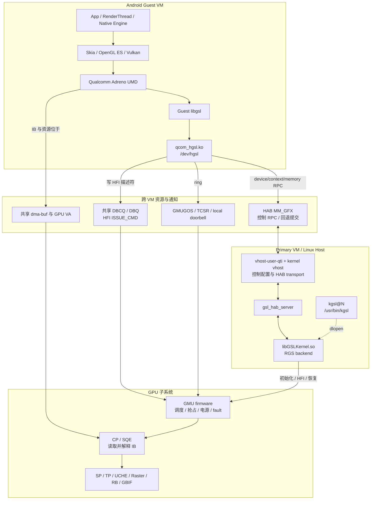
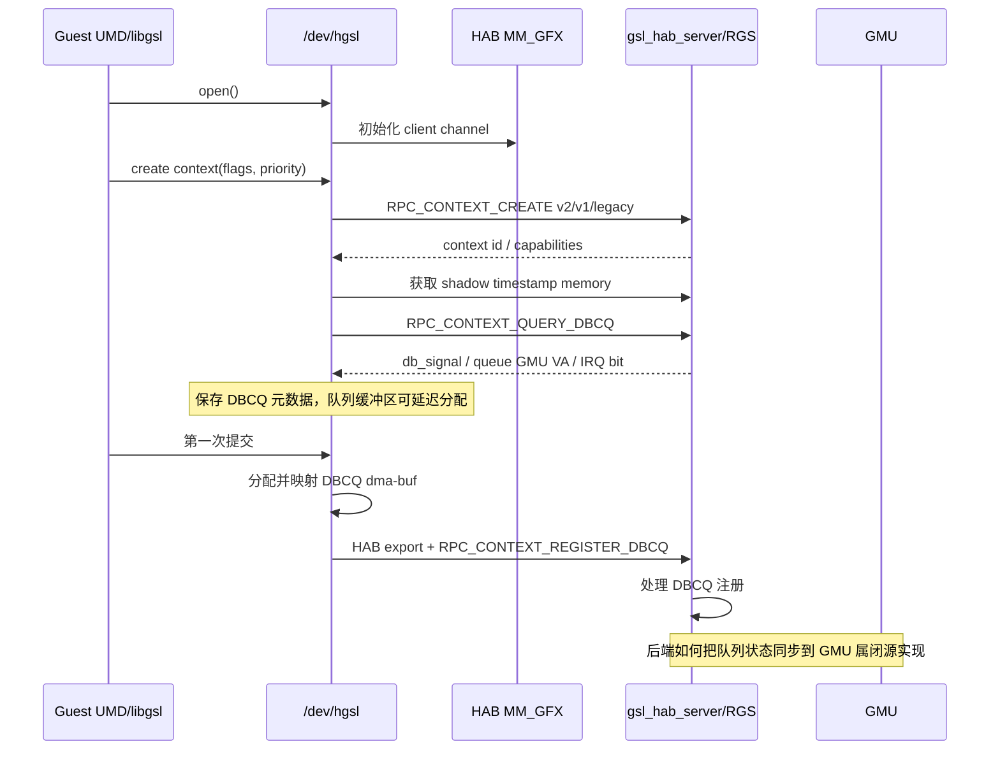
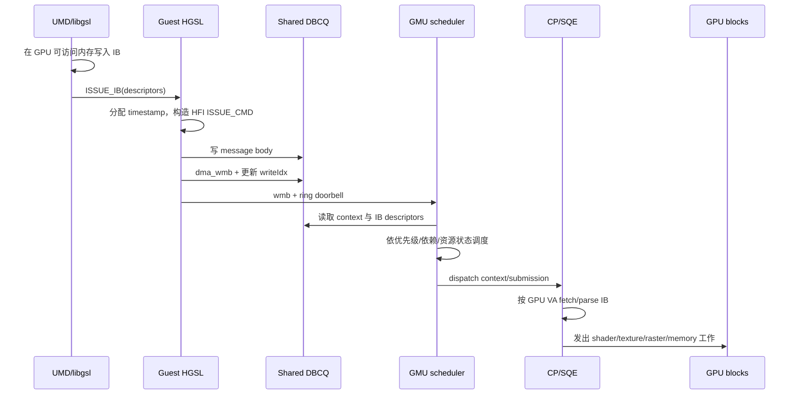
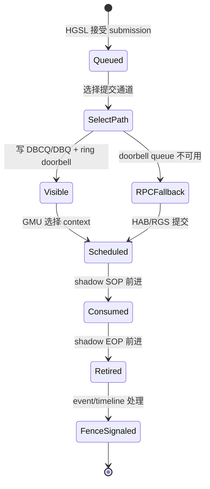
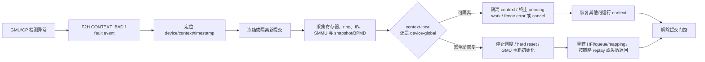

+++
date = '2026-07-19T10:00:00+08:00'
draft = true
ShowToc = true
TocOpen = true
title = 'SA8x97P（SA8397P/SA8797P）GPU 虚拟化工作原理与代码框架'
tags = ["Qualcomm", "SA8397P", "SA8797P", "Adreno", "GPU", "Gunyah", "HGSL", "RGS"]
+++

## 1. 文档定位

本文描述 Qualcomm Gen5/SA8x97P BSP 中，SA8397P 与 SA8797P 平台的 GPU 虚拟化工作原理、核心对象、命令提交链、完成同步链，以及源码和二进制组件之间的边界。

这是一篇架构文档，不是故障分析记录。文中不收录具体问题时间线、进程号、现场日志、Profiler CSV、某次实验的 timeout 数值或个案结论。性能计数器和现场故障应分别放在独立专题中。

### 1.1 适用范围

当前代码树提供了以下事实：

- SA8397P 与 SA8797P 属于同一个 Gen5/SA8x97P 构建族，共享 `sa8x97p.dtsi`、HGSL 接口框架和 Gen5 Adreno 用户态软件包。
- 两个平台具有不同的 SoC `compatible` 和 `msm-id`，并通过各自的 SoC、板级 DTS/DTBO 叠加差异，因此不能把二者描述成完全相同的硬件。
- 当前树中的双 GPU VFIO 资源定义只有 SA8797P 版本得到明确核验。GPU 数量、实例编号、IRQ、SMMU SID、SCMI power domain 等信息不能无条件外推到 SA8397P。
- `/usr/bin/kgsl`、`libGSLKernel.so` 等 PVM RGS 组件是闭源、剥离符号或部分符号可见的二进制。其外部接口和大体职责可以由服务定义、动态加载关系及字符串交叉验证，但内部线程模型、调度算法和恢复状态机不能假装已有完整源码。
- Gen5 配置支持 `qti-vmm`，但 factory/test 等镜像变体可以移除该 feature。本文描述的是启用 Gunyah GPU 虚拟化后的路径，不代表所有 Gen5 镜像都采用相同部署。
- 本文的 **Gen5** 指 automotive BSP/build family；`graphics-kernel` 中的 **Gen7** 指 Adreno 驱动与 HFI/硬件协议代际。两者不是同一个编号维度。
- BSP/DTS 使用 SA8397P、SA8797P 命名；Qualcomm 公开产品页使用 QAM8397P、QAM8797P 命名。本文按源码使用 SA 名称，不据此推导未公开的软 SKU 或硬件资源关系。

因此，本文把内容分成三类：

| 标记 | 含义 |
|---|---|
| **源码可见** | 可以在当前源码树中直接核对数据结构、函数和控制流 |
| **产物可证** | 可以由 systemd unit、recipe、ELF 依赖、导出符号或镜像内容确认 |
| **实现推断** | 闭源组件的职责可由接口和二进制证据合理推断，但内部实现不可下定论 |

本文以 `<CODE_ROOT>` 代称目标 BSP checkout 的源码根目录，后续路径均相对该根目录书写。

目录名中的 `8397` 只是工程工作区名称；同一树中同时存在 `sa8797-oe-linux` 构建产物。判断实际运行平台必须以选中的 DT、SoC ID、镜像和启动日志为准。

### 1.2 两条最重要的边界

1. **GPU 渲染与显示扫描输出不是同一条硬件链。** Adreno GPU 负责渲染，DPU 负责最终合成和 scanout；GPU retire、SurfaceFlinger latch、HWC present 和屏幕真正显示是四个不同完成点。
2. **控制面与高频提交面不是同一条通信链。** context、内存和 DBCQ 的建立主要经过 HAB；建立完成后，高频 IB 提交通常走共享 DBCQ 加 doorbell，不要求每帧都经过 `gsl_hab_server` 用户态 RPC。

## 2. 总体架构



图中的箭头表达的是职责与数据依赖，而不是所有版本都具有完全相同的线程或物理中断拓扑。

### 2.1 一次渲染提交的本质

从软件到硬件，一次 GPU 提交可概括为：

1. UMD 把 OpenGL ES/Vulkan/Skia 工作翻译成 Adreno 命令，并写入 GPU 可访问内存中的一个或多个 **IB**。
2. Guest `libgsl` 通过 `/dev/hgsl` 提交 IB 的 GPU 地址和长度。
3. HGSL 为 context 分配 timestamp，构造 HFI `ISSUE_CMD`，其中包含 context、timestamp、flags 和 IB descriptor。
4. 优先把 HFI 消息写入该 context 的 DBCQ，更新写指针并敲 doorbell。
5. GMU 接收通知并进行调度；CP/SQE 按 descriptor 中的 GPU 地址读取 IB。
6. GPU 执行单元完成 shader、纹理、光栅化、混合和内存访问。
7. 完成点写入 shadow timestamp，并通过 retire 通知唤醒等待者、推进 fence timeline。

**DBCQ 通常承载提交描述信息，不承载完整渲染资源，也不等同于 IB 本体。**

## 3. 软件分层与组件职责

### 3.1 Android Guest

| 层 | 典型组件 | 主要职责 |
|---|---|---|
| 应用与渲染框架 | App、RenderThread、Skia、游戏引擎 | 生成 draw/dispatch/copy 等高层工作 |
| 图形 API | OpenGL ES、EGL、Vulkan | 定义资源、命令、同步和 present 语义 |
| Adreno UMD | GLES/Vulkan vendor driver | 编译 shader，组织状态和资源，生成 Adreno IB |
| Guest GSL | `libgsl.so` | 向 HGSL 提交 device/context/memory/command 请求 |
| Guest 内核前端 | `qcom_hgsl.ko`、`/dev/hgsl` | 管理 Guest 侧对象、HAB RPC、DBCQ/DBQ、timestamp 和 dma_fence |
| Guest 内存子系统 | dma-buf、IOMMU/SMMU、HGSL MMU | 建立 CPU、Guest、PVM 和 GPU 所需的地址映射 |

GSL/HGSL 是驱动服务层，不是 renderer。真正把 API 工作翻译成 GPU 命令的是 UMD，真正执行命令的是 GPU。

### 3.2 跨 VM 传输

| 组件 | 职责 | 不负责什么 |
|---|---|---|
| HAB `MM_GFX` | 建立 Guest 与 PVM 图形后端的逻辑通道；传递控制 RPC、资源句柄和回退请求 | 不解释 Adreno shader 或 IB |
| `vhost-user-qti` / `/dev/vhost-ogles` | 用户态进程配置 memory/vring/eventfd 并把通道接到 kernel vhost；稳态 HAB payload 由内核数据路径搬运 | 不是 virtio-gpu renderer，也不做 GPU 调度 |
| DBCQ | 每 context 的共享提交环，传递 HFI `ISSUE_CMD` 和 IB descriptors | 不是 Android BufferQueue，不是 framebuffer |
| Doorbell | 在共享内存写完后通知 GMU/后端有新工作 | 不承载 IB payload |

HAB 的 graphics MMID 在当前实现中对应 `MM_GFX`。Guest `hgsl_hyp_socket.c` 通过 HAB socket 封装 send/recv/export/import；HAB 的 virtio/vhost 层只负责跨 VM transport。

### 3.3 PVM GPU 后端

Gen5 recipe 和镜像中可确认以下服务关系：

```text
kgsl@0.service  -> /usr/bin/kgsl -p 0
kgsl@1.service  -> /usr/bin/kgsl -p 1

gsl_hab_server.service
  After: kgsl@0, kgsl@1, vhost-user-gpu
  Requires: vhost-user-gpu
  ExecStart: /usr/bin/gsl_hab_server
```

- `/usr/bin/kgsl` 是服务进程入口。ELF 字符串表显示它通过 `dlopen()` 加载 `libGSLKernel.so`，再解析 `kgsl_init` 等入口。
- `libGSLKernel.so` 承担 RGS 后端、GMU/HFI、物理 GPU 资源、fault/recovery 和 snapshot 等职责。这里的结论来自产物和符号证据；内部源码不在当前树中。
- `gsl_hab_server` 直接依赖 `libgsl.so` 与 `libuhab.so`，作为 GFX HAB backend 接收 Guest 控制请求并连接 RGS。
- `kgsl@0/@1` 表示镜像支持实例化服务，不代表所有 SKU、所有镜像都一定启用两个物理 GPU。

当前源码没有给出 RGS 缩写的权威展开，本文保留 `RGS` 原名，专指 PVM 中的 GPU 服务端。它不等于 Android 非虚拟化路径中的 `msm_kgsl.ko`。

### 3.4 GMU、CP/SQE 与执行单元

| 模块 | 主要职责 |
|---|---|
| GMU | GPU 电源和时钟协同、context 调度、优先级与抢占、HFI 消息处理、超时和 fault 上报 |
| CP/SQE | 获取、解析和推进 Adreno command stream；按 GPU VA 读取 IB |
| UCHE/缓存层 | 缓存 shader、纹理、顶点、常量和通用内存访问 |
| SP | 执行 vertex/fragment/compute shader 指令 |
| TP | 纹理寻址、过滤和采样 |
| 几何/光栅化单元 | 图元装配、裁剪、光栅化和 early depth/stencil 等 |
| RB | color/depth/stencil 后端、混合和写回 |
| GBIF/系统总线接口 | 连接 GPU 与系统内存 |

这些名称描述 Adreno 的概念性流水线。具体 block 数量、缓存大小、并行宽度和 GPU marketing ID 依 SKU 与固件而定。

## 4. 核心对象

### 4.1 Client、device 与 context

- **Client**：通常对应打开 `/dev/hgsl` 的进程。`hgsl_open()` 为进程创建 `hgsl_priv`，保存 PID、内存树、HAB channel pool 和已激活的 device handle。
- **Device handle**：后端返回的逻辑 GPU 设备标识。源码支持 `DEV0/DEV1`，但逻辑 handle、systemd 实例、Profiler 的 `GPU 1/GPU 2` 和物理 GPU 编号不能只按数字直接互相映射。
- **Context**：GPU 调度、timestamp、队列和同步的核心边界。不同 context 可以具有不同优先级、队列和 fence timeline；GPU VA/page table 是独立对象，通常归属于 client/process，多个 context 可以共享同一地址空间。
- **Address space/page table**：定义 GPU VA 如何映射到物理页或共享内存。是否由 Guest 本地 SMMU 路径完成，取决于 full virtualization 和当前配置。

context 不是进程。一个进程可拥有多个 context；同一帧也可能跨多个 context 或多个 submission。

### 4.2 IB 与 IB descriptor

IB 是 **Indirect Buffer**，即 GPU 命令缓冲区。HGSL UAPI 中最小描述符为：

```c
struct hgsl_ibdesc {
    uint64_t gpuaddr;
    uint64_t sizedwords;
};
```

概念上：

```text
IB descriptor = {IB 的 GPU 虚拟地址, IB 长度}
IB body       = 位于 GPU 可访问内存中的 Adreno 命令流
```

UAPI 的 `sizedwords` 以 32-bit dword 为单位；HGSL 组装 firmware descriptor 时通过 `sizedwords << 2` 转换成 byte size。后文 HFI 表中的长度采用转换后的 byte 单位。

需要避免四个常见混淆：

- IB 不是图像 buffer；
- IB 不是 shader 源码；
- IB 长度不等于 GPU 执行时长；
- 一个 API draw/dispatch、一个 IB、一次 submission 和一帧画面之间都不保证一一对应。

当 descriptor 太多而无法内联进 HFI 消息时，HGSL 会使用 DBCQ 的 indirect descriptor 区存放 descriptor 列表。这里的 “indirect” 主要表示 HFI 间接引用描述符区，不是把完整 IB 复制到 DBCQ。

### 4.3 DBCQ、DBQ 与 IPCQ

| 名称 | 作用域 | 用途 |
|---|---|---|
| DBCQ | per-context | 新版优先使用的 context 提交环 |
| DBQ | 可被多个 context 关联的兼容队列 | DBCQ 不可用时的 doorbell queue 兼容路径 |
| IPCQ | per-device/后端功能队列族 | HGSL、RGS、PKMD 等控制或固件协作消息；不是 context IB 提交环 |

源码中的类型名是 `doorbell_context_queue`，因此本文把 DBCQ 称为“每 context 的 Doorbell Context Queue”。它与 Android `BufferQueue` 完全无关。

### 4.4 Timestamp 与 fence

一个 context 中至少要区分：

| 状态 | HGSL 表示 | 含义 |
|---|---|---|
| queued | `queued_ts` | 提交已被驱动接受并排队 |
| consumed | shadow `sop` | 前端/硬件已经消费到该提交的开始点；不等同于某个 shader 首条指令开始 |
| retired | shadow `eop` | 该 context 中直到此 timestamp 的工作已到达完成点 |

timestamp 是 context 内的有序序号，不是墙钟时间。`ISSUE_IB` ioctl 返回成功，只说明提交动作成功，不说明 GPU 已 retire。

`dma_fence`/`sync_file` 把 timestamp 完成点导出给 Android 图形栈。fence 表示依赖是否满足；它不是命令队列，也不是像素数据。

## 5. 启动、初始化与资源建立

### 5.1 PVM 服务启动

PVM 侧的启动依赖是：

- VFIO device probe、resource manager 等前置服务先为 `kgsl@N` 准备物理 GPU 资源；
- `kgsl@N.service` 启动 `/usr/bin/kgsl -p N`，后者动态加载 `libGSLKernel.so` 并初始化相应 RGS/GPU 实例；
- `vhost-user-gpu.service` 独立准备 HAB 的 vhost-user transport；现有 unit 没有证明它与 `kgsl@N` 之间存在严格先后关系；
- `gsl_hab_server.service` 声明在 `kgsl@0/@1` 和 `vhost-user-gpu` 之后启动，随后接收 Guest GFX RPC。

这表示 PVM 服务具有清晰的职责分层：

```text
vhost-user-gpu    = HAB transport
gsl_hab_server    = Guest GFX RPC backend
kgsl@N            = RGS 进程入口
libGSLKernel.so   = RGS/GMU/物理 GPU 核心实现
```

### 5.2 Guest HGSL probe

`qcom_hgsl_probe()` 的主要动作包括：

1. 注册 `/dev/hgsl` 字符设备与 ioctl 表；
2. 初始化 context、event、dispatch、debugfs/sysfs 等 Guest 数据结构；
3. 建立全局 HAB channel，执行 library open；
4. 向后端打开可用的 device handle；
5. 根据 feature flags 分配 per-device IPC queues；
6. 初始化 GMUGOS/TCSR doorbell 与 retire 通知；
7. 在 full virtualization 模式下绑定 HGSL SMMU component。

某个 feature 在源码中存在，不等于当前镜像一定启用。最终状态要同时看 DT、后端协商结果与启动日志。

### 5.3 进程与 context 建立



当前 HGSL 的 context 创建具有兼容协商：

1. 尝试新版 context create；
2. 必要时退回旧版本或 legacy RPC；
3. 优先 `RPC_CONTEXT_QUERY_DBCQ`；
4. 不支持 DBCQ 时尝试旧 DBQ；
5. doorbell queue 也不可用时，提交可退回 HAB `RPC_COMMAND_ISSUEIB`。

兼容路径存在的原因是 Guest driver、PVM RGS、GMU firmware 和 HFI protocol 可能来自不同 BSP 版本。

## 6. GPU 内存与地址空间

### 6.1 为什么跨 VM 不需要每帧复制所有数据

命令、纹理、vertex/index buffer、render target 等对象位于可共享或可映射的内存中。系统通过 dma-buf、HAB export/import、VFIO 与 SMMU/IOMMU 建立多方映射：

```text
Guest CPU VA
    |
    | dma-buf / allocation
    v
Guest-visible memory object
    |
    | HGSL/RGS map + SMMU page table
    v
GPU VA  --------------------> physical/shared pages
```

提交时传递的是 GPU VA、长度、context、timestamp 和 flags。GPU 再通过地址翻译读取 IB 与资源。因此不能把 HAB/DBCQ 理解为逐帧搬运全部像素的管道。

### 6.2 两种映射模式

HGSL 代码中可以看到两类路径：

- **后端映射路径**：Guest 通过 HAB 导出 dma-buf，RGS/后端执行 GPU SMMU 映射并返回 GPU VA 等信息。
- **Full virtualization 路径**：满足 feature、保护属性和 MMU 条件时，Guest HGSL 可自行选择 GPU VA 并在本地 HGSL SMMU context bank 建立映射。

哪条路径生效由 `fv_on`、后端 feature mask、内存 flags、DT 和镜像配置共同决定。

### 6.3 顺序与可见性

共享队列正确工作的关键不是“写了数据”，而是“写入顺序对另一端可见”。`dbcq_send_msg()` 的顺序为：

1. 等待 ring 中有足够空间；
2. 处理环回并复制 HFI message；
3. `dma_wmb()`，保证 message body 先对设备可见；
4. 更新 `writeIdx`；
5. `wmb()`，保证写指针先于 doorbell；
6. 触发 GMUGOS、global TCSR 或 local GMU doorbell。

如果 UMD 写入的是非一致性缓存内存，还需要在提交前按内存属性完成相应 cache maintenance。doorbell 只是一声“有新工作”的通知，不能替代内存屏障。

## 7. GPU 命令提交

### 7.1 UAPI 到 HFI 的调用链

legacy `ISSUE_IB` 路径的关键调用链为：

```text
HGSL_IOCTL_ISSUE_IB
  hgsl_ioctl_issueib()
    hgsl_db_issueib()
      hgsl_db_issue_cmd()
        hgsl_dbcq_issue_cmd()       # 首选 per-context DBCQ
          hgsl_dbcq_open()          # 首次使用时分配/注册队列
          dbcq_send_msg()
        db_send_msg()               # 兼容的旧 DBQ
    hgsl_hyp_issueib()              # HAB RPC 最终回退
```

新的 command/drawobj 接口还会构造 command object 与 sync object，再由 Guest dispatch 路径提交；底层仍围绕 context、IB descriptor、timestamp 和完成同步组织。

### 7.2 HFI `ISSUE_CMD`

HGSL 与开源 KGSL/HFI 参考代码都把 `ISSUE_CMD` 定义为 message id `130`。当前 HGSL 构造的消息概念上包含：

| 字段 | 作用 |
|---|---|
| HFI header | message id、类型、dword 数和 sequence number |
| context id | 指定调度与 timestamp 的 context |
| number of IBs | descriptor 数量 |
| command flags | notify、profiling、indirect descriptor 等 |
| timestamp | 本次 submission 的有序完成点 |
| user profile GPU VA | 可选的 profiling buffer |
| IB descriptors | 内联的 `{GPU VA, byte size}`，或指向共享 descriptor 区 |

HFI 是 Host/Firmware Interface，不是图形 API。它承载 UMD 已经生成好的低层工作描述。

### 7.3 DBCQ 快路径



DBCQ 快路径减少了每次 submission 的跨 VM RPC 和用户态切换，但并不绕过 RGS 对设备、context、内存、策略和恢复的整体管理。

### 7.4 HAB 回退路径

当以下条件之一成立时，提交可能走 `hgsl_hyp_issueib()`：

- 后端不支持当前 DBCQ/DBQ 协议；
- context 没有可用 doorbell queue；
- 使用了显式 remote channel；
- 新接口因兼容性退回 legacy remote issue。

回退路径会把 request 和 IB descriptors 封装为 `RPC_COMMAND_ISSUEIB`，经 HAB 到 `gsl_hab_server`/RGS，再由后端提交。它保证兼容性，但 CPU、RPC 和调度开销通常高于共享队列快路径。

## 8. GMU 调度与 GPU 执行

### 8.1 GMU 调度什么

GMU 看到的基本工作单位是带有 context、timestamp、flags 和 IB descriptors 的 submission。它需要协调：

- context 优先级和可运行状态；
- 当前 GPU power state 与频点；
- context switch 和 preemption；
- ring/context queue 的前后关系；
- fault、timeout 和恢复状态。

Guest dispatch 会在进入 DBCQ 前处理 sync object；未满足时不会发送 HFI `ISSUE_CMD`。“提交已进入 DBCQ”只表示工作可被 GMU 看到，不表示它已开始执行，后面仍可能受其他 context、队列顺序、抢占/切换或电源状态影响。

### 8.2 CP/SQE 执行什么

GMU 选择工作后，CP/SQE 根据 IB descriptor 读取命令流。IB 中可能包含：

- 寄存器和状态设置；
- shader program 与常量绑定；
- vertex/index/texture/render target 地址；
- draw、dispatch、copy、barrier 和 event；
- 嵌套的 indirect buffer；
- timestamp/event write。

CP/SQE 负责解释命令，不负责执行 shader 算术。shader、纹理、光栅化和写回工作由后续硬件单元完成。

### 8.3 一个“长 IB”真正表示什么

在 fault 语义中，Long IB 表示某次 submission 长时间没有到达期望 retire 点，不表示 IB 文件或 descriptor 的字节数很大。持续时间可能来自：

- shader/dispatch 本身工作量大；
- 资源访问延迟或缓存命中率低；
- 同步、barrier 或循环使流水线无法推进；
- context 被延迟调度或抢占异常；
- GPU、GMU、总线、SMMU 或固件发生 fault。

所以不能仅凭 “Long IB” 字样断言根因。timeout 值属于 BSP/固件/策略配置，也不应写成跨版本常量。

## 9. Retire、timestamp 与 fence

### 9.1 正常完成链



当前 HGSL 可以从共享 shadow timestamp 读取 `sop/eop`。retire doorbell/IRQ 到达后：

1. ISR 把处理放到 workqueue；
2. `hgsl_retire_common()` 检查 active wait；
3. 等待指定 timestamp 的线程被唤醒；
4. context event group 处理已满足的事件；
5. `hgsl_sync.c` 推进 hsync timeline 并 signal `dma_fence`；
6. Guest dispatch 回收已退休 drawobj，继续提交后续工作。

若 shadow timestamp 或 doorbell retire 通知不可用，读取和等待操作可以退回 HAB RPC。

### 9.2 为什么 fence 可能在多层传播

GPU fence 只表示 GPU 工作完成，但 producer 不必等 fence signal 后才调用 `queueBuffer()`。典型异步关系是：

```text
producer 提交 GPU render
  -> queueBuffer(buffer + 尚未 signal 的 acquire fence)
  -> SurfaceFlinger latch/传递该 fence
  -> GPU retire，fence signal
  -> HWC/DPU 在依赖满足后 present
  -> DPU composition/scanout
  -> panel refresh
```

这些阶段可以流水重叠，client composition 还会引入新的 GPU submission/fence。因此看到 GPU 已 retire，不能推出画面已经显示；看到 present fence 延迟，也不能立即推出 GPU 必然 hang。分析时必须先明确正在观察哪个完成点。

## 10. GPU 与显示链的接口

GPU 常把结果写入 gralloc/GraphicBuffer 分配的 render target。该 buffer 及其 fence 随后交给 SurfaceFlinger/HWC：

- **Client composition**：SurfaceFlinger 可能再次使用 GPU 合成多个 layer；
- **Device composition**：HWC/DPU 直接读取 layer buffer 完成硬件合成；
- **Mixed composition**：部分 layer 由 GPU 预合成，部分由 DPU overlay。

像素 buffer 通常通过共享内存和句柄在组件间传递，而不是塞进 DBCQ。DBCQ 只服务 GPU 命令提交；DPU scanout 走显示驱动和显示虚拟化链。

显示专题参见：

- [Android 图形渲染架构详解]()
- [Android Guest 显示数据通道深度解析]()
- [Qualcomm Display Architecture]()
- [HAB 通信机制]()

## 11. Fault 检测、快照与恢复

### 11.1 HFI fault 语义

开源 `graphics-kernel/adreno_hfi.h` 提供了同代 HFI 的协议语义参考：

| HFI error | 协议含义 |
|---|---|
| 600 | CP hardware error |
| 601 | GPU hardware hang |
| 602 | preemption timeout |
| 603 | software hang / Long IB timeout |
| 604 | bad opcode |
| 605 | protected-mode error |
| 606 | illegal instruction |
| 607 | CP microcode error |
| 608 | CP hardware fault |
| 609 | GPC error |

这些编号适合用于解释日志协议，但 PVM 的实际 fault policy、阈值、过滤和恢复实现位于闭源 RGS/firmware 中，必须按当前版本验证。

### 11.2 通用恢复状态机

下图是依据可见接口和同代开源 KGSL 参考代码抽象出的**概念性恢复策略**，不是已经核验的 PVM RGS 内部状态机。具体阶段、线程、reset 粒度和 replay 策略以当前 `libGSLKernel.so` 与 GMU firmware 为准。



恢复设计需要同时解决三个问题：

1. **保存证据**：reset 前采集 snapshot，否则关键寄存器和 ring 状态会丢失；
2. **终止依赖**：受影响 submission 的 timestamp/fence 必须完成为成功、取消或错误，不能让上层无限等待；
3. **重建设备状态**：GMU/HFI、context queue、页表和功耗状态需要按恢复级别重新建立。

开源 `graphics-kernel` 中的 `adreno_hwsched.c`、`adreno_gen7_hwsched*.c`、`kgsl_snapshot.c` 和 `adreno_snapshot.c` 可以作为 Gen7 HFI、snapshot、reset/replay 的参考实现。它们不是 PVM `libGSLKernel.so` 的源码，函数名和具体控制流不能直接套用到 RGS。

## 12. SA8397P 与 SA8797P 的平台边界

### 12.1 已确认的共同框架

| 项目 | 共同点 |
|---|---|
| 构建族 | 同属 Gen5/SA8x97P 构建族 |
| 基础 DT | 板级 DTS 均继承 `sa8x97p.dtsi`，再叠加各自 SoC/板级差异 |
| Guest 接口 | 共用 `qcom_hgsl.ko`、HAB、HGSL UAPI 和 DBCQ/DBQ 协商框架 |
| PVM 软件包 | 共用 Gen5 Adreno recipe/package family；具体 A7X/A8X binary 与 soft-SKU 以产物为准 |
| 服务模板 | 支持 `kgsl@.service`、`gsl_hab_server` 和 `vhost-user-gpu` |
| 提交模型 | context、GPU VA、IB descriptor、HFI、doorbell、timestamp/fence |

### 12.2 不能直接互相外推的内容

| 项目 | 原因 | 正确验证方式 |
|---|---|---|
| 精确 Adreno 型号/revision | 当前源码没有可靠绑定 marketing ID | 读取 chip ID、RGS/GMU 启动日志和固件选择 |
| GPU 实例数量 | service 模板支持双实例不等于运行时双 GPU | 检查最终 DT、VFIO device、systemd active state |
| GPU0/GPU1 物理映射 | 逻辑 handle、服务实例、Profiler 标签可能不同 | 联合 DT resource、RGS instance、负载注入验证 |
| 寄存器、IRQ、SMMU SID | 当前明确的双 GPU VFIO overlay 属于 SA8797P | 读取对应 SoC/板级 DTBO 与 `/proc/device-tree` |
| DBCQ doorbell 类型 | 可为 GMUGOS、global TCSR 或 local GMU | 查看协商返回值和 HGSL 启动日志 |
| HFI/GMU firmware | 受软 SKU、固件包和 BSP 版本影响 | 记录 firmware 文件、版本和 HFI feature |
| timeout 与恢复策略 | 位于 RGS/firmware 配置 | 读取当前启动配置，不使用历史常量 |
| 频点、带宽与 counters | 受 SKU、power table、counter 暴露影响 | 读取当前 devfreq/SCMI/Profiler capability |
| VM ownership | 可由镜像 feature、resource manager、DT 改变 | 核对最终镜像和 VM resource assignment |

当前 `sa8397p.dtsi` 与 `sa8797p.dtsi` 使用不同 `compatible` 和 `msm-id`。文档可以说二者共享软件框架，但不能仅凭同一构建树或外部市场资料宣称“完全相同的 die/资源配置”。

### 12.3 当前 SA8797P 双 GPU overlay 只能作为示例

当前树中 `sa8797p-gpu-vfio.dtsi` 给出了两个 GPU VFIO 资源节点及各自 IRQ、SMMU 和 power domain 配置，这证明该 SA8797P BSP 变体支持双 GPU 资源模型。

由于没有找到等价的 `sa8397p-gpu-vfio.dtsi`，下列说法都不成立：

- “SA8397P 一定有相同的两个 GPU 实例”；
- “SA8397P GPU1/GPU2 的核型与 SA8797P 相同”；
- “Profiler 的 GPU 1/2 可直接对应 `kgsl@0/@1`”。

这些关系必须在目标板上验证。

## 13. 代码框架与阅读地图

### 13.1 Guest HGSL

根目录：

```text
<CODE_ROOT>/vendor/vendor/qcom/opensource/graphics-hgsl/
```

| 文件 | 重点 |
|---|---|
| `include/uapi/linux/hgsl.h` | ioctl、IB descriptor、context、memory、sync UAPI |
| `hgsl.c` | probe/open、context、DBCQ/DBQ、issueib、timestamp、retire IRQ |
| `hgsl.h` | client/context、shadow timestamp、DBQ/DBCQ 核心结构 |
| `hgsl_hyp.c` | device/context/memory/DBCQ/issueib HAB RPC |
| `hgsl_hyp.h` | FE/BE RPC opcode 与 wire-level 数据结构 |
| `hgsl_hyp_socket.c` | `MM_GFX` HAB socket send/recv/export/import |
| `hgsl_memory.c` | dma-buf 分配、导入、cache operation |
| `hgsl_mmu.c` / `hgsl_iommu.c` | GPU VA 与 HGSL SMMU context bank |
| `hgsl_sync.c` | hsync/isync timeline、`dma_fence` |
| `hgsl_events.c` | timestamp event group |
| `hgsl_drawobj.c` / `hgsl_dispatch.c` | command/sync drawobj 与 Guest dispatch |
| `hgsl_gmugos.c` / `hgsl_tcsr.c` | doorbell 与 retire interrupt |
| `hgsl_trace.h` / `hgsl_debugfs.c` | tracepoint 和可观测接口 |

建议按以下函数顺序阅读：

```text
qcom_hgsl_probe
  -> hgsl_open
  -> hgsl_ioctl_ctxt_create
  -> hgsl_ctxt_create_dbq
  -> hgsl_hyp_query_dbcq
  -> hgsl_dbcq_init / hgsl_dbcq_open
  -> hgsl_ioctl_issueib
  -> hgsl_db_issue_cmd
  -> hgsl_dbcq_issue_cmd
  -> dbcq_send_msg
  -> hgsl_retire_common
  -> hgsl_wait_timestamp / hgsl_sync timeline
```

### 13.2 HAB 与 vhost-user

Guest/PVM 内核 HAB 的一个可见实现位于：

```text
<CODE_ROOT>/vendor/kernel_platform/soc-repo/drivers/soc/qcom/hab/
```

其中：

- `hab.c`、`hab_open.c`、`hab_msg.c`、`hab_vchan.c` 管理 HAB channel/message；
- `hab_virtio.c` 把 `MM_GFX` 映射到 graphics virtio device；
- `hab_vhost.c` 提供 PVM vhost 侧 graphics class；
- `hab_mem_linux.c` 等文件处理共享内存 export/import。

PVM apps 源码树中还存在另一套构建形态：

```text
<CODE_ROOT>/linux/apps/apps_proc/vendor/qcom/opensource/mmhab-drv/
<CODE_ROOT>/linux/apps/apps_proc/vendor/qcom/opensource/vhost-user/
```

不同 kernel/PVM build 可能选择不同目录中的 HAB 实现，阅读时要先确认目标镜像实际 recipe。

### 13.3 PVM RGS 产物

Gen5 Adreno recipe：

```text
<CODE_ROOT>/linux/apps/apps_proc/layers/meta-qti-automotive-prop/
  recipes-graphics/adreno/adreno_0.1.bb
  recipes-graphics/adreno/adreno.bb
```

已核验的 SA8797P prebuilt 示例：

```text
<CODE_ROOT>/linux/apps/apps_proc/prebuilt_HY11/sa8797/adreno/
  usr/bin/kgsl
  usr/bin/gsl_hab_server
  usr/lib/libGSLKernel.so
  usr/lib/systemd/system/kgsl@.service
  usr/lib/systemd/system/gsl_hab_server.service
```

这部分应按“产物可证/实现推断”阅读，不要虚构 `libGSLKernel.so` 的源码类图。

### 13.4 开源 KGSL/Gen7 HFI 参考

```text
<CODE_ROOT>/vendor/vendor/qcom/opensource/graphics-kernel/
```

| 文件 | 可用于理解 |
|---|---|
| `adreno_hfi.h` | HFI message id、context-bad 与 fault code |
| `adreno_gen7_hwsched_hfi.c` | Gen7 context 注册、`ISSUE_CMD`、TS_RETIRE、CONTEXT_BAD |
| `adreno_hwsched.c` | hwsched、fault 定位、snapshot、reset |
| `adreno_gen7_hwsched.c` | Gen7 hard stop、GMU reboot、replay 参考 |
| `kgsl_drawobj.c` | command/sync object 生命周期 |
| `kgsl_sync.c` | fence 与 timeline |
| `kgsl_iommu.c` | 非虚拟化 KGSL 的 GPU MMU 参考 |
| `kgsl_snapshot.c` / `adreno_snapshot.c` | snapshot 基础框架 |

这套代码是理解 Adreno/KGSL/HFI 语义的重要参考，但不是 PVM RGS 的实现源码。

### 13.5 平台构建与 DTS

Gen5 machine 配置：

```text
<CODE_ROOT>/linux/apps/apps_proc/layers/meta-qti-automotive/conf/machine/
  sa8797.conf
  gen5.conf
  include/gen5.inc
```

SA8x97P 基础和 SoC DTS：

```text
<CODE_ROOT>/linux/apps/apps_proc/vendor/qcom/opensource/base-devicetree/
  arch/arm64/boot/dts/qcom/sa8x97p.dtsi
  arch/arm64/boot/dts/qcom/sa8397p.dtsi
  arch/arm64/boot/dts/qcom/sa8797p.dtsi
  arch/arm64/boot/dts/qcom/sa8397p-adp-star.dts
  arch/arm64/boot/dts/qcom/sa8797p-adp-star.dts
```

当前明确可见的 SA8797P GPU VFIO overlay：

```text
<CODE_ROOT>/linux/apps/apps_proc/vendor/qcom/proprietary/mm-vfio-devicetree/
  sa8797p-mm-vfio.dtso
  gpu/sa8797p-gpu-vfio.dtsi
```

优先阅读 source tree，不要把 `build*/tmp-glibc/work/...` 中复制出来的 recipe sysroot 文件误认为另一份独立实现。

## 14. 架构验证清单

把该架构应用到一块具体 SA8397P/SA8797P 板卡前，至少记录以下基线：

1. 最终加载的 SoC/board DTB、DTBO、`compatible` 和 `msm-id`；
2. `qcom_hgsl.ko`、Guest `libgsl`/UMD、PVM Adreno package 的 build id；
3. `kgsl@N`、`gsl_hab_server`、`vhost-user-gpu` 的 active state；
4. `/dev/hgsl` device handle 与 PVM RGS instance 的对应关系；
5. DBCQ 是否协商成功，以及 doorbell 使用 GMUGOS、TCSR 还是 local GMU；
6. full virtualization feature 是否启用，GPU VA 由 Guest 还是 RGS 管理；
7. GMU firmware、HFI feature/version；
8. GPU 实例、VFIO resource、SMMU context bank 和 power domain 映射；
9. timeout、preemption、recovery 和 snapshot 策略；
10. Profiler 的 GPU label 与物理实例映射。

这些是版本基线，不是故障结论。只有先固定基线，性能数据和现场日志才可比较。

## 15. 术语表

| 术语 | 含义 |
|---|---|
| GVM | Guest VM，本文主要指 Android VM |
| PVM | Primary VM，拥有或管理物理 GPU 资源的 Linux Host |
| UMD | User Mode Driver，把图形 API 工作翻译成 GPU 命令 |
| GSL | Guest/PVM 图形服务接口层；不是 renderer |
| HGSL | Hypervisor Graphics System Layer，Guest 内核 GPU 前端 |
| RGS | 本文指 PVM GPU 服务端；当前树未提供权威缩写展开 |
| HAB | Hypervisor Abstraction，Qualcomm 跨 VM 通信框架 |
| HFI | Host/Firmware Interface，Host/RGS 与 GMU firmware 的消息协议 |
| GMU | GPU 管理微控制器，负责调度、电源、抢占和 fault 管理 |
| CP/SQE | GPU command processor / sequencer，读取并解释 IB |
| IB | Indirect Buffer，GPU 命令缓冲区 |
| DBCQ | per-context Doorbell Context Queue |
| DBQ | 兼容的 doorbell queue |
| IPCQ | 设备级后端/固件协作队列族，不等于 DBCQ |
| Doorbell | 通知接收端读取共享队列的硬件/虚拟中断信号 |
| GPU VA | GPU 虚拟地址，经 SMMU/IOMMU 映射到内存页 |
| Submission | 一次带 context、IB descriptors 和 timestamp 的提交 |
| Timestamp | context 内有序完成序号，不是墙钟 |
| Retire | submission 到达完成点；不表示相关内存立即释放 |
| Fence | 对 timestamp/依赖完成状态的可传递同步对象 |
| Ringbuffer | 环形命令/消息队列，不是 framebuffer |
| Framebuffer | 用于保存像素结果的图像缓冲区 |
| DPU | Display Processing Unit，负责显示合成和 scanout，不是 GPU |

## 16. 总结

SA8x97P 的虚拟化 GPU 栈可以用三个面来理解：

- **控制面**：Guest HGSL 通过 HAB 与 `gsl_hab_server`/RGS 建立 device、context、内存、shadow timestamp 和 DBCQ；
- **提交面**：UMD 把 IB 放入 GPU 可访问内存，HGSL 把 HFI `ISSUE_CMD` 写入 DBCQ，更新指针并敲 doorbell，GMU 调度后由 CP/SQE fetch IB；
- **完成与恢复面**：shadow timestamp、retire IRQ 和 dma_fence 传播正常完成；GMU/HFI fault 触发 snapshot、context 处置、reset/reinit 和 fence error 传播。

SA8397P 与 SA8797P 共享这套 Gen5/SA8x97P 软件框架，但具体 GPU 数量、资源映射、固件、频点、timeout 和 counter 能力属于平台配置，必须在目标镜像和运行硬件上核验。

## 17. 公开资料

- [Qualcomm QAM8397P / Snapdragon Cockpit Elite](https://www.qualcomm.com/automotive/products/qam8397p)
- [Qualcomm QAM8797P / Snapdragon Ride Elite](https://www.qualcomm.com/automotive/products/qam8797p)

公开产品页可用于确认产品定位和 Adreno GPU 的存在，但没有公开本文所述 BSP 中 HGSL/RGS/DBCQ 的实现细节；这些细节来自当前源码树与构建产物。
