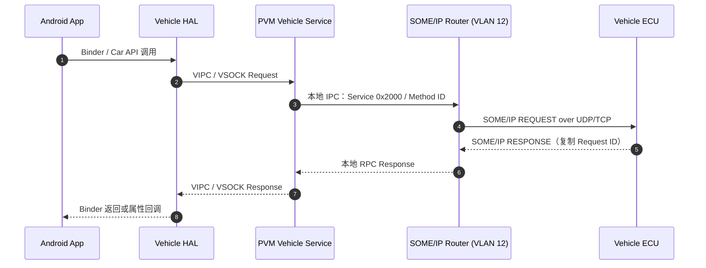
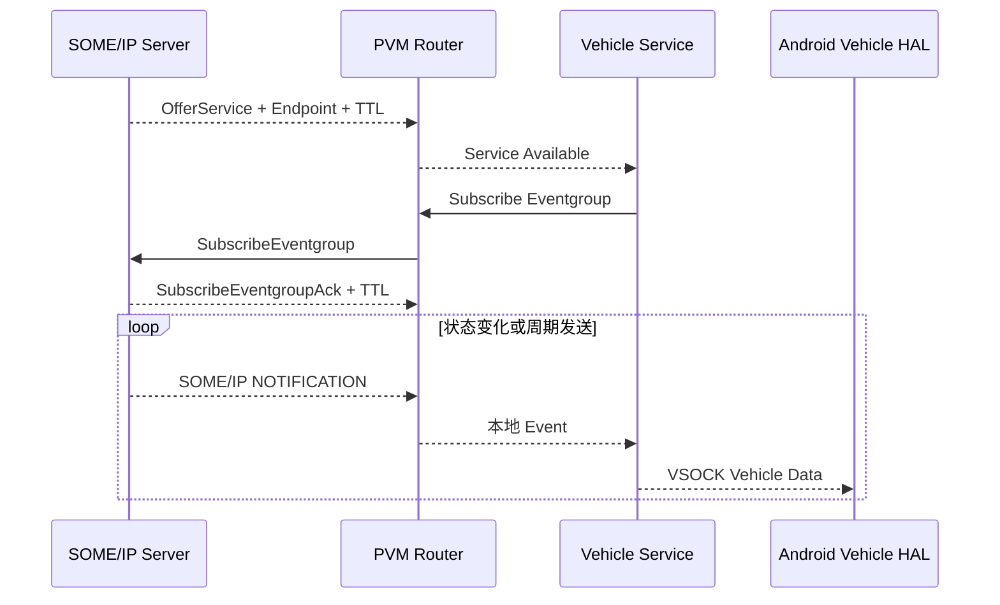

+++
date = '2026-08-04T10:00:00+08:00'
draft = false
title = '智能座舱中的 SOME/IP：协议、VLAN 与部署实践'
tags = ["Automotive Ethernet", "SOME/IP", "VLAN", "Linux", "Android", "Virtualization", "Gunyah", "IPC"]
+++

## 1. 为什么用一个实际座舱来讲 SOME/IP

SOME/IP 经常被概括成“跑在以太网上的汽车中间件协议”。这个说法没有错，但只记住这句话，仍然很难回答工程里的几个核心问题：

- 一个车速服务到底由谁提供、由谁消费？
- `Service ID`、`Instance ID`、UDP/TCP 端口分别解决什么问题？
- 为什么服务发现使用一个端口，真正的业务数据又使用另一组端口？
- 同一台座舱主机为什么要创建多个 VLAN，并运行多个 SOME/IP 路由实例？
- Linux 本地进程、Android Guest 和车外 ECU 之间，数据究竟经过哪些边界？

本文以一套双虚拟机智能座舱为案例。系统由以下部分组成：

- 多个车身、底盘、动力、辅助驾驶和网联 ECU；
- 一台运行 Linux 的 Primary VM（后文简称 **PVM**）；
- 一台运行 Android 的 Guest VM（后文简称 **GVM**）；
- PVM 上按 VLAN 部署的 6 个 SOME/IP 路由实例；
- PVM 上承载车辆服务代理的业务进程；
- PVM 与 GVM 之间的 VIPC/VSOCK 通道；
- Android Vehicle HAL、CarService 和座舱应用。

在这套部署中，车载以太网侧使用 SOME/IP，PVM 内部使用 Unix Domain Socket，PVM 与 GVM 之间使用 VSOCK。运行态可观察到 6 个 VLAN 路由实例和 76 个本地 SOME/IP 应用端点。

这个案例的价值不在于数字本身，而在于它展示了一种很典型的工程划分：

> **把面向整车网络的 SOME/IP 协议集中部署在 PVM，把面向 Android 应用的车辆接口留在 GVM，中间由一个受控的跨 VM 通道连接。**

本文使用的业务名、地址和进程名均只用于解释架构。具体产品可以采用不同的服务目录、网络规划和 SOME/IP 实现。

## 2. SOME/IP 到底是什么

SOME/IP 的全称是 **Scalable service-Oriented MiddlewarE over IP**。它定义了一套面向服务的车载通信协议，使应用能够在 IP 网络上完成：

1. 方法调用（Method）；
2. 事件发布（Event）；
3. 字段访问（Field）；
4. 服务发现与事件订阅（SOME/IP-SD）；
5. 参数序列化与反序列化。

SOME/IP 不是新的物理网络，也不替代 Ethernet、IP、UDP 或 TCP。它位于传输层之上：

```text
业务接口：VehicleDrivingInfo / PowerSysInfo / VehicleModeManager / ...
    ↓
SOME/IP：服务、方法、事件、请求/响应、序列化
    ↓
UDP / TCP：端到端传输
    ↓
IPv4 / IPv6：寻址与路由
    ↓
Ethernet + 802.1Q VLAN：二层转发、广播域和优先级
```

最短的理解方式是：

> **SOME/IP 把“调用哪个服务的哪个方法”以及“这条消息属于哪个请求”编码到统一报文中，再借助 UDP/TCP 送到对端。**

### 2.1 Service、Instance、Method 和 Event

一个 SOME/IP 接口通常从服务目录或接口描述文件生成。几个最重要的对象如下。

| 对象 | 作用 | 示例 |
|---|---|---|
| Service | 一组相关能力的逻辑集合 | `VehicleDrivingInfo` |
| Service ID | 标识服务类型，16 bit | `0x2000` |
| Instance | 同一服务的一个实际提供者 | 前舱实例、后舱实例，或某个 ECU 实例 |
| Instance ID | 标识服务实例，16 bit | `0x0001` |
| Method | 客户端发起的一次操作 | 读取里程、设置工作模式 |
| Event | 服务端主动发布的变化 | 车速变化、挡位变化 |
| Eventgroup | 一组可一起订阅的 Event | 行驶状态事件组 |
| Field | 具有 Getter、Setter 和/或 Notifier 语义的状态 | 当前驾驶模式 |

`Field` 不是一种新的 SOME/IP 报文类型。它通常由方法和事件组合表达：Getter/Setter 使用 Method，Notifier 使用 Event。

### 2.2 Client 和 Server 是一次交互中的角色

SOME/IP 中的 Server 提供服务，Client 消费服务。角色是针对某一个服务而言的，并不等于整台 ECU 的永久身份。

例如，座舱可以同时：

- 作为 `VehicleDrivingInfo` 的 Client，从底盘 ECU 获取车速和里程；
- 作为 `MediaState` 的 Server，向其他 ECU 提供当前媒体播放状态；
- 作为某些服务的 Client，同时作为另一些服务的 Server。

因此不能简单地说“座舱是 Client”或“某台 ECU 是 Server”。正确说法应包含服务上下文。

### 2.3 三种常见通信语义

| 语义 | 方向 | 是否应答 | 典型用途 |
|---|---|---:|---|
| Request/Response | Client → Server → Client | 是 | 查询状态、执行操作并返回结果 |
| Fire-and-Forget | Client → Server | 否 | 不需要业务应答的命令 |
| Notification | Server → 已订阅 Client | 否 | 状态变化、周期数据、事件通知 |

Notification 一般不应被理解成“服务端向整个网络无条件广播”。在 SOME/IP-SD 模型中，Client 先订阅 Eventgroup，Server 再按订阅关系发送事件；传输可以是单播，也可以按部署配置使用组播。

## 3. SOME/IP 线协议

### 3.1 固定 16 字节报头

一个基础 SOME/IP 报文由 16 字节 Header 和可变长度 Payload 组成：

```text
  0                   1                   2                   3
  0 1 2 3 4 5 6 7 8 9 0 1 2 3 4 5 6 7 8 9 0 1 2 3 4 5 6 7 8 9 0 1
 +-+-+-+-+-+-+-+-+-+-+-+-+-+-+-+-+-+-+-+-+-+-+-+-+-+-+-+-+-+-+-+-+
 |          Service ID           |        Method / Event ID      |
 +-+-+-+-+-+-+-+-+-+-+-+-+-+-+-+-+-+-+-+-+-+-+-+-+-+-+-+-+-+-+-+-+
 |                            Length                             |
 +-+-+-+-+-+-+-+-+-+-+-+-+-+-+-+-+-+-+-+-+-+-+-+-+-+-+-+-+-+-+-+-+
 |           Client ID           |          Session ID           |
 +-+-+-+-+-+-+-+-+-+-+-+-+-+-+-+-+-+-+-+-+-+-+-+-+-+-+-+-+-+-+-+-+
 | Proto Ver.    | Interface Ver.| Message Type  | Return Code   |
 +-+-+-+-+-+-+-+-+-+-+-+-+-+-+-+-+-+-+-+-+-+-+-+-+-+-+-+-+-+-+-+-+
 |                         Payload ...                           |
 +-+-+-+-+-+-+-+-+-+-+-+-+-+-+-+-+-+-+-+-+-+-+-+-+-+-+-+-+-+-+-+-+
```

| 字段 | 位宽 | 含义 |
|---|---:|---|
| Message ID | 32 bit | `Service ID + Method/Event ID`，决定消息属于哪个接口成员 |
| Length | 32 bit | 从 Request ID 开始到 Payload 结束的字节数，即基础值 8 加 Payload 长度 |
| Request ID | 32 bit | `Client ID + Session ID`，用于关联请求与响应 |
| Protocol Version | 8 bit | SOME/IP 协议版本 |
| Interface Version | 8 bit | 服务接口主版本，用于兼容性检查 |
| Message Type | 8 bit | Request、Response、Notification、Error 等 |
| Return Code | 8 bit | 请求处理结果；请求消息中通常为 `E_OK` |
| Payload | 可变 | 按接口定义序列化后的参数或事件数据 |

Message ID 可以进一步拆成：

```text
Message ID = Service ID[16] + Method/Event ID[16]
Request ID = Client ID[16]  + Session ID[16]
```

Method ID 的最高位为 0，Event ID 的最高位为 1。因此同一个 Service 内，Method 与 Event 可以共享同一个 16 bit 编号空间而不冲突。

需要特别注意：**Instance ID 不在普通 SOME/IP Header 中。** 服务实例由 SOME/IP-SD、IP Endpoint 和连接上下文共同确定。看到 `Service ID` 相同，不代表两个报文一定来自同一个实例。

### 3.2 Request ID 为什么重要

一个 Client 可以连续发出多个异步请求。Server 返回 Response 时，Client 必须知道它对应哪个请求。

- Client ID 区分请求来源；
- Session ID 区分同一 Client 发出的不同请求；
- Server 返回响应时复制 Request ID；
- Client 根据 Request ID 唤醒正确的等待者或执行正确的回调。

因此 UDP 虽然没有连接状态，SOME/IP 仍然可以在应用层实现请求与响应的关联。

### 3.3 序列化是协议兼容性的核心

Header 只解决“消息是谁的”。Payload 中的整数、结构体、数组、字符串和可选字段仍需双方使用一致的定义。

工程上通常从 ARXML、IDL 或统一接口模型生成：

- Client Stub；
- Server Skeleton；
- 编解码代码；
- Service/Method/Event 常量；
- 版本检查代码。

如果两端对数组长度、结构体成员顺序、对齐、字节序或接口版本理解不同，IP 和端口完全正常也无法正确通信。服务接口文件必须像协议一样纳入版本管理，而不能只靠口头约定。

### 3.4 UDP、TCP 和 SOME/IP-TP 怎么选

SOME/IP 可以运行在 UDP 或 TCP 上。选择依据不是“哪一个更高级”，而是业务语义。

| 传输 | 优点 | 约束 | 常见业务 |
|---|---|---|---|
| UDP | 无建链、开销低、支持组播、单报文时延可控 | 无可靠重传、需控制报文大小和丢包语义 | 周期状态、事件、短 RPC |
| TCP | 有序、可靠、适合持续连接和较大数据 | 有建链与队头阻塞，连接管理更复杂 | 配置、较大 RPC、可靠数据流 |
| SOME/IP-TP | 对较大的 SOME/IP 消息分段和重组 | 两端必须支持并正确配置，仍需设计超时与资源上限 | 不适合直接放进单个 UDP 数据报的大 Payload |

部署时应尽量避免依赖 IP 分片。对大数据应优先评估 TCP、SOME/IP-TP，或者把“大块数据面”与“控制面”拆开。

## 4. SOME/IP-SD：服务怎样被找到

只定义 Service ID 和端口还不够。Client 需要知道服务当前是否在线、由哪个 IP/端口提供、接口版本是否匹配，以及 Eventgroup 应该怎样订阅。这些工作由 SOME/IP Service Discovery（SOME/IP-SD）完成。

SOME/IP-SD 自身也是一种 SOME/IP 消息，常见部署使用 UDP 端口 `30490`，其 Message ID 为 `0xFFFF8100`。

### 4.1 四类最常见的 SD 动作

| 动作 | 发起方 | 目的 |
|---|---|---|
| OfferService | Server | 宣布一个 Service Instance 可用，并携带 Endpoint、版本和 TTL |
| FindService | Client | 主动寻找匹配的 Service/Instance/Version |
| SubscribeEventgroup | Client | 请求接收指定 Eventgroup |
| SubscribeEventgroupAck | Server | 确认订阅，并给出订阅有效期 |

Endpoint Option 会说明业务数据应发往哪个 IPv4/IPv6 地址、UDP/TCP 端口。也就是说：

- `30490` 主要承载“在哪里、是否在线、怎样订阅”；
- 服务配置中的业务端口承载真正的 Method、Response 和 Event。

### 4.2 TTL 是服务生命周期，不只是一个数字

Offer 和订阅都带有 TTL。接收方在 TTL 到期前没有看到刷新，就应认为相应状态失效。

- `OfferService + TTL > 0`：服务在一段时间内有效；
- 周期 Offer：刷新服务存在性；
- `StopOfferService` 或 TTL 为 0：服务立即下线；
- Subscription TTL：限制事件订阅有效期，需要续订。

这使 Client 能够发现 ECU 重启、网络切换和服务进程退出，而不是永远持有一个已经失效的 Endpoint。

### 4.3 Initial Wait、Repetition 和 Main Phase

典型 SD Server 启动后不会让所有 ECU 在同一时刻发送 Offer，而是经历：

1. **Initial Wait Phase**：随机等待，降低上电风暴；
2. **Repetition Phase**：按增长间隔重复 Offer，提高启动阶段发现速度；
3. **Main Phase**：进入较长周期的稳定 Offer。

实际参数必须按整车网络规模、启动时间目标和交换机能力设计。把所有周期都设得很短，会让 SD 组播本身变成网络负载。

## 5. 案例：智能座舱中的端到端部署

下面的数据流程图把物理网络、PVM 本地 IPC 和跨虚拟机通信放在同一张图中。蓝色部分属于车载以太网 SOME/IP；黄色部分是本案例的 PVM 本地实现；紫色部分是 PVM 与 GVM 之间的内部通道。

<svg id="someip-deployment-flow" class="someip-deployment-diagram" width="1200" height="720" viewBox="0 0 1200 720" role="img" aria-labelledby="sip-title sip-desc" xmlns="http://www.w3.org/2000/svg" style="max-width:100%;height:auto">
  <title id="sip-title">智能座舱 SOME/IP 部署与数据流</title>
  <desc id="sip-desc">外部 ECU 通过划分为六个 VLAN 的车载以太网连接 PVM 中的 SOME/IP 路由实例；路由实例通过 Unix Domain Socket 连接车辆服务进程；车辆服务经 VIPC/VSOCK 连接 GVM 中的 Vehicle HAL、CarService 和 Android 应用。</desc>
  <defs>
    <marker id="sip-arrow-blue" markerWidth="8" markerHeight="8" refX="7" refY="4" orient="auto">
      <path d="M0,0 L8,4 L0,8 Z" fill="#0284c7"/>
    </marker>
    <marker id="sip-arrow-blue-start" markerWidth="8" markerHeight="8" refX="1" refY="4" orient="auto">
      <path d="M8,0 L0,4 L8,8 Z" fill="#0284c7"/>
    </marker>
    <marker id="sip-arrow-amber" markerWidth="8" markerHeight="8" refX="7" refY="4" orient="auto">
      <path d="M0,0 L8,4 L0,8 Z" fill="#b45309"/>
    </marker>
    <marker id="sip-arrow-amber-start" markerWidth="8" markerHeight="8" refX="1" refY="4" orient="auto">
      <path d="M8,0 L0,4 L8,8 Z" fill="#b45309"/>
    </marker>
    <marker id="sip-arrow-purple" markerWidth="8" markerHeight="8" refX="7" refY="4" orient="auto">
      <path d="M0,0 L8,4 L0,8 Z" fill="#7e22ce"/>
    </marker>
    <marker id="sip-arrow-purple-start" markerWidth="8" markerHeight="8" refX="1" refY="4" orient="auto">
      <path d="M8,0 L0,4 L8,8 Z" fill="#7e22ce"/>
    </marker>
    <style>
      .someip-deployment-diagram text { fill:#0f172a; font-family:Inter,"Noto Sans CJK SC","Microsoft YaHei",sans-serif; }
      .someip-deployment-diagram .title { font-size:20px; font-weight:800; }
      .someip-deployment-diagram .group-title { font-size:15px; font-weight:800; }
      .someip-deployment-diagram .box-title { font-size:12px; font-weight:700; }
      .someip-deployment-diagram .detail { font-size:10px; fill:#334155; }
      .someip-deployment-diagram .tiny { font-size:9px; fill:#475569; }
      .someip-deployment-diagram .network-group { fill:#e0f2fe; stroke:#0284c7; }
      .someip-deployment-diagram .network-box { fill:#f0f9ff; stroke:#38bdf8; }
      .someip-deployment-diagram .pvm-group { fill:#ecfeff; stroke:#0f766e; }
      .someip-deployment-diagram .pvm-box { fill:#f0fdfa; stroke:#2dd4bf; }
      .someip-deployment-diagram .local-box { fill:#fffbeb; stroke:#d97706; }
      .someip-deployment-diagram .gvm-group { fill:#f3e8ff; stroke:#7e22ce; }
      .someip-deployment-diagram .gvm-box { fill:#faf5ff; stroke:#c084fc; }
      .someip-deployment-diagram rect { stroke-width:1.5; }
      .someip-deployment-diagram .flow-blue { stroke:#0284c7; marker-start:url(#sip-arrow-blue-start); marker-end:url(#sip-arrow-blue); }
      .someip-deployment-diagram .flow-amber { stroke:#b45309; marker-start:url(#sip-arrow-amber-start); marker-end:url(#sip-arrow-amber); }
      .someip-deployment-diagram .flow-purple { stroke:#7e22ce; marker-start:url(#sip-arrow-purple-start); marker-end:url(#sip-arrow-purple); }
      .someip-deployment-diagram .flow { fill:none; stroke-width:2.2; }
      .someip-deployment-diagram .dashed { stroke-dasharray:6 5; }
    </style>
  </defs>
  <text class="title" x="600" y="30" text-anchor="middle">智能座舱 SOME/IP 部署与数据流</text>
  <!-- External ECUs -->
  <rect class="network-group" x="20" y="70" width="210" height="530" rx="12"/>
  <text class="group-title" x="40" y="100">外部 ECU / 车载以太网</text>
  <text class="detail" x="40" y="120">Service Provider 与 Consumer</text>
  <rect class="network-box" x="40" y="150" width="170" height="72" rx="7"/>
  <text class="box-title" x="125" y="178" text-anchor="middle">车身与舒适域</text>
  <text class="detail" x="125" y="198" text-anchor="middle">门窗、座椅、灯光、空调</text>
  <rect class="network-box" x="40" y="245" width="170" height="72" rx="7"/>
  <text class="box-title" x="125" y="273" text-anchor="middle">动力与底盘域</text>
  <text class="detail" x="125" y="293" text-anchor="middle">车速、里程、悬架、泊车</text>
  <rect class="network-box" x="40" y="340" width="170" height="72" rx="7"/>
  <text class="box-title" x="125" y="368" text-anchor="middle">辅助驾驶域</text>
  <text class="detail" x="125" y="388" text-anchor="middle">感知、场景、标定</text>
  <rect class="network-box" x="40" y="435" width="170" height="72" rx="7"/>
  <text class="box-title" x="125" y="463" text-anchor="middle">网联与系统域</text>
  <text class="detail" x="125" y="483" text-anchor="middle">定位、网络、时间、OTA</text>
  <text class="tiny" x="125" y="554" text-anchor="middle">SD 控制面：UDP 30490</text>
  <text class="tiny" x="125" y="572" text-anchor="middle">业务数据面：UDP / TCP</text>
  <!-- PVM -->
  <rect class="pvm-group" x="300" y="55" width="600" height="560" rx="14"/>
  <text class="group-title" x="325" y="87">PVM Linux：车载网络入口与服务代理</text>
  <rect class="pvm-box" x="325" y="115" width="225" height="445" rx="10"/>
  <text class="group-title" x="345" y="146">SOME/IP routing manager</text>
  <text class="detail" x="345" y="166">每个 VLAN 一个 someipd 实例</text>
  <rect class="network-box" x="345" y="190" width="185" height="42" rx="6"/>
  <text class="box-title" x="365" y="216">eth1.10</text><text class="detail" x="510" y="216" text-anchor="end">VLAN 10</text>
  <rect class="network-box" x="345" y="242" width="185" height="42" rx="6"/>
  <text class="box-title" x="365" y="268">eth1.11</text><text class="detail" x="510" y="268" text-anchor="end">VLAN 11</text>
  <rect class="network-box" x="345" y="294" width="185" height="42" rx="6"/>
  <text class="box-title" x="365" y="320">eth1.12</text><text class="detail" x="510" y="320" text-anchor="end">VLAN 12</text>
  <rect class="network-box" x="345" y="346" width="185" height="42" rx="6"/>
  <text class="box-title" x="365" y="372">eth1.13</text><text class="detail" x="510" y="372" text-anchor="end">VLAN 13</text>
  <rect class="network-box" x="345" y="398" width="185" height="42" rx="6"/>
  <text class="box-title" x="365" y="424">eth1.14</text><text class="detail" x="510" y="424" text-anchor="end">VLAN 14</text>
  <rect class="network-box" x="345" y="450" width="185" height="42" rx="6"/>
  <text class="box-title" x="365" y="476">eth0.19</text><text class="detail" x="510" y="476" text-anchor="end">VLAN 19</text>
  <text class="tiny" x="437" y="523" text-anchor="middle">SD、Endpoint、连接与消息路由</text>
  <text class="tiny" x="437" y="540" text-anchor="middle">对外是 SOME/IP，对内是本地 IPC</text>
  <rect class="local-box" x="575" y="265" width="100" height="140" rx="9"/>
  <text class="box-title" x="625" y="294" text-anchor="middle">AF_UNIX</text>
  <text class="detail" x="625" y="316" text-anchor="middle">本地应用路由</text>
  <text class="tiny" x="625" y="344" text-anchor="middle">/tmp/x4vlanXX-</text>
  <text class="tiny" x="625" y="360" text-anchor="middle">app-&lt;appid&gt;</text>
  <text class="tiny" x="625" y="386" text-anchor="middle">76 个活动端点</text>
  <rect class="pvm-box" x="700" y="115" width="175" height="445" rx="10"/>
  <text class="group-title" x="720" y="146">车辆服务进程</text>
  <text class="detail" x="720" y="166">生成式 client/server 模块</text>
  <rect class="pvm-box" x="720" y="198" width="135" height="62" rx="6"/>
  <text class="box-title" x="787" y="222" text-anchor="middle">VehicleDrivingInfo</text>
  <text class="detail" x="787" y="243" text-anchor="middle">Service ID 0x2000</text>
  <rect class="pvm-box" x="720" y="280" width="135" height="62" rx="6"/>
  <text class="box-title" x="787" y="304" text-anchor="middle">PowerSysInfo</text>
  <text class="detail" x="787" y="325" text-anchor="middle">Service ID 0x3000</text>
  <rect class="pvm-box" x="720" y="362" width="135" height="62" rx="6"/>
  <text class="box-title" x="787" y="386" text-anchor="middle">VehicleModeManager</text>
  <text class="detail" x="787" y="407" text-anchor="middle">Service ID 0x4000</text>
  <rect class="pvm-box" x="720" y="444" width="135" height="62" rx="6"/>
  <text class="box-title" x="787" y="469" text-anchor="middle">其他车辆服务</text>
  <text class="detail" x="787" y="490" text-anchor="middle">Method / Event / Field</text>
  <text class="tiny" x="787" y="534" text-anchor="middle">服务代理、编解码、跨 VM 桥接</text>
  <!-- GVM -->
  <rect class="gvm-group" x="970" y="70" width="210" height="530" rx="12"/>
  <text class="group-title" x="990" y="100">GVM Android</text>
  <text class="detail" x="990" y="120">面向应用的车辆接口</text>
  <rect class="gvm-box" x="990" y="170" width="170" height="82" rx="7"/>
  <text class="box-title" x="1075" y="200" text-anchor="middle">Vehicle HAL</text>
  <text class="detail" x="1075" y="222" text-anchor="middle">车辆属性与跨 VM 适配</text>
  <rect class="gvm-box" x="990" y="285" width="170" height="82" rx="7"/>
  <text class="box-title" x="1075" y="315" text-anchor="middle">Binder / CarService</text>
  <text class="detail" x="1075" y="337" text-anchor="middle">权限、订阅与系统服务</text>
  <rect class="gvm-box" x="990" y="400" width="170" height="82" rx="7"/>
  <text class="box-title" x="1075" y="430" text-anchor="middle">Android Apps</text>
  <text class="detail" x="1075" y="452" text-anchor="middle">HMI、车辆设置、状态显示</text>
  <path class="flow flow-purple" d="M1075 258 L1075 279"/>
  <path class="flow flow-purple" d="M1075 373 L1075 394"/>
  <!-- Links -->
  <path class="flow flow-blue" d="M238 315 L292 315"/>
  <text class="box-title" x="265" y="287" text-anchor="middle">SOME/IP</text>
  <text class="tiny" x="265" y="338" text-anchor="middle">VLAN trunk</text>
  <path class="flow flow-amber" d="M558 335 L568 335"/>
  <path class="flow flow-amber" d="M682 335 L692 335"/>
  <path class="flow flow-purple" d="M908 315 L962 315"/>
  <text class="box-title" x="935" y="286" text-anchor="middle">VIPC</text>
  <text class="tiny" x="935" y="338" text-anchor="middle">VSOCK</text>
  <!-- Legend and planes -->
  <rect x="20" y="630" width="1160" height="66" rx="9" fill="#f8fafc" stroke="#cbd5e1"/>
  <line x1="50" y1="654" x2="95" y2="654" class="flow-blue flow"/>
  <text class="detail" x="108" y="658">SOME/IP over UDP/TCP：跨 ECU 线协议</text>
  <line x1="405" y1="654" x2="450" y2="654" class="flow-amber flow"/>
  <text class="detail" x="463" y="658">AF_UNIX：PVM 本地实现</text>
  <line x1="700" y1="654" x2="745" y2="654" class="flow-purple flow"/>
  <text class="detail" x="758" y="658">VSOCK：跨 VM 内部通道</text>
  <text class="tiny" x="600" y="683" text-anchor="middle">业务数据双向流动；控制面先通过 SOME/IP-SD 建立服务与订阅关系</text>
</svg>

### 5.1 图中的三段协议不能混为一谈

1. **ECU ↔ PVM：SOME/IP 线协议**  
   这是能够在交换机端口和 PVM VLAN 接口上抓到的标准 SOME/IP/SD 报文。
2. **someipd ↔ 车辆服务进程：本地 IPC**  
   这是当前实现选择的 Unix Domain Socket，用来避免同机业务再次经过 IP 栈。它不是 AUTOSAR SOME/IP 线协议的一部分。
3. **PVM ↔ GVM：VIPC/VSOCK**  
   这是虚拟机内部架构。GVM 的 Android 应用不需要直接加入所有车载 VLAN，也不必直接运行车载 SOME/IP 路由器。

分清这三段非常重要。SOME/IP 规定了 ECU 之间如何表达服务通信，但并不要求同一台主机里的进程必须使用 Unix Socket，也不规定 Linux 与 Android Guest 必须使用 VSOCK。这些都属于产品部署选择。

### 5.2 为什么让 PVM 终结车载 SOME/IP

把车载以太网入口集中在 PVM 有几个直接收益：

- Android Guest 不必拥有所有车载 VLAN 的二层访问权；
- ECU 服务接口、版本兼容和网络策略集中管理；
- Android 只暴露经过筛选的车辆属性和业务 API；
- Guest 重启不要求车载交换机重新学习大量 Android 网络状态；
- 可以在 PVM 统一完成服务代理、权限检查、数据整形和协议转换；
- 车载网络与 Android 通用网络的故障域更清晰。

代价是 PVM 的车辆服务进程变成重要的汇聚点，需要设计容量、启动顺序、背压、健康监控和降级策略。

### 5.3 运行态中的应用端点

本案例在 `/tmp` 下为每个 VLAN 创建路由入口和应用端点，例如：

```text
/tmp/x4vlan12-0
/tmp/x4vlan12-app-8192
/tmp/x4vlan12-app-12288
/tmp/x4vlan14-app-16384
```

十进制值与示例业务的对应关系为：

| Unix 端点中的十进制值 | 十六进制 | 本案例业务模块 |
|---:|---:|---|
| 8192 | `0x2000` | VehicleDrivingInfo |
| 12288 | `0x3000` | PowerSysInfo |
| 16384 | `0x4000` | VehicleModeManager |

这里采用了“本地 appid 与服务编号一致”的实现约定，便于配置和日志关联。**SOME/IP 标准并不要求本地 appid 必须等于 Service ID**，其他中间件完全可以使用独立的 Client ID 或内部句柄。

同样，76 个本地端点也不代表 76 个进程。一个业务进程可以加载大量生成式 Client/Server 模块，每个模块拥有独立服务状态和路由身份。

## 6. 为什么智能座舱要划分 VLAN

VLAN 是 IEEE 802.1Q 定义的二层逻辑网络。交换机可以在同一套物理链路上，根据 VLAN Tag 将流量分成多个相互隔离的广播域。

802.1Q Tag 中最常被部署人员关注的是：

- **VID（12 bit）**：VLAN 编号；
- **PCP（3 bit）**：二层优先级；
- **DEI（1 bit）**：拥塞时的丢弃指示。

Linux 上的 `eth1.12` 通常表示：在物理接口 `eth1` 上创建 VID 12 的 VLAN 子接口。它拥有独立的 IP 地址、路由、统计和抓包入口。

### 6.1 VLAN 对 SOME/IP-SD 尤其重要

SOME/IP-SD 依赖组播完成服务发布、查找和订阅管理。如果整车所有 ECU 都在一个二层广播域中：

- 每个 ECU 都可能收到与自己无关的 Offer/Find；
- 上电阶段的 SD 流量会集中到同一个域；
- 任一异常组播源都可能影响整个网络；
- 安全策略只能依赖主机自身过滤；
- 抓包和归属分析更加困难。

VLAN 将 SD 的可见范围限制在业务需要的网络中。服务跨 VLAN 发布时，必须通过显式的路由、网关或 Service Proxy，而不是“因为交换机接在一起就自然可见”。

### 6.2 本案例的 VLAN 规划

下面是对运行态服务做业务归类后的简化视图。它不是唯一的划分方式，但体现了“按业务域、信任等级和流量特征分区”的原则。

| VLAN | PVM 接口 | 主要业务范围 | 规划意义 |
|---:|---|---|---|
| 10 | `eth1.10` | 座舱通用、网联、系统服务 | 将通用控制与高频车辆状态分开 |
| 11 | `eth1.11` | 空调、座椅、灯光、舒适功能 | 控制类 RPC 较多，便于按车身域管理 |
| 12 | `eth1.12` | 行驶状态、动力、电源、轮胎 | 聚合车辆核心状态和周期事件 |
| 13 | `eth1.13` | 辅助驾驶、泊车、场景数据 | 数据量和时效特征与车身控制不同 |
| 14 | `eth1.14` | 模式管理、时间、设备管理 | 系统级服务形成单独策略边界 |
| 19 | `eth0.19` | 跨域显示、标定和扩展数据 | 使用另一物理口并隔离扩展业务 |

规划 VLAN 时不建议简单地“一项服务一个 VLAN”。VLAN 数量过多会增加交换机表项、IP 规划、路由、ACL、测试矩阵和运维成本。更可行的做法是先按以下维度分类，再决定合并边界：

1. 功能域和责任团队；
2. 安全与信任等级；
3. 是否允许跨域访问；
4. 延迟、带宽和突发特征；
5. 组播范围和订阅者数量；
6. 启动与降级依赖；
7. 物理链路冗余要求。

### 6.3 VLAN 带来的六个工程收益

#### 1. 限制广播和组播范围

SD Offer、Find 和组播 Event 不会无条件扩散到所有 ECU，减少无关中断和协议栈处理。

#### 2. 建立路由与访问控制边界

跨 VLAN 通信必须经过三层网关或服务代理，因此可以配置白名单、方向和端口策略。例如只允许座舱访问车辆状态服务，不允许反向访问 Android 通用网络。

#### 3. 缩小故障域

错误组播、地址冲突或某个业务的流量突发更容易限制在一个逻辑网络中。

#### 4. 提供 QoS 分类入口

802.1Q PCP 可把不同优先级映射到交换机队列。车辆控制、状态事件和批量数据可以使用不同队列策略。

#### 5. 便于独立抓包和统计

Linux 可以直接在 `eth1.12` 等子接口抓包，交换机也能提供 per-VLAN 计数，定位服务归属更直接。

#### 6. 支持不同生命周期

不同功能域可以使用独立地址、ACL、SD 参数和服务版本计划，减少一个域升级对其他域的影响。

### 6.4 VLAN 不是什么

VLAN 经常被赋予超出其能力的期待，必须明确以下边界：

- VLAN **不是加密**，同一 VLAN 内的报文仍可能是明文；
- VLAN **不是身份认证**，错误接入或配置错误仍可能越权；
- PCP **不自动保证时延**，还需要交换机队列、整形、带宽预算，必要时结合 TSN；
- VLAN **不代替应用层权限**，Server 仍需检查方法调用者和业务状态；
- VLAN **不代替 E2E 保护**，安全相关数据仍需按安全目标设计计数器、CRC、Freshness 或加密认证。

## 7. 从服务目录到进程：一次实际部署需要配置什么

SOME/IP 部署不是只写一个 UDP 端口。至少要同时维护服务模型、网络模型、进程模型和启动模型。

### 7.1 服务目录

服务目录是全系统唯一编号的来源，至少包含：

- Service ID；
- Instance ID；
- Method/Event/Eventgroup ID；
- Interface Major/Minor Version；
- 参数类型、序列化和最大长度；
- Client/Server 归属；
- 更新周期、超时和错误语义；
- 安全等级与访问者列表。

编号必须由统一流程分配。不同团队各自决定 Service ID，最终很容易在网络集成阶段发生冲突。

### 7.2 网络部署矩阵

本案例中的三个服务可以抽象成下面的部署矩阵：

| Service | Service ID | VLAN | 传输 | 业务端口示例 | 座舱角色 |
|---|---:|---:|---|---:|---|
| VehicleDrivingInfo | `0x2000` | 12 | UDP | 50101 | Client，消费行驶状态 |
| PowerSysInfo | `0x3000` | 12 | UDP | 50101 | Client，消费电源状态 |
| VehicleModeManager | `0x4000` | 14 | UDP | 50102 | Client/Server，取决于具体接口方向 |

多个 Service 可以共享同一个 UDP/TCP Endpoint，接收方再通过 Message ID 分发，因此“端口号”不等于“服务编号”。反过来，同一个 Service 的不同 Instance 也可能位于不同 IP 或端口。

完整矩阵还应包含：

- Server IP/MAC；
- SD 组播地址与端口；
- Reliable/Unreliable Endpoint；
- Client 所在 VLAN；
- Event 是否单播或组播；
- TTL、Offer 周期、订阅周期；
- Switch ACL、IGMP Snooping 与 Querier；
- PCP、队列和带宽预算。

### 7.3 PVM 网络接口

PVM 需要先创建 VLAN 子接口并配置地址。下面是概念配置，不绑定具体网络管理工具：

```ini
# VLAN 12
parent = eth1
name   = eth1.12
vid    = 12
address = 172.16.112.40/24

# VLAN 14
parent = eth1
name   = eth1.14
vid    = 14
address = 172.16.114.40/24
```

对应的交换机端口必须允许这些 VLAN 通过；如果链路是 trunk，PVM 与交换机两端对 tagged/untagged、PVID 和允许列表的理解必须一致。

### 7.4 SOME/IP 路由实例

本案例为每个 VLAN 启动一个路由实例。概念配置可以表示为：

```xml
<routing-instance name="vlan12" interface="eth1.12">
  <service id="0x2000" role="client" transport="udp" port="50101"/>
  <service id="0x3000" role="client" transport="udp" port="50101"/>
  <service-discovery transport="udp" port="30490"/>
</routing-instance>

<routing-instance name="vlan14" interface="eth1.14">
  <service id="0x4000" role="client-server" transport="udp" port="50102"/>
  <service-discovery transport="udp" port="30490"/>
</routing-instance>
```

这段 XML 只表达配置对象之间的关系，不代表某一种中间件的真实 Schema。

“一 VLAN 一进程”同样不是 SOME/IP 标准要求，而是本案例的隔离策略。它有这些特点：

- 优点：接口绑定清晰、日志和资源独立、单实例故障范围较小；
- 代价：进程、线程、连接、配置和监控数量增加；
- 替代方案：一个 routing manager 管理多个接口，但必须保证路由键包含网络上下文，避免跨 VLAN 误投递。

### 7.5 业务进程与生成库

车辆服务进程加载生成式 Client/Server 库，并为每个模块完成：

1. 注册本地应用身份；
2. 连接对应 VLAN 的 routing manager；
3. 注册服务状态、RPC、事件和错误回调；
4. 启动 Find/Offer；
5. 根据业务订阅 Eventgroup；
6. 将 SOME/IP Payload 转换为内部业务对象；
7. 通过 VSOCK 向 Android 暴露经过筛选的数据。

一个进程承载多个服务可以减少进程数量和跨进程复制，但也会形成共享资源。工程上需要为高频事件、耗时回调和大 Payload 设置独立队列或线程池，避免一个服务拖慢其他服务。

### 7.6 启动顺序

推荐的依赖关系是：

```text
交换机/VLAN 链路可用
  → PVM VLAN 接口与 IP 就绪
  → SOME/IP routing manager 启动
  → 车辆服务进程注册本地端点
  → Server Offer / Client Find
  → Eventgroup Subscribe
  → VSOCK bridge 就绪
  → Android Vehicle HAL 与应用开始消费
```

应用不能把“进程已经启动”当成“服务已经可用”。正确的 readiness 应同时考虑：

- 本地 routing manager 是否连接成功；
- 目标 Service Instance 是否处于 Available；
- 接口版本是否匹配；
- Eventgroup 是否已经收到 Subscribe ACK；
- 跨 VM 通道是否已经建立；
- 首个有效状态是否已经到达。

## 8. 数据在系统中怎样流动

### 8.1 Method：Android 查询车辆信息

下面以 Android 查询车辆状态为例：



这条链路中只有 `Router ↔ ECU` 一段使用 SOME/IP 线协议。Android App 不需要理解 Service ID、Session ID、SD TTL 或 ECU Endpoint。

### 8.2 Event：车速变化推送到 Android

事件链路在稳定运行前先有一个控制面过程：

1. ECU 的 Server 发送 `OfferService`；
2. PVM Client 记录 Service Instance 和 Endpoint；
3. PVM Client 发送 `SubscribeEventgroup`；
4. Server 返回 `SubscribeEventgroupAck`；
5. ECU 发送 Notification；
6. PVM 将事件反序列化为内部车辆对象；
7. VHAL 更新车辆属性；
8. CarService 将变化通知给有权限的 Android App。



如果订阅 TTL 过期、Server StopOffer 或网络接口离线，Client 应撤销可用状态，而不是继续向 Android 提供陈旧数据。上层需要定义“未知”“不可用”和“最后一次有效值”的区别。

### 8.3 为什么 SD 和业务流量要分开观察

常见的四种状态是：

| SD 现象 | 业务现象 | 可能含义 |
|---|---|---|
| 无 Offer | 无业务数据 | Server 未启动、VLAN/组播不通或版本/配置不匹配 |
| 有 Offer | 请求无响应 | Endpoint、ACL、业务端口或 Server 处理有问题 |
| Offer 正常 | 无 Event | 未订阅、订阅未 ACK、Eventgroup 配错或事件没有触发 |
| Offer 与 Event 正常 | Android 无更新 | 问题位于 PVM 业务代理、跨 VM 通道或 Android 上层 |

这张表不是故障手册，而是在说明部署边界：只有先知道一条数据属于控制面还是数据面，才能正确理解系统是否真正就绪。

## 9. VLAN、Service ID、端口和本地 appid 的关系

这些标识处于不同层级，很容易混淆：

| 标识 | 所属层 | 解决的问题 | 是否出现在 SOME/IP Header |
|---|---|---|---:|
| VLAN ID | Ethernet L2 | 报文属于哪个逻辑广播域 | 否，在 802.1Q Tag 中 |
| IP 地址 | L3 | Endpoint 位于哪台主机/接口 | 否，在 IP Header 中 |
| UDP/TCP Port | L4 | 交给哪个传输端点 | 否，在 UDP/TCP Header 中 |
| Service ID | SOME/IP | 属于哪类服务 | 是 |
| Method/Event ID | SOME/IP | 调用哪个方法或发布哪个事件 | 是 |
| Client/Session ID | SOME/IP | 请求由谁发起、属于哪一次调用 | 是 |
| Instance ID | SOME/IP-SD/部署 | 同类服务的哪个实例 | 不在普通业务 Header 中 |
| 本地 appid | 中间件实现 | 同机 routing manager 如何区分应用 | 不一定，非标准线协议字段 |

可以把路由过程近似理解为逐层缩小范围：

```text
VLAN → IP → UDP/TCP Port → Service ID → Method/Event ID → 本地业务回调
```

任一层配置错误，最终表现都可能是“业务没有数据”，但它们属于完全不同的配置对象。

## 10. 交换机和网络侧不能遗漏的配置

主机配置正确不代表链路一定能工作。交换机至少需要核对：

### 10.1 VLAN Membership

- ECU access port 的 PVID；
- 座舱 trunk port 允许的 VLAN 列表；
- tagged/untagged 是否一致；
- 不同交换机之间的 trunk 是否携带相同 VID。

### 10.2 Multicast

- SOME/IP-SD 组播地址是否允许转发；
- IGMP Snooping 是否开启；
- 网络中是否存在 Querier；
- 静态组播表是否覆盖启动阶段；
- 组播 Event 的出口端口是否只包含订阅者。

错误的 Snooping/Querier 配置可能出现“刚启动能发现，过一段时间失效”，因为组播转发表老化后没有被正确维护。

### 10.3 ACL 和防火墙

ACL 应按实际流向配置，而不是简单允许整个子网：

- SD 组播与 `30490/UDP`；
- 业务 Endpoint 的 IP、协议和端口；
- Client → Server 请求方向；
- Server → Client Event/Response 方向；
- 跨 VLAN 网关或 Service Proxy 的明确白名单。

### 10.4 QoS 与带宽预算

每个服务应给出：

```text
平均带宽 = 报文大小 × 周期频率 × 订阅者数量
峰值带宽 = 启动/状态切换时的最大突发
```

组播可减少 Server 重复发送，但所有接收端仍需处理报文。单播则会随订阅者数量线性增加发送量。选择哪一种要结合交换机复制能力、订阅者数量和安全边界，而不是只看“组播更省流量”。

## 11. 安全和可靠性设计

### 11.1 最小权限

- GVM 不直接加入不需要的车载 VLAN；
- PVM 只向 Android 暴露必要车辆属性；
- 高权限 Method 在业务层检查调用者和车辆状态；
- 跨 VLAN 只允许经过审核的 Service/Method；
- 调试端口和测试服务在量产配置中关闭。

### 11.2 数据保护

根据威胁模型和功能安全目标，可组合使用：

- E2E Profile：检测重复、丢失、乱序和数据损坏；
- SecOC 或应用层认证：验证消息来源和新鲜度；
- MACsec/IPsec/TLS：保护链路或传输；
- Switch ACL/防火墙：限制网络可达性；
- SOME/IP-SD ACL：限制服务发现与订阅。

VLAN 只是其中一个分区手段，不能替代这些机制。

### 11.3 资源上限

Server 和 routing manager 应限制：

- 最大连接数；
- 最大 Payload；
- 同时未完成的 Request 数；
- 每个 Client 的订阅数；
- 事件队列深度；
- 分段重组占用；
- 单位时间调用频率。

没有资源上限的“完全可靠队列”最终往往只是把过载推迟到内存耗尽。

### 11.4 状态语义

上层必须区分：

- Valid：当前值有效；
- Stale：曾经有效，但已超过更新期限；
- Unavailable：服务或通道不可用；
- Initializing：正在发现或等待首帧；
- Invalid：收到数据但 E2E/反序列化校验失败。

如果所有异常都被转换成默认值 `0`，Android 可能把“车速未知”误解成“车速为 0”。

## 12. 部署完成后怎样验证

验证目标不是只看到进程存在，而是逐层证明控制面和数据面都成立。

### 12.1 VLAN 与地址

```bash
ip -d link show eth1.12
ip addr show dev eth1.12
ip route show table all
```

确认 VID、父接口、UP 状态、地址和路由与网络矩阵一致。

### 12.2 SD 控制面

```bash
ss -lunp | grep 30490
tcpdump -ni eth1.12 'udp port 30490'
```

抓包中应能解释每条 Offer/Find/Subscribe 的 Service ID、Instance ID、版本、Endpoint 和 TTL。

### 12.3 业务数据面

```bash
tcpdump -ni eth1.12 'udp port 50101 or tcp port 50101'
```

不仅检查“有包”，还应解码 Message ID、Request ID、Message Type、Return Code 和 Payload 长度。

### 12.4 本地应用路由

```bash
ss -xap | grep x4vlan12
```

确认路由实例与业务模块都已建立本地端点。注意 socket 数量、进程数量和服务数量不是一回事。

### 12.5 跨 VM 与 Android

验证至少包括：

- PVM/GVM VSOCK peer CID 与端口匹配；
- Vehicle HAL 已建立订阅；
- CarService 权限允许目标应用访问；
- 服务不可用时 Android 能看到明确状态；
- Guest 重启后能够自动重新同步首个有效值。

## 13. 一份可执行的部署检查表

### 服务设计

- [ ] Service/Instance/Method/Event/Eventgroup ID 全局唯一；
- [ ] Interface Version 和兼容策略明确；
- [ ] Payload 类型、上限、字节序和序列化已冻结；
- [ ] Method 超时、幂等性和错误码已定义；
- [ ] Event 周期、触发条件、订阅和初值策略已定义。

### 网络设计

- [ ] 每个 Service Instance 已分配 VLAN、IP 和 Endpoint；
- [ ] UDP/TCP/SOME-IP-TP 选择有业务依据；
- [ ] SD 组播、TTL 和启动参数纳入整车预算；
- [ ] Switch VLAN、IGMP、ACL、PCP 和队列配置一致；
- [ ] 跨 VLAN 访问必须经过明确网关或代理。

### 主机部署

- [ ] VLAN 子接口在 routing manager 前就绪；
- [ ] routing manager 绑定正确接口，而非 `0.0.0.0` 意外跨域；
- [ ] 本地 appid 与服务目录的映射有文档；
- [ ] 一个进程承载多服务时已做队列和线程隔离；
- [ ] 启动、重连、StopOffer、订阅续租和 Guest 重启均已测试。

### 可观测性

- [ ] 日志包含 VLAN、Service/Instance、Method/Event、Client/Session；
- [ ] 有 per-VLAN、per-Service、per-Client 的收发计数；
- [ ] 监控 SD 可用状态、订阅数、队列深度和丢弃数；
- [ ] 抓包点覆盖交换机、PVM VLAN 和跨 VM 边界；
- [ ] 时间戳同步，能够关联不同 VM 与 ECU 的同一次请求。

## 14. 常见误解

### “看到 UDP 30490 就是在传业务数据”

不准确。`30490/UDP` 主要是 SOME/IP-SD 控制面，Method/Event 通常使用服务配置的 Endpoint。

### “Service ID 唯一，所以不需要 Instance ID”

不准确。Service ID 标识服务类型；同一服务可以有多个实例，Instance ID 和 Endpoint 决定实际提供者。

### “一个 Service 对应一个端口”

不一定。多个 Service 可以共享 Endpoint，再由 Message ID 分发；一个 Service 的不同实例也可以使用不同 Endpoint。

### “一个本地 appid 对应一个进程”

不一定。appid 是中间件的本地路由身份，一个进程可以承载多个应用端点。

### “用了 VLAN 就安全了”

不准确。VLAN 提供二层隔离和策略边界，不提供加密、身份认证或应用权限。

### “Android 网络正常就代表车载 SOME/IP 正常”

不一定。GVM 通用 IP 网络、PVM↔GVM VSOCK、PVM 本地 IPC 和各车载 VLAN 是不同链路，必须按边界分别观察。

## 15. 总结

理解一套实际 SOME/IP 部署，可以抓住四条主线：

1. **协议模型**：Service、Instance、Method、Event、Field 描述业务接口；
2. **线协议**：Message ID 找到接口成员，Request ID 关联调用，Payload 按统一模型序列化；
3. **控制面**：SOME/IP-SD 负责 Offer、Find、订阅、Endpoint 和生命周期；
4. **部署边界**：VLAN 限制二层与组播范围，routing manager 连接网络和本地应用，VSOCK 将受控车辆数据送入 Android。

在本文的座舱案例中，6 个 VLAN 并不是为了“多建几张网”，而是在同一物理以太网上建立 6 个业务、故障、策略和观测边界；6 个 SOME/IP 路由实例分别终结这些网络，再把服务交给一个车辆业务层，最终通过受控的跨 VM 接口服务 Android。

当读者能够从一条业务调用中依次指出 VLAN、IP、Endpoint、Service、Method、Request ID、本地路由和跨 VM 接口时，就真正理解了 SOME/IP 从协议到部署的完整链路。

## 参考资料

1. [AUTOSAR Foundation R25-11 — SOME/IP Protocol Specification](https://www.autosar.org/fileadmin/standards/R25-11/FO/AUTOSAR_FO_PRS_SOMEIPProtocol.pdf)
2. [AUTOSAR Foundation R25-11 — SOME/IP Service Discovery Protocol Specification](https://www.autosar.org/fileadmin/standards/R25-11/FO/AUTOSAR_FO_PRS_SOMEIPServiceDiscoveryProtocol.pdf)
3. [AUTOSAR Foundation — Foundation Standards](https://www.autosar.org/standards/foundation)
4. [IEEE 802.1Q-2022 — Bridges and Bridged Networks](https://1.ieee802.org/maintenance/p802-1q-rev/)
5. [Linux Kernel Documentation — Ethernet Bridging and VLAN](https://www.kernel.org/doc/html/latest/networking/bridge.html)
