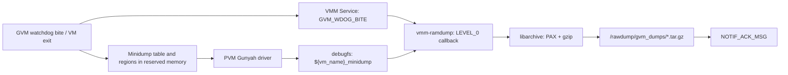

+++
date = '2026-08-26T16:30:00+08:00'
draft = false
title = 'VMM Ramdump 服务'
description = 'GVM Minidump 内存导出、VMM 事件订阅与归档机制'
categories = ['Qualcomm', 'Gunyah', '虚拟化']
tags = ['VMM', 'Ramdump', 'Minidump', 'Gunyah', 'debugfs', 'watchdog']
+++

`vmm-ramdump` 是运行在 PVM userspace 的转储归档程序。它不负责产生 GVM 的 Minidump 内容，也不直接重启 GVM；它负责在收到 `GVM_WDOG_BITE` 后，从 PVM 内核提供的 Gunyah debugfs 读取转储数据，将其压缩并保存到持久化目录，然后返回事件 ACK。

## 1. 整体原理

GVM Minidump 由“转储数据产生”“PVM 内核导出”和“PVM userspace 归档”三部分组成：

1. GVM 或平台 Minidump 机制在共享保留内存中留下区域描述表和转储数据。
2. GVM 退出并完成内存回收后，PVM Gunyah 驱动解析区域描述表，把每个有效区域导出为一个只读 debugfs 文件。
3. VMM Service 向 `vmm-ramdump` 发送 `GVM_WDOG_BITE`。
4. `vmm-ramdump` 等待 debugfs 目录出现，逐个读取文件并生成 `tar.gz`。
5. 回调结束后，VMM client library 向 VMM Service 发送 `NOTIF_ACK_MSG`，事件处理才会进入后续优先级。



debugfs 目录的创建和 VMM 事件通知属于两条独立链路，两者到达 userspace 的先后顺序不固定。因此 `vmm-ramdump` 收到事件后不会立即假定源目录已经存在，而是进行有限时间轮询。

## 2. 初始化与事件订阅

```text
vm_config_init()
  -> read vm_name, vmid and ramdump_type
  -> vmm_client_connect("vmm-ramdump")
  -> subscribe GVM_WDOG_BITE at LEVEL_0 with sync=true
  -> pause and wait for notification
```

`vmm-ramdump` 只为未禁用 Ramdump 的 VM 订阅 `GVM_WDOG_BITE`，订阅优先级为 `LEVEL_0`，即最高优先级。

这里的 `sync=true` 表示订阅请求会等待 VMM Service 返回订阅结果，并不表示转储回调以“同步模式”执行。事件到达后，VMM client library 先调用 `collect_ramdump()`；回调返回后，无论采集成功还是失败，client library 都会发送 ACK。

## 3. Minidump 数据如何变成 debugfs 文件

### 3.1 共享区域描述表

当前 PVM Gunyah 驱动从物理地址 `0xB20000000` 映射一个大小为 `0x2000` 的共享区域描述表。该地址和长度是当前平台实现中的固定配置。

描述表记录：

- 表版本和有效区域数量；
- 每个区域的名称和有效标志；
- 区域物理地址；
- 区域长度。

GVM 退出后，PVM secure VM loader 回收 GVM 内存，并调用 Minidump 收集入口。驱动复制有效的区域元数据，随后创建：

```text
/sys/kernel/debug/${vm_name}_minidump/
```

### 3.2 debugfs 文件不是普通磁盘文件

每个区域被导出为一个只读 debugfs 文件，命名格式为：

```text
md_${vmid_hex}_${region_name}.bin
```

其中 VMID 使用十六进制格式。例如 VMID 为十进制 `52` 时，文件名前缀为 `md_34_`。目录中还会生成 `dump_info.txt`，记录各区域的物理基址、长度、区域名和对应文件名。

这些文件并不是从 GVM 文件系统复制出来的普通文件。打开区域文件时，PVM 内核使用 `memremap()` 映射对应的物理内存；userspace 的 `read()` 从这段映射中读取数据；文件关闭时再通过 `memunmap()` 解除映射。

典型目录内容如下：

```text
dump_info.txt
md_34_KWDOGDATA.bin
md_34_LOG_INFO.bin
md_34_KLOGBUF.bin
md_34_KBOOT_LOG.bin
md_34_KTASK_STA.bin
md_34_KRUNQUEUE.bin
md_34_KMODULES.bin
...
```

debugfs 只是临时导出接口。下一次加载或重新启动同一 GVM 前，PVM 驱动会清理旧的 Full Ramdump 和 Minidump debugfs 目录。因此 VM 恢复运行后，`${vm_name}_minidump` 目录不存在是正常现象，持久化结果应从 `/rawdump/gvm_dumps/` 获取。

## 4. Ramdump 类型与路径

配置来自 `/etc/vm_config.xml`：

| 配置值 | 内部类型 | debugfs 源目录 | 最终归档文件 |
|--------|----------|----------------|--------------|
| `fulldump` | `RAMDUMP_TYPE_FULLDUMP` | `/sys/kernel/debug/${vm_name}/` | `gvm_ramdump_${vm_name}_${time}.tar.gz` |
| `minidump` | `RAMDUMP_TYPE_MINIDUMP` | `/sys/kernel/debug/${vm_name}_minidump/` | `gvm_minidump_${vm_name}_${time}.tar.gz` |
| `disable` | `RAMDUMP_TYPE_DISABLE` | 无 | 不订阅、不采集 |

未配置 `ramdump_type` 时，程序默认使用 Full Ramdump。当前解析逻辑明确识别 `minidump` 和 `disable`，其他值保持默认的 Full Ramdump；平台配置中约定使用 `fulldump`。

配置示例：

```xml
<vm>
  <vm_name>autoghgvm</vm_name>
  <vmid>52</vmid>
  <ramdump_type>minidump</ramdump_type>
</vm>
```

## 5. Minidump 文件包含哪些内容

这里的 Minidump 是 Qualcomm Linux Minidump region 集合，不是 Windows/Breakpad 的单一 `.dmp` 文件。GVM 内核把需要保留的内存区域逐项注册到 Minidump 表，PVM 再将每个 region 导出为独立的 `.bin` 文件。

当前 GVM 配置生成的归档包含 `69` 个 region 文件和一个 `dump_info.txt`。所有解压文件总量约为 `10.63 MiB`，其中 region 文件约为 `10.62 MiB`，压缩后的 `tar.gz` 约为 `956 KiB`。

| 类别 | 文件或 region | 当前大小 | 内容 |
|------|---------------|----------|------|
| 索引 | `dump_info.txt` | 8 KiB | PVM 生成的物理地址、长度、region 类型和文件名映射 |
| ELF 元数据 | `KELF_HDR` | 28,192 B | ELF64 core header、section/program header、字符串表及 `linux_banner` |
| 内核静态数据 | `KDATABSS` | 3,328,480 B | GVM 内核 `.data` 和 `.bss` 范围 |
| 只读静态数据 | `KROAIDATA` | 285,152 B | `ro_after_init` 区域；`KROAIDATA` 是当前实现中的实际名称 |
| Per-CPU 数据 | `KSPERCPU0`～`KSPERCPU9` | 每项 173,016 B | 每个 CPU 的静态 per-CPU 区域 |
| IRQ 栈 | `KISTK${cpu}_${page}` | 48 × 4 KiB | 12 个 CPU、每个 CPU 4 页的 IRQ stack 原始内存 |
| 模块信息 | `KMODULES` | 32 KiB | 已加载内核模块名称、基址和 PLT 数量等文本 |
| 调度信息 | `KRUNQUEUE` | 32 KiB | panic 时各 CPU 的 current、CFS、RT runqueue 和任务调度统计文本 |
| 任务栈摘要 | `KTASK_STA` | 256 KiB | panic notifier 生成的任务 PID、名称和符号化内核调用栈文本 |
| 启动日志 | `KBOOT_LOG` | 512 KiB | 从开机开始保存的内核日志文本，未使用部分以零填充 |
| printk ring | `KLOGBUF` | 1 MiB | printk 文本环形缓冲区 |
| printk 描述符 | `LOG_DESC` | 768 KiB | printk ring descriptor 数组 |
| printk 元数据 | `LOG_INFO` | 2.75 MiB | 每条 printk 记录的时间、级别、调用者等元数据 |
| Watchdog 状态 | `KWDOGDATA` | 1,008 B | `struct msm_watchdog_data` 的二进制快照 |

`KLOGBUF`、`LOG_DESC` 和 `LOG_INFO` 必须作为一个整体解析。只对 `KLOGBUF` 执行 `strings` 会丢失环形缓冲区的读写位置、记录边界、时间戳和日志级别。

`KTASK_STA` 是 `KTASK_STACK` 在 GVM 上的实际 section 名。GVM 构建启用了 `CONFIG_ARCH_QTI_VM`，Minidump region 名称最多为 9 个字符，因此名称被截断。

同一限制也影响双位 CPU 编号的 `KSPERCPU` 名称：`KSPERCPU10` 和 `KSPERCPU11` 会被截断并与已有名称冲突，所以当前包只注册到 `KSPERCPU9`；IRQ 栈名称较短，因此仍包含 CPU 10 和 CPU 11 的 `KISTK` region。

## 6. Minidump 大小受哪些因素影响

未压缩大小可以近似表示为：

```text
raw_size = dump_info_size + KELF_HDR_size + sum(valid_region.size)
```

压缩包大小还取决于 tar header 和 gzip 压缩率：

```text
archive_size = gzip(tar(all exported files))
```

当前包中所有文件的原始大小为 `11,148,352` 字节，最终压缩文件为 `978,518` 字节。压缩率较高是因为 `KBOOT_LOG`、`KRUNQUEUE`、`KTASK_STA` 等缓冲区包含文本和大量零填充。不同故障时有效日志量、栈内容和内存数据熵不同，即使 region 配置完全相同，最终 `tar.gz` 大小也会变化。

主要影响因素如下：

| 因素 | 影响范围 |
|------|----------|
| 注册的 region 数量 | 驱动和子系统调用 `msm_minidump_add_region()` 注册的内容越多，总量越大 |
| 每个 region 的注册长度 | Minidump 保存的是注册长度，而不是其中实际写入的有效字节数 |
| `log_buf_len` | 同时改变 `KLOGBUF`、`LOG_DESC` 和 `LOG_INFO`，是当前配置中影响最大的单项 |
| Possible CPU 数量 | 影响 per-CPU region 和 IRQ stack region 数量 |
| 内核链接布局 | `.data/.bss`、`ro_after_init` 和 per-CPU section 大小随内核版本及配置变化 |
| Panic 功能配置 | 决定是否加入 CPU context、任务栈、内存统计、ftrace、pstore 等 region |
| 模块数据注册 | `key_modules` 可把指定模块的 data section 分页加入 Minidump |
| region 数量上限 | 超过上限的 region 注册失败，不会进入最终 Minidump |
| gzip 数据特征 | 只影响压缩文件大小，不改变 Minidump 的原始 region 总量 |

## 7. 哪些参数可以控制大小

当前实现没有一个可以直接指定“Minidump 最大总字节数”的参数。需要分别控制 region 集合和各缓冲区大小。

### 7.1 可直接调整的参数

| 参数 | 当前配置 | 作用 |
|------|----------|------|
| GVM kernel cmdline `log_buf_len=1M` | `1M` | 决定 printk 文本 ring 大小，并按比例影响 `LOG_DESC` 和 `LOG_INFO` |
| `/sys/module/minidump/parameters/task_info` | `0` | `0` 只记录部分 runqueue 信息，默认 8 页；`1` 记录完整任务信息，默认 150 页 |
| `/sys/module/minidump/parameters/task_info_pages` | `8` | 直接设置 `KRUNQUEUE` 缓冲区页数，不改变 partial/full 的采集模式 |
| `/sys/module/minidump/parameters/stack_dump` | `0` | 启用后，panic 路径可额外注册当前任务的 `KSTACK*` 和 `KTASK*` region |
| `/sys/module/minidump/parameters/key_modules` | 空 | 指定最多 10 个关键模块，将其 data section 作为额外 region 注册 |
| `/sys/kernel/debug/gvm_minidump_enable` | `1` | PVM 侧总开关，只控制是否导出 GVM Minidump，不控制单包大小 |
| `/etc/vm_config.xml` 的 `ramdump_type` | `minidump` | 在 Full Ramdump、Minidump 和禁用之间选择，不控制 Minidump 内部大小 |

GVM 的 `log_buf_len=1M` 来自 VM device tree 的 bootargs。当前启动日志也显示 printk 分配为：

```text
text data: 1048576 bytes
metadata:  3670016 bytes
total:     4718592 bytes
```

因此，将 `log_buf_len` 从 `1M` 调整为 `512K` 时，printk 相关三个 region 通常会近似减半，但可保留的历史内核日志也会同步减少。

`task_info` 和 `task_info_pages` 可以在 GVM 运行期间读取：

```bash
adb -s <GVM_SERIAL> shell cat /sys/module/minidump/parameters/task_info
adb -s <GVM_SERIAL> shell cat /sys/module/minidump/parameters/task_info_pages
adb -s <GVM_SERIAL> shell cat /sys/module/minidump/parameters/stack_dump
adb -s <GVM_SERIAL> shell cat /sys/module/minidump/parameters/key_modules
```

写入这些参数只影响后续生成的 Minidump。`task_info_pages` 必须给当前采集模式留下足够空间，否则输出文本会被截断。`key_modules` 最适合在加载 `minidump.ko` 时设置；模块已经加载后再修改参数，不会自动重新扫描此前已经加载的内核模块。

### 7.2 编译期和源码级控制项

| 配置或常量 | 影响 |
|------------|------|
| `CONFIG_MINIDUMP_MAX_ENTRIES=200` | region 数量上限，同时影响 `KELF_HDR` 预分配大小；它不是总字节数上限 |
| `CONFIG_QCOM_MINIDUMP_PANIC_DUMP` | 启用 `KMODULES`、`KRUNQUEUE` 等 panic 信息 |
| `CONFIG_QCOM_MINIDUMP_PANIC_KTASK_STACK` | 启用 64 页的任务调用栈文本缓冲区，即当前的 `KTASK_STA` |
| `CONFIG_QCOM_MINIDUMP_PANIC_CPU_CONTEXT` | 启用 32 页的 `KCNTXT`；当前 GVM 未启用 |
| `CONFIG_QCOM_MINIDUMP_PANIC_MEMORY_INFO` | 加入 meminfo、slab、page owner、DMA-BUF 等缓冲区；当前 GVM 未启用 |
| `CONFIG_QCOM_MINIDUMP_FTRACE` | 加入 2 MiB ftrace 缓冲区；当前 GVM 未启用 |
| `CONFIG_QCOM_MINIDUMP_PSTORE` | 按 ramoops device tree 中的各 size 属性加入 pstore region；当前 GVM 未启用 |
| `CONFIG_QCOM_DYN_MINIDUMP_STACK` | 动态跟踪并注册 current/suspend task stack；当前 GVM 未启用 |
| `BOOT_LOG_SIZE` | `KBOOT_LOG` 固定为 512 KiB |
| `MD_MODULE_PAGES` | `KMODULES` 固定为 8 页 |
| `MD_KTASK_STACK_PAGES` | 任务栈文本固定为 64 页 |

`vmm-ramdump` 的 gzip 压缩级别固定为 6，目前没有配置参数。修改它只影响压缩时间和归档文件大小，不改变 GVM 实际导出的 Minidump 内容。

## 8. 如何解析 Minidump

### 8.1 快速查看

先解压归档并进入包内目录：

```bash
tar -xzf gvm_minidump_<vm_name>_<time>.tar.gz
cd gvm_ramdump_<vm_name>_<time>
```

查看 region 的物理地址和长度：

```bash
tr -d '\000' < dump_info.txt
```

检查 ELF header 中记录的 section、虚拟地址、物理地址和拼接偏移：

```bash
file md_34_KELF_HDR.bin
readelf -h -S -l md_34_KELF_HDR.bin
```

只查看 `KELF_HDR.bin` 时，`readelf` 会提示部分 section 超出文件末尾，这是正常现象：该文件只包含 ELF header 和 `linux_banner`，其他 section 数据仍位于独立的 `.bin` 文件中。

文本型 region 可以直接去掉尾部零填充后查看：

```bash
tr -d '\000' < md_34_KBOOT_LOG.bin > kernel_boot_log.txt
tr -d '\000' < md_34_KRUNQUEUE.bin > runqueue.txt
tr -d '\000' < md_34_KTASK_STA.bin > tasks.txt
tr -d '\000' < md_34_KMODULES.bin > modules.txt
```

`KDATABSS`、`KROAIDATA`、`KSPERCPU*`、`KISTK*` 和 `KWDOGDATA` 是内存或 C 结构体二进制数据，必须结合完全匹配的 GVM `vmlinux`、内核配置和模块符号解析。

### 8.2 使用 Qualcomm Linux Ramdump Parser V2

源码树中的标准解析工具位于：

```text
vendor/vendor/qcom/opensource/tools/linux-ramdump-parser-v2/
```

解析需要：

- 与崩溃 GVM 完全匹配、包含 DWARF debug info 的 `vmlinux`；
- ARM64 GDB、`llvm-nm` 和 `llvm-objdump`；
- Python 及 `pyelftools`；
- 如需解析模块地址，还需要匹配的 `.ko` 或 `.ko.unstripped` 符号目录。

当前源码树的 GVM `vmlinux` 示例路径为：

```text
vendor/kernel_platform/out/msm-kernel-autogvm-perf/dist/vmlinux
```

`vmm-ramdump` 输出的扩展名是小写 `.bin`，而解析器的 `generate_elf()` 在 Linux 上查找大写 `.BIN`。可以保留原文件，同时创建大写扩展名的符号链接：

```bash
for f in md_*.bin; do
  upper="${f%.bin}.BIN"
  [ -e "$upper" ] || ln -s "$f" "$upper"
done
```

当前 VMID 为十进制 `52`，region 文件使用十六进制前缀 `34`，因此解析器的 SVM 参数使用 `autoghgvm-34`：

```bash
cd vendor/vendor/qcom/opensource/tools/linux-ramdump-parser-v2

python3 ramparse.py \
  --minidump \
  --svm autoghgvm-34 \
  --auto-dump <EXTRACTED_DUMP_DIR> \
  --vmlinux <MATCHING_GVM_VMLINUX> \
  --gdb-path <AARCH64_GDB> \
  --nm-path <LLVM_NM> \
  --objdump-path <LLVM_OBJDUMP> \
  --outdir <OUTPUT_DIR> \
  --dmesg \
  --kbootlog \
  --print-runqueues \
  --watchdog
```

解析器会根据 `KELF_HDR` 的 section string table，按 ELF 中记录的顺序拼接各 region，在输出目录生成 `ap_minidump.elf`。常用输出包括：

| 参数 | 主要输入 | 输出内容 |
|------|----------|----------|
| `--dmesg` | `KLOGBUF`、`LOG_DESC`、`LOG_INFO` | 按顺序恢复的 kernel dmesg |
| `--kbootlog` | `KBOOT_LOG` | 从开机开始保存的 kernel log |
| `--print-runqueues` | `KRUNQUEUE`、`KISTK*` | runqueue 摘要及可用的 IRQ stack 信息 |
| `--watchdog` | `KWDOGDATA` | watchdog pet、timer 和 CPU 状态 |
| `-m <MODULE_SYMBOL_DIR>` | `KMODULES` 和模块符号 | 内核模块地址符号化 |

当前解析器的 `--print-tasks` 查找 section 名 `KTASK_STACK`，而 GVM 实际导出名为截断后的 `KTASK_STA`，所以该参数不能直接提取当前文件。应使用前述 `tr -d '\000'` 命令读取 `KTASK_STA`，或者在解析器中增加 `KTASK_STA` fallback。

Minidump 只包含已注册的 region。解析器能够读取日志、watchdog、runqueue 和被保留的内核数据，但未注册的任意进程内存、页表或 slab 页面不存在，因此部分面向 Full Ramdump 的解析插件会显示数据不可用。

## 9. `vmm-ramdump` 的归档过程

收到 `GVM_WDOG_BITE` 后，`collect_ramdump()` 依次完成以下工作：

1. 清理目标目录中的旧文件。
2. 确保目标目录存在。
3. 每隔 10 ms 检查一次 debugfs 源目录，最多检查 1000 次，即最多等待约 10 秒。
4. 使用 libarchive 创建临时文件 `*.tar.gz.dumping`。
5. 使用 restricted PAX 格式和 gzip 压缩，gzip 压缩级别为 6。
6. 遍历源目录，只归档普通文件；每次最多读取 1 MiB 数据并写入归档。
7. 成功关闭归档后，将临时文件重命名为最终的 `*.tar.gz`。
8. 回调返回，由 VMM client library 发送 ACK。

Minidump 的临时文件和最终文件示例：

```text
/rawdump/gvm_dumps/gvm_minidump_autoghgvm_YYYY-MM-DD-HH-MM-SS.tar.gz.dumping
/rawdump/gvm_dumps/gvm_minidump_autoghgvm_YYYY-MM-DD-HH-MM-SS.tar.gz
```

当前实现中，即使外层文件名使用 `gvm_minidump_`，压缩包内部的顶层目录仍统一命名为：

```text
gvm_ramdump_${vm_name}_${time}/
```

因此，解压工具和后处理脚本不应假设压缩包文件名与包内顶层目录具有相同前缀。

## 10. Minidump 文件保存在哪里

默认持久化目录是：

```text
/rawdump/gvm_dumps/
```

Minidump 文件名格式是：

```text
/rawdump/gvm_dumps/gvm_minidump_${vm_name}_YYYY-MM-DD-HH-MM-SS.tar.gz
```

Full Ramdump 文件名格式是：

```text
/rawdump/gvm_dumps/gvm_ramdump_${vm_name}_YYYY-MM-DD-HH-MM-SS.tar.gz
```

程序支持通过 `-d` 或 `--destination` 修改输出目录。系统服务默认执行 `/usr/bin/vmm-ramdump`，没有传递 `-d`，所以量产服务使用 `/rawdump/gvm_dumps/`。自定义目录参数应以 `/` 结尾，因为当前实现直接把目录字符串与文件名拼接。

可以在 PVM 中查看并导出文件：

```bash
adb -s <PVM_SERIAL> shell ls -lh /rawdump/gvm_dumps/
adb -s <PVM_SERIAL> pull /rawdump/gvm_dumps/<archive_name>.tar.gz .
tar -tzf <archive_name>.tar.gz
```

## 11. ACK、优先级与 GVM 恢复的关系

VMM Service 按优先级逐级发送事件。同一级别的通知全部发送后，服务端等待该级别所有订阅者 ACK，然后才进入下一级别。

`vmm-ramdump` 订阅在 `LEVEL_0`。因此，对于同一次 `GVM_WDOG_BITE`：

```text
LEVEL_0: vmm-ramdump reads debugfs and creates archive
         -> callback returns
         -> NOTIF_ACK_MSG
LEVEL_1 ... LEVEL_3
LEVEL_4: monitoring and reporting clients
```

这意味着 `LEVEL_4` 监控程序收到事件时，`LEVEL_0` 的 Ramdump 归档回调已经结束。归档耗时也会直接增加后续优先级处理链路的等待时间。

`vmm-ramdump` 不调用 qcrosvm 启停接口。GVM 的重新启动由 VMM Service 事件链中的恢复组件执行；Ramdump 服务的职责是在恢复流程继续前尽可能完成数据持久化并返回 ACK。

## 12. 生命周期、保留策略与失败文件

### 12.1 debugfs 生命周期

- GVM 退出并完成内存回收后，PVM 驱动创建转储 debugfs 目录。
- `vmm-ramdump` 在 watchdog 回调中读取该目录。
- 同一 GVM 下次加载前，PVM 驱动删除旧的 debugfs 目录。
- `tar.gz` 位于 `/rawdump`，不随 debugfs 清理而删除。

### 12.2 当前保留策略

每次开始新一轮采集时，程序会先删除目标目录中的现有条目，所以默认行为是只保留最新一次归档，而不是长期累积历史文件。清理发生在等待新 debugfs 目录之前；如果本次采集随后失败，上一份归档也已经被移除。

### 12.3 失败行为

- 如果约 10 秒内没有出现 debugfs 源目录，本次采集返回超时，不生成新归档。
- 如果归档已经打开后发生读写错误，程序尝试把临时文件重命名为带有 `-failed-<line>_<ret>` 信息的文件，便于识别不完整结果。
- 采集函数返回错误后，VMM client library 仍发送事件 ACK，因此失败不会让该订阅永久阻塞 VMM Service。

## 13. 服务依赖

`vmm-ramdump.service` 配置为在 `systemd-modules-load.service` 和 `vmm_drv.service` 之后启动。`After=` 只定义 systemd 启动顺序；程序随后通过 `/tmp/vmm_service_server` 连接 VMM Service，并等待同步订阅请求返回结果。

服务依赖 `vmm-lib` 和 `libarchive`。Minidump 的 debugfs 导出还依赖 PVM Gunyah 驱动中的 GVM Minidump 支持，并可通过以下全局 debugfs 开关控制：

```text
/sys/kernel/debug/gvm_minidump_enable
```

该开关默认启用。

## 14. 相关文档

- [VMM Service 架构总览](vmm-service-architecture.md)
- [VMM Service IPC](vmm-service-ipc.md)
- [VMM Service 运行时架构](vmm-service-runtime.md)
- [VMM Service 配置](vmm-service-configuration.md)
