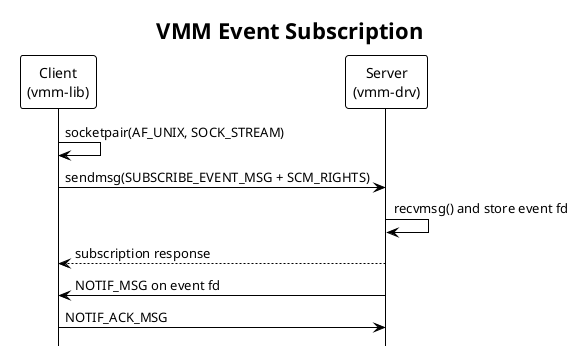

+++
date = '2026-08-26T16:30:00+08:00'
draft = false
title = 'VMM Service IPC 与客户端模型'
description = 'VMM Service 的消息协议、事件订阅、ACK、优先级和重连机制'
categories = ['Qualcomm', 'Gunyah', '虚拟化']
tags = ['VMM', 'IPC', 'Unix Domain Socket', 'SCM_RIGHTS', 'epoll']
+++

本文说明 `vmm-lib` 与 `vmm-drv` 之间的消息协议、事件订阅、ACK、客户端优先级及重连机制。

## 1. IPC 通道

VMM Service 使用 Unix Domain `SOCK_STREAM`：

| 用途 | 路径或前缀 |
|------|------------|
| VMM 服务端 | `/tmp/vmm_service_server` |
| 电源管理服务端 | `/tmp/vmm_pwr_mgr_server` |
| 客户端 bind 前缀 | `/tmp/vmmcb_` |
| 客户端 socket 前缀 | `/tmp/vmmc_` |

客户端通过 `vmm_client_connect()` 建立控制连接，通过 `vmm_subscribe_event_notification()` 注册事件回调。

## 2. 消息格式

### 2.1 请求

```c
typedef struct vmm_cmd_msg {
    struct { vmm_cmd_t msg_type; } hdr;
    union {
        vmm_sub_event_msg_t sub_event_msg;
        vmm_unsub_event_msg_t unsub_event_msg;
        vmm_vm_ctrl_msg_t ctrl_msg;
        vmm_pwr_key_msg_t pwr_key_msg;
    } data;
} vmm_cmd_msg_t;
```

### 2.2 响应

```c
typedef struct vmm_cmd_rsp {
    int32_t ret;
} vmm_cmd_resp_t;
```

`ret=0` 表示成功，负值使用 errno 语义。

### 2.3 事件通知

```c
typedef struct vmm_client_msg {
    struct { vmm_cmd_t msg_type; } hdr;
    uint32_t vmid;
    uint32_t event;
} vmm_client_msg_t;
```

## 3. 消息类型

| 类型 | 方向 | 作用 |
|------|------|------|
| `SUBSCRIBE_EVENT_MSG` | Client → Server | 订阅事件 |
| `UNSUBSCRIBE_EVENT_MSG` | Client → Server | 取消订阅 |
| `NOTIF_MSG` | Server → Client | 发送 VM 事件 |
| `NOTIF_ACK_MSG` | Client → Server | 确认事件已处理 |
| `CTRL_CMD_MSG` | Client → Server | START、STOP、RESTART |
| `PWR_KEY_CMD_MSG` | Client → Server | 电源键控制 |

## 4. 事件订阅

事件通道通过 `socketpair()` 创建，其中一个 fd 由客户端保留，另一个通过 `SCM_RIGHTS` 传给服务端。



服务端将传入 fd 保存到 `event_subscription_t::socket_fd`。控制请求继续使用主连接，事件通知使用独立的 socketpair 通道。

## 5. 订阅属性

```c
typedef struct vmm_subscribe_attr {
    event_cb event_cb_func;
    uint32_t event_mask;
    vmm_cprior_lvl level;
    void *priv_data;
    bool sync;
} vmm_subscribe_attr_t;
```

| 属性 | 说明 |
|------|------|
| `event_cb_func` | 客户端事件回调 |
| `event_mask` | 订阅的事件位掩码 |
| `level` | 通知优先级 `LEVEL_0`～`LEVEL_4` |
| `priv_data` | 回调私有上下文 |
| `sync` | 是否同步等待订阅结果 |

`vmm-boot-lcm` 使用异步订阅，`vmm-ramdump` 使用同步订阅。

## 6. 客户端优先级

`LEVEL_0` 最先收到通知，`LEVEL_4` 最后收到通知。

| Client | 优先级 | 订阅模式 | 角色 |
|--------|--------|----------|------|
| `vmm-boot-lcm` | `LEVEL_0` | async | Boot 生命周期管理 |
| `gunyah-vm{N}-hab-*` | `LEVEL_0` | async | vhost-user HAB 通道 |
| `vmm-ramdump` | `LEVEL_0` | sync | Ramdump 收集 |
| `QC-PM` | `LEVEL_0` | async | 平台电源管理 |
| `gvm_susp_service` | `LEVEL_0` | async | OEM GVM 挂起 |
| `gvm_resume_service` | `LEVEL_0` | async | OEM GVM 恢复 |
| `gvm_shutdown_service` | `LEVEL_0` | async | OEM GVM 关机 |

## 7. VM 事件

| 事件 | 位 | 含义 |
|------|----|------|
| `GVM_WDOG_BITE` | `1 << 0` | Guest watchdog |
| `GVM_CONTAINER_CRASH` | `1 << 1` | qcrosvm container 退出 |
| `GVM_SHUTDOWN` | `1 << 2` | Guest 主动关机 |
| `GVM_STOPPED` | `1 << 3` | VM 已停止 |
| `GVM_HANDLED_CONTAINER_CRASH` | `1 << 4` | 已处理的 container 退出 |
| `GVM_BAD_STATE` | `1 << 5` | 无效状态 |
| `GVM_UP_AND_RUNNING` | `1 << 7` | VM 正常运行 |
| `GVM_EVENT_LPM_SUSPEND_SUCCESS` | `1 << 8` | 低功耗挂起完成 |
| `GVM_EVENT_LPM_RESUME_SUCCESS` | `1 << 9` | 低功耗恢复完成 |
| `GVM_EVENT_FATAL_ERROR` | `1 << 11` | LCM fatal event |
| `GVM_EVENT_UP` | `1 << 12` | LCM VM up event |
| `GVM_EVENT_DOWN` | `1 << 13` | LCM VM down event |

常用组合掩码：

```c
GVM_SHUTDOWN_LEVEL_0 = GVM_WDOG_BITE |
                       GVM_CONTAINER_CRASH |
                       GVM_HANDLED_CONTAINER_CRASH;

GVM_SHUTDOWN_LEVEL_1 = GVM_SHUTDOWN |
                       GVM_STOPPED |
                       GVM_BAD_STATE;
```

## 8. ACK 行为

除 LPM suspend/resume 事件外，客户端收到 `NOTIF_MSG` 后必须回复 `NOTIF_ACK_MSG`。

```c
#define VMM_EVENT_NO_ACK \
    (GVM_EVENT_LPM_SUSPEND_SUCCESS | GVM_EVENT_LPM_RESUME_SUCCESS)
```

服务端当前通过 `vmm_recvmsg_from_client()` 等待 ACK。等待依赖客户端响应或连接断开结束。

## 9. 可靠 I/O

IPC 封装处理以下情况：

- `send()`、`recv()`、`sendmsg()`、`recvmsg()` 遇到 `EINTR` 时重试。
- `MSG_TRUNC` 或 `MSG_CTRUNC` 返回 `-EMSGSIZE`。
- 消息长度不符合协议返回 `-EPROTO`。
- 断开的连接返回 `-ECONNRESET`、`-EBADF` 或 `-ENOTCONN`。

## 10. 客户端重连

启用 `VMM_DRV_RESTART_ENABLE` 后，客户端使用独立线程监控主连接：

```text
connect_server()
  -> connect Unix socket
  -> retry with backoff: 50 ms ... 1 s
  -> monitor EPOLLRDHUP / EPOLLHUP / EPOLLERR
  -> reconnect
  -> restore event subscriptions
```

未启用该宏时，客户端只执行初始连接，不自动重连。

## 11. 相关文档

- [VMM Service 架构总览](vmm-service-architecture.md)
- [VMM Service 运行时架构](vmm-service-runtime.md)
- [Boot Lifecycle Manager](vmm-boot-lifecycle.md)
- [VMM Ramdump 服务](vmm-ramdump-service.md)
