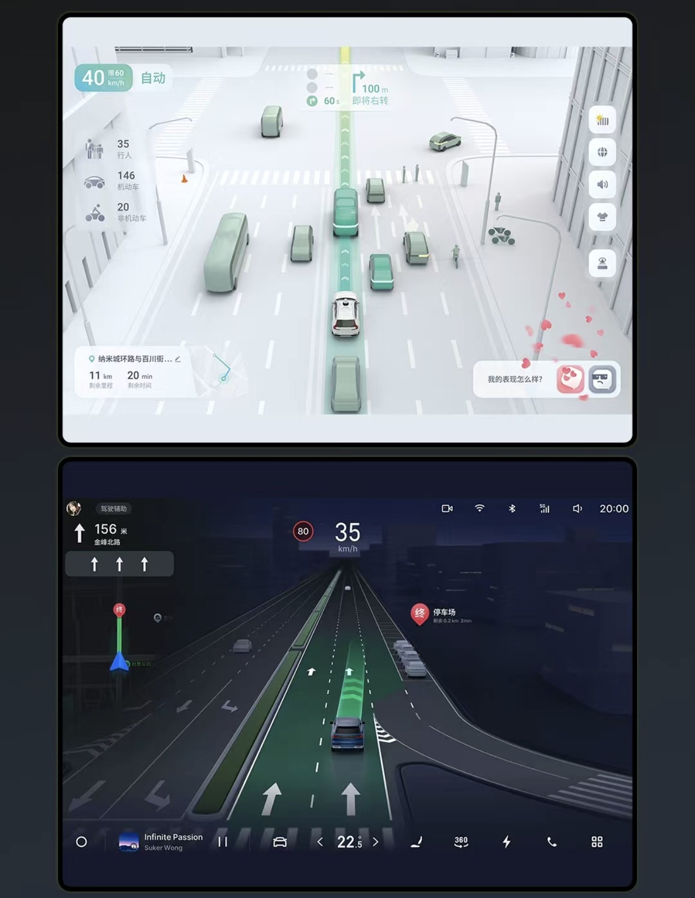
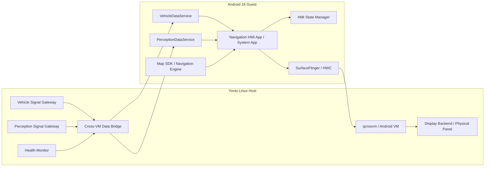
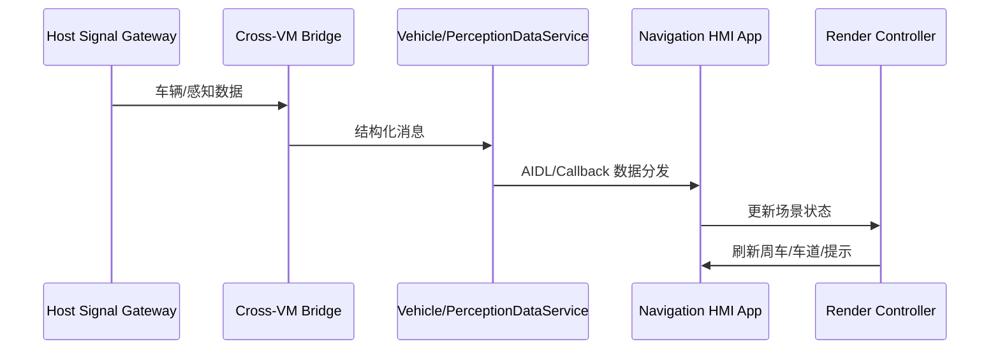

+++
date = '2026-04-09T14:30:00+08:00'
draft = true
title = 'Qualcomm 8397 中控融合导航 HMI 需求分析与方案设计'
tags = ['IVI', 'Qualcomm', 'Yocto', 'Android', 'qcrosvm', 'Navigation', 'Center Display']
+++

# Qualcomm 8397 中控融合导航 HMI 需求分析与方案设计

## 版本信息

| 项目 | 内容 |
| --- | --- |
| 文档版本 | V2.0 |
| 日期 | 2026-04-09 |
| 目标平台 | Qualcomm 8397 |
| 软件架构 | Yocto Linux + qcrosvm + Android 16 Guest |
| 目标显示 | 中控主屏 |
| 文档目的 | 基于产品效果图，输出面向量产的需求分析与软件方案设计 |

---

## 1. 需求理解

### 1.1 需求来源

产品提供的目标效果图如下：

### 1.2 对图片的正确解读

这两张图都应理解为**中控主屏上的导航/HMI 页面**，不是 Linux Host 仪表页面，也不是 Host 原生 3D HMI 页面。

结合当前行业量产实践和 `Qualcomm 8397 + Yocto Linux + qcrosvm + Android Guest` 的典型落地方式，本需求应按以下方式理解：

1. **最终用户看到的是 Android Guest 中的中控页面。**
2. **Linux Host 负责虚拟化承载、显示通路和车辆/感知数据供给，不是该页面的 UI Owner。**
3. **推荐量产方案应基于“方案 B”：Android Guest 渲染中控导航主页面。**
4. 上图代表两种典型显示态：
   - **融合俯视态**：偏辅助驾驶/环境理解表达，突出周边车辆、车道和路线。
   - **导航沉浸态**：偏前视 3D 导航表达，突出道路、目标车道、限速和事件提醒。

### 1.3 产品目标

本项目目标是在中控主屏上实现一套量产可交付的融合导航 HMI，满足：

- 导航、车道级引导、周边目标、事件提醒在同一套 Android HMI 中表达。
- 页面可在不同驾驶场景下切换不同视觉态，但交互保持连续。
- 方案适配 `Yocto Linux Host + Android 16 Guest` 虚拟化架构。
- 后续可扩展到分屏、Dock、Launcher 容器、语音和多屏协同。

---

## 2. 需求分析

### 2.1 用户场景

| 场景 | 触发条件 | 用户关注点 | 目标表现 |
| --- | --- | --- | --- |
| 日常导航 | 用户发起导航 | 路线清晰、路口易懂 | 输出导航沉浸态，突出目标道路和车道 |
| 高速辅助驾驶 | ADAS/NOA 工作中 | 看清系统意图和周边车况 | 输出融合俯视态，增强周边目标和道路拓扑 |
| 复杂路口 | 匝道/大路口/并线 | 快速判断该走哪条道 | 目标车道高亮，错误车道弱化，动作提示前置 |
| 夜间行车 | 自动切夜景 | 降眩光、可读性强 | 夜景主题，保留关键引导对比度 |
| 导航服务异常 | 地图 SDK 卡死/路由中断 | 不能黑屏 | 页面保底显示基础引导或切回普通地图态 |

### 2.2 功能需求

| ID | 功能项 | 优先级 | 说明 |
| --- | --- | --- | --- |
| FR-001 | 中控全屏导航 HMI 页面 | P0 | 页面运行于 Android Guest，中控主屏显示 |
| FR-002 | 融合俯视态 | P0 | 突出自车、周车、道路、路径、车道关系 |
| FR-003 | 导航沉浸态 | P0 | 突出前方道路、目标车道、路口放大和限速提醒 |
| FR-004 | 路线引导信息 | P0 | 剩余距离、ETA、下一机动点、道路名称 |
| FR-005 | 车道级引导 | P0 | 目标车道、分岔、匝道、并线提示 |
| FR-006 | 周边目标可视化 | P0 | 车辆、行人、障碍物、锥桶等可视化 |
| FR-007 | 日夜景主题切换 | P0 | 自动切换并支持视觉风格统一 |
| FR-008 | 状态切换动画 | P1 | 两种场景态切换平滑，不黑屏不闪烁 |
| FR-009 | 右侧快捷操作区 | P1 | 收藏、设置、语音、回家等能力入口 |
| FR-010 | 底部常驻区 | P1 | 媒体、快捷操作、空调或系统入口 |
| FR-011 | 导航异常降级 | P0 | 导航语义异常、地图服务异常时可回退 |
| FR-012 | Host 数据接入 | P0 | 车速、转向、档位、ADAS 状态、周边目标接入 Android |
| FR-013 | 埋点与监控 | P1 | 帧率、时延、模式切换、异常退出、黑屏统计 |

### 2.3 非功能需求

| 类别 | 目标值 |
| --- | --- |
| 流畅度 | 常规场景 60fps，重载场景不低于 30fps |
| 切换体验 | 模式切换不允许黑屏，不允许明显闪屏 |
| 首帧时间 | 热启动 < 800ms，冷启动可见首帧 < 2.5s |
| 感知显示时延 | Host 感知数据到 Android 可视化 < 120ms |
| 导航更新时延 | 路由和车道信息更新到画面 < 150ms |
| 稳定性 | 24h 长稳不崩溃，异常可恢复 |
| 热管理 | 高温场景可降级到 30fps，不允许直接退出主页面 |
| 内存 | Android 页面及其依赖常驻内存需受控，避免 Guest 内存水位失控 |

### 2.4 外部依赖

| 依赖 | 内容 |
| --- | --- |
| 地图能力 | Android 地图 SDK / 地图 App，提供路径规划、车道、路口引导等能力 |
| Host 信号 | Linux Host 提供车速、转角、档位、驾驶模式等车辆信号 |
| 感知数据 | Linux Host 提供周边目标、车道线、可行驶区域等数据 |
| 定位 | Android 地图定位或 Host 定位统一输入 |
| 虚拟化显示 | qcrosvm + Guest 显示虚拟化链路负责 Android 页面上屏到中控面板 |

### 2.5 待确认项

1. 两张图是两个固定模式，还是一个页面在不同场景下的镜头和主题切换。
2. 地图供应商是否支持自定义 3D 场景、车道级语义输出、ADAS 目标 Overlay。
3. 右侧快捷栏和底部栏由导航 HMI 页面负责，还是由 Launcher/SystemUI 容器负责。
4. 周边目标是否来自量产 ADAS 结果，还是仅做视觉弱耦合展示。
5. 是否要求导航页支持与其他 Android 页面无缝分屏或小窗切换。

---

## 3. 方案设计

### 3.1 方案选择结论

**推荐方案：方案 B，Android Guest 渲染中控导航主页面。**

这是当前量产中控导航/HMI 的主流落地方式，原因如下：

1. **地图生态和导航产品能力天然在 Android 侧。**
   搜索、收藏、账号、路径规划、地图 SDK、语音播报通常都在 Android Guest 内。

2. **中控页面的 UI 迭代和 HMI 演进主要发生在 Android 侧。**
   页面视觉、交互、动效、产品改版在 Android App/系统应用中更高效。

3. **量产实践中，Host 更适合做数据桥接和显示承载，而不是替代 Android 做中控导航 UI。**

4. **这两个页面都是中控视觉页，而不是仪表安全关键页。**
   因此应优先采用 Android 主渲染，而非 Host 原生渲染。

### 3.2 方案定位

在本项目中：

- **Android Guest 是中控导航 HMI 的页面载体和渲染主域。**
- **Yocto Linux Host 是数据提供者、虚拟化宿主和显示链路承载者。**
- **物理屏幕最终由 Host 侧显示栈驱动，但页面逻辑和画面生成发生在 Android Guest。**

这三个角色必须分清：

| 角色 | 归属 |
| --- | --- |
| 页面逻辑 Owner | Android Guest |
| 页面渲染 Owner | Android Guest |
| 车辆/感知数据源 | Linux Host |
| 物理显示输出 | Linux Host 显示链路 |

### 3.3 系统总体架构

### 3.4 Android Guest 侧设计

#### 3.4.1 页面承载方式

推荐两种落地形态：

| 形态 | 说明 | 适用性 |
| --- | --- | --- |
| B1 推荐 | 独立 `Navigation HMI App` 或系统导航 App，全屏运行在中控主屏 | 量产主路径，性能和体验最好 |
| B2 备选 | `Launcher/SystemUI` 作为容器，通过 `TaskView` 或固定任务嵌入导航页 | 适合需要统一桌面壳和常驻 Dock 的车型 |

推荐优先 `B1`，原因：

- 一个页面内完成地图、ADAS Overlay、右侧栏、底部栏的统一控制。
- 避免多窗口频繁 resize 带来的闪烁和黑边风险。
- 更容易把两种视觉态做成同一个渲染状态机，而不是两个 Activity 来回切。

#### 3.4.2 Android 侧核心模块

| 模块 | 职责 |
| --- | --- |
| Navigation HMI App | 中控主页面，负责最终 UI 和场景渲染 |
| HMI State Manager | 管理俯视态、沉浸态、普通导航态、降级态 |
| Map SDK Adapter | 封装地图 SDK，获取路径规划、机动点、车道、限速、路口信息 |
| VehicleDataService | 接收 Host 车辆信号，转为 Android 内统一数据模型 |
| PerceptionDataService | 接收 Host 感知结果，输出周边目标和状态 |
| Render Controller | 管理场景相机、图层刷新、动效和主题切换 |
| Perf Monitor | 采集首帧、FPS、卡顿、切态失败、黑屏事件 |

#### 3.4.3 页面渲染策略

推荐采用**一个 Android 页面，一个主渲染场景**的思路，而不是多 App 叠层拼装。

建议分三层：

1. **Map Base Layer**
   - 由地图 SDK 输出基础地图、路线、道路、地标和导航主体画面。
2. **ADAS / Perception Overlay Layer**
   - 由 Android 页面基于 Host 感知数据绘制周车、障碍物、车道边界、危险提示。
3. **HMI UI Layer**
   - ETA、下一动作、右侧快捷栏、底部栏、提示气泡、状态角标。

#### 3.4.4 渲染技术建议

优先级建议如下：

| 技术路径 | 建议 |
| --- | --- |
| 地图 SDK 原生 3D 能力 + Android UI Overlay | 最优先，最贴近量产 |
| 地图 SDK + 自定义 OpenGL/Filament/Vulkan Overlay | 地图 SDK 支持有限时采用 |
| 多 Surface 拼接 | 仅在地图 SDK 无法满足 Overlay 时使用，需严格控风险 |

说明：

- 如果地图供应商支持自定义图层、车道引导、3D 相机和模型叠加，优先直接在地图引擎能力上做。
- 如果地图引擎对 ADAS Overlay 支持不足，可在同一页面内增加自定义渲染层。
- 不建议通过“Android 地图页 + Host 3D 页”两域混合来拼这个页面。

### 3.5 Linux Host 侧设计

Host 在该方案中不是页面渲染端，而是以下角色：

| 模块 | 职责 |
| --- | --- |
| Vehicle Signal Gateway | 聚合车速、档位、方向盘角度、灯光、驾驶模式等信号 |
| Perception Signal Gateway | 聚合周边车辆、行人、障碍物、车道线、可行驶区域等数据 |
| Cross-VM Data Bridge | 将 Host 数据可靠送入 Android Guest |
| qcrosvm / Guest Manager | 管理 Android Guest 生命周期 |
| Display Backend | 承接 Android Guest 图形输出并驱动物理中控面板 |
| Health Monitor | 检测 Guest 心跳、桥接状态、数据超时和异常恢复 |

### 3.6 Host 到 Android 的数据链路

推荐采用独立的数据桥接服务，不把业务数据耦合到图形通路中。

推荐的数据通道：

- `vsock + protobuf`
- 或 Qualcomm 平台既有跨 VM RPC/共享内存机制

要求：

- 数据模型版本化
- 时间戳对齐
- 丢包和超时检测
- 感知目标采用增量更新或固定频率推送

### 3.7 显示链路设计

必须明确区分“页面在哪渲染”和“最终屏幕由谁驱动”：

1. 导航 HMI 页面在 **Android Guest** 渲染。
2. Guest 的 `SurfaceFlinger/HWC/DRM` 输出通过虚拟化显示链路传到 Host。
3. **Host 显示后端** 最终驱动物理中控屏。

因此正确表述应为：

**页面是 Android 的，中控物理显示通路是 Host 的。**

### 3.8 页面状态机设计

| 状态 | 进入条件 | 表现 | 退出条件 |
| --- | --- | --- | --- |
| S0 普通导航态 | 有导航，无 ADAS 强提示 | 常规 3D 导航视角 | 进入复杂路口或辅助驾驶态 |
| S1 导航沉浸态 | 临近动作点/复杂引导 | 放大前向道路和目标车道 | 动作完成或状态变化 |
| S2 融合俯视态 | ADAS/NOA 工作中或需强化环境理解 | 高机位显示周边目标、道路拓扑和路线 | ADAS 退出 |
| S3 降级态 | 地图语义异常或数据超时 | 保留最小必要导航信息，弱化复杂效果 | 服务恢复 |
| S4 回退地图态 | HMI 渲染异常或高级能力失效 | 回到普通地图页 | HMI 恢复 |

### 3.9 关键设计原则

1. **一个主页面统一控制场景状态。**
2. **优先在 Android 内完成视觉融合，不跨域拼页面。**
3. **Host 只传数据，不传业务 UI。**
4. **中控导航页允许降级，但不允许黑屏。**
5. **页面设计必须适配地图 SDK 能力边界，避免方案脱离实际。**

### 3.10 界面元素拆解

基于效果图，这个中控页面可拆成以下几类可见元素。

| 类别 | 界面元素 | 位置/表现 | 作用 |
| --- | --- | --- | --- |
| 地图场景 | 道路、路口、建筑、地面材质 | 全屏背景主场景 | 提供空间感和道路结构 |
| 导航主元素 | 导航路线、目标道路、目标车道、引导箭头 | 主场景中央 | 告诉用户该怎么走 |
| 自车元素 | 自车车模/箭头 | 主场景中心附近 | 标识当前车辆姿态和位置 |
| 环境感知元素 | 周边车辆、行人、锥桶、障碍物、车道边界 | 自车周边 | 呈现周边环境和风险 |
| 交通语义元素 | 限速牌、电子眼、红绿灯、道路名称 | 场景上方或路面附近 | 强化驾驶相关语义 |
| 导航信息卡片 | ETA、剩余距离、下一动作、剩余时间 | 左下或顶部 | 提供结构化导航信息 |
| 驾驶状态元素 | 辅助驾驶状态、车速、模式标签 | 左上/顶部 | 告知当前系统状态 |
| 快捷操作元素 | 收藏、设置、语音、回家、常用入口 | 右侧竖栏 | 提供常用操作入口 |
| 底部常驻元素 | 媒体、空调、快捷功能、车辆入口 | 底部条形区域 | 维持常驻系统操作 |
| 瞬时提示元素 | Toast、风险提示、语音气泡、重算提示 | 右下/中上 | 告知瞬态事件 |

### 3.11 界面元素数据来源

不同元素并不来自同一个系统，推荐按“地图域、车辆域、感知域、系统域、静态资源域”来拆。

| 界面元素 | 主要数据来源 | 归属域 | 典型更新方式 |
| --- | --- | --- | --- |
| 基础地图、道路几何、建筑、地标 | 地图 SDK / 地图引擎 | Android Guest | 地图引擎实时渲染 |
| 路线、剩余距离、ETA、下一动作 | 路径规划结果、导航引擎 | Android Guest | 路由变更事件驱动 |
| 目标车道、路口放大、车道箭头 | 地图 SDK 车道级导航能力 | Android Guest | 接近机动点时高频更新 |
| 自车位置和航向 | 地图定位、GNSS/INS、Host 统一定位输入 | Android Guest 或 Host->Guest | 周期更新 |
| 自车速度、转向、档位、ACC/NOA 状态 | Vehicle Signal Gateway | Linux Host | 周期推送 |
| 周边车辆、行人、障碍物、车道边界 | Perception Signal Gateway | Linux Host | 高频周期推送 |
| 限速、电子眼、道路名称 | 地图导航语义 | Android Guest | 事件驱动 |
| 辅助驾驶模式文案、系统状态角标 | Host 车辆状态 + Android 页面状态机 | Host + Android Guest | 状态变化驱动 |
| 右侧快捷栏、底部栏 | 产品配置、系统能力、用户偏好 | Android Guest | 本地状态驱动 |
| 主题颜色、图标、动画资源 | APK 内静态资源包 | Android Guest | 本地资源加载 |

#### 需要特别区分的三类数据

1. **地图语义数据**
   - 路线、机动点、道路名称、限速、车道级引导。
   - 主来源是 Android 地图 SDK。

2. **车辆状态数据**
   - 车速、转角、档位、驾驶模式、辅助驾驶开关。
   - 主来源是 Linux Host 车辆信号网关。

3. **环境感知数据**
   - 周边车辆、行人、锥桶、静态障碍、车道边界、可行驶区域。
   - 主来源是 Linux Host 感知网关。

### 3.12 这些元素如何绘制

推荐采用“地图主渲染 + 自定义 Overlay + Android UI”的绘制方式。

#### 3.12.1 基础地图和导航主体

这部分由地图 SDK 或地图引擎负责绘制，主要包括：

- 地图底图
- 道路几何
- 路线高亮
- 路口放大
- 车道级引导
- 限速和道路名称

特点：

- 这部分通常已经由地图引擎做了相机控制、道路投影和 3D 场景优化。
- 应尽量复用地图 SDK 原生能力，而不是完全自己重画道路和路径。

#### 3.12.2 自车和环境感知 Overlay

这部分推荐在 Android 页面中通过自定义渲染层绘制，主要包括：

- 自车车模
- 周边车辆
- 行人/障碍物
- 车道边界增强
- 风险提示高亮

绘制方式建议：

1. **优先方案**
   - 地图 SDK 提供自定义图层/3D Marker/Overlay 能力。
   - 直接把 Host 感知结果映射到地图坐标系中，在地图引擎内绘制。

2. **次优方案**
   - 地图底层仍由 SDK 绘制。
   - Android 页面增加一个自定义 `GL/Filament/Canvas Overlay`，在上层叠加感知元素。

3. **不推荐方案**
   - 单独拉一个 Host 3D 页面去画周边目标，再和 Android 地图页跨域拼接。

#### 3.12.3 HMI 控件层

这部分推荐使用常规 Android UI 技术绘制：

- `View`
- `ConstraintLayout`
- `MotionLayout`
- 或 `Jetpack Compose`

主要包括：

- ETA 卡片
- 下一动作提示
- 右侧快捷栏
- 底部媒体/快捷栏
- Toast、Badge、风险提示气泡

这些元素本质上是产品 UI，不应交给地图引擎或 Host 去绘制。

### 3.13 渲染分层

这里需要区分两套层次：

1. **逻辑渲染层**
   - 面向产品和图形设计的分层。
2. **Android 物理合成层**
   - 面向 SurfaceFlinger / HWC 的真实合成层。

#### 3.13.1 逻辑渲染层

推荐按五层拆：

| 层级 | 名称 | 内容 | 数据来源 | 推荐刷新频率 |
| --- | --- | --- | --- | --- |
| L0 | 基础场景层 | 地图底图、道路、建筑、地面 | 地图 SDK | 地图引擎内部控制 |
| L1 | 导航语义层 | 路线、目标车道、箭头、路口放大、限速 | 地图 SDK | 导航事件驱动 |
| L2 | 感知融合层 | 周车、行人、障碍物、车道边界增强 | Host 感知数据 | 高频周期刷新 |
| L3 | HMI 信息层 | ETA、下一动作、模式标签、状态提示 | Android 页面状态机 + Host/地图数据 | UI 按需刷新 |
| L4 | 瞬时效果层 | Toast、转场、风险高亮、呼吸动画 | Android 页面状态机 | 动画驱动 |

这五层里：

- `L0 + L1` 最好尽量在同一个地图渲染上下文中完成。
- `L2` 取决于地图 SDK 扩展能力，可并入地图层，也可独立叠加。
- `L3 + L4` 明确属于 Android UI 层。

#### 3.13.2 Android 物理合成层

从 Android 合成实现看，推荐控制在以下几层：

| 物理层 | 承载方式 | 内容 |
| --- | --- | --- |
| P0 | 地图主 Surface | 地图场景、路线、道路、车道主体 |
| P1 | 可选 Overlay Surface | 感知目标、自车模型、特殊 3D Overlay |
| P2 | App UI Layer | 右侧栏、底部栏、卡片、提示 |

推荐原则：

1. **优先两层**
   - `P0 地图主 Surface`
   - `P2 App UI Layer`
   - 前提是地图 SDK 足够强，能把感知 Overlay 直接画进地图层。

2. **必要时三层**
   - `P0 地图主 Surface`
   - `P1 自定义 Overlay Surface`
   - `P2 App UI Layer`

3. **不建议超过三层核心渲染面**
   - Surface 太多会增加 HWC/SF 合成复杂度。
   - 容易引入 resize、Z-order、同步和闪烁问题。

#### 3.13.3 推荐的最终实现

若地图供应商支持自定义场景和 Overlay，推荐最终形态为：

- `P0`：地图 SDK 主场景，承担 `L0 + L1 + 部分 L2`
- `P2`：Android UI 层，承担 `L3 + L4`

若地图供应商不支持完整感知 Overlay，则采用：

- `P0`：地图 SDK 主场景，承担 `L0 + L1`
- `P1`：自定义渲染层，承担 `L2`
- `P2`：Android UI 层，承担 `L3 + L4`

### 3.14 性能设计

| 项目 | 设计建议 |
| --- | --- |
| 页面结构 | 单页面主渲染，减少多 Activity 来回切换 |
| Surface 数量 | 尽量减少独立 Surface 数量，避免合成复杂度过高 |
| 感知刷新 | 感知目标按固定节拍刷新，避免 UI 主线程抖动 |
| 数据桥接 | Host->Guest 采用结构化消息，不走大对象频繁拷贝 |
| 主题切换 | 日夜景切换以材质参数和 UI 主题切换为主，避免重建大场景 |
| 高温降级 | 降阴影、降远景细节、降目标数量、降帧到 30fps |

### 3.11 稳定性与降级设计

| 异常 | 降级策略 |
| --- | --- |
| Host 感知数据超时 | 隐藏周边目标层，保留地图和导航主信息 |
| 地图车道语义异常 | 回退到普通导航态，不展示高级车道模型 |
| Android 页面卡顿 | 降低 Overlay 刷新频率，保留关键导航信息 |
| 高级 HMI 逻辑异常 | 切回普通地图导航页 |
| Guest 重启 | Host 监测心跳并重拉起；页面恢复后回到上次导航会话 |

### 3.12 安全与升级

| 类别 | 要求 |
| --- | --- |
| 接口权限 | Android 侧数据服务采用 system app/system UID 白名单 |
| 协议安全 | 消息长度校验、字段校验、版本兼容 |
| 诊断能力 | 记录数据超时、页面崩溃、首帧、切态、黑屏 |
| OTA 策略 | Host 桥接协议与 Android 客户端协议解耦，支持双侧独立升级 |

### 3.13 方案对比

| 方案 | 描述 | 适用性 | 结论 |
| --- | --- | --- | --- |
| A | Linux Host 原生渲染中控主页面 | 不符合本需求的中控量产路径 | 不推荐 |
| B 推荐 | Android Guest 渲染中控主页面，Host 提供数据和显示承载 | 符合当前行业主流量产方式 | 推荐 |
| C | Android 地图页 + Host HMI 页拼接混合 | 架构复杂，体验和维护成本高 | 不推荐 |

---

## 4. 测试与验证策略

### 4.1 功能验证

- 发起导航、取消导航、偏航重算、复杂路口、匝道分流。
- 普通导航态、导航沉浸态、融合俯视态之间切换。
- 日夜景自动切换。
- Host 感知数据接入和丢失恢复。
- Guest 页面重启恢复。

### 4.2 性能验证

- 常规路测场景 FPS。
- 复杂路口高密度感知目标场景 FPS。
- Host 到 Android 的数据时延。
- 页面热启动、冷启动、恢复时间。
- 24h 长稳和高温压力。

### 4.3 故障注入

- 人工断开 Host->Guest 数据桥。
- 地图 SDK 模拟无车道语义。
- Guest 导航页 crash。
- 高温降频和 GPU 压力场景。

### 4.4 验收标准

| 项目 | 标准 |
| --- | --- |
| 黑屏 | 模式切换和异常恢复过程中不允许黑屏 |
| 可恢复性 | 页面异常后可回退到普通地图态 |
| 流畅度 | 常规场景 60fps，重载场景不低于 30fps |
| 一致性 | 车速、车道、引导动作、限速信息显示正确 |
| 工程化 | Host/Guest 协议可扩展、可监控、可独立升级 |

---

## 5. 项目实施建议

### 5.1 分阶段落地

| 阶段 | 目标 |
| --- | --- |
| Phase 1 | 打通 Host 数据桥和 Android 导航页，完成普通导航态 |
| Phase 2 | 接入车道级引导和沉浸态视觉 |
| Phase 3 | 接入周边目标和融合俯视态 |
| Phase 4 | 完成动效、降级、性能和稳定性治理 |

### 5.2 关键前置条件

1. 地图供应商确认车道级和自定义 Overlay 能力。
2. Host 输出车辆和感知数据的字段定义、频率、坐标系统一。
3. 产品确认右侧栏和底部栏归属，是导航页内实现还是容器实现。
4. Android 页面技术路线明确，是独立系统 App 还是 Launcher 容器页。

---

## 6. 结论

对本需求的正确方案判断应是：

**这两个页面都是中控主屏上的 Android 导航 HMI 页面，推荐采用行业主流量产方案 B：Android Guest 渲染页面，Linux Host 提供数据和显示承载。**

因此本项目的正确架构边界是：

- **Android Guest**：页面逻辑、地图能力、场景渲染、状态切换、交互和动效。
- **Linux Host**：车辆/感知数据提供、跨 VM 传输、Guest 生命周期管理、物理屏幕显示链路。

这比 Host 原生渲染方案更符合：

- 当前中控量产导航/HMI 的行业实现路径
- 地图产品和 Android 生态的实际依赖关系
- 这次需求本身针对“中控页面”的产品定义

后续如果产品需要，我可以继续把这份文档再细化成两份：

1. `技术评审版`：补齐进程图、AIDL/Bridge 协议、渲染分层和性能预算。
2. `产品评审版`：补齐页面状态流转、交互规则、异常降级和验收口径。
