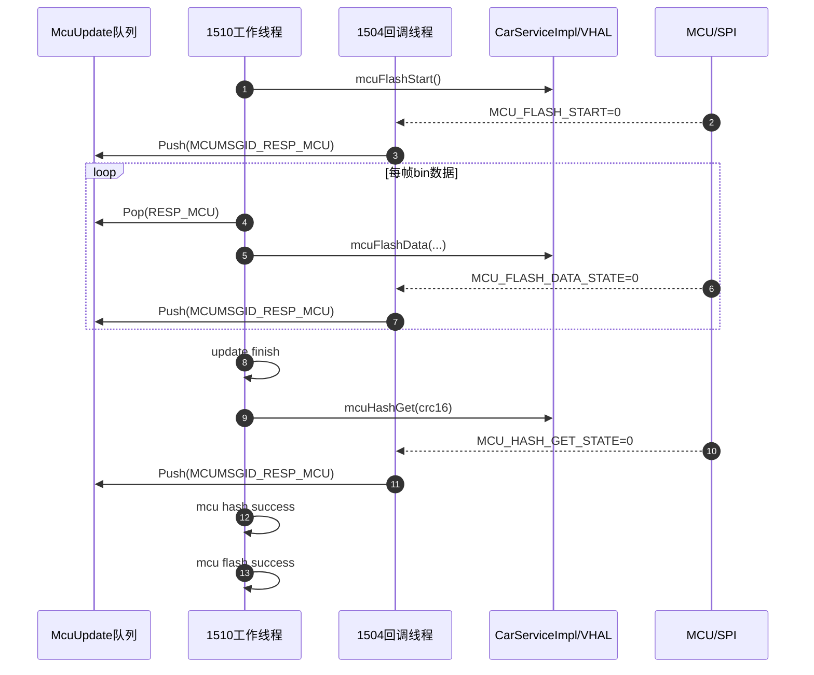
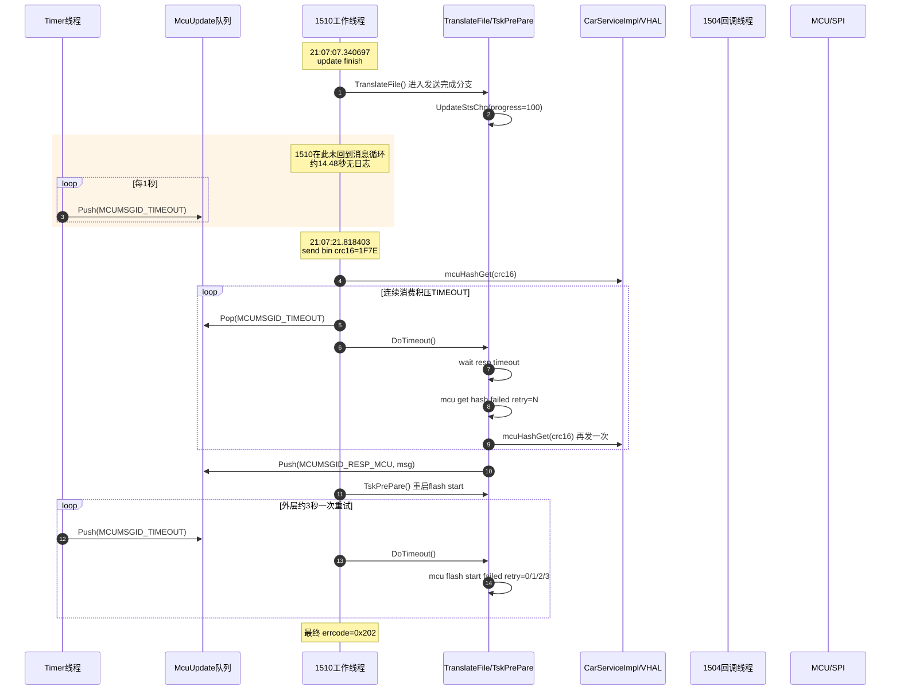
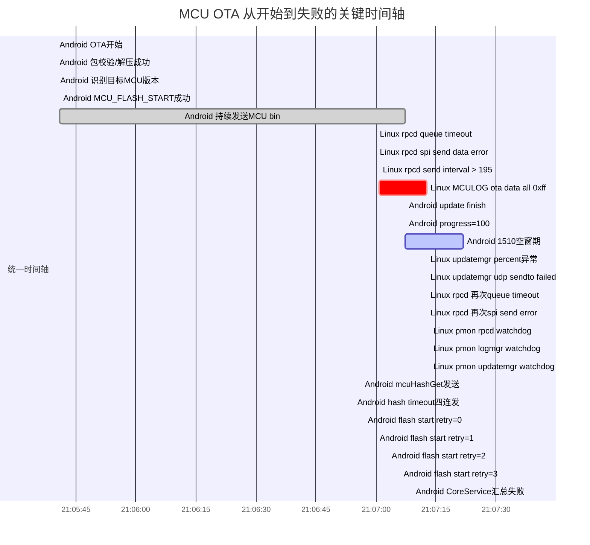

+++
date = '2025-08-08T11:36:11+08:00'
draft = true
+++

# MCU OTA升级流程分析

## 1. MCU升级的正常流程

### 1.1 参与线程和模块
- `1448(UpdateServer)`：OTA主进程。
- `1510(McuUpdate)`：MCU升级工作线程，负责状态机和消息消费。
- `1504(CoreService callback)`：VHAL属性回调线程，把MCU/VHAL回包转换成 `MCUMSGID_RESP_MCU` 投递给 `1510`。
- `Timer线程`：`McuUpdate::Init()` 中启动的周期定时器线程，每 `1s` 投递一次 `MCUMSGID_TIMEOUT`。
- `792(VoyahVehicleHalServer/DataTransferManagerBase/SPIComm)`：VHAL到MCU的属性下发和SPI链路。

### 1.2 正常代码流程
1. `CoreService` 创建MCU升级任务，`1510` 收到 `MCUMSGID_CMD_FLUSH`。
2. `TskPrePare()` 调用 `CarServiceImpl::mcuFlashStart()`，等待 `MCU_FLASH_START` 回包。
3. `CoreService callback` 收到 `MCU_FLASH_START` 成功回包后，投递 `MCUMSGID_RESP_MCU`。
4. `1510` 进入 `TskUpdate()->HandleSingleUpdate()->TranslateFile()`。
5. `TranslateFile()` 在 `g_context.step == 0` 阶段循环做以下动作：
   - 读取 bin 文件分片。
   - 调用 `mcuFlashData()` 下发一帧数据。
   - 等待 `MCU_FLASH_DATA_STATE` 回包。
   - 成功则继续下一帧。
6. 当所有 bin 数据发送完成后：
   - `TranslateFile()` 打印 `update finish`。
   - 关闭文件句柄。
   - `g_context.step++`，进入 hash 校验阶段。
7. 在 `g_context.step == 1 && g_context.endflag == 1` 阶段：
   - 调用 `mcuHashGet(crc16, 2)` 下发 CRC16/hash 请求。
   - 等待 `MCU_HASH_GET_STATE` 回包。
   - 成功则打印 `mcu hash success`，返回 `0`。
8. `HandleSingleUpdate()` 收到 `TranslateFile()==0` 后：
   - 调用 `UpdateStsChg(UP_STS_UPGRADE_DONE, ...)`。
   - 打印 `mcu flash success`。
   - `TskNextSub()` 进入后续任务。

### 1.3 正常时序图



## 2. MCU的异常流程

### 2.1 本次异常现象
本次异常并不是 bin 数据发送阶段失败，而是：
- MCU 数据分片发送完成。
- `1510` 在 `update finish` 之后，直到 `send bin crc16` 之前出现了约 `14.48s` 的空窗。
- 这段时间 timer 线程继续每秒投递 `MCUMSGID_TIMEOUT`，造成 timeout 消息堆积。
- `1510` 恢复执行后，先发出 `mcuHashGet()`，随后立即连续消费积压的多个 `TIMEOUT`，于是出现同一毫秒内 `retry=0..3` 的现象。
- 最后转入 `retry update start mcu`，重新执行 `mcuFlashStart()`，再按约 `3s` 周期重试 4 次后失败退出。

### 2.2 异常时序图



## 3. log文件分析记录和代码分析记录

### 3.1 log文件分析记录

#### 3.1.1 MCU bin发送完成
log文件：[/home/voyah/Downloads/IVI8397-2712/android_log/android/236_20260323_210808.logcat.log](/home/voyah/Downloads/IVI8397-2712/android_log/android/236_20260323_210808.logcat.log#L130765)

关键日志：
```text
03-23 21:07:07.290601  1448  1510 I [VOYAH_OTA_UPDATE][McuUpdate]: [TranslateFile] send data to mcu, addr=851456, crc=0x1f7e
03-23 21:07:07.340697  1448  1510 I [VOYAH_OTA_UPDATE][McuUpdate]: [TranslateFile] update finish
03-23 21:07:07.340705  1448  1510 I [VOYAH_OTA_UPDATE][McuUpdate]: [UpdateStsChg] sts[1] progress[100] errcode[0] fail[0]
```

结论：
- MCU bin 数据发送已经完成。
- 最后一帧 `MCU_FLASH_DATA_STATE` 成功回包也已经收到。
- 到这里为止，MCU分片发送流程是通的。

#### 3.1.2 1510线程出现约14.48秒空窗
关键事实：
- `21:07:07.340705` 之后，`1510` 无任何日志。
- 下一条 `1510` 日志直到 `21:07:21.818403` 才出现。

时间差：
- `21:07:21.818403 - 21:07:07.340705 = 14.477698s`

结论：
- `1510` 在这段时间没有回到消息循环继续消费 `MCUMSGID_TIMEOUT` / `MCUMSGID_RESP_MCU`。
- timeout 堆积的前提条件，就是这段空窗。

#### 3.1.3 timeout连发和hash retry连发
log文件：[/home/voyah/Downloads/IVI8397-2712/android_log/android/236_20260323_210808.logcat.log](/home/voyah/Downloads/IVI8397-2712/android_log/android/236_20260323_210808.logcat.log#L134800)

关键日志：
```text
03-23 21:07:21.818403  1448  1510 I ... [TranslateFile]  send bin crc16=1F7E
03-23 21:07:21.818594  1448  1510 I ... [DoTimeout] wait resp timeout
03-23 21:07:21.818609  1448  1510 I ... [TranslateFile] mcu get hash failed retry=0
03-23 21:07:21.818647  1448  1510 I ... [DoTimeout] wait resp timeout
03-23 21:07:21.818651  1448  1510 I ... [TranslateFile] mcu get hash failed retry=1
03-23 21:07:21.818683  1448  1510 I ... [DoTimeout] wait resp timeout
03-23 21:07:21.818687  1448  1510 I ... [TranslateFile] mcu get hash failed retry=2
03-23 21:07:21.818717  1448  1510 I ... [DoTimeout] wait resp timeout
03-23 21:07:21.818721  1448  1510 I ... [TranslateFile] mcu get hash failed retry=3
```

结论：
- 这 4 次不是 4 个独立的 3 秒重试周期。
- 它们是 1510 恢复后连续处理多个已积压的 `MCUMSGID_TIMEOUT`。

#### 3.1.4 外层flash start retry约3秒一次
关键日志：
```text
03-23 21:07:22.302576 ... mcu flash start failed retry=0
03-23 21:07:25.264378 ... mcu flash start failed retry=1
03-23 21:07:28.264567 ... mcu flash start failed retry=2
03-23 21:07:31.264774 ... mcu flash start failed retry=3
```

结论：
- 外层 `mcu flash start failed retry=N` 的重试周期确实约 `3s`。
- 这和 `g_context.timecnt = 3`、timer `1s` 周期是匹配的。

#### 3.1.5 底层链路异常证据
同一时段底层有如下异常：
```text
SocketComm: read: recvLen(-1) error
SocketComm: read: recvLen(0) error
DataTransferManagerBase: fill_data_to_buff_by_little_endian: Invalid signal bit length (must be 1-64)
DataTransferManager_H47A: receive invalid spi package from mcu!
```

结论：
- MCU/VHAL/SPI链路在失败时段并不稳定。
- 这些日志说明后续 hash/flash start 失败不是纯软件状态机误判，而是链路和回包本身也异常。

### 3.2 代码分析记录

#### 3.2.1 timeout消息的生产和消费
代码位置：
- [McuUpdate.cpp](/home/voyah/workspace/8397/fw_private_code/fwk_apps/update/update_server/ua/mcu_update/McuUpdate.cpp#L121)
- [McuUpdate.cpp](/home/voyah/workspace/8397/fw_private_code/fwk_apps/update/update_server/ua/mcu_update/McuUpdate.cpp#L487)
- [CMsgQueue.h](/home/voyah/workspace/8397/fw_private_code/fwk_apps/update/update_server/utils/CMsgQueue.h#L62)
- [McuUpdate.cpp](/home/voyah/workspace/8397/fw_private_code/fwk_apps/update/update_server/ua/mcu_update/McuUpdate.cpp#L165)

结论：
- timer线程每 `1s` 固定 `Push(MCUMSGID_TIMEOUT)`。
- 队列不去重、不丢弃旧 timeout。
- `1510` 单线程顺序消费这些消息。

#### 3.2.2 DoTimeout本身不会一次连跑4次
代码位置：
- [McuUpdate.cpp](/home/voyah/workspace/8397/fw_private_code/fwk_apps/update/update_server/ua/mcu_update/McuUpdate.cpp#L465)

关键逻辑：
```cpp
if (0 < g_context.timecnt) {
    g_context.timecnt--;
    if (0 == g_context.timecnt) {
        CallCurrentTsk(errmsg);
    }
}
```

结论：
- 单次 `DoTimeout()` 最多只触发一次 `CallCurrentTsk()`。
- 日志里 4 次 `DoTimeout` 连发，只能来自 4 条队列消息被连续消费。

#### 3.2.3 hash阶段的代码路径
代码位置：
- [McuUpdate.cpp](/home/voyah/workspace/8397/fw_private_code/fwk_apps/update/update_server/ua/mcu_update/McuUpdate.cpp#L1170)

关键逻辑：
- `g_context.step == 1 && g_context.endflag == 1` 时进入 hash 阶段。
- `mcuHashGet(crc16, 2)` 下发后，设置：
  - `g_context.status = MCUUPDATE_STS_WAITRESP`
  - `g_context.timecnt = D_TIME_RecvMcuData`
- hash失败时：
  - 内层 `retry` 先做 0..3 次。
  - 超过后转入 `retryUpdate`，重新 `Push(MCUMSGID_RESP_MCU)` 触发外层 `TskPrePare()`。

#### 3.2.4 1510卡顿可能发生的代码位置
代码位置：
- [McuUpdate.cpp](/home/voyah/workspace/8397/fw_private_code/fwk_apps/update/update_server/ua/mcu_update/McuUpdate.cpp#L1138)
- [System.h](/home/voyah/workspace/8397/fw_private_code/fwk_apps/update/update_server/utils/System.h#L182)

`update finish` 和 `send bin crc16` 之间的剩余代码非常短：
```cpp
UpdateStsChg(-1,100,-1,-1);
rf.close();
g_context.status = MCUUPDATE_STS_IDLE;
g_context.step++;
```

结论：
- `UpdateStsChg()` 仅修改内存并打 log，不像阻塞点。
- `g_context.status` / `g_context.step++` 是内存操作，不像阻塞点。
- 如果源码和运行二进制一致，那么卡顿范围只能落在这一小段；最可疑点是 `rf.close()` 这一行附近。

### 3.3 从升级开始到升级失败的总时间轴

下面这条时间轴把 Android 侧 OTA 流程、`1510` 的关键动作，以及 linux host 侧异常放在同一条线上。



时间轴结论：
- 从主流程看，MCU bin 发送是成功跑完的，失败发生在发送完成后的 hash/响应阶段。
- 从因果顺序看，host 侧 MCU/SPI 异常早于 Android 侧最终失败。
- 从放大机制看，`1510` 的 14.48 秒空窗导致 timeout 堆积，恢复后在 hash 阶段集中爆发。
- 从系统背景看，`21:07:12` 到 `21:07:13` 已出现 host 侧多模块 watchdog timeout，因此不能把问题简单收敛为 `rf.close()` 单点。

## 4. 分析结论

### 4.1 直接结论
本次 MCU OTA 失败可拆成两个层次：

1. **超时连发的直接机制**
   - 不是 `DoTimeout()` 一次回调内部循环 4 次。
   - 而是 `1510` 恢复后，连续消费了队列里积压的多个 `MCUMSGID_TIMEOUT`。

2. **导致 timeout 堆积的前置问题**
   - `1510` 在 `21:07:07.340705` 到 `21:07:21.818403` 之间出现了约 `14.48s` 的空窗。
   - 这说明它没有回到消息循环继续处理 timeout。
   - 结合源码，这段空窗的卡顿范围已经缩到 `TranslateFile()` 的 `update finish` 之后、`send bin crc16` 之前。
   - 在当前代码里，最可疑点是 `rf.close()` 附近。

### 4.2 MCU最终失败原因
- `1510` 恢复后进入 hash 阶段。
- 因为 timeout 已堆积，hash 请求刚发出就连续触发超时失败。
- 后续转入 `retry update start mcu`。
- `mcuFlashStart()` 再按约 `3s` 周期失败 4 次。
- 最终 `CoreService` 汇总为 `ERRCODE_UPDATE_RESPERR(0x202)`，HMI显示 `MCU flashing failed`。

### 4.3 一句话总结
本次 OTA 的表象是“hash阶段超时 + MCU回包异常”，其背后的放大器是：`1510` 在 `update finish` 后发生了约 `14.48s` 的线程级停顿，导致 timeout 消息堆积并在恢复后集中爆发。

### 4.4 `rf.close()`可疑点专项结论

#### 4.4.1 为什么会怀疑 `rf.close()`
从源码看，`1510` 在打印完 `update finish` 之后，到打印 `send bin crc16` 之前，只剩下很少几行代码：

```cpp
UpdateStsChg(-1,100,-1,-1);
rf.close();
g_context.status = MCUUPDATE_STS_IDLE;
g_context.step++;
```

位置见：
- [McuUpdate.cpp](/home/voyah/workspace/8397/fw_private_code/fwk_apps/update/update_server/ua/mcu_update/McuUpdate.cpp#L1138)
- [System.h](/home/voyah/workspace/8397/fw_private_code/fwk_apps/update/update_server/utils/System.h#L182)

其中：
- `UpdateStsChg()` 只做内存字段更新和日志打印。
- `g_context.status = ...` 与 `g_context.step++` 只是内存赋值。
- `rf.close()` 是这段代码里唯一真实的库调用点。

所以如果运行二进制与源码一致，那么 `21:07:07.340705` 到 `21:07:21.818403` 之间这约 `14.48s` 的空窗，必须优先怀疑落在 `rf.close()` 附近。

#### 4.4.2 证据链
1. 日志明确显示：
   - `21:07:07.340697`：`[TranslateFile] update finish`
   - `21:07:07.340705`：`[UpdateStsChg] sts[1] progress[100] errcode[0] fail[0]`
   - `21:07:21.818403`：`[TranslateFile] send bin crc16=1F7E`
2. 中间 `1510` 无任何日志，说明线程没有回到消息循环。
3. timer 线程却在这段时间继续每秒入队 `MCUMSGID_TIMEOUT`，最终导致后续 timeout 连发。
4. 这段空窗既不在 `DoTimeout()`，也不在 `mcuHashGet()` 之后，而是发生在 hash 请求发出之前。
5. 代码上唯一匹配这种“发 hash 之前的长耗时点”的，就是 `rf.close()` 附近。

#### 4.4.3 能说明什么，不能说明什么
能说明：
- `rf.close()` 是当前代码路径里最强可疑点。
- 它足以解释为什么 `1510` 没及时消费 timeout，导致 timeout 堆积并集中爆发。

不能说明：
- 现有日志还不能最终证明线程一定阻塞在 `std::ifstream::close()` 内部。
- 也不能仅凭当前证据判断是文件系统 flush、块设备延迟、FUSE/overlay、还是底层存储抖动导致它慢。

#### 4.4.4 建议如何最终坐实
建议在以下位置补日志：
- `update finish` 前。
- `rf.close()` 前。
- `rf.close()` 后。
- `g_context.step++` 后。
- `send bin crc16` 前。

如果补充日志后出现：
- `before rf.close()`
- 约14秒空窗
- `after rf.close()`

则可以直接坐实：`1510` 的停顿点就在 `rf.close()`。 

### 4.5 linux host 侧交叉证据与对 `rf.close()` 假设的修正

#### 4.5.1 host 侧新增证据
本次补充分析了 linux host 侧 `dlt` / `syslog`，其中 `dlt` 已转换为文本，输出目录如下：
- `/tmp/linux_dlt_text/dlt_541.txt` 到 `dlt_570.txt`
- `/tmp/linux_dlt_text/tgz/*.txt`

其中，与本次故障时间窗最相关的是：
- `/tmp/linux_dlt_text/tgz/4-58-77.txt`

关键 host 侧日志如下：

1. `21:07:00` 起，`rpcd_mcu_spi` 已开始报 MCU 通信异常：
```text
2026/03/23 21:07:00.109653 rpcd_mcu_spi.c:574 MCU message queue timeout
2026/03/23 21:07:00.109662 rpcd_mcu_spi.c:665 spi send data error
2026/03/23 21:07:00.804762 rpcd_mcu_spi.c:593 send data interval > 195
```

2. 同一时段持续出现 MCU OTA 数据异常：
```text
2026/03/23 21:07:00.806831 MCULOG--[151][ota]data all 0xff
2026/03/23 21:07:12.616087 MCULOG--[077][ota]data all 0xff
2026/03/23 21:07:12.675623 MCULOG--[142][ota]data all 0xff
```

3. `21:07:12` 左右，host 侧出现成片 watchdog timeout，范围不止一个模块：
```text
2026/03/23 21:07:13.469378 [2_rpcd] watchdog timeout
2026/03/23 21:07:13.469384 [5_logmgr] watchdog timeout
2026/03/23 21:07:13.469397 [1_updatemgr] watchdog timeout
```

4. `updatemgr` 自身在该窗口也有异常：
```text
2026/03/23 21:07:12.616309 [updclient][devid0]process_update_percent_unreal percent_bk=[15]
2026/03/23 21:07:12.616313 [updclient][devid0]udp sendto failed 2
2026/03/23 21:07:13.469397 [1_updatemgr] watchdog timeout
```

5. `syslog` 侧没有看到明确的文件系统/块设备错误，例如：
- `EXT4/F2FS/UFS I/O error`
- `read-only remount`
- `blk_update_request`
- `hung task`

#### 4.5.2 这些 host 侧证据说明什么
这些证据说明：
- 在 Android 侧 `1510` 出现 `14.48s` 空窗之前，linux host 侧的 MCU 通信已经异常。
- 在 Android 侧 hash 阶段爆发前，host 侧已经出现了系统范围的 watchdog timeout。
- `updatemgr`、`rpcd`、`logmgr` 等多个模块都在同一窗口异常，不像只有一个 `ifstream::close()` 单点慢调用。

因此，host 侧证据更支持以下判断：
- 本次故障主轴仍然是 MCU/SPI/OTA 通信链路异常。
- `1510` 的 14 秒空窗，更可能是“线程在异常系统环境里未及时继续执行”，而不是已经能证明“卡死在 `rf.close()` 内核路径里”。

#### 4.5.3 对 `rf.close()` 假设的修正
修正后的判断应为：

1. 从 Android 代码直线执行路径看，`update finish` 到 `send bin crc16` 之间，`rf.close()` 仍然是**局部最可疑点**。
2. 但结合 linux host 侧证据，**不能再把 `rf.close()` 当作当前最有力的系统级根因**。
3. 更稳妥的结论是：
   - `1510` 的空窗是真实存在的。
   - timeout 堆积也是真实存在的。
   - 但造成空窗的背景，很可能是 host 侧已经存在的 MCU 通信异常和多模块 watchdog/调度异常。
   - `rf.close()` 最多只能保留为“当前代码路径上的局部可疑点”，不能单独作为已证实根因。

#### 4.5.4 当前更稳妥的综合结论
综合 Android 侧和 linux host 侧证据，当前最稳妥的结论是：

- MCU OTA 失败的主因仍是 MCU/SPI 链路异常，表现为 `spi send data error`、`MCU message queue timeout`、`ota data all 0xff`、`invalid spi package from mcu`。
- `1510` 的 14.48 秒空窗导致了 timeout 消息堆积，并放大了后续 hash 阶段失败。
- 但这段空窗更可能与 host 侧整体异常状态有关，而不能简单归因为 `rf.close()` 本身。
- 现阶段，`rf.close()` 应从“重点怀疑根因”修正为“代码路径上的局部可疑点，需进一步埋点确认”。

## 4.6 与历史 UFS/BH 锁问题的对比结论

之前调查过一个 OTA 期间多进程 watchdog timeout 的问题，其根因已经闭环到 host 内核侧：高优先级 `irq/314-qcom-mc-409` 在 UFS I/O 完成回调路径中长期持有 per-CPU BH 锁，导致多个业务线程和 watchdog 线程在 `close() -> unix_release_sock()` 路径上阻塞，最终无法向 pmonitor 发送心跳。这个历史问题说明，`pmonitor` 报出的“多进程 watchdog timeout”并不一定代表这些用户态进程都各自卡死，也可能是共同被 host 侧某个底层锁竞争拖住。

基于这个历史问题模型，对当前 case 的 `linux_log` 再次筛查了以下关键字：
- `irq/314-qcom-mc-409`
- `qcom-mc`
- `ufs`
- `ufshcd`
- `local_bh_disable`
- `unix_release_sock`
- `rt_spin_lock`
- `blocked for more than`
- `D state`
- `hung task`
- `writeback`
- `folio`
- `fsync`

筛查结果如下：

1. 当前日志中没有找到能够直接闭环到“UFS IRQ/BH 锁长期持有”的内核证据。
   - 没有看到 `irq/314-qcom-mc-409` 或同类 IRQ 线程的异常栈。
   - 没有看到 `local_bh_disable`、`unix_release_sock`、`rt_spin_lock` 相关阻塞栈。
   - 没有看到 `blocked for more than`、`D state`、`hung task` 这类内核卡死告警。
   - 在 syslog 中能看到的 `ufs/ufshcd` 关键字，主要是系统启动期模块加载信息，与本次 21:06:50~21:07:39 故障时窗无直接关系。

2. 但当前日志里能确认 host 侧在故障时窗出现了明显的系统异常与通信异常。
   关键证据来自 `/tmp/linux_dlt_text/tgz/4-58-77.txt`：
   - `2026/03/23 21:06:50.656853` 开始持续出现 `MCU message queue timeout`
   - `2026/03/23 21:06:50.656874` 开始持续出现 `spi send data error`
   - `2026/03/23 21:06:50.656997` 开始出现 `udp sendto failed 2`
   - `2026/03/23 21:06:50.656999` 开始出现 `process_update_percent_unreal percent_bk=[13]`
   - `2026/03/23 21:07:00.806831` 起大量出现 `MCULOG--[xxx][ota]data all 0xff`
   - `2026/03/23 21:07:38.8716xx` 起大量出现 `rpcd_mcu_spi.c:645 rx data error`
   - `2026/03/23 21:07:39.481647` 出现 `pmonitor_main.c:867 [0_powmgr] watchdog timeout`
   - `2026/03/23 21:07:39.481651` 起成片出现 `[2_rpcd]...[14_animmgr] watchdog timeout`

3. 因此，当前 case 与历史问题的关系应当这样表述：
   - 两者在现象层面是相似的，都表现为 OTA 期间 host 侧多进程 watchdog timeout。
   - 历史问题已经证明，这类现象可能由 host 内核/调度/锁竞争引起，而不是每个进程各自独立故障。
   - 但当前 case 还缺少足够的内核栈证据，不能直接定性为“同一个 UFS IRQ/BH 锁问题复现”。

4. 结合当前 case 的 Android 和 Linux 证据，更稳妥的结论是：
   - `1510` 的 14.48s 空窗，不能简单地归因于 `rf.close()` 自身慢。
   - 当前更强的证据是 MCU/SPI 通信异常已经在 host 侧持续出现，并伴随 host 多进程 watchdog timeout。
   - 历史 UFS/BH 锁问题提供了一个合理的解释模型，但在当前日志里仍然只能作为“可能的宿主机侧机制参考”，不能当作已证实根因。

## 5. 无法确认的地方

以下点目前仍无法仅靠现有 log 和源码完全确认：

1. `1510` 在 `21:07:07.340705` 到 `21:07:21.818403` 之间，是否真的阻塞在 `rf.close()`。
   - 这是当前代码路径上最可疑的位置。
   - 但现有日志没有 `rf.close()` 前后埋点，无法最终坐实。

2. `rf.close()` 若真的卡顿，根因是：
   - 文件系统阻塞。
   - 存储介质抖动。
   - FUSE/overlay/IO flush。
   - 还是其它库层行为。
   目前无法从现有日志确认。

3. 底层 SPI/Socket 异常与 1510 卡顿之间的因果顺序无法完全确认。
   - 现有证据可以确认“同一时段链路异常存在”。
   - 但不能仅凭现有日志证明“链路异常直接导致了 1510 的14.48秒停顿”。

4. `MCU_HASH_GET_STATE=1` 的语义虽然在代码中被映射为失败，但 MCU 侧为什么返回失败，现有 Android 侧日志无法解释。
   - 需要 MCU bootloader/刷写协议侧日志进一步确认。

5. 现有日志无法确认队列里在 `21:07:21` 前到底积压了多少条 `MCUMSGID_TIMEOUT`。
   - 只能从 4 次连续 `DoTimeout` 推断至少有 4 条被连续消费。

6. 建议补充验证

   - 在 `TranslateFile()` 的以下位置补日志：
      - `update finish` 前。
      - `rf.close()` 前。
      - `rf.close()` 后。
      - `g_context.step++` 后。
      - `send bin crc16` 前。
   - 若日志显示 `rf.close()` 前后存在约14秒空窗，则可以最终坐实卡点。
   - 同时建议抓取：
   - `/proc/<1448>/task/1510/stack`
   - ftrace / systrace
   - 存储IO延迟
   - MCU bootloader日志

## 6. Linux host 侧 updatemgr I/O 风暴根因分析

### 6.1 核心发现

性能抖动的根因是：**PVM（Linux）侧的 `updatemgr` 在 MCU OTA 的同一时间窗口内，正在执行 Android 分区（`system_a`）的 OTA 升级，涉及大量磁盘 I/O 操作（8GB 读写，~140MB/s 持续 114 秒），导致 UFS I/O 阻塞。** Polaris 监控数据显示 CPU 使用率仅 ~13%、load ~5，问题不是 CPU 饱和，而是进程被阻塞在 I/O 等待（D-state）中。在 Gunyah/qcrosvm 虚拟化架构下，PVM 的 I/O 阻塞通过 virtio 后端传导到 GVM（Android），造成跨 VM 的级联故障。

证据来源：
- `/tmp/linux_dlt_text/tgz/4-58-77.txt`（Linux DLT 日志）
- `/home/voyah/Downloads/IVI8397-2712/android_log/mcu/mcu.log`（MCU 日志）
- `/home/voyah/Downloads/IVI8397-2712/linux_log/syslog/084_20260323_210309.zip`（Linux syslog）

### 6.2 双 OTA 并行启动

`21:05:41` 是本次故障的起点。在这一秒内，两个独立的 OTA 流程几乎同时启动：

| 时间 | 子系统 | 事件 |
|---|---|---|
| `21:05:41.020` | Android McuUpdate | MCU OTA 开始，`1510` 线程开始发送 bin 数据到 MCU |
| `21:05:41.072` | Linux updatemgr | 收到 Android OTA 升级请求，开始解压 `update.zip`（包含 230 个文件） |
| `21:05:45.848` | Linux updatemgr | 开始处理 `patn1`（system 分区升级） |
| `21:05:46.445` | Linux updatemgr | `patn0`（boot 分区）执行 `zstdext` 解压，segment 大小 **268,435,456 bytes (256MB)** |

### 6.3 updatemgr I/O 活动详细时间线

#### 6.3.1 大文件密集写入阶段（21:05:59 - 21:06:17）

`updatemgr` 从 zip 中解压 system 分区的 patch 文件写入 `/ota/extract_0/patn1/pvm/system/`。大文件写入如下：

| fwrite 序号 | 文件 | 大小 | 开始时间 | 结束时间 | 耗时 |
|---|---|---|---|---|---|
| 134 | system.patch3 | **190MB** | 21:05:59.961 | 21:06:04.459 | **4.5s** |
| 135 | system.patch4 | **86MB** | 21:06:04.459 | 21:06:06.523 | **2.1s** |
| 140 | system.patch2 | **81MB** | 21:06:06.605 | 21:06:08.554 | **1.9s** |
| 144 | system.patch5 | **68MB** | 21:06:08.615 | 21:06:10.247 | **1.6s** |
| 145 | system.patch6 | **77MB** | 21:06:10.247 | 21:06:12.066 | **1.8s** |
| 146 | system.patch1 | **104MB** | 21:06:12.066 | 21:06:14.569 | **2.5s** |
| 150 | system.patch7 | **67MB** | 21:06:14.630 | 21:06:16.296 | **1.7s** |

仅这 7 个大文件的写入就涉及约 **673MB** 数据。

#### 6.3.2 mkfs + zstdext 叠加阶段（21:06:16 - 21:08:10）

| 时间 | 事件 |
|---|---|
| `21:06:16.873` | 执行 `mkfs.ext4 -F -q /dev/disk/by-partlabel/system_a` — 格式化 system 分区 |
| `21:06:16.980` | 执行 `zstdext --seg-size=256 -d --patch-from=/dev/zero ... system.patch -o=/dev/disk/by-partlabel/system_a` |
| `21:07:05.359` | 日志显示正在处理 `system.patch13: 268435456 bytes` — 写入 **268MB** segment |
| `21:08:10.651` | `zstdext` 完成后开始 `openssl dgst -md5` 校验 |

从 `21:06:17` 到 `21:08:10`，持续约 **114 秒**，`zstdext` 以 256MB/segment 的粒度，共写入 **32 个 segment（总计约 8GB）** 到 `/dev/disk/by-partlabel/system_a`。写入平均速率约 **72 MB/s**，同时还需从 `/ota/extract_0/` 读取对应的 32 个 system.patchN 压缩文件进行解压，UFS 设备实际承受 **读+写双向 I/O，总吞吐接近 ~140 MB/s**，持续 114 秒。这对车机嵌入式 UFS 存储已接近带宽上限，正好覆盖了 MCU OTA 失败的整个时间窗口。

### 6.3.1 Polaris 监控数据：CPU 并未饱和，问题是 I/O 阻塞

PVM 侧 polaris-monitor 在故障时段的 CPU 监控数据（120s 窗口）：

| 采集时间 | CPU avg | CPU max | CPU p95 | load1 | 备注 |
|---|---|---|---|---|---|
| `21:03:38` | 13.6% | 14.9% | 14.9% | 4.76 | 基线（故障前） |
| `21:05:38` | 13.6% | 15.4% | 15.4% | 5.11 | I/O 风暴初期 |
| **`21:07:38`** | **12.9%** | **15.0%** | **15.0%** | **4.99** | **故障窗口内** |
| `21:09:38` | 13.1% | 16.9% | 16.9% | 5.01 | 故障后恢复 |

内存监控（300s 窗口）：

| 采集时间 | total_mb | avg_avail_mb | min_avail_mb | p95_used_pct |
|---|---|---|---|---|
| `21:04:28` | 27299 | 22006 | 21981 | 19.4% |
| `21:09:28` | 27299 | 21758 | 21431 | 21.5% |

Slab 内存变化（内核 I/O 缓存）：

| 采集时间 | slab_kb | sreclaim_kb | 变化 |
|---|---|---|---|
| `21:05:28` | 591,144 | 376,168 | 基线 |
| `21:06:33` | 639,592 | 418,612 | **+48MB**（I/O 缓存增长） |
| `21:07:33` | 640,680 | 419,084 | 峰值 |
| `21:08:33` | 596,436 | 379,784 | 回落（zstdext 完成） |

**关键结论：CPU 使用率始终仅 ~13%，load 稳定在 ~5，内存充足（可用 >21GB）。** 这证明问题不是 CPU 调度饥饿或内存不足，而是 **UFS I/O 阻塞**：zstdext 的大规模读写导致其他进程的 I/O 请求被阻塞在设备队列中等待（D-state），CPU 空转但进程无法推进。在 Gunyah/qcrosvm 架构下，这种 I/O 阻塞通过 virtio 后端传导到 GVM（Android），导致跨 VM 的级联故障。

### 6.4 I/O 阻塞导致的级联故障

#### 6.4.1 SPI 通信延迟飙升

正常情况下 SPI 发送间隔约 20ms。在 I/O 阻塞时段：

| 时间 | SPI 发送延迟 |
|---|---|
| `21:05:58.426` | `send data interval > 244`（首次异常，正常约 20ms） |
| `21:05:58.426` | `send data interval > 300` |
| `21:06:19.254` | `send data interval > 69` |
| `21:06:24.916` | `send data interval > 251` |
| `21:07:00.804` | `send data interval > 195` |
| `21:07:21.817` | `send data interval > 101` |
| `21:07:43.197` | `send data interval > 336`（最严重） |
| `21:07:51.467` | `send data interval > 309` |

SPI 延迟最高达到正常值的 **16 倍以上**。

#### 6.4.2 全系统 watchdog 级联

I/O 阻塞导致所有 13 个服务的 watchdog 超时，出现多轮级联：

**第一轮局部告警（21:05:48 - 21:05:58）：**
```text
21:05:48.752  audiomgr watchdog timeout（最早的 watchdog 告警）
21:05:50.376  ivcd, mcd, logmgr watchdog timeout
21:05:58.431  rpcd, ivcd, mcd, audiomgr, dmpolicy, animmgr watchdog timeout
```

**第一次全面级联（21:06:31.969）：**
```text
ALL 13 services: powermgr, rpcd, ivcd, mcd, logmgr, sysmgr, audiomgr,
                 dtcagent, clusterservice, dmpolicy, animmgr, pmonitor, updatemgr
```
连续两轮 pmonitor 检查周期全部失败。

**第二次全面级联（21:07:13.469）：**
```text
ALL 13 services watchdog timeout（与 Android 侧观察到的时间点吻合）
```

#### 6.4.3 Linux→MCU SPI（`[ipc2]`）断连与 "data all 0xff" 洪泛

MCU 有两条独立的 SPI 链路：
- **`[ipc]`**：Android（Qualcomm SoC）→ MCU 的直连 SPI（由 Android VHAL `SPIComm` 驱动）
- **`[ipc2]`**：Linux host → MCU 的 SPI（由 Linux `rpcd` 驱动）

本节分析的是 **`[ipc2]`（Linux→MCU）** 链路的断连情况：

| 时间 | 事件 |
|---|---|
| `21:05:57.993` | MCU 侧：`[ipc2] spi disconnect after running`（第一次断连） |
| `21:05:59.997` | MCU 侧：`[ipc2] spi connected`（重连成功） |
| `21:06:31.129` | MCU 侧：`[ipc2] spi disconnect after running`（第二次断连） |
| `21:06:37.466` | MCU 侧：`[ipc2] spi connected`（重连成功，耗时 6.3s） |
| `21:06:44.294` | MCU 侧：最后一帧有效 OTA 数据 `addr=790000 crc=5ede` |
| `21:06:44.327 - 21:07:09.628` | MCU 侧：**511 帧 `[ota]data all 0xff`**（MCU flash 返回全空数据） |
| `21:06:54.116` | MCU 侧：`[ipc2] spi disconnect after running`（第三次断连） |
| `21:07:03.615` | MCU 侧：`[ipc2] spi connected`（重连成功，耗时 9.5s） |
| `21:07:09.662` | MCU 侧：最后一帧 OTA 数据 `addr=7d0000 crc=1f7e` |
| `21:07:10.663` | MCU 侧：`[ipc2] spi disconnect after running`（**第四次断连，此后未重连**） |
| `21:07:12.953` | MCU 日志截断（mid-line），日志链路中断 |

注意：MCU 日志中 `[ipc]`（Android→MCU SPI）在此时段 **没有出现 "disconnect after running"**，仅在 ~30 分钟间隔出现 "spi connect timeout after system on 30s"（19:26, 19:57, 20:23, 20:49），这是正常的心跳超时，与 OTA 故障无关。

#### 6.4.3.1 Android→MCU SPI（`[ipc]` / `SPIComm`）未断连但降级

Android VHAL 的 `SPIComm`（PID 792, thread 817）在整个故障时段始终保持连接，但写入间隔从正常的 ~50ms 降级到 ~3s：

```text
21:07:07.295  SPIComm write to spi  （最后一次正常间隔）
21:07:09.166  SPIComm write to spi  （间隔 1.87s）
21:07:12.171  SPIComm write to spi  （间隔 3.0s）
21:07:15.176  SPIComm write to spi  （间隔 3.0s）
21:07:18.172  SPIComm write to spi  （间隔 3.0s）
21:07:21.184  SPIComm write to spi  （间隔 3.0s）
21:07:21.822  SPIComm write to spi  （恢复正常间隔）
```

**结论：Android→MCU SPI 链路从未断开，只是因 PVM I/O 阻塞经 virtio 传导到 GVM，导致 GVM 进程调度延迟，写入间隔从 ~50ms 退化到 ~3s。**

#### 6.4.4 MCU 侧对比：成功 vs 失败

MCU 日志中包含 4 次 OTA session（3 次成功 + 1 次失败），关键对比：

| 事件 | 成功 session (19:46/20:13/20:40) | 失败 session (21:05) |
|---|---|---|
| 数据传输 | 全部 ret=0 | 全部 ret=0 |
| data all 0xff | 无 | 511 帧 |
| `[ipc2]` SPI 断连后重连 | ~2s 内重连 | 最后一次 (21:07:10) **未重连** |
| HashCrc check | 末帧后 ~0.2-0.5s 收到 | **始终未收到** |
| hmac 校验 | success | **未执行** |

成功 session 期间 `updatemgr` 没有在做大规模 I/O 操作，`[ipc2]` SPI 链路保持稳定。

#### 6.4.5 Android 侧链路异常（Socket + SPI 分离分析）

Android 侧存在两条独立的通信链路，需分开分析：

**（a）Android↔Linux Socket 链路（`SocketComm` / `SocketControl`）**

`SocketComm` 和 `SocketControl` 是 Android VHAL 与 Linux host 之间的 **TCP/Unix Socket** 通信（用于 cluster 数据等），**不是 SPI**：
```text
21:07:10.407  SocketComm: read: recvLen(-1) error          ← Android↔Linux socket 读取失败
21:07:16.556  SocketComm: read: recvLen(-1) error          ← Android↔Linux socket 读取失败
21:07:21.817  SocketComm: read: recvLen(0) error           ← Android↔Linux socket 对端关闭
21:07:22.265  SocketControl: Failed to tx message: errno=32 (EPIPE) ← Android↔Linux socket 写端已关闭
```

Socket 链路故障的原因是 PVM 侧进程被 I/O 阻塞拖住（D-state），无法响应 socket 请求。

**（b）Android→MCU SPI 链路（`SPIComm` / `DataTransferManager`）**

`SPIComm` 和 `DataTransferManager_H47A` 是 Android VHAL 直连 MCU 的 SPI 通信。SPI 链路本身 **未断开**（如 6.4.3.1 所述），但在 `21:07:22` 之后 MCU 侧因 `[ipc2]` 断连导致状态异常，Android 通过 SPI 收到的数据变为无效：
```text
21:07:21.818  DataTransferManagerBase: fill_data_to_buff_by_little_endian: Invalid signal bit length
21:07:22.302  DataTransferManagerBase: fill_data_to_buff_by_little_endian: Invalid signal bit length
21:07:22.594  DataTransferManager_H47A: receive invalid spi package from mcu!
21:07:25.258  DataTransferManager_H47A: receive invalid spi package from mcu!（SPI 数据全部为 0xAD 填充）
21:07:28.264  DataTransferManager_H47A: receive invalid spi package from mcu!
21:07:31.264  DataTransferManager_H47A: receive invalid spi package from mcu!
```

从 `21:07:22` 起，Android→MCU SPI 虽然物理链路仍连接，但 MCU 返回的数据为全 `0xAD` 填充，说明 MCU 侧的 IPC 状态已因 `[ipc2]` 断连而异常。

#### 6.4.6 Linux syslog 侧的补充证据

syslog 在同一时段的观察：
- **无内核级错误**：无 UFS I/O error、无 EXT4/F2FS 错误、无 hung task、无 D-state、无 OOM、无 CPU stall。
- **DLT 服务 watchdog 被禁用**：`dlt.service: Watchdog disabled! Ignoring watchdog timeout (limit 2s)!` 出现 7 次（21:06:29 ~ 21:07:31）。
- **diag_service 持续重连**：socket recv error → 断开 → 重连 → 再 recv error，约 130 次 Fatal 级别日志。
- **qgptp_monitor PTP 共享内存失败**：`open_gptpshm shm_open failed /sct_ptp`，约 5322 次，频率约 44 次/秒。
- **systemd-journal 限流**：`vhost-user-scmi.service` 被抑制约 41568 条日志（约 1400 条/秒）。

这些都是 I/O 阻塞后的二阶效应，但 syslog 中没有直接的内核存储错误，说明 UFS 硬件本身未故障，问题纯粹是 I/O 带宽竞争导致的 I/O 阻塞（CPU 仅 ~13%，不是 CPU 饱和）。

### 6.5 根因链条

```
updatemgr (PVM/Linux) 执行 Android system 分区 OTA
  (读取 32×256MB system.patchN + mkfs.ext4 + zstdext 解压写入 system_a，共 ~8GB，读写双向 ~140MB/s)
    │
    ▼
UFS 存储设备 I/O 带宽饱和（持续约 114 秒）
    │
    │  ┌─────────────────────────────────────────────────────────────────┐
    │  │ 虚拟化架构关键路径（Gunyah hypervisor + qcrosvm）：           │
    │  │                                                               │
    │  │ GVM(Android) 的所有 I/O 均经 virtio 后端穿越 PVM：            │
    │  │   Android app → virtio_blk/net (GVM kernel)                   │
    │  │     → Gunyah hypervisor                                       │
    │  │       → qcrosvm/vhost 进程 (PVM 用户态)                       │
    │  │         → PVM kernel I/O 调度器 → UFS 硬件                    │
    │  │                                                               │
    │  │ PVM I/O 风暴在两个层面阻塞 GVM：                              │
    │  │  1. PVM I/O 阻塞 → qcrosvm/vhost 进程 I/O 请求排队 → virtio 请求堆积│
    │  │  2. UFS 设备队列满 → GVM 的 I/O 请求排队等待                  │
    │  └─────────────────────────────────────────────────────────────────┘
    │
    ├──▶ [PVM 侧] 所有用户态进程 I/O 阻塞（CPU 仅 ~13%，进程被阻塞在 I/O 等待中）
    │       → 13 个 Linux 服务全部 watchdog timeout（21:06:31, 21:07:13 两次全面级联）
    │
    ├──▶ [PVM 侧] rpcd SPI 发送延迟从 ~20ms 飙升到 244-336ms
    │       → MCU message queue timeout
    │       → spi send data error
    │
    ├──▶ [PVM→MCU] Linux→MCU SPI（[ipc2]）多次断连，最后一次 (21:07:10) 后未能重连
    │       → MCU 侧 IPC 状态异常（日志链路也在 21:07:12 中断）
    │       → MCU 无法正常处理/响应来自 Android 的 hash 校验命令
    │
    ├──▶ [GVM 侧] Android virtio_net TX 超时（NETDEV WATCHDOG: transmit queue timed out 5004ms）
    │       → 证实 PVM I/O 风暴通过 virtio 后端传导到 GVM
    │
    ├──▶ [GVM→MCU] Android→MCU SPI（[ipc] / SPIComm）未断连但降级
    │       → 写入间隔从 ~50ms 退化到 ~3s（GVM vCPU 调度被 PVM I/O 风暴拖慢）
    │       → hash 命令经此链路发送（McuUpdate → VHAL → SPIComm → MCU）
    │       → 21:07:22 起 MCU 返回 0xAD 填充数据（MCU 侧因 [ipc2] 断连状态异常，无法正常响应）
    │
    ├──▶ [GVM↔PVM] Android↔Linux Socket 链路中断
    │       → SocketComm recvLen error（PVM 侧进程无法响应）
    │       → SocketControl EPIPE（写端已关闭）
    │
    └──▶ [GVM 侧] Android 1510 线程 14.48s 停顿
         （GVM 进程调度被 PVM I/O 风暴经 virtio 后端传导拖住）
              │
              ▼
         timeout 消息堆积 → hash 四连发失败 → flash start 重试四次失败
              │
              ▼
         MCU OTA errcode=0x202
```

### 6.6 对之前分析的修正

| 之前的判断 | 修正后的判断 |
|---|---|
| `rf.close()` 是当前代码路径上最强可疑点 | `rf.close()` 最多是被 I/O 阻塞拖慢的受害者之一，不是根因 |
| 1510 空窗可能与 host 侧整体异常有关 | **已确认**：host 侧 `updatemgr` 的大规模 I/O 写入是导致整体异常的根因 |
| 底层 SPI/Socket 异常与 1510 卡顿的因果关系不明 | **已确认**：UFS I/O 阻塞（CPU 仅 ~13%）→ PVM 经 virtio 传导到 GVM → Linux→MCU SPI(`[ipc2]`) 断连不重连 → MCU IPC 状态异常 → 无法响应 Android 经 `[ipc]` 发来的 hash 命令 |
| 需要补日志在 `rf.close()` 前后 | 仍有价值作为辅助验证，但核心问题已定位到系统级 I/O 竞争 |

### 6.7 结论

1. **根因**：MCU OTA 与 Android system 分区 OTA（由 PVM 侧 `updatemgr` 执行）在同一时间窗口并行运行。`updatemgr` 执行 `mkfs.ext4` + `zstdext --seg-size=256` 对 `system_a` 分区进行全量写入：32 个 256MB segment，总计约 8GB，同时从 `/ota/extract_0/` 读取压缩 patch 文件解压，UFS 设备承受读写双向约 140 MB/s 的持续负载达 114 秒，导致 UFS I/O 阻塞。Polaris 监控证实 CPU 仅 ~13%、load ~5、内存充足（可用 >21GB），问题不是 CPU/内存不足，纯粹是 I/O 带宽耗尽。

2. **跨 VM 传导机制**：QC8397 采用 Gunyah hypervisor + qcrosvm 虚拟化架构，PVM（Linux）运行 GVM（Android）的 virtio 后端。PVM 的 I/O 风暴通过两条路径传导到 GVM：
   - **virtio 后端 I/O 阻塞**：qcrosvm 进程运行在 PVM 用户态，其 I/O 请求与 zstdext 竞争 UFS 带宽 → GVM 的 virtio 请求堆积（日志证据：Android 侧 virtio_net TX 超时 5004ms）。注意：Polaris 监控显示 CPU 仅 ~13%，问题不是 CPU 饱和而是 I/O 阻塞。
   - **UFS 物理设备共享**：PVM 和 GVM 共享同一 UFS 存储，PVM 的 zstdext 占满设备队列 → GVM 的 I/O 请求排队等待。

   受影响的链路：
   - **Linux→MCU SPI（`[ipc2]`）**：PVM 侧 rpcd 通信延迟飙升（最高 336ms），多次断连，最终在 21:07:10 断连后未重连。
   - **Android→MCU SPI（`[ipc]` / `SPIComm`）**：未断连，但 GVM vCPU 调度被拖慢，写入间隔从 ~50ms 退化到 ~3s。
   - **Android↔Linux Socket**：PVM 侧进程无法响应，间歇性 recvLen error 和 EPIPE。
   - PVM 侧 13 个服务全部 watchdog 超时、GVM 侧 `1510` 线程 14.48 秒停顿。

3. **直接失败点**：hash 校验命令由 Android `McuUpdate` 经 VHAL → `SPIComm` → Android→MCU SPI（`[ipc]`）发送，该链路虽未断连，但 MCU 侧因 Linux→MCU SPI（`[ipc2]`）在 `21:07:10` 断连后未重连，IPC 状态已异常（返回 0xAD 填充数据），导致 MCU 无法正常处理 hash 命令，HashCrc check 从未执行。

4. **设计层面的问题**：当前 OTA 流程没有对 MCU OTA 和 Android 分区 OTA 做互斥或 I/O 带宽隔离。由于 Gunyah/qcrosvm 虚拟化架构下 GVM 的所有 I/O 均需穿越 PVM，PVM 侧的 I/O 风暴会同时饿死 PVM 本地进程和 GVM 的 virtio 后端，影响范围远超单个 VM。

### 6.8 建议

1. **短期**：OTA 编排层应确保 MCU OTA 和 Android 分区写入（尤其是 system_a 的 mkfs + zstdext）不并行执行，或至少在 MCU OTA 的 hash 校验阶段之前完成。
2. **中期**：对 `zstdext` 的写入做 I/O 限速（如 `ionice`、`cgroup blkio` 限制），避免独占 UFS 带宽。在 Gunyah/qcrosvm 架构下，PVM 的 I/O 风暴会通过 virtio 后端传导到 GVM，因此 I/O 限速同时保护了 PVM 和 GVM。
3. **长期**：Linux→MCU SPI（`[ipc2]`）断连后应有更健壮的重连和恢复机制，而不是直接进入 hash 失败→重试→放弃的路径。同时考虑 Android→MCU SPI 降级时的容错策略。

## 7. 根因验证：I/O 压力复现测试方案

### 7.1 目的

第 6 章的分析结论是：PVM 侧 `updatemgr` 的大规模 UFS I/O（8GB 读写，~140MB/s，114 秒）导致了 rpcd SPI 断连和 watchdog timeout。但 Polaris 监控显示 CPU 仅 ~13%、内存充足，需要通过实验验证：**纯 I/O 压力是否足以复现这些故障现象？**

### 7.2 前置条件

- 台架环境，MCU OTA 可正常执行（先确认无 I/O 压力时 MCU OTA 能成功）
- PVM（Linux）侧有 root shell 权限
- 观测手段就绪：MCU 日志（观察 `[ipc2]` 断连）、DLT 日志（观察 rpcd SPI 延迟和 watchdog）、Android logcat（观察 SPIComm 间隔和 1510 线程卡顿）

### 7.3 测试步骤

#### 步骤 1：基线测试（无 I/O 压力）

执行一次 MCU OTA，记录：
- rpcd SPI 发送间隔（正常应 ~20ms）
- MCU `[ipc2]` 链路状态（正常应无 disconnect）
- watchdog 状态（正常应无 timeout）
- MCU OTA 结果（应成功）

#### 步骤 2：I/O 压力测试（模拟 zstdext 写入）

在 MCU OTA 启动后、数据传输阶段，在 PVM shell 中执行 I/O 压力：

**方案 A：dd 读写（最简单）**

```bash
# 写压力：8GB 顺序写，direct I/O 绕过 page cache
dd if=/dev/zero of=/tmp/io_stress_write bs=1M count=8192 oflag=direct &
PID_W=$!

# 读压力：持续读，模拟 zstdext 同时读取 patch 文件
dd if=/dev/zero of=/tmp/io_stress_read bs=1M count=8192 oflag=direct 2>/dev/null
dd if=/tmp/io_stress_read of=/dev/null bs=1M iflag=direct &
PID_R=$!

# 等待 MCU OTA 完成或失败后清理
kill $PID_W $PID_R 2>/dev/null
rm -f /tmp/io_stress_write /tmp/io_stress_read
```

**方案 B：fio（精确控制吞吐量）**

```bash
# 模拟原始场景：256MB 块大小，读写混合，持续 120 秒
fio --name=repro_zstdext \
    --filename=/tmp/io_stress \
    --size=8G \
    --bs=256M \
    --rw=readwrite \
    --direct=1 \
    --numjobs=2 \
    --runtime=120 \
    --time_based \
    --group_reporting

rm -f /tmp/io_stress
```

**方案 C：模拟 fsync 行为（更接近 zstdext 的每 segment sync）**

```bash
# zstdext 每写完一个 256MB segment 会 fsync
# 此脚本模拟该行为，fsync 会加剧 I/O 队列阻塞
for i in $(seq 0 31); do
    dd if=/dev/zero of=/tmp/io_stress bs=1M count=256 oflag=direct \
       conv=notrunc seek=$(($i * 256)) 2>/dev/null
    sync
    echo "segment $i done"
done &

rm -f /tmp/io_stress
```

#### 步骤 3：逐级加压（如果步骤 2 未复现）

如果纯文件 I/O 无法复现 SPI 断连，可能原始场景中 `mkfs.ext4` 对块设备的直接操作才是关键。逐级加压：

```bash
# 级别 1：对块设备直接写入（需要空闲分区，注意：会破坏分区数据！）
# 确认 system_b 当前不是活动分区后使用
dd if=/dev/zero of=/dev/disk/by-partlabel/system_b bs=1M count=8192 oflag=direct &

# 级别 2：先 mkfs 再写入（完全复现 updatemgr 行为）
mkfs.ext4 -F -q /dev/disk/by-partlabel/system_b
dd if=/dev/zero of=/dev/disk/by-partlabel/system_b bs=1M count=8192 oflag=direct &

# 级别 3：使用实际的 zstdext 工具（最真实复现）
mkfs.ext4 -F -q /dev/disk/by-partlabel/system_b
/ota/config_0/tools/zstdext --seg-size=256 -d --patch-from=/dev/zero \
    /ota/extract_0/patn1/pvm/system/system.patch \
    -o=/dev/disk/by-partlabel/system_b 2>&1 &
```

### 7.4 观测指标

测试期间同步采集以下数据，与第 6 章日志中的故障现象对比：

| 观测项 | 故障日志中的表现 | 采集方式 |
|---|---|---|
| rpcd SPI 发送间隔 | 从 ~20ms 飙升到 244-336ms | DLT 日志：`send data interval` |
| MCU `[ipc2]` 断连 | 4 次 disconnect，最后一次未重连 | MCU 日志：`[ipc2]spi disconnect` |
| watchdog timeout | 13 个服务全部 timeout | DLT 日志 / syslog：`watchdog timeout` |
| Android SPIComm 间隔 | 从 ~50ms 退化到 ~3s | logcat：`SPIComm write to spi` |
| Android 1510 线程停顿 | 14.48s 空窗 | logcat：McuUpdate 日志时间戳间隔 |
| MCU OTA 结果 | errcode=0x202 | logcat：`UpdateStsChg` |
| PVM CPU 使用率 | ~13%（应保持低位） | `polaris-monitor` 或 `top` |
| I/O 等待 | 预期高 | `iostat -x 1` 或 `cat /proc/diskstats` |

### 7.5 辅助监控命令

测试期间在 PVM 侧另开终端执行，用于捕获 I/O 阻塞的直接证据：

```bash
# UFS 设备 I/O 利用率和队列深度（每秒采样）
iostat -x 1 > /tmp/iostat_during_test.log &

# 捕获 D-state 进程（被 I/O 阻塞的进程）
while true; do
    echo "=== $(date '+%H:%M:%S.%3N') ==="
    ps -eo pid,stat,wchan,comm | grep '^.*D'
    sleep 1
done > /tmp/dstate_during_test.log &

# 查看 rpcd 进程是否进入 D-state
while true; do
    echo "=== $(date '+%H:%M:%S.%3N') ==="
    cat /proc/$(pidof rpcd)/status | grep -E 'State|voluntary'
    sleep 0.5
done > /tmp/rpcd_state_during_test.log &
```

### 7.6 预期结果与判定

| 结果 | 判定 |
|---|---|
| 方案 A/B 即可复现 SPI 断连 + watchdog timeout | **确认根因**：纯 UFS I/O 阻塞即可导致故障，与第 6 章分析一致 |
| 需要方案 C（带 fsync）才能复现 | 根因成立，但 fsync 导致的设备队列 flush 是关键加剧因素 |
| 需要步骤 3（块设备直接写入）才能复现 | 根因成立，但文件系统层有一定缓冲作用，块设备直写才能达到原始压力 |
| 所有方案均无法复现 | **需重新审视根因**：可能还涉及 Gunyah hypervisor 资源调度、UFS 控制器命令队列竞争、或 zstdext 特有的内存/DMA 行为 |
