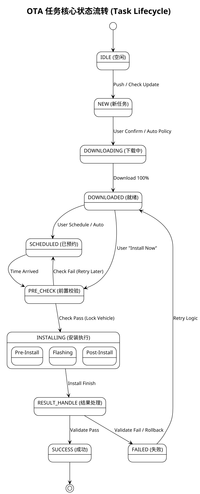

+++
date = '2025-08-03T17:17:50+08:00'
draft = true
title = '项目关键活动跟踪单'
+++
# H47A OTA 功能规格说明书

## 1. 基本信息

| 项目名称 (Project Name)     | H47A |
| :---------------------- | :------------- |
| 功能名称 (Function Name)    | OTA |
| 所属部门 (Department)       | 智能座舱平台软件部 |
| 文档密级 (Security Level)   | 机密 |
| 文档版本 (Document Version) | V1.0 |

## 2. 文档目的与定位

本功能规格说明书（FSS）是 **Feature Owner（FO）** 的核心交付物，旨在承接来自 **系统架构师、产品经理 (PM/PO)** 拆解的 Capability / Feature，并将其转化为软件开发团队可直接执行的**基本设计方案**。

- **对上**：承接并细化高阶需求，确保产品价值的准确传递。若上游仅提供 Capability，则由 FO 拆解为 Feature。
- **对下**：为开发团队提供可落地的设计蓝图，包括功能范围、架构视图、接口定义及非功能性约束。

## 3. 文档管理

### 3.1 版本控制

| 版本  | 日期         | 作者   | 变更摘要 |
| :--: | :--------- | :--- | :--- |
| V1.0 | YYYY/MM/DD | [作者] | 初始草稿 |

### 3.2 评审记录

| 版本  | 评审日期       | 评审人       | 评审意见   |
| :--: | :--------- | :-------- | :----- |
| V1.0 | YYYY/MM/DD | [评审人列表] | [意见摘要] |

### 3.3 参考文档

| 文档名称              | 文档编号 / 链接 |
| :---------------- | :-------- |
| 系统架构设计说明书         | [链接 / ID] |
| 产品需求文档 (PRD)      | [链接 / ID] |

## 4. 概述

### 4.1 功能目标与价值

说明本功能存在的意义，回答“为什么要做”。应直接关联到上游的 Epic 或业务目标。

示例：  
本功能旨在实现车机端与云端的 OTA 差分升级能力，减少升级包体积，提升升级效率，从而提升用户体验并降低流量成本。

### 4.2 范围

#### 4.2.1 范围内

- [列出本功能包含的职责与模块]

#### 4.2.2 范围外

- [列出与本功能相关但不由本文档负责的部分]

### 4.3 关键术语与缩略语

| 术语/缩写 | 全称                           | 描述     |
| :---- | :--------------------------- | :----- |
| FO    | Feature Owner                | 功能负责人  |
| PRD   | Product Requirement Document | 产品需求文档 |

## 5. 功能特性分解

### 5.1 编写约定与编号规则

本章节定义 OTA 功能规格说明书后续章节的**编写口径、对象模型、ID 体系与引用规则**，确保：
- 第 5 章形成**唯一权威的需求清单**；
- 第 7 章时序图能够按模板要求**关联 Feature ID 追溯**；
- 第 11 章“需求可追溯性”能以“功能需求ID”为主线串起来源、设计章节与验证方法。

#### 5.1.1 编写口径与术语约定

**需求表述口径**
- “必须 (Must) / 应当 (Should) / 可以 (May)”分别表示强制、推荐、可选。
- 每条需求必须写成**可验收**语句：包含触发条件、系统行为、对外输出/验收点。
- 若出现法规/安全/合规约束，默认使用 **Must**，并在“来源”字段中标注法规/标准条目编号（如适用）。

**核心领域模型与术语**

| 术语 (Term) | 定义 (Definition) | 备注 |
| :--- | :--- | :--- |
| **任务 (Task)** | 一次可执行的 OTA 升级活动实例。 | 包含版本信息、策略配置、当前状态（State）及结果。 |
| **升级包 (Package)** | 云端/主节点下发或 U 盘导入的升级文件实体。 | 包含 Diff 包或 Full 包、Hash 值、签名信息。 |
| **策略 (Strategy)** | 定义任务如何被执行的规则集合。 | 包括： 1. **下载策略**：静默下载 vs 交互下载； 2. **安装策略**：立即安装 vs 仅预约 vs 强制安装。 |
| **预约 (Schedule)** | 任务的计划执行时间及其状态。 | 支持自动夜间预约、用户自定义、取消与重约。 |
| **车辆模式 (Vehicle Mode)** | 车辆当前的电源与业务状态。 | OTA 强依赖模式判定： - **Normal**: 正常用车（仅下载，禁安装） - **Abandoned**: 弃车/离车（适合自动夜间安装） - **OTA Mode**: 专用模式（安装中，抑制其他功能） |
| **门禁 (Gatekeeper)** | 执行升级所需的硬性条件集合。 | 电量 (SOC)、车速 (Speed)、档位 (Gear)、手刹 (EPB) 等。 |

#### 5.1.2 功能需求编号规则（FR）

**格式**：`FR-OTA-<Domain>-<NNN>`
- `FR`：Functional Requirement（功能需求）
- `OTA`：功能域固定前缀
- `<Domain>`：功能域枚举（见 5.1.3）
- `<NNN>`：三位顺序号，`001` 起，域内递增且**永久不复用**。

#### 5.1.3 功能域（Domain）枚举与边界

为避免“按模块实现”导致需求碎片化，本文档以**业务能力域**划分。

| Domain | 含义 | 边界说明（责任划分） |
| :--- | :--- | :--- |
| `GEN` | **通用与策略** | **宏观控制**：任务状态机流转、电源管理请求、安全验签策略、多语言文案管理。 *(不包含具体 UI 绘制)* |
| `HMI` | **展示与交互** | **界面层**：弹窗/页面元素、用户输入响应、通知提醒。 *(不包含底层业务逻辑)* |
| `CHK` | **检查与识别** | **识别层**：云端/USB 包检测、版本对比逻辑、差异化文案匹配。 |
| `SCH` | **预约与排程** | **时间管理**：定时器逻辑、自动预约策略冲突处理。 |
| `PRE` | **前置校验** | **门禁系统**：车况信号采集与判定、不满足原因聚合、**车辆状态锁定请求**。 |
| `EXE` | **执行与进度** | **微观执行**：解压/刷写/校验的具体步骤管控、进度计算、**失败回滚机制**。 |
| `RST` | **结果处理** | **最终态**：成功/失败/终止后的持久化记录、用户确认逻辑、重启后提示。 |
| `DIAG` | **诊断与数据** | **可观测性**：埋点上报、日志记录、调试接口。 |

### 5.2 Feature Tree（特性树总览）

本节给出 H47A OTA 的**能力地图**与**状态流转视图**。

#### 5.2.0 核心状态机视图 (State Machine Overview)

在详述各 Feature 之前，定义 OTA 任务的标准生命周期流转，作为所有功能需求的基准。
> 说明：本节使用 `FT-<Domain>-<NN>` 作为特性树节点标识（Feature Tree Key），仅用于结构化索引；
> 正式需求编号以 5.3 中的 `FR-OTA-<Domain>-<NNN>` 为准。

#### 5.2.1 GEN｜通用与任务生命周期底座

* FT-GEN-01 任务对象模型：定义 Task/Package/Progress/Result 数据结构。
* FT-GEN-02 任务接收与状态机驱动：处理来自 Master/Cloud 的信号，驱动 5.2.0 定义的状态流转。
* FT-GEN-03 状态持久化与恢复：掉电/重启后的任务状态恢复（断点续传、断点续装、结果保持）。
* FT-GEN-04 文案与配置管理：多语言文案 ID 映射、云端配置下发（如强制升级标记）。
* FT-GEN-05 安全校验策略：定义验签时机（下载后/安装前）、证书异常处理策略。
* FT-GEN-06 电源管理策略：下载/安装过程中的电源请求，防止系统休眠中断业务。
* FT-GEN-07 触发权限与行车限制：在行车/非安全车况下禁止触发安装与交互升级流程；关键触发接口仅向系统组件/授权诊断主体开放。

#### 5.2.2 HMI｜HMI 展示与交互

* FT-HMI-01 任务提醒弹窗：新版本提醒（强弹/弱提示）、升级内容（Release Note）展示。
* FT-HMI-02 服务条款与合规：系统更新服务条款入口、免责声明展示逻辑。
* FT-HMI-03 预约交互流程：预约时间选择器、预约时间/时区自动转换、预约成功/失败反馈 Toast。
* FT-HMI-04 升级进度强弹窗：全屏/半屏进度条、剩余时间、动态提示语。
* FT-HMI-05 结果反馈弹窗：成功/失败/推迟/终止的模态框设计。
* FT-HMI-06 “查看更新”页面：手动检查更新入口、版本信息展示、功能设置开关。
* FT-HMI-07 异常提示一致性：网络异常、存储不足、电量不足的标准化提示。
* FT-HMI-08 全局输入屏蔽：升级过程中不允许操作车机。
  * 本条需求在《VCOS-OTA HMI显示需求文档 v1.4》中升级示例图片中存在，需要和产品经理确认。

#### 5.2.3 CHK｜查看更新/本地包识别

* FT-CHK-01 本地包检索：识别本地缓存是否存在有效安装包。
* FT-CHK-02 版本比较逻辑：Current Version vs Target Version 展示逻辑。
* FT-CHK-03 检查更新重试：网络超时下的自动/手动重试机制。
* FT-CHK-04 组合状态呈现：在设置页根据状态显示“去预约”、“去安装”或“查看详情”。

#### 5.2.4 SCH｜预约/排程

* FT-SCH-01 自动夜间预约：默认策略（如 02:00-04:00），智能避开用户用车规律。
  * 本条需求在《VCOS-OTA HMI显示需求文档 v1.4》中已经删除，本文档依然记录在此，但对于H47A项目不做要求。
* FT-SCH-02 自定义预约：用户指定时间点（粒度 10min），冲突检测（如时间已过）。
* FT-SCH-03 预约生效与取消：预约倒计时的启动、用户主动取消预约。
* FT-SCH-04 智能取消策略：若因车况连续 N 次自动安装失败，自动取消预约并通知用户。
  * 本条需求在《VCOS-OTA HMI显示需求文档 v1.4》中没有记载，需要与产品团队核对。

#### 5.2.5 PRE｜前置校验与推迟
本章节需求在《VCOS-OTA HMI显示需求文档 v1.4》中没有记载，需要与产品、系统、架构团队核对。

* FT-PRE-01 条件检查列表：电量(>30%)、车速(=0)、档位(P)、手刹(On)等。
* FT-PRE-02 动态推迟计算：基于当前不满足条件（如电量），估算推迟时间或建议操作。
* FT-PRE-03 车辆状态锁定：在前置校验通过并进入 OTA 执行的**关键不可中断窗口**前，系统应请求车身域/电源域启用“OTA Critical Window”，以保护升级执行过程不被高风险车况变化打断。  
  - 保护范围仅覆盖**影响 OTA 安全或成功执行**的状态变化（清单可配置并经产品/系统/法规确认），例如：电源/点火状态切换、进入可驾驶状态、下电/休眠触发等。  
  - 仅在收到启用确认后方可开始安装；启用失败/超时不得执行安装，应转入推迟/失败处理流程。  
  - 窗口结束或任务退出后必须解除保护。
* FT-PRE-04 条件再校验：预约时间点到达时的“二次握手”检查。

#### 5.2.6 EXE｜执行与进度

* FT-EXE-01 安装流程编排：Pre-install script -> Flashing -> Post-install script 顺序执行。
* FT-EXE-02 进度平滑算法：处理“卡 99%”问题，基于步骤权重的进度计算与上报。
* FT-EXE-03 剩余时间估算：基于历史数据或包大小的动态时间预估。
* FT-EXE-04 异常中断处理：安装中掉电、U盘拔出、断网（针对流式升级）的处理。
* FT-EXE-05 失败回滚机制：关键分区刷写失败后的 A/B 分区切换或镜像恢复逻辑，确保不“变砖”。

#### 5.2.7 RST｜结果与后处理

* FT-RST-01 成功处理：版本号更新、清理安装包、重置标志位。
* FT-RST-02 失败处理：错误码映射（System Error Code -> User Message）、重试计数器。
* FT-RST-03 结果通知持久化：确保“用户未点确认，重启车辆后仍弹窗提示”。
* FT-RST-04 放弃/终止：用户主动放弃更新后的状态清理。

#### 5.2.8 DIAG｜诊断与数据
本章节需求在《VCOS-OTA HMI显示需求文档 v1.4》中没有记载，需要与产品、系统、架构团队核对。

* FT-DIAG-01 状态查询接口：供售后工具读取当前 OTA 详细状态。
* FT-DIAG-02 关键事件日志：记录 Push, Check, Schedule, Install_Start, Install_End, Error 等事件，能通过脚本一键导出升级日志详情。
* FT-DIAG-03 埋点数据上报：上报用户行为（点击率、预约渗透率、失败原因分布）至大数据平台。
* FT-DIAG-04 调试与仿真：提供 Mock 接口用于 HMI 独立调试进度与结果交互。

### 5.3 功能需求清单

### 5.4 关键场景清单

## 6. 软件基本设计

### 6.1 场景视图

使用用例图展示主要参与者 (Actor) 与系统交互方式。详细流程请参见第 7 章《关键场景与动态行为》。

### 6.2 逻辑视图

描述系统的功能模块组成及相互关系。

| 组件名称        | 核心职责描述        |
| :---------- | :------------ |
| Component A | [描述组件主要功能与边界] |
| Component B | [描述组件主要功能与边界] |

### 6.3 开发视图

描述代码结构，如模块划分、包关系等（建议使用包图）。

### 6.4 状态机视图（可选）

描述系统或组件的状态变化与转换条件（建议使用状态机图）。

### 6.5 物理视图（可选）

描述软件模块在硬件节点上的部署关系（建议使用部署图）。

## 7. 关键场景与动态行为

使用时序图描述关键业务流程。每个时序图应关联 Feature ID，以便追溯。

场景: [F-X.X, F-Y.Y] - [场景描述]

## 8. 接口定义

### 8.1 [组件 A] 接口

#### 8.1.1 提供接口

| 方法名 | 参数 | 返回值 | 异步回调 | 功能描述 |
| :-- | :- | :-- | :--- | :--- |

#### 8.1.2 依赖接口

| 依赖模块/组件 | 接口/服务 | 功能描述 |
| :------ | :---- | :--- |

### 8.2 [组件 B] 接口

#### 8.2.1 提供接口

| 方法名 | 参数 | 返回值 | 异步回调 | 功能描述 |
| :-- | :- | :-- | :--- | :--- |

#### 8.2.2 依赖接口

| 依赖模块/组件 | 接口/服务 | 功能描述 |
| :------ | :---- | :--- |

### 8.3 数据结构定义

定义接口中传递的关键数据对象结构体。

### 8.4 云端接口

| API 端点 | 方法 | 请求体 | 响应体 | 功能描述 |
| :----- | :- | :-- | :-- | :--- |

## 9. 非功能性需求

| 类别   | 需求 ID  | 需求描述   | 验收标准      | 设计策略与实现机制 | 关联设计章节 |
| :--- | :----- | :----- | :-------- | :-------- | :-------- |
| 性能   | NFR-P1 | 系统启动时间 | < 3 秒     |  |  |
| 可靠性  | NFR-R1 | 异常恢复时间 | < 5 秒     |  |  |
| 资源消耗 | NFR-R2 | 内存占用上限 | < 300 MB  |  |  |
| 安全   | NFR-S1 | 接口鉴权   | 通过 OAuth2 |  |  |

## 10. 错误与异常处理

| 错误场景     | 可能原因 | 系统处理策略    | 用户提示       |
| :------- | :--- | :-------- | :--------- |
| OTA 升级失败 | 网络异常 | 重试三次后上报错误 | “网络异常，请重试” |

## 11. 需求可追溯性

| 功能需求 ID | 需求描述 | 来源 (Capability) | 设计章节 / 视图      | 验证方法 (Test Case ID) |
| :------ | :--- | :-------------- | :------------- | :------------------ |
| F-X.X   | [描述] | CAP-XX          | §3.1, §4, §5.1 | TC-XXX              |

## 12. 附录 (Appendix) *[可选]*

包含补充资料、错误码表、接口示例、测试样例等。
