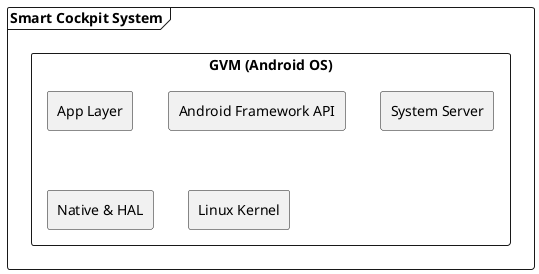
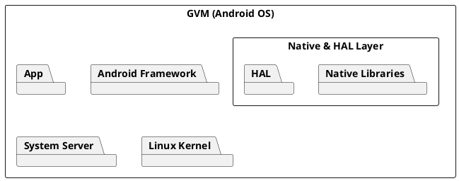

+++
date = '2025-12-24T17:17:50+08:00'
draft = false
title = 'UML中package和component对比'
+++

# PlantUML 元素规范: 架构分层图（Layer View）与子系统设计图（Subsystem View）

**版本**：v1.0
**适用范围**：智能座舱系统 / Android & Linux 系统架构 / 平台级设计文档
**目标**：统一 PlantUML 元素语义，避免“图看起来对，但语义不一致”的问题

---

## 1. 设计原则（必须先读）

### 1.1 语义优先，但允许视图驱动

* PlantUML 元素具备**语义倾向**
* 不同架构视图（View）关注点不同
* **同一对象在不同视图中允许使用不同图形**

> 👉 视图决定图形，而不是对象本身决定图形

---

### 1.2 一个视图只解决一个问题

* 架构分层图：回答「系统是如何分层的」
* 子系统设计图：回答「系统由哪些子系统组成」

**禁止在一张图中混合多种建模目标**

---

## 2. 架构分层图（Layered Architecture Diagram）

### 2.1 定义

架构分层图用于表达：

* 系统的**逻辑分层**
* 上下层依赖关系
* 运行环境或部署边界

不关心：

* 具体模块实现
* 子系统内部结构

---

### 2.2 元素使用规范（强制）

#### 2.2.1 统一规则

> **在架构分层图中，所有“层（Layer）”必须统一使用 `rectangle` 表示**

无论该层内部实际是：

* 独立子系统
* 逻辑分组
* 混合实现

---

### 2.2.2 元素映射表

| 架构对象           | 图形          | 说明          |
| -------------- | ----------- | ----------- |
| 系统整体范围         | `frame`     | 可选，用于限定讨论范围 |
| 物理 SoC / MCU   | `rectangle` | 硬件或物理承载     |
| Hypervisor     | `rectangle` | 基础运行环境      |
| VM（PVM / GVM）  | `rectangle` | OS 运行容器     |
| App 层          | `rectangle` | 应用层         |
| Framework 层    | `rectangle` | 框架层         |
| SystemServer 层 | `rectangle` | 服务层         |
| Native & HAL 层 | `rectangle` | 逻辑分层        |
| Kernel 层       | `rectangle` | 内核层         |

---

### 2.2.3 示例（Android GVM 分层图）

---

### 2.2.4 禁止项（架构分层图中）

❌ 不得使用 `package` 表示层
❌ 不得展开模块或类
❌ 不得区分 HAL / Native 的内部细节

---

### 2.2.5 说明性文字（推荐写法）

> 本图为 **系统分层架构视图（Layer View）**，
> 图中所有矩形块表示逻辑分层，不区分其内部是否为独立子系统。

---

## 3. 子系统设计图（Subsystem Design Diagram）

### 3.1 定义

子系统设计图用于表达：

* 系统由哪些**子系统（Subsystem**组成
* 子系统的职责边界
* 子系统之间的关系

不强调：

* 上下层调用顺序
* 完整运行环境

---

### 3.2 元素使用规范（强制）

#### 3.2.1 核心规则

> **在子系统设计图中：
>
> * 子系统必须使用 `package` 表示**

---

### 3.2.2 元素映射表

| 对象类型    | 图形                   | 说明        |
| ------- | -------------------- | --------- |
| 子系统     | `package`            | 具备清晰职责与边界 |
| 子系统内部模块 | `component` / `node` | 可选        |
| 系统运行环境  | `rectangle`          | 作为外层容器    |

---

### 3.2.3 子系统判定标准（满足其一即可）

一个对象可以被建模为 `package`，如果它：

* 对外暴露稳定接口
* 可作为整体被讨论
* 有相对独立的生命周期或责任

---

### 3.2.4 示例（Android OS 子系统图）

---

### 3.2.5 特别说明：Native & HAL

* 在 **架构分层图** 中：
  → 作为 **Layer**，使用 `rectangle`
* 在 **子系统设计图** 中：
  → HAL / Native Libraries 可作为 `package` 展开

---

## 4. 两种视图的对照总结（关键）

| 维度       | 架构分层图       | 子系统设计图    |
| -------- | ----------- | --------- |
| 关注点      | 分层 / 依赖     | 职责 / 边界   |
| 主要图形     | `rectangle` | `package` |
| 是否展开内部   | ❌           | ✅         |
| 是否强调运行环境 | ✅           | 可选        |
| 典型读者     | 架构评审 / 管理   | 研发 / 设计   |

---

## 5. 强制约束（写进规范的“红线”）

1. **一张图只允许一种主视图类型**
2. 架构分层图中不得混用 `package`
3. 子系统设计图中不得用 `rectangle` 代替子系统
4. 语义不清的情况，优先服从视图目标，而非 UML 细节

---

## 6. 一句话总结（规范版）

> * **Layer View 统一使用 `rectangle`，强调“层”**
> * **Subsystem View 使用 `package`，强调“系统”**
> * **同一对象可在不同视图中使用不同图形，这是被允许且推荐的**

---

