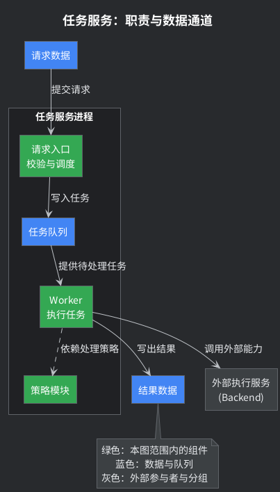
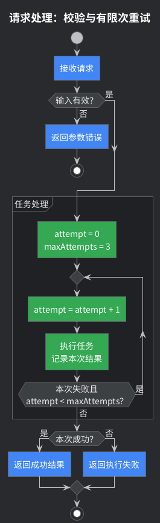
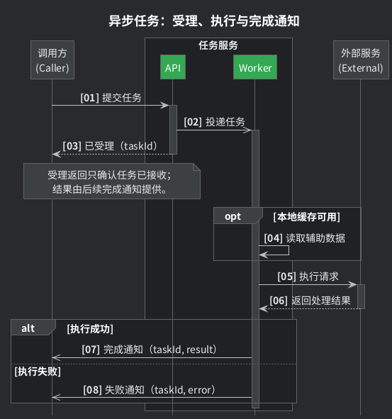

+++
date = '2025-12-24T17:17:50+08:00'
lastmod = '2026-10-10T00:00:00+08:00'
draft = false
title = 'Google 风格 PlantUML 模板：架构图、流程图与时序图'
description = '统一深色蓝绿架构图的配色、元素、连线和排版，提供可独立复制运行的架构图、流程图、时序图模板。'
ShowToc = true
+++

本文规定本知识库的 PlantUML 图表样式，并提供架构图、流程图和时序图三份完整模板。默认采用深灰背景、Google 蓝绿实色块、白色文字、方角和细边框。

视觉参考来自仓库中的 `work/skills/architecture-diagram/assets/architecture_diagrams/android_architecture.html`，与 RenderEngine 文章中的图表保持一致。这里的“Google 风格”是本知识库对该参考样式的命名；实现使用 `!theme plain` 加显式样式配置。

<!--more-->

## 1. 选择模板与使用方式

先确定这张图需要回答的问题，再选择模板。

| 图种 | 主要回答的问题 | 适合表达 | 不宜承担的内容 |
|---|---|---|---|
| 架构图 | 系统由什么组成，边界在哪里？ | 层次、模块、运行域、依赖和主要数据通道 | 每一次函数调用的先后 |
| 流程图 | 遇到某个条件之后，下一步做什么？ | 顺序、判断、循环、成功与失败出口 | 多个对象之间完整的消息往返 |
| 时序图 | 谁在什么时候向谁发送什么？ | 调用、返回、异步交接、分支与执行范围 | 整个系统的静态分层 |

跨多个 VM 或芯片、需要交互聚焦或精细排版的复杂架构图，使用独立 HTML 架构图（`work/skills/architecture-diagram`）；本文模板用于文章内的简单结构图、流程图和时序图。

每份模板都包含 `@startuml`、完整样式和 `@enduml`，可以直接保存为 UTF-8 编码的 `.puml` 文件。使用时保留样式区，修改标题、参与者、节点、条件和消息即可。模板不依赖额外的主题文件或远程 `!include`。

文中的图片用于预览，图片下方的“展开并复制完整 PlantUML 源码”保留相同源码。网页只读时，可以从折叠区复制；直接编辑 Markdown 时，可以使用对应的 `plantuml` 代码块。

## 2. 统一视觉规范

### 2.1 配色与含义

默认配色按职责区分。绿色表示本图范围内的组件或处理步骤，蓝色表示数据、队列、参数、同步对象或输出结果；灰色表示分组、条件和外部参与者。图中没有数据对象时，不必为了凑齐配色而加入蓝色模块。

| 用途 | 颜色 | 使用位置 |
|---|---|---|
| 画布 | `#282A2D` | 图表整体背景 |
| 执行域或逻辑分组 | `#202124` | 进程框、子系统框、流程分区 |
| 时序分组标题栏、激活条、判断、注释、外部参与者 | `#3C4043` | 次一级灰色块 |
| 处理与组件 | `#34A853` | 本图范围内的软件模块、处理步骤 |
| 数据与结果 | `#4285F4` | Buffer、队列、请求、结果、同步对象 |
| 彩色块文字 | `#FFFFFF` | 蓝色或绿色块内部 |
| 常规文字 | `#E8EAED` | 标签、标题、说明 |
| 边框与生命线 | `#5F6368` | 模块边界、分组边界、时序生命线 |
| 关系与消息箭头 | `#BDC1C6` | 连接线、箭头、流程起止符号 |

需要表达代码归属时，整张图改用归属配色，与 HTML 架构图规范一致：OEM 自研 `#4285F4`、系统原生 `#34A853`、Vendor / Tier1 `#FBBC04`（文字 `#202124`）、硬件与内存 `#5F6368`、来源未确定 `#3C4043`（文字 `#E8EAED`）。实现时为每种归属定义 stereotype 配色（如 `skinparam rectangle<<vendor>>`），给元素加对应标注并 `hide stereotype`，再用图例说明颜色。一张图只用一套颜色含义：归属视图中蓝色只表示 OEM，数据和请求写在连线标签上，确需画出的 Buffer 用硬件灰。

### 2.2 字体、边框与布局

| 项目 | 规范 |
|---|---|
| 字体 | `Noto Sans CJK SC`；渲染端需要安装该字体，或统一换成已安装的中文无衬线字体 |
| 正文与标签 | 默认 14；标题 18；同一组图保持一致 |
| 普通模块 | 方角、实色填充、细边框，不加阴影 |
| 结构层次 | 通过容器、留白和背景区分，通常控制在两至三层 |
| 节点文字 | 先写名称，再用一行说明职责；长名称使用 `\n` 换行 |
| 连线 | 连接明确的对象，重要关系写明“调用”“读取”“写入”“依赖”等动词 |
| 图幅 | 先减少单图内容，再调整方向与间距；不靠缩小字体塞入全部细节 |

方角规则用于普通模块和容器。流程图中的判断菱形、起止圆点仍保留其形状；时序图中的生命线和激活条也保留原有含义。

模板在 `!theme plain` 之后显式覆盖深色背景、字体和各类元素颜色。修改时不要在末尾追加另一个主题，否则可能覆盖前面的配置。统一样式不要求把所有对象都画成同一种形状。

## 3. 元素与连线约定

### 3.1 架构元素

对象的图形取决于当前视图想表达什么。例如，Android Framework 可以在全系统分层图中作为一个矩形层，也可以在局部设计图中展开为包含多个组件的分组。

| 元素 | 本规范中的用法 | 注意点 |
|---|---|---|
| `rectangle` | 职责块或逻辑层，模板中默认绿色 | 适合分层图，也可用于简化模块视图；范围容器用 `package` |
| `package` | 逻辑分组、子系统或带标签的边界 | 使用 `packageStyle rectangle` 保持方角；标签需要说明它是逻辑域还是实际进程 |
| `component` | 强调软件职责、接口或依赖的组件 | 可用 `componentStyle rectangle` 获得统一的矩形外观 |
| `node` | 主机、VM、设备或运行环境 | 仅在部署关系确实重要时使用，不代指任意软件模块 |
| `frame` | 一张图的讨论范围 | 可选；避免与多层容器重复表达同一边界 |
| `database`、`queue` | 明确的数据存储或队列 | 简化视图可以使用带名称的矩形，仍须说明真实用途 |

`package` 不自动意味着独立进程，`component` 也不自动意味着独立线程。部署和线程边界需要由标签或对应视图说明。PlantUML 支持多种分组与组件表示法，语法可参考 [组件图文档](https://plantuml.com/component-diagram)。

### 3.2 按图种解释箭头

| 图种 | 记法 | 本文采用的含义 |
|---|---|---|
| 架构图 | `A --> B : 写入数据` | 有方向的关系；具体含义由标签说明 |
| 架构图 | `A ..> B : 依赖配置` | 静态依赖，不表示异步调用 |
| 流程图 | 活动之间的箭头 | 控制流程；判断分支需标明条件或“是／否” |
| 时序图 | `A -> B : 调用` | 同步调用约定 |
| 时序图 | `A ->> B : 投递任务` | 异步消息约定 |
| 时序图 | `B --> A : 返回结果` | 只表示返回或响应；回应的是同步调用还是异步请求，由之前的消息决定 |

这些是本规范的建模约定。PlantUML 负责绘制箭头，不会替作者判断程序是否阻塞。尤其不能把“虚线”和“异步”当作同义词。

## 4. 架构图模板

### 4.1 示例与可复制源码

这个示例表达任务服务的职责边界、内部组件和数据通道。实线描述主要数据传递或调用关系，虚线表示 Worker 对策略模块的依赖。它不规定某次请求的精确执行时序。


```plantuml
@startuml
!theme plain
' Google 架构块风格：深色底、实色模块、白字、方角。
skinparam backgroundColor #282A2D
skinparam defaultFontName "Noto Sans CJK SC"
skinparam defaultFontSize 14
skinparam defaultFontColor #E8EAED
skinparam defaultTextAlignment center
skinparam titleFontColor #FFFFFF
skinparam titleFontSize 18
skinparam shadowing false
skinparam roundcorner 0
skinparam ArrowColor #BDC1C6
skinparam ArrowFontColor #E8EAED
skinparam ArrowThickness 1
skinparam note {
    BackgroundColor #3C4043
    BorderColor #5F6368
    FontColor #E8EAED
}
<style>
root {
    LineColor #5F6368
}
arrow {
    LineColor #BDC1C6
    FontColor #E8EAED
    LineThickness 1
}
</style>
skinparam packageStyle rectangle
skinparam componentStyle rectangle
skinparam nodesep 30
skinparam ranksep 35
skinparam rectangle {
    BackgroundColor #34A853
    BorderColor #5F6368
    FontColor #FFFFFF
}
skinparam component {
    BackgroundColor #34A853
    BorderColor #5F6368
    FontColor #FFFFFF
}
skinparam packageBackgroundColor #202124
skinparam packageBorderColor #5F6368
skinparam packageFontColor #E8EAED
skinparam package {
    BackgroundColor #202124
    BorderColor #5F6368
    FontColor #E8EAED
}
skinparam rectangle<<ext>> {
    BackgroundColor #3C4043
    FontColor #E8EAED
}
hide stereotype
top to bottom direction

title 任务服务：职责与数据通道

rectangle "请求数据" as Request #4285F4
package "任务服务进程" as Service {
    rectangle "请求入口\n校验与调度" as API
    rectangle "任务队列" as Queue #4285F4
    rectangle "Worker\n执行任务" as Worker
    component "策略模块" as Policy

    API --> Queue : 写入任务
    Queue --> Worker : 提供待处理任务
    Worker ..> Policy : 依赖处理策略
}
rectangle "结果数据" as Result #4285F4
rectangle "外部执行服务\n(Backend)" as Backend <<ext>>

Request --> API : 提交请求
Worker --> Result : 写出结果
Worker --> Backend : 调用外部能力

note bottom of Result
绿色：本图范围内的组件
蓝色：数据与队列
灰色：外部参与者与分组
end note
@enduml
```

<details>
<summary>展开并复制完整 PlantUML 源码</summary>

```text
@startuml
!theme plain
' Google 架构块风格：深色底、实色模块、白字、方角。
skinparam backgroundColor #282A2D
skinparam defaultFontName "Noto Sans CJK SC"
skinparam defaultFontSize 14
skinparam defaultFontColor #E8EAED
skinparam defaultTextAlignment center
skinparam titleFontColor #FFFFFF
skinparam titleFontSize 18
skinparam shadowing false
skinparam roundcorner 0
skinparam ArrowColor #BDC1C6
skinparam ArrowFontColor #E8EAED
skinparam ArrowThickness 1
skinparam note {
    BackgroundColor #3C4043
    BorderColor #5F6368
    FontColor #E8EAED
}
<style>
root {
    LineColor #5F6368
}
arrow {
    LineColor #BDC1C6
    FontColor #E8EAED
    LineThickness 1
}
</style>
skinparam packageStyle rectangle
skinparam componentStyle rectangle
skinparam nodesep 30
skinparam ranksep 35
skinparam rectangle {
    BackgroundColor #34A853
    BorderColor #5F6368
    FontColor #FFFFFF
}
skinparam component {
    BackgroundColor #34A853
    BorderColor #5F6368
    FontColor #FFFFFF
}
skinparam packageBackgroundColor #202124
skinparam packageBorderColor #5F6368
skinparam packageFontColor #E8EAED
skinparam package {
    BackgroundColor #202124
    BorderColor #5F6368
    FontColor #E8EAED
}
skinparam rectangle<<ext>> {
    BackgroundColor #3C4043
    FontColor #E8EAED
}
hide stereotype
top to bottom direction

title 任务服务：职责与数据通道

rectangle "请求数据" as Request #4285F4
package "任务服务进程" as Service {
    rectangle "请求入口\n校验与调度" as API
    rectangle "任务队列" as Queue #4285F4
    rectangle "Worker\n执行任务" as Worker
    component "策略模块" as Policy

    API --> Queue : 写入任务
    Queue --> Worker : 提供待处理任务
    Worker ..> Policy : 依赖处理策略
}
rectangle "结果数据" as Result #4285F4
rectangle "外部执行服务\n(Backend)" as Backend <<ext>>

Request --> API : 提交请求
Worker --> Result : 写出结果
Worker --> Backend : 调用外部能力

note bottom of Result
绿色：本图范围内的组件
蓝色：数据与队列
灰色：外部参与者与分组
end note
@enduml
```

</details>

### 4.2 修改要点

保留稳定的英文别名，例如 `API`、`Worker`、`Result`，把中文显示名称写在引号中。改变显示名称时，连线可以继续引用原别名。

分层图可以用多个命名矩形表示 App、Framework、Native/HAL、Kernel 等层，并用容器说明 GVM/PVM 等范围。只有在需要解释某一层的内部职责时才展开组件。子系统图则以职责边界为主，不需要强制每个子系统都使用 `package`。

示例采用从上到下的布局。横向关系较多时可以改用 `left to right direction`。必要的 `-[hidden]->` 仅用于排版，不表示依赖；添加后应检查它是否让可见连线产生交叉。对直角连线的需求可以尝试 `linetype ortho`，但需重新检查标签位置，不能只以编译成功作为可读性标准。

## 5. 流程图模板

### 5.1 示例与可复制源码

这个示例包含输入校验、参数错误出口、任务执行、有限次重试，以及成功和失败出口。`maxAttempts = 3` 表示总共最多执行三次，即第一次执行加上最多两次重试。


```plantuml
@startuml
!theme plain
' Google 架构块风格：深色底、实色模块、白字、方角。
skinparam backgroundColor #282A2D
skinparam defaultFontName "Noto Sans CJK SC"
skinparam defaultFontSize 14
skinparam defaultFontColor #E8EAED
skinparam defaultTextAlignment center
skinparam titleFontColor #FFFFFF
skinparam titleFontSize 18
skinparam shadowing false
skinparam roundcorner 0
skinparam ArrowColor #BDC1C6
skinparam ArrowFontColor #E8EAED
skinparam ArrowThickness 1
skinparam note {
    BackgroundColor #3C4043
    BorderColor #5F6368
    FontColor #E8EAED
}
<style>
root {
    LineColor #5F6368
}
arrow {
    LineColor #BDC1C6
    FontColor #E8EAED
    LineThickness 1
}
</style>
skinparam activity {
  BackgroundColor #34A853
  BorderColor #5F6368
  FontColor #FFFFFF
  DiamondBackgroundColor #3C4043
  DiamondBorderColor #5F6368
  DiamondFontColor #E8EAED
  StartColor #BDC1C6
  EndColor #BDC1C6
}
skinparam partition {
  BackgroundColor #202124
  BorderColor #5F6368
  FontColor #E8EAED
}

title 请求处理：校验与有限次重试

start
#4285F4:接收请求;
if (输入有效？) then (是)
else (否)
  #4285F4:返回参数错误;
  stop
endif

partition "任务处理" {
  :attempt = 0\nmaxAttempts = 3;
  repeat
    :attempt = attempt + 1;
    :执行任务\n记录本次结果;
  repeat while (本次失败且\nattempt < maxAttempts？) is (是) not (否)
}

if (本次成功？) then (是)
  #4285F4:返回成功结果;
else (否)
  #4285F4:返回执行失败;
endif
stop
@enduml
```

<details>
<summary>展开并复制完整 PlantUML 源码</summary>

```text
@startuml
!theme plain
' Google 架构块风格：深色底、实色模块、白字、方角。
skinparam backgroundColor #282A2D
skinparam defaultFontName "Noto Sans CJK SC"
skinparam defaultFontSize 14
skinparam defaultFontColor #E8EAED
skinparam defaultTextAlignment center
skinparam titleFontColor #FFFFFF
skinparam titleFontSize 18
skinparam shadowing false
skinparam roundcorner 0
skinparam ArrowColor #BDC1C6
skinparam ArrowFontColor #E8EAED
skinparam ArrowThickness 1
skinparam note {
    BackgroundColor #3C4043
    BorderColor #5F6368
    FontColor #E8EAED
}
<style>
root {
    LineColor #5F6368
}
arrow {
    LineColor #BDC1C6
    FontColor #E8EAED
    LineThickness 1
}
</style>
skinparam activity {
  BackgroundColor #34A853
  BorderColor #5F6368
  FontColor #FFFFFF
  DiamondBackgroundColor #3C4043
  DiamondBorderColor #5F6368
  DiamondFontColor #E8EAED
  StartColor #BDC1C6
  EndColor #BDC1C6
}
skinparam partition {
  BackgroundColor #202124
  BorderColor #5F6368
  FontColor #E8EAED
}

title 请求处理：校验与有限次重试

start
#4285F4:接收请求;
if (输入有效？) then (是)
else (否)
  #4285F4:返回参数错误;
  stop
endif

partition "任务处理" {
  :attempt = 0\nmaxAttempts = 3;
  repeat
    :attempt = attempt + 1;
    :执行任务\n记录本次结果;
  repeat while (本次失败且\nattempt < maxAttempts？) is (是) not (否)
}

if (本次成功？) then (是)
  #4285F4:返回成功结果;
else (否)
  #4285F4:返回执行失败;
endif
stop
@enduml
```

</details>

### 5.2 修改要点

每个判断写成可回答的问题，两个出口明确标注。无效输入通过 `stop` 结束，不能再流入任务处理分区。循环中显式递增 `attempt`，退出条件同时考虑成功结果和次数上限。

替换为真实业务流程时，还要定义“失败”是否允许重试：不可重试错误应直接进入失败出口。这个模板只假设最多三次尝试都属于允许重试的同一类操作；退避等待、取消或超时可在有明确需求时增加。

活动节点用动宾短语，例如“校验输入”“读取配置”“写入结果”；条件用判断语句，避免把大段代码放进节点。`partition` 表示一个处理阶段；如果需要强调不同角色之间的责任交接，可以改用泳道。分区和泳道的语法参见 [活动图文档](https://plantuml.com/activity-diagram-beta)。

## 6. 时序图模板

### 6.1 示例与可复制源码

这个示例区分任务受理、后台执行和完成通知。API 同步返回“已受理”，Worker 随后通过异步通知提供处理结果；受理成功不表示任务已经执行成功。具体运行中，API 返回与 Worker 执行可以重叠，图中给出的是一种可能时序。


```plantuml
@startuml
!theme plain
' Google 架构块风格：深色底、实色模块、白字、方角。
skinparam backgroundColor #282A2D
skinparam defaultFontName "Noto Sans CJK SC"
skinparam defaultFontSize 14
skinparam defaultFontColor #E8EAED
skinparam defaultTextAlignment center
skinparam titleFontColor #FFFFFF
skinparam titleFontSize 18
skinparam shadowing false
skinparam roundcorner 0
skinparam ArrowColor #BDC1C6
skinparam ArrowFontColor #E8EAED
skinparam ArrowThickness 1
skinparam note {
    BackgroundColor #3C4043
    BorderColor #5F6368
    FontColor #E8EAED
}
<style>
root {
    LineColor #5F6368
}
arrow {
    LineColor #BDC1C6
    FontColor #E8EAED
    LineThickness 1
}
</style>
skinparam maxMessageSize 180
skinparam ParticipantPadding 18
skinparam BoxPadding 12
skinparam sequence {
    ParticipantBackgroundColor #34A853
    ParticipantBorderColor #5F6368
    ParticipantFontColor #FFFFFF
    LifeLineBorderColor #5F6368
    LifeLineBackgroundColor #3C4043
    BoxBackgroundColor #202124
    BoxBorderColor #5F6368
    BoxFontColor #E8EAED
    GroupBackgroundColor #3C4043
    GroupBodyBackgroundColor #202124
    GroupBorderColor #5F6368
    GroupFontColor #FFFFFF
    GroupHeaderFontColor #FFFFFF
    DividerBackgroundColor #3C4043
    DividerBorderColor #5F6368
    DividerFontColor #E8EAED
    ReferenceBackgroundColor #202124
    ReferenceBorderColor #5F6368
    ReferenceFontColor #E8EAED
    ArrowColor #BDC1C6
    ArrowFontColor #E8EAED
}
skinparam participant<<ext>> {
    BackgroundColor #3C4043
    FontColor #E8EAED
}
hide stereotype

hide footbox

title 异步任务：受理、执行与完成通知
participant "调用方\n(Caller)" as Caller <<ext>>
box "任务服务"
participant "API" as API
participant "Worker" as Worker
end box
participant "外部服务\n(External)" as External <<ext>>

autonumber "<b>[00]"
Caller -> API : 提交任务
activate API
API ->> Worker : 投递任务
activate Worker
API --> Caller : 已受理（taskId）
deactivate API
note over Caller, API
  受理返回只确认任务已接收；
  结果由后续完成通知提供。
end note

opt 本地缓存可用
    Worker -> Worker : 读取辅助数据
end
Worker -> External : 执行请求
activate External
External --> Worker : 返回处理结果
deactivate External
alt 执行成功
    Worker ->> Caller : 完成通知（taskId, result）
else 执行失败
    Worker ->> Caller : 失败通知（taskId, error）
end
deactivate Worker
@enduml
```

<details>
<summary>展开并复制完整 PlantUML 源码</summary>

```text
@startuml
!theme plain
' Google 架构块风格：深色底、实色模块、白字、方角。
skinparam backgroundColor #282A2D
skinparam defaultFontName "Noto Sans CJK SC"
skinparam defaultFontSize 14
skinparam defaultFontColor #E8EAED
skinparam defaultTextAlignment center
skinparam titleFontColor #FFFFFF
skinparam titleFontSize 18
skinparam shadowing false
skinparam roundcorner 0
skinparam ArrowColor #BDC1C6
skinparam ArrowFontColor #E8EAED
skinparam ArrowThickness 1
skinparam note {
    BackgroundColor #3C4043
    BorderColor #5F6368
    FontColor #E8EAED
}
<style>
root {
    LineColor #5F6368
}
arrow {
    LineColor #BDC1C6
    FontColor #E8EAED
    LineThickness 1
}
</style>
skinparam maxMessageSize 180
skinparam ParticipantPadding 18
skinparam BoxPadding 12
skinparam sequence {
    ParticipantBackgroundColor #34A853
    ParticipantBorderColor #5F6368
    ParticipantFontColor #FFFFFF
    LifeLineBorderColor #5F6368
    LifeLineBackgroundColor #3C4043
    BoxBackgroundColor #202124
    BoxBorderColor #5F6368
    BoxFontColor #E8EAED
    GroupBackgroundColor #3C4043
    GroupBodyBackgroundColor #202124
    GroupBorderColor #5F6368
    GroupFontColor #FFFFFF
    GroupHeaderFontColor #FFFFFF
    DividerBackgroundColor #3C4043
    DividerBorderColor #5F6368
    DividerFontColor #E8EAED
    ReferenceBackgroundColor #202124
    ReferenceBorderColor #5F6368
    ReferenceFontColor #E8EAED
    ArrowColor #BDC1C6
    ArrowFontColor #E8EAED
}
skinparam participant<<ext>> {
    BackgroundColor #3C4043
    FontColor #E8EAED
}
hide stereotype

hide footbox

title 异步任务：受理、执行与完成通知
participant "调用方\n(Caller)" as Caller <<ext>>
box "任务服务"
participant "API" as API
participant "Worker" as Worker
end box
participant "外部服务\n(External)" as External <<ext>>

autonumber "<b>[00]"
Caller -> API : 提交任务
activate API
API ->> Worker : 投递任务
activate Worker
API --> Caller : 已受理（taskId）
deactivate API
note over Caller, API
  受理返回只确认任务已接收；
  结果由后续完成通知提供。
end note

opt 本地缓存可用
    Worker -> Worker : 读取辅助数据
end
Worker -> External : 执行请求
activate External
External --> Worker : 返回处理结果
deactivate External
alt 执行成功
    Worker ->> Caller : 完成通知（taskId, result）
else 执行失败
    Worker ->> Caller : 失败通知（taskId, error）
end
deactivate Worker
@enduml
```

</details>

### 6.2 修改要点

参与者从左到右按主要交互顺序排列。一个参与者应有稳定含义，例如进程、线程或服务对象；需要跨层级表达时，在名称中明确写出层级。模板中的灰色调用方和外部服务位于“任务服务”范围之外，绿色 API 与 Worker 是该范围内的组件。

`activate` 和 `deactivate` 描述参与者的执行或调用范围，不表示这段时间一直占用 CPU，也不表示 GPU 等异步执行单元已经完成。普通返回画成 `-->`，异步投递或完成通知使用 `->>` 并写明消息用途。

`opt` 表示可选步骤，`alt` 的成功与失败分支互斥。模板中的缓存用于读取辅助数据，因此之后仍会调用外部服务；如果缓存命中即可返回最终结果，应改成缓存命中／未命中的 `alt` 分支。

自动编号帮助读者引用消息，不代表所有分支都会执行。纵向间距也不表示精确耗时；需要表达 deadline、耗时或重叠区间时，应额外标注时间。更多分支、循环和消息语法参见 [时序图文档](https://plantuml.com/sequence-diagram)。

## 7. 亮色适配与模板维护

默认交付深色版本。如果文档需要白底打印，需要同时调整完整样式区和节点中的显式颜色。普通模块的蓝绿填充及白字保持不变，画布、容器和常规文字按下表调整。

| 用途 | 深色 | 亮色 |
|---|---|---|
| 画布 | `#282A2D` | `#FFFFFF` |
| 分组背景 | `#202124` | `#F1F3F4` |
| 分组标题、注释、判断 | `#3C4043` | `#E8EAED` |
| 常规文字 | `#E8EAED` | `#202124` |
| 边框、生命线 | `#5F6368` | `#BDC1C6` |
| 箭头 | `#BDC1C6` | `#5F6368` |

切换亮色时，需要一起调整 Note、Package、Activity 的判断节点，以及 Sequence 的分组、激活条和箭头文字。节点及 `box` 声明中的显式背景色也要对应修改。若把外部参与者的灰色填充改浅，它们的字体也要单独改为深色；只修改 `backgroundColor` 会留下浅色文字和边框。本模板用 `<style>` 中的 `root` 和 `arrow` 固定边框及箭头，也应同步调整其中的 `LineColor` 与 `FontColor`。亮色版本仍应完整渲染检查。

三份模板重复保留公共样式，是为了保证单独复制即可使用。批量调整配色或字体时，应同步更新三份模板及其可复制源码区。正式渲染的代码块与折叠区源码需要保持逐字一致。

## 8. 渲染与交付检查

本页三个模板已使用仓库中的 PlantUML `1.2025.4` 验证。将完整模板保存为 `diagram.puml` 后，可以在仓库根目录执行：

```bash
java -Djava.awt.headless=true -Xmx256m \
  -jar assets/plantuml-1.2025.4.jar \
  -charset UTF-8 -failfast2 -tsvg diagram.puml
```

SVG 适合网页缩放。需要位图预览时，将 `-tsvg` 改为 `-tpng`。中文字体是否可用取决于实际渲染端；更换机器或使用在线渲染器时，需要再次检查文字和布局。

交付前检查以下项目：

- 图种与问题一致，标题说明范围；复杂细节已拆到合适的局部图。
- 颜色含义一致，边界标签清楚，外部参与者不会被误读成内部组件。
- 分支和循环有明确出口；同步调用、异步消息和返回没有混淆。
- 中文、长函数名和箭头标签没有遮挡，缩放到正文宽度后仍可阅读。
- 三份模板可以分别编译，预览与可复制源码完全一致。

本站在浏览器端把 `plantuml` 围栏代码编码后交给 `www.plantuml.com` 公共服务器渲染为 SVG，线上使用的 PlantUML 版本和字体可能与本地 jar 不同，发布前应在 `hugo server -D` 预览中确认；源码会随请求发送到该服务器，不要写入非公开信息。普通文章只需 `plantuml` 代码块。本页为便于复制，额外用 `text` 围栏保存同一份源码；编辑本页时应保留这组“预览＋源码”结构，并保持两者逐字一致。
