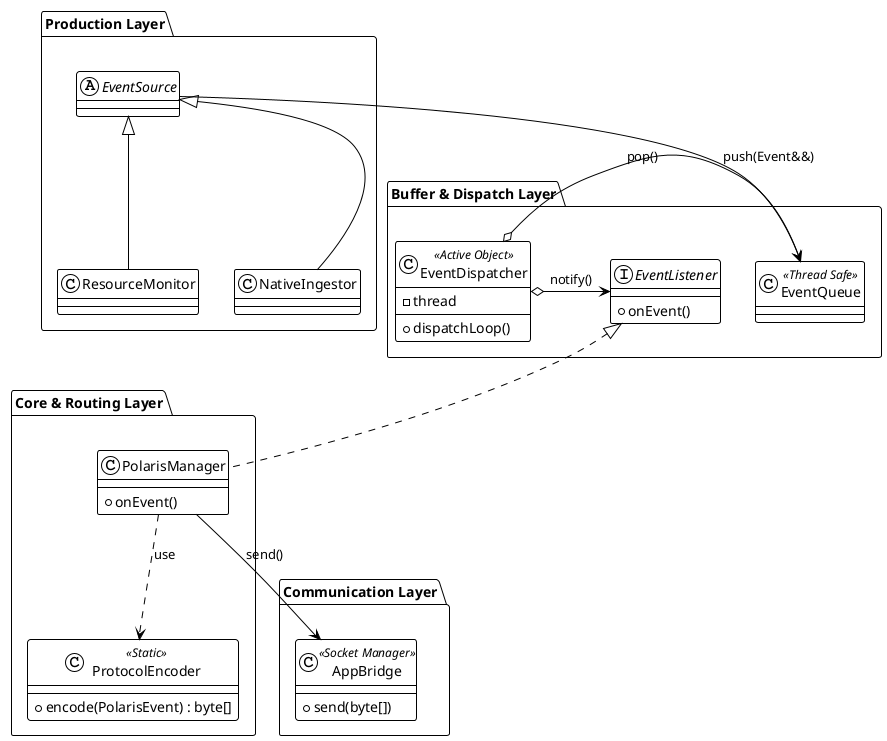
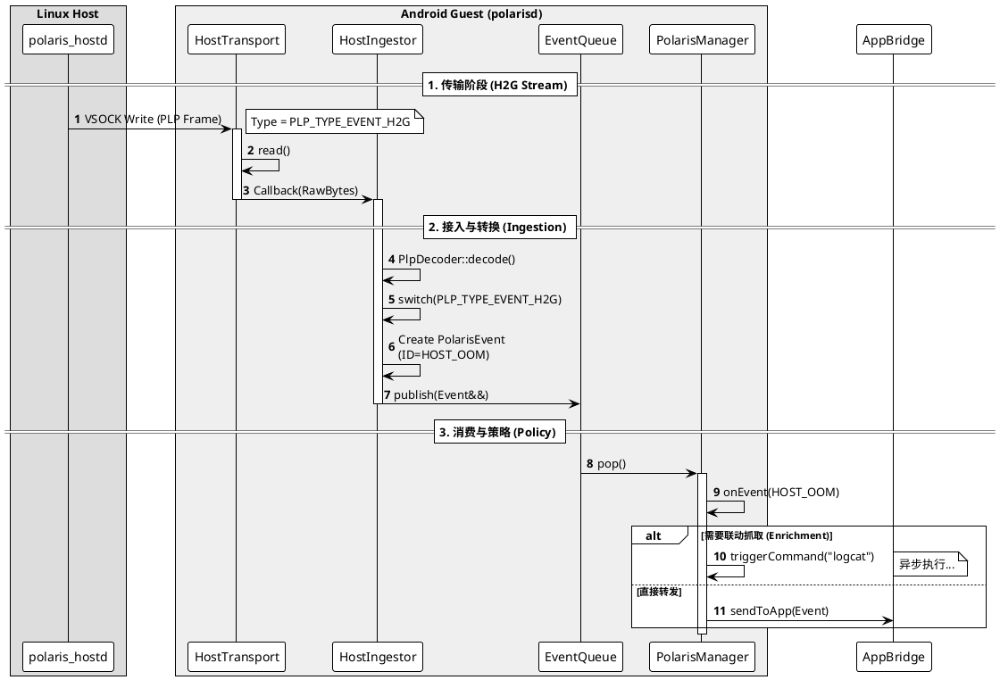

# 核心事件链路与通信桥梁 (v1.1)

**快照日期**: 2026-02-05
**模块范围**: Uplink Pipeline (事件上报) & AppBridge (通信层)

## 1. 核心数据模型 (Data Model)

**设计决策**: 在内存中保持 `payload` 与 `attachment` 分离，以实现零解析注入；在传输时合并。

```cpp
// include/polaris_event_struct.h

struct PolarisEvent {
    uint32_t id;             // 事件 ID (定义在 polaris_event.h)
    uint64_t timestamp;      // 时间戳 (ms)
    std::string payload;     // 原始业务 JSON
    std::string attachment;  // 附件文件路径 (可选)

    // 构造函数：支持移动语义，高效构建
    PolarisEvent(uint32_t _id, std::string&& _json) 
        : id(_id), payload(std::move(_json)), timestamp(getCurrentTimeMs()) {}
};

```

## 2. 生产与缓冲层 (Production & Buffer)

**设计决策**: 采用 **EventSource 抽象基类** 和 **EventQueue 阻塞队列**，实现生产者与消费者的完全解耦。

```cpp
// src/core/EventSource.h
class EventSource {
public:
    virtual ~EventSource() = default;
    void setQueue(std::shared_ptr<EventQueue> queue);
    virtual bool start() = 0;
    virtual void stop() = 0;

protected:
    // 子类调用此方法发布事件 (右值引用，零拷贝)
    void publish(PolarisEvent&& event) {
        if (mQueue) mQueue->push(std::move(event));
    }
private:
    std::shared_ptr<EventQueue> mQueue;
};

// src/core/EventQueue.h
class EventQueue {
public:
    void push(PolarisEvent&& event);
    PolarisEvent pop(); // 阻塞读取
private:
    std::deque<PolarisEvent> mQueue; // 配合 mutex/cond_var 实现
    size_t mCapacity = 1000;         // 环形/丢弃旧值策略
};

```

## 3. 消费与分发层 (Consumption & Dispatch)

**设计决策**: `EventDispatcher` 作为主动对象 (Active Object) 管理消费线程；`PolarisManager` 作为被动监听者实现业务策略。

```cpp
// src/core/EventListener.h
class EventListener {
public:
    virtual void onEvent(const PolarisEvent& event) = 0;
};

// src/core/EventDispatcher.h
class EventDispatcher {
public:
    EventDispatcher(std::shared_ptr<EventQueue> queue);
    void addListener(std::shared_ptr<EventListener> listener);
    void start(); // 启动 dispatchLoop 线程

private:
    void dispatchLoop() {
        while(mRunning) {
            auto event = mQueue->pop();
            // 广播给所有 Listener (如 PolarisManager)
            for (auto& l : mListeners) l->onEvent(event);
        }
    }
};

```

## 4. 核心中枢 (PolarisManager)

**设计决策**: `PolarisManager` 实现 `EventListener` 接口，负责“策略”与“路由”。它不关心事件如何产生，也不关心 Socket 如何发送。

```cpp
// src/PolarisManager.h
class PolarisManager : public EventListener, 
                       public std::enable_shared_from_this<PolarisManager> {
public:
    void init() {
        // 1. 构建管线
        mQueue = std::make_shared<EventQueue>();
        mDispatcher = std::make_shared<EventDispatcher>(mQueue);
        mAppBridge = std::make_shared<AppBridge>();

        // 2. 注册自己为监听者
        mDispatcher->addListener(shared_from_this());

        // 3. 启动组件
        mAppBridge->start();
        mDispatcher->start();
        // ... 启动各个 Source ...
    }

    // 核心回调：收到事件
    void onEvent(const PolarisEvent& event) override {
        // [策略 A] 联动检查
        if (event.id == NATIVE_CRASH && event.attachment.empty()) {
             // 触发抓取，逻辑稍后完善
             // mExecutor->triggerTrace(...) 
             // 注意：这里可能需要修改 event 或生成新 event，此处暂略
        }

        // [策略 B] 序列化并发送给 App
        if (mAppBridge->isConnected()) {
            auto packet = ProtocolEncoder::encode(event);
            mAppBridge->send(packet);
        }
    }
};

```

## 5. 通信层 (AppBridge & Encoder)

**设计决策**:

1. `AppBridge` 是“哑管道”，只负责字节流 I/O。
2. `ProtocolEncoder` 是静态工具，负责将内存对象 (`PolarisEvent`) 序列化为协议格式 (`LSP v1`)，并在此处合并 attachment 到 JSON。

```cpp
// src/ipc/ProtocolEncoder.h
class ProtocolEncoder {
public:
    static std::vector<uint8_t> encode(const PolarisEvent& event) {
        // 1. 合并 JSON Payload 和 Attachment 路径
        std::string finalJson = mergeAttachmentIfAny(event.payload, event.attachment);
        
        // 2. 拼装 LSP 协议头 [Len][Type][ReqID][Rsvd][Payload]
        // ... (Little Endian 位操作) ...
        
        return packet;
    }
};

// src/ipc/AppBridge.h
class AppBridge {
public:
    void start(); // 启动 Accept 线程和 Read 线程
    bool send(const std::vector<uint8_t>& data); // 线程安全发送
    bool isConnected();
    
    // 设置收到 App 命令时的回调 (用于后续 Command 设计)
    void setCommandCallback(...); 
private:
    int mClientFd = -1;
    // ...
};

```

## 6. 架构视图 (Visual Summary)

这张图概括了本次存档的所有类关系和数据流向。




----

这是一份完整的、更新后的 **v1.3** 模块设计快照。

主要变更点在于 **协议消息类型（Message Types）** 的重构，采用了 **G2H (Guest to Host) / H2G (Host to Guest)** 的命名范式，以增强协议的方向语义清晰度和未来的可扩展性。

---

# 模块设计快照：Host 通信与接入 (v1.3)

**快照日期**: 2026-02-05
**模块范围**: Host Interconnect (VSOCK) & Ingestion
**依赖模块**: Core Pipeline (EventSource/Queue)
**变更说明**: 协议消息类型重构为 G2H/H2G 范式。

## 1. 通信协议：Polaris Link Protocol (PLP v2)

Android Guest 与 Linux Host 之间采用 **二进制定长包头 + 变长 Payload** 的协议格式。

* **通道**: VSOCK (Virtio Socket)
* **字节序**: **Little Endian** (强制)
* **对齐**: 4 字节对齐

### 1.1 协议头定义

```cpp
// include/polaris_link_protocol.h

constexpr uint32_t PLP_MAGIC = 0x504C5253; // "PLRS" ASCII

struct PlpHeader {
    uint32_t magic;        // 固定为 PLP_MAGIC
    uint16_t version;      // 0x0002
    uint16_t header_len;   // 24 Bytes (sizeof PlpHeader)
    uint32_t payload_len;  // 仅 Payload 的长度
    uint16_t type;         // 消息类型 (PlpMsgType)
    uint16_t flags;        // bit0: IsJson, bit1: GzipCompressed
    uint32_t seq_id;       // 序列号 (用于 Req/Resp 匹配)
    uint32_t crc32;        // Payload 的 CRC32C 校验值
} __attribute__((packed));

```

### 1.2 消息类型 (PlpMsgType)

采用源到目标 (Source-to-Target) 命名法，明确数据流向。

| Value | Macro Name | Direction | Description |
| --- | --- | --- | --- |
| **0x0001** | `PLP_TYPE_HEARTBEAT` | Bi-dir | 链路保活心跳 |
| **0x0010** | `PLP_TYPE_EVENT_H2G` | Host -> Guest | Host 主动上报的事件 (Kernel Panic, OOM) |
| **0x0011** | `PLP_CMD_RESP_H2G` | Host -> Guest | Host 对 Guest 命令的执行回执 |
| **0x0020** | `PLP_CMD_REQ_G2H` | Guest -> Host | Android 请求 Host 执行命令 |
| *0x0030* | *`PLP_CMD_REQ_H2G`* | *Host -> Guest* | *(预留) Host 请求 Android 执行命令* |

---

## 2. 传输层设计 (HostTransport)

**职责**: 负责 VSOCK 连接的维护、断线重连和二进制流的收发。它不关心数据的内容和类型。

```cpp
// src/transport/HostTransport.h

class HostTransport {
public:
    using OnDataCallback = std::function<void(const std::vector<uint8_t>& data)>;

    // Guest 连接 Host (CID:2, Port:10240)
    bool connect();
    void disconnect();

    // 发送数据 (线程安全)
    bool send(const std::vector<uint8_t>& data);

    // 设置数据接收回调 (通常由 HostIngestor 注册)
    void setCallback(OnDataCallback cb);

private:
    void readLoop(); // 阻塞式读取线程
    
    int mSocketFd = -1;
    std::thread mReadThread;
    OnDataCallback mCallback;
    // ... Reconnection logic ...
};

```

## 3. 接入层设计 (HostIngestor)

**职责**:

1. 作为 **Consumer** 消费 `HostTransport` 的字节流。
2. 作为 **Producer** (`EventSource`) 向 `EventQueue` 生产 `PolarisEvent`。
3. 负责协议解析 (`PlpDecoder`) 和 **H2G** 消息处理。

```cpp
// src/ingestor/HostIngestor.h

class HostIngestor : public EventSource {
public:
    explicit HostIngestor(std::shared_ptr<HostTransport> transport) 
        : mTransport(transport) {}

    bool start() override {
        if (!mTransport) return false;
        
        // 注册回调：当 Transport 收到原始字节流
        mTransport->setCallback([this](const std::vector<uint8_t>& data) {
            this->processRawData(data);
        });
        
        return true;
    }

    void stop() override {
        // 清理回调，停止 Transport
    }

private:
    void processRawData(const std::vector<uint8_t>& rawData) {
        // 1. 解码 PLP (处理粘包、校验 CRC、检查 Magic)
        PlpFrame frame = PlpDecoder::decode(rawData);
        
        if (!frame.isValid()) {
            LOG(ERROR) << "Invalid Host PLP Frame";
            return;
        }

        // 2. 根据新版消息类型分发
        switch (frame.header.type) {
            case PLP_TYPE_EVENT_H2G:
                handleHostEvent(frame);
                break;
                
            case PLP_CMD_RESP_H2G:
                handleHostResponse(frame);
                break;
                
            case PLP_CMD_REQ_G2H:
                LOG(WARNING) << "Loopback G2H packet detected, ignoring.";
                break;
                
            default:
                LOG(DEBUG) << "Unknown PLP type: " << frame.header.type;
                break;
        }
    }

    void handleHostEvent(const PlpFrame& frame) {
        // EventID 映射：Host 事件 ID 偏移
        uint32_t eventId = EVENT_HOST_BASE + extractId(frame.json);
        
        // 构造 Event (移动语义)
        PolarisEvent event(eventId, std::move(frame.json));
        publish(std::move(event));
    }

    void handleHostResponse(const PlpFrame& frame) {
        // 命令回执：封装为特殊事件，携带 seq_id 供 Manager 匹配
        // 为了简化，这里假设 JSON Payload 中已经包含了 seq_id 或者 Manager 能通过上下文识别
        PolarisEvent event(EVENT_HOST_CMD_RESULT, std::move(frame.json));
        // 注意：在实际实现中，可能需要将 frame.seq_id 传递给 Event 的扩展字段
        publish(std::move(event));
    }

    std::shared_ptr<HostTransport> mTransport;
};

```

## 4. 核心交互时序

描述从 Linux Host 发出数据，到 Android 策略层接收的全过程。



## 5. 关键设计总结

1. **G2H/H2G 范式**: 协议层采用方向性命名，解决了 "Req/Resp" 在双向控制场景下的歧义问题，明确了 `polarisd` 只应该处理 `H2G` 类型的消息。
2. **协议隔离**: `HostIngestor` 屏蔽了 PLP 二进制协议细节，对内输出统一的 `PolarisEvent`，保证了核心链路的纯洁性。
3. **防回环**: 在 `HostIngestor` 中增加了对 `PLP_CMD_REQ_G2H` 的过滤，防止因 Socket 错误导致的自发自收。