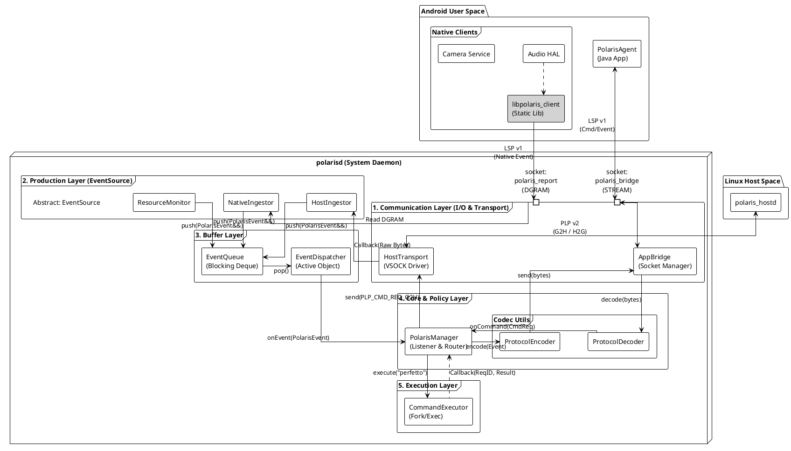
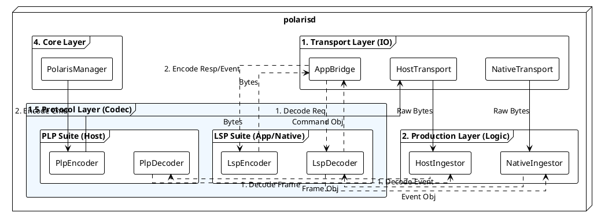

# polarisd 架构设计文档

**文档状态**: Draft
**版本**: v1.0
**作者**: Polaris Architect Team
**日期**: 2026-02-04

---

## 1. 文档信息

### 1.1 版本历史

| 版本 | 日期 | 修改人 | 说明 |
| --- | --- | --- | --- |
| v0.1 | 2026-01-30 | Ethen | 初始草稿，定义基本通信模型 |
| v0.2 | 2026-02-04 | Architect | 架构定稿：全双工、PLP v2协议、双向路由、目录结构冻结 |

### 1.2 适用范围

* **平台**: Android Automotive OS (IV)
* **虚拟化架构**: Type-1 Hypervisor
  * **Guest**: Android (polarisd 运行环境)
  * **Host**: Linux (polaris_hostd 运行环境)

* **通信通道**:
* Android App ↔ Daemon: Unix Domain Socket (LocalSocket)
* Guest ↔ Host: VSOCK (Virtio Socket)

### 1.3 术语表

* **polarisd**: Android 侧 Native 守护进程，本系统的核心网关。
* **polaris_hostd**: Linux Host 侧守护进程，负责 Host 端采集与执行。
* **PolarisAgent**: Android 侧系统级 App (Java)，负责业务逻辑与上传。
* **PLP (Polaris Link Protocol)**: Guest 与 Host 之间的二进制通信协议。
* **Uplink (上行)**: 数据从 Host 流向 Android App (如事件上报)。
* **Downlink (下行)**: 指令从 Android App 流向 Native 或 Host。

---

## 2. 背景与目标

### 2.1 背景

为了实现“端云一体”的稳定性与性能诊断，我们需要打通 Android 与 Linux Host 之间的壁垒。Android App 需要感知 Host 侧的 Kernel Panic、OOM 等严重事件，同时也需要有能力控制 Host 进行 Trace 抓取等诊断操作。

### 2.2 角色定位

`polarisd` 定位为 Android Guest 侧的 **智能网关 (Smart Gateway)** 与 **执行控制器 (Executor)**。

* **对上 (App)**: 提供统一的命令接口与事件流。
* **对下 (Host)**: 屏蔽通信细节，作为 Host 在 Android 的代理。
* **对内 (Android)**: 
  * 执行需要 Root/System 权限的本地诊断任务
  * 负责监控android native/hal 核心进程的状态，核心进程通过配置文件配置。当核心进程崩溃后，需要上报Event给 PolarisAgent
  * Android资源水位的监控，例如监控android的cpu、memory、io，当监测到异常会上报事件给 PolarisAgent
  * 接收Android native层其他模块的埋点Event，处理后（例如当发生某个Event，需要获取系统的perfetto trace），再转发给 PolarisAgent

### 2.3 设计目标

1. **全双工通信**: 支持同时进行事件上报与命令下发。
2. **透明路由**: 对于 Host 命令，polarisd 仅做转发，不解析业务 Payload，实现 Host/App 业务迭代与 Daemon 解耦。
3. **高可靠性**: 具备断线重连、缓存重发 (Backpressure)、进程自愈能力。
4. **安全管控**: 严格的命令白名单与参数校验，防止被滥用。

### 2.4 非目标 (Non-Goals)

* 不支持任意 Shell 命令执行 (仅限白名单)。
* 不处理大文件传输 (Trace 文件通过共享存储或特定通道，控制通道仅传路径)。

---

## 3. 总体架构

### 3.1 组件图

### 3.2 数据流与控制流

* **Flow A: Host Event Ingestion (上行)**
* `polaris_hostd` (Event) → VSOCK → `Transport` → `Manager` → `IPC` → `App`

* **Flow B: Host Remote Control (下行 - 透传)**
* `App` (Cmd: target=host) → `IPC` → `Manager` → `Transport` → `polaris_hostd` → (Result) → `polarisd` → `App`

* **Flow C: Local Command Execution (下行 - 本地)**
* `App` (Cmd: target=local) → `IPC` → `Manager` → `Executor` (Fork/Exec) → `Manager` → `App`

