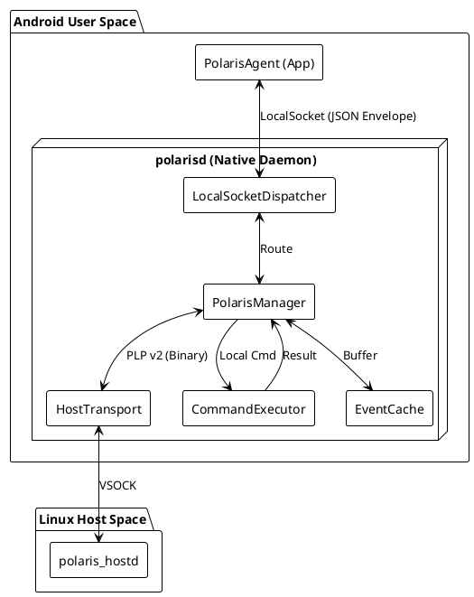

# polarisd 架构设计文档

**文档状态**: Draft
**版本**: v1.0
**作者**: Polaris Architect Team
**日期**: 2026-02-04

---

## 1. 文档信息

### 1.1 版本历史

| 版本 | 日期 | 修改人 | 说明 |
| --- | --- | --- | --- |
| v0.1 | 2026-01-30 | Ethen | 初始草稿，定义基本通信模型 |
| v1.0 | 2026-02-04 | Architect | 架构定稿：全双工、PLP v2协议、双向路由、目录结构冻结 |

### 1.2 适用范围

* **平台**: Android Automotive OS (IV)
* **虚拟化架构**: Type-1 Hypervisor
* **Guest**: Android (polarisd 运行环境)
* **Host**: Linux (polaris_hostd 运行环境)


* **通信通道**:
* Android App ↔ Daemon: Unix Domain Socket (LocalSocket)
* Guest ↔ Host: VSOCK (Virtio Socket)


### 1.3 术语表

* **polarisd**: Android 侧 Native 守护进程，本系统的核心网关。
* **polaris_hostd**: Linux Host 侧守护进程，负责 Host 端采集与执行。
* **PolarisAgent**: Android 侧系统级 App (Java)，负责业务逻辑与上传。
* **PLP (Polaris Link Protocol)**: Guest 与 Host 之间的二进制通信协议。
* **Uplink (上行)**: 数据从 Host 流向 Android App (如事件上报)。
* **Downlink (下行)**: 指令从 Android App 流向 Native 或 Host。

---

## 2. 背景与目标

### 2.1 背景

为了实现“端云一体”的稳定性与性能诊断，我们需要打通 Android 与 Linux Host 之间的壁垒。Android App 需要感知 Host 侧的 Kernel Panic、OOM 等严重事件，同时也需要有能力控制 Host 进行 Trace 抓取等诊断操作。

### 2.2 角色定位

`polarisd` 定位为 Android Guest 侧的 **智能网关 (Smart Gateway)** 与 **执行控制器 (Executor)**。

* **对上 (App)**: 提供统一的命令接口与事件流。
* **对下 (Host)**: 屏蔽通信细节，作为 Host 在 Android 的代理。
* **对内 (Android)**: 
  * 执行需要 Root/System 权限的本地诊断任务
  * 负责监控android native/hal 核心进程的状态，核心进程通过配置文件配置。当核心进程崩溃后，需要上报Event给 PolarisAgent
  * Android资源水位的监控，例如监控android的cpu、memory、io，当监测到异常会上报事件给 PolarisAgent
  * 接收Android native层其他模块的埋点Event，处理后（例如当发生某个Event，需要获取系统的perfetto trace），再转发给 PolarisAgent

### 2.3 设计目标

1. **全双工通信**: 支持同时进行事件上报与命令下发。
2. **透明路由**: 对于 Host 命令，polarisd 仅做转发，不解析业务 Payload，实现 Host/App 业务迭代与 Daemon 解耦。
3. **高可靠性**: 具备断线重连、缓存重发 (Backpressure)、进程自愈能力。
4. **安全管控**: 严格的命令白名单与参数校验，防止被滥用。

### 2.4 非目标 (Non-Goals)

* 不支持任意 Shell 命令执行 (仅限白名单)。
* 不处理大文件传输 (Trace 文件通过共享存储或特定通道，控制通道仅传路径)。

---

## 3. 总体架构

### 3.1 组件图



### 3.2 数据流与控制流

* **Flow A: Host Event Ingestion (上行)**
* `polaris_hostd` (Event) → VSOCK → `Transport` → `Manager` → `IPC` → `App`


* **Flow B: Host Remote Control (下行 - 透传)**
* `App` (Cmd: target=host) → `IPC` → `Manager` → `Transport` → `polaris_hostd` → (Result) → `polarisd` → `App`


* **Flow C: Local Command Execution (下行 - 本地)**
* `App` (Cmd: target=local) → `IPC` → `Manager` → `Executor` (Fork/Exec) → `Manager` → `App`


### 3.3 模块边界

* **SDK**: 负责 Java 对象 (PolarisEvent) 与 JSON/Bytes 之间的序列化。
* **polarisd**: 负责二进制流的路由、协议封装、进程生命周期管理。
* **App**: 负责业务策略（何时抓 Trace、何时上传）。

---

## 4. 运行环境与部署

### 4.1 进程形态

* **类型**: Native Daemon
* **路径**: `/system/bin/polarisd`
* **生命周期**: 由 `init` 进程启动并守护，Crash 后自动重启。

### 4.2 启动脚本 (`polarisd.rc`)

```rc
service polarisd /system/bin/polarisd
    class core
    user system
    group system
    # 创建 /dev/socket/polaris_socket，权限 0660
    socket polaris_socket stream 0660 system system
    # 重启策略
    restart_period 5

```

### 4.3 依赖库

* `libbase` (Logging, UniqueFD)
* `libcutils` (Properties, Sockets)
* `liblog` (Android Log)
* `libutils`

### 4.4 完整代码目录结构 (Fixed)

```text
vendor/voyah/system/polaris/native/
├── Android.bp
├── polarisd.rc
├── main.cpp
├── include/
│   ├── polaris_event.h         // EventID 常量
│   ├── polaris_protocol.h      // Java <-> Native 协议
│   └── polaris_link_protocol.h // Guest <-> Host 协议 (PLP v2)
└── src/
    ├── PolarisManager.h/cpp    // 核心路由
    ├── ipc/                    // LocalSocket 实现
    ├── transport/              // Host VSOCK 实现
    ├── executor/               // 本地命令执行
    ├── buffer/                 // 环形缓存
    └── utils/

```

---

## 5. 关键功能需求

### 5.1 Host 事件转发

* **速率限制**: Token Bucket 算法，限制 Host 每秒上报条数 (e.g., 50 TPS)，超限丢弃并告警。
* **缓存**: 当 App 未连接时，启用 RingBuffer (默认 500 条 / 2MB)，策略为 Drop Oldest。

### 5.2 命令执行

* **本地命令**:
* `perfetto`: 支持指定时长、Buffer 大小、Config。
* `logcat`: 支持指定行数、Tag。


* **远程命令**:
* 全透传，`polarisd` 不校验参数，只负责传递 JSON Payload。


* **超时控制**: 默认 15s 超时，App 端负责超时计时，Daemon 端负责清理僵尸子进程。

### 5.3 运维支持

* 支持 `dump` 命令（通过 LocalSocket 发送），输出当前连接状态、缓存占用、丢包统计。

---

## 6. 协议设计

### 6.1 Guest ↔ Host: Polaris Link Protocol (PLP v2)

采用定长包头 + 变长 Payload 设计，支持校验和版本协商。

#### 6.1.1 LinkHeader 定义

```cpp
struct LinkHeader {
    uint32_t magic;        // 0x504C5253 "PLRS"
    uint16_t version;      // 0x0001
    uint16_t header_len;   // 24 bytes (sizeof LinkHeader)
    uint32_t payload_len;  // Payload 长度
    uint16_t type;         // 消息类型
    uint16_t flags;        // bit0: IsJson, bit1: Gzip
    uint32_t seq_id;       // 请求/响应匹配 ID
    uint32_t crc32;        // Payload CRC32C
} __attribute__((packed));

```

#### 6.1.2 消息类型 (LinkMsgType)

| Value | Name | Payload | Direction | Description |
| --- | --- | --- | --- | --- |
| 0x0001 | HEARTBEAT | Empty | Bi-dir | 链路保活 |
| 0x0010 | HOST_EVENT | Binary/JSON | H -> G | Host 事件上报 |
| 0x0020 | CMD_REQ | JSON | G -> H | Android 请求 Host 执行 |
| 0x0021 | CMD_RESP | JSON | H -> G | Host 执行结果 |

### 6.2 App ↔ polarisd: LocalSocket Protocol

#### 6.2.1 基础封包

`[TotalLen (4)] [MsgType (2)] [ReqID (2)] [Payload (N)]`

#### 6.2.2 MsgType 定义

* `0x0001` **EVENT_REPORT**: Daemon -> App (含 Host Event 和 Local Event)
* `0x0020` **CMD_REQ_HOST**: App -> Daemon (转发给 Host)
* `0x0022` **CMD_REQ_LOCAL**: App -> Daemon (本地执行)
* `0x0021` **CMD_RESP**: Daemon -> App (命令回执)

#### 6.2.3 Command Payload (JSON Envelope)

```json
{
  "target": "host",       // or "local"
  "action": "dump_trace", // command name
  "args": { "duration": 10, "path": "..." }
}

```

---

## 7. 核心模块设计

### 7.1 PolarisManager

* **职责**: 系统的“交换机”。
* **逻辑**:
* 收到 IPC `CMD_REQ_HOST` -> 封装 PLP Header -> 调 Transport Send。
* 收到 IPC `CMD_REQ_LOCAL` -> 调 Executor Execute。
* 收到 Transport `HOST_EVENT` -> 封装 NativeEvent -> 调 IPC Send。


### 7.2 CommandExecutor

* **并发**: 采用 `fork()` 多进程模型，而非线程池，避免污染 Daemon 内存空间或因 Crash 导致 Daemon 崩溃。
* **回收**: 主循环中处理 `SIGCHLD` 信号，通过 `waitpid` 回收僵尸进程，并触发“任务完成”事件。

### 7.3 HostTransport

* **抽象**: 定义 `connect`, `disconnect`, `send`, `setCallback` 虚函数。
* **VSOCK**: 实现具体的 socket, bind, connect (CID: Any, Port: Constant)。

---

## 8. 并发模型与性能

### 8.1 线程模型

1. **Main Thread**: `PolarisManager::run()`，负责信号处理、状态机维护。
2. **IPC Read Thread**: `LocalSocketDispatcher` 专用，阻塞读 LocalSocket。
3. **Transport Read Thread**: `VsockTransport` 专用，阻塞读 VSOCK。

> **注意**: 写操作（Send）通常在调用者线程直接执行，需加锁 (`std::mutex`) 保护 Socket fd。

### 8.2 性能目标

* **吞吐量**: 支持 100 TPS (Transactions Per Second) 的事件上报。
* **延迟**: Host 事件到达 App 延迟 < 50ms。
* **资源**: CPU < 1% (空闲时), Mem < 10MB。

---

## 9. 可靠性设计

### 9.1 异常恢复

* **LocalSocket 断开**: 暂停发送，数据存入 Cache。检测到新连接 (`accept`) 后，立即 Flush Cache。
* **VSOCK 断开**: `Transport` 线程尝试每 5s 重连 Host。重连期间拒绝 `CMD_REQ_HOST` 请求（返回 Error）。

### 9.2 背压策略 (Backpressure)

* **EventCache**: 设置高水位 (High Watermark)。
* 当 Cache 满时，触发 `Drop Oldest`。
* 每丢弃 100 条，生成一条 `InternalEvent(ID=DROP_WARNING)` 上报给 App。


---

## 10. 安全设计

### 10.1 权限控制

* **Socket 权限**: 仅允许 `system` 用户和组访问。App 必须 sharedUserId 为 `android.uid.system`。
* **SELinux**: 定义 `polarisd` domain，仅允许其访问特定的 Log 目录和 Perfetto 接口。

### 10.2 命令注入防御

* **本地命令**: 严禁拼接 Shell 字符串执行 `system()`。必须使用 `execv(path, argv[])`，参数分离。
* **路径检查**: 所有文件路径参数必须校验是否在白名单目录 (e.g., `/data/local/tmp/polaris/`) 下，防止 Path Traversal (`../../etc/passwd`)。

---

## 11. 验证方案

### 11.1 单元测试

* **ProtocolTest**: 构造错误 Magic、错误 CRC 的包，验证解析器是否正确拒绝。
* **CacheTest**: 压入超过容量的数据，验证是否 Drop Oldest。

### 11.2 集成测试

* **Loopback 测试**: 在没有真实 Host 的情况下，使用 `MockVsockTransport` 模拟收发，验证 App 到 Daemon 的全链路。

### 11.3 压力测试

* 使用脚本向 LocalSocket 疯狂灌入命令，同时模拟 Host 疯狂上报事件，观察 Daemon 内存是否泄漏，CPU 是否飙升。

---

## 12. 附录

### A. 目录与文件清单 (Snapshot)

*(参见 4.4 节，与工程树保持严格一致)*

### B. 时序图

*(参见 PlantUML 设计图，包含 Event Uplink 和 Cmd Downlink 场景)*