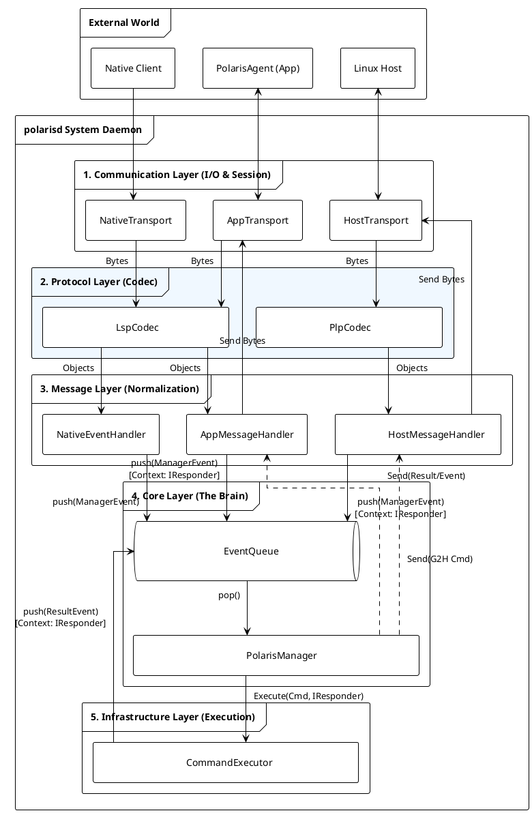

+++
date = '2025-12-24T17:17:50+08:00'
draft = true
title = 'polarisd 架构设计文档'
+++

# polarisd 架构设计文档 (v0.2)

**版本**: v0.2
**日期**: 2026-03-02
**状态**: **Draft**

## 1. 设计原则 (Design Principles)

1. **全域统一 (Universal Consistency)**: Linux Host, Android Native, Java Framework 共享同一套事件数据模型。
2. **单一大脑 (Single Brain)**: `PolarisManager` 是系统中唯一的决策中心。
3. **一切皆事件 (Everything is an Event)**: 外部的上报、App 的命令、以及命令执行的结果，在内部都被视为 Event 统一排队处理。
4. **分层解耦 (Layered Decoupling)**: I/O、协议、业务逻辑、核心策略、基础设施严格分层，单向依赖。

---

## 2. 全局数据结构

### 2.1 PolarisEvent (标准数据契约)

这是全系统通用的"感知信息"载体。

| 字段名 | 类型 | 语义说明 | 必填 |
| --- | --- | --- | --- |
| **eventId** | uint64 | 事件唯一标识符 (全系统唯一 ID 表) | Yes |
| **timestamp** | uint64 | 事件发生的物理时间 (ms) | Yes |
| **pid** | int32 | 产生事件的进程 ID | Yes |
| **processName** | string | 产生事件的进程名/模块名 | Yes |
| **processVer** | string | 产生事件的进程版本号 | Yes |
| **params** | JSON string | 具体业务参数 (Key-Value) | No |
| **logf** | string | 关联文件路径 (如 Trace, Log, Dump) | No |

### 2.2 CommandRequest (控制指令)

用于 App 或 Host 下发控制命令。

| 字段名 | 类型 | 语义说明 |
| --- | --- | --- |
| **reqId** | uint32 | 请求序列号 (用于异步匹配 Response) |
| **target** | enum | 执行目标 (`LOCAL` / `HOST`) |
| **action** | string | 动作指令 (如 `ping`) |
| **args** | JSON string | 动作参数 |
| **timeout** | uint32 | 超时时间 (ms) |

### 2.3 CommandResult 数据格式定义

用于描述命令执行的最终状态和产物，与 `CommandRequest` 构成闭环。

| 字段名 | 类型 | 语义说明 | 必填 |
| --- | --- | --- | --- |
| **reqId** | uint32 | **请求序列号**。必须与 `CommandRequest.reqId` 严格一致，用于回调溯源。 | Yes |
| **code** | int32 | **状态码**。`0` 表示成功，非 `0` 表示错误码 (如 System Exit Code)。 | Yes |
| **msg** | string | **可读消息**。简短描述 (e.g., "success", "Timeout", "Fork Failed")。 | Yes |
| **data** | JSON string | **执行产物**。具体的返回数据 (e.g., `{"status": "pong"}`)。 | No |

辅助工厂方法:

```cpp
CommandResult::makeSuccess(uint32_t id, const std::string& data = "{}");
CommandResult::makeError(uint32_t id, int32_t code, const std::string& msg);
```

---

## 3. 软件架构设计 (Architecture)

### 3.1 核心架构视图

本架构采用 **Pipeline 处理模式** 和 **单线程事件循环** 模型，配合 Infrastructure 层的异步执行。



### 3.2 核心组件职责矩阵

| 分层 | 组件名称 | 核心职责 | 线程模型 |
| --- | --- | --- | --- |
| **Communication** | **AppTransport** | Unix SEQPACKET server，监听 `polaris_bridge`，管理多 AppSession | Accept Thread (poll, 2s timeout) |
|  | **AppSession** | 单个 App 连接的读写管理，实现 `IResponder` 接口 | 双线程 (Read + Write) |
|  | **NativeTransport** | Unix DGRAM 接收器，监听 `polaris_report` | 单 Read Thread |
|  | **HostTransport** | VSOCK 客户端 (CID=2, Port=9001)，自动重连 | Connect Thread (1s 轮询) |
|  | **HostSession** | 单条 Host 连接的读写管理，实现 `IResponder` 接口 | Read Thread + 同步 Write |
| **Protocol** | **LspCodec** | LSP 协议编解码 (Header 12B + JSON)。纯逻辑工具类。 | N/A |
|  | **PlpCodec** | PLP 协议编解码 (Header 24B + Payload + CRC32)。纯逻辑工具类。 | N/A |
| **Message** | **AppMessageHandler** | 将 LSP 对象归一化为 `PolarisManagerEvent`，支持广播 | 被 Session Thread 调用 |
|  | **NativeEventHandler** | 将 Native 上报的事件归一化为 `PolarisManagerEvent` | 被 NativeTransport Thread 调用 |
|  | **HostMessageHandler** | 将 PLP 对象归一化为 `PolarisManagerEvent` | 被 HostSession Thread 调用 |
| **Core** | **EventQueue** | 线程安全的阻塞队列 (容量 2000，Drop Oldest) | Thread Safe |
|  | **PolarisManager** | **系统大脑**。从队列取事件，执行策略 (分发、联动、回调) | 单独 Main Thread |
| **Infrastructure** | **CommandExecutor** | 异步执行器。每个命令 detach 一个 worker thread | Detached Thread / Command |
|  | **ActionFactory** | 根据 action 名称创建具体的 Action 实例 | N/A |

### 3.3 通信通道概览

| 通道 | Socket 类型 | 协议 | 方向 | init.rc 配置 |
| --- | --- | --- | --- | --- |
| polarisd ↔ PolarisAgent APK | `AF_UNIX` + `SOCK_SEQPACKET` | LSP v1 | 双向 | `socket polaris_bridge seqpacket 0666` |
| Native Client → polarisd | `AF_UNIX` + `SOCK_DGRAM` | LSP v1 | 单向 (上报) | `socket polaris_report dgram 0666` |
| polarisd ↔ Linux Host | `AF_VSOCK` + `SOCK_STREAM` | PLP v1 | 双向 | N/A (polarisd 主动 connect Host CID=2) |

---

## 4. 协议定义 (Protocols)

### 4.1 LSP v1 (Local Socket Protocol)

用于 App 与 Native Client 通信。

* **结构**: `Header (12B) + Payload (JSON)`
* **字节序**: Little Endian

| 字段 | 偏移 | 长度 | 说明 |
| --- | --- | --- | --- |
| `TotalLen` | 0 | 4 | Header + Payload 总长 |
| `MsgType` | 4 | 2 | `EVENT_REPORT (0x01)`, `CMD_REQ (0x20)`, `CMD_RESP (0x21)` |
| `Reserved` | 6 | 2 | 0 |
| `ReqID` | 8 | 4 | 请求 ID |


#### 4.1.1 核心字段与 Framing 策略

* **TotalLen (包总长)**
  * **语义**: 表示整个数据包的长度，计算公式为 `TotalLen = 12 (Header) + Payload Length`。
  * **最小有效值**: 12 (即 Payload 为空的情况)。
  * **最大限制**: 建议限制为 **4MB**。若收到 `TotalLen > 4MB` 的包，视为非法攻击或错误，应立即断开连接。

* **Socket 类型对应的 Framing (分帧) 规则**:

  * **SOCK_SEQPACKET** (AppTransport):
    * 内核保证消息边界。`recv` 调用返回的数据即为一个完整包（或被截断）。
    * **校验**: 接收端仍需校验 `recv_count == TotalLen`，以确保数据未被内核截断。
    * 当前实现使用 `MSG_TRUNC` 标志检测截断。

  * **SOCK_DGRAM** (NativeTransport):
    * 内核保证消息边界。同上，使用 `MSG_TRUNC` 检测超大包。
    * 最大接收缓冲区 4MB。

#### 4.1.2 JSON Payload Schema 定义

所有 Payload 均为 UTF-8 编码的 JSON 字符串。

**A. 事件上报 (`EVENT_REPORT` - 0x0001)**
对应 `PolarisEvent` 数据结构。

```json
{
  "eventId": 10001,
  "timestamp": 1707123456789,
  "pid": 520,
  "processName": "audio_hal",
  "processVer": "1.0.2",
  "logf": "/data/local/tmp/audio_dump.pcm",
  "params": {
    "latency": 40,
    "buffer_underrun": true
  }
}

```

**B. 命令请求 (`CMD_REQ` - 0x0020)**
对应 `CommandRequest` 数据结构。

```json
{
  "reqId": 8801,
  "target": "LOCAL",
  "action": "ping",
  "timeout": 5000,
  "args": {}
}

```

**C. 命令回执 (`CMD_RESP` - 0x0021)**
对应 `CommandResult` 数据结构。

```json
{
  "reqId": 8801,
  "code": 0,
  "msg": "success",
  "data": {
    "status": "pong"
  }
}

```

### 4.2 PLP v1 (Polaris Link Protocol)

用于 Host 与 Guest 通信。支持全双工控制。

* **结构**: `Header (24B) + Payload (Binary/JSON)`
* **字节序**: Little Endian

| 消息类型 (Type) | 值 | 方向 | 说明 |
| --- | --- | --- | --- |
| `PLP_TYPE_HEARTBEAT` | 0x0001 | Bi-dir | 心跳 |
| **H2G (Host -> Guest)** |  |  |  |
| `PLP_TYPE_EVENT_H2G` | 0x0010 | H->G | Host 事件上报 |
| `PLP_CMD_RESP_H2G` | 0x0011 | H->G | Host 回复 Android 的请求 |
| `PLP_CMD_REQ_H2G` | 0x0012 | H->G | Host 请求 Android 执行 |
| **G2H (Guest -> Host)** |  |  |  |
| `PLP_CMD_REQ_G2H` | 0x0020 | G->H | Android 请求 Host 执行 |
| `PLP_CMD_RESP_G2H` | 0x0021 | G->H | Android 回复 Host 的请求 |
| `PLP_TYPE_EVENT_G2H` | 0x0022 | G->H | Android 事件上报给 Host |


#### 4.2.1 Binary Header 结构定义

PLP 采用严格的二进制对齐结构（24 字节），并在 C++ 中使用 `packed` 属性定义。

```cpp
// 字节序: Little Endian
struct PlpHeader {
    uint32_t magic;        // 固定值 0x504C5253 ("PLRS")
    uint16_t version;      // 协议版本，当前为 0x0001
    uint16_t header_len;   // 固定值 24
    uint32_t payload_len;  // 仅 Payload 的长度 (不含 Header)
    uint16_t type;         // 消息类型 (PlpMsgType)
    uint16_t flags;        // 标志位 (见下文)
    uint32_t seq_id;       // 序列号
    uint32_t crc32;        // Payload 的 CRC32 校验值
} __attribute__((packed));

```

**关键字段语义**:

* **Flags (位掩码)**:
  * `Bit 0 (IS_JSON)`: 1 表示 Payload 是 JSON 字符串，0 表示是原始二进制。
  * `Bit 1 (GZIP)`: 预留，当前版本未实现。
  * `Bit 2~15`: 预留。

* **SeqID**:
  * 用于双向通信的请求-响应匹配。
  * 发起方（Request）生成 SeqID，响应方（Response）必须回传相同的 SeqID。
  * 对于主动上报的 Event，SeqID 可由发送方自增，用于接收方检测丢包。

* **CRC32**:
  * 算法: 标准 IEEE 802.3 CRC32 (编译期生成查找表)。
  * 范围: **仅计算 Payload 部分**。Header 本身不参与 CRC 计算（Header 依靠 Magic 校验）。

#### 4.2.2 传输控制策略

* **Max Payload (最大载荷)**: **16MB** (PlpCodec 中通过 `MAX_PAYLOAD_SIZE` 限制)。
* **超限策略**: 若试图发送超过限制的数据，**协议层直接拒绝 (Drop)** 并记录错误日志。
* **超时机制**: 建议默认超时时间 **3000ms**。若发出 Request 后超时未收到 Response，应向上层返回 `TIMEOUT` 错误。

---

## 5. 关键业务流程

### 5.1 事件上报与联动 (Native → App)

1. **Source**: Native 进程调用 `polaris_event_commit()` → `libpolaris_client` 通过 DGRAM 发送至 `polaris_report`。
2. **Receive**: `NativeTransport` 的 `readLoop()` 收到数据包 → `NativeEventHandler.onMessage()` 校验并解码。
3. **Queue**: Handler 封装 `ManagerEvent(TYPE_NATIVE_EVENT)` → Push `EventQueue`。
4. **Core**: `PolarisManager` Pop 事件 → 调用 `AppMessageHandler::broadcastEvent()` → 广播给所有已连接的 App。

### 5.2 命令执行闭环 (App → polarisd → App)

1. **Request**: App 的 `CommandManager.sendAsync("ping", ...)` → `CoreTransport.sendRaw()` → `AppSession.readLoop()` 收到 → `AppMessageHandler.onMessage()` → Push `ManagerEvent(TYPE_APP_CMD_REQ)` (携带 `weak_ptr<IResponder>` 指向 AppSession)。
2. **Core**: `PolarisManager` Pop 请求 → 调用 `CommandExecutor.execute(cmd, weak_ptr<IResponder>)`。
3. **Execute**: Executor detach 新线程 → `ActionFactory::create("ping")` → `PingAction::execute()` → 生成 `CommandResult`。
4. **Result Loop-back**: 执行完毕 → 封装 `ManagerEvent(TYPE_CMD_EXEC_RESULT)` 并携带原始 `weak_ptr<IResponder>` → Push 回 `EventQueue`。
5. **Response**: `PolarisManager` Pop 结果 → `responder.lock()` 检查 AppSession 是否存活 → 若存活则调用 `sendResult()` 回包；若已断开则丢弃结果。

### 5.3 Host 事件转发 (Host → polarisd → App)

1. **Receive**: `HostTransport` 通过 VSOCK 连接到 Host (CID=2, Port=9001)，`HostSession.readLoop()` 收到 PLP 包。
2. **Decode**: `HostMessageHandler.onMessage()` 校验 PLP Header (Magic, Version, CRC32) → 解码 JSON。
3. **Queue**: 封装 `ManagerEvent(TYPE_HOST_EVENT)` → Push `EventQueue`。
4. **Core**: `PolarisManager` Pop 事件 → 调用 `AppMessageHandler::broadcastEvent()` 转发给所有 App。

---

## 6. 内部关键类和数据结构定义

### 6.1 PolarisManagerEvent (内部总线对象)

这是内部 `EventQueue` 中流转的唯一对象，用于屏蔽外部差异。

```cpp
struct PolarisManagerEvent {
    enum Type {
        TYPE_NATIVE_EVENT,      // 来源: Native (LSP)
        TYPE_HOST_EVENT,        // 来源: Host (PLP)
        TYPE_APP_CMD_REQ,       // 来源: App (LSP Command)
        TYPE_HOST_CMD_REQ,      // 来源: Host (PLP Command)
        TYPE_CMD_EXEC_RESULT,   // 来源: Infrastructure (执行结果)
        TYPE_SYSTEM_EXIT = 999  // 系统退出信号 (Poison Pill)
    };

    Type type;
    std::shared_ptr<PolarisEvent> eventData;   // 事件数据
    std::shared_ptr<CommandRequest> cmdData;    // 命令请求
    std::shared_ptr<CommandResult> resultData;  // 执行结果

    // 关键设计：使用 weak_ptr 替代 void* context
    // 1. 它是 polymorphic 的，可以指向 AppSession, HostSession 等
    // 2. 它是弱引用，防止 Command 执行期间连接断开导致 crash
    // 3. Manager 在回调前通过 .lock() 检测客户端是否存活
    std::weak_ptr<IResponder> responder;
};

```

### 6.2 IResponder

```cpp
// 响应者接口：谁发起的请求，谁就负责实现这个接口来接收结果
// 该接口由 Communication 层的 Session 对象实现 (AppSession, HostSession)
struct IResponder {
    virtual ~IResponder() = default;
    virtual void sendResult(std::shared_ptr<CommandResult> result) = 0;
};

```

### 6.3 已实现的 Action

| Action 名称 | 类 | 说明 |
| --- | --- | --- |
| `ping` | `PingAction` | 链路连通性测试，直接返回 `{"status": "pong"}` |

新增 Action 只需：继承 `BaseAction` → 实现 `execute()` → 在 `ActionFactory` 中注册。

---

## 7. Java 层 (PolarisAgent APK & polaris-sdk)

### 7.1 polaris-sdk (Java 客户端 SDK)

提供给第三方 App 调用的 Java SDK，通过 AIDL Binder 与 PolarisAgent 通信。

| 组件 | 说明 |
| --- | --- |
| `IPolarisAgentService.aidl` | AIDL 接口定义 |
| `PolarisAgentManager` | SDK 入口，单例模式，自动绑定 Service，支持 DeathRecipient 断线重连 |
| `PolarisEvent` | 事件数据 Parcelable，支持 `fromJson()` 反序列化 |
| `EventID` | 事件 ID 枚举 |
| `RateLimiter` | 限频工具 |

### 7.2 PolarisAgent APK (系统特权应用)

作为 polarisd 在 Java Framework 侧的代理，安装在 `/system_ext/priv-app/`，使用 platform 签名。

#### 核心组件

| 组件 | 职责 |
| --- | --- |
| **PolarisAgentService** | Android Service (START_STICKY)，暴露 AIDL Binder，初始化所有模块 |
| **CoreTransport** | 通过 `LocalSocket` (SEQPACKET) 连接 polarisd 的 `polaris_bridge` socket，负责字节流读写 |
| **LspDecoder** | Java 侧 LSP 分帧解码器，4MB ByteBuffer，处理粘包/半包 |
| **CommandManager** | 命令管理器，生成 ReqID，维护 `ConcurrentHashMap<ReqId, CompletableFuture>` 挂起队列，超时调度 |
| **CommandResult** | 命令结果数据类 |

#### CoreTransport 线程模型

* **Read Thread** (`Polaris-CoreTransport-Read`): 连接循环 + 阻塞读取，断线后 5 秒自动重连。
* **Write Executor**: `SingleThreadExecutor`，串行化所有写操作，避免并发写 Socket。

#### CommandManager 异步模型

```
sendAsync("ping", null)
    ├── 生成 reqId (AtomicInteger)
    ├── 创建 CompletableFuture
    ├── 放入 mPendingMap
    ├── 启动 Timeout 看门狗 (ScheduledExecutorService)
    └── 打包 LSP 包 → CoreTransport.sendRaw()

onResponse(result)           // CoreTransport 读线程回调
    ├── mPendingMap.remove(reqId)
    └── future.complete(result)  // 唤醒调用者
```

---

## 8. Native 客户端 SDK (libpolaris_client)

### 8.1 设计目标

* **轻量级**: 供 HAL 等 Native 进程使用，无后台服务依赖
* **非阻塞**: 调用者线程不会被 IPC 阻塞
* **Best-effort**: 至多一次投递 (at-most-once)，队列满时丢弃

### 8.2 C API (polaris_api.h)

Builder 模式，三步完成上报:

```c
// 步骤 1: 创建
PolarisEventHandle handle;
polaris_event_create(10001, "audio_hal", "1.0.2", &handle);

// 步骤 2: 添加参数
polaris_event_add_int(handle, "latency", 40);
polaris_event_add_bool(handle, "buffer_underrun", true);

// 步骤 3: 提交 (序列化 → 入队 → 后台线程发送)
polaris_event_commit(handle, "/data/audio_dump.pcm");
```

支持的类型: `string`, `int32`, `int64`, `double`, `bool`。

也提供 Raw JSON 接口: `polaris_report_raw(event_id, name, ver, json_body, log_path)`。

### 8.3 内部架构

| 组件 | 说明 |
| --- | --- |
| `PolarisEventBuilder` | 实现 Builder 模式，构建 JSON 字符串 |
| `PolarisClient` | 单例核心管理器，维护异步发送队列 (4MB 上限，单包 2MB)，Worker Thread 消费 |
| `Transport` | DGRAM Socket 通信层，连接 `/dev/socket/polaris_report`，指数退避重连 (100ms → 5s) |
| `polaris_api.cpp` | C Wrapper，将 C API 调用桥接到 C++ 实现 |

### 8.4 流量控制

| 参数 | 值 |
| --- | --- |
| 队列总容量 | 4MB |
| 单包上限 | 2MB |
| 队列满策略 | 返回 `-EAGAIN`，事件被丢弃 |

### 8.5 可观测性

`PolarisClient::getStats()` 提供运行时统计:

| 指标 | 说明 |
| --- | --- |
| `enqueueCount` | 累计入队次数 |
| `dropCount` | 累计丢弃次数 |
| `sendSuccessCount` | 累计发送成功次数 |
| `sendFailCount` | 累计发送失败次数 |
| `pendingBytes` | 当前队列积压字节数 |

---

## 9. 进程启动与关闭

### 9.1 启动流程 (main.cpp)

```
1. InitLogging()                      // 初始化 Android 日志
2. SetupSignalHandlers()              // 注册 SIGTERM/SIGINT, 忽略 SIGPIPE
3. ProcessState::startThreadPool()    // 启动 Binder 线程池
4. 创建组件实例                         // AppTransport, HostTransport, NativeTransport, PolarisManager
5. 创建 MessageHandler                // AppMessageHandler, HostMessageHandler
6. 依赖注入                            // setMessageHandler()
7. 启动 Transport (底层先启)           // NativeTransport → AppTransport → HostTransport
8. 启动 Manager (核心后启)             // PolarisManager::start()
9. 主线程阻塞                          // condition_variable.wait(gExitRequested)
```

### 9.2 关闭流程

```
收到 SIGTERM/SIGINT
    ├── SignalHandler → gExitRequested = true → notify
    ├── 停止 Transport (入口先停)       // AppTransport → HostTransport → NativeTransport
    ├── 停止 Manager                    // push TYPE_SYSTEM_EXIT (Poison Pill) 唤醒队列
    └── Manager.join()                  // 等待事件循环线程退出
```

### 9.3 init.rc 配置

```rc
service polarisd /system/bin/polarisd
    class main
    user system
    group system
    socket polaris_bridge seqpacket 0666 system system
    socket polaris_report dgram     0666 system system
    seclabel u:r:shell:s0
```

---

## 10. 部署目录结构

```txt
vendor/voyah/system/polaris/
├── README.md                       # 本文档
│
├── native/
│   ├── common/                     # 【公共头文件库】 libpolaris_common_headers
│   │   ├── Android.bp
│   │   └── include/polaris/
│   │       ├── protocol/
│   │       │   └── LspDef.h            # LSP 协议常量 (HEADER_SIZE, MsgType)
│   │       └── defs/
│   │           ├── PolarisEvent.h       # 客户端侧事件结构
│   │           ├── CommandRequest.h     # 客户端侧命令结构
│   │           ├── CommandResult.h      # 客户端侧结果结构
│   │           └── EventIds.h           # 事件 ID 枚举
│   │
│   ├── polarisd/                   # 【系统守护进程】
│   │   ├── Android.bp                  # cc_binary "polarisd"
│   │   ├── polarisd.rc                 # init 启动脚本
│   │   ├── main.cpp                    # 程序入口 (信号处理, 组件编排, 主循环)
│   │   │
│   │   ├── include/polarisd/           # 对内公开的数据结构
│   │   │   ├── PolarisEvent.h          # [2.1] 事件数据契约
│   │   │   ├── CommandRequest.h        # [2.2] 命令请求定义
│   │   │   ├── CommandResult.h         # [2.3] 命令结果定义
│   │   │   ├── PolarisManagerEvent.h   # [6.1] 内部总线对象
│   │   │   └── IResponder.h            # [6.2] 响应接口
│   │   │
│   │   └── src/
│   │       ├── communication/          # 【Layer 1: Communication】
│   │       │   ├── AppTransport.h/cpp      # SEQPACKET server, poll-based accept loop
│   │       │   ├── AppSession.h/cpp        # 双线程 Session (Read + Write), IResponder
│   │       │   ├── NativeTransport.h/cpp   # DGRAM 单向接收器
│   │       │   ├── HostTransport.h/cpp     # VSOCK 客户端, 自动重连
│   │       │   └── HostSession.h/cpp       # Host 连接 Session, IResponder
│   │       │
│   │       ├── protocol/               # 【Layer 2: Protocol】
│   │       │   ├── LspCodec.h/cpp          # LSP v1 编解码
│   │       │   ├── PlpCodec.h/cpp          # PLP v1 编解码 (含 CRC32 查找表)
│   │       │   ├── PacketTypes.h           # 消息类型常量定义
│   │       │   └── utils/
│   │       │       └── JsonUtils.h/cpp     # JSON 序列化/反序列化封装
│   │       │
│   │       ├── message/                # 【Layer 3: Message】
│   │       │   ├── AppMessageHandler.h/cpp     # LSP → ManagerEvent, 支持广播
│   │       │   ├── NativeEventHandler.h/cpp    # Native 事件 → ManagerEvent
│   │       │   └── HostMessageHandler.h/cpp    # PLP → ManagerEvent
│   │       │
│   │       ├── core/                   # 【Layer 4: Core】
│   │       │   ├── PolarisManager.h/cpp    # 单一大脑, 事件循环, 策略分发
│   │       │   └── EventQueue.h/cpp        # 阻塞队列 (2000 容量, Drop Oldest)
│   │       │
│   │       ├── infrastructure/         # 【Layer 5: Infrastructure】
│   │       │   ├── CommandExecutor.h/cpp   # 异步命令执行器
│   │       │   └── actions/
│   │       │       ├── BaseAction.h        # Action 抽象基类
│   │       │       ├── ActionFactory.h/cpp # Action 工厂
│   │       │       └── PingAction.h        # "ping" 命令实现
│   │       │
│   │       └── utils/
│   │           └── Log.h                   # 统一日志宏
│   │
│   ├── libpolaris_client/          # 【Native 客户端 SDK】
│   │   ├── Android.bp                  # cc_library_shared "libpolaris_client"
│   │   ├── include/polaris/
│   │   │   └── polaris_api.h           # C API 头文件 (Builder 模式)
│   │   └── src/
│   │       ├── core/
│   │       │   ├── PolarisClient.h/cpp     # SDK 单例 (异步队列 + Worker Thread)
│   │       │   ├── PolarisEventBuilder.h/cpp # Event Builder 实现
│   │       │   ├── Transport.h/cpp         # DGRAM Socket 通信层
│   │       │   └── utils/Log.h             # 客户端日志
│   │       └── wrapper/
│   │           └── polaris_api.cpp         # C API → C++ 桥接层
│   │
│   └── tests/
│       └── polaris_client_test/        # 客户端 SDK 测试
│           ├── Android.bp
│           └── main.cpp
│
└── java/
    ├── polaris-sdk/                # 【Java 客户端 SDK】
    │   ├── Android.bp                  # java_library "polaris-sdk"
    │   └── src/main/
    │       ├── aidl/com/voyah/polaris/
    │       │   ├── IPolarisAgentService.aidl   # AIDL 接口
    │       │   └── event/PolarisEvent.aidl     # Parcelable 声明
    │       └── java/com/voyah/polaris/
    │           ├── PolarisAgentManager.java    # SDK 入口 (Binder 绑定/重连)
    │           ├── PolarisConstant.java        # 常量定义
    │           ├── event/
    │           │   ├── PolarisEvent.java       # 事件 Parcelable
    │           │   └── EventID.java            # 事件 ID 枚举
    │           └── utils/
    │               └── RateLimiter.java        # 限频工具
    │
    ├── PolarisAgent/               # 【系统特权 APK】
    │   ├── Android.bp                  # android_app "PolarisAgent" (platform 签名)
    │   ├── AndroidManifest.xml
    │   └── src/main/java/com/voyah/polaris/agent/
    │       ├── PolarisAgentApplication.java    # Application
    │       ├── PolarisAgentService.java        # 核心 Service (AIDL + 模块初始化)
    │       ├── core/
    │       │   ├── transport/
    │       │   │   ├── CoreTransport.java      # LocalSocket SEQPACKET 通信
    │       │   │   └── ConnectionListener.java # 连接状态回调
    │       │   ├── command/
    │       │   │   └── CommandManager.java     # 异步命令管理 (CompletableFuture)
    │       │   └── protocol/
    │       │       ├── LspConstants.java       # LSP 协议常量
    │       │       ├── LspDecoder.java         # LSP 分帧解码器
    │       │       └── CommandResult.java      # 命令结果数据类
    │       ├── db/
    │       │   ├── EventDao.java               # (预留) 事件持久化
    │       │   └── PolarisDbHelper.java        # (预留) SQLite Helper
    │       ├── monitor/
    │       │   ├── DropBoxMonitor.java         # (预留) DropBox 监控
    │       │   └── DropBoxParser.java          # (预留) DropBox 解析
    │       └── usb/
    │           └── UsbExporter.java            # (预留) USB 导出
    │
    └── tests/
        └── PolarisTestApp/             # 测试应用
            ├── Android.bp
            ├── AndroidManifest.xml
            └── src/.../MainActivity.java
```

---

## 11. 构建系统 (Android.bp)

| 模块名 | 类型 | 说明 |
| --- | --- | --- |
| `libpolaris_common_headers` | `cc_library_headers` | 公共协议头文件，`vendor: true` |
| `polarisd` | `cc_binary` | 系统守护进程，依赖 libbase, liblog, libcutils, libutils, libbinder, libjsoncpp |
| `libpolaris_client` | `cc_library_shared` | Native SDK，`vendor_available: true`, `double_loadable: true` |
| `polaris-sdk` | `java_library` | Java SDK，含 AIDL 定义，`platform_apis: true` |
| `PolarisAgent` | `android_app` | 系统 APK，`certificate: platform`, `privileged: true` |

---

## 12. 线程模型总览

| 线程名 | 所属组件 | 说明 |
| --- | --- | --- |
| `main` | polarisd | 主线程，阻塞等待退出信号 |
| `PolarisCore` | PolarisManager | 事件循环线程，阻塞消费 EventQueue |
| `AppTransport` | AppTransport | Accept 循环 (poll, 2s timeout)，定期清理死 Session |
| `AppSession-R` | AppSession | 每个 App 连接的读线程 |
| `AppSession-W` | AppSession | 每个 App 连接的写线程 (Queue-based) |
| `NativeTransport` | NativeTransport | DGRAM 读循环 |
| `HostTransport` | HostTransport | VSOCK 连接循环 (1s 轮询保活) |
| `HostSession-R` | HostSession | Host 连接的读线程 |
| Worker (detached) | CommandExecutor | 每个命令一个 detached thread |
| `Polaris-CoreTransport-Read` | CoreTransport (Java) | Socket 连接+读取线程 |
| `pool-N-thread-1` | CoreTransport (Java) | SingleThreadExecutor 写线程 |
| `Polaris-CmdTimeout` | CommandManager (Java) | 命令超时调度线程 (daemon) |

---

## 13. 内存保护策略

| 组件 | 限制 | 策略 |
| --- | --- | --- |
| EventQueue | 2000 条 (~2MB) | Drop Oldest (丢弃最旧) |
| AppSession 写队列 | 1000 包 | 超限丢弃，打印 Warning |
| NativeTransport 接收缓冲 | 4MB | 超大包检测 (MSG_TRUNC) 并丢弃 |
| PLP Payload | 16MB | 超限拒绝解码 |
| libpolaris_client 队列 | 4MB 总量 / 2MB 单包 | 超限返回 -EAGAIN |
