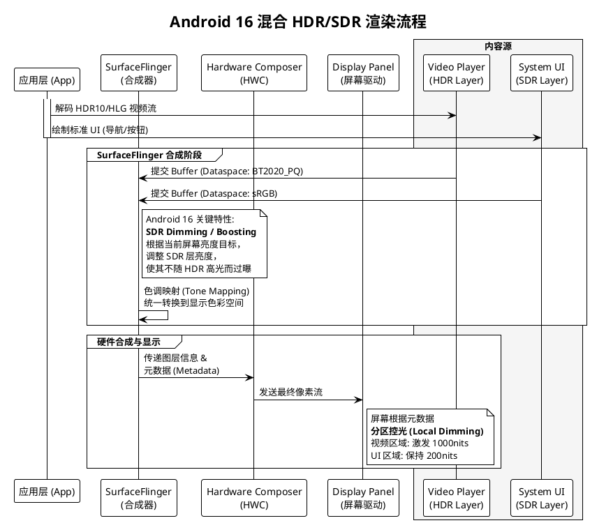

# 智能座舱大屏 HDR 体验与影响调研报告

**系统环境：** Android 16 (Automotive OS)
**核心议题：** 开启/关闭 HDR 对用户体验的全方位影响

## 1. 核心结论摘要

1.  **不仅仅是视频：** 开启 HDR **绝不仅仅**影响视频体验。它对**车载地图导航、ADAS 可视化、倒车影像（安全）、以及系统 UI 的整体质感**都有决定性影响。
2.  **Android 16 的关键作用：** Android 16 进一步完善了**SDR 调光（SDR Dimming）**和**混合内容渲染**机制。这意味着在开启 HDR 时，系统能更完美地处理"高亮视频"与"普通 UI 按钮"共存的画面，避免 UI 过亮刺眼或过暗看不清。
3.  **安全与舒适的双重博弈：** 开启 HDR 能在夜间提供极佳的"真黑"背景（防光污染），但在强光下对散热和功耗提出了更高要求。

---

## 2. 深度解析：开启 vs 关闭 HDR 的具体影响

### 2.1 是否只对视频有影响？（核心误区澄清）
**答案：否。** HDR 是一项系统级的显示能力，影响范围覆盖以下四大高频场景：

| 场景 | 关闭 HDR (SDR 模式) 的痛点 | 开启 HDR 的体验提升 |
| :--- | :--- | :--- |
| **地图导航** | 建筑模型和路面平淡无奇；夜间模式下，黑色背景不够深邃，导致车内即使在深夜也泛着灰光。 | 高对比度渲染让地图更具立体感；**夜间导航背景纯黑**，与车内暗环境融为一体，大幅降低驾驶视觉干扰。 |
| **倒车/环视影像** | **安全隐患：** 当车辆从暗处（地库）驶向亮处（出口）时，摄像头采集的高动态画面被压缩，导致"亮处过曝"或"暗处死黑"，看不清障碍物。 | 支持 HDR 的链路能完整还原摄像头采集的高动态画面，**同时看清**阴影里的柱子和阳光下的路人。 |
| **系统 UI 与壁纸** | 采用了 Android 16 的 Ultra HDR 图片格式作为壁纸时，只能以普通 SDR 显示，缺乏光泽感。 | 壁纸中的阳光、金属材质会有"发光"的真实质感；UI 的高光动效更细腻。 |
| **车载游戏** | 3A 大作（如《黑神话：悟空》云游戏版）画面灰暗，缺乏沉浸感。 | 能够呈现游戏引擎设计的光影效果，特别是火焰、魔法特效和深邃的阴影。 |

### 2.2 视觉体验对比

#### 开启 HDR (High Dynamic Range)
* **峰值亮度爆发：** 能够激发屏幕局部达到 1000 nits 以上亮度（需屏幕硬件支持），在正午阳光直射下，导航线条依然清晰可见。
* **色彩体积（Color Volume）：** 结合 10-bit 色深，色彩过渡没有断层（Banding），天空和水面的渲染更加平滑。
* **真实感：** 利用 PQ（Perceptual Quantizer）曲线，让画面亮部更亮，暗部更暗，符合人眼对真实世界的感知。

#### 关闭 HDR (SDR - Standard Dynamic Range)
* **亮度受限：** 全局亮度通常被限制在 400-600 nits，强光下可能看不清屏幕。
* **视觉"发灰"：** 尤其是在 OLED 或 Mini LED 屏幕上运行 SDR 内容，无法发挥屏幕"纯黑不发光"的特性，导致夜间屏幕像蒙了一层灰雾。

---

## 3. Android 16 的技术特性与系统影响

在 Android 16 中，Google 对 HDR 的处理逻辑进行了显著优化，主要体现在**混合内容管理**上。

### 3.1 混合内容渲染（Mixed SDR/HDR Composition）
这是 Android 16 最重要的改进点之一。
* **问题：** 以前的系统开启 HDR 后，为了配合视频的高亮，普通的白色文字 UI 可能会被暴力拉升亮度，导致晚上开车时，视频好看，但旁边的歌词栏亮得刺眼。
* **Android 16 解决方案：** 系统允许**SDR UI 保持舒适的低亮度**，同时让**HDR 视频窗口爆发高亮度**。这通过更精细的 Tone Mapping（色调映射）实现。

### 3.2 架构流程图（Android SurfaceFlinger 处理逻辑）

以下流程图展示了在 Android 16 中，当用户同时打开"HDR 电影"和"SDR 导航栏"时，系统是如何处理的：

---

## 4. 潜在风险与负面影响

虽然 HDR 体验极佳，但在车规环境下也存在挑战：

1. **功耗与热管理（Thermal Throttling）：**
* 开启 HDR 意味着屏幕背光（特别是 Mini LED）需要高频、高功率运作。这会显著增加座舱大屏的发热量。
* 在 Android 16 中，如果热传感器检测到温度过高，系统会强制**降级回 SDR 模式**或降低峰值亮度，这可能导致用户看到画面突然变暗。

2. **UI 适配成本：**
* 如果应用开发商（如第三方音乐 App）没有适配 Android 的 HDR 规范，可能会在 HDR 模式下出现颜色过饱和（"关公脸"）或颜色惨白的情况。

3. **烧屏风险（OLED 特有）：**
* 如果长时间以 HDR 高亮度显示静态的导航状态栏，OLED 屏幕的老化速度会加快。需要系统层面（Android 16 提供了相关 API）做像素位移或局部亮度限制保护。

## 5. 总结建议

**给产品定义的建议：**
在 Android 16 平台上，建议**默认开启 HDR**，但必须配合光线传感器实现策略控制：

* **白天：** 全局开启 HDR，利用高亮度对抗阳光直射。
* **夜间：** 开启 HDR，但限制 UI 图层的最大亮度（SDR Dimming），仅允许媒体内容和地图高亮路况使用高动态范围，确保驾驶员不被 UI 晃眼。
