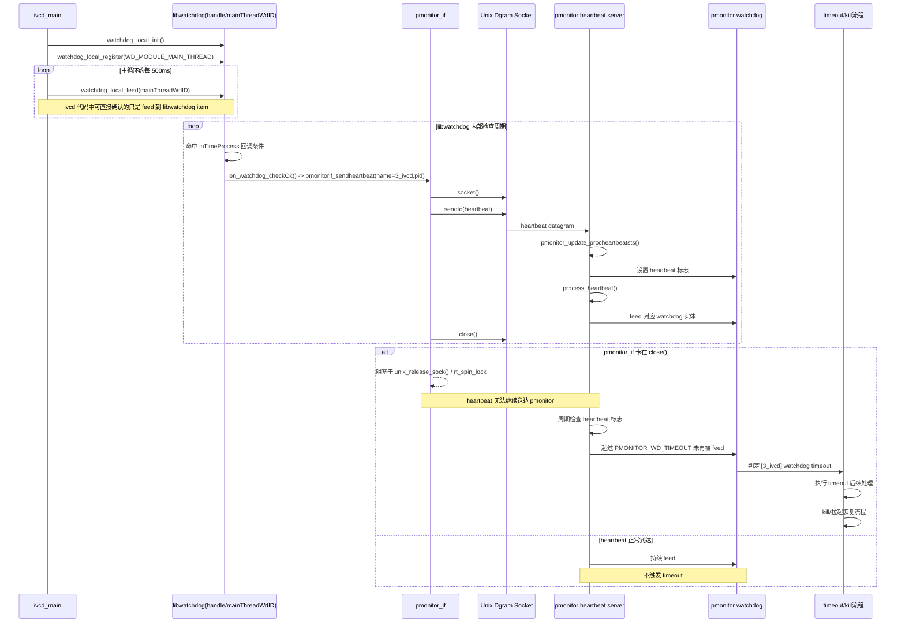
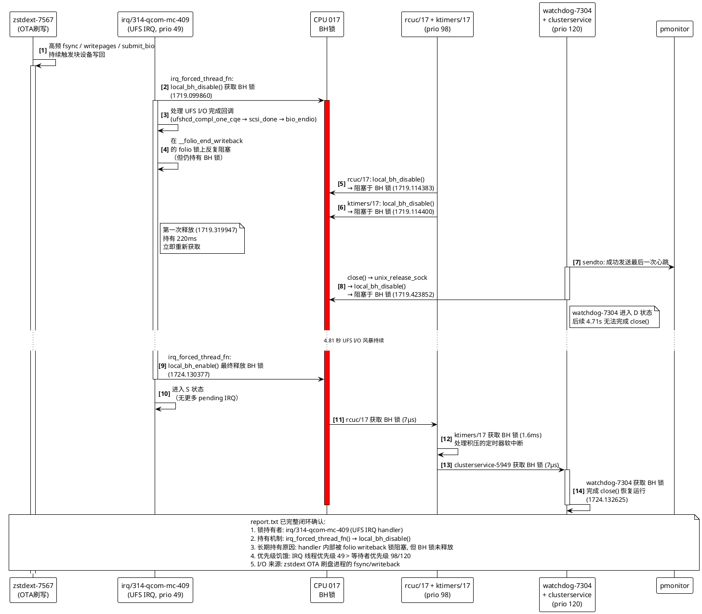

# ivcd / pmonitor watchdog 问题分析

## 结论摘要

根因已从 `report.txt` trace 数据中完整确认，包括锁持有者身份、持有时长、等待链和恢复链。完整因果链如下：

1. `pmonitorif_sendheartbeat()` 每次心跳执行 `socket() → sendto() → close()`。
2. 在 PREEMPT_RT 内核中，`close()` 路径中的 `unix_release_sock()` 会经过 `local_bh_disable()`，而该调用在 RT 化后会落到 per-CPU `rt_spin_lock` 竞争路径。
3. **`irq/314-qcom-mc-409`（UFS 存储控制器 IRQ 处理线程）** 在 `irq_forced_thread_fn()` 中通过 `local_bh_disable()` 获取 CPU 017 的 BH 锁后，在 UFS I/O 完成回调中被 folio writeback 锁阻塞，但仍持有 BH 锁。该线程实质上独占 CPU 017 BH 锁约 **5.03 秒**（1719.099860 → 1724.130377），中间仅有一次极短暂释放。
4. 在此期间，共 **6 个线程**（含 5 个 watchdog 线程）先后阻塞在 CPU 017 的同一把 BH 锁上。
5. `watchdog-7304`（ivcd 的 watchdog 线程）在 `1719.423852` 进入 D 状态，直到 `1724.132625` 才恢复，**阻塞 4.71 秒**。
6. 在此期间，ivcd 无法向 pmonitor 发送新的心跳包。
7. `pmonitor` 在最后一次收到 `3_ivcd` 心跳（tick `17194111`）后约 `3000.8ms` 报 `[3_ivcd] watchdog timeout`。
8. 由于多个 watchdog 线程同时受阻，`4_mcd`、`8_audiomgr` 也在同一 tick 报 timeout。

已从 trace 直接确认的事实：

- `ivcd_main` 主线程仍在执行 `watchdog_local_feed()`（本地 feed 没有停止）
- `pmonitor` 没有调度阻塞
- **`watchdog-7304` 已直接确认卡在 `close() → unix_release_sock() → __local_bh_disable_ip → rt_spin_lock`**
- **BH 锁持有者已确认为 `irq/314-qcom-mc-409`**，通过 `irq_forced_thread_fn() → local_bh_disable()` 获取锁，在处理 UFS I/O 完成回调时长期持有
- **完整的等待/唤醒链已全部从 trace 中闭环确认**

---

## 一、基础代码关系

### 1. ivcd 本地 watchdog

`ivcd` 主循环每次处理完消息后调用本地 feed，空闲时约每 `500ms` 一次。

相关代码：

- `../ivcd/src/ivcd_local.c`
- `../ivcd/inc/watchdog_wrap.h`

watchdog 超时窗口：

- `MODULE_WD_TIMEOUT = 1000ms`

### 2. ivcd 向 pmonitor 发 heartbeat 的方式

`ivcd` 的 watchdog 回调：

```c
static void on_watchdog_checkOk(void *context)
{
    pmonitorif_sendheartbeat(WD_MODULE_NAME, getpid());
}
```

这个回调不是由 `ivcd_main` 直接调用，而是在 `ivcd` 初始化本地 watchdog 时通过 `watchdog_initialize()` 注册给 `libwatchdog`。从当前 `ivcd` 代码能直接确认的调用链应理解为：

1. `ivcd` 调用 `watchdog_initialize()` 创建本地 watchdog handle，并注册 `on_watchdog_checkOk()` / `on_watchdog_timeout()`
2. `ivcd` 调用 `watchdog_register()` 注册 `mainThreadWdID`
3. `ivcd_main` 周期性执行 `watchdog_local_feed(mainThreadWdID)`
4. `libwatchdog` 在其内部机制中判定该 watchdog item 命中 `checkOk` 路径
5. 回调 `on_watchdog_checkOk()`
6. 回调内部调用 `pmonitorif_sendheartbeat()` 向 `pmonitor` 发心跳

相关文件：

- `../ivcd/src/watchdog_wrap.c`
- `../ivcd/src/ivcd_local.c`

`pmonitorif_sendheartbeat()` 的实现是：

1. `socket(AF_UNIX, SOCK_DGRAM, 0)`
2. `sendto(...)`
3. `close(sockfd)`

相关文件：

- `../pmonitor/src/pmonitor_if.c`

这意味着每次 heartbeat 都会走一次完整的 Unix datagram socket 创建、发送、关闭流程。**`close()` 是本次问题的触发点。**

### 3. pmonitor 如何判定超时

`pmonitor` 维护自己的 watchdog；收到 heartbeat 后，仅设置该实体的 heartbeat 标志。之后由 `process_heartbeat()` 在主周期中真正 `feed` 该 watchdog 实体。

相关文件：

- `../pmonitor/src/pmonitor_main.c`
- `../pmonitor/src/pmonitor_heartbeatserver.c`

关键参数：

- `PMONITOR_WD_TIMEOUT = 2100ms`

### 4. 心跳机制时序

下面这条时序描述的是**正常情况下** ivcd 本地 feed、发送 heartbeat、pmonitor 更新 watchdog 状态，以及**异常情况下** heartbeat 长时间不到达后触发 timeout/kill 的完整流程：



时序要点：

- `ivcd_main` 的 `watchdog_local_feed()` 只是说明主线程本地 watchdog 仍在按节奏喂狗，并不等价于 `pmonitor` 已收到 heartbeat。
- 真正让 `pmonitor` 侧 watchdog 保活的是 `libwatchdog` 回调 `on_watchdog_checkOk()` 后触发的 `pmonitorif_sendheartbeat()`。
- `pmonitor` 收到 heartbeat 后并不是立即 timeout 清零，而是先更新 heartbeat 状态，再由 `process_heartbeat()` 在主周期里 `feed` 对应实体。
- 一旦 `on_watchdog_checkOk()` 回调路径中的 `pmonitorif_sendheartbeat()` 卡在 `close()`，后续 heartbeat 无法送达，`pmonitor` 在约 `PMONITOR_WD_TIMEOUT` 窗口后就会判定超时，并进入 kill/恢复流程。

---

## 二、DLT 日志侧结论

### 1. 不能用 wall time 判断阻塞，应优先信 ticks

在这批 DLT 日志中：

- 第 4 列 ticks 连续且节奏稳定
- `2025/01/01 08:28:xx.xxx` 形式的 wall time 与 ticks 多处明显不一致

例如：

- `3709` tick=`17210278`
- `3731` tick=`17215278`
- 差值正好 `5000 ticks`，约 `500ms`

但 wall time 却显示相差约 `3.09s`。

因此：

- 分析 watchdog/feed/timeout 时，应以 ticks 为准
- 不能再用 wall time 直接判断 `ivcd` 或 `pmonitor` 是否卡了 2~3 秒

### 2. ivcd local feed 节奏

提取出的 `watchdog_local_feed start` tick 序列：

- `17149915`
- `17153125`
- `17154421`
- `17159423`
- `17159916`
- `17164461`
- `17169462`
- `17169918`
- `17174502`
- `17179503`
- `17179921`
- `17184539`
- `17189540`
- `17189922`
- `17194923`
- `17210277`
- `17210277`
- `17210278`
- `17215279`

观察：

- 大多数间隔是约 `40ms`、`50ms`、`450ms`、`500ms`
- `watchdog_local_feed` 自身运行时间仅 `5us ~ 50us`
- 说明 feed 调用本身没有慢调用问题

唯一值得特别注意的 gap：

- `17194923 -> 17210277 = 15354 ticks ≈ 1535.4ms`

这说明主线程 feed 节奏有一次明显拉长，但单独靠这一点还不足以解释为什么 `pmonitor` 最终连续约 `3s` 没再收到 heartbeat。

### 3. pmonitor_update_procheartbeatsts 节奏

`pmonitor_update_procheartbeatsts name=3_ivcd` 的 ticks：

- `17154062`
- `17164064`
- `17174075`
- `17184138`
- `17194111`

相邻间隔：

- `10002 ticks ≈ 1000.2ms`
- `10011 ticks ≈ 1001.1ms`
- `10063 ticks ≈ 1006.3ms`
- `9973 ticks ≈ 997.3ms`

说明在最后一次之前，`pmonitor` 基本每 `1s` 都能看到 `3_ivcd` 的 heartbeat 生效。

### 4. timeout 与最后一次 update 的间隔

最后一次 `pmonitor_update_procheartbeatsts`：

- tick=`17194111`

`pmonitor` 打印 `[3_ivcd] watchdog timeout`：

- tick=`17224119`

差值：

- `17224119 - 17194111 = 30008 ticks ≈ 3000.8ms`

这与 `pmonitor` 最终超时完全一致。

---

## 三、trace 侧结论：pmonitor 没有明显阻塞

在 `1719s ~ 1722s` 的 trace 内，观察到：

- `pmonitor_main-4402`
- `pmonitor-4418`
- `pmon_sysmgrif-4420`

它们都持续被正常调度。

### 1. pmonitor_main

`pmonitor_main-4402` 在该窗口内共上 CPU 9 次：

- 单次运行仅 `7us ~ 70us`
- `sched_wakeup -> sched_switch in` 延迟仅 `2us ~ 44us`
- 切出状态主要为 `S`

说明：

- 它大部分时间只是主动睡眠等待事件
- 不存在明显"被唤醒后长期上不了 CPU"或"卡在 CPU 上不下来"的现象

### 2. pmon_sysmgrif

`pmon_sysmgrif-4420`：

- 1719~1722 秒内共运行 304 次
- 启动间隔稳定在约 `10.07ms`
- 最大启动间隔约 `10.273ms`

说明：

- 这个辅助线程在整个问题窗口内仍然非常规律地运行

### 3. 对 timeout 的意义

所以：

- `pmonitor` timeout 不是由于 `pmonitor` 自己出现调度阻塞
- 根因在上游：心跳发送端的 watchdog 线程被阻塞

---

## 四、watchdog-7304：根因确认

### 1. 它是 ivcd 的 watchdog 线程

依据如下：

1. `7304` 的 tid 紧邻 `ivcd` 线程组：
   - `ivcd_main=7300`
   - `watchdog=7304`
   - `ivcd_sysmgrif=7305`
   - `socket_task=7306`

2. 它的行为特征与 `ivcd watchdog -> pmonitor heartbeat` 完全吻合：
   - 被 `ktimers` 唤醒
   - 执行一次 Unix datagram `sendto`
   - 唤醒 `pmonitor`

3. 在当前窗口里，它唯一的明确外部动作就是唤醒 `pmonitor:4418`

### 2. 正常周期行为（1718.422s，对比基线）

在问题发生前一个周期（1718 秒），`watchdog-7304` 正常运行：

```text
1718.422649  ktimers/17 唤醒 watchdog-7304
1718.422656  watchdog-7304 上 CPU
1718.422739  watchdog-7304 sched_waking pmonitor:4418    ← sendto() 唤醒 pmonitor
1718.422744  watchdog-7304 sched_wakeup pmonitor:4418
1718.422785  watchdog:7304 [120] S ==> swapper/13       ← 正常切出，状态 S
```

此周期 `close()` 正常完成，无阻塞。

### 3. 问题发生时刻（1719.423s）

```text
1719.423782  ktimers/13 唤醒 watchdog-7304
1719.423784  watchdog-7304 上 CPU (CPU 017)
1719.423841  watchdog-7304 sched_waking pmonitor:4418    ← sendto() 成功，唤醒 pmonitor
1719.423845  watchdog-7304 sched_wakeup pmonitor:4418
1719.423852  watchdog:7304 [120] D ==> swapper/17       ← ⚠️ D 状态！卡在 close()
```

**注意切出状态是 `D`（不可中断睡眠），不是 `S`。**

### 4. 完整内核栈（确认阻塞在 close → unix_release_sock → rt_spin_lock）

`report.txt` 第 590363301-590363320 行：

```text
watchdog-7304  [017]  1719.423852: sched_switch: watchdog:7304 [120] D ==> swapper/17:0 [120]
kernel_stack:
=> __schedule
=> schedule_rtlock                  ← PREEMPT_RT sleeping lock 等待
=> rtlock_slowlock_locked           ← rt_spin_lock 慢路径
=> rt_spin_lock
=> __local_bh_disable_ip            ← local_bh_disable() 被转换为 rt_spin_lock
=> unix_release_sock                ← Unix socket 关闭
=> unix_release
=> __sock_release
=> sock_close
=> __fput
=> __fput_sync
=> __arm64_sys_close                ← close() 系统调用
=> invoke_syscall
=> el0_svc_common.constprop.0
=> do_el0_svc
=> el0_svc
=> el0t_64_sync_handler
=> el0t_64_sync
```

这就是 `pmonitorif_sendheartbeat()` 中 `close(sockfd)` 的执行路径：

```c
sockfd = socket(AF_UNIX, SOCK_DGRAM, 0);
sendto(sockfd, &msg, sizeof(msg), 0, (struct sockaddr*)&addr, len);
close(sockfd);  // ← 卡在这里
```

在 PREEMPT_RT 内核中，`unix_release_sock()` 调用 `local_bh_disable()` 来禁止软中断。但 PREEMPT_RT 将 `local_bh_disable()` 转换为获取 per-CPU BH 锁（`rt_spin_lock`）。此时 CPU 017 的 BH 锁被 `irq/314-qcom-mc-409`（UFS IRQ 处理线程）长期持有，watchdog-7304 在此阻塞 4.71 秒。

### 5. 阻塞时长确认

| 事件 | 时间点 | 来源 |
|---|---|---|
| 进入 D 状态 | `1719.423852` | `report.txt:590363301` |
| 恢复运行 | `1724.132573` | `report.txt:596979539` |
| **阻塞时长** | **4.709 秒** | |

在整个 `1719.42 ~ 1724.13` 期间，`watchdog-7304` 完全没有运行记录。

### 6. 恢复后的行为

`watchdog-7304` 在 `1724.132573` 被 `clusterservice-5949` 唤醒后恢复：

```text
1724.132573  clusterservice-5949 唤醒 watchdog:7304
1724.132620  watchdog:7304 上 CPU
1724.132625  watchdog-7304 sched_waking clusterservice:5897
1724.132666  watchdog:7304 [120] S ==> dds.shm.7419     ← 恢复正常，状态 S
```

之后在 `1725s`、`1726s` 又能看到正常的周期性心跳行为，确认线程恢复正常。

---

## 五、系统性问题：5 个 watchdog 线程同时阻塞

这不是 `watchdog-7304` 的孤立事件。在 `1719.42 ~ 1720.05` 期间，共有 **5 个 watchdog 线程**卡在完全相同的内核路径：

| watchdog 线程 | 进入 D 状态 | 阻塞 CPU | 恢复时间 | 阻塞时长 | 内核栈 |
|---|---|---|---|---|---|
| **watchdog-7304** | 1719.423852 | **CPU 017** | 1724.132573 | **4.71s** | `close→unix_release_sock→rt_spin_lock` |
| watchdog-4405 | 1719.557821 | CPU 004 | 1721.040323 | 1.48s | 同上 |
| watchdog-4391 | 1719.669389 | **CPU 017** | 1724.132745 | **4.46s** | 同上 |
| watchdog-2164 | 1719.804040 | **CPU 017** | 1724.133066 | **4.33s** | 同上 |
| watchdog-7249 | 1720.050012 | CPU 004 | 1721.040395 | 0.99s | 同上 |

所有 5 个线程的内核栈完全相同：

```text
__schedule → schedule_rtlock → rtlock_slowlock_locked → rt_spin_lock
→ __local_bh_disable_ip → unix_release_sock → unix_release → __sock_release
→ sock_close → __fput → __fput_sync → __arm64_sys_close
```

关键观察：

- **CPU 017** 上的 3 个线程（7304、4391、2164）阻塞 **4.3~4.7 秒**
- **CPU 004** 上的 2 个线程（4405、7249）阻塞 **0.99~1.48 秒**
- CPU 017 的 BH 锁持有时间远大于 CPU 004
- 这完全符合 PREEMPT_RT per-CPU BH 锁竞争的特征：不同 CPU 的锁是独立的，竞争程度取决于各 CPU 上软中断处理的负载

由于多个进程的 watchdog 线程同时被阻塞，它们都无法向 pmonitor 发送心跳。这解释了为什么 `3_ivcd`、`4_mcd`、`8_audiomgr` 在同一 tick 报 timeout。

---

## 六、把 DLT 与 trace 对齐后的时间轴

下面按 tick 时间组织关键事件（ticks / 10000 ≈ trace 时间）：

| tick | trace 时间 | 事件 | 说明 |
|---:|---:|---|---|
| 17154062 | ~1715.41 | `pmonitor_update #1` | `3_ivcd` heartbeat 正常 |
| 17164064 | ~1716.41 | `pmonitor_update #2` | 正常 |
| 17174075 | ~1717.41 | `pmonitor_update #3` | 正常 |
| 17184138 | ~1718.41 | `pmonitor_update #4` | 正常 |
| 17189922 | ~1718.99 | `ivcd_main feed` | 主线程仍在 feed |
| 17194111 | ~1719.41 | `pmonitor_update #5` | **最后一次 `3_ivcd` heartbeat** |
| ~17194238 | 1719.4238 | `watchdog-7304` sendto() | 心跳包发送成功，唤醒 pmonitor |
| ~17194239 | 1719.4239 | `watchdog-7304` close() | **进入 D 状态，卡在 `rt_spin_lock`** |
| ~17195578 | 1719.5578 | `watchdog-4405` close() | 同样进入 D 状态 |
| ~17196694 | 1719.6694 | `watchdog-4391` close() | 同样进入 D 状态 |
| ~17198040 | 1719.8040 | `watchdog-2164` close() | 同样进入 D 状态 |
| ~17200500 | 1720.0500 | `watchdog-7249` close() | 同样进入 D 状态 |
| 17194923 | ~1719.49 | `ivcd_main feed` | 主线程仍继续 feed（但 watchdog 线程已卡住，无法发心跳） |
| 17210277 | ~1721.03 | `ivcd_main feed` | 主线程仍继续 feed |
| 17215279 | ~1721.53 | `ivcd_main feed` | 主线程仍继续 feed |
| 17224119 | ~1722.41 | `[3_ivcd] watchdog timeout` | 距最后一次 `pmonitor_update` 约 `3000.8ms` |
| 17224119 | ~1722.41 | `[4_mcd] watchdog timeout` | 同一 tick |
| 17224119 | ~1722.41 | `[8_audiomgr] watchdog timeout` | 同一 tick |
| ~17241326 | 1724.1326 | `watchdog-7304` 恢复 | D 状态结束，开始正常运行 |

---

## 七、根因分析

### 直接原因

`watchdog-7304`（ivcd 的 watchdog 线程）在执行 `pmonitorif_sendheartbeat()` 的 `close(sockfd)` 时，卡在 `unix_release_sock() → __local_bh_disable_ip() → rt_spin_lock` 上，进入 D 状态 4.71 秒。在此期间无法向 pmonitor 发送新的心跳包。

### 根本原因（已从 trace 完整确认）

**CPU 017 的 per-CPU BH 锁被 `irq/314-qcom-mc-409`（UFS 存储控制器 IRQ 处理线程）独占约 5.03 秒**（1719.099860 → 1724.130377）。

`irq_forced_thread_fn()` 函数在 RT 和非 RT 内核中都用 `local_bh_disable()/enable()` 包裹 IRQ handler 的执行（`kernel/irq/manage.c:1188-1205`）：

```c
static irqreturn_t irq_forced_thread_fn(...)
{
    local_bh_disable();                      // RT 和非 RT 都调用
    if (!IS_ENABLED(CONFIG_PREEMPT_RT))
        local_irq_disable();                 // 仅非 RT：关硬中断，handler 原子执行
    ret = action->thread_fn();               // 执行 IRQ handler（本例为 ufs_qcom_mcq_esi_handler）
    if (!IS_ENABLED(CONFIG_PREEMPT_RT))
        local_irq_enable();
    local_bh_enable();
    return ret;
}
```

关键区别：在非 RT 内核中，`local_bh_disable()` 仅递增 per-CPU 计数器（不涉及锁），且额外调用 `local_irq_disable()` 使 handler 不可抢占地原子执行。在 PREEMPT_RT 内核中，`local_bh_disable()` 获取 per-CPU sleeping lock（`rt_spin_lock`），且**不调用 `local_irq_disable()`**，handler 可以被抢占和睡眠。详见第十节第 6 小节的完整分析。

`irq/314-qcom-mc-409` 的 IRQ handler 处理 UFS I/O 完成回调，调用链为：

```text
ufs_qcom_mcq_esi_handler → ufshcd_mcq_poll_cqe_lock → ufshcd_compl_one_cqe
→ scsi_done → blk_mq_complete_request → scsi_complete → scsi_finish_command
→ scsi_io_completion → scsi_end_request → blk_update_request → bio_endio
→ end_bio_bh_io_sync → end_buffer_async_write → folio_end_writeback
→ __folio_end_writeback → rt_spin_lock  ← 在此被 folio writeback 锁阻塞
```

关键问题：**在等待 folio writeback 锁期间，BH 锁仍然被持有**（因为 `local_bh_disable()` 在 handler 执行前就已经调用）。

由于 `irq/314-qcom-mc-409` 的调度优先级为 49（高于 rcuc/17 的 98 和 watchdog 的 120），每次短暂释放 BH 锁后能立即重新获取，造成低优先级等待者的长期饥饿。具体时间线：

| 事件 | 时间 | 持续时长 |
|---|---|---|
| **第一次获取** BH 锁 | 1719.099860 | |
| 第一次释放 BH 锁 | 1719.319947 | **持有 220ms** |
| **第二次获取** BH 锁（新的 IRQ handler 迭代） | ~1719.319950 | |
| 第二次释放 BH 锁（最终释放，进入 S 状态） | 1724.130377 | **持有 4.81 秒** |
| irq/314-qcom-mc-409 进入 S 状态（不再有 pending IRQ） | 1724.130522 | |

**总饥饿时间 ≈ 5.03 秒**。

### 触发条件

1. `zstdext-7567` 进程（OTA 压缩刷盘）持续执行 `fsync → writepages → block_write_full_page → submit_bio`，向 UFS 存储设备写入大量数据
2. 大量 I/O 完成回调涌入 `irq/314-qcom-mc-409` 线程处理
3. `irq_forced_thread_fn()` 在每次 handler 调用前获取 BH 锁，handler 内部又被 folio writeback 锁阻塞
4. `pmonitorif_sendheartbeat()` 的 `close()` 每次心跳都走 `unix_release_sock() → local_bh_disable()` 路径，必须获取同一把 BH 锁

### 多进程同时超时的原因

所有使用 `pmonitorif_sendheartbeat()` 发送心跳的进程（`ivcd`、`mcd`、`audiomgr` 等）的 watchdog 线程都走相同的 `socket() → sendto() → close()` 路径。当它们的 `close()` 恰好在 BH 锁被 IRQ 处理线程长期持有的 CPU 上执行时，会同时阻塞。

---

## 八、补充判断：wall time 异常

当前证据还表明：

- 这批 DLT 日志的 wall time 与 ticks 存在明显错位
- 不能拿 wall time 直接判断线程是否阻塞

可能原因包括：

- DLT 时间源与 trace/ticks 时间源不同
- 系统存在 PTP/802.1AS 时间同步活动

已知 `qgptp_monitor` 在问题窗口内高频运行，但目前没有在现有 trace 切片中直接抓到 `clock_settime/adjtimex` 等硬证据，因此它目前只能算"wall time 漂移的嫌疑点"，不是本次 watchdog timeout 的直接根因。

---

## 九、修复建议

### 1. 短期规避

短期目标不是一次性消除所有底层 RT 锁竞争，而是先避免 `watchdog / pmonitor` 路径继续成为最脆弱的受害者。

#### 1.1 复用 heartbeat socket（优先级最高）

修改 `pmonitorif_sendheartbeat()` 的 socket 生命周期，避免每次心跳都走 `close() → unix_release_sock()` 路径：

```c
// 当前实现（每次 close 都可能卡在 rt_spin_lock）:
int32_t pmonitorif_sendheartbeat(const char *pname, int32_t pid)
{
    int32_t sockfd = socket(AF_UNIX, SOCK_DGRAM, 0);
    sendto(sockfd, &msg, sizeof(msg), 0, ...);
    close(sockfd);  // ← 每次都走 unix_release_sock() → local_bh_disable()
    return 0;
}

// 建议修改（初始化时创建，复用 socket）:
static int32_t g_heartbeat_sockfd = -1;

int32_t pmonitorif_sendheartbeat(const char *pname, int32_t pid)
{
    if (g_heartbeat_sockfd < 0) {
        g_heartbeat_sockfd = socket(AF_UNIX, SOCK_DGRAM, 0);
        if (g_heartbeat_sockfd < 0) {
            return -1;
        }
    }
    sendto(g_heartbeat_sockfd, &msg, sizeof(msg), 0, ...);
    // 不 close，进程退出时再统一关闭
    return 0;
}
```

这样每次心跳只做 `sendto()`，可以直接避开 `close() → unix_release_sock() → local_bh_disable() → rt_spin_lock` 这条已被 `report.txt` 直接确认的上层高风险路径。

这是当前最直接、风险最低、最有希望立刻降低误报 timeout 的规避措施。

#### 1.2 降低 OTA 刷盘与 heartbeat 超时的直接耦合

根因已确认：`irq/314-qcom-mc-409` 在处理 `zstdext` OTA 刷盘的 I/O 完成回调时独占 BH 锁约 5 秒。因此短期还应同步考虑：

- OTA 刷盘期间临时放宽 heartbeat / watchdog 超时门限
- OTA 刷盘期间降低 `fsync` 频率或做批量提交，避免高频 `writepages / submit_bio`
- 尽量避免在 OTA 重 IO 窗口内叠加大量高频 IPC / Unix socket 生命周期操作

### 2. 中期优化

中期目标是降低系统在 OTA 重 IO 压力下进入长等待链的概率，而不只是绕开单点 `close()`。

#### 2.1 优化 OTA 刷盘策略

建议围绕 `zstdext` 或等价 OTA 写盘路径做以下优化：

- 减少小块高频 `fsync`
- 尽量将写入改成批量落盘，降低 `writeback completion` 压力
- 评估是否可以在更大事务边界上执行 `fsync`
- 检查是否存在不必要的同步写、重复 `file_write_and_wait_range`、过密 `blkdev_fsync`

#### 2.2 将关键心跳路径与重 IO 窗口解耦

即使底层 UFS / writeback 尚未完全修复，也应降低 `watchdog` 对重 IO 窗口的敏感性：

- heartbeat 发送线程尽量避免承担额外文件、socket 清理等重路径
- heartbeat 发送逻辑避免和 OTA 刷盘共享高风险同步点
- 对关键 watchdog 线程评估更稳妥的超时策略与恢复策略

### 3. 内核层修改方案（基于社区 patch 和源码分析）

根因已确认：`irq/314-qcom-mc-409` 在 `irq_forced_thread_fn()` 中持有 BH 锁期间被 folio writeback 锁阻塞。Linux 内核社区已有多个直接相关的讨论和 patch，下面结合社区方案和本项目实际情况，给出具体的内核层修改方案。

#### 3.1 方案 A：将 UFS MCQ IRQ 改为原生线程化（推荐，改动最小）

**社区先例**：hisi_sas 驱动已将 SCSI HBA 的 Completion Queue 中断从 `devm_request_irq()` + tasklet 改为 `devm_request_threaded_irq()` + `IRQF_ONESHOT`（[scsi: hisi_sas: use threaded irq to process CQ interrupts](https://lore.kernel.org/lkml/1579522957-4393-2-git-send-email-john.garry@huawei.com/)，John Garry @ Huawei，2020，已合入主线）。

**核心思路**：让 `irq_thread()` 走 `irq_thread_fn` 路径（**无 BH 锁包裹**），而非 `irq_forced_thread_fn`。

从 `kernel/irq/manage.c:1370-1407` 的 `irq_setup_forced_threading()` 源码可知：

```c
/* No further action required for interrupts which are requested as
 * threaded interrupts already */
if (new->handler == irq_default_primary_handler)
    return 0;  // ← 已是原生线程化的 IRQ，不设置 IRQTF_FORCED_THREAD
```

如果用 `request_threaded_irq(irq, NULL, thread_fn, ...)` 注册，handler 会被设为 `irq_default_primary_handler`，`irq_setup_forced_threading` 直接 return，不会设置 `IRQTF_FORCED_THREAD`，运行时走 `irq_thread_fn`（无 BH 锁）。

修改 `drivers/ufs/host/ufs-qcom.c`（当前注册方式在第 2144 行附近）：

```diff
-		ret = devm_request_irq(hba->dev, desc->irq,
-				       ufs_qcom_mcq_esi_handler,
-				       IRQF_SHARED, "qcom-mcq-esi", desc);
+		ret = devm_request_threaded_irq(hba->dev, desc->irq,
+						NULL,
+						ufs_qcom_mcq_esi_handler,
+						IRQF_SHARED | IRQF_ONESHOT,
+						"qcom-mcq-esi", desc);
```

**为什么可行**：

- 在当前 PREEMPT_RT 配置下，handler **已经在线程上下文中运行**，不是真正的 hardirq
- RT 内核中 `local_bh_disable()` 只是获取 sleeping lock，不是真正禁止 softirq。handler 内的代码实际上已经没有依赖真正的 BH 禁止语义
- `ufshcd_mcq_poll_cqe_lock()` 自身用 `spin_lock_irqsave(&hwq->cq_lock)` 保护，不依赖外层 BH 禁止来保证正确性
- `IRQF_ONESHOT` 确保 handler 完成前不会重入

**风险点**：

- 需要审计 `scsi_done → blk_mq_complete_request → ... → bio_endio` 完成链中是否有代码依赖 `in_softirq()` 判断来选择不同路径。如果有，行为可能改变
- 非 RT 内核上也会生效（handler 不再在 hardirq 上下文运行），需要确认非 RT 场景下也能正常工作

#### 3.2 方案 B：在 CQE 处理循环中增加批量限制

**背景**：`ufshcd_mcq_poll_cqe_lock()`（`drivers/ufs/core/ufs-mcq.c:305-325`）在一个 `while` 循环中一次性处理**所有** pending CQE，持有 `cq_lock` 全程不释放：

```c
spin_lock_irqsave(&hwq->cq_lock, flags);
ufshcd_mcq_update_cq_tail_slot(hwq);
while (!ufshcd_mcq_is_cq_empty(hwq)) {     // ← 处理所有 pending CQE
    ufshcd_mcq_process_cqe(hba, hwq);       // ← 每个 CQE 触发完整的 scsi_done → bio_endio 链
    ufshcd_mcq_inc_cq_head_slot(hwq);
    completed_reqs++;
}
```

修改为批量处理后提前返回，让 `irq_forced_thread_fn` 有机会释放并重新获取 BH 锁：

```diff
+#define MCQ_CQE_BATCH_LIMIT  8
+
 unsigned long ufshcd_mcq_poll_cqe_lock(struct ufs_hba *hba,
                                        struct ufs_hw_queue *hwq)
 {
     unsigned long completed_reqs = 0;
     unsigned long flags;

     spin_lock_irqsave(&hwq->cq_lock, flags);
     ufshcd_mcq_update_cq_tail_slot(hwq);
     while (!ufshcd_mcq_is_cq_empty(hwq)) {
         ufshcd_mcq_process_cqe(hba, hwq);
         ufshcd_mcq_inc_cq_head_slot(hwq);
         completed_reqs++;
+
+        if (completed_reqs >= MCQ_CQE_BATCH_LIMIT) {
+            /* 还有未处理的 CQE，先更新 head 并返回。
+             * 未处理的 CQE 会在下一次 ESI 中断触发时继续处理。 */
+            break;
+        }
     }

     if (completed_reqs)
         ufshcd_mcq_update_cq_head(hwq);
     spin_unlock_irqrestore(&hwq->cq_lock, flags);

     return completed_reqs;
 }
```

**局限性**：需要确保未处理的 CQE 能重新触发 ESI 中断。handler 入口的 `ufshcd_mcq_write_cqis(hba, 0x1, id)` 清除中断状态后，如果 CQ 中仍有 pending entry，硬件应会重新触发。需要验证具体硬件行为。

#### 3.3 方案 C：RT 下跳过 `irq_forced_thread_fn` 的 BH 锁

**社区 RFC Patch**：[[RFC PATCH] genirq: don't disable BH for PREEMPT_RT](https://lore.kernel.org/linux-kernel/20240415112800.314649-1-vladimir.kondratiev@mobileye.com/T/)（Vladimir Kondratiev @ Mobileye，2024-04-15）

**问题描述与本案完全一致**：IRQ 线程调用 `local_bh_disable()` 获取 `softirq_ctrl.lock`，该锁可能被其他线程持有，引入数百微秒到秒级的延迟，无法满足实时要求。

**Patch 内容**（修改 `kernel/irq/manage.c`）：

```diff
-    local_bh_disable();
-    if (!IS_ENABLED(CONFIG_PREEMPT_RT))
+    if (!IS_ENABLED(CONFIG_PREEMPT_RT)) {
+        local_bh_disable();
         local_irq_disable();
+    }
     ret = action->thread_fn(action->irq, action->dev_id);
     if (ret == IRQ_HANDLED)
         atomic_inc(&desc->threads_handled);
     irq_finalize_oneshot(desc, action);
-    if (!IS_ENABLED(CONFIG_PREEMPT_RT))
+    if (!IS_ENABLED(CONFIG_PREEMPT_RT)) {
         local_irq_enable();
-    local_bh_enable();
+        local_bh_enable();
+    }
     return ret;
```

**Review 状态**：Crystal Wood 回复了两个顾虑：

1. 去掉 `local_bh_disable` 后，handler 中 raise 的 softirq 不会在 `local_bh_enable()` 中立即执行，而是需要唤醒 `ksoftirqd`，可能影响 softirq 执行时机
2. `in_interrupt()` / `in_softirq()` 在 handler 内部不再返回 true，可能影响依赖这些判断的代码路径

**Thomas Gleixner / Sebastian Siewior 未回复，patch 未被合入。** 影响面较大（作用于所有 forced-threaded IRQ），需要全面验证。

#### 3.4 社区根本性解决方向：nested-BH locking — 消除 per-CPU BH 大锁

**核心问题**：`local_bh_disable()` 在 PREEMPT_RT 下充当 **per-CPU 大锁（BKL）**，任何需要 BH 禁止的代码路径都竞争同一把锁，导致不相关的子系统互相阻塞。本案中 UFS IRQ handler（存储 I/O 完成）和 Unix socket `close()`（IPC 心跳）竞争同一把 per-CPU BH 锁就是典型体现。

**解决方案**：Sebastian Siewior（Linutronix）提出的 nested-BH locking 系列 patch，引入 `local_lock_nested_bh()` / `local_unlock_nested_bh()`，将保护粒度从"整个 CPU 的 BH"细化到"具体的 per-CPU 数据结构"：

- 非 RT 内核：编译优化掉，零开销
- RT 内核：获取**专属的 per-CPU lock**，而不是共享的 BH 大锁

相关链接：

- Patch 系列：[[PATCH net-next 00/24] locking: Introduce nested-BH locking](https://lore.kernel.org/netdev/20231215171020.687342-25-bigeasy@linutronix.de/T/)
- LWN 分析文章：[Nested bottom-half locking for realtime kernels](https://lwn.net/Articles/978189/)（2024-06-17）
- 基础设施 commit：[`c5bcab755822`](https://git.zx2c4.com/wireguard-linux/commit/include/linux/local_lock_internal.h?id=c5bcab7558220bbad8bd4863576afd1b340ce29f)（Sebastian Siewior，2024-06-24 合入主线，committer: Jakub Kicinski）

**合入状态**：基础设施已于 **v6.10 合入主线**。网络子系统（NAPI、TCP、bridge 等）的转换已跟进合入。存储/块设备子系统的转换仍在进行中。

**长远目标**：当所有依赖 `local_bh_disable()` 的代码路径都转换为 `local_lock_nested_bh()` 后，PREEMPT_RT 下的 `local_bh_disable()` per-CPU 大锁可以被移除，`irq_forced_thread_fn` 中的 BH 锁问题将自然消失。

#### 3.5 其他社区参考：i40e forced-threaded handler 崩溃

[[RT] Question about i40e threaded irq](https://lore.kernel.org/lkml/875yzphfv8.ffs@nanos.tec.linutronix.de/T/)（Thomas Gleixner，2021）

i40e 网卡驱动在 PREEMPT_RT 下因 `irq_forced_thread_fn` 的语义变化导致 list corruption 崩溃。Thomas Gleixner 的分析确认：**forced-threaded handler 不关硬中断、spinlock 不关中断**，原本假设 hardirq 上下文的代码全部失效。最终解决方案不是修改单个驱动，而是在网络核心层让 `__napi_schedule_irqoff()` 在 RT 下自动回退到 `__napi_schedule()`（已合入主线）。

这进一步证实：PREEMPT_RT 下 forced-threaded handler 的语义与 hardirq 上下文存在根本性差异，驱动层面的适配是必要的。

#### 3.6 方案对比

| | 方案 A：UFS 原生线程化 | 方案 B：CQE 批量限制 | 方案 C：RT 跳过 BH 锁 | nested-BH（社区长期方向） |
|---|---|---|---|---|
| 修改文件 | `ufs-qcom.c` 1 处 | `ufs-mcq.c` ~10 行 | `manage.c` ~6 行 | 全子系统逐步转换 |
| 彻底程度 | **彻底**：完全绕过 BH 锁 | 部分：缩短单次持有时间 | **彻底**：所有 forced-threaded IRQ 不再持有 BH 锁 | **彻底**：消除 BH 大锁 |
| 社区先例 | hisi_sas（已合入） | 无直接先例 | RFC，未合入 | 基础设施已合入 v6.10+ |
| 风险 | 需审计完成链 BH 上下文依赖 | 需确认硬件重触发 ESI | 影响所有 forced-threaded IRQ，review 有顾虑 | 需等待存储子系统转换完成 |
| 推荐场景 | **首选**，改动最小，先例充分 | 方案 A 不可行时的保守选择 | 希望全局解决时 | 跟踪上游进展 |

**推荐优先尝试方案 A**，因为改动量最小、有 hisi_sas 先例、从根本上消除 BH 锁持有问题。同时跟踪社区 nested-BH 系列在存储/块设备子系统的转换进度。

### 4. UFS / writeback 层面优化

- 减少 `zstdext` OTA 刷盘时的 `fsync` 频率，降低 UFS IRQ handler 的 I/O 完成负载
- 评估是否可在更大事务边界上执行 `fsync`，改为批量落盘
- 检查是否存在不必要的同步写、重复 `file_write_and_wait_range`、过密 `blkdev_fsync`

### 5. 系统层面

- 考虑对关键 watchdog 线程使用更高的调度优先级
- OTA 刷盘期间临时放宽 heartbeat / watchdog 超时门限


## 十、BH 锁持有者完整分析

### 1. 锁持有者确认

**CPU 017 BH 锁的持有者是 `irq/314-qcom-mc-409`**（Qualcomm UFS 存储控制器 IRQ 处理线程，调度优先级 49）。

该线程通过 `irq_forced_thread_fn() → local_bh_disable()` 获取 CPU 017 的 per-CPU BH 锁。在处理 UFS I/O 完成回调期间，它被 folio writeback 锁阻塞（`__folio_end_writeback → rt_spin_lock`），但仍持有 BH 锁。由于其优先级（49）高于所有等待者（rcuc/17: 98, ktimers/17: 98, watchdog/clusterservice: 120），每次短暂释放后能立即重新获取，造成低优先级线程的长期饥饿。

### 2. 完整的等待链（按阻塞时间排序）

| 等待者 | 优先级 | 阻塞起始 | 调用路径 | report.txt 行号 |
|---|---|---|---|---|
| **rcuc/17-196** | 98 | **1719.114383** | `rcu_cpu_kthread → __local_bh_disable_ip → rt_spin_lock` | `589788882` |
| **ktimers/17-197** | 98 | **1719.114400** | `run_timersd → __local_bh_disable_ip → rt_spin_lock` | `589789100` |
| **clusterservice-5949** | 120 | **1719.339112** | `unix_stream_connect → unix_release_sock → __local_bh_disable_ip → rt_spin_lock` | `590245153` |
| **watchdog-7304** | 120 | **1719.423852** | `close → unix_release_sock → __local_bh_disable_ip → rt_spin_lock` | `590363301` |
| **clusterservice-5897** | 120 | **1719.461878** | `unix_stream_connect → unix_release_sock → __local_bh_disable_ip → rt_spin_lock` | 对应行号附近 |
| **clusterservice-5908** | 120 | **1721.038075** | `unix_stream_connect → unix_release_sock → __local_bh_disable_ip → rt_spin_lock` | `592390883` |

### 3. 锁持有者的详细时间线

```text
1719.099860  irq/314-qcom-mc-409 被调度到 CPU 017
             irq_forced_thread_fn() → local_bh_disable() → 获取 BH 锁 [第一次获取]
             开始处理 UFS I/O 完成回调

1719.113169  handler 内部阻塞于 __folio_end_writeback 的 folio 锁（仍持有 BH 锁）
             内核栈：ufshcd_compl_one_cqe → ... → __folio_end_writeback → rt_spin_lock

1719.114383  rcuc/17 尝试获取 BH 锁 → 阻塞（第 1 个等待者）
1719.114400  ktimers/17 尝试获取 BH 锁 → 阻塞（第 2 个等待者）

1719.319947  irq/314-qcom-mc-409 完成本次 handler 迭代
             irq_forced_thread_fn() → local_bh_enable() → 释放 BH 锁 [第一次释放，持有 220ms]
             唤醒 rcuc/17（最高优先级等待者）

~1719.319950 irq/314-qcom-mc-409 开始新的 IRQ handler 迭代
             irq_forced_thread_fn() → local_bh_disable() → 重新获取 BH 锁 [第二次获取]
             （因优先级 49 > rcuc/17 的 98，在 rcuc/17 被调度前就重新获取了锁）

1719.319983  irq/314-qcom-mc-409 再次阻塞于 __folio_end_writeback 的 folio 锁
1719.319987  rcuc/17 被调度运行，发现 BH 锁仍被持有 → 再次阻塞

1719.339112  clusterservice-5949 尝试 BH 锁 → 阻塞（第 3 个等待者）
1719.423852  watchdog-7304 尝试 BH 锁 → 阻塞（第 4 个等待者）
1719.461878  clusterservice-5897 尝试 BH 锁 → 阻塞（第 5 个等待者）
1721.038075  clusterservice-5908 尝试 BH 锁 → 阻塞（第 6 个等待者）

             ... irq/314-qcom-mc-409 持续处理 UFS I/O 完成，反复被 folio 锁阻塞 ...
             ... 每次被 folio 锁阻塞时，BH 锁仍然被持有 ...

1724.130377  irq/314-qcom-mc-409 最终完成所有 pending 的 IRQ 处理
             irq_forced_thread_fn() → local_bh_enable() → 释放 BH 锁 [最终释放，第二次持有 4.81s]
1724.130522  irq/314-qcom-mc-409 进入 S 状态（无更多 pending IRQ）
```

证据来源：

| 关键事件 | 时间戳 | report.txt 行号 |
|---|---|---|
| irq/314-qcom-mc-409 获取 BH 锁（从 idle 调度到 CPU 017） | 1719.099860 | `589693168` |
| irq/314-qcom-mc-409 阻塞于 folio 锁（仍持有 BH 锁），内核栈：`ufshcd_compl_one_cqe → ... → __folio_end_writeback → rt_spin_lock` | 1719.113169 | `589771718` |
| irq/314-qcom-mc-409 第一次释放 BH 锁（栈：`irq_forced_thread_fn → __local_bh_enable_ip → rt_spin_unlock`，唤醒 rcuc/17） | 1719.319947 | `590210123` |
| rcuc/17 被调度后发现 BH 锁仍被持有 → 再次 D 状态 | 1719.319987 | `590210353` |
| irq/314-qcom-mc-409 第二次释放 BH 锁（最终释放，栈同上，唤醒 rcuc/17） | 1724.130377 | `596939305` |
| irq/314-qcom-mc-409 进入 S 状态（不再有 pending IRQ） | 1724.130522 | `596942107` |

### 4. 完整的唤醒恢复链

BH 锁最终释放后，按 rt_mutex 等待队列优先级顺序依次传递：

```text
1724.130377  irq/314-qcom-mc-409 释放 BH 锁 → 唤醒 rcuc/17       (report.txt:596939305)
1724.130544  rcuc/17 获取+释放 BH 锁 (7µs)  → 唤醒 ktimers/17    (report.txt:596942650)
1724.132173  ktimers/17 获取+释放 BH 锁 (1.6ms) → 唤醒 cs-5949   (report.txt:596971768)
1724.132573  cs-5949 获取+释放 BH 锁 (7µs)  → 唤醒 watchdog-7304 (report.txt:596979539)
1724.132625  watchdog-7304 获取+释放 BH 锁   → 唤醒 cs-5897      (report.txt:596980020)
             ↓ 继续向后传递
```

注意：
- 优先级 98 的等待者（rcuc/17, ktimers/17）先于优先级 120 的等待者获得锁
- 同优先级内按 FIFO 顺序（先阻塞的先获得锁）
- ktimers/17 持有 1.6ms 较长，因为它在 `run_timersd()` 中需要处理积压的定时器软中断
- 其他等待者仅持有几微秒（完成各自 `unix_release_sock()` 的 BH 临界区即释放）

### 5. I/O 风暴来源

`zstdext-7567`（OTA 压缩刷盘进程）在整个问题窗口内持续执行 `fsync → write_cache_pages → block_write_full_page → submit_bio`，向 UFS 存储设备写入大量压缩数据。trace 中可见大量 `block_bio_queue` 事件来自此进程。

这些写操作的 I/O 完成回调由 `irq/314-qcom-mc-409` 处理，导致 IRQ handler 长时间运行并持有 BH 锁。

### 6. 为什么 `__folio_end_writeback` 会被锁阻塞

文档多处提到 `irq/314-qcom-mc-409` 在 UFS I/O 完成回调中被 folio writeback 锁阻塞。这里详细解释这个锁阻塞的机制，并基于实际内核源码说明为什么此问题仅在 PREEMPT_RT 下出现。

#### 6.1 `irq_forced_thread_fn` 在 RT 和非 RT 下的行为差异

`local_bh_disable()/enable()` 在 RT 和非 RT 内核中**都包裹了 handler 的执行**。从 `kernel/irq/manage.c:1188-1205` 的源码可以看出：

```c
static irqreturn_t
irq_forced_thread_fn(struct irq_desc *desc, struct irqaction *action)
{
    irqreturn_t ret;

    local_bh_disable();                      // ← RT 和非 RT 都调用
    if (!IS_ENABLED(CONFIG_PREEMPT_RT))
        local_irq_disable();                 // ← 仅非 RT 调用（RT 下不关硬中断）
    ret = action->thread_fn(action->irq, action->dev_id);
    irq_finalize_oneshot(desc, action);
    if (!IS_ENABLED(CONFIG_PREEMPT_RT))
        local_irq_enable();
    local_bh_enable();
    return ret;
}
```

虽然 `local_bh_disable()` 都被调用，但**实现完全不同**（`kernel/softirq.c`）：

| | 非 RT（`softirq.c:327-356`） | RT（`softirq.c:155-192`） |
|---|---|---|
| `local_bh_disable()` 实现 | `__preempt_count_add(cnt)` —— 纯 per-CPU 计数器递增 | `local_lock(&softirq_ctrl.lock)` —— 获取 per-CPU 的 `rt_spin_lock`（sleeping mutex） |
| 是否可能阻塞 | **永远不会阻塞**，仅标记"本 CPU 的 softirq 被禁止" | **可能睡眠等待**，如果锁已被其他线程持有 |
| handler 内的 spinlock | 普通 spinlock（关抢占，不可睡眠） | `rt_spin_lock`（sleeping mutex，可能阻塞） |
| `local_irq_disable()` | **调用** —— handler 在硬中断关闭下运行，不可抢占，原子执行 | **不调用** —— handler 可被抢占，可以睡眠 |

因此：

- **非 RT**：handler 在 `local_irq_disable()` + `local_bh_disable()`（计数器）的保护下原子执行。内部所有 spinlock 都是不可睡眠的。整个 handler 快速完成，不存在"持有 BH 锁期间被内部锁阻塞"的可能性。
- **RT**：handler 在 `local_bh_disable()`（sleeping lock）的保护下执行，但**没有关闭硬中断**。内部 spinlock 是 sleeping rt_mutex。handler **可以在持有 BH 锁的同时，被内部的 rt_spin_lock 阻塞并睡眠**。

#### 6.2 `__folio_end_writeback` 为什么需要获取锁

当内核将脏页（folio）写回存储设备时，会给 folio 设置 `PG_writeback` 标志。当 I/O 完成后，需要调用 `folio_end_writeback()` 来：

- 清除 folio 的 `PG_writeback` 标志
- 更新 address_space 的 writeback 计数统计（清除 `mapping->i_pages` xarray 中的 writeback tag）
- 唤醒等待该 folio writeback 完成的线程

这个过程需要获取 **`mapping->i_pages` 的 xarray lock（`xa_lock`）**，因为要原子地修改 address_space 的 xarray 中的 writeback tag。

在非 RT 内核中，`xa_lock` 是普通 spinlock，关闭抢占后自旋获取，竞争窗口极短，几乎不会产生有意义的阻塞。在 PREEMPT_RT 内核中，`xa_lock` 被转换为 `rt_spin_lock`（sleeping mutex），获取时如果被其他线程持有，当前线程会**睡眠等待**。

#### 6.3 谁持有 xa_lock —— zstdext 的 writeback 提交路径

`zstdext-7567`（OTA 刷盘进程）正在持续执行：

```
fsync → write_cache_pages → block_write_full_page → submit_bio
```

在 `write_cache_pages` 遍历并提交脏页的过程中，它也需要获取**同一个 `mapping->i_pages` 的 xa_lock**来设置 folio 的 writeback tag、遍历和操作 xarray 中的 folio。这与 I/O 完成回调中的 `__folio_end_writeback` 竞争同一把锁：

```
CPU A (zstdext 提交写回):                   CPU B (irq/314, UFS I/O 完成):
write_cache_pages()                         ufshcd_compl_one_cqe()
  → 获取 xa_lock                              → folio_end_writeback()
  → 设置新 folio 的 writeback tag                → __folio_end_writeback()
  → 持有 xa_lock 期间做大量遍历                    → 尝试获取 xa_lock
  → ...                                          → ⚠️ 阻塞！锁被 zstdext 持有
```

在非 RT 内核中，这个竞争只会导致短暂自旋（微秒级），且 handler 在硬中断关闭下运行不会被抢占。在 RT 内核中，IRQ handler 线程会**睡眠等待** xa_lock，而睡眠期间 BH 锁仍然被持有。

#### 6.4 嵌套锁持有导致的放大效应

单次 xa_lock 竞争本身通常只会阻塞微秒级。问题的核心在于 **PREEMPT_RT 下嵌套 sleeping lock 导致的放大效应**：

1. `irq/314-qcom-mc-409` 在 `irq_forced_thread_fn()` 中**先获取了外层的 BH 锁**（RT 下是 sleeping lock）
2. 然后在处理 I/O 完成回调时，在 `__folio_end_writeback` 处被**内层的 xa_lock** 阻塞（RT 下也是 sleeping lock）
3. **被 xa_lock 阻塞期间，IRQ handler 线程睡眠，BH 锁仍然被持有**（因为 BH 锁是在外层 `irq_forced_thread_fn` 中获取的，handler 尚未返回）
4. `zstdext` 不断提交新的写回请求，持续占用 xa_lock，导致 IRQ handler 反复被阻塞
5. 结果 BH 锁被间接地长期独占，所有需要 `local_bh_disable()` 的线程全部饥饿

```
锁持有链：
irq/314 持有 BH锁(sleeping lock) → 等待 xa_lock(sleeping lock) → xa_lock 被 zstdext 持有
                ↑
         watchdog-7304 等待 BH锁（close → unix_release_sock → local_bh_disable）
```

**为什么非 RT 下不会出现此问题：**

1. `local_bh_disable()` 只是计数器递增，不存在"BH 锁被持有"的概念，其他线程调用 `local_bh_disable()` 也只是递增自己的计数器，不会阻塞
2. `irq_forced_thread_fn` 额外调用了 `local_irq_disable()`，handler 在硬中断关闭下原子执行
3. `xa_lock` 是普通 spinlock，自旋等待，不会睡眠，持有时间极短
4. 整个 handler 从开始到结束不可被打断，快速完成

**PREEMPT_RT 下的根本矛盾：**

RT 内核将 spinlock 转换为 sleeping lock 的目的是提高系统的实时性（避免长时间关中断/关抢占）。但在本场景中，这个转换反而导致了更严重的延迟：`irq_forced_thread_fn` 持有外层 BH sleeping lock 的同时，可以在内层 xa_lock 上睡眠，而非 RT 下这种嵌套是原子的、不可能产生长等待。这是 PREEMPT_RT 下锁语义变化引入的一类典型问题。

## 十一、0316_2 数据集：updatemgr watchdog 超时分析

本章分析 `0316_2` 数据集中 `updatemgr` 的 `UPDATE_MAIN_MATRIX_01` watchdog 超时事件。与前文 ivcd/pmonitor 案例（BH 锁直接阻塞 watchdog 线程的 `close()`）不同，本案例揭示了 PREEMPT_RT 下 **soft hrtimer 延迟**这一独立的失效模式。

### 1. 问题现象

DLT 日志 `dlt_082.txt` 中，`updatemgr` 的 `UPDATE_MAIN_MATRIX_01` 看门狗连续 5 次报超时，每次间隔约 1 秒：

```
tick=20433659  [UPDATE_MAIN_MATRIX_01]updatemgr watchdog timeout, will exit abnormal
               currMsgID = 46
tick=20443670  [UPDATE_MAIN_MATRIX_01]updatemgr watchdog timeout, will exit abnormal
               currMsgID = 46
tick=20453679  [UPDATE_MAIN_MATRIX_01]updatemgr watchdog timeout, will exit abnormal
tick=20463685  [UPDATE_MAIN_MATRIX_01]updatemgr watchdog timeout, will exit abnormal
tick=20473694  [UPDATE_MAIN_MATRIX_01]updatemgr watchdog timeout, will exit abnormal
```

超时持续约 4 秒（tick 20433659 → 20473694），之后 updatemgr 恢复正常（tick 20491807 开始接收新消息）。

### 2. updatemgr 看门狗机制

#### 2.1 线程架构

`updatemgr` 进程包含以下线程（从 trace 中确认的 PID）：

| PID | 线程角色 | 唤醒周期 |
|---|---|---|
| 4410 | 主线程（`updatemgr_local.c` 消息循环） | 500ms |
| 4436 | matrix 线程 01（`UPDATE_MAIN_MATRIX_01`） | 500ms |
| 4437 | matrix 线程 02（`UPDATE_MAIN_MATRIX_02`） | 500ms |

#### 2.2 matrix 线程的消息循环与看门狗喂狗逻辑

`updatemgr_multiThread.c:131-206`，`process_main_matrix_task()` 入口函数：

```c
wdID = watchdog_local_register(g_mainMatrixWatchDogName[index]); // "UPDATE_MAIN_MATRIX_01"

while(g_matrixThreadRunFlag[index]){
    memset(&localMsg, 0, sizeof(localMsg));
    ret = updatemgr_recvMultiThreadMsgFromQue(&localMsg, index, RECVQUE_TIMEOUT); // 500ms 超时

    if (MSGQUE_RET_TIMEOUT == ret) {
        localMsg.msgID = UPDATE_MSG_RECVQUE_TMO;
    }

    switch(localMsg.msgID) {
        case UPDATE_MSG_IVI_PKG_TRANS_START:
        // ... 各种消息处理
            updatemgr_run_matrix(&localMsg, pContext);
            break;
        default:    // UPDATE_MSG_RECVQUE_TMO 走此分支
            break;
    }

    watchdog_local_feed(wdID);   // ← 每次循环迭代都喂狗
}
```

关键参数（`updatemgr_local.h` / `watchdog_wrap.h`）：

| 参数 | 值 | 说明 |
|---|---|---|
| `RECVQUE_TIMEOUT` | 500ms | `msgque_recv_wait` 超时时间 |
| `MODULE_WD_TIMEOUT` | 1000ms | 看门狗超时阈值 |

正常情况：线程每 500ms 被 `msgque_recv_wait` 超时唤醒 → 走 `default: break` → `watchdog_local_feed()` 喂狗。看门狗阈值 1000ms 大于唤醒周期 500ms，留有余量。

**只有 `msgque_recv_wait` 阻塞超过 1000ms 不返回，或 `updatemgr_run_matrix` 执行超过 1000ms，看门狗才会超时。**

#### 2.3 消息队列的底层实现

`libthreadmsgque/src/msgque.c:199-242`，`msgque_rcv_msg_wait()` 核心逻辑：

```c
pthread_mutex_lock(&queue->mutex);
while(queue->count >= queue->maxnum){       // 队列为空时循环等待
    clock_gettime(CLOCK_MONOTONIC, &tv);
    tv.tv_sec += ms / 1000;                 // ms = 500
    tv.tv_nsec += (ms % 1000) * 1000 * 1000;
    ret = pthread_cond_timedwait(&queue->rcond, &queue->mutex, &tv);
    if (ret == ETIMEDOUT) {
        pthread_mutex_unlock(&queue->mutex);
        return MSGQUE_RET_TIMEOUT;
    }
}
```

初始化时使用 `CLOCK_MONOTONIC`（`msgque_queue_init` 第 84 行：`pthread_condattr_setclock(&(queue->cattr), CLOCK_MONOTONIC)`），因此 500ms 超时基于单调时钟，不受系统时间调整影响。

在内核中，`pthread_cond_timedwait` 最终通过 `futex(FUTEX_WAIT_BITSET, ...)` 系统调用实现，超时由 **hrtimer** 驱动。

#### 2.4 `currMsgID = 46` 的含义

看门狗回调 `on_watchdog_timeout()` 调用 `print_runtimeinfo_curMsg()`（`updatemgr_local.c:484-486`），打印的是**主线程**的 `g_RuntimeInfo.currMsgID`，不是 matrix 线程正在处理的消息。`currMsgID = 46` 对应主线程正在处理 `UPDATE_MSG_IVI_OTA_COMMU_STA`（条件编译 `UPD_IVI_COMMU_MONITOR` 启用时），这是正常的 OTA 通信状态消息，与 matrix 线程的超时无关。

### 3. trace 分析：matrix 线程 5.5 秒未被唤醒

#### 3.1 PID 4436 的调度时间线

从 `report.txt` 中提取 PID 4436 的关键调度事件（trace 时间 = tick / 10000）：

| trace 时间 | tick (≈) | 事件 | report.txt 行号 |
|---|---|---|---|
| 2041.465684 | ~20414657 | PID 4436 上 CPU 5，正常运行 17μs 后睡眠 | 615696100 |
| **2041.965785** | **~20419658** | **PID 4436 上 CPU 4，运行 17μs 后进入 `futex_wait` 睡眠** | **617941282** |
| 2042.466 (预期) | ~20424660 | **应该 500ms 超时唤醒 —— 但没有发生** | — |
| 2043.366 | 20433659 | 第 1 次 watchdog 超时（DLT 记录） | — |
| 2044.367 | 20443670 | 第 2 次 watchdog 超时 | — |
| 2045.368 | 20453679 | 第 3 次 watchdog 超时 | — |
| 2046.369 | 20463685 | 第 4 次 watchdog 超时 | — |
| 2047.370 | 20473694 | 第 5 次 watchdog 超时 | — |
| **2047.489132** | **~20474891** | **PID 4436 终于被 `ktimers/4` 唤醒** | **626329711** |
| 2047.989 | ~20479890 | 恢复正常 500ms 唤醒周期 | 628467577 |

**PID 4436 在 trace 行 617941330 至 626329711 之间完全没有任何调度事件**，共休眠 **5.523 秒**。

#### 3.2 睡眠时的内核调用栈

`report.txt` 第 617941330-617941343 行：

```
updatemgr-4436  [004]  2041.965802: sched_switch: updatemgr:4436 [120] S ==> swapper/4:0
kernel_stack:
=> __schedule
=> schedule
=> futex_wait_queue            ← pthread_cond_timedwait 的 futex 等待
=> futex_wait
=> do_futex
=> __arm64_sys_futex           ← futex 系统调用
=> invoke_syscall
=> el0_svc_common.constprop.0
=> do_el0_svc
=> el0_svc
=> el0t_64_sync_handler
=> el0t_64_sync
```

这是 `msgque_rcv_msg_wait()` → `pthread_cond_timedwait()` 的 500ms 超时等待。线程状态为 `S`（可中断睡眠），等待 futex 的 hrtimer 超时唤醒。

#### 3.3 唤醒时的内核调用栈

`report.txt` 第 626329711-626329722 行：

```
ktimers/4-62    [004]  2047.489132: sched_waking: comm=updatemgr pid=4436
kernel_stack:
=> try_to_wake_up
=> wake_up_process
=> hrtimer_wakeup                  ← hrtimer 超时回调
=> __hrtimer_run_queues
=> hrtimer_run_softirq             ← ⚠️ 软 hrtimer 路径
=> handle_softirqs.isra.0
=> run_timersd                     ← ktimers 内核线程
=> smpboot_thread_fn
=> kthread
=> ret_from_fork
```

唤醒路径经过 `hrtimer_run_softirq → run_timersd`，证实该 futex 超时定时器是 **soft hrtimer**，由 `ktimers/4` 内核线程处理。

### 4. 根因：PREEMPT_RT soft hrtimer 延迟

#### 4.1 为什么 futex 超时是 soft hrtimer

内核源码 `kernel/time/hrtimer.c:2016-2046`，`__hrtimer_init_sleeper()` 函数：

```c
static void __hrtimer_init_sleeper(struct hrtimer_sleeper *sl,
                   clockid_t clock_id, enum hrtimer_mode mode)
{
    /*
     * On PREEMPT_RT enabled kernels hrtimers which are not explicitly
     * marked for hard interrupt expiry mode are moved into soft
     * interrupt context ...
     *
     * OTOH, privileged real-time user space applications rely on the
     * low latency of hard interrupt wakeups. If the current task is in
     * a real-time scheduling class, mark the mode for hard interrupt
     * expiry.
     */
    if (IS_ENABLED(CONFIG_PREEMPT_RT)) {
        if (task_is_realtime(current) && !(mode & HRTIMER_MODE_SOFT))
            mode |= HRTIMER_MODE_HARD;     // ← RT 调度类任务：硬 hrtimer
    }
    // 非 RT 调度类任务（如 SCHED_NORMAL）：默认 soft hrtimer

    __hrtimer_init(&sl->timer, clock_id, mode);
    sl->timer.function = hrtimer_wakeup;
    sl->task = current;
}
```

**PREEMPT_RT 下的 hrtimer 分类规则**：

| 任务调度类 | hrtimer 类型 | 处理上下文 | 精度 |
|---|---|---|---|
| `SCHED_FIFO` / `SCHED_RR`（实时） | **硬 hrtimer** | 硬中断上下文 | 微秒级 |
| `SCHED_NORMAL`（普通） | **软 hrtimer** | `ktimers/N` 内核线程 | 依赖 ktimers 调度 |

PID 4436 的调度优先级为 **120**（`SCHED_NORMAL`，nice 0）—— 从 trace 中可直接确认：`updatemgr:4436 [120]`。因此其 futex 超时定时器为 **soft hrtimer**。

#### 4.2 soft hrtimer 为什么延迟 5.5 秒

soft hrtimer 的处理流程：

```
硬件定时器中断 → 标记 HRTIMER_SOFTIRQ pending → 唤醒 ktimers/N 线程
→ ktimers/N 运行 hrtimer_run_softirq() → __hrtimer_run_queues() → 处理到期的 soft hrtimer
```

从 trace 确认，`ktimers/4`（PID 62，优先级 98 SCHED_FIFO）在整个 5.5 秒间隙内**持续正常运行**并处理其他 soft hrtimer：

```
ktimers/4-62  [004]  2042.000411: sched_waking: comm=innertimer pid=4435
ktimers/4-62  [004]  2042.001334: sched_waking: comm=dmpolicy_rpcif pid=2147
ktimers/4-62  [004]  2042.003636: sched_waking: comm=dmpolicy pid=2148
ktimers/4-62  [004]  2042.003929: sched_waking: comm=innertimer pid=2177
ktimers/4-62  [004]  2042.007632: sched_waking: comm=powm_mcdif pid=4415
ktimers/4-62  [004]  2042.010546: sched_waking: comm=innertimer pid=4435
...
```

这些唤醒的调用栈均为 `hrtimer_wakeup → __hrtimer_run_queues → hrtimer_run_softirq → run_timersd`（与最终唤醒 PID 4436 的路径完全相同）。**ktimers/4 在处理其他 soft hrtimer 时正常工作，但 PID 4436 的 soft hrtimer 未被处理**，直到 2047.489 秒才最终到期。

最可能的解释：PID 4436 的 soft hrtimer 在 CPU 4 频繁进入/退出 idle 的过程中发生了 **timer migration**（定时器迁移到其他 CPU），而目标 CPU 上的 `ktimers/N` 处理延迟导致定时器长时间未被触发。在 `CONFIG_NO_HZ_IDLE` 的 PREEMPT_RT 内核中，soft hrtimer 在 CPU idle 转换时可能被迁移到其他 CPU 处理，其到期精度不再由原 CPU 保证。

#### 4.3 CPU 4 在间隙期间的负载情况

从 trace 统计 2042~2047 秒期间 CPU 4 的活动：

| 指标 | 数值 | 说明 |
|---|---|---|
| zstdext（DLT 日志压缩）事件数 | **55,892** | ~11,178/秒，持续块设备写入 |
| `irq/301-qcom-mc`（UFS MCQ IRQ）事件数 | **17,020** | ~3,404/秒，UFS I/O 完成处理 |
| `sched_switch` 总次数 | **12,102** | ~2,420/秒 |

CPU 4 上的 zstdext 进程（DLT 日志压缩）持续进行大量块设备写入（`block_rq_insert/issue`），产生密集的 UFS MCQ IRQ 事件。UFS IRQ 线程（`irq/301-qcom-mc:400`，优先级 49）在 CPU 4 上高频运行，每次运行约 100μs，与 zstdext 快速交替：

```
zstdext:6891 [115] R ==> irq/301-qcom-mc:400 [49]     ← UFS IRQ 处理
irq/301-qcom-mc:400 [49] S ==> kworker/4:1H:509 [100]  ← I/O 完成
...（重复数千次）
```

这种高频 UFS IRQ 处理（forced-threaded，每次持有 BH 锁约 100μs）导致 CPU 4 的 soft hrtimer 基础设施受到干扰，是 PID 4436 定时器延迟的系统层面原因。

#### 4.4 select / poll / epoll_wait 等超时同样受影响

本案例中 `pthread_cond_timedwait` → `futex_wait` 走 soft hrtimer 路径并非孤例。**所有带超时的阻塞系统调用在 PREEMPT_RT 内核下对 SCHED_NORMAL 线程都使用 soft hrtimer**，包括 `select()`、`poll()`、`epoll_wait()`、`nanosleep()` 等。

以 `select()` 为例，其调用链：

```
select()
  → core_sys_select()            // fs/select.c
    → do_select()
      → poll_schedule_timeout()  // fs/select.c:234
        → schedule_hrtimeout_range(expires, slack, HRTIMER_MODE_ABS)
          → schedule_hrtimeout_range_clock()   // kernel/time/hrtimer.c:2318
            → hrtimer_init_sleeper_on_stack()  // 内部调用 __hrtimer_init_sleeper()
```

`fs/select.c:234` 中 `poll_schedule_timeout()` 的核心逻辑：

```c
static int poll_schedule_timeout(struct poll_wqueues *pwq, int state,
                                 ktime_t *expires, unsigned long slack)
{
    set_current_state(state);
    if (!pwq->triggered)
        rc = schedule_hrtimeout_range(expires, slack, HRTIMER_MODE_ABS);
    __set_current_state(TASK_RUNNING);
    return rc;
}
```

`schedule_hrtimeout_range_clock()`（`kernel/time/hrtimer.c:2318`）最终调用 `hrtimer_init_sleeper_on_stack()`，即走到 `__hrtimer_init_sleeper()`——与 `futex_wait` 完全相同的 soft/hard hrtimer 分类逻辑：

```c
// kernel/time/hrtimer.c:2038-2041
if (IS_ENABLED(CONFIG_PREEMPT_RT)) {
    if (task_is_realtime(current) && !(mode & HRTIMER_MODE_SOFT))
        mode |= HRTIMER_MODE_HARD;    // 仅 RT 调度类走 hard hrtimer
}
// SCHED_NORMAL 线程 → 默认 soft hrtimer → ktimers/N 线程处理
```

**这意味着前文 ivcd 案例中 `select()` 超时（pmonitor 心跳发送的 socket I/O 超时）与本案例 `futex_wait` 超时，本质是同一个 PREEMPT_RT 内核机制的不同表现形式。** 所有依赖超时机制的 SCHED_NORMAL 线程在 I/O 密集场景下都可能出现超时不准的问题。

受影响的系统调用汇总：

| 系统调用 | 超时路径 | 最终入口 |
|---|---|---|
| `pthread_cond_timedwait` | `futex_wait` → `futex_setup_timer` | `__hrtimer_init_sleeper()` |
| `select` | `do_select` → `poll_schedule_timeout` → `schedule_hrtimeout_range` | `__hrtimer_init_sleeper()` |
| `poll` | `do_poll` → `poll_schedule_timeout` → `schedule_hrtimeout_range` | `__hrtimer_init_sleeper()` |
| `epoll_wait` | `ep_poll` → `schedule_hrtimeout_range` | `__hrtimer_init_sleeper()` |
| `nanosleep` | `hrtimer_nanosleep` | `__hrtimer_init_sleeper()` |
| `clock_nanosleep` | `hrtimer_nanosleep` | `__hrtimer_init_sleeper()` |

**结论：在 PREEMPT_RT 内核 + I/O 密集的系统上，所有 SCHED_NORMAL 线程的超时精度都无法保证。将关键线程提升为 RT 调度类（SCHED_FIFO）是唯一能从根本上解决此问题的方案。**

### 5. 因果链总结

```
zstdext DLT 日志压缩持续写入（5+ 秒）
    → UFS 块设备 I/O 密集（CPU 4 上 17,020 次 IRQ 事件）
    → CPU 4 soft hrtimer 基础设施受干扰
    → PID 4436 的 500ms futex 超时定时器（soft hrtimer）延迟 5.523 秒
    → msgque_recv_wait() 未能在 500ms 内返回
    → watchdog_local_feed(wdID) 无法被调用
    → UPDATE_MAIN_MATRIX_01 看门狗连续 5 次超时（tick 20433659 → 20473694）
    → PID 4436 在 2047.489s 被唤醒后恢复正常 500ms 周期
```

### 6. 与前文 ivcd/pmonitor 案例的对比

| | 第四~十章：ivcd/pmonitor 案例 | 本章：updatemgr 案例 |
|---|---|---|
| 数据集 | 0314_1 / dltlog-3-12 | 0316_2 |
| 超时主体 | `3_ivcd`、`4_mcd`、`8_audiomgr` | `UPDATE_MAIN_MATRIX_01` |
| 直接阻塞点 | `close() → unix_release_sock() → rt_spin_lock`（BH 锁） | `futex_wait`（soft hrtimer 未按时到期） |
| 阻塞机制 | per-CPU BH 锁被 UFS IRQ 线程独占 | PREEMPT_RT soft hrtimer 在 I/O 密集环境下延迟 |
| 内核栈 | `schedule_rtlock → rt_spin_lock → __local_bh_disable_ip` | `schedule → futex_wait_queue → futex_wait → do_futex` |
| 阻塞时长 | 4.71 秒（D 状态，不可中断） | 5.52 秒（S 状态，等待 hrtimer） |
| I/O 来源 | zstdext OTA 刷盘（同） | zstdext DLT 日志压缩（同类型） |
| UFS IRQ | `irq/314-qcom-mc`（CPU 017） | `irq/301-qcom-mc`（CPU 4） |
| 共同根因 | **PREEMPT_RT 内核 + forced-threaded UFS IRQ + 密集块设备 I/O** |

两个案例的根因虽然在具体阻塞机制上不同（一个是锁直接阻塞，一个是定时器延迟），但**系统级触发条件完全一致**：zstdext 密集写入 → UFS IRQ 高频处理 → PREEMPT_RT 基础设施（BH 锁 / soft hrtimer）受到干扰。

### 7. 修复建议（针对本案例的增量建议）

前文第九章的修复建议（socket 复用、UFS IRQ 原生线程化、CQE 批量限制等）对本案例同样适用。针对本案例的 soft hrtimer 延迟，补充以下建议：

#### 7.1 提高 matrix 线程调度优先级（推荐，改动最小）

将 `process_main_matrix_task` 线程设为 `SCHED_FIFO` 调度类，使其 futex 超时定时器成为 **硬 hrtimer**（在硬中断上下文处理，微秒级精度，不受 soft hrtimer 延迟影响）：

```c
// 在 process_main_matrix_task() 线程入口处添加：
struct sched_param param;
param.sched_priority = 1;  // 最低 RT 优先级即可
pthread_setschedparam(pthread_self(), SCHED_FIFO, &param);
```

依据：`kernel/time/hrtimer.c:2038-2041` 的判断逻辑 —— `task_is_realtime(current)` 为 true 时，hrtimer 自动标记为 `HRTIMER_MODE_HARD`，在硬中断上下文中到期，不受 ktimers 线程调度延迟影响。

#### 7.2 增大看门狗超时阈值

当前 `MODULE_WD_TIMEOUT = 1000ms`，仅比 `RECVQUE_TIMEOUT = 500ms` 大一倍，容错余量极小。建议至少设为 `3000ms`，给 soft hrtimer 的潜在延迟留出缓冲。

#### 7.3 控制 zstdext 日志压缩的 I/O 强度

zstdext 是两个案例共同的 I/O 源头。限制其写入速率（如通过 cgroup I/O 限速或降低压缩频率），可以同时缓解 BH 锁饥饿和 soft hrtimer 延迟问题。

---

## 十二、Linux 内核 Tick 机制：概念、时间衡量与 CPU 调度

本章介绍 Linux 内核 tick 的基本概念，以及本文分析中涉及的两种不同 "tick"——DLT 协议 tick 与内核 jiffies tick——的区别与联系。

### 1. 两种 Tick 的区分

本文中出现了两类 "tick"，它们是完全独立的时间计量体系：

| | DLT 协议 tick | 内核 jiffies tick |
|---|---|---|
| 来源 | AUTOSAR DLT 日志标准 | Linux 内核 `CONFIG_HZ` |
| 分辨率 | **0.1ms**（100μs），固定 10,000 tick/秒 | 取决于 `CONFIG_HZ`（本系统 ARM64 默认 250Hz → 4ms/tick） |
| 用途 | DLT 消息头时间戳字段 | 内核内部调度、定时器、记账 |
| 计数器 | DLT daemon 维护 | `jiffies_64` 全局变量 |

**验证 DLT tick = 0.1ms**：

```
DLT 日志第 1 条：tick=20433659  时间 08:34:09.758026
DLT 日志第 2 条：tick=20443670  时间 08:34:10.759103
差值：10011 ticks / 1.001077 秒 ≈ 10,000 ticks/秒 → 1 tick = 0.1ms
```

**DLT tick 与 trace 时间的换算关系**：

```
trace 时间（秒）≈ DLT tick / 10000
示例：tick 20433659 → trace 时间 ≈ 2043.37 秒
```

### 2. 内核 Tick（Jiffies）的基本概念

#### 2.1 什么是内核 Tick

内核 tick 是由硬件定时器产生的**周期性中断**，是 Linux 内核时间管理的基础心跳。每次 tick 中断触发时，内核执行以下操作：

```c
// kernel/time/tick-common.c:85-147  tick_periodic()
static void tick_periodic(int cpu)
{
    if (tick_do_timer_cpu == cpu) {
        // 只有一个指定的 CPU 负责更新全局 jiffies
        do_timer(1);              // jiffies_64++
        update_wall_time();       // 更新墙钟时间
    }

    // 所有 CPU 都执行
    update_process_times(user_mode(get_irq_regs()));  // 进程时间记账 + 调度器 tick
    profile_tick(CPU_PROFILING);
}
```

#### 2.2 CONFIG_HZ 与 Tick 周期

`CONFIG_HZ` 定义每秒产生多少次 tick 中断：

| CONFIG_HZ | Tick 周期 | 典型用途 |
|---|---|---|
| 100 | 10ms | 服务器（低开销） |
| 250 | 4ms | 桌面/嵌入式默认（ARM64 默认值） |
| 1000 | 1ms | 低延迟/实时系统 |

```c
// include/vdso/jiffies.h
#define TICK_NSEC  ((NSEC_PER_SEC + HZ/2) / HZ)
// HZ=250 时: TICK_NSEC = 4,000,000 ns = 4ms
```

**Jiffies** 是一个从系统启动开始单调递增的计数器，每次 tick 中断递增 1。它是内核中最基础的时间度量单位：

```c
extern u64 jiffies_64;          // 64 位，不会溢出
extern unsigned long jiffies;   // 32 位视图（HZ=250 时约 198 天溢出）
```

### 3. Tickless（NO_HZ）模式

现代 Linux 不再严格依赖固定频率的 tick 中断，而是采用 tickless 模式以节省功耗。

#### 3.1 NO_HZ_IDLE（本系统启用）

当 CPU 进入 idle 状态（运行队列为空）时，**停止该 CPU 的周期性 tick**，直到有新任务需要调度时才恢复：

```c
// kernel/time/tick-sched.c
void tick_nohz_idle_enter(void)    // CPU 进入 idle
{
    ts->inidle = 1;
    // 停止 tick，编程定时器到下一个最近的 hrtimer 到期时间
}

void tick_nohz_idle_exit(void)     // CPU 被中断唤醒
{
    ts->inidle = 0;
    // 重启 tick，追赶错过的 jiffies
    tick_do_update_jiffies64(now);
}
```

追赶 jiffies 的逻辑：

```c
static void tick_do_update_jiffies64(ktime_t now)
{
    // CPU idle 期间可能错过了多个 tick
    delta = ktime_sub(now, tick_next_period);
    if (delta >= TICK_NSEC) {
        ticks = ktime_divns(delta, TICK_NSEC);  // 计算错过的 tick 数
        jiffies_64 += ticks;                     // 一次性补齐
    }
}
```

#### 3.2 NO_HZ_FULL（部分配置启用）

更激进的模式：即使 CPU 上有任务在运行，只要运行队列只有一个任务，也停止 tick。这对 CPU 密集型的实时任务有意义（避免 tick 中断打断关键计算），但增加了内核复杂度。

#### 3.3 NO_HZ 对 Soft Hrtimer 的影响

**这是与本文分析直接相关的关键点**：

在 `NO_HZ_IDLE` 模式下，当 CPU 进入 idle：
1. 周期性 tick 被停止
2. 该 CPU 上的 **soft hrtimer 可能被迁移到其他活跃 CPU**
3. 目标 CPU 的 `ktimers/N` 线程负责处理迁移过来的定时器
4. 如果目标 CPU 也很繁忙，soft hrtimer 的处理可能被延迟

这正是第十一章中 PID 4436 的 500ms futex 超时被延迟到 5.5 秒的机制之一。

### 4. Hrtimer：独立于 Tick 的微秒级定时器

一个常见的疑问：**如果内核 tick 是 4ms 一次（HZ=250），那微秒甚至纳秒级别的定时器是如何实现的？**

答案是：**周期性 tick 是建立在 hrtimer 之上的，而不是反过来。** Hrtimer（High-Resolution Timer）直接操作硬件定时器，完全不依赖 CONFIG_HZ 的周期性中断。

#### 4.1 硬件基础：ARM Generic Timer

本系统使用的 Qualcomm SA8295P 基于 ARM 架构，其硬件定时器（ARM Generic Timer）提供：

- **64 位计数器**（`CNTPCT` / `CNTVCT`）：以硬件时钟频率单调递增（典型 19.2MHz → 分辨率约 **52 纳秒**）
- **比较寄存器**（`CVAL`）：可编程为**任意值**，当计数器 ≥ CVAL 时产生中断
- **Oneshot 模式**：每次只触发一次中断，不是周期性的

```c
// drivers/clocksource/arm_arch_timer.c:741
static void set_next_event(const int access, unsigned long evt,
                           struct clock_event_device *clk)
{
    u64 cnt;
    cnt = __arch_counter_get_cntvct();           // 读取当前计数器值
    arch_timer_reg_write(access,
        ARCH_TIMER_REG_CVAL, evt + cnt, clk);   // CVAL = 当前值 + 偏移量
    // 当计数器到达 CVAL 时，触发硬件中断 → hrtimer_interrupt()
}
```

**关键：硬件定时器可以编程到任意纳秒精度的时间点，没有 CONFIG_HZ 的量化限制。**

#### 4.2 Hrtimer 的工作原理

每个 CPU 维护一组 **红黑树**（按到期时间排序），存放所有活跃的 hrtimer：

```c
// include/linux/hrtimer.h:215
struct hrtimer_cpu_base {
    ktime_t             expires_next;      // 下一个最近的到期时间
    struct hrtimer      *next_timer;       // 指向最近到期的 hrtimer
    unsigned int        hres_active : 1;   // 高精度模式是否激活

    // 每种时钟源一棵红黑树：MONOTONIC, REALTIME, BOOTTIME, TAI...
    struct hrtimer_clock_base clock_base[HRTIMER_MAX_CLOCK_BASES];
};
```

当添加/删除/到期一个 hrtimer 时，内核执行以下流程：

```
① 在红黑树中找到全局最早到期时间 expires_next
② 调用 tick_program_event(expires_next)
③ → clockevents_program_event(dev, expires_next)
④ → dev->set_next_event(ticks)          // 将纳秒转换为硬件时钟周期
⑤ → ARM Generic Timer: 写入 CVAL 寄存器
⑥ 硬件定时器在 expires_next 精确时刻触发中断
⑦ → hrtimer_interrupt() 被调用
⑧ → 处理所有已到期的 hrtimer 回调
⑨ → 重新计算 expires_next，重复 ②
```

#### 4.3 hrtimer_interrupt()：核心处理函数

```c
// kernel/time/hrtimer.c:1846
void hrtimer_interrupt(struct clock_event_device *dev)
{
    struct hrtimer_cpu_base *cpu_base = this_cpu_ptr(&hrtimer_bases);
    ktime_t expires_next, now;

    now = hrtimer_update_base(cpu_base);   // 获取当前精确时间

    // 检查是否有 soft hrtimer 到期 → 唤醒 ktimers/N
    if (!ktime_before(now, cpu_base->softirq_expires_next)) {
        cpu_base->softirq_activated = 1;
        raise_softirq_irqoff(HRTIMER_SOFTIRQ);   // ← soft hrtimer 走这条路
    }

    // 在硬中断上下文中处理所有到期的 hard hrtimer
    __hrtimer_run_queues(cpu_base, now, flags, HRTIMER_ACTIVE_HARD);

    // 找到下一个最早到期的 hrtimer（跨所有时钟源）
    expires_next = hrtimer_update_next_event(cpu_base);

    // 重新编程硬件定时器到下一个到期时间
    tick_program_event(expires_next, 0);
}
```

#### 4.4 周期性 Tick 是 Hrtimer 的一个"客户"

高精度模式激活后，4ms 的周期性 tick 本身就是一个普通的 hrtimer（`sched_timer`）：

```c
// kernel/time/tick-sched.c:1518
void tick_setup_sched_timer(void)
{
    struct tick_sched *ts = this_cpu_ptr(&tick_cpu_sched);

    // 创建一个 hrtimer，周期 = TICK_NSEC (4ms for HZ=250)
    hrtimer_init(&ts->sched_timer, CLOCK_MONOTONIC, HRTIMER_MODE_ABS_HARD);
    ts->sched_timer.function = tick_sched_timer;

    // 每次到期后自动 forward TICK_NSEC，实现周期性
    hrtimer_forward(&ts->sched_timer, now, TICK_NSEC);
    hrtimer_start_expires(&ts->sched_timer, HRTIMER_MODE_ABS_PINNED_HARD);
}
```

**这意味着层次关系是**：

```
┌─────────────────────────────────────────────────────────┐
│  应用层定时器                                            │
│  timer_settime / clock_nanosleep / pthread_cond_timedwait│
├─────────────────────────────────────────────────────────┤
│  hrtimer 核心                                           │
│  per-CPU 红黑树，纳秒精度，任意到期时间                    │
├────────────┬────────────────────────────────────────────┤
│ sched_timer│  futex_timer  │  nanosleep_timer  │ ...    │
│ (4ms 周期) │  (500ms 超时) │  (任意时长)        │        │
│  ↓         │               │                   │        │
│ jiffies++  │               │                   │        │
│ scheduler_ │               │                   │        │
│ tick()     │               │                   │        │
├────────────┴────────────────────────────────────────────┤
│  Clock Events 层（oneshot 模式）                         │
│  clockevents_program_event(): 纳秒 → 硬件时钟周期        │
├─────────────────────────────────────────────────────────┤
│  硬件定时器（ARM Generic Timer）                         │
│  64 位计数器 + CVAL 比较寄存器，分辨率 ~52ns              │
│  计数器 ≥ CVAL → 触发中断 → hrtimer_interrupt()         │
└─────────────────────────────────────────────────────────┘
```

**周期性 tick（`sched_timer`）只是 hrtimer 红黑树中众多定时器之一。** 它每 4ms 到期一次，回调函数更新 jiffies 并调用 `scheduler_tick()`。但硬件定时器在两次 tick 之间可以被其他 hrtimer（如 futex 的 500ms 超时）重新编程，在任意时间点触发中断。

#### 4.5 纳秒到硬件周期的转换

```c
// kernel/time/clockevents.c:303
int clockevents_program_event(struct clock_event_device *dev, ktime_t expires, bool force)
{
    int64_t delta = ktime_to_ns(ktime_sub(expires, ktime_get()));

    // 将纳秒转换为硬件定时器周期数
    // clc = (nanoseconds × mult) >> shift
    clc = ((unsigned long long) delta * dev->mult) >> dev->shift;

    // 编程硬件：在 clc 个硬件周期后触发中断
    rc = dev->set_next_event((unsigned long) clc, dev);
}
```

`mult` 和 `shift` 是在启动时根据硬件时钟频率校准的，确保纳秒到硬件周期的转换精度。

#### 4.6 Hard Hrtimer vs Soft Hrtimer 的精度差异

| | Hard Hrtimer | Soft Hrtimer |
|---|---|---|
| 处理上下文 | `hrtimer_interrupt()` 硬中断 | `ktimers/N` 内核线程 |
| 触发精度 | 硬件定时器精度（~52ns） | 取决于 `ktimers/N` 何时被调度 |
| 受 CPU 负载影响 | 几乎不受（硬中断最高优先级） | **严重受影响**（需要线程上下文切换） |
| 适用对象 | SCHED_FIFO/RR 线程 | SCHED_NORMAL 线程 |

**Hard hrtimer 的到期回调直接在 `hrtimer_interrupt()` 硬中断上下文中执行**，与硬件定时器精度一致（微秒/纳秒级）。而 soft hrtimer 在 `hrtimer_interrupt()` 中仅触发 `raise_softirq_irqoff(HRTIMER_SOFTIRQ)`，实际处理延迟到 `ktimers/N` 线程——这就是第十一章中 500ms 超时被延迟到 5.5 秒的根本原因。

### 5. CPU 调度不是"4ms 一次"——所有调度触发点

**常见误解：CONFIG_HZ=250 意味着 CPU 每 4ms 才调度一次。这是错误的。**

4ms 的周期性 tick 只是触发调度的**众多路径之一**。Linux 内核在以下所有时刻都可能发生上下文切换：

#### 5.1 调度触发点全景

| 触发点 | 时机 | 延迟 | 代码入口 |
|---|---|---|---|
| **任务唤醒** | I/O 完成、锁释放、条件变量信号 | **立即** | `try_to_wake_up()` → `wakeup_preempt()` |
| **RT 任务唤醒** | 高优先级 RT 任务被唤醒 | **立即** | `wakeup_preempt_rt()` → `resched_curr()` |
| **自愿让出** | sleep/wait/yield/mutex_lock | **立即** | `schedule()` |
| **中断/系统调用返回** | 返回用户态时检查 TIF_NEED_RESCHED | **立即** | `preempt_schedule_irq()` |
| **抢占使能** | spinlock 释放等导致 preempt_count→0 | **立即** | `preempt_schedule()` |
| **优先级变更** | setpriority/nice/sched_setscheduler | **立即** | `prio_changed_fair()` → `resched_curr()` |
| **HRTICK** | 任务时间片到期（hrtimer 精度） | **微秒级** | `hrtick()` → `entity_tick()` |
| **周期性 tick** | 每 4ms 检查时间片和负载均衡 | **4ms** | `scheduler_tick()` |
| **负载均衡** | tick 中检查 jiffies >= next_balance | **周期性** | `trigger_load_balance()` |

**绝大多数调度切换发生在唤醒路径和自愿让出路径**，而不是周期性 tick。

#### 5.2 最核心的调度路径：任务唤醒

当一个睡眠中的任务被唤醒时（例如 I/O 完成、mutex 释放、条件变量 signal），内核**立即**检查是否需要抢占当前正在运行的任务：

```c
// kernel/sched/core.c:4201  try_to_wake_up()
int try_to_wake_up(struct task_struct *p, unsigned int state, int wake_flags)
{
    cpu = select_task_rq(p, p->wake_cpu, wake_flags);  // 选择目标 CPU
    ttwu_queue(p, cpu, wake_flags);
    // → ttwu_do_activate()
    //   → activate_task()       // 放入运行队列
    //   → wakeup_preempt()      // ← 立即检查是否应抢占当前任务
}

// kernel/sched/core.c:2220  wakeup_preempt()
void wakeup_preempt(struct rq *rq, struct task_struct *p, int flags)
{
    if (p->sched_class == rq->curr->sched_class)
        rq->curr->sched_class->wakeup_preempt(rq, p, flags);
    else if (sched_class_above(p->sched_class, rq->curr->sched_class))
        resched_curr(rq);   // 唤醒的任务调度类更高 → 立即设置 NEED_RESCHED
}
```

对于 RT 调度类，抢占是无条件的：

```c
// kernel/sched/rt.c:1713  wakeup_preempt_rt()
static void wakeup_preempt_rt(struct rq *rq, struct task_struct *p, int flags)
{
    if (p->prio < rq->curr->prio)   // 数字越小优先级越高
        resched_curr(rq);            // 立即抢占，不等 tick
}
```

对于 CFS 调度类，使用 EEVDF（Earliest Eligible Virtual Deadline First）算法判断：

```c
// kernel/sched/fair.c:8302  check_preempt_wakeup_fair()
static void check_preempt_wakeup_fair(struct rq *rq, struct task_struct *p, int wake_flags)
{
    update_curr(cfs_rq);
    if (pick_eevdf(cfs_rq) == pse)   // 唤醒的任务是否应该优先运行？
        goto preempt;
    return;
preempt:
    resched_curr(rq);                // 是 → 立即抢占
}
```

#### 5.3 HRTICK：tick 之间的精确抢占

`CONFIG_SCHED_HRTICK` 启用时，CFS 调度器使用 hrtimer 实现**微秒精度的时间片到期抢占**，而不是等到下一个 4ms tick：

```c
// kernel/sched/fair.c:6630  hrtick_start_fair()
static void hrtick_start_fair(struct rq *rq, struct task_struct *p)
{
    struct sched_entity *se = &p->se;

    if (rq->cfs.h_nr_running > 1) {
        u64 ran = se->sum_exec_runtime - se->prev_sum_exec_runtime;
        u64 slice = se->slice;       // 该任务应得的时间片
        s64 delta = slice - ran;     // 剩余时间片

        if (delta < 0) {
            resched_curr(rq);        // 时间片已超 → 立即抢占
            return;
        }
        hrtick_start(rq, delta);     // 精确地在 delta 纳秒后触发 hrtimer
    }
}

// kernel/sched/core.c:788  hrtick() — hrtimer 回调
static enum hrtimer_restart hrtick(struct hrtimer *timer)
{
    struct rq *rq = container_of(timer, struct rq, hrtick_timer);
    rq->curr->sched_class->task_tick(rq, rq->curr, 1);  // 触发时间片检查
    return HRTIMER_NORESTART;
}
```

**有了 HRTICK，即使 CONFIG_HZ=250（4ms tick），时间片的执行精度也可以达到微秒级。**

#### 5.4 周期性 tick 在调度中的角色

周期性 tick 调用 `scheduler_tick()`，它的作用是**兜底检查**和**全局维护**，而非唯一的调度触发点：

```c
// kernel/sched/core.c:5636
void scheduler_tick(void)
{
    update_rq_clock(rq);                              // ① 更新运行队列时钟
    curr->sched_class->task_tick(rq, curr, 0);        // ② 调度类 tick（CFS/RT/DL）
    calc_global_load_tick(rq);                         // ③ 更新全局负载均值
    trigger_load_balance(rq);                          // ④ 触发跨 CPU 负载均衡
}
```

CFS 的 `entity_tick()` 在 tick 中检查时间片：

```c
// kernel/sched/fair.c:5513
static void entity_tick(struct cfs_rq *cfs_rq, struct sched_entity *curr, int queued)
{
    update_curr(cfs_rq);         // 更新 vruntime
    update_load_avg(cfs_rq, curr, UPDATE_TG);
    if (cfs_rq->nr_running > 1)
        check_preempt_tick(cfs_rq, curr);   // 检查是否该让位
}
```

RT 调度类的 tick 行为：
- **SCHED_FIFO**：tick 仅更新统计信息，**不**触发调度。任务运行直到主动让出或被更高优先级抢占
- **SCHED_RR**：tick 递减时间片（默认 100ms），到期后在同优先级任务间轮转

负载均衡也在 tick 中触发：

```
trigger_load_balance():
  if (jiffies >= rq->next_balance)
      → raise_softirq(SCHED_SOFTIRQ)
      → 在调度域层次结构中查找负载不均衡的 CPU
      → 将任务从最繁忙 CPU 迁移到最空闲 CPU
```

#### 5.5 `resched_curr()`：调度的统一入口

所有调度触发点最终都通过 `resched_curr()` 设置 `TIF_NEED_RESCHED` 标志：

```c
// kernel/sched/core.c:1043
void resched_curr(struct rq *rq)
{
    struct task_struct *curr = rq->curr;

    if (test_tsk_need_resched(curr))
        return;                          // 已标记，无需重复

    if (cpu == smp_processor_id()) {
        set_tsk_need_resched(curr);      // 本 CPU：直接设置标志
    } else {
        if (set_nr_and_not_polling(curr))
            smp_send_reschedule(cpu);    // 远程 CPU：发送 IPI 中断
    }
}
```

设置标志后，实际的上下文切换在以下时刻执行：

```
TIF_NEED_RESCHED 被设置后 →
  ├─ 中断返回用户态时：preempt_schedule_irq()    → __schedule(SM_PREEMPT)
  ├─ preempt_enable() 时：preempt_schedule()      → __schedule(SM_PREEMPT)
  ├─ 系统调用返回时：exit_to_user_mode_prepare()  → schedule()
  └─ 自愿调用 schedule() 时                       → __schedule(SM_NONE)
```

**在 PREEMPT_RT 内核中，几乎所有自旋锁都变成了可睡眠的 `rt_mutex`，这意味着任何锁操作都可能触发调度切换——调度粒度远比 4ms tick 精细。**

#### 5.6 总结：调度触发频率的实际情况

从本文 trace 中可以直观验证。以 CPU 4 为例，5 秒间隙内 `sched_switch` 事件共 **12,102 次**，即 **~2,420 次/秒**，平均每 **0.41ms** 就发生一次上下文切换——远高于 4ms tick 的频率。

```
tick 驱动的调度（4ms 一次）  ≈ 250 次/秒
实际上下文切换               ≈ 2,420 次/秒    ← 绝大部分由唤醒/让出触发
比值                        ≈ 1:10
```

**结论：4ms tick 不是调度频率的上限。它只是调度器的周期性"巡检"，实际调度主要由任务唤醒、锁释放、I/O 完成等事件驱动，粒度可达微秒级。**

### 6. Tick 在本文分析中的具体影响

| 场景 | Tick 的作用 |
|---|---|
| DLT 日志时间戳 | DLT tick（0.1ms）用于精确定位 watchdog 超时发生时刻 |
| trace 时间对齐 | trace 时间 ≈ DLT tick / 10000，用于在 31GB trace 中定位事件 |
| watchdog 超时检测 | pmonitor watchdog 定时器基于内核 hrtimer（不是 jiffies tick），但 soft hrtimer 的处理由 `ktimers/N` 线程在 tick 上下文之外完成 |
| `futex_wait` 500ms 超时 | hrtimer 机制，独立于 jiffies tick；但在 NO_HZ_IDLE 下，CPU idle 时 soft hrtimer 可能被迁移，导致精度下降 |
| `scheduler_tick()` 负载均衡 | 高频 UFS IRQ 导致 CPU 4 的 `scheduler_tick()` 被频繁延迟，影响任务迁移决策 |
| CFS 抢占 | updatemgr 线程（SCHED_NORMAL）的 CPU 时间分配由 tick 驱动的 `entity_tick()` → `check_preempt_tick()` 决定 |

### 7. 关键结论

1. **DLT tick ≠ 内核 tick**：DLT 使用固定 0.1ms 分辨率时间戳，内核 tick 周期取决于 CONFIG_HZ
2. **Tick 不是时间精度的下限**：4ms 的 tick 周期只是调度器心跳的频率，hrtimer 通过硬件定时器的 oneshot 模式可以在任意纳秒时间点触发中断，周期性 tick 本身就是 hrtimer 的一个客户
3. **Tick 是调度器的心跳**：没有 tick，内核无法进行时间片记账、抢占检查和负载均衡
4. **NO_HZ_IDLE 是双刃剑**：省电但引入 soft hrtimer 迁移风险，是本文多个案例中超时不准的重要因素
5. **Hard hrtimer vs Soft hrtimer 才是精度分水岭**：hard hrtimer 在硬中断上下文处理，精度接近硬件极限（~52ns）；soft hrtimer 依赖 `ktimers/N` 线程调度，在 PREEMPT_RT + I/O 密集场景下可能延迟数秒

---

## 最终一句话结论

pmonitor 报多进程超时的根因是：**`irq/314-qcom-mc-409`（UFS 存储控制器 IRQ 处理线程）在处理 OTA 刷盘（zstdext）产生的大量 I/O 完成回调时，通过 `irq_forced_thread_fn() → local_bh_disable()` 独占 CPU 017 的 per-CPU BH 锁约 5 秒，导致 6 个线程（含多个 watchdog 线程）在 `close() → unix_release_sock() → rt_spin_lock` 上阻塞，最终无法向 pmonitor 发送心跳。** 修复方案是将 `pmonitorif_sendheartbeat()` 改为复用 socket，避免每次心跳都走 `close()` 路径。

### 完整因果链时序图


