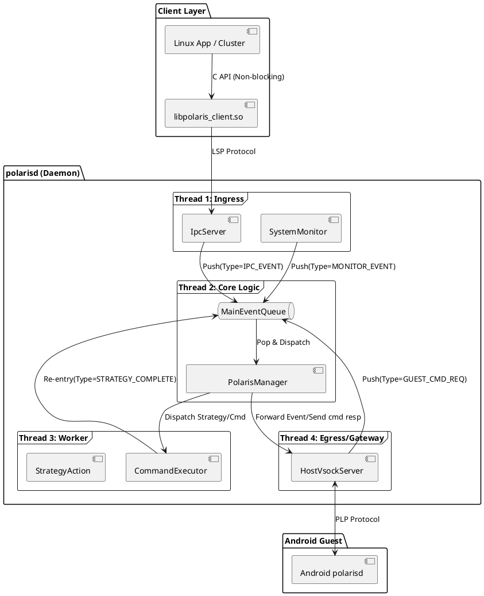
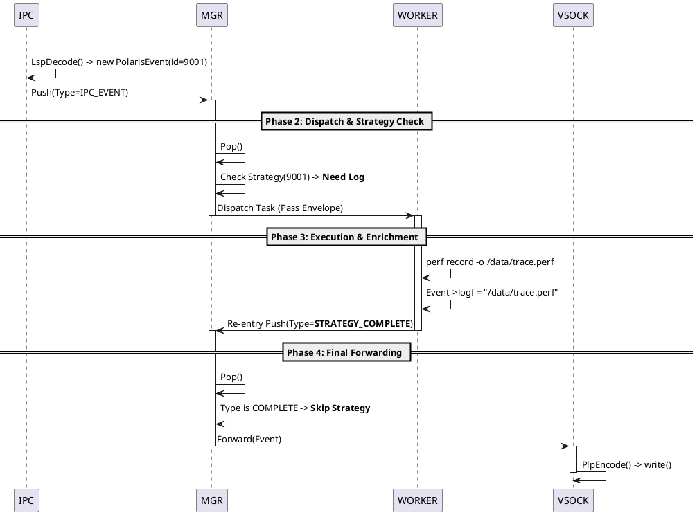
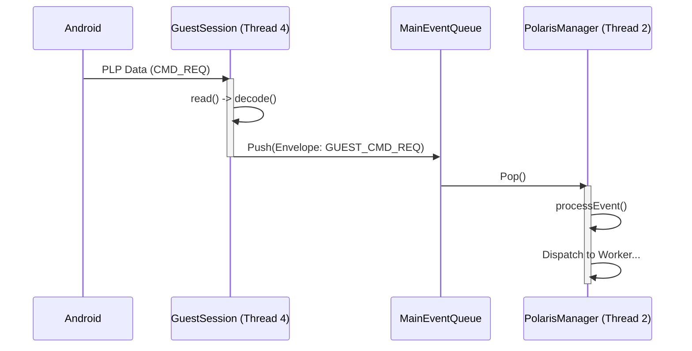
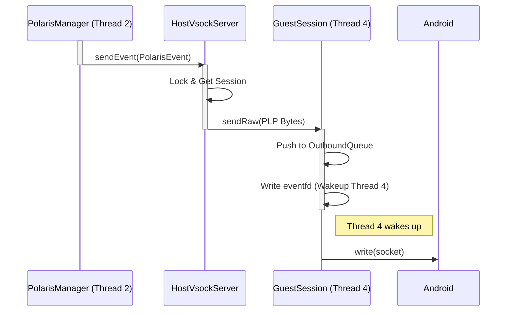

# Linux Host Polarisd 软件架构设计说明书

**版本**: v1.0
**日期**: 2024-02-09
**状态**: 拟定中

---

## 1. 概述 (Overview)

`polarisd` (Linux Host Version) 是运行在 Linux 宿主机上的核心守护进程，充当 Linux 侧应用与 Android 虚拟机（Guest OS）之间的通信网关与策略执行中心。它负责跨系统的事件流转、系统监控以及跨端指令的落地执行。

### 1.1 设计目标

* **高安全性**: 确保客户端调用非阻塞，确保 Android 端无法反向控制 Linux 关键进程。
* **高可靠性**: 采用多线程隔离架构，单一模块阻塞不影响整体吞吐。
* **可扩展性**: 支持灵活的策略联动（如 Crash 自动抓取日志）和协议扩展。

---

## 2. 需求拆解 (Requirements)

### 2.1 功能需求

1. **事件上报 (Event Forwarding)**:
* 接收 Linux 本地进程（如 Cluster HMI）通过 SDK 上报的业务事件。
* 接收内部 Monitor 监控到的系统事件（如进程崩溃、资源告警）。
* 将上述事件转发给 Android Guest 侧的 `polarisd`。


2. **指令执行 (Command Execution)**:
* 接收 Android Guest 发送的控制指令（如 Ping, CaptureLog）。
* 在 Linux Host 侧执行指令，并将结果返回给 Android。


3. **策略联动 (Strategy Linkage)**:
* 支持“事件触发动作”机制（例如：收到 Crash 事件  触发 Log 抓取  填充 Log 路径  发送事件）。


### 2.2 非功能需求 (技术约束)

1. **线程隔离**: IPC 接收、业务分发、指令执行、VSOCK 通信必须运行在独立的线程中，防止死锁。
2. **调用者安全**: `libpolaris_client` 必须是非阻塞的，SDK 内部错误不应导致宿主进程崩溃。
3. **单向控制**: 严禁通过 `polarisd` 反向控制 Linux 本地业务进程。

---

## 3. 软件架构 (Software Architecture)

### 3.1 架构模式

采用 **多线程流水线 (Multi-threaded Pipeline)** 架构。系统被划分为四个独立的执行域（Execution Domains），通过线程安全的 `EventQueue` 进行耦合。

### 3.2 架构视图



---

## 4. 核心组件详解 (Core Components)

### 4.1 Client SDK (`libpolaris_client`)

* **职责**: 提供极其简便的 C 语言接口，屏蔽通信细节。
* **设计模式**: Builder Pattern + Opaque Handle。
* **特性**:
  * **Lazy Init**: 首次调用时初始化后台发送线程。
  * **Fork Safety**: 自动检测 PID 变化，处理子进程中的线程重建。
  * **Fail-Safe**: 内部维护环形队列，满则丢弃，绝不阻塞调用者。

### 4.2 IpcServer (Thread 1)

* **职责**: 监听 Unix Domain Socket (`/var/run/polaris_bridge`)。
* **逻辑**: 仅负责 `accept` 和 `read`。接收数据流，通过 `LspCodec` 解码为 `PolarisEvent`，封装入信封后推送到 `MainEventQueue`。
* **并发**: 独立线程，确保高频 IPC 调用不会被业务逻辑阻塞。

### 4.3 PolarisManager (Thread 2)

* **职责**: 系统的“大脑”，负责状态机流转和路由分发。
* **逻辑**:
  * 从 `MainEventQueue` 消费消息。
  * 根据 `HostManagerEvent::Type` 判断处理路径（查策略表 OR 直接转发）。
  * 维护路由表（Session Router）。

### 4.4 CommandExecutor (Thread 3)
* **职责**: 系统的“工人”，处理所有耗时、阻塞、涉及文件 I/O 的任务。
* **逻辑**:
  * 维护一个线程池。
  * 执行 Android 发来的命令（Ping, Reboot）。
  * 执行本地联动策略（抓取 Log）。
  * **结果重入**: 任务完成后，修改 Event 数据，修改信封类型，重新 Push 到 `MainEventQueue`。

### 4.5 HostVsockServer (Thread 4)
* **职责**: 维护与 Android Guest 的 VSOCK 连接 (`CID_ANY:9001`)。
* **逻辑**:
  * **下行**: 将 `PolarisEvent` 编码为 PLP 协议包发送。
  * **上行**: 接收 PLP 包，解码为 `CommandRequest` 推送队列。
  * **保活**: 监听连接断开，处理重连与缓冲区清理。

### 4.6 SystemMonitor 线程

* SystemMonitor代指对协同的监控业务。每个监控需求都是单独的一个线程执行。
  
---

## 5. 关键数据结构 (Key Data Structures)

### 5.1 纯净载体: `PolarisEvent`

纯粹的数据传输对象 (DTO)，不包含任何 Host 端内部状态。

```cpp
struct PolarisEvent {
    uint64_t eventId;
    uint64_t timestamp;
    int32_t pid;
    std::string processName;
    std::string processVer;
    std::string params;      // JSON String
    std::string logf;        // 附件路径 (可变字段)
};

```

### 5.2 状态信封: `HostManagerEvent`

用于在内部队列中流转的容器，`Type` 字段充当状态机的状态。

```cpp
struct HostManagerEvent {
    enum Type {
        // [Ingress States]
        TYPE_IPC_EVENT,         // 新事件：来自 IPC
        TYPE_MONITOR_EVENT,     // 新事件：来自 Monitor
        
        // [Processing States]
        TYPE_STRATEGY_COMPLETE, // 处理完：来自 Worker (含附件)
        
        // [Command States]
        TYPE_GUEST_CMD_REQ,     // 请求：来自 Android
        TYPE_CMD_EXEC_RESULT    // 结果：来自 Worker
    };

    Type type;
    std::shared_ptr<PolarisEvent> eventData;
    std::shared_ptr<CommandRequest> cmdRequest;
    std::shared_ptr<CommandResult> cmdResult;
    std::weak_ptr<Session> session; // 回包上下文
};

```

### 5.3 CommandRequest

| 字段名 | 类型 | 语义说明 |
| --- | --- | --- |
| **reqId** | uint32 | 请求序列号 (用于异步匹配 Response) |
| **target** | enum | 执行目标 (`LOCAL` / `HOST`) |
| **action** | string | 动作指令 (如 `capture_log`) |
| **args** | JSON | 动作参数 |
| **timeout** | uint32 | 超时时间 (ms) |

### 5.4 CommandResult

用于描述命令执行的最终状态和产物，与 `CommandRequest` 构成闭环。

| 字段名 | 类型 | 语义说明 | 必填 |
| --- | --- | --- | --- |
| **reqId** | uint32 | **请求序列号**。必须与 `CommandRequest.reqId` 严格一致，用于回调溯源。 | Yes |
| **code** | int32 | **状态码**。`0` 表示成功，非 `0` 表示错误码 (如 System Exit Code)。 | Yes |
| **msg** | string | **可读消息**。简短描述 (e.g., "Success", "Timeout", "Fork Failed")。 | Yes |
| **data** | JSON | **执行产物**。具体的返回数据 (e.g., `{"path": "/data/trace.pb"}`)。 | No |


---

## 6. 对外接口与协议 (Interfaces & Protocols)

### 6.1 SDK C API

对外暴露极简接口，隐藏 C++ 实现。

```c
/*
 * Copyright (C) 2024 Voyah Polaris Project
 *
 * Polaris Event Reporting SDK (C API)
 * Thread-safe, Lazy-initialized, Opaque Handle based design.
 */

#ifndef POLARIS_API_H
#define POLARIS_API_H

#include <stdint.h>
#include <stdbool.h>

#ifdef __cplusplus
extern "C" {
#endif

// ============================================================================
// 1. 类型定义 (Opaque Handle)
// ============================================================================

/**
 * PolarisEventHandle 是一个指向内部 C++ 对象的指针。
 * 对于调用者来说，它是不透明的 (void* 或 前置声明结构体)。
 * 调用者不应尝试解引用它，也不应自己 free 它。
 */
typedef struct PolarisEventBuilderInternal* PolarisEventHandle;

// ============================================================================
// 2. 事件构建流程 (Builder Pattern)
// ============================================================================

/**
 * [步骤 1] 创建事件构建器
 * * *如果在本次进程生命周期内是第一次调用，此函数会自动触发 SDK 初始化 (启动后台线程)。*
 *
 * @param event_id      事件的唯一标识 ID (必填)
 * @param process_name  逻辑进程名 (可选，传 NULL 则自动读取 /proc/self/comm)
 * @param process_ver   进程版本号 (可选，传 NULL 则默认为 "unknown")
 * @return              返回不透明句柄。如果内存不足或严重错误，返回 NULL。
 */
PolarisEventHandle polaris_event_create(uint64_t event_id, 
                                        const char* process_name, 
                                        const char* process_ver);

/**
 * [步骤 2] 添加 Key-Value 数据
 * * 类似于 JSON 中的: { "key": value }
 * SDK 内部会自动处理类型转换和 JSON 格式化。
 */
void polaris_event_add_string(PolarisEventHandle handle, const char* key, const char* value);
void polaris_event_add_int(PolarisEventHandle handle, const char* key, int32_t value);
void polaris_event_add_long(PolarisEventHandle handle, const char* key, int64_t value);
void polaris_event_add_double(PolarisEventHandle handle, const char* key, double value);
void polaris_event_add_bool(PolarisEventHandle handle, const char* key, bool value);

/**
 * [步骤 3] 提交发送
 * * 将构建好的事件序列化并放入发送队列。
 * ***重要***: 此函数调用后，SDK 内部会自动销毁 handle。
 * 调用者在此之后绝对不能再使用该 handle。
 *
 * @param handle    事件句柄
 * @param log_path  (可选) 需要随事件上传的附件日志路径，无则传 NULL
 * @return          0: 成功入队; <0: 失败 (如队列满)
 */
int polaris_event_commit(PolarisEventHandle handle, const char* log_path);

/**
 * [可选] 取消发送
 * * 如果在构建过程中决定不发送了，必须调用此函数来释放 handle 资源。
 * 类似于 free()。
 */
void polaris_event_cancel(PolarisEventHandle handle);

// 3. 高级接口 (Raw JSON)
// ============================================================================

/**
 * 直接发送原始 JSON 字符串
 * 适用于调用者已经生成了 JSON 数据，或者需要发送复杂的嵌套 JSON 结构的场景。
 * 同样支持惰性初始化。
 *
 * @param event_id      事件 ID
 * @param process_name  进程名 (可选，NULL 为自动)
 * @param process_ver   版本号 (可选)
 * @param json_body     合法的 JSON 字符串，例如 "{\"cpu\": 90, \"detail\": {\"core\": 1}}"
 * @param log_path      (可选) 附件路径
 * @return              0: 成功; <0: 失败
 */
int polaris_report_raw(uint64_t event_id, 
                       const char* process_name, 
                       const char* process_ver,
                       const char* json_body,
                       const char* log_path);


// ============================================================================
// 4. 生命周期管理 (可选)
// ============================================================================

/**
 * 显式反初始化
 * * 虽然 SDK 会利用静态对象析构自动清理，但在某些严格的内存泄漏检测工具下，
 * 或者需要确保线程立即退出的场景下，建议在 main 函数退出前显式调用。
 */
void polaris_deinit(void);

#ifdef __cplusplus
}
#endif

#endif // POLARIS_API_H
```

### 6.2 通信协议

#### 6.2.1 LSP v1 (Local Socket Protocol)

用于 linux processes 与  linux host polarisd 通信。

* **结构**: `Header (12B) + Payload (JSON)`
* **字节序**: Little Endian

| 字段 | 长度 | 说明 |
| --- | --- | --- |
| `TotalLen` | 4 | Header + Payload 总长 |
| `MsgType` | 2 | `EVENT_REPORT (0x01)`, `CMD_REQ (0x20)`, `CMD_RESP (0x21)` |
| `Reserved` | 2 | 0 |
| `ReqID` | 4 | 请求 ID |


* **TotalLen (包总长)**
  * **语义**: 表示整个数据包的长度，计算公式为 `TotalLen = 12 (Header) + Payload Length`。
  * **最小有效值**: 12 (即 Payload 为空的情况)。
  * **最大限制**: 建议限制为 **4MB**。若收到 `TotalLen > 4MB` 的包，视为非法攻击或错误，应立即断开连接。

* **Socket 类型对应的 Framing (分帧) 规则**:
由于 Local IPC 可能传输较大的 Log 数据或复杂 JSON，我们采用 SOCK_STREAM (流式套接字)。这意味着数据在传输层是无边界的字节流，接收端必须根据协议头进行分帧。
**处理状态机**:
  1. Phase 1: Read Header (Fixed 12 Bytes)
     * 接收端首先尝试从 Socket 读取 12 字节。
     * 如果 read() 返回数据不足 12 字节，需循环读取直到凑齐 12 字节。
     * 校验: 读取后检查 TotalLen。
     * 如果 TotalLen < 12 或 TotalLen > 4MB，视为非法请求，立即关闭 Socket。
  2. Phase 2: Read Payload (Variable Length)
     * 计算 PayloadLen = TotalLen - 12。
     * 如果 PayloadLen == 0，处理结束，进入下一轮 Phase 1。
     * 如果 PayloadLen > 0，循环执行 read()，直到读取的字节数累计达到 PayloadLen。
  
    **超时策略**:
    为了防止恶意客户端发送 Header 后不发 Payload 导致服务端线程挂起，必须设置 SO_RCVTIMEO 或使用 poll/epoll 设置读取超时（建议 3000ms）。超时未读完完整包，直接断开连接。


#### 6.2.2 PLP v1 (Polaris Link Protocol)
用于 Host 与 Guest 通信。支持全双工控制。

* **结构**: `Header (24B) + Payload (Binary/JSON)`
* **字节序**: Little Endian

| 消息类型 (Type) | 值 | 方向 | 说明 |
| --- | --- | --- | --- |
| `PLP_HEARTBEAT` | 0x0001 | Bi-dir | 心跳 |
| **H2G (Host -> Guest)** |  |  |  |
| `PLP_EVENT_H2G` | 0x0010 | H->G | Host 事件上报 |
| `PLP_CMD_RESP_H2G` | 0x0011 | H->G | Host 回复 Android 的请求 |
| `PLP_CMD_REQ_H2G` | 0x0012 | H->G | Host 请求 Android 执行 |
| **G2H (Guest -> Host)** |  |  |  |
| `PLP_CMD_REQ_G2H` | 0x0020 | G->H | Android 请求 Host 执行 |
| `PLP_CMD_RESP_G2H` | 0x0021 | G->H | Android 回复 Host 的请求 |


##### 6.2.2.1 Binary Header 结构定义

PLP 采用严格的二进制对齐结构（24 字节），并在 C++ 中使用 `packed` 属性定义。

```cpp
// 6.2.2.1 协议头定义 (C++ Standard Layout)
// 确保 Host 与 Android 使用完全相同的头文件定义

#pragma pack(push, 1) // 强制 1 字节对齐，跨编译器通用

struct PlpHeader {
    uint32_t magic;        // 0x504C5253 ("PLRS")
    uint16_t version;      // 0x0001
    uint16_t header_len;   // 0x0018 (24 Bytes)
    uint32_t payload_len;  // Payload 长度 (不含 Header)
    uint16_t type;         // PlpMsgType (e.g., 0x0010 EVENT)
    uint16_t flags;        // Bit 0: IS_JSON, Bit 1: GZIP
    uint32_t seq_id;       // 请求序列号
    uint32_t crc32;        // Payload CRC32 (IEEE 802.3)
};

#pragma pack(pop)

// 校验: sizeof(PlpHeader) 必须等于 24
static_assert(sizeof(PlpHeader) == 24, "PlpHeader size mismatch!");

```

**关键字段语义**:

* **Flags (位掩码)**:
  * `Bit 0 (IS_JSON)`: 1 表示 Payload 是 JSON 字符串，0 表示是原始二进制（如 Protobuf 或纯文件流）。
  * `Bit 1 (GZIP)`: 1 表示 Payload 经过 Gzip 压缩，接收端需先解压。
  * `Bit 2~15`: 预留。

* **SeqID**:
  * 用于双向通信的请求-响应匹配。
  * 发起方（Request）生成 SeqID，响应方（Response）必须回传相同的 SeqID。
  * 对于主动上报的 Event，SeqID 可由发送方自增，用于接收方检测丢包。

* **CRC32**:
  * 算法: 标准 IEEE 802.3 CRC32。
  * 范围: **仅计算 Payload 部分**。Header 本身不参与 CRC 计算（Header 依靠 Magic 校验）。

* 序列化规范:
对于 PolarisEvent，必须将其字段序列化为 JSON 字符串放入 Payload。
Android 端接收到后，解析 JSON 还原为对象。
---


## 7. 关键时序流程 (Key Sequence Diagrams)

### 7.1 场景：带策略联动的事件上报 (Crash -> Log -> Send)

此流程展示了 **Type 变更** 与 **队列重入** 机制。



### 7.2 场景：Android 发送命令给 Host



### 7.3 场景：Host 发送事件给 Android



---

## 8. 构建与部署 (Build & Deployment)

* **构建系统**: CMake (适配 Yocto `do_configure`).
* **依赖管理**:
  * `jsoncpp`: 静态链接至 SDK，动态链接至 Daemon。
  * `libc++`: Yocto 默认支持（由 toolchain 决定，工程需在 Yocto layer 中明确选择并验证）。
  * **Systemd 集成**:
  * 提供 `polarisd.service`。
  * 配置 `Restart=always`。
  * 配置 `After=vsock.service`。

### 8.1 目录结构
```txt
voyah-cluster/polarisd/
├── CMakeLists.txt
├── polarisd.service
├── README.md
├── include/
│   └── polaris_api.h               # C SDK 接口
├── src/
│   ├── main.cpp                    # 守护进程入口
│   │
│   ├── client_sdk/                 # SDK 源码
│   │   ├── CMakeLists.txt
│   │   └── PolarisClient.cpp
│   │
│   ├── message/                    # [新增] 消息数据模型 (核心)
│   │   ├── PolarisEvent.h          # [新增] 纯净业务数据 (DTO)
│   │   ├── HostManagerEvent.h      # [新增] 状态信封 (Envelope)
│   │   ├── CommandRequest.h        # [新增] 指令请求结构
│   │   └── CommandResult.h         # [新增] 指令结果结构
│   │
│   ├── core/                       # 核心逻辑 (Thread 2)
│   │   ├── PolarisManager.cpp      # 状态机与分发逻辑
│   │   ├── EventQueue.h            # 线程安全队列 (存放 HostManagerEvent)
│   │   ├── StrategyRegistry.h      # [新增] 策略注册表 (ID -> Action 映射)
│   │   └── strategy/
│   │       ├── IStrategy.h         # [新增] 策略接口基类
│   │       └── LogCaptureStrategy.cpp
│   │
│   ├── transport/                  # 通信层 (Threads 1 & 4)
│   │   ├── Session.h               # [新增] 会话基类 (定义 send/close 接口)
│   │   ├── ipc/
│   │   │   ├── IpcServer.cpp       # UDS Acceptor (Epoll监听)
│   │   │   ├── ClientSession.cpp   # [新增] 本地客户端会话 (处理 LSP 粘包/缓冲)
│   │   │   └── LspCodec.cpp
│   │   └── vsock/
│   │       ├── HostVsockServer.cpp # VSOCK Acceptor (持有 GuestSession)
│   │       ├── GuestSession.cpp    # [新增] Android 会话 (处理 PLP 协议、缓冲、IO)
│   │       └── PlpCodec.cpp
│   │
│   ├── executor/                   # 执行层 (Thread 3)
│   │   ├── CommandExecutor.cpp     # 线程池实现
│   │   ├── IAction.h               # [新增] 执行动作基类
│   │   └── actions/
│   │       ├── PingAction.cpp
│   │       └── SystemAction.cpp
│   │
│   ├── monitor/                    # 监控模块 (Thread 1)
│   │   ├── SystemMonitor.cpp
│   │   └── QcrosvmMonitor.cpp
│   │
│   └── utils/
│       ├── Log.h
│       ├── JsonUtils.h
│       ├── FileUtils.h
│       ├── TimeUtils.h             # [新增] 时间戳获取
│       └── SocketUtils.h           # [新增] setNonBlocking, createSocket 封装
│
└── tests/
    └── ...
```

---
