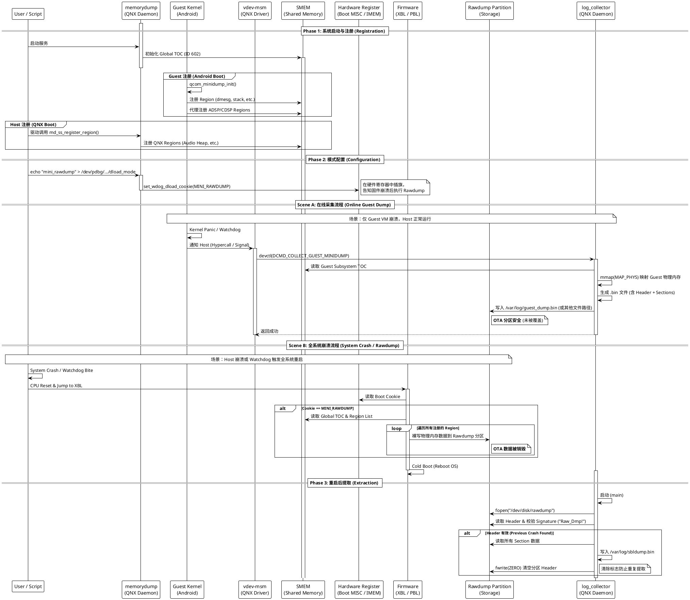

+++
date = '2025-08-28T16:25:03+08:00'
draft = false
title = 'QNX/Android Rawdump 机制完全原理解析'
+++

本文档基于系统源码（QNX/Android/Bootloader）及实际配置分析，详细阐述了智能座舱系统中的内存转储（Crash Dump）机制。

## 1. 全系统生命周期与时序总览

此图描述了从系统启动注册、模式配置，到发生崩溃（分两种场景），最后到重启提取的完整闭环流程。

## 2. 核心组件架构详解

整个 Rawdump 机制跨越了 Bootloader、Host OS (QNX)、Guest OS (Android) 和 硬件层。

| 组件名称 | 运行环境 | 核心源码 | 职责与作用 |
| --- | --- | --- | --- |
| **SMEM (Shared Memory)** | Hardware | `smem_type.h` | **数据中心** 存储 ID 为 `602` 的 Global TOC。它是所有子系统注册内存区域（Region）的共享账本，XBL 和 log_collector 都依据此表工作。 |
| **`memorydump`** | QNX Host | `ss_minidump_main.c` | **Host 侧登记处** 负责维护 Host 侧的 SMEM 表，提供接口供 QNX 驱动注册内存。同时负责向硬件寄存器写入 Magic Cookie (`MINI_RAWDUMP`)。 |
| **`vdev-msm`** | QNX Host | `vdev-msm.c` | **Guest 吹哨人** 监听 Android 虚拟机的看门狗状态。当 Guest Panic 时，它负责触发在线采集流程 (`DCMD_COLLECT_GUEST_MINIDUMP`)。 |
| **`log_collector`** | QNX Host | `log_collect_resmgr.c` | **搬运工** 1. **在线模式**：响应 `vdev-msm` 请求，通过 `mmap` 读取 Guest 内存并存为文件。 2. **离线模式**：系统重启后，检查 Rawdump 分区头，提取 XBL 写入的数据。 |
| **XBL Firmware** | Bootloader | `XBLRamDump` | **离线执行者** 仅在**全系统重启**（System Crash）时工作。它无视文件系统，直接将物理内存“裸写”到 Rawdump 分区。 |

---

## 3. 存储架构：OTA 分区复用机制

系统采用了 **Rawdump 与 OTA 分区复用** 的策略。

* **物理层**：QNX 侧存在一个约 **10GB** 的物理分区 `/dev/disk/rawdump`。
* **透传层**：通过 `vdev-virtio-blk` 将该物理分区透传给 Android 虚拟机。
* **Android 侧**：被重命名为 `/dev/block/by-name/ota`。
* **冲突与共存**：
* **正常运行**：Android 挂载为 `ext4` 文件系统，用于存储 OTA 升级包。
* **Guest Crash**：`log_collector` 写入普通文件，**OTA 数据安全**。
* **System Crash**：XBL 固件直接覆盖写入，**OTA 文件系统被销毁**。

---

## 4. 关键路径决策分析

系统在崩溃时会根据情况进入两条不同的路径，这也是排查“OTA 损坏”或“Log 丢失”问题的关键依据。

### 路径 A：Guest VM Crash (在线采集)

* **特征**：QNX 不重启，仅 Android 重启。
* **流程**：`vdev-msm` -> `log_collector` -> `mmap` -> 写文件 (`/var/log/guest_dump.bin`)。
* **结果**：速度快，保留 OTA 包。

### 路径 B：System Crash (离线转储)

* **特征**：整机黑屏重启，XBL 介入。
* **流程**：硬件看门狗复位 -> XBL -> 读取 SMEM -> **覆盖 Rawdump 分区**。
* **结果**：速度慢，**销毁 OTA 包**。

---

## 5. Android 侧的避让策略 (`init.mount_ota.sh`)

为了处理路径 B 带来的分区污染，Android 启动脚本实现了以下逻辑：

1. **触发**：`sys.boot_completed=1`（开机完成后）。
2. **检测**：`dd` 读取分区头，检查是否存在 `Raw_Dmp!`。
3. **避让**：如果发现签名，脚本会循环等待（Time-wait），给 QNX `log_collector` 提取数据留出时间。
4. **格式化**：提取完成或等待超时后，强制格式化分区，恢复 OTA 功能。