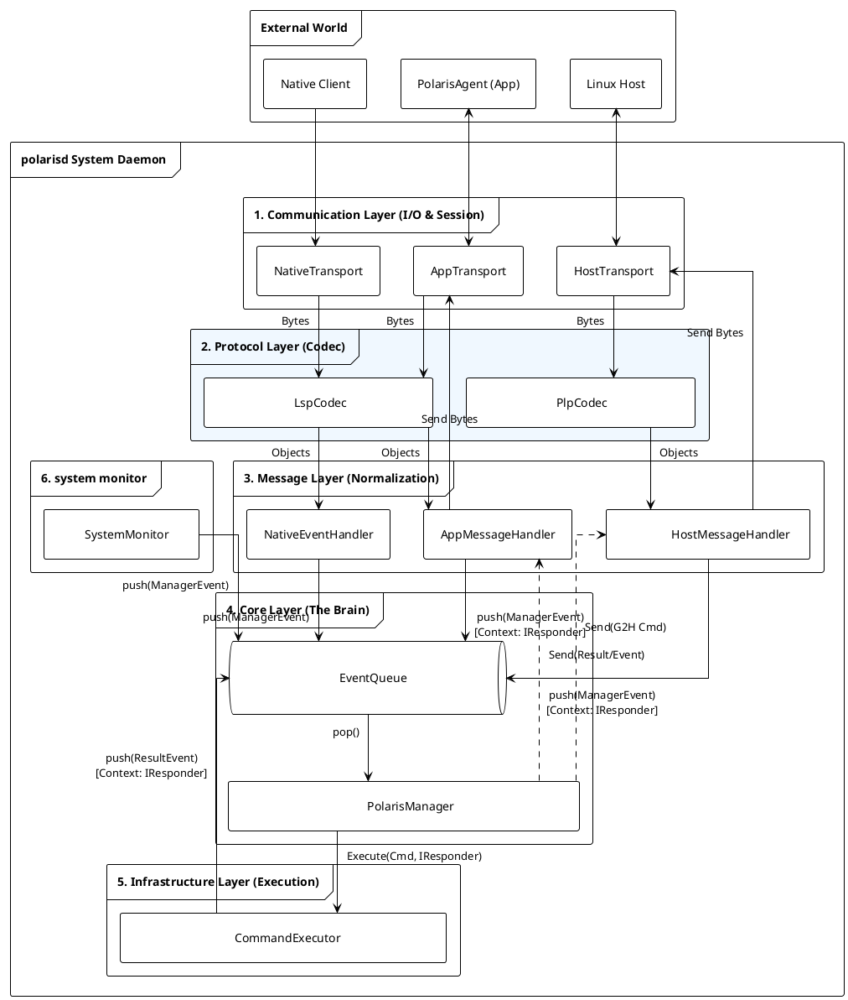

# polarisd 架构设计文档 (v0.1)

**版本**: v0.1
**日期**: 2026-02-05
**状态**: **Draft**

## 1. 设计原则 (Design Principles)

1. **全域统一 (Universal Consistency)**: Linux Host, Android Native, Java Framework 共享同一套事件数据模型。
2. **单一大脑 (Single Brain)**: `PolarisManager` 是系统中唯一的决策中心。
3. **一切皆事件 (Everything is an Event)**: 外部的上报、App 的命令、以及命令执行的结果，在内部都被视为 Event 统一排队处理。
4. **分层解耦 (Layered Decoupling)**: I/O、协议、业务逻辑、核心策略、基础设施严格分层，单向依赖。

---

## 2. 全局数据结构

### 2.1 PolarisEvent (标准数据契约)

这是全系统通用的“感知信息”载体。

| 字段名 | 类型 | 语义说明 | 必填 |
| --- | --- | --- | --- |
| **eventId** | uint64 | 事件唯一标识符 (全系统唯一 ID 表) | Yes |
| **timestamp** | uint64 | 事件发生的物理时间 (ms) | Yes |
| **pid** | int32 | 产生事件的进程 ID | Yes |
| **processName** | string | 产生事件的进程名/模块名 | Yes |
| **processVer** | string | 产生事件的进程版本号 | Yes |
| **params** | JSON/Map | 具体业务参数 (Key-Value) | No |
| **logf** | string | 关联文件路径 (如 Trace, Log, Dump) | No |

### 2.2 CommandRequest (控制指令)

用于 App 或 Host 下发控制命令。

| 字段名 | 类型 | 语义说明 |
| --- | --- | --- |
| **reqId** | uint32 | 请求序列号 (用于异步匹配 Response) |
| **target** | enum | 执行目标 (`LOCAL` / `HOST`) |
| **action** | string | 动作指令 (如 `capture_log`) |
| **args** | JSON | 动作参数 |
| **timeout** | uint32 | 超时时间 (ms) |

### 2.3 CommandResult 数据格式定义

用于描述命令执行的最终状态和产物，与 `CommandRequest` 构成闭环。

| 字段名 | 类型 | 语义说明 | 必填 |
| --- | --- | --- | --- |
| **reqId** | uint32 | **请求序列号**。必须与 `CommandRequest.reqId` 严格一致，用于回调溯源。 | Yes |
| **code** | int32 | **状态码**。`0` 表示成功，非 `0` 表示错误码 (如 System Exit Code)。 | Yes |
| **msg** | string | **可读消息**。简短描述 (e.g., "Success", "Timeout", "Fork Failed")。 | Yes |
| **data** | JSON | **执行产物**。具体的返回数据 (e.g., `{"path": "/data/trace.pb"}`)。 | No |

---

## 3. 软件架构设计 (Architecture)

### 3.1 核心架构视图

本架构采用 **Pipeline 处理模式** 和 **单线程事件循环** 模型，配合 Infrastructure 层的异步执行。



### 3.2 核心组件职责矩阵

| 分层 | 组件名称 | 核心职责 | 线程模型 |
| --- | --- | --- | --- |
| **Communication** | **AppTransport** | Unix domain SEQPACKET/STREAM server。 | IO Thread (RW) |
|  | **NativeTransport** | Unix domain DGRAM/SEQPACKET ingress。 | IO Thread (R) |
|  | **HostTransport** | VSOCK 连接维护、断连重连。 | IO Thread (RW) |
| **Protocol** | **LspCodec** | LSP 协议编解码 (Header+JSON)。纯逻辑工具类。 | N/A |
|  | **PlpCodec** | PLP 协议编解码 (Header+Binary+CRC)。纯逻辑工具类。 | N/A |
| **Message** | **MessageHandler** | **归一化**。将解码后的对象封装为 `PolarisManagerEvent`，Push 到核心队列。 | IO Thread |
| **Core** | **EventQueue** | 线程安全的阻塞队列。系统的**唯一入口**。 | Thread Safe |
|  | **PolarisManager** | **系统大脑**。从队列取事件，执行策略（过滤、联动、分发）。 | Main Thread |
| **Infrastructure** | **CommandExecutor** | **执行器**。执行 Shell/System 命令。执行完毕后将结果封装为 Event **重新入队**。 | Worker Thread / Child Process |

---

## 4. 协议定义 (Protocols)

### 4.1 LSP v1 (Local Socket Protocol)

用于 App 与 Native Client 通信。

* **结构**: `Header (12B) + Payload (JSON)`
* **字节序**: Little Endian

| 字段 | 长度 | 说明 |
| --- | --- | --- |
| `TotalLen` | 4 | Header + Payload 总长 |
| `MsgType` | 2 | `EVENT_REPORT (0x01)`, `CMD_REQ (0x20)`, `CMD_RESP (0x21)` |
| `Reserved` | 2 | 0 |
| `ReqID` | 4 | 请求 ID |

### 4.2 PLP v1 (Polaris Link Protocol)

用于 Host 与 Guest 通信。支持全双工控制。

* **结构**: `Header (24B) + Payload (Binary/JSON)`
* **字节序**: Little Endian

| 消息类型 (Type) | 值 | 方向 | 说明 |
| --- | --- | --- | --- |
| `PLP_TYPE_HEARTBEAT` | 0x0001 | Bi-dir | 心跳 |
| **H2G (Host -> Guest)** |  |  |  |
| `PLP_TYPE_EVENT_H2G` | 0x0010 | H->G | Host 事件上报 |
| `PLP_CMD_RESP_H2G` | 0x0011 | H->G | Host 回复 Android 的请求 |
| `PLP_CMD_REQ_H2G` | 0x0012 | H->G | Host 请求 Android 执行 |
| **G2H (Guest -> Host)** |  |  |  |
| `PLP_CMD_REQ_G2H` | 0x0020 | G->H | Android 请求 Host 执行 |
| `PLP_CMD_RESP_G2H` | 0x0021 | G->H | Android 回复 Host 的请求 |

---

## 5. 关键业务流程

### 5.1 事件上报与联动

1. **Source**: Native 发生 Crash -> `NativeTransport` 收到 -> `LspCodec` 解码 -> `NativeEventHandler`。
2. **Queue**: Handler 封装 `ManagerEvent(TYPE_NATIVE_EVENT)` -> Push `EventQueue`。
3. **Core**: `PolarisManager` Pop 事件。
* **策略判定**: 发现是 Crash 事件，且无 Log。
* **Action**: 调用 `CommandExecutor` 执行 `logcat`。


4. **Feedback**: `CommandExecutor` 完成 -> 封装 `ManagerEvent(TYPE_CMD_RESULT)` -> Push `EventQueue`。
5. **Dispatch**: `PolarisManager` Pop 结果。
* **聚合**: 取出之前的 Crash 事件，关联 Logcat 路径。
* **发送**: 调用 `AppMessageHandler.send()` -> App 收到带附件的 Event。


### 5.2 命令执行

1. **Request**: App 发送 `CMD_REQ` -> `AppTransport` -> `AppMessageHandler` -> Push `ManagerEvent(TYPE_APP_CMD_REQ)` (携带 `IResponder`)。
2. **Core**: `PolarisManager` Pop 请求 -> 调用 `CommandExecutor.execute(cmd, IResponder)`。
3. **Result**: Executor 完成 -> 封装 Result 并携带原始 `IResponder` -> Push `ManagerEvent(TYPE_CMD_RESULT)`.
4. **Response**: `PolarisManager` Pop 结果 -> 调用 `event->responder->sendResult()` (无需查表，直接回调)。

---

## 6.0 内部关键类和数据结构定义

### 6.1 PolarisManagerEvent (内部总线对象)

这是内部 `EventQueue` 中流转的唯一对象，用于屏蔽外部差异。

```cpp
struct PolarisManagerEvent {
    enum Type {
        TYPE_NATIVE_EVENT,      // 来源: Native (LSP)
        TYPE_HOST_EVENT,        // 来源: Host (PLP)
        TYPE_APP_CMD_REQ,       // 来源: App (LSP Command)
        TYPE_HOST_CMD_REQ,      // 来源: Host (PLP Command)
        TYPE_CMD_EXEC_RESULT    // 来源: Infrastructure (执行结果)
    };
    
    Type type;
    std::shared_ptr<PolarisEvent> eventData;   // 事件数据
    std::shared_ptr<CommandRequest> cmdData;   // 命令请求
    std::shared_ptr<CommandResult> resultData; // 执行结果
    
    // 关键改进：使用智能指针替代 void* context
    // 1. 它是 polymorphic 的，可以指向 AppSession, HostSession 等
    // 2. 它是引用计数的，防止 Command 执行期间连接断开导致 crash
    std::shared_ptr<IResponder> responder;                          
};

```

### 6.2 IResponder

```cpp
// 响应者接口：谁发起的请求，谁就负责实现这个接口来接收结果
// 该接口通常由 Communication 层的 Session 对象实现
struct IResponder {
    virtual ~IResponder() = default;
    virtual void sendResult(std::shared_ptr<CommandResult> result) = 0;
};

```