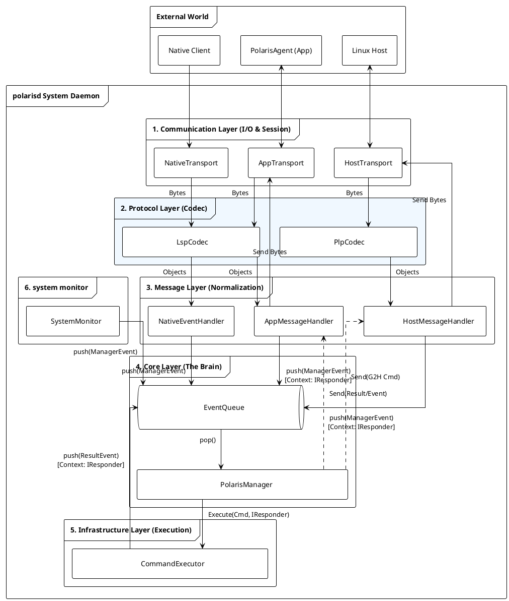

+++
date = '2025-12-24T17:17:50+08:00'
draft = true
title = 'polarisd 架构设计文档'
+++

# polarisd 架构设计文档 (v0.2)

**版本**: v0.2
**日期**: 2026-02-05
**状态**: **Draft**

## 1. 设计原则 (Design Principles)

1. **全域统一 (Universal Consistency)**: Linux Host, Android Native, Java Framework 共享同一套事件数据模型。
2. **单一大脑 (Single Brain)**: `PolarisManager` 是系统中唯一的决策中心。
3. **一切皆事件 (Everything is an Event)**: 外部的上报、App 的命令、以及命令执行的结果，在内部都被视为 Event 统一排队处理。
4. **分层解耦 (Layered Decoupling)**: I/O、协议、业务逻辑、核心策略、基础设施严格分层，单向依赖。

---

## 2. 全局数据结构

### 2.1 PolarisEvent (标准数据契约)

这是全系统通用的“感知信息”载体。

| 字段名 | 类型 | 语义说明 | 必填 |
| --- | --- | --- | --- |
| **eventId** | uint64 | 事件唯一标识符 (全系统唯一 ID 表) | Yes |
| **timestamp** | uint64 | 事件发生的物理时间 (ms) | Yes |
| **pid** | int32 | 产生事件的进程 ID | Yes |
| **processName** | string | 产生事件的进程名/模块名 | Yes |
| **processVer** | string | 产生事件的进程版本号 | Yes |
| **params** | JSON/Map | 具体业务参数 (Key-Value) | No |
| **logf** | string | 关联文件路径 (如 Trace, Log, Dump) | No |

### 2.2 CommandRequest (控制指令)

用于 App 或 Host 下发控制命令。

| 字段名 | 类型 | 语义说明 |
| --- | --- | --- |
| **reqId** | uint32 | 请求序列号 (用于异步匹配 Response) |
| **target** | enum | 执行目标 (`LOCAL` / `HOST`) |
| **action** | string | 动作指令 (如 `capture_log`) |
| **args** | JSON | 动作参数 |
| **timeout** | uint32 | 超时时间 (ms) |

### 2.3 CommandResult 数据格式定义

用于描述命令执行的最终状态和产物，与 `CommandRequest` 构成闭环。

| 字段名 | 类型 | 语义说明 | 必填 |
| --- | --- | --- | --- |
| **reqId** | uint32 | **请求序列号**。必须与 `CommandRequest.reqId` 严格一致，用于回调溯源。 | Yes |
| **code** | int32 | **状态码**。`0` 表示成功，非 `0` 表示错误码 (如 System Exit Code)。 | Yes |
| **msg** | string | **可读消息**。简短描述 (e.g., "Success", "Timeout", "Fork Failed")。 | Yes |
| **data** | JSON | **执行产物**。具体的返回数据 (e.g., `{"path": "/data/trace.pb"}`)。 | No |

---

## 3. 软件架构设计 (Architecture)

### 3.1 核心架构视图

本架构采用 **Pipeline 处理模式** 和 **单线程事件循环** 模型，配合 Infrastructure 层的异步执行。



### 3.2 核心组件职责矩阵

| 分层 | 组件名称 | 核心职责 | 线程模型 |
| --- | --- | --- | --- |
| **Communication** | **AppTransport** | Unix domain SEQPACKET/STREAM server。 | IO Thread (RW) |
|  | **NativeTransport** | Unix domain DGRAM/SEQPACKET ingress。 | IO Thread (R) |
|  | **HostTransport** | VSOCK 连接维护、断连重连。 | IO Thread (RW) |
| **Protocol** | **LspCodec** | LSP 协议编解码 (Header+JSON)。纯逻辑工具类。 | N/A |
|  | **PlpCodec** | PLP 协议编解码 (Header+Binary+CRC)。纯逻辑工具类。 | N/A |
| **Message** | **MessageHandler** | **归一化**。将解码后的对象封装为 `PolarisManagerEvent`，Push 到核心队列。 | IO Thread |
| **Core** | **EventQueue** | 线程安全的阻塞队列。系统的**唯一入口**。 | Thread Safe |
|  | **PolarisManager** | **系统大脑**。从队列取事件，执行策略（过滤、联动、分发）。 | Main Thread |
| **Infrastructure** | **CommandExecutor** | **执行器**。执行 Shell/System 命令。执行完毕后将结果封装为 Event **重新入队**。 | Worker Thread / Child Process |

---

## 4. 协议定义 (Protocols)

### 4.1 LSP v1 (Local Socket Protocol)

用于 App 与 Native Client 通信。

* **结构**: `Header (12B) + Payload (JSON)`
* **字节序**: Little Endian

| 字段 | 长度 | 说明 |
| --- | --- | --- |
| `TotalLen` | 4 | Header + Payload 总长 |
| `MsgType` | 2 | `EVENT_REPORT (0x01)`, `CMD_REQ (0x20)`, `CMD_RESP (0x21)` |
| `Reserved` | 2 | 0 |
| `ReqID` | 4 | 请求 ID |


#### 4.1.1 核心字段与 Framing 策略

* **TotalLen (包总长)**
  * **语义**: 表示整个数据包的长度，计算公式为 `TotalLen = 12 (Header) + Payload Length`。
  * **最小有效值**: 12 (即 Payload 为空的情况)。
  * **最大限制**: 建议限制为 **4MB**。若收到 `TotalLen > 4MB` 的包，视为非法攻击或错误，应立即断开连接。

* **Socket 类型对应的 Framing (分帧) 规则**:
  * **SOCK_STREAM (TCP-like)**:
  * **粘包/半包处理**: 接收端必须维护一个 RingBuffer。
  * **读取步骤**:
    1. 先尝试读取 12 字节 Header。
    2. 解析 `TotalLen`。
    3. 检查 Buffer 中剩余数据是否 >= `TotalLen - 12`。
    4. 若满足，切分出一个完整包；若不满足，继续等待 Socket 数据。

* **SOCK_SEQPACKET / SOCK_DGRAM**:
  * 内核保证消息边界。`recv` 调用返回的数据即为一个完整包（或被截断）。
  * **校验**: 接收端仍需校验 `read_count == TotalLen`，以确保数据未被内核截断。


#### 4.1.2 JSON Payload Schema 定义

所有 Payload 均为 UTF-8 编码的 JSON 字符串。

**A. 事件上报 (`EVENT_REPORT` - 0x0001)**
对应 `PolarisEvent` 数据结构。

```json
{
  "eventId": 10001,
  "timestamp": 1707123456789,
  "pid": 520,
  "processName": "audio_hal",
  "processVer": "1.0.2",
  "logf": "/data/local/tmp/audio_dump.pcm",  // 可选附件
  "params": {                                // 业务参数
    "latency": 40,
    "buffer_underrun": true
  }
}

```

**B. 命令请求 (`CMD_REQ` - 0x0020)**
对应 `CommandRequest` 数据结构。

```json
{
  "reqId": 8801,
  "target": "LOCAL",       // "LOCAL" | "HOST"
  "action": "capture_trace",
  "timeout": 5000,         // 超时 (ms)
  "args": {                // 动作参数
    "category": "sched",
    "duration": 3000
  }
}

```

**C. 命令回执 (`CMD_RESP` - 0x0021)**
对应 `CommandResult` 数据结构。

```json
{
  "reqId": 8801,           // 必须与请求 ID 一致
  "code": 0,               // 0: Success, !=0: Error Code
  "msg": "Trace captured successfully",
  "data": {                // 执行产物
    "path": "/data/local/tmp/trace.perfetto",
    "size": 204800
  }
}

```

### 4.2 PLP v1 (Polaris Link Protocol)

用于 Host 与 Guest 通信。支持全双工控制。

* **结构**: `Header (24B) + Payload (Binary/JSON)`
* **字节序**: Little Endian

| 消息类型 (Type) | 值 | 方向 | 说明 |
| --- | --- | --- | --- |
| `PLP_TYPE_HEARTBEAT` | 0x0001 | Bi-dir | 心跳 |
| **H2G (Host -> Guest)** |  |  |  |
| `PLP_TYPE_EVENT_H2G` | 0x0010 | H->G | Host 事件上报 |
| `PLP_CMD_RESP_H2G` | 0x0011 | H->G | Host 回复 Android 的请求 |
| `PLP_CMD_REQ_H2G` | 0x0012 | H->G | Host 请求 Android 执行 |
| **G2H (Guest -> Host)** |  |  |  |
| `PLP_CMD_REQ_G2H` | 0x0020 | G->H | Android 请求 Host 执行 |
| `PLP_CMD_RESP_G2H` | 0x0021 | G->H | Android 回复 Host 的请求 |


#### 4.2.1 Binary Header 结构定义

PLP 采用严格的二进制对齐结构（24 字节），并在 C++ 中使用 `packed` 属性定义。

```cpp
// 字节序: Little Endian
struct PlpHeader {
    uint32_t magic;        // 固定值 0x504C5253 ("PLRS")
    uint16_t version;      // 协议版本，当前为 0x0001
    uint16_t header_len;   // 固定值 24
    uint32_t payload_len;  // 仅 Payload 的长度 (不含 Header)
    uint16_t type;         // 消息类型 (PlpMsgType)
    uint16_t flags;        // 标志位 (见下文)
    uint32_t seq_id;       // 序列号
    uint32_t crc32;        // Payload 的 CRC32 校验值
} __attribute__((packed));

```

**关键字段语义**:

* **Flags (位掩码)**:
  * `Bit 0 (IS_JSON)`: 1 表示 Payload 是 JSON 字符串，0 表示是原始二进制（如 Protobuf 或纯文件流）。
  * `Bit 1 (GZIP)`: 1 表示 Payload 经过 Gzip 压缩，接收端需先解压。
  * `Bit 2~15`: 预留。

* **SeqID**:
  * 用于双向通信的请求-响应匹配。
  * 发起方（Request）生成 SeqID，响应方（Response）必须回传相同的 SeqID。
  * 对于主动上报的 Event，SeqID 可由发送方自增，用于接收方检测丢包。

* **CRC32**:
  * 算法: 标准 IEEE 802.3 CRC32。
  * 范围: **仅计算 Payload 部分**。Header 本身不参与 CRC 计算（Header 依靠 Magic 校验）。

#### 4.2.2 传输控制策略

* **Max Payload (最大载荷)**:
  * 设定阈值: **1MB** (基于 VSOCK 缓冲区效率考虑)。
* **超限策略**:
  * 若 Host 或 Guest 试图发送 > 1MB 的数据，**协议层应直接拒绝 (Drop)** 并记录错误日志。
  * v1 版本**不支持**应用层分片（Fragmentation）。如需传输大文件（如 Logcat），应通过命令回传文件路径，而非直接在 Payload 中传输文件内容。
* **超时机制**:
  * 通信双方应实现应用层超时。建议默认超时时间 **3000ms**。若发出 Request 后超时未收到 Response，应向上层返回 `TIMEOUT` 错误，并清理 Pending 状态。

## 5. 关键业务流程

### 5.1 事件上报与联动

1. **Source**: Native 发生 Crash -> `NativeTransport` 收到 -> `LspCodec` 解码 -> `NativeEventHandler`。
2. **Queue**: Handler 封装 `ManagerEvent(TYPE_NATIVE_EVENT)` -> Push `EventQueue`。
3. **Core**: `PolarisManager` Pop 事件。
* **策略判定**: 发现是 Crash 事件，且无 Log。
* **Action**: 调用 `CommandExecutor` 执行 `logcat`。


4. **Feedback**: `CommandExecutor` 完成 -> 封装 `ManagerEvent(TYPE_CMD_RESULT)` -> Push `EventQueue`。
5. **Dispatch**: `PolarisManager` Pop 结果。
* **聚合**: 取出之前的 Crash 事件，关联 Logcat 路径。
* **发送**: 调用 `AppMessageHandler.send()` -> App 收到带附件的 Event。


### 5.2 命令执行

1. **Request**: App 发送 `CMD_REQ` -> `AppTransport` -> `AppMessageHandler` -> Push `ManagerEvent(TYPE_APP_CMD_REQ)` (携带 `IResponder`)。
2. **Core**: `PolarisManager` Pop 请求 -> 调用 `CommandExecutor.execute(cmd, IResponder)`。
3. **Result**: Executor 完成 -> 封装 Result 并携带原始 `IResponder` -> Push `ManagerEvent(TYPE_CMD_RESULT)`.
4. **Response**: `PolarisManager` Pop 结果 -> 调用 `event->responder->sendResult()` (无需查表，直接回调)。

---

## 6.0 内部关键类和数据结构定义

### 6.1 PolarisManagerEvent (内部总线对象)

这是内部 `EventQueue` 中流转的唯一对象，用于屏蔽外部差异。

```cpp
struct PolarisManagerEvent {
    enum Type {
        TYPE_NATIVE_EVENT,      // 来源: Native (LSP)
        TYPE_HOST_EVENT,        // 来源: Host (PLP)
        TYPE_APP_CMD_REQ,       // 来源: App (LSP Command)
        TYPE_HOST_CMD_REQ,      // 来源: Host (PLP Command)
        TYPE_CMD_EXEC_RESULT    // 来源: Infrastructure (执行结果)
    };
    
    Type type;
    std::shared_ptr<PolarisEvent> eventData;   // 事件数据
    std::shared_ptr<CommandRequest> cmdData;   // 命令请求
    std::shared_ptr<CommandResult> resultData; // 执行结果
    
    // 关键改进：使用智能指针替代 void* context
    // 1. 它是 polymorphic 的，可以指向 AppSession, HostSession 等
    // 2. 它是引用计数的，防止 Command 执行期间连接断开导致 crash
    std::shared_ptr<IResponder> responder;                          
};

```

### 6.2 IResponder

```cpp
// 响应者接口：谁发起的请求，谁就负责实现这个接口来接收结果
// 该接口通常由 Communication 层的 Session 对象实现
struct IResponder {
    virtual ~IResponder() = default;
    virtual void sendResult(std::shared_ptr<CommandResult> result) = 0;
};

```

## 部署

目录结构
```txt
vendor/voyah/system/polaris/native/
├── Android.bp                  # 构建脚本 (定义 polarisd binary 和静态库)
├── polarisd.rc                 # Init 启动脚本
├── README.md                   # 项目文档
├── main.cpp                    # 程序入口：初始化 Manager，启动 Transport 线程
│
├── include/                    # 【公共契约层】 (对应文档 Sec 2 & 6)
│   └── polarisd/               # 对内/对外暴露的数据结构
│       ├── PolarisEvent.h          # [2.1] 标准事件数据契约
│       ├── CommandRequest.h        # [2.2] 命令请求定义
│       ├── CommandResult.h         # [2.3] 命令结果定义
│       ├── PolarisManagerEvent.h   # [6.1] 内部总线对象 (ManagerEvent)
│       └── IResponder.h            # [6.2] 响应接口 (用于 Context 透传)
│
├── src/
│   ├── communication/          # 【Layer 1: Communication】 (对应文档 Sec 3.2)
│   │   ├── AppTransport.h/cpp      # [AF_UNIX + SOCK_SEQPACKET] 监听 /dev/socket/polaris_bridge
│   │   ├── NativeTransport.h/cpp   # [AF_UNIX + SOCK_SEQPACKET]  接收 /dev/socket/polaris_report
│   │   ├── HostTransport.h/cpp     # [AF_VSOCK + SOCK_STREAM] 监听或连接 CID:Port
│   │   └── Session.h/cpp           # 基础会话类 (处理 fd 生命周期)
│   │
│   ├── protocol/               # 【Layer 2: Protocol】 (对应文档 Sec 4)
│   │   ├── LspCodec.h/cpp          # [4.1] LSP v1 编解码 (Framing + JSON)
│   │   ├── PlpCodec.h/cpp          # [4.2] PLP v1 编解码 (Binary + CRC)
│   │   ├── PacketTypes.h           # 定义 MsgType 常量 (0x0001, 0x0020...)
│   │   └── utils/                  # 协议层工具
│   │       ├── Crc32.h/cpp             # PLP 校验算法
│   │       └── JsonUtils.h/cpp         # JSON 序列化/反序列化封装
│   │
│   ├── message/                # 【Layer 3: Message】 (对应文档 Sec 3.2)
│   │   ├── AppMessageHandler.h/cpp     # 将 LSP 对象归一化为 ManagerEvent
│   │   ├── NativeEventHandler.h/cpp    # 将 Report 归一化为 ManagerEvent
│   │   └── HostMessageHandler.h/cpp    # 将 PLP 对象归一化为 ManagerEvent
│   │
│   ├── core/                   # 【Layer 4: Core】 (对应文档 Sec 3.2 & 5)
│   │   ├── PolarisManager.h/cpp    # [单一大脑] 消费队列，执行策略，分发结果
│   │   └── EventQueue.h/cpp        # [唯一入口] 线程安全的阻塞队列
│   │
│   ├── infrastructure/         # 【Layer 5: Infrastructure】 (对应文档 Sec 3.2 & 5.2)
│   │   ├── CommandExecutor.h/cpp   # 异步执行器 (fork/exec)
│   │   └── actions/                # 具体命令策略 (防止 Executor 过于臃肿)
│   │       ├── BaseAction.h
│   │       ├── LogcatAction.cpp    # 抓取 Logcat 具体实现
│   │       └── ShellAction.cpp     # 通用 Shell 执行实现
│   │
│   ├── monitor/                # 【Layer 6: Monitor】 (对应架构图 3.1)
│   │   └── SystemMonitor.h/cpp     # 监控 CPU/Mem 并生成 Event 入队
│   │
│   └── utils/                  # 通用工具类
│       ├── Log.h/cpp               # 统一日志宏 (ALOGI/ALOGE)
│       ├── ThreadUtil.h            # 线程命名、绑定核
│       └── FileUtil.h              # 文件读写辅助
│
└── client/                     # (可选) Native Client SDK
|    ├── Android.bp
|    ├── include/polaris_client.h    # 提供给 Audio/Camera HAL 的接口
|    └── polaris_client.cpp          # 封装 socket sendto 逻辑
|
└── test/  
```