# polarisd 架构设计文档 (v1.0)

**版本**: v1.0
**日期**: 2026-03-03
**状态**: **Draft**

## 1. 设计原则 (Design Principles)

1. **全域统一 (Universal Consistency)**: Linux Host, Android Native, Java Framework 共享同一套事件数据模型。
2. **单一大脑 (Single Brain)**: `Dispatcher` 是系统中唯一的决策中心。
3. **一切皆事件 (Everything is an Event)**: 外部的上报、App 的命令、以及命令执行的结果，在内部都被视为 Event 统一排队处理。
4. **分层解耦 (Layered Decoupling)**: I/O、协议、核心策略、命令执行、基础设施严格分层，单向依赖。
5. **数据不丢失 (No Data Loss)**: 事件数据在内存队列、本地磁盘、云端之间逐级持久化，确保端到端可靠投递。

---

## 2. 全局数据结构

### 2.1 PolarisEvent (标准数据契约)

这是全系统通用的"感知信息"载体。

| 字段名 | 类型 | 语义说明 | 必填 |
| --- | --- | --- | --- |
| **eventId** | uint64 | 事件唯一标识符 (全系统唯一 ID 表) | Yes |
| **timestamp** | uint64 | 事件发生的物理时间 (ms) | Yes |
| **pid** | int32 | 产生事件的进程 ID | Yes |
| **processName** | string | 产生事件的进程名/模块名 | Yes |
| **processVer** | string | 产生事件的进程版本号 | Yes |
| **params** | JSON string | 具体业务参数 (Key-Value) | No |
| **logf** | string | 关联文件路径 (如 Trace, Log, Dump) | No |

### 2.2 CommandRequest (控制指令)

用于 App 或 Host 下发控制命令。

| 字段名 | 类型 | 语义说明 |
| --- | --- | --- |
| **reqId** | uint32 | 请求序列号 (用于异步匹配 Response) |
| **target** | enum | 执行目标 (`LOCAL` / `HOST`) |
| **action** | string | 动作指令 (如 `ping`) |
| **args** | JSON string | 动作参数 |
| **timeout** | uint32 | 超时时间 (ms) |

### 2.3 CommandResult 数据格式定义

用于描述命令执行的最终状态和产物，与 `CommandRequest` 构成闭环。

| 字段名 | 类型 | 语义说明 | 必填 |
| --- | --- | --- | --- |
| **reqId** | uint32 | **请求序列号**。必须与 `CommandRequest.reqId` 严格一致，用于回调溯源。 | Yes |
| **code** | int32 | **状态码**。`0` 表示成功，非 `0` 表示错误码 (如 System Exit Code)。 | Yes |
| **msg** | string | **可读消息**。简短描述 (e.g., "success", "Timeout", "Fork Failed")。 | Yes |
| **data** | JSON string | **执行产物**。具体的返回数据 (e.g., `{"status": "pong"}`)。 | No |

辅助工厂方法:

```cpp
CommandResult::makeSuccess(uint32_t id, const std::string& data = "{}");
CommandResult::makeError(uint32_t id, int32_t code, const std::string& msg);
```

---

## 3. 软件架构设计 (Architecture)

### 3.1 核心架构视图

本架构采用 **Pipeline 处理模式** 和 **单线程事件循环** 模型，配合命令执行层的异步线程池。

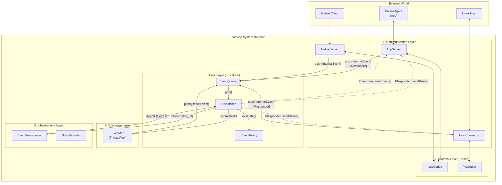
```mermaid
graph TB
    subgraph External["External World"]
        App["PolarisAgent<br/>(App)"]
        Native["Native Client"]
        Host["Linux Host"]
    end

    subgraph Daemon["polarisd System Daemon"]

        subgraph Comm["1. Communication Layer"]
            AppSrv["AppServer"]
            NativeSrv["NativeServer"]
            HostConn["HostConnector"]
        end

        subgraph Codec["2. Protocol Layer (Codec)"]
            LspCodec["LspCodec"]
            PlpCodec["PlpCodec"]
        end

        subgraph Core["3. Core Layer (The Brain)"]
            Queue[["EventQueue"]]
            Dispatcher["Dispatcher"]
            Policy["IEventPolicy"]
        end

        subgraph Exec["4. Execution Layer"]
            Executor["Executor<br/>(ThreadPool)"]
        end

        subgraph Infra["5. Infrastructure Layer"]
            Persist["EventPersistence"]
            Stats["StatsReporter"]
        end
    end

    %% External connections
    App <--> AppSrv
    Native --> NativeSrv
    Host <--> HostConn

    %% Ingress: Comm → Codec → Comm → Queue
    AppSrv <--> LspCodec
    NativeSrv <--> LspCodec
    HostConn <--> PlpCodec

    AppSrv -- "push(InternalEvent)<br/>[IResponder]" --> Queue
    NativeSrv -- "push(InternalEvent)" --> Queue
    HostConn -- "push(InternalEvent)<br/>[IResponder]" --> Queue

    %% Core processing
    Queue -- "pop()" --> Dispatcher
    Dispatcher -- "evaluate()" --> Policy

    %% Execution (commands + event enrichment)
    Dispatcher -- "submit(task)" --> Executor
    Executor -- "push(ResultEvent)" --> Queue

    %% Egress: Dispatcher → Session via interfaces
    Dispatcher -. "IResponder::sendResult()" .-> AppSrv
    Dispatcher -. "IResponder::sendResult()" .-> HostConn
    Dispatcher -. "IEventSink::sendEvent()" .-> AppSrv

    %% Infrastructure
    Dispatcher -- "offlineBuffer_ 满" --> Persist
    Persist -- "App 恢复后拉取" --> Dispatcher
```

### 3.2 核心组件职责矩阵

| 分层 | 组件名称 | 核心职责 | 线程模型 |
| --- | --- | --- | --- |
| **Communication** | **AppServer** | Unix SEQPACKET 服务端，监听 `polaris_bridge`，管理 AppSession | Accept Thread (poll, 2s timeout) |
|  | **AppSession** | 单个 App 连接的读写管理，实现 `IResponder` + `IEventSink` 接口 | 双线程 (Read + Write) |
|  | **NativeServer** | Unix SEQPACKET 服务端，监听 `polaris_report`，管理多 NativeSession | Accept Thread (poll, 2s timeout) |
|  | **NativeSession** | 单个 Native 客户端连接的读管理 (仅接收事件上报，不回写) | 单 Read Thread |
|  | **HostConnector** | VSOCK 客户端 (CID=2, Port=9001)，主动连接，自动重连，重连期间请求排队 | Connect Thread (1s 轮询) |
|  | **HostSession** | 单条 Host 连接的读写管理，实现 `IResponder` + `IHostForwarder` 接口 | 双线程 (Read + Write) |
| **Protocol** | **LspCodec** | LSP 协议编解码 (Header 12B + JSON)。纯逻辑工具类。 | N/A |
|  | **PlpCodec** | PLP 协议编解码 (Header 24B + Payload + CRC32)。纯逻辑工具类。 | N/A |
| **Core** | **EventQueue** | 线程安全的阻塞队列 (预分配环形缓冲区，容量 2000)。事件满时 Drop Oldest，**CMD 请求不丢弃**，丢弃事件打点计数。 | Thread Safe |
|  | **Dispatcher** | **系统大脑**。从队列取事件，通过 `IEventPolicy` 决策后执行策略 (透传、联动、回调)。唯一调用 `IResponder::sendResult()` 和 `IEventSink::sendEvent()` 的组件。 | 单独 Main Thread |
|  | **IEventPolicy** | 事件策略接口。根据事件内容决定透传或联动。 | 被 Dispatcher 同步调用 |
| **Execution** | **Executor** | **有界线程池**执行器。线程数可配置 (默认 4)，任务队列有界。命令和联动 Action 提交到线程池执行，结果推回 EventQueue。 | 固定线程池 |
|  | **ActionRegistry** | 根据 action 名称查找并创建具体的 Action 实例 | N/A |
| **Infrastructure** | **EventPersistence** | 事件落盘管理。App 离线期间，`offlineBuffer_` 达到容量阈值 (默认 5000 条) 时异步落盘到本地文件，App 恢复后拉取回放。 | 独立 I/O 线程 |
|  | **StatsReporter** | 每小时 (可配置) 采集并打印进程运行时统计：CPU、内存、文件句柄、队列指标等。 | 独立 Timer Thread |

> **注意**: 系统中只有一个 APP (PolarisAgent) 会和 polarisd 建立连接。polarisd 会将收到的 PolarisEvent 通过 `IEventSink` 发送到 PolarisAgent。PolarisAgent 同时接收来自 Java SDK 和本地 Monitor 的事件，经过自身的策略联动处理后，统一落盘 (SQLite) 并上传云端。

### 3.3 通信通道概览

| 通道 | Socket 类型 | 协议 | 方向 | init.rc 配置 |
| --- | --- | --- | --- | --- |
| polarisd ↔ PolarisAgent APK | `AF_UNIX` + `SOCK_SEQPACKET` | LSP v1 | 双向 | `socket polaris_bridge seqpacket 0666` |
| Native Client → polarisd | `AF_UNIX` + `SOCK_SEQPACKET` | LSP v1 | 单向 (上报) | `socket polaris_report seqpacket 0666` |
| polarisd ↔ Linux Host | `AF_VSOCK` + `SOCK_STREAM` | PLP v1 | 双向 | N/A (polarisd 主动 connect Host CID=2) |

### 3.4 通信层通道角色说明

polarisd 在三条通信通道上扮演不同角色，组件命名直接反映其角色：

| 通道 | polarisd 角色 | 组件 | 行为 |
| --- | --- | --- | --- |
| App 通道 | **服务端** | `AppServer` | bind → listen → accept，双向读写 (命令响应 + 事件下发) |
| Native 通道 | **服务端** | `NativeServer` | bind → listen → accept，仅接收事件上报 |
| Host 通道 | **客户端** | `HostConnector` | 主动 connect Host → 双向读写，断连时请求排队 |

> **AppServer vs NativeServer 的区别**: 两者都是 SEQPACKET 服务端，但职责不同。AppServer 管理的 AppSession 是双向的 (实现 `IResponder` + `IEventSink`，可接收命令响应和事件下发)；NativeServer 管理的 NativeSession 是单向的 (仅读取上报事件，不回写)。两者使用独立的 socket 以保持职责隔离。

---

## 4. 协议定义 (Protocols)

### 4.1 LSP v1 (Local Socket Protocol)

用于 App 与 Native Client 通信。

* **结构**: `Header (12B) + Payload (JSON)`
* **字节序**: Little Endian

| 字段 | 偏移 | 长度 | 说明 |
| --- | --- | --- | --- |
| `TotalLen` | 0 | 4 | Header + Payload 总长 |
| `MsgType` | 4 | 2 | `EVENT_REPORT (0x01)`, `CMD_REQ (0x20)`, `CMD_RESP (0x21)` |
| `Reserved` | 6 | 2 | 0 |
| `ReqID` | 8 | 4 | 请求 ID |


#### 4.1.1 核心字段与 Framing 策略

* **TotalLen (包总长)**
  * **语义**: 表示整个数据包的长度，计算公式为 `TotalLen = 12 (Header) + Payload Length`。
  * **最小有效值**: 12 (即 Payload 为空的情况)。
  * **最大限制**: 建议限制为 **4MB**。若收到 `TotalLen > 4MB` 的包，视为非法攻击或错误，应立即断开连接。

* **SOCK_SEQPACKET Framing (分帧) 规则** (适用于 AppServer、NativeServer):
  * 内核保证消息边界。`recv` 调用返回的数据即为一个完整包（或被截断）。
  * **校验**: 接收端仍需校验 `recv_count == TotalLen`，以确保数据未被内核截断。
  * 当前实现使用 `MSG_TRUNC` 标志检测截断。

#### 4.1.2 JSON Payload Schema 定义

所有 Payload 均为 UTF-8 编码的 JSON 字符串。

**A. 事件上报 (`EVENT_REPORT` - 0x0001)**
对应 `PolarisEvent` 数据结构。

```json
{
  "eventId": 10001,
  "timestamp": 1707123456789,
  "pid": 520,
  "processName": "audio_hal",
  "processVer": "1.0.2",
  "logf": "/data/local/tmp/audio_dump.pcm",
  "params": {
    "latency": 40,
    "buffer_underrun": true
  }
}
```

**B. 命令请求 (`CMD_REQ` - 0x0020)**
对应 `CommandRequest` 数据结构。

```json
{
  "reqId": 8801,
  "target": "LOCAL",
  "action": "ping",
  "timeout": 5000,
  "args": {}
}
```

**C. 命令回执 (`CMD_RESP` - 0x0021)**
对应 `CommandResult` 数据结构。

```json
{
  "reqId": 8801,
  "code": 0,
  "msg": "success",
  "data": {
    "status": "pong"
  }
}
```

### 4.2 PLP v1 (Polaris Link Protocol)

用于 Host 与 Guest 通信。支持全双工控制。

* **结构**: `Header (24B) + Payload (Binary/JSON)`
* **字节序**: Little Endian

| 消息类型 (Type) | 值 | 方向 | 说明 |
| --- | --- | --- | --- |
| `PLP_TYPE_HEARTBEAT` | 0x0001 | Bi-dir | 心跳 |
| **H2G (Host -> Guest)** |  |  |  |
| `PLP_TYPE_EVENT_H2G` | 0x0010 | H->G | Host 事件上报 |
| `PLP_CMD_RESP_H2G` | 0x0011 | H->G | Host 回复 Android 的请求 |
| `PLP_CMD_REQ_H2G` | 0x0012 | H->G | Host 请求 Android 执行 |
| **G2H (Guest -> Host)** |  |  |  |
| `PLP_CMD_REQ_G2H` | 0x0020 | G->H | Android 请求 Host 执行 |
| `PLP_CMD_RESP_G2H` | 0x0021 | G->H | Android 回复 Host 的请求 |


#### 4.2.1 Binary Header 结构定义

PLP 采用严格的二进制对齐结构（24 字节），并在 C++ 中使用 `packed` 属性定义。

```cpp
// 字节序: Little Endian
struct PlpHeader {
    uint32_t magic;        // 固定值 0x504C5253 ("PLRS")
    uint16_t version;      // 协议版本，当前为 0x0001
    uint16_t header_len;   // 固定值 24
    uint32_t payload_len;  // 仅 Payload 的长度 (不含 Header)
    uint16_t type;         // 消息类型 (PlpMsgType)
    uint16_t flags;        // 标志位 (见下文)
    uint32_t seq_id;       // 序列号
    uint32_t crc32;        // Payload 的 CRC32 校验值
} __attribute__((packed));
```

**关键字段语义**:

* **Flags (位掩码)**:
  * `Bit 0 (IS_JSON)`: 1 表示 Payload 是 JSON 字符串，0 表示是原始二进制。
  * `Bit 1 (GZIP)`: 预留，当前版本未实现。
  * `Bit 2~15`: 预留。

* **SeqID**:
  * 用于双向通信的请求-响应匹配。
  * 发起方（Request）生成 SeqID，响应方（Response）必须回传相同的 SeqID。
  * 对于主动上报的 Event，SeqID 可由发送方自增，用于接收方检测丢包。

* **CRC32**:
  * 算法: 标准 IEEE 802.3 CRC32 (编译期生成查找表)。
  * 范围: **仅计算 Payload 部分**。Header 本身不参与 CRC 计算（Header 依靠 Magic 校验）。

#### 4.2.2 传输控制策略

* **Max Payload (最大载荷)**: **16MB** (PlpCodec 中通过 `MAX_PAYLOAD_SIZE` 限制)。
* **超限策略**: 若试图发送超过限制的数据，**协议层直接拒绝 (Drop)** 并记录错误日志。
* **超时机制**: 建议默认超时时间 **3000ms**。若发出 Request 后超时未收到 Response，应向上层返回 `TIMEOUT` 错误。

---

## 5. 关键业务流程

### 5.1 事件透传 (Native → App，无联动)

当策略判定为 `PASS_THROUGH` 时，事件直接转发。

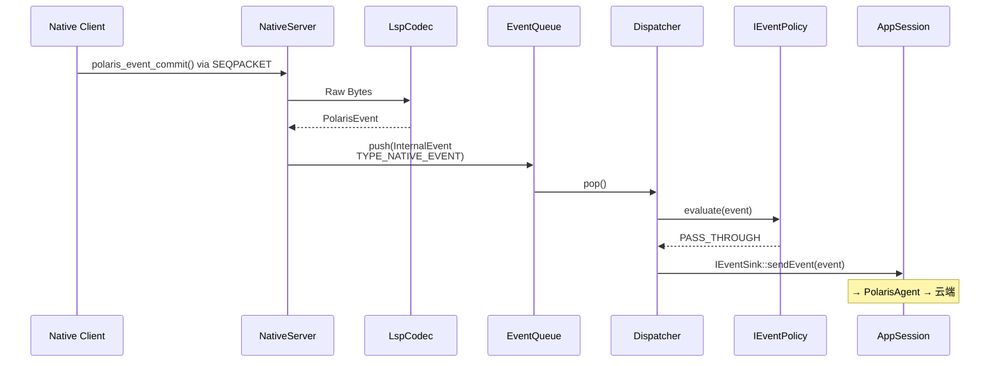
```mermaid
sequenceDiagram
    participant NC as Native Client
    participant NS as NativeServer
    participant Codec as LspCodec
    participant Q as EventQueue
    participant D as Dispatcher
    participant P as IEventPolicy
    participant AS as AppSession

    NC->>NS: polaris_event_commit() via SEQPACKET
    NS->>Codec: Raw Bytes
    Codec-->>NS: PolarisEvent
    NS->>Q: push(InternalEvent<br/>TYPE_NATIVE_EVENT)
    Q->>D: pop()
    D->>P: evaluate(event)
    P-->>D: PASS_THROUGH
    D->>AS: IEventSink::sendEvent(event)
    Note over AS: → PolarisAgent → 云端
```

1. **Source**: Native 进程调用 `polaris_event_commit()` → `libpolaris_client` 通过 SEQPACKET 连接发送至 `polaris_report`。
2. **Receive**: `NativeServer` accept 连接后创建 `NativeSession`，`NativeSession.readLoop()` 收到数据包 → 调用 `LspCodec` 解码 → 校验并构造 `InternalEvent(TYPE_NATIVE_EVENT)`。
3. **Queue**: Push `EventQueue`。
4. **Core**: `Dispatcher` Pop 事件 → 调用 `IEventPolicy::evaluate()` → 策略返回 `PASS_THROUGH` → 通过 `IEventSink::sendEvent()` 直接转发给 PolarisAgent。

### 5.2 事件联动 (Native → 联动执行 → 增强后转发 App)

当策略判定为 `ENRICH_THEN_FORWARD` 时，Dispatcher 先提交联动 Action 到线程池，等待异步执行完毕，将结果与原始事件合并后再转发。

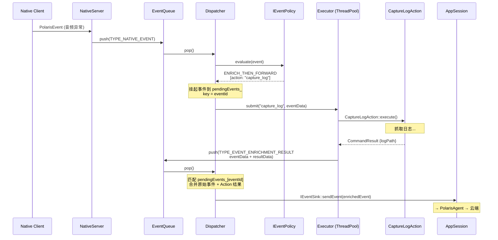
```mermaid
sequenceDiagram
    participant NC as Native Client
    participant NS as NativeServer
    participant Q as EventQueue
    participant D as Dispatcher
    participant P as IEventPolicy
    participant E as Executor (ThreadPool)
    participant A as CaptureLogAction
    participant AS as AppSession

    NC->>NS: PolarisEvent (音频异常)
    NS->>Q: push(TYPE_NATIVE_EVENT)
    Q->>D: pop()
    D->>P: evaluate(event)
    P-->>D: ENRICH_THEN_FORWARD<br/>[action: "capture_log"]

    Note over D: 挂起事件到 pendingEvents_<br/>key = eventId

    D->>E: submit("capture_log", eventData)
    E->>A: CaptureLogAction::execute()
    Note over A: 抓取日志...
    A-->>E: CommandResult {logPath}
    E->>Q: push(TYPE_EVENT_ENRICHMENT_RESULT<br/>eventData + resultData)
    Q->>D: pop()

    Note over D: 匹配 pendingEvents_[eventId]<br/>合并原始事件 + Action 结果

    D->>AS: IEventSink::sendEvent(enrichedEvent)
    Note over AS: → PolarisAgent → 云端
```

1. **Source**: Native 上报事件（如音频异常）。
2. **Receive**: 同 §5.1 步骤 2。
3. **Queue**: Push `EventQueue`。
4. **Core**: `Dispatcher` Pop 事件 → 调用 `IEventPolicy::evaluate()` → 策略返回 `ENRICH_THEN_FORWARD` 及需要执行的联动 Action 列表。
5. **Suspend**: `Dispatcher` 将原始事件存入 `pendingEvents_[eventId]`，提交联动 Action 到 `Executor` 线程池（携带原始 `eventData`）。Dispatcher **不阻塞**，继续处理队列中的其他事件。
6. **Execute**: Executor 线程池分配 worker thread → `ActionRegistry::create("capture_log")` → `CaptureLogAction::execute()` → 生成 `CommandResult`（含日志路径等产物）。
7. **Result Loop-back**: 执行完毕 → 封装 `InternalEvent(TYPE_EVENT_ENRICHMENT_RESULT)` 并携带原始 `eventData` 和 `resultData` → Push 回 `EventQueue`。
8. **Merge & Forward**: `Dispatcher` Pop 结果 → 通过 `eventData->eventId` 查找 `pendingEvents_` → 检查所有联动 Action 是否完成 → 全部完成后将原始事件与 Action 结果合并为增强事件 → 通过 `IEventSink::sendEvent()` 转发给 PolarisAgent。
9. **超时降级**: 若联动 Action 在 **30 秒** (可配置) 内未全部完成，Dispatcher 将原始事件 + 已完成的部分结果 + `"_enrichTimeout": true` 标记合并后仍然转发给 PolarisAgent，不丢弃事件。

> **关键设计**: Dispatcher 始终是**非阻塞**的。提交联动 Action 后立即继续处理队列中的后续事件，联动结果通过 `TYPE_EVENT_ENRICHMENT_RESULT` 异步回到队列，利用现有的 EventQueue 回路机制实现闭环。

### 5.3 命令执行闭环 (App → polarisd → App)

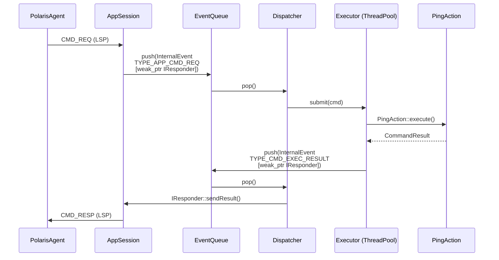
```mermaid
sequenceDiagram
    participant App as PolarisAgent
    participant AS as AppSession
    participant Q as EventQueue
    participant D as Dispatcher
    participant E as Executor (ThreadPool)
    participant A as PingAction

    App->>AS: CMD_REQ (LSP)
    AS->>Q: push(InternalEvent<br/>TYPE_APP_CMD_REQ<br/>[weak_ptr IResponder])
    Q->>D: pop()
    D->>E: submit(cmd)
    E->>A: PingAction::execute()
    A-->>E: CommandResult
    E->>Q: push(InternalEvent<br/>TYPE_CMD_EXEC_RESULT<br/>[weak_ptr IResponder])
    Q->>D: pop()
    D->>AS: IResponder::sendResult()
    AS->>App: CMD_RESP (LSP)
```

1. **Request**: App 的 `CommandManager.sendAsync("ping", ...)` → `DaemonTransport.sendRaw()` → `AppSession.readLoop()` 收到 → 调用 `LspCodec` 解码 → 构造 `InternalEvent(TYPE_APP_CMD_REQ)` 并携带 `weak_ptr<IResponder>` 指向 AppSession → Push `EventQueue`。
2. **Core**: `Dispatcher` Pop 请求 → 提交到 `Executor` 线程池执行，将 `weak_ptr<IResponder>` 随命令传入。
3. **Execute**: Executor 分配 worker thread → `ActionRegistry::create("ping")` → `PingAction::execute()` → 生成 `CommandResult`。
4. **Result Loop-back**: 执行完毕 → 封装 `InternalEvent(TYPE_CMD_EXEC_RESULT)` 并携带原始 `weak_ptr<IResponder>` → Push 回 `EventQueue`。
5. **Response**: `Dispatcher` Pop 结果 → `responder.lock()` 检查 AppSession 是否存活 → 若存活则调用 `IResponder::sendResult()` 回包；若已断开则丢弃结果。

> **关键设计**: Executor 自身**不调用** `IResponder::sendResult()`，它只负责将结果推回 `EventQueue`。所有回送决策由 `Dispatcher` 统一执行，保持"单一大脑"原则。

### 5.4 Host 命令转发闭环 (App → polarisd → Host → polarisd → App)

当 `CommandRequest.target == HOST` 时，polarisd 不在本地执行，而是将命令通过 PLP 转发给 Linux Host 执行，等待 Host 回复后将结果回送给 App。

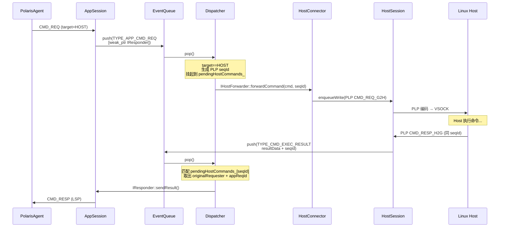
```mermaid
sequenceDiagram
    participant App as PolarisAgent
    participant AS as AppSession
    participant Q as EventQueue
    participant D as Dispatcher
    participant HC as HostConnector
    participant HS as HostSession
    participant H as Linux Host

    App->>AS: CMD_REQ (target=HOST)
    AS->>Q: push(TYPE_APP_CMD_REQ<br/>[weak_ptr IResponder])
    Q->>D: pop()

    Note over D: target==HOST<br/>生成 PLP seqId<br/>挂起到 pendingHostCommands_

    D->>HC: IHostForwarder::forwardCommand(cmd, seqId)
    HC->>HS: enqueueWrite(PLP CMD_REQ_G2H)
    HS->>H: PLP 编码 → VSOCK

    Note over H: Host 执行命令...

    H->>HS: PLP CMD_RESP_H2G (同 seqId)
    HS->>Q: push(TYPE_CMD_EXEC_RESULT<br/>resultData + seqId)
    Q->>D: pop()

    Note over D: 匹配 pendingHostCommands_[seqId]<br/>取出 originalRequester + appReqId

    D->>AS: IResponder::sendResult()
    AS->>App: CMD_RESP (LSP)
```

1. **Request**: App 发送 `CMD_REQ` (target=HOST) → AppSession 收到后构造 `InternalEvent(TYPE_APP_CMD_REQ)` 并携带 `weak_ptr<IResponder>` 指向 AppSession → Push `EventQueue`。
2. **Dispatch**: Dispatcher Pop 请求 → 检测 `target == HOST` → 生成 PLP `seqId` → 将 `{originalRequester, appReqId, createTimeMs}` 存入 `pendingHostCommands_[seqId]`。
3. **Forward**: 调用 `IHostForwarder::forwardCommand(cmd, seqId)` → HostConnector 将命令编码为 `PLP_CMD_REQ_G2H` 并通过 HostSession 的写队列异步发送到 Host。若 Host 断连，命令进入 HostConnector 的待发送队列排队（参见 §5.7）。
4. **Host Execute**: Linux Host 收到命令后执行，生成结果，以 `PLP_CMD_RESP_H2G` (携带相同 `seqId`) 回复。
5. **Result Receive**: HostSession.readLoop() 收到 PLP 回复 → PlpCodec 解码 → 构造 `InternalEvent(TYPE_CMD_EXEC_RESULT)` 并携带 `resultData` 和 `seqId` → Push `EventQueue`。
6. **Result Match**: Dispatcher Pop 结果 → 通过 `seqId` 查找 `pendingHostCommands_` → 若找到：取出 `originalRequester` 和 `appReqId` → 将 `resultData.reqId` 替换为 `appReqId`；若未找到 (已超时清理)：**静默丢弃**，不做任何处理。
7. **Response**: 调用 `IResponder::sendResult()` 将结果回送给 App。若 AppSession 已断开，丢弃结果。
8. **Timeout**: 若 Host 在 **15 秒** (`hostCmdTimeoutMs_`, 可配置) 内未回复，Dispatcher 的 `cleanExpiredHostCommands()` 执行以下操作：回送 `TIMEOUT` 错误给 App → 通知 `HostConnector::cancelPending(seqId)` 移除对应的排队命令 → 清理 `pendingHostCommands_` 条目。

> **超时分层设计**: HostConnector 的 `pendingQueue_` 超时为 **10 秒**，Dispatcher 的 `pendingHostCommands_` 超时为 **15 秒**。Dispatcher 超时 **严格大于** HostConnector 超时，确保 HostConnector 侧先超时丢弃未发送的命令，避免竞态条件。具体场景：
>
> | 场景 | HostConnector (10s) | Dispatcher (15s) | 结果 |
> | --- | --- | --- | --- |
> | Host 正常回复 (< 10s) | 正常发送 | 收到回复，匹配成功 | ✅ 正常 |
> | Host 断连 > 10s | 队列超时丢弃 | 15s 后超时清理，回送 TIMEOUT | ✅ 一致 |
> | Host 在 9.5s 重连 | drain 队列发送 | 等待回复或 15s 超时 | ✅ 无竞态 |
> | Dispatcher 超时 (15s) 但 Host 回复晚到 | N/A | `pendingHostCommands_` 已清理 | ✅ 静默丢弃 |

> **关键设计**: App 侧的 `reqId` 和 PLP 侧的 `seqId` 是两个独立的序列号空间。Dispatcher 通过 `pendingHostCommands_` 表建立映射关系，对 App 完全透明——App 只看到自己的 `reqId` 请求和响应，不感知中间经过了 Host 转发。Dispatcher 对超时命令的处理遵循"简单鲁棒"原则：超时即清理 + 回送错误，晚到的结果静默丢弃，不做复杂的状态同步。

### 5.5 Host 事件转发 (Host → polarisd → App)

Host 事件与 Native 事件走相同的策略判定流程（透传或联动），区别仅在于入口协议为 PLP。

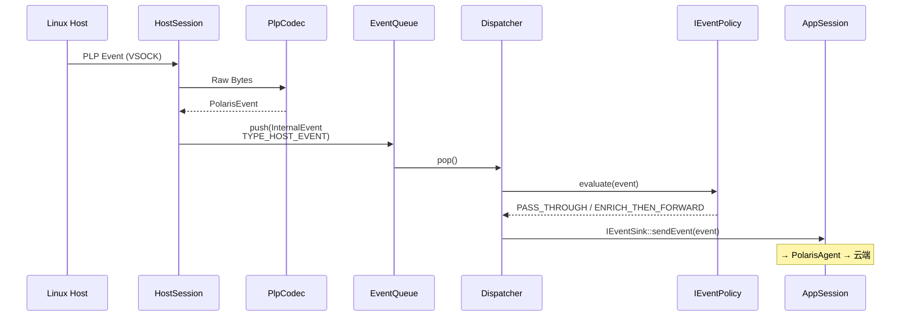
```mermaid
sequenceDiagram
    participant H as Linux Host
    participant HS as HostSession
    participant Codec as PlpCodec
    participant Q as EventQueue
    participant D as Dispatcher
    participant P as IEventPolicy
    participant AS as AppSession

    H->>HS: PLP Event (VSOCK)
    HS->>Codec: Raw Bytes
    Codec-->>HS: PolarisEvent
    HS->>Q: push(InternalEvent<br/>TYPE_HOST_EVENT)
    Q->>D: pop()
    D->>P: evaluate(event)
    P-->>D: PASS_THROUGH / ENRICH_THEN_FORWARD
    D->>AS: IEventSink::sendEvent(event)
    Note over AS: → PolarisAgent → 云端
```

1. **Receive**: `HostConnector` 通过 VSOCK 连接到 Host (CID=2, Port=9001)，`HostSession.readLoop()` 收到 PLP 包。
2. **Decode**: 调用 `PlpCodec` 校验 PLP Header (Magic, Version, CRC32) → 解码 JSON → 构造 `InternalEvent(TYPE_HOST_EVENT)`。
3. **Queue**: Push `EventQueue`。
4. **Core**: `Dispatcher` Pop 事件 → 调用 `IEventPolicy::evaluate()` → 根据策略结果透传或联动（流程同 §5.1 或 §5.2）。

### 5.6 App 离线事件持久化 (polarisd → 落盘 → App 恢复后拉取)

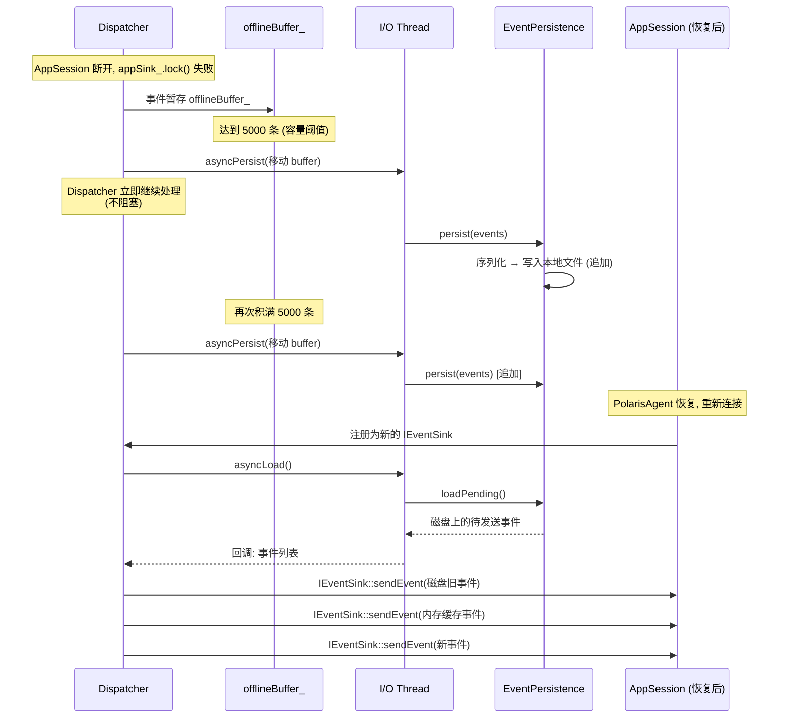
```mermaid
sequenceDiagram
    participant D as Dispatcher
    participant BUF as offlineBuffer_
    participant IO as I/O Thread
    participant EP as EventPersistence
    participant AS as AppSession (恢复后)

    Note over D: AppSession 断开, appSink_.lock() 失败
    D->>BUF: 事件暂存 offlineBuffer_

    Note over BUF: 达到 5000 条 (容量阈值)
    D->>IO: asyncPersist(移动 buffer)
    Note over D: Dispatcher 立即继续处理<br/>(不阻塞)
    IO->>EP: persist(events)
    EP->>EP: 序列化 → 写入本地文件 (追加)

    Note over BUF: 再次积满 5000 条
    D->>IO: asyncPersist(移动 buffer)
    IO->>EP: persist(events) [追加]

    Note over AS: PolarisAgent 恢复, 重新连接
    AS->>D: 注册为新的 IEventSink
    D->>IO: asyncLoad()
    IO->>EP: loadPending()
    EP-->>IO: 磁盘上的待发送事件
    IO-->>D: 回调: 事件列表
    D->>AS: IEventSink::sendEvent(磁盘旧事件)
    D->>AS: IEventSink::sendEvent(内存缓存事件)
    D->>AS: IEventSink::sendEvent(新事件)
```

1. **App 断连**: `Dispatcher` 检测到 `appSink_.lock()` 失败，事件暂存到内存 `offlineBuffer_`。
2. **容量触发落盘**: 当 `offlineBuffer_` 积累达到 **5000 条** (可配置，`PERSIST_FLUSH_THRESHOLD`)，Dispatcher 将 buffer 内容**移动** (`std::move`) 给 `EventPersistence` 的独立 I/O 线程，由后台线程完成序列化和文件写入 (追加模式)。Dispatcher **立即清空 buffer 并继续处理**，不阻塞事件循环。
3. **多次落盘**: App 长时间离线期间，buffer 可能多次达到阈值，每次触发追加写入。落盘文件采用 JSON Lines 格式，支持多次追加。
4. **落盘路径**: 可通过配置变量 `PERSIST_FILE_PATH` 指定，默认 `/data/local/tmp/polarisd_events.dat`。
5. **App 恢复**: PolarisAgent 重启后重新连接 AppServer → 新的 AppSession 注册为 `IEventSink` → Dispatcher 触发异步加载 → I/O 线程读取磁盘文件 → 回调 Dispatcher → 按时间顺序依次发送：磁盘旧事件 → 当前 offlineBuffer_ 中的缓存事件 → 后续新事件。
6. **清理**: 回放成功后，`EventPersistence::clear()` 删除磁盘文件。
7. **进程退出保护**: 收到 SIGTERM 时，关闭流程中会同步将 `offlineBuffer_` 中剩余事件落盘 (此时允许阻塞，因为进程即将退出)。

### 5.7 Host 断连期间命令排队

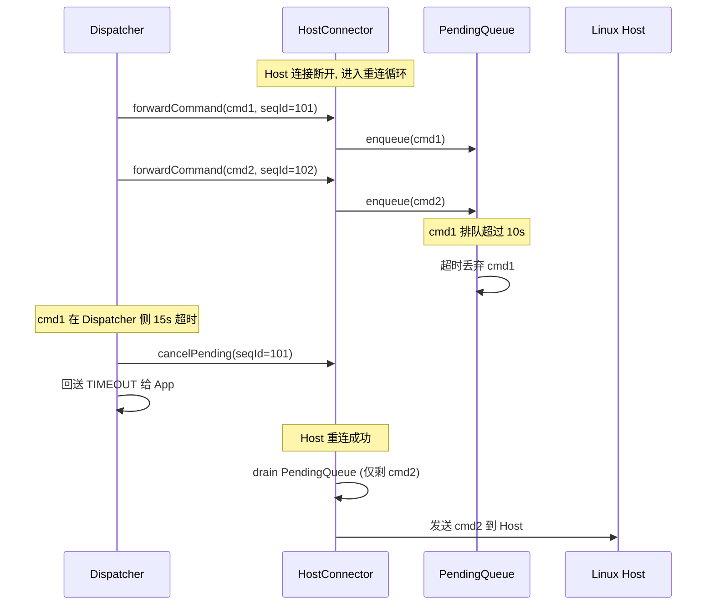
```mermaid
sequenceDiagram
    participant D as Dispatcher
    participant HC as HostConnector
    participant PQ as PendingQueue
    participant H as Linux Host
    Note over HC: Host 连接断开, 进入重连循环

    D->>HC: forwardCommand(cmd1, seqId=101)
    HC->>PQ: enqueue(cmd1)
    D->>HC: forwardCommand(cmd2, seqId=102)
    HC->>PQ: enqueue(cmd2)

    Note over PQ: cmd1 排队超过 10s
    PQ->>PQ: 超时丢弃 cmd1

    Note over D: cmd1 在 Dispatcher 侧 15s 超时
    D->>HC: cancelPending(seqId=101)
    D->>D: 回送 TIMEOUT 给 App

    Note over HC: Host 重连成功
    HC->>HC: drain PendingQueue (仅剩 cmd2)
    HC->>H: 发送 cmd2 到 Host
```

1. **Host 断连**: HostConnector 检测到 VSOCK 连接断开，进入重连循环。
2. **命令排队**: 重连期间收到的 `forwardCommand()` 调用不立即失败，而是放入 HostConnector 内部的 **有界待发送队列** (`pendingQueue_`)。
3. **超时分层**: HostConnector 队列超时 **10 秒**，Dispatcher `pendingHostCommands_` 超时 **15 秒**。两层超时的时序关系确保无竞态：
   * HostConnector 先超时 → 命令从 `pendingQueue_` 中移除，不会被发送给 Host。
   * Dispatcher 后超时 → 回送 `TIMEOUT` 给 App，调用 `HostConnector::cancelPending(seqId)` 清理残余 (防御性)。
   * 若 Host 回复晚于 Dispatcher 超时，`pendingHostCommands_` 已清理，结果被静默丢弃。
4. **重连成功**: HostConnector 重建 HostSession 后，**drain** 待发送队列中未超时的命令，逐个通过新 HostSession 发送。
5. **队列满**: 若排队期间队列已满 (100 条, 可配置)，新命令直接返回 `-EAGAIN`，Dispatcher 回送错误给请求方。

---

## 6. 内部关键类和数据结构定义

### 6.1 InternalEvent (内部总线对象)

这是内部 `EventQueue` 中流转的唯一对象，用于屏蔽外部差异。

```cpp
namespace polarisd {

struct IResponder;

struct InternalEvent {
    enum Type {
        TYPE_NATIVE_EVENT,
        TYPE_HOST_EVENT,
        TYPE_APP_CMD_REQ,
        TYPE_HOST_CMD_REQ,
        TYPE_CMD_EXEC_RESULT,
        TYPE_EVENT_ENRICHMENT_RESULT,
        TYPE_SYSTEM_EXIT = 999
    };

    Type type = TYPE_SYSTEM_EXIT;
    std::shared_ptr<polaris::PolarisEvent>    eventData;
    std::shared_ptr<polaris::CommandRequest>  cmdData;
    std::shared_ptr<polaris::CommandResult>   resultData;
    std::weak_ptr<IResponder>                 responder;

    // 判断是否为 CMD 类型 (CMD 类型不被 EventQueue 丢弃)
    bool isCommand() const {
        return type == TYPE_APP_CMD_REQ || type == TYPE_HOST_CMD_REQ;
    }

    // 禁止拷贝，强制移动
    InternalEvent() = default;
    InternalEvent(InternalEvent&&) noexcept = default;
    InternalEvent& operator=(InternalEvent&&) noexcept = default;
    InternalEvent(const InternalEvent&) = delete;
    InternalEvent& operator=(const InternalEvent&) = delete;
};

} // namespace polarisd
```

> **关联机制**: 事件联动场景中，`TYPE_EVENT_ENRICHMENT_RESULT` 通过 `eventData->eventId` 与 Dispatcher 内部的 `pendingEvents_` 表关联，无需额外字段。

### 6.2 IResponder (命令结果回送接口)

```cpp
namespace polarisd {

struct IResponder {
    virtual ~IResponder() = default;
    virtual void sendResult(std::shared_ptr<polaris::CommandResult> result) = 0;
};

} // namespace polarisd
```

### 6.3 IEventSink (事件下发接口)

```cpp
namespace polarisd {

struct IEventSink {
    virtual ~IEventSink() = default;
    virtual void sendEvent(std::shared_ptr<polaris::PolarisEvent> event) = 0;
};

} // namespace polarisd
```

### 6.4 IEventPolicy (事件策略接口)

```cpp
namespace polarisd {

struct EventDecision {
    enum Type { PASS_THROUGH, ENRICH_THEN_FORWARD };
    Type type = PASS_THROUGH;
    std::vector<EventAction> actions;

    static EventDecision passThrough() { return { PASS_THROUGH, {} }; }
    static EventDecision enrich(std::vector<EventAction> actions) {
        return { ENRICH_THEN_FORWARD, std::move(actions) };
    }
};

struct IEventPolicy {
    virtual ~IEventPolicy() = default;
    virtual EventDecision evaluate(const polaris::PolarisEvent& event) = 0;
};

} // namespace polarisd
```

### 6.5 IHostForwarder (Host 命令转发接口)

```cpp
namespace polarisd {

struct IHostForwarder {
    virtual ~IHostForwarder() = default;
    virtual void forwardCommand(std::shared_ptr<polaris::CommandRequest> cmd,
                                uint32_t seqId) = 0;
    // Dispatcher 超时时调用, 移除 pendingQueue_ 中对应 seqId 的命令
    virtual void cancelPending(uint32_t seqId) = 0;
};

} // namespace polarisd
```

### 6.6 Dispatcher 内部状态

```cpp
// 挂起事件表 (事件联动)
struct PendingEnrichment {
    std::shared_ptr<polaris::PolarisEvent>                  originalEvent;
    int                                                     totalActions;
    int                                                     completedActions;
    std::vector<std::shared_ptr<polaris::CommandResult>>    results;
    uint64_t                                                createTimeMs;
};

// 挂起命令表 (HOST 目标命令)
struct PendingHostCommand {
    std::weak_ptr<IResponder>   originalRequester;
    uint32_t                    appReqId;
    uint64_t                    createTimeMs;
};

std::unordered_map<uint64_t, PendingEnrichment>     pendingEvents_;         // key: eventId
std::unordered_map<uint32_t, PendingHostCommand>    pendingHostCommands_;   // key: PLP seqId

// App 离线状态追踪
bool        appOffline_ = false;            // App 是否离线
uint32_t    persistFileIndex_ = 0;          // 落盘文件追加计数
```

### 6.7 Session 接口实现关系

| Session | IResponder | IEventSink | IHostForwarder | 说明 |
| --- | --- | --- | --- | --- |
| **AppSession** | ✅ | ✅ | ✗ | 命令结果回送 + 事件接收 |
| **HostSession** | ✅ | ✗ | ✅ | 命令结果回送 + 命令转发到 Host |
| **NativeSession** | ✗ | ✗ | ✗ | 仅上报，不接收任何下行数据 |

### 6.8 Dispatcher 事件路由规则

| 事件类型 | 处理方式 |
| --- | --- |
| `TYPE_NATIVE_EVENT` | → `IEventPolicy::evaluate()` → 透传 (via `IEventSink`) 或联动 (via `Executor`) |
| `TYPE_HOST_EVENT` | → `IEventPolicy::evaluate()` → 透传 (via `IEventSink`) 或联动 (via `Executor`) |
| `TYPE_APP_CMD_REQ` (target=LOCAL) | 本地执行 (via `Executor`)，结果通过 `IResponder` 回送 |
| `TYPE_APP_CMD_REQ` (target=HOST) | 转发到 Host (via `IHostForwarder`)，挂起等待 Host 回复 |
| `TYPE_HOST_CMD_REQ` | 本地执行 (via `Executor`)，结果通过 `IResponder` 回送 |
| `TYPE_CMD_EXEC_RESULT` | → 原始请求方 (via `IResponder`) |
| `TYPE_EVENT_ENRICHMENT_RESULT` | → 匹配 `pendingEvents_[eventId]`，合并结果，全部完成后通过 `IEventSink` 转发 |
| `TYPE_SYSTEM_EXIT` | 终止事件循环 |

### 6.9 Dispatcher 核心处理伪代码

```cpp
void Dispatcher::processEvent(InternalEvent& ev) {
    switch (ev.type) {

    case TYPE_NATIVE_EVENT:
    case TYPE_HOST_EVENT: {
        auto decision = policy_->evaluate(*ev.eventData);

        if (decision.type == EventDecision::PASS_THROUGH) {
            deliverEvent(ev.eventData);

        } else if (decision.type == EventDecision::ENRICH_THEN_FORWARD) {
            uint64_t id = ev.eventData->eventId;
            pendingEvents_[id] = {
                ev.eventData,
                (int)decision.actions.size(),
                0, {},
                currentTimeMs()
            };
            for (auto& action : decision.actions)
                executor_->submitForEnrichment(action, ev.eventData);
        }
        break;
    }

    case TYPE_APP_CMD_REQ: {
        if (ev.cmdData->target == polaris::CommandTarget::LOCAL) {
            executor_->submitCommand(ev.cmdData, ev.responder);
        } else if (ev.cmdData->target == polaris::CommandTarget::HOST) {
            if (auto fwd = hostForwarder_.lock()) {
                uint32_t seqId = nextPlpSeqId_++;
                pendingHostCommands_[seqId] = {
                    ev.responder, ev.cmdData->reqId, currentTimeMs()
                };
                fwd->forwardCommand(ev.cmdData, seqId);
            } else {
                if (auto resp = ev.responder.lock())
                    resp->sendResult(polaris::CommandResult::makeError(
                        ev.cmdData->reqId, -1, "Host not connected"));
            }
        }
        break;
    }

    case TYPE_HOST_CMD_REQ:
        executor_->submitCommand(ev.cmdData, ev.responder);
        break;

    case TYPE_CMD_EXEC_RESULT: {
        // HOST 命令结果: 通过 seqId 匹配
        // 若 pendingHostCommands_ 中找不到 (已超时清理), 静默丢弃
        if (auto resp = ev.responder.lock())
            resp->sendResult(ev.resultData);
        break;
    }

    case TYPE_EVENT_ENRICHMENT_RESULT: {
        uint64_t id = ev.eventData->eventId;
        auto it = pendingEvents_.find(id);
        if (it == pendingEvents_.end()) break;

        auto& pending = it->second;
        pending.completedActions++;
        pending.results.push_back(ev.resultData);

        if (pending.completedActions == pending.totalActions) {
            auto enriched = mergeResults(pending.originalEvent, pending.results);
            deliverEvent(enriched);
            pendingEvents_.erase(it);
        }
        break;
    }

    case TYPE_SYSTEM_EXIT:
        running_ = false;
        break;
    }

    cleanExpiredEnrichments();    // 超时 30s 降级转发
    cleanExpiredHostCommands();   // 超时 15s 回送错误 + 通知 HostConnector 清理
}

// ──────────────────────────────────────────────────────
// App 离线感知的事件投递 (容量触发异步落盘)
// ──────────────────────────────────────────────────────
void Dispatcher::deliverEvent(std::shared_ptr<polaris::PolarisEvent> event) {
    if (auto sink = appSink_.lock()) {
        // App 在线: 发送事件
        if (appOffline_) {
            // 刚恢复: 先异步回放磁盘旧数据 + 内存缓存
            appOffline_ = false;
            replayPersistedEventsAsync();   // I/O 线程加载磁盘 → 回调发送
            for (auto& cached : offlineBuffer_)
                sink->sendEvent(cached);
            offlineBuffer_.clear();
        }
        sink->sendEvent(event);
    } else {
        // App 离线: 暂存内存
        appOffline_ = true;
        offlineBuffer_.push_back(event);

        // 容量触发异步落盘: buffer 达到阈值时移交给 I/O 线程
        if (offlineBuffer_.size() >= persistFlushThreshold_) {
            persistence_->asyncPersist(std::move(offlineBuffer_));  // 移动, 不拷贝
            offlineBuffer_.clear();                                  // 移动后为空, 显式 clear
            offlineBuffer_.reserve(persistFlushThreshold_);          // 预分配下一轮
        }
    }
}

// ──────────────────────────────────────────────────────
// 联动超时降级: 原事件 + 部分结果 + timeout 标记
// ──────────────────────────────────────────────────────
void Dispatcher::cleanExpiredEnrichments() {
    auto now = currentTimeMs();
    for (auto it = pendingEvents_.begin(); it != pendingEvents_.end(); ) {
        if (now - it->second.createTimeMs > ENRICHMENT_TIMEOUT_MS) {
            auto enriched = mergeResults(it->second.originalEvent,
                                          it->second.results);
            enriched->params += ", \"_enrichTimeout\": true";
            deliverEvent(enriched);
            it = pendingEvents_.erase(it);
        } else {
            ++it;
        }
    }
}

// ──────────────────────────────────────────────────────
// Host 命令超时 (15s): 回送 TIMEOUT + 通知 HostConnector 移除 seqId
// ──────────────────────────────────────────────────────
void Dispatcher::cleanExpiredHostCommands() {
    auto now = currentTimeMs();
    for (auto it = pendingHostCommands_.begin(); it != pendingHostCommands_.end(); ) {
        if (now - it->second.createTimeMs > HOST_CMD_TIMEOUT_MS) {
            // 回送 TIMEOUT 给 App
            if (auto resp = it->second.originalRequester.lock())
                resp->sendResult(polaris::CommandResult::makeError(
                    it->second.appReqId, -2, "Host command timeout"));

            // 通知 HostConnector 移除排队中的该命令 (防御性清理)
            if (auto fwd = hostForwarder_.lock())
                fwd->cancelPending(it->first);  // seqId

            it = pendingHostCommands_.erase(it);
        } else {
            ++it;
        }
    }
}
```

### 6.10 已实现的 Action

| Action 名称 | 类 | 触发方式 | 说明 |
| --- | --- | --- | --- |
| `ping` | `PingAction` | 命令请求 | 链路连通性测试，直接返回 `{"status": "pong"}` |
| `capture_log` | `CaptureLogAction` | 事件联动 | 抓取指定模块日志，返回文件路径 |

新增 Action 只需：继承 `IAction` → 实现 `execute()` → 在 `ActionRegistry` 中注册。命令请求和事件联动共用同一套 Action 体系。

---

## 7. Java 层 (PolarisAgent APK & polaris-sdk)

### 7.1 polaris-sdk (Java 客户端 SDK)

提供给第三方 App 调用的 Java SDK，通过 AIDL Binder 与 PolarisAgent 通信。

| 组件 | 说明 |
| --- | --- |
| `IPolarisAgentService.aidl` | AIDL 接口定义（含事件上报 + 命令请求） |
| `PolarisAgentManager` | SDK 入口，单例模式，自动绑定 Service，支持 DeathRecipient 断线重连 |
| `PolarisEvent` | 事件数据 Parcelable，支持 `fromJson()` 反序列化 |
| `EventID` | 事件 ID 枚举 |
| `RateLimiter` | 限频工具 |

### 7.2 PolarisAgent APK (系统特权应用)

作为 polarisd 在 Java Framework 侧的代理，安装在 `/system_ext/priv-app/`，使用 platform 签名。

#### 7.2.1 整体架构视图

PolarisAgent 采用与 polarisd **对称的处理管线**：统一入口队列 → 策略联动 → 落盘 → 上传/旁路。

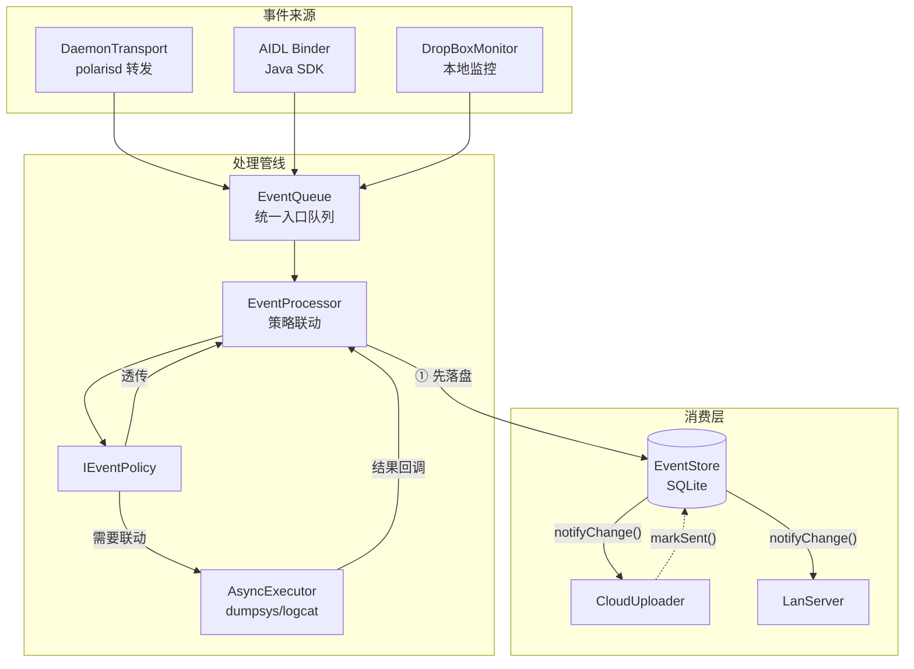
```mermaid
graph TB
    subgraph Sources["事件来源"]
        DT[DaemonTransport<br/>polarisd 转发]
        SDK[AIDL Binder<br/>Java SDK]
        MON[DropBoxMonitor<br/>本地监控]
    end

    subgraph Pipeline["处理管线"]
        EQ[EventQueue<br/>统一入口队列]
        EP[EventProcessor<br/>策略联动]
        POLICY[IEventPolicy]
        EXEC[AsyncExecutor<br/>dumpsys/logcat]
    end

    subgraph Consumers["消费层"]
        ES[(EventStore<br/>SQLite)]
        CU[CloudUploader]
        LS[LanServer]
    end

    DT --> EQ
    SDK --> EQ
    MON --> EQ

    EQ --> EP
    EP --> POLICY
    POLICY -- "需要联动" --> EXEC
    EXEC -- "结果回调" --> EP
    POLICY -- "透传" --> EP

    EP -- "① 先落盘" --> ES
    ES -- "notifyChange()" --> CU
    ES -- "notifyChange()" --> LS
    CU -. "markSent()" .-> ES
```

#### 7.2.2 事件来源

| 来源 | 入口组件 | 协议 | 说明 |
| --- | --- | --- | --- |
| polarisd | DaemonTransport | LSP (SEQPACKET) | Native/Host 事件经 polarisd 策略联动后转发 |
| Java SDK | PolarisAgentService (AIDL) | Binder IPC | 第三方 App 通过 `PolarisAgentManager.report()` 上报 |
| 本地 Monitor | DropBoxMonitor 等 | 进程内直接调用 | ANR、Crash 等系统事件自采集 |

三个来源统一调用 `EventQueue.put(event)` 汇入处理管线。

#### 7.2.3 核心组件

| 组件 | 职责 |
| --- | --- |
| **PolarisAgentService** | Android Service (START_STICKY)，暴露 AIDL Binder，初始化所有模块，接收 SDK 事件入队 |
| **DaemonTransport** | 通过 `LocalSocket` (SEQPACKET) 连接 polarisd 的 `polaris_bridge` socket，收到事件后入队 |
| **LspDecoder** | Java 侧 LSP 分帧解码器，4MB ByteBuffer |
| **CommandManager** | 命令管理器，生成 ReqID，维护 `ConcurrentHashMap<ReqId, CompletableFuture>` 挂起队列 |
| **EventQueue** | `LinkedBlockingQueue`，三个来源统一入口，单消费者 (EventProcessor) |
| **EventProcessor** | **Java 侧的 Dispatcher**。单线程事件循环，调用 `IEventPolicy` 策略判定，透传或联动后投递给消费层 |
| **IEventPolicy** | 事件策略接口。根据 eventId 判定透传或联动 (抓取 dumpsys、logcat 等) |
| **AsyncExecutor** | `ThreadPoolExecutor`，执行联动任务 (dumpsys、logcat)，结果回调给 EventProcessor |
| **EventStore** | **SQLite WAL 模式**。所有事件先落盘，是唯一的数据持久化层 |
| **CloudUploader** | 通过 `ContentObserver` 监听 EventStore 数据库变化，收到通知后查询 `status=0` 的记录批量上传，成功后标记 `status=1` |
| **LanServer** | **局域网 TCP 服务端** (预留)。通过 `ContentObserver` 监听 EventStore 变化，收到通知后读取新事件发送给 PC 客户端，不修改记录状态 |

### 7.3 DaemonTransport

#### 线程模型

* **Read Thread** (`Polaris-DaemonTransport-Read`): 连接循环 + 阻塞读取，断线后 5 秒自动重连。收到事件后调用 `eventQueue.put(event)` 入队。
* **Write Executor**: `SingleThreadExecutor`，串行化所有写操作，避免并发写 Socket。

#### CommandManager 异步模型

```
sendAsync("ping", null)
    ├── 生成 reqId (AtomicInteger)
    ├── 创建 CompletableFuture
    ├── 放入 mPendingMap
    ├── 启动 Timeout 看门狗 (ScheduledExecutorService)
    └── 打包 LSP 包 → DaemonTransport.sendRaw()

onResponse(result)           // DaemonTransport 读线程回调
    ├── mPendingMap.remove(reqId)
    └── future.complete(result)  // 唤醒调用者
```

### 7.4 EventProcessor (策略联动处理器)

EventProcessor 是 PolarisAgent 的**事件处理核心**，与 polarisd 的 Dispatcher 对称设计。

#### 7.4.1 IEventPolicy (Java 侧策略接口)

```java
public interface IEventPolicy {
    EventDecision evaluate(PolarisEvent event);
}

public class EventDecision {
    public enum Type { PASS_THROUGH, ENRICH_THEN_FORWARD }

    public final Type type;
    public final List<EnrichAction> actions;

    public static EventDecision passThrough() { ... }
    public static EventDecision enrich(List<EnrichAction> actions) { ... }
}

public class EnrichAction {
    public final String action;     // 如 "dumpsys", "logcat"
    public final String args;       // 如 "audio", "-d -t 30s"
}
```

#### 7.4.2 处理流程

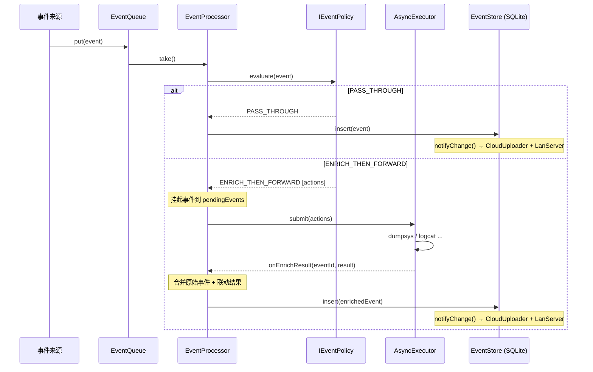
```mermaid
sequenceDiagram
    participant SRC as 事件来源
    participant EQ as EventQueue
    participant EP as EventProcessor
    participant P as IEventPolicy
    participant AE as AsyncExecutor
    participant ES as EventStore (SQLite)

    SRC->>EQ: put(event)
    EQ->>EP: take()
    EP->>P: evaluate(event)

    alt PASS_THROUGH
        P-->>EP: PASS_THROUGH
        EP->>ES: insert(event)
        Note over ES: notifyChange() → CloudUploader + LanServer
    else ENRICH_THEN_FORWARD
        P-->>EP: ENRICH_THEN_FORWARD [actions]
        Note over EP: 挂起事件到 pendingEvents
        EP->>AE: submit(actions)
        AE->>AE: dumpsys / logcat ...
        AE-->>EP: onEnrichResult(eventId, result)
        Note over EP: 合并原始事件 + 联动结果
        EP->>ES: insert(enrichedEvent)
        Note over ES: notifyChange() → CloudUploader + LanServer
    end
```

#### 7.4.3 核心伪代码

```java
public class EventProcessor implements Runnable {
    private final LinkedBlockingQueue<PolarisEvent> eventQueue;
    private final IEventPolicy policy;
    private final AsyncExecutor asyncExecutor;
    private final EventStore eventStore;
    private final ConcurrentHashMap<Long, PendingEnrichment> pendingEvents;

    private static final long ENRICH_TIMEOUT_MS = 30_000;  // 30s

    @Override
    public void run() {
        while (running) {
            PolarisEvent event = eventQueue.take();
            processEvent(event);
            cleanExpiredEnrichments();
        }
    }

    private void processEvent(PolarisEvent event) {
        EventDecision decision = policy.evaluate(event);

        if (decision.type == PASS_THROUGH) {
            deliverToConsumers(event);

        } else if (decision.type == ENRICH_THEN_FORWARD) {
            PendingEnrichment pending = new PendingEnrichment(
                event, decision.actions.size());
            pendingEvents.put(event.eventId, pending);

            for (EnrichAction action : decision.actions) {
                asyncExecutor.submit(action, event.eventId, this::onEnrichResult);
            }
        }
    }

    // AsyncExecutor 回调 (在 worker 线程, 通过 eventQueue 回到主线程)
    void onEnrichResult(long eventId, EnrichResult result) {
        PendingEnrichment pending = pendingEvents.get(eventId);
        if (pending == null) return;

        synchronized (pending) {
            pending.results.add(result);
            pending.completedActions++;

            if (pending.completedActions == pending.totalActions) {
                PolarisEvent enriched = mergeResults(pending.originalEvent,
                                                     pending.results);
                deliverToConsumers(enriched);
                pendingEvents.remove(eventId);
            }
        }
    }

    // 投递给消费层: 写入 SQLite 后由 ContentObserver 通知 CloudUploader 和 LanServer
    private void deliverToConsumers(PolarisEvent event) {
        eventStore.insert(event);   // 内部触发 notifyChange()
    }

    // 联动超时降级: 30s 后发送原事件 + 已完成的部分结果 + timeout 标记
    private void cleanExpiredEnrichments() {
        long now = SystemClock.elapsedRealtime();
        for (Map.Entry<Long, PendingEnrichment> entry : pendingEvents.entrySet()) {
            PendingEnrichment pending = entry.getValue();
            if (now - pending.createTimeMs > ENRICH_TIMEOUT_MS) {
                PolarisEvent enriched = mergeResults(pending.originalEvent,
                                                     pending.results);
                enriched.params.put("_enrichTimeout", true);
                deliverToConsumers(enriched);
                pendingEvents.remove(entry.getKey());
            }
        }
    }
}
```

### 7.5 EventStore (SQLite 持久化)

EventStore 是 PolarisAgent 的**唯一数据持久化层**。所有事件先写入 SQLite，写入后通过 `ContentResolver.notifyChange()` 通知 CloudUploader。

#### 7.5.1 设计参数

| 要素 | 说明 |
| --- | --- |
| **数据库** | SQLite WAL 模式，存储在 App 私有目录 |
| **ContentProvider** | 通过 `EventContentProvider` 暴露 URI，供 `ContentObserver` 监听变化 |
| **写入时机** | EventProcessor 处理完毕后**同步写入** (每条事件)，写入后触发 `notifyChange()` |
| **批量优化** | 高频场景下可开启批量写入模式 (攒 N 条或 T 毫秒后 batch commit)，batch 结束后统一触发一次 `notifyChange()` |
| **最大记录数** | 10000 条 (可配置)，超限时清理最旧的已发送记录 |
| **保留策略** | 已发送记录保留 7 天后自动清理 |

#### 7.5.2 ContentProvider URI

```
content://com.voyah.polaris.agent.provider/events
```

| URI 路径 | 操作 | 说明 |
| --- | --- | --- |
| `/events` | insert / query / update | 事件表 CRUD |
| `/events/pending` | query | 快捷查询 `status=0` 的待发送记录 |
| `/events/{id}` | update | 更新单条记录状态 |

#### 7.5.3 表结构

```sql
CREATE TABLE events (
    id          INTEGER PRIMARY KEY AUTOINCREMENT,
    event_id    INTEGER NOT NULL,               -- PolarisEvent.eventId
    event_json  TEXT NOT NULL,                   -- 完整事件 JSON
    timestamp   INTEGER NOT NULL,               -- PolarisEvent.timestamp
    status      INTEGER NOT NULL DEFAULT 0,     -- 0=待发送, 1=已发送
    retry_count INTEGER NOT NULL DEFAULT 0,     -- 云端上传重试次数
    created_at  INTEGER NOT NULL                -- 入库时间 (ms)
);

CREATE INDEX idx_status_timestamp ON events(status, timestamp);
CREATE INDEX idx_created_at ON events(created_at);
```

#### 7.5.4 核心接口

```java
public class EventStore {
    private static final Uri CONTENT_URI =
        Uri.parse("content://com.voyah.polaris.agent.provider/events");

    // 写入 (写入后自动 notifyChange)
    void insert(PolarisEvent event);
    void insertBatch(List<PolarisEvent> events);    // 批量写入 (事务), batch 完成后统一通知

    // CloudUploader 读取
    List<EventRecord> queryPending(int limit);      // status=0, ORDER BY timestamp ASC
    void markSent(long id);                         // status → 1
    void incrementRetry(long id);                   // retry_count++

    // LanServer 读取 (只读, 不改变状态)
    List<EventRecord> queryAfter(long afterId);     // id > afterId, ORDER BY id ASC

    // 清理
    void cleanSentOlderThan(long retentionMs);      // 清理已发送的过期记录
    void cleanOldestSentIfOverLimit(int maxRecords); // 超限时清理最旧已发送记录

    // 统计
    int pendingCount();
    int totalCount();
}
```

写入触发通知:

```java
// EventStore.insert() 内部
void insert(PolarisEvent event) {
    db.insert("events", null, toContentValues(event));
    context.getContentResolver().notifyChange(CONTENT_URI, null);
}
```

### 7.6 CloudUploader (云端上传)

CloudUploader 通过 `ContentObserver` 监听 EventStore 的数据变化。收到通知后查询待发送记录并批量上传，空闲时零 CPU 开销。

#### 7.6.1 数据流

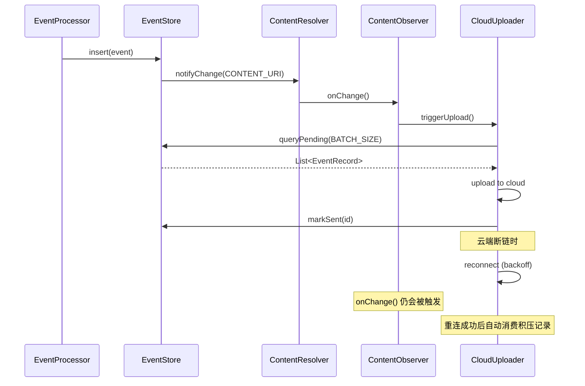
```mermaid
sequenceDiagram
    participant EP as EventProcessor
    participant ES as EventStore
    participant CR as ContentResolver
    participant CO as ContentObserver
    participant CU as CloudUploader

    EP->>ES: insert(event)
    ES->>CR: notifyChange(CONTENT_URI)
    CR->>CO: onChange()
    CO->>CU: triggerUpload()
    CU->>ES: queryPending(BATCH_SIZE)
    ES-->>CU: List<EventRecord>
    CU->>CU: upload to cloud
    CU->>ES: markSent(id)

    Note over CU: 云端断链时
    CU->>CU: reconnect (backoff)
    Note over CO: onChange() 仍会被触发
    Note over CU: 重连成功后自动消费积压记录
```

#### 7.6.2 状态机

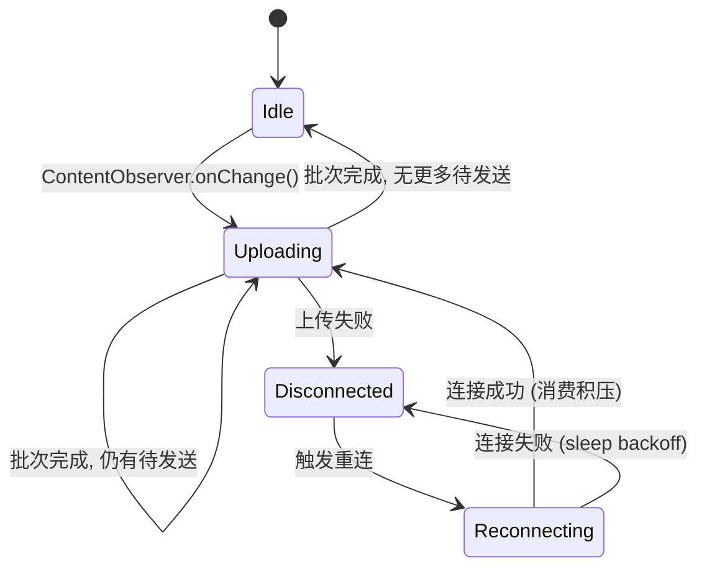
```mermaid
stateDiagram-v2
    [*] --> Idle
    Idle --> Uploading: ContentObserver.onChange()
    Uploading --> Idle: 批次完成, 无更多待发送
    Uploading --> Uploading: 批次完成, 仍有待发送
    Uploading --> Disconnected: 上传失败
    Disconnected --> Reconnecting: 触发重连
    Reconnecting --> Uploading: 连接成功 (消费积压)
    Reconnecting --> Disconnected: 连接失败 (sleep backoff)
```

#### 7.6.3 核心伪代码

```java
public class CloudUploader {
    private static final int BATCH_SIZE = 50;
    private final HandlerThread handlerThread;
    private final Handler handler;
    private final ContentObserver observer;

    public CloudUploader(Context context, EventStore eventStore, CloudClient cloudClient) {
        this.eventStore = eventStore;
        this.cloudClient = cloudClient;

        // ContentObserver 运行在独立 HandlerThread, 避免阻塞主线程
        handlerThread = new HandlerThread("Polaris-CloudUploader");
        handlerThread.start();
        handler = new Handler(handlerThread.getLooper());

        observer = new ContentObserver(handler) {
            @Override
            public void onChange(boolean selfChange) {
                triggerUpload();
            }
        };
    }

    public void start() {
        // 注册监听 EventStore 变化
        context.getContentResolver().registerContentObserver(
            EventStore.CONTENT_URI, true, observer);

        // 启动时先消费一次积压 (进程重启后可能有未发送记录)
        triggerUpload();
    }

    public void stop() {
        context.getContentResolver().unregisterContentObserver(observer);
        handlerThread.quitSafely();
    }

    private void triggerUpload() {
        // 已在 HandlerThread 中, 串行执行, 无并发问题
        if (!cloudClient.isConnected()) {
            cloudClient.reconnectAsync(this::triggerUpload);  // 重连成功后回调
            return;
        }

        while (true) {
            List<EventRecord> batch = eventStore.queryPending(BATCH_SIZE);
            if (batch.isEmpty()) break;

            for (EventRecord record : batch) {
                boolean ok = cloudClient.upload(record.eventJson);
                if (ok) {
                    eventStore.markSent(record.id);
                } else {
                    eventStore.incrementRetry(record.id);
                    // 上传失败, 退出本轮, 等待下次 onChange 或重连后重试
                    return;
                }
            }
        }
    }
}
```

**设计优势**:

| 对比项 | 轮询模式 | ContentObserver 模式 (当前) |
| --- | --- | --- |
| 空闲时 CPU | 持续唤醒 | 零开销，事件驱动 |
| 响应延迟 | 最差 = pollInterval | 近实时 (notifyChange → onChange) |
| 积压消费 | 依赖 pollInterval 频率 | onChange 触发后循环消费直到清空 |
| 进程重启 | 需等待首次轮询 | `start()` 时主动消费一次积压 |

### 7.7 LanServer (局域网服务端，预留)

LanServer 与 CloudUploader 采用相同的 `ContentObserver` 模式监听 EventStore 变化，收到通知后读取新事件发送给已连接的 PC 客户端。**LanServer 不修改数据库中的记录状态**。

| 设计要素 | 说明 |
| --- | --- |
| **协议** | TCP `ServerSocket`，监听可配置端口 (默认 `9100`) |
| **连接方式** | PC 通过 WiFi 局域网直连，或通过 `adb forward tcp:9100 tcp:9100` 转发 |
| **数据格式** | LSP v1 协议 (复用现有编解码)，仅发送 `EVENT_REPORT` 类型 |
| **多客户端** | 支持多个 PC 同时连接，每个连接独立线程处理 |
| **生命周期** | 默认关闭。通过 `adb shell setprop polaris.lan.enabled true` 或命令请求动态开启 |
| **数据获取** | `ContentObserver` 监听 EventStore 变化，`onChange()` 时查询最新记录 (按 `id > lastSentId` 过滤) |
| **状态隔离** | **只读 EventStore，不调用 `markSent()`**。LanServer 是否消费成功不影响记录的 `status` 字段 |
| **可靠性** | 发送失败不重试，PC 客户端重连后从当前时间点继续接收 |

核心要点:

```java
public class LanServer {
    private long lastSentId = 0;    // 记录上次发送到的位置

    // ContentObserver.onChange() 回调
    private void onNewEvents() {
        // 查询 id > lastSentId 的所有新记录 (不关心 status)
        List<EventRecord> newEvents = eventStore.queryAfter(lastSentId);
        if (newEvents.isEmpty()) return;

        for (EventRecord record : newEvents) {
            broadcastToClients(record);     // best-effort, 失败跳过
            lastSentId = record.id;
        }
    }
}
```

### 7.8 PolarisAgent 与 polarisd 的架构对称性

| 设计维度 | polarisd (C++) | PolarisAgent (Java) |
| --- | --- | --- |
| 统一入口 | `EventQueue` (环形缓冲区) | `EventQueue` (`LinkedBlockingQueue`) |
| 策略判定 | `IEventPolicy::evaluate()` | `IEventPolicy.evaluate()` |
| 策略决策 | `EventDecision` (PASS_THROUGH / ENRICH) | `EventDecision` (PASS_THROUGH / ENRICH) |
| 异步执行 | `Executor` (ThreadPool, C++) | `AsyncExecutor` (ThreadPoolExecutor, Java) |
| 单线程决策 | `Dispatcher` (事件循环) | `EventProcessor` (事件循环) |
| 联动挂起 | `pendingEvents_` (unordered_map) | `pendingEvents` (ConcurrentHashMap) |
| 联动超时 | 30s 降级转发 + `_enrichTimeout` 标记 | 30s 降级转发 + `_enrichTimeout` 标记 |
| 事件投递 | `IEventSink::sendEvent()` → App | `EventStore.insert()` → `notifyChange()` → CloudUploader / LanServer |
| 持久化 | `EventPersistence` (文件, 临时) | `EventStore` (SQLite, 持久) |
| 云端上传 | N/A (由 PolarisAgent 负责) | `CloudUploader` (ContentObserver 监听 SQLite 变化) |

---

## 8. Native 客户端 SDK (libpolaris_client)

### 8.1 设计目标

* **跨平台一致**: Android 端与 Linux Host 端共享同一套代码结构，便于统一维护
* **轻量级**: 供 HAL 等 Native 进程使用，无后台服务依赖
* **非阻塞**: 调用者线程不会被 IPC 阻塞
* **Best-effort**: 至多一次投递 (at-most-once)，队列满时丢弃

### 8.2 C API (polaris_api.h)

Builder 模式，三步完成上报:

```c
// 步骤 1: 创建
PolarisEventHandle handle;
polaris_event_create(10001, "audio_hal", "1.0.2", &handle);

// 步骤 2: 添加参数
polaris_event_add_int(handle, "latency", 40);
polaris_event_add_bool(handle, "buffer_underrun", true);

// 步骤 3: 提交 (序列化 → 入队 → 后台线程发送)
polaris_event_commit(handle, "/data/audio_dump.pcm");
```

支持的类型: `string`, `int32`, `int64`, `double`, `bool`。

也提供 Raw JSON 接口: `polaris_report_raw(event_id, name, ver, json_body, log_path)`。

### 8.3 内部架构

| 组件 | 说明 |
| --- | --- |
| `PolarisEventBuilder` | 实现 Builder 模式，构建 JSON 字符串 |
| `PolarisClient` | 单例核心管理器，维护异步发送队列 (4MB 上限，单包 1024 字节)，Worker Thread 消费 |
| `Transport` | SEQPACKET Socket 通信层，连接 `/dev/socket/polaris_report`，指数退避重连 (100ms → 5s) |
| `polaris_api.cpp` | C Wrapper，将 C API 调用桥接到 C++ 实现 |

### 8.4 流量控制

| 参数 | 值 |
| --- | --- |
| 队列总容量 | 4MB |
| 单包上限 | 1024 字节 |
| 队列满策略 | 返回 `-EAGAIN`，事件被丢弃 |

### 8.5 可观测性

`PolarisClient::getStats()` 提供运行时统计:

| 指标 | 说明 |
| --- | --- |
| `enqueueCount` | 累计入队次数 |
| `dropCount` | 累计丢弃次数 |
| `sendSuccessCount` | 累计发送成功次数 |
| `sendFailCount` | 累计发送失败次数 |
| `pendingBytes` | 当前队列积压字节数 |

---

## 9. 可配置参数

### 9.1 polarisd 配置项

所有参数可通过 Android System Property 或编译期常量配置。

| 参数名 | 默认值 | 说明 |
| --- | --- | --- |
| `polaris.executor.pool_size` | 4 | Executor 线程池大小 |
| `polaris.executor.queue_size` | 100 | Executor 任务队列容量 |
| `polaris.eventqueue.capacity` | 2000 | EventQueue 环形缓冲区容量 |
| `polaris.enrichment.timeout_ms` | 30000 | 事件联动超时 (ms)，超时后降级转发 |
| `polaris.host.cmd_timeout_ms` | 15000 | **Dispatcher 侧** Host 命令超时 (ms)，必须 > pending_timeout_ms |
| `polaris.host.pending_timeout_ms` | 10000 | **HostConnector 侧** 排队命令超时 (ms) |
| `polaris.host.pending_queue_size` | 100 | HostConnector 断连期间的待发送队列容量 |
| `polaris.persist.flush_threshold` | 5000 | offlineBuffer_ 达到此容量时触发异步落盘 |
| `polaris.persist.file_path` | `/data/local/tmp/polarisd_events.dat` | 落盘文件路径 |
| `polaris.stats.interval_minutes` | 60 | StatsReporter 打印间隔 (分钟) |

### 9.2 PolarisAgent 配置项

| 参数名 | 默认值 | 说明 |
| --- | --- | --- |
| `polaris.agent.executor_pool_size` | 3 | AsyncExecutor 线程池大小 |
| `polaris.agent.enrichment_timeout_ms` | 30000 | 事件联动超时 (ms)，超时后降级转发 |
| `polaris.cloud.retry_interval_ms` | 5000 | 云端断链重连间隔 |
| `polaris.cloud.batch_size` | 50 | CloudUploader 单次批量上传条数 |
| `polaris.store.max_records` | 10000 | SQLite 最大缓存事件数 |
| `polaris.store.retention_days` | 7 | 已发送记录保留天数 |
| `polaris.lan.enabled` | false | 局域网服务端是否开启 |
| `polaris.lan.port` | 9100 | 局域网服务端监听端口 |

---

## 10. 进程启动与关闭

### 10.1 启动流程 (main.cpp)

```
1.  InitLogging()                      // 初始化 Android 日志
2.  SetupSignalHandlers()              // 注册 SIGTERM/SIGINT, 忽略 SIGPIPE
3.  LoadConfig()                       // 加载可配置参数
4.  ProcessState::startThreadPool()    // 启动 Binder 线程池
5.  创建组件实例                         // AppServer, NativeServer, HostConnector
6.  创建核心实例                         // EventQueue, Executor(pool_size), Dispatcher
7.  创建基础设施                         // EventPersistence, StatsReporter
8.  创建策略实例                         // DefaultEventPolicy → Dispatcher.setPolicy()
9.  依赖注入                            // setCodec(), setEventQueue(), setPersistence()
10. 启动 StatsReporter                  // 定时打印统计
11. 启动通信层 (底层先启)                // NativeServer → AppServer → HostConnector
12. 启动 Dispatcher (核心后启)          // Dispatcher::start()
13. 主线程阻塞                          // condition_variable.wait(gExitRequested)
```

### 10.2 关闭流程

```
收到 SIGTERM/SIGINT
    ├── SignalHandler → gExitRequested = true → notify
    ├── 停止 StatsReporter
    ├── 停止通信层 (入口先停)           // AppServer → HostConnector → NativeServer
    ├── 停止 Dispatcher                // push TYPE_SYSTEM_EXIT (Poison Pill) 唤醒队列
    ├── Dispatcher.join()              // 等待事件循环线程退出
    ├── 停止 Executor                  // 等待线程池所有 worker 完成
    └── 同步落盘 offlineBuffer_          // EventPersistence::syncPersist() (允许阻塞)
```

### 10.3 init.rc 配置

```rc
service polarisd /system/bin/polarisd
    class main
    user system
    group system
    socket polaris_bridge seqpacket 0666 system system
    socket polaris_report seqpacket 0666 system system
    seclabel u:r:shell:s0
```

---

## 11. 部署目录结构

```txt
vendor/voyah/system/polaris/
├── README.md
│
├── native/
│   │
│   ├── common/                                  # 公共契约 (header-only)
│   │   ├── Android.bp
│   │   └── include/polaris/
│   │       ├── PolarisEvent.h                   #   事件模型
│   │       ├── CommandRequest.h                 #   命令请求
│   │       ├── CommandResult.h                  #   命令结果
│   │       ├── EventId.h                        #   事件 ID 枚举
│   │       └── LspDef.h                         #   LSP 协议常量
│   │
│   ├── polarisd/                                # 系统守护进程
│   │   ├── Android.bp
│   │   ├── polarisd.rc
│   │   ├── main.cpp
│   │   │
│   │   ├── comm/                                # Layer 1 · 通信层
│   │   │   ├── app/
│   │   │   │   ├── AppServer.h/cpp              #   SEQPACKET 服务端, accept 循环
│   │   │   │   └── AppSession.h/cpp             #   双线程 R/W, impl IResponder + IEventSink
│   │   │   ├── native/
│   │   │   │   ├── NativeServer.h/cpp           #   SEQPACKET 服务端, accept 循环
│   │   │   │   └── NativeSession.h/cpp          #   单 Read Thread (仅接收上报)
│   │   │   └── host/
│   │   │       ├── HostConnector.h/cpp          #   VSOCK 客户端, 自动重连, 断连排队
│   │   │       └── HostSession.h/cpp            #   双线程 R/W, impl IResponder + IHostForwarder
│   │   │
│   │   ├── codec/                               # Layer 2 · 协议编解码
│   │   │   ├── LspCodec.h/cpp
│   │   │   ├── PlpCodec.h/cpp
│   │   │   └── MsgType.h                        #   消息类型常量
│   │   │
│   │   ├── core/                                # Layer 3 · 事件中枢
│   │   │   ├── Dispatcher.h/cpp                 #   事件循环, 策略分发, 离线感知
│   │   │   ├── EventQueue.h/cpp                 #   环形缓冲区, CMD 不丢弃, 丢弃计数
│   │   │   ├── InternalEvent.h                  #   内部总线事件信封
│   │   │   ├── EventAction.h                    #   联动 Action 描述
│   │   │   ├── IResponder.h                     #   命令结果回送接口
│   │   │   ├── IEventSink.h                     #   事件下发接口
│   │   │   ├── IEventPolicy.h                   #   事件策略接口
│   │   │   └── IHostForwarder.h                 #   Host 命令转发接口
│   │   │
│   │   ├── policy/                              # 策略实现
│   │   │   └── DefaultEventPolicy.h/cpp         #   默认策略 (透传/联动规则)
│   │   │
│   │   ├── execution/                           # Layer 4 · 命令执行
│   │   │   ├── Executor.h/cpp                   #   有界线程池 (命令 + 联动共用)
│   │   │   ├── ActionRegistry.h/cpp             #   Action 注册 + 查找
│   │   │   ├── IAction.h                        #   Action 接口
│   │   │   └── action/
│   │   │       ├── PingAction.h/cpp             #   ping → pong
│   │   │       └── CaptureLogAction.h/cpp       #   日志抓取
│   │   │
│   │   ├── infra/                               # Layer 5 · 基础设施
│   │   │   ├── EventPersistence.h/cpp           #   事件落盘 + 回放
│   │   │   ├── StatsReporter.h/cpp              #   进程统计采集 + 打印
│   │   │   └── Config.h/cpp                     #   可配置参数加载
│   │   │
│   │   └── util/
│   │       ├── Log.h                            #   日志宏
│   │       ├── Json.h/cpp                       #   JSON 序列化封装
│   │       └── ThreadPool.h/cpp                 #   通用有界线程池
│   │
│   ├── client/                                  # Native SDK (libpolaris_client)
│   │   ├── Android.bp
│   │   ├── README.md
│   │   ├── include/
│   │   │   └── polaris/
│   │   │       └── polaris_api.h                #   C 公开 API (Builder 模式)
│   │   └── src/
│   │       ├── core/
│   │       │   ├── PolarisClient.h/cpp          #   单例, 异步队列 + Worker
│   │       │   ├── PolarisEventBuilder.h/cpp    #   Builder 模式构建 JSON
│   │       │   └── Transport.h/cpp              #   SEQPACKET Socket 通信
│   │       └── wrapper/
│   │           └── polaris_api.cpp              #   C → C++ bridge
│   │
│   └── tests/
│       ├── client_test/                         #   SDK 功能测试
│       │   ├── Android.bp
│       │   └── main.cpp
│       └── daemon_test/                         #   守护进程单元测试 (预留)
│           ├── Android.bp
│           └── main.cpp
│
└── java/
    ├── polaris-sdk/                             # Java 客户端 SDK
    │   ├── Android.bp
    │   └── src/main/
    │       ├── aidl/com/voyah/polaris/
    │       │   ├── IPolarisAgentService.aidl
    │       │   └── event/PolarisEvent.aidl
    │       └── java/com/voyah/polaris/
    │           ├── PolarisAgentManager.java
    │           ├── PolarisConstant.java
    │           ├── event/
    │           │   ├── PolarisEvent.java
    │           │   └── EventID.java
    │           └── utils/
    │               └── RateLimiter.java
    │
    ├── PolarisAgent/                            # 系统特权 APK
    │   ├── Android.bp
    │   ├── AndroidManifest.xml
    │   └── src/main/java/com/voyah/polaris/agent/
    │       ├── PolarisAgentApplication.java
    │       ├── PolarisAgentService.java         #   Service 入口, 三来源事件入队
    │       ├── transport/
    │       │   ├── DaemonTransport.java         #   LocalSocket SEQPACKET 通信
    │       │   └── ConnectionListener.java      #   连接状态回调
    │       ├── command/
    │       │   ├── CommandManager.java          #   异步命令管理 (CompletableFuture)
    │       │   └── CommandResult.java           #   命令结果数据类
    │       ├── protocol/
    │       │   ├── LspConstants.java            #   LSP 协议常量
    │       │   └── LspDecoder.java              #   LSP 分帧解码器
    │       ├── processor/                       #   ** 策略联动处理管线 **
    │       │   ├── EventProcessor.java          #   Java 侧 Dispatcher (单线程事件循环)
    │       │   ├── IEventPolicy.java            #   事件策略接口
    │       │   ├── EventDecision.java           #   策略决策结果
    │       │   ├── EnrichAction.java            #   联动 Action 描述
    │       │   ├── PendingEnrichment.java        #   联动挂起状态
    │       │   ├── AsyncExecutor.java           #   联动任务线程池 (dumpsys/logcat)
    │       │   └── DefaultEventPolicy.java      #   默认策略实现
    │       ├── cloud/
    │       │   └── CloudUploader.java           #   ContentObserver 监听, 批量上传云端
    │       ├── store/
    │       │   ├── EventStore.java              #   SQLite WAL 持久化 (唯一落盘层)
    │       │   ├── EventContentProvider.java    #   ContentProvider, 暴露 URI 供 Observer 监听
    │       │   ├── EventDbHelper.java           #   SQLiteOpenHelper
    │       │   └── EventRecord.java             #   数据库记录 POJO
    │       ├── lan/
    │       │   ├── LanServer.java               #   局域网 TCP 服务端 (ContentObserver, 只读)
    │       │   └── LanClientHandler.java        #   单客户端连接处理
    │       ├── monitor/
    │       │   ├── DropBoxMonitor.java           #   DropBox 监控 (事件来源之一)
    │       │   └── DropBoxParser.java           #   DropBox 解析
    │       └── usb/
    │           └── UsbExporter.java             #   (预留) USB 导出
    │
    └── tests/
        └── PolarisTestApp/
            ├── Android.bp
            ├── AndroidManifest.xml
            └── src/.../MainActivity.java
```

---

## 12. 构建系统 (Android.bp)

| 模块名 | 类型 | 说明 |
| --- | --- | --- |
| `libpolaris_common_headers` | `cc_library_headers` | 公共协议头文件，`vendor: true` |
| `polarisd` | `cc_binary` | 系统守护进程，依赖 libbase, liblog, libcutils, libutils, libbinder, libjsoncpp |
| `libpolaris_client` | `cc_library_shared` | Native SDK，`vendor_available: true`, `double_loadable: true` |
| `polaris-sdk` | `java_library` | Java SDK，含 AIDL 定义，`platform_apis: true` |
| `PolarisAgent` | `android_app` | 系统 APK，`certificate: platform`, `privileged: true` |

---

## 13. 线程模型总览

### 13.1 polarisd (C++)

| 线程名 | 所属组件 | 说明 |
| --- | --- | --- |
| `main` | polarisd | 主线程，阻塞等待退出信号 |
| `PolarisCore` | Dispatcher | 事件循环线程，阻塞消费 EventQueue |
| `AppAccept` | AppServer | Accept 循环 (poll, 2s timeout)，定期清理死 Session |
| `AppSession-R` | AppSession | 每个 App 连接的读线程 |
| `AppSession-W` | AppSession | 每个 App 连接的写线程 (Queue-based) |
| `NativeAccept` | NativeServer | Accept 循环 (poll, 2s timeout)，定期清理死 Session |
| `NativeSession-R` | NativeSession | 每个 Native 客户端连接的读线程 |
| `HostConnect` | HostConnector | VSOCK 连接循环 (1s 轮询保活) |
| `HostSession-R` | HostSession | Host 连接的读线程 |
| `HostSession-W` | HostSession | Host 连接的写线程 (Queue-based) |
| `Exec-Worker-N` | Executor | 线程池 worker 线程 (默认 4 个, 可配置) |
| `Persist-IO` | EventPersistence | 独立 I/O 线程，异步执行事件落盘和加载 |
| `StatsTimer` | StatsReporter | 定时采集统计线程 |

### 13.2 PolarisAgent (Java)

| 线程名 | 所属组件 | 说明 |
| --- | --- | --- |
| `main` (Binder) | PolarisAgentService | Android Service 主线程，处理 AIDL Binder 调用，SDK 事件入队 |
| `Polaris-DaemonTransport-Read` | DaemonTransport | Socket 连接+读取线程，polarisd 事件入队 |
| `pool-N-thread-1` | DaemonTransport | SingleThreadExecutor 写线程 |
| `Polaris-CmdTimeout` | CommandManager | 命令超时调度线程 (daemon) |
| `Polaris-EventProcessor` | EventProcessor | **单线程事件循环**，策略判定 + 落盘 |
| `Polaris-Enrich-N` | AsyncExecutor | 联动任务线程池 worker (默认 3 个, 可配置)，执行 dumpsys/logcat |
| `Polaris-CloudUploader` | CloudUploader | HandlerThread，ContentObserver 回调 + 批量上传 |
| `Polaris-DropBoxMonitor` | DropBoxMonitor | DropBox 事件监听线程，本地事件入队 |
| `Polaris-LanObserver` | LanServer | HandlerThread，ContentObserver 回调 + 读取新事件 |
| `Polaris-LanAccept` | LanServer | 局域网 TCP accept 线程 (按需启动) |
| `Polaris-LanClient-N` | LanClientHandler | 每个 PC 客户端连接的处理线程 |

---

## 14. 内存保护策略

### 14.1 polarisd (C++)

| 组件 | 限制 | 策略 |
| --- | --- | --- |
| EventQueue | 2000 条 | 事件满时 Drop Oldest (CMD 请求不丢弃)，丢弃计数 |
| AppSession 写队列 | 2000 包 | 超限丢弃，打印 Warning |
| HostSession 写队列 | 2000 包 | 超限丢弃，打印 Warning |
| HostConnector 待发送队列 | 100 条 (可配置) | 超限返回 -EAGAIN，单条超时 10s |
| Executor 任务队列 | 100 条 (可配置) | 超限拒绝，返回错误 |
| LSP 单包 | 4MB | 超限断开连接 |
| PLP Payload | 16MB | 超限拒绝解码 |
| libpolaris_client 队列 | 4MB 总量 / 1024 字节单包 | 超限返回 -EAGAIN |
| Dispatcher pendingEvents_ | 上限 500 | 超时 30s 降级转发 (原事件 + 部分结果 + timeout 标记) |
| Dispatcher pendingHostCommands_ | 上限 100 | 超时 15s 回送 TIMEOUT 错误 + 通知 HostConnector 清理 |
| Dispatcher offlineBuffer_ | 达到 5000 条时异步落盘 | 容量触发，移交 I/O 线程写入，Dispatcher 不阻塞 |

### 14.2 PolarisAgent (Java)

| 组件 | 限制 | 策略 |
| --- | --- | --- |
| EventQueue (LinkedBlockingQueue) | 5000 条 | 超限丢弃最旧事件，打印 Warning |
| EventProcessor pendingEvents | 上限 200 | 超时 30s 降级转发 (原事件 + 部分结果 + `_enrichTimeout`) |
| AsyncExecutor 任务队列 | 50 条 | 超限拒绝，事件降级为透传 |
| EventStore (SQLite) | 10000 条 (可配置) | 超限清理最旧已发送记录 |
| CloudUploader 重试 | 单条最大重试 10 次 | 超限标记为失败，不再重试 |
| LanServer 客户端数 | 上限 5 | 超限拒绝新连接 |

---

## 15. 可观测性

### 15.1 polarisd StatsReporter

`StatsReporter` 每 **1 小时** (可配置) 采集并通过 `LOGI` 打印以下进程级统计：

| 指标类别 | 具体指标 | 采集方式 |
| --- | --- | --- |
| **CPU** | 平均 CPU 使用率 (%)，最大瞬时 CPU (%) | 读取 `/proc/self/stat` 计算 |
| **内存** | RSS (Resident Set Size)，VmSize | 读取 `/proc/self/status` |
| **文件句柄** | 当前打开 FD 数量，FD 上限 | 读取 `/proc/self/fd/` 目录，`/proc/self/limits` |
| **EventQueue** | 当前深度，累计入队数，**累计丢弃数**，CMD 请求总数 | `EventQueue::getStats()` |
| **Dispatcher** | pendingEvents_ 数量，pendingHostCommands_ 数量，offlineBuffer_ 数量 | 内部计数器 |
| **Executor** | 活跃线程数，已完成任务数，队列积压数 | `ThreadPool::getStats()` |
| **通信层** | App 连接状态，Native 连接数，Host 连接状态 | 各 Server/Connector |

输出示例:
```
[I] polarisd stats: cpu_avg=2.3% cpu_max=8.1% rss=4.2MB fds=23/1024
    queue: depth=12 enqueued=84520 dropped=3 cmds=1204
    dispatcher: pending_enrich=2 pending_host_cmd=0 offline_buf=0
    executor: active=1/4 completed=1204 queued=0
    comm: app=connected native_sessions=3 host=connected
```

### 15.2 EventQueue 丢弃计数

`EventQueue` 内部维护丢弃统计：

```cpp
struct QueueStats {
    std::atomic<uint64_t> totalEnqueued{0};
    std::atomic<uint64_t> totalDropped{0};       // 事件被丢弃的次数
    std::atomic<uint64_t> totalCmdEnqueued{0};   // CMD 请求入队次数 (从不丢弃)
};
```

> **CMD 不丢弃原则**: `EventQueue::push()` 在容量满时，如果新事件是 CMD 类型 (`isCommand() == true`)，则强制丢弃最旧的非 CMD 事件腾出空间；如果队列中全是 CMD，则扩容或阻塞 (不丢弃 CMD)。

---

## 附录 A: polarisd 头文件定义

### A.1 公共契约 (common/)

#### A.1.1 PolarisEvent.h

```cpp
#pragma once

#include <cstdint>
#include <string>

namespace polaris {

struct PolarisEvent {
    uint64_t    eventId     = 0;
    uint64_t    timestamp   = 0;
    int32_t     pid         = 0;
    std::string processName;
    std::string processVer;
    std::string params;         // JSON string
    std::string logf;           // 关联文件路径

    std::string toJson() const;
    static PolarisEvent fromJson(const std::string& json);
};

} // namespace polaris
```

#### A.1.2 CommandRequest.h

```cpp
#pragma once

#include <cstdint>
#include <string>

namespace polaris {

enum class CommandTarget : uint8_t {
    LOCAL,
    HOST
};

struct CommandRequest {
    uint32_t      reqId   = 0;
    CommandTarget target  = CommandTarget::LOCAL;
    std::string   action;
    std::string   args;         // JSON string
    uint32_t      timeout = 0;  // ms

    std::string toJson() const;
    static CommandRequest fromJson(const std::string& json);
};

} // namespace polaris
```

#### A.1.3 CommandResult.h

```cpp
#pragma once

#include <cstdint>
#include <string>
#include <memory>

namespace polaris {

struct CommandResult {
    uint32_t    reqId = 0;
    int32_t     code  = 0;      // 0 = success
    std::string msg;
    std::string data;           // JSON string

    std::string toJson() const;
    static CommandResult fromJson(const std::string& json);

    static std::shared_ptr<CommandResult> makeSuccess(
        uint32_t id, const std::string& data = "{}");
    static std::shared_ptr<CommandResult> makeError(
        uint32_t id, int32_t code, const std::string& msg);
};

} // namespace polaris
```

#### A.1.4 EventId.h

```cpp
#pragma once

#include <cstdint>

namespace polaris {

enum class EventId : uint64_t {
    // Audio (10000~19999)
    AUDIO_LATENCY_HIGH      = 10001,
    AUDIO_BUFFER_UNDERRUN   = 10002,

    // System (20000~29999)
    SYSTEM_ANR              = 20001,
    SYSTEM_CRASH            = 20002,

    // Display (30000~39999)
    // Network (40000~49999)
};

} // namespace polaris
```

#### A.1.5 LspDef.h

```cpp
#pragma once

#include <cstdint>

namespace polaris {
namespace lsp {

constexpr uint32_t HEADER_SIZE      = 12;
constexpr uint32_t MAX_PACKET_SIZE  = 4 * 1024 * 1024;     // 4MB

enum MsgType : uint16_t {
    EVENT_REPORT    = 0x0001,
    CMD_REQ         = 0x0020,
    CMD_RESP        = 0x0021,
};

struct __attribute__((packed)) Header {
    uint32_t totalLen;
    uint16_t msgType;
    uint16_t reserved;
    uint32_t reqId;
};

static_assert(sizeof(Header) == HEADER_SIZE, "LSP Header must be 12 bytes");

} // namespace lsp
} // namespace polaris
```

---

### A.2 事件中枢 (core/)

#### A.2.1 EventAction.h

```cpp
#pragma once

#include <string>

namespace polarisd {

struct EventAction {
    std::string action;     // Action 名称 (如 "capture_log")
    std::string args;       // Action 参数 (JSON)
};

} // namespace polarisd
```

#### A.2.2 InternalEvent.h

```cpp
#pragma once

#include <memory>
#include <polaris/PolarisEvent.h>
#include <polaris/CommandRequest.h>
#include <polaris/CommandResult.h>

namespace polarisd {

struct IResponder;

struct InternalEvent {
    enum Type {
        TYPE_NATIVE_EVENT,
        TYPE_HOST_EVENT,
        TYPE_APP_CMD_REQ,
        TYPE_HOST_CMD_REQ,
        TYPE_CMD_EXEC_RESULT,
        TYPE_EVENT_ENRICHMENT_RESULT,
        TYPE_SYSTEM_EXIT = 999
    };

    Type type = TYPE_SYSTEM_EXIT;
    std::shared_ptr<polaris::PolarisEvent>    eventData;
    std::shared_ptr<polaris::CommandRequest>  cmdData;
    std::shared_ptr<polaris::CommandResult>   resultData;
    std::weak_ptr<IResponder>                 responder;

    bool isCommand() const {
        return type == TYPE_APP_CMD_REQ || type == TYPE_HOST_CMD_REQ;
    }

    // 禁止拷贝，强制移动 (减少 shared_ptr 原子引用计数操作)
    InternalEvent() = default;
    InternalEvent(InternalEvent&&) noexcept = default;
    InternalEvent& operator=(InternalEvent&&) noexcept = default;
    InternalEvent(const InternalEvent&) = delete;
    InternalEvent& operator=(const InternalEvent&) = delete;
};

} // namespace polarisd
```

#### A.2.3 IResponder.h

```cpp
#pragma once

#include <memory>

namespace polaris { struct CommandResult; }

namespace polarisd {

struct IResponder {
    virtual ~IResponder() = default;
    virtual void sendResult(std::shared_ptr<polaris::CommandResult> result) = 0;
};

} // namespace polarisd
```

#### A.2.4 IEventSink.h

```cpp
#pragma once

#include <memory>

namespace polaris { struct PolarisEvent; }

namespace polarisd {

struct IEventSink {
    virtual ~IEventSink() = default;
    virtual void sendEvent(std::shared_ptr<polaris::PolarisEvent> event) = 0;
};

} // namespace polarisd
```

#### A.2.5 IEventPolicy.h

```cpp
#pragma once

#include "EventAction.h"

#include <vector>
#include <polaris/PolarisEvent.h>

namespace polarisd {

struct EventDecision {
    enum Type {
        PASS_THROUGH,
        ENRICH_THEN_FORWARD
    };

    Type type = PASS_THROUGH;
    std::vector<EventAction> actions;

    static EventDecision passThrough() {
        return { PASS_THROUGH, {} };
    }

    static EventDecision enrich(std::vector<EventAction> actions) {
        return { ENRICH_THEN_FORWARD, std::move(actions) };
    }
};

struct IEventPolicy {
    virtual ~IEventPolicy() = default;
    virtual EventDecision evaluate(const polaris::PolarisEvent& event) = 0;
};

} // namespace polarisd
```

#### A.2.6 IHostForwarder.h

```cpp
#pragma once

#include <polaris/CommandRequest.h>
#include <memory>
#include <cstdint>

namespace polarisd {

struct IHostForwarder {
    virtual ~IHostForwarder() = default;
    virtual void forwardCommand(std::shared_ptr<polaris::CommandRequest> cmd,
                                uint32_t seqId) = 0;
    // Dispatcher 超时时调用, 移除 pendingQueue_ 中对应 seqId 的命令 (防御性)
    virtual void cancelPending(uint32_t seqId) = 0;
};

} // namespace polarisd
```

#### A.2.7 EventQueue.h

预分配环形缓冲区，CMD 请求不丢弃，丢弃事件打点计数，Drop Oldest 析构移到锁外。

```cpp
#pragma once

#include "InternalEvent.h"
#include <mutex>
#include <condition_variable>
#include <vector>
#include <atomic>
#include <cstddef>

namespace polarisd {

struct QueueStats {
    std::atomic<uint64_t> totalEnqueued{0};
    std::atomic<uint64_t> totalDropped{0};
    std::atomic<uint64_t> totalCmdEnqueued{0};
};

class EventQueue {
public:
    static constexpr size_t DEFAULT_CAPACITY = 2000;

    explicit EventQueue(size_t capacity = DEFAULT_CAPACITY);

    // 生产者: 线程安全
    // - 事件满时丢弃最旧的非 CMD 事件, 丢弃计数递增
    // - CMD 请求 (isCommand()==true) 永不丢弃
    // - 被丢弃事件在锁外析构
    void push(InternalEvent event);

    // 消费者: 阻塞直到有事件可取
    InternalEvent pop();

    size_t size() const;
    bool empty() const;
    const QueueStats& stats() const { return stats_; }

private:
    const size_t                    capacity_;
    std::vector<InternalEvent>      buffer_;
    size_t                          head_ = 0;
    size_t                          tail_ = 0;
    size_t                          count_ = 0;
    mutable std::mutex              mutex_;
    std::condition_variable         cv_;
    QueueStats                      stats_;
};

// 实现要点:
//
// void EventQueue::push(InternalEvent event) {
//     InternalEvent evicted;
//     {
//         std::lock_guard<std::mutex> lock(mutex_);
//         stats_.totalEnqueued.fetch_add(1, std::memory_order_relaxed);
//         if (event.isCommand())
//             stats_.totalCmdEnqueued.fetch_add(1, std::memory_order_relaxed);
//
//         if (count_ >= capacity_) {
//             if (event.isCommand()) {
//                 // CMD 不丢弃: 找到最旧的非 CMD 事件替换
//                 // 如果全是 CMD, 扩容 (极端情况)
//                 size_t scan = head_;
//                 for (size_t i = 0; i < count_; ++i) {
//                     size_t idx = (head_ + i) % capacity_;
//                     if (!buffer_[idx].isCommand()) {
//                         evicted = std::move(buffer_[idx]);
//                         // 将后续元素前移填补空隙
//                         // ... (具体实现省略)
//                         --count_;
//                         stats_.totalDropped.fetch_add(1, std::memory_order_relaxed);
//                         break;
//                     }
//                 }
//             } else {
//                 evicted = std::move(buffer_[head_]);
//                 head_ = (head_ + 1) % capacity_;
//                 --count_;
//                 stats_.totalDropped.fetch_add(1, std::memory_order_relaxed);
//             }
//         }
//         buffer_[tail_] = std::move(event);
//         tail_ = (tail_ + 1) % capacity_;
//         ++count_;
//         cv_.notify_one();
//     }
//     // evicted 在此处析构 (锁外)
// }

} // namespace polarisd
```

#### A.2.8 Dispatcher.h

```cpp
#pragma once

#include "EventQueue.h"
#include "IResponder.h"
#include "IEventSink.h"
#include "IEventPolicy.h"
#include "IHostForwarder.h"
#include <polaris/PolarisEvent.h>
#include <polaris/CommandResult.h>

#include <thread>
#include <atomic>
#include <memory>
#include <unordered_map>
#include <vector>
#include <cstdint>

namespace polarisd {

class Executor;
class EventPersistence;

class Dispatcher {
public:
    Dispatcher(std::shared_ptr<EventQueue> queue,
               std::shared_ptr<Executor> executor);
    ~Dispatcher();

    void setPolicy(std::shared_ptr<IEventPolicy> policy);
    void setEventSink(std::weak_ptr<IEventSink> sink);
    void setHostForwarder(std::weak_ptr<IHostForwarder> forwarder);
    void setPersistence(std::shared_ptr<EventPersistence> persistence);

    void start();
    void stop();
    void join();

    // StatsReporter 用
    size_t pendingEnrichmentCount() const { return pendingEvents_.size(); }
    size_t pendingHostCmdCount() const { return pendingHostCommands_.size(); }
    size_t offlineBufferCount() const { return offlineBuffer_.size(); }

private:
    void eventLoop();
    void processEvent(InternalEvent& event);

    void handleIncomingEvent(InternalEvent& event);
    void handleCommandRequest(InternalEvent& event);
    void handleCommandResult(InternalEvent& event);
    void handleEnrichmentResult(InternalEvent& event);

    // 事件投递 (感知 App 在线/离线状态, 容量触发异步落盘)
    void deliverEvent(std::shared_ptr<polaris::PolarisEvent> event);
    void replayPersistedEventsAsync();

    // 超时清理
    void cleanExpiredEnrichments();
    void cleanExpiredHostCommands();      // 15s 超时 + 通知 HostConnector

    std::shared_ptr<polaris::PolarisEvent> mergeResults(
        std::shared_ptr<polaris::PolarisEvent> original,
        const std::vector<std::shared_ptr<polaris::CommandResult>>& results);

    // 挂起事件表 (事件联动)
    struct PendingEnrichment {
        std::shared_ptr<polaris::PolarisEvent>                  originalEvent;
        int                                                     totalActions;
        int                                                     completedActions;
        std::vector<std::shared_ptr<polaris::CommandResult>>    results;
        uint64_t                                                createTimeMs;
    };

    // 挂起命令表 (HOST 目标命令)
    struct PendingHostCommand {
        std::weak_ptr<IResponder>   originalRequester;
        uint32_t                    appReqId;
        uint64_t                    createTimeMs;
    };

    std::shared_ptr<EventQueue>                             queue_;
    std::shared_ptr<Executor>                               executor_;
    std::shared_ptr<IEventPolicy>                           policy_;
    std::shared_ptr<EventPersistence>                       persistence_;
    std::weak_ptr<IEventSink>                               appSink_;
    std::weak_ptr<IHostForwarder>                           hostForwarder_;

    std::unordered_map<uint64_t, PendingEnrichment>         pendingEvents_;
    std::unordered_map<uint32_t, PendingHostCommand>        pendingHostCommands_;
    std::atomic<uint32_t>                                   nextPlpSeqId_{1};

    // App 离线状态
    bool                                                    appOffline_ = false;
    std::vector<std::shared_ptr<polaris::PolarisEvent>>     offlineBuffer_;

    // 可配置参数 (从 Config 加载)
    size_t      maxPendingEvents_       = 500;
    size_t      maxPendingHostCmds_     = 100;
    uint64_t    enrichmentTimeoutMs_    = 30000;    // 30s
    uint64_t    hostCmdTimeoutMs_       = 15000;    // 15s (必须 > HostConnector 的 10s)
    size_t      persistFlushThreshold_  = 5000;     // offlineBuffer_ 达到此容量时异步落盘

    std::thread             thread_;
    std::atomic<bool>       running_{false};
};

} // namespace polarisd
```

---

### A.3 协议编解码 (codec/)

#### A.3.1 MsgType.h

```cpp
#pragma once

#include <cstdint>

namespace polarisd {

enum class PlpMsgType : uint16_t {
    HEARTBEAT       = 0x0001,
    EVENT_H2G       = 0x0010,
    CMD_RESP_H2G    = 0x0011,
    CMD_REQ_H2G     = 0x0012,
    CMD_REQ_G2H     = 0x0020,
    CMD_RESP_G2H    = 0x0021,
};

} // namespace polarisd
```

#### A.3.2 LspCodec.h

```cpp
#pragma once

#include <polaris/LspDef.h>
#include <polaris/PolarisEvent.h>
#include <polaris/CommandRequest.h>
#include <polaris/CommandResult.h>

#include <cstdint>
#include <memory>
#include <vector>

namespace polarisd {

class LspCodec {
public:
    struct DecodeResult {
        polaris::lsp::MsgType msgType;
        uint32_t reqId;
        std::unique_ptr<polaris::PolarisEvent>   event;
        std::unique_ptr<polaris::CommandRequest>  cmdReq;
        std::unique_ptr<polaris::CommandResult>   cmdResp;
    };

    static bool decode(const uint8_t* data, size_t len, DecodeResult& out);
    static std::vector<uint8_t> encodeEvent(const polaris::PolarisEvent& event);
    static std::vector<uint8_t> encodeCommandRequest(const polaris::CommandRequest& req);
    static std::vector<uint8_t> encodeCommandResult(const polaris::CommandResult& result);
    static bool validateHeader(const uint8_t* data, size_t len);
};

} // namespace polarisd
```

#### A.3.3 PlpCodec.h

```cpp
#pragma once

#include "MsgType.h"
#include <polaris/PolarisEvent.h>
#include <polaris/CommandRequest.h>
#include <polaris/CommandResult.h>

#include <cstdint>
#include <memory>
#include <vector>

namespace polarisd {

struct PlpHeader {
    uint32_t magic;
    uint16_t version;
    uint16_t header_len;
    uint32_t payload_len;
    uint16_t type;
    uint16_t flags;
    uint32_t seq_id;
    uint32_t crc32;
} __attribute__((packed));

static_assert(sizeof(PlpHeader) == 24, "PLP Header must be 24 bytes");

class PlpCodec {
public:
    static constexpr uint32_t MAGIC             = 0x504C5253;
    static constexpr uint16_t VERSION           = 0x0001;
    static constexpr uint16_t HEADER_LEN        = 24;
    static constexpr uint32_t MAX_PAYLOAD_SIZE  = 16 * 1024 * 1024;

    static constexpr uint16_t FLAG_IS_JSON      = 0x0001;
    static constexpr uint16_t FLAG_GZIP         = 0x0002;

    struct DecodeResult {
        PlpMsgType  type;
        uint32_t    seqId;
        uint16_t    flags;
        std::unique_ptr<polaris::PolarisEvent>    event;
        std::unique_ptr<polaris::CommandRequest>  cmdReq;
        std::unique_ptr<polaris::CommandResult>   cmdResp;
    };

    static bool decode(const uint8_t* data, size_t len, DecodeResult& out);
    static std::vector<uint8_t> encodeEvent(const polaris::PolarisEvent& event,
                                            uint32_t seqId);
    static std::vector<uint8_t> encodeCommandRequest(const polaris::CommandRequest& req,
                                                     uint32_t seqId);
    static std::vector<uint8_t> encodeCommandResult(const polaris::CommandResult& result,
                                                    uint32_t seqId);
    static bool validateHeader(const PlpHeader& header);
    static uint32_t computeCrc32(const uint8_t* data, size_t len);
    static size_t tryReadFrame(const uint8_t* buf, size_t bufLen,
                               std::vector<uint8_t>& frameOut);
};

} // namespace polarisd
```

---

### A.4 通信层 (comm/)

#### A.4.1 AppServer.h

```cpp
#pragma once

#include <string>
#include <vector>
#include <memory>
#include <thread>
#include <mutex>
#include <atomic>

namespace polarisd {

class AppSession;
class EventQueue;

class AppServer {
public:
    AppServer(const std::string& socketName,
              std::shared_ptr<EventQueue> queue);
    ~AppServer();

    void start();
    void stop();
    std::shared_ptr<AppSession> getSession() const;

private:
    void acceptLoop();
    void cleanDeadSessions();

    std::string                                 socketName_;
    std::shared_ptr<EventQueue>                 queue_;
    int                                         listenFd_{-1};

    mutable std::mutex                          mutex_;
    std::vector<std::shared_ptr<AppSession>>    sessions_;

    std::thread                                 acceptThread_;
    std::atomic<bool>                           running_{false};
};

} // namespace polarisd
```

#### A.4.2 AppSession.h

```cpp
#pragma once

#include "core/IResponder.h"
#include "core/IEventSink.h"
#include <polaris/PolarisEvent.h>
#include <polaris/CommandResult.h>

#include <memory>
#include <thread>
#include <mutex>
#include <queue>
#include <condition_variable>
#include <atomic>
#include <vector>

namespace polarisd {

class EventQueue;

class AppSession : public IResponder,
                   public IEventSink,
                   public std::enable_shared_from_this<AppSession> {
public:
    AppSession(int fd, std::shared_ptr<EventQueue> queue);
    ~AppSession();

    void start();
    void stop();
    bool isAlive() const;

    void sendResult(std::shared_ptr<polaris::CommandResult> result) override;
    void sendEvent(std::shared_ptr<polaris::PolarisEvent> event) override;

private:
    void readLoop();
    void writeLoop();
    void enqueueWrite(std::vector<uint8_t> data);

    int                                 fd_;
    std::shared_ptr<EventQueue>         queue_;

    static constexpr size_t             MAX_WRITE_QUEUE = 2000;
    std::mutex                          writeMutex_;
    std::condition_variable             writeCv_;
    std::queue<std::vector<uint8_t>>    writeQueue_;

    std::thread                         readThread_;
    std::thread                         writeThread_;
    std::atomic<bool>                   running_{false};
};

} // namespace polarisd
```

#### A.4.3 NativeServer.h

```cpp
#pragma once

#include <string>
#include <vector>
#include <memory>
#include <thread>
#include <mutex>
#include <atomic>

namespace polarisd {

class NativeSession;
class EventQueue;

class NativeServer {
public:
    NativeServer(const std::string& socketName,
                 std::shared_ptr<EventQueue> queue);
    ~NativeServer();

    void start();
    void stop();
    size_t sessionCount() const;    // StatsReporter 用

private:
    void acceptLoop();
    void cleanDeadSessions();

    std::string                                 socketName_;
    std::shared_ptr<EventQueue>                 queue_;
    int                                         listenFd_{-1};

    mutable std::mutex                          mutex_;
    std::vector<std::shared_ptr<NativeSession>> sessions_;

    std::thread                                 acceptThread_;
    std::atomic<bool>                           running_{false};
};

} // namespace polarisd
```

#### A.4.4 NativeSession.h

```cpp
#pragma once

#include <memory>
#include <thread>
#include <atomic>

namespace polarisd {

class EventQueue;

class NativeSession {
public:
    NativeSession(int fd, std::shared_ptr<EventQueue> queue);
    ~NativeSession();

    void start();
    void stop();
    bool isAlive() const;

private:
    void readLoop();

    int                             fd_;
    std::shared_ptr<EventQueue>     queue_;
    std::thread                     readThread_;
    std::atomic<bool>               running_{false};
};

} // namespace polarisd
```

#### A.4.5 HostConnector.h

HostConnector 在断连期间维护有界待发送队列，重连成功后 drain 发送。

```cpp
#pragma once

#include "core/IHostForwarder.h"
#include <polaris/CommandRequest.h>

#include <memory>
#include <thread>
#include <mutex>
#include <queue>
#include <atomic>
#include <cstdint>

namespace polarisd {

class HostSession;
class EventQueue;

class HostConnector : public IHostForwarder,
                      public std::enable_shared_from_this<HostConnector> {
public:
    static constexpr uint32_t HOST_CID  = 2;
    static constexpr uint32_t HOST_PORT = 9001;

    HostConnector(std::shared_ptr<EventQueue> queue,
                  size_t pendingQueueSize = 100,
                  uint64_t pendingTimeoutMs = 10000);
    ~HostConnector();

    void start();
    void stop();
    bool isConnected() const;

    // IHostForwarder: 连接正常时直接发送, 断连时入待发送队列
    void forwardCommand(std::shared_ptr<polaris::CommandRequest> cmd,
                        uint32_t seqId) override;

    // Dispatcher 超时时调用, 从 pendingQueue_ 中移除对应 seqId (防御性清理)
    void cancelPending(uint32_t seqId) override;

    std::shared_ptr<HostSession> getSession() const;

private:
    void connectLoop();
    void drainPendingQueue();       // 重连后逐个发送排队命令

    struct PendingForward {
        std::shared_ptr<polaris::CommandRequest> cmd;
        uint32_t seqId;
        uint64_t enqueueTimeMs;
    };

    std::shared_ptr<EventQueue>     queue_;
    const size_t                    pendingQueueSize_;
    const uint64_t                  pendingTimeoutMs_;

    mutable std::mutex              mutex_;
    std::shared_ptr<HostSession>    session_;
    std::queue<PendingForward>      pendingQueue_;  // 断连期间排队

    std::thread                     connectThread_;
    std::atomic<bool>               running_{false};
};

} // namespace polarisd
```

#### A.4.6 HostSession.h

```cpp
#pragma once

#include "core/IResponder.h"
#include <polaris/CommandRequest.h>
#include <polaris/CommandResult.h>

#include <memory>
#include <thread>
#include <mutex>
#include <queue>
#include <condition_variable>
#include <atomic>
#include <vector>
#include <cstdint>

namespace polarisd {

class EventQueue;

class HostSession : public IResponder,
                    public std::enable_shared_from_this<HostSession> {
public:
    HostSession(int fd, std::shared_ptr<EventQueue> queue);
    ~HostSession();

    void start();
    void stop();
    bool isAlive() const;

    void sendResult(std::shared_ptr<polaris::CommandResult> result) override;

    // 发送 PLP 编码数据 (由 HostConnector 调用)
    void sendPLP(const std::vector<uint8_t>& data);

private:
    void readLoop();
    void writeLoop();
    void enqueueWrite(std::vector<uint8_t> data);

    int                                 fd_;
    std::shared_ptr<EventQueue>         queue_;

    static constexpr size_t             MAX_WRITE_QUEUE = 2000;
    std::mutex                          writeMutex_;
    std::condition_variable             writeCv_;
    std::queue<std::vector<uint8_t>>    writeQueue_;

    std::thread                         readThread_;
    std::thread                         writeThread_;
    std::atomic<bool>                   running_{false};
};

} // namespace polarisd
```

---

### A.5 策略实现 (policy/)

#### A.5.1 DefaultEventPolicy.h

```cpp
#pragma once

#include "core/IEventPolicy.h"

namespace polarisd {

class DefaultEventPolicy : public IEventPolicy {
public:
    EventDecision evaluate(const polaris::PolarisEvent& event) override;

private:
    bool needsLogCapture(uint64_t eventId) const;
};

} // namespace polarisd
```

---

### A.6 命令执行 (execution/)

#### A.6.1 IAction.h

```cpp
#pragma once

#include <polaris/CommandResult.h>
#include <memory>
#include <string>
#include <cstdint>

namespace polarisd {

class IAction {
public:
    virtual ~IAction() = default;
    virtual std::shared_ptr<polaris::CommandResult> execute(
        uint32_t reqId, const std::string& args) = 0;
};

} // namespace polarisd
```

#### A.6.2 ActionRegistry.h

```cpp
#pragma once

#include <string>
#include <memory>
#include <unordered_map>
#include <functional>

namespace polarisd {

class IAction;

class ActionRegistry {
public:
    using ActionCreator = std::function<std::unique_ptr<IAction>()>;

    ActionRegistry() = default;

    void registerAction(const std::string& name, ActionCreator creator);
    std::unique_ptr<IAction> create(const std::string& name) const;
    bool hasAction(const std::string& name) const;

private:
    std::unordered_map<std::string, ActionCreator> registry_;
};

} // namespace polarisd
```

#### A.6.3 Executor.h

基于有界线程池，线程数和任务队列容量可配置。

```cpp
#pragma once

#include "core/InternalEvent.h"
#include "core/EventAction.h"
#include <polaris/PolarisEvent.h>
#include <polaris/CommandRequest.h>

#include <memory>
#include <cstddef>

namespace polarisd {

class EventQueue;
class ActionRegistry;
class ThreadPool;

class Executor {
public:
    // poolSize:  worker 线程数 (默认 4)
    // queueSize: 任务队列容量 (默认 100, 超限拒绝)
    Executor(std::shared_ptr<EventQueue> queue,
             std::shared_ptr<ActionRegistry> registry,
             size_t poolSize = 4,
             size_t queueSize = 100);
    ~Executor();

    // 命令执行: 结果通过 TYPE_CMD_EXEC_RESULT 推回队列
    // 返回 false 表示线程池队列已满, 任务被拒绝
    bool submitCommand(std::shared_ptr<polaris::CommandRequest> cmd,
                       std::weak_ptr<IResponder> responder);

    // 事件联动执行: 结果通过 TYPE_EVENT_ENRICHMENT_RESULT 推回队列
    bool submitForEnrichment(const EventAction& action,
                             std::shared_ptr<polaris::PolarisEvent> eventData);

    void shutdown();    // 等待所有 worker 完成

    // StatsReporter 用
    size_t activeWorkers() const;
    size_t completedTasks() const;
    size_t queuedTasks() const;

private:
    std::shared_ptr<EventQueue>         queue_;
    std::shared_ptr<ActionRegistry>     registry_;
    std::unique_ptr<ThreadPool>         pool_;
};

} // namespace polarisd
```

#### A.6.4 PingAction.h

```cpp
#pragma once

#include "IAction.h"

namespace polarisd {

class PingAction : public IAction {
public:
    std::shared_ptr<polaris::CommandResult> execute(
        uint32_t reqId, const std::string& args) override;
};

} // namespace polarisd
```

#### A.6.5 CaptureLogAction.h

```cpp
#pragma once

#include "IAction.h"

namespace polarisd {

class CaptureLogAction : public IAction {
public:
    std::shared_ptr<polaris::CommandResult> execute(
        uint32_t reqId, const std::string& args) override;
};

} // namespace polarisd
```

---

### A.7 基础设施 (infra/)

#### A.7.1 EventPersistence.h

异步落盘: Dispatcher 将 buffer 移交给独立 I/O 线程，不阻塞事件循环。

```cpp
#pragma once

#include <polaris/PolarisEvent.h>
#include <memory>
#include <vector>
#include <string>
#include <thread>
#include <mutex>
#include <condition_variable>
#include <queue>
#include <functional>
#include <atomic>

namespace polarisd {

class EventPersistence {
public:
    // filePath: 落盘文件路径 (可通过 Config 配置)
    explicit EventPersistence(const std::string& filePath);
    ~EventPersistence();

    void start();   // 启动 I/O 线程
    void stop();    // 停止 I/O 线程

    // ── 异步接口 (Dispatcher 调用, 不阻塞) ──

    // 将事件列表移交给 I/O 线程异步写入磁盘 (JSON Lines, 追加模式)
    // Dispatcher 调用后立即返回, offlineBuffer_ 内容已被 move 走
    void asyncPersist(std::vector<std::shared_ptr<polaris::PolarisEvent>> events);

    // 异步加载磁盘数据, 完成后通过 callback 回调 (在 I/O 线程中执行)
    using LoadCallback = std::function<void(
        std::vector<std::shared_ptr<polaris::PolarisEvent>>)>;
    void asyncLoad(LoadCallback callback);

    // ── 同步接口 (仅用于进程退出时的最后一次落盘) ──

    void syncPersist(const std::vector<std::shared_ptr<polaris::PolarisEvent>>& events);

    // 清理磁盘文件 (回放成功后调用)
    void clear();

    // 是否有待发送数据
    bool hasPending() const;

private:
    void ioLoop();

    std::string                             filePath_;
    std::thread                             ioThread_;
    std::mutex                              mutex_;
    std::condition_variable                 cv_;
    std::queue<std::function<void()>>       taskQueue_;
    std::atomic<bool>                       running_{false};
};

} // namespace polarisd
```

#### A.7.2 StatsReporter.h

```cpp
#pragma once

#include <thread>
#include <atomic>
#include <memory>
#include <cstdint>

namespace polarisd {

class EventQueue;
class Dispatcher;
class Executor;
class AppServer;
class NativeServer;
class HostConnector;

class StatsReporter {
public:
    // intervalMinutes: 打印间隔 (分钟, 默认 60)
    explicit StatsReporter(uint32_t intervalMinutes = 60);
    ~StatsReporter();

    // 注入所有需要采集统计的组件
    void setComponents(std::shared_ptr<EventQueue> queue,
                       Dispatcher* dispatcher,
                       std::shared_ptr<Executor> executor,
                       std::shared_ptr<AppServer> appServer,
                       std::shared_ptr<NativeServer> nativeServer,
                       std::shared_ptr<HostConnector> hostConnector);

    void start();
    void stop();

private:
    void timerLoop();
    void collectAndPrint();

    // /proc/self 采集
    struct ProcStats {
        double  cpuPercent;         // 采集周期内平均 CPU%
        double  cpuPeakPercent;     // 峰值 CPU%
        size_t  rssKB;              // Resident Set Size (KB)
        size_t  vmSizeKB;           // Virtual Memory Size (KB)
        size_t  openFDs;            // 当前打开的文件描述符数
        size_t  maxFDs;             // FD 上限
    };
    ProcStats readProcStats();

    uint32_t                        intervalMinutes_;
    std::shared_ptr<EventQueue>     queue_;
    Dispatcher*                     dispatcher_ = nullptr;
    std::shared_ptr<Executor>       executor_;
    std::shared_ptr<AppServer>      appServer_;
    std::shared_ptr<NativeServer>   nativeServer_;
    std::shared_ptr<HostConnector>  hostConnector_;

    uint64_t                        lastCpuTime_ = 0;   // 上次采集的 CPU 时间
    uint64_t                        lastWallTime_ = 0;

    std::thread                     thread_;
    std::atomic<bool>               running_{false};
};

} // namespace polarisd
```

#### A.7.3 Config.h

```cpp
#pragma once

#include <string>
#include <cstdint>
#include <cstddef>

namespace polarisd {

struct Config {
    // Executor
    size_t      executorPoolSize        = 4;
    size_t      executorQueueSize       = 100;

    // EventQueue
    size_t      eventQueueCapacity      = 2000;

    // Dispatcher
    uint64_t    enrichmentTimeoutMs     = 30000;        // 30s
    uint64_t    hostCmdTimeoutMs        = 15000;        // 15s (必须 > hostPendingTimeoutMs)
    size_t      persistFlushThreshold   = 5000;         // offlineBuffer_ 达到此容量时异步落盘

    // HostConnector
    size_t      hostPendingQueueSize    = 100;
    uint64_t    hostPendingTimeoutMs    = 10000;        // 10s (必须 < hostCmdTimeoutMs)

    // EventPersistence
    std::string persistFilePath         = "/data/local/tmp/polarisd_events.dat";

    // StatsReporter
    uint32_t    statsIntervalMinutes    = 60;           // 1 hour

    // 从 Android System Property 加载, 缺省使用上述默认值
    static Config load();
};

} // namespace polarisd
```

---

### A.8 工具 (util/)

#### A.8.1 ThreadPool.h

通用有界线程池，供 Executor 使用。

```cpp
#pragma once

#include <functional>
#include <thread>
#include <vector>
#include <queue>
#include <mutex>
#include <condition_variable>
#include <atomic>
#include <cstddef>

namespace polarisd {

class ThreadPool {
public:
    // poolSize:  worker 线程数
    // queueSize: 任务队列容量, 超限时 submit 返回 false
    ThreadPool(size_t poolSize, size_t queueSize);
    ~ThreadPool();

    // 提交任务, 返回 false 表示队列已满被拒绝
    bool submit(std::function<void()> task);

    // 等待所有 worker 线程退出 (不再接受新任务)
    void shutdown();

    size_t activeWorkers() const;
    size_t completedTasks() const;
    size_t queuedTasks() const;

private:
    void workerLoop();

    std::vector<std::thread>            workers_;
    std::queue<std::function<void()>>   taskQueue_;
    const size_t                        queueSize_;
    mutable std::mutex                  mutex_;
    std::condition_variable             cv_;

    std::atomic<bool>                   shutdown_{false};
    std::atomic<size_t>                 activeCount_{0};
    std::atomic<uint64_t>               completedCount_{0};
};

} // namespace polarisd
```

#### A.8.2 Log.h

```cpp
#pragma once

#ifdef __ANDROID__
#include <android/log.h>
#define LOG_TAG "polarisd"
#define LOGD(...) __android_log_print(ANDROID_LOG_DEBUG, LOG_TAG, __VA_ARGS__)
#define LOGI(...) __android_log_print(ANDROID_LOG_INFO,  LOG_TAG, __VA_ARGS__)
#define LOGW(...) __android_log_print(ANDROID_LOG_WARN,  LOG_TAG, __VA_ARGS__)
#define LOGE(...) __android_log_print(ANDROID_LOG_ERROR, LOG_TAG, __VA_ARGS__)
#else
#include <cstdio>
#define LOGD(...) do { fprintf(stdout, "[D] " __VA_ARGS__); fprintf(stdout, "\n"); } while(0)
#define LOGI(...) do { fprintf(stdout, "[I] " __VA_ARGS__); fprintf(stdout, "\n"); } while(0)
#define LOGW(...) do { fprintf(stderr, "[W] " __VA_ARGS__); fprintf(stderr, "\n"); } while(0)
#define LOGE(...) do { fprintf(stderr, "[E] " __VA_ARGS__); fprintf(stderr, "\n"); } while(0)
#endif
```

#### A.8.3 Json.h

```cpp
#pragma once

#include <string>
#include <json/json.h>

namespace polarisd {
namespace json {

bool parse(const std::string& str, Json::Value& out);
std::string serialize(const Json::Value& value);

std::string getString(const Json::Value& obj, const char* key,
                      const std::string& defaultVal = "");
int32_t     getInt(const Json::Value& obj, const char* key, int32_t defaultVal = 0);
uint64_t    getUint64(const Json::Value& obj, const char* key, uint64_t defaultVal = 0);
double      getDouble(const Json::Value& obj, const char* key, double defaultVal = 0.0);
bool        getBool(const Json::Value& obj, const char* key, bool defaultVal = false);

} // namespace json
} // namespace polarisd
```

---

### A.9 头文件依赖关系总览

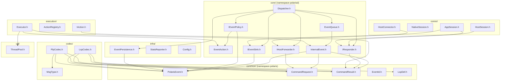
```mermaid
graph TD
    subgraph common["common/ (namespace polaris)"]
        PE[PolarisEvent.h]
        CR[CommandRequest.h]
        CRes[CommandResult.h]
        EID[EventId.h]
        LSP[LspDef.h]
    end

    subgraph core["core/ (namespace polarisd)"]
        EA[EventAction.h]
        IE[InternalEvent.h]
        IR[IResponder.h]
        IS[IEventSink.h]
        IP[IEventPolicy.h]
        IHF[IHostForwarder.h]
        EQ[EventQueue.h]
        DISP[Dispatcher.h]
    end

    subgraph codec["codec/"]
        MT[MsgType.h]
        LC[LspCodec.h]
        PC[PlpCodec.h]
    end

    subgraph comm["comm/"]
        AS_SES[AppSession.h]
        NS_SES[NativeSession.h]
        HC[HostConnector.h]
        HS[HostSession.h]
    end

    subgraph exec["execution/"]
        IA[IAction.h]
        AREG[ActionRegistry.h]
        EXEC[Executor.h]
    end

    subgraph infra["infra/"]
        EP_H[EventPersistence.h]
        SR[StatsReporter.h]
        CFG[Config.h]
    end

    subgraph util["util/"]
        TP[ThreadPool.h]
    end

    IE --> PE & CR & CRes
    IR --> CRes
    IS --> PE
    IP --> EA & PE
    IHF --> CR
    EQ --> IE
    DISP --> EQ & IR & IS & IP & IHF

    LC --> LSP & PE & CR & CRes
    PC --> MT & PE & CR & CRes

    AS_SES --> IR & IS
    HC --> IHF
    HS --> IR

    IA --> CRes
    EXEC --> IE & EA
    EXEC --> TP

    EP_H --> PE
    DISP --> EP_H
```